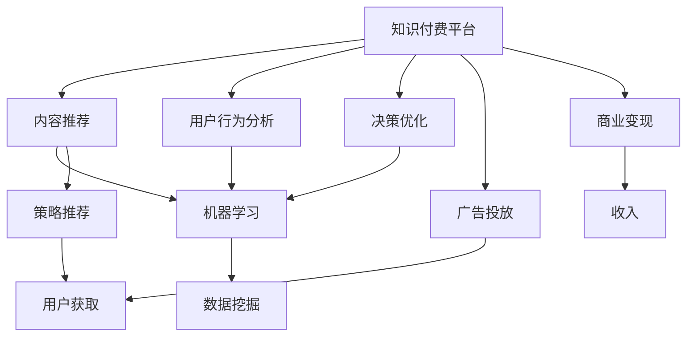

                 

# 知识付费赚钱的数据分析与决策优化

> 关键词：知识付费、数据分析、决策优化、机器学习、数据挖掘、策略推荐、用户行为、商业模式

## 1. 背景介绍

### 1.1 问题由来
随着知识付费和在线教育的兴起，越来越多的用户愿意为优质的知识内容付费。知识付费平台如得到、喜马拉雅、知识星球等，通过提供高价值、高品质的内容，满足用户的学习需求，逐渐成为内容消费的重要渠道。然而，知识付费市场竞争激烈，用户获取成本高，内容质量参差不齐，导致平台难以持续盈利。

如何通过数据分析和决策优化，提升内容推荐准确性，增强用户粘性，降低获取成本，是知识付费平台亟需解决的核心问题。本文将从数据分析和决策优化的角度，系统介绍知识付费平台的内容推荐与用户管理策略，通过深入挖掘用户行为数据，构建数据驱动的决策系统，实现知识付费平台的高效运营和盈利。

### 1.2 问题核心关键点
知识付费平台通过数据分析与决策优化，主要解决以下几个关键问题：
- 内容推荐：如何根据用户的历史行为和偏好，推荐高质量、高相关性的知识内容，提升用户体验。
- 用户获取：如何通过精准的广告投放和营销活动，吸引新用户，降低获取成本。
- 用户留存：如何通过个性化推送、学习激励等策略，增强用户粘性，减少流失。
- 商业变现：如何通过合理的定价策略和营销手段，最大化商业价值，实现平台盈利。

### 1.3 问题研究意义
通过对知识付费平台的数据分析和决策优化，可以大幅提升内容推荐准确性，降低用户获取成本，增加用户留存率，最终实现平台的持续盈利。具体而言，主要体现在以下几个方面：

1. **提升用户满意度**：通过精准的内容推荐，增强用户的学习体验，提升用户满意度，促进口碑传播。
2. **降低运营成本**：通过高效的用户获取策略，降低用户获取成本，提高平台运营效率。
3. **增加收入来源**：通过合理的商业变现策略，最大化商业价值，提升平台盈利能力。
4. **增强市场竞争力**：通过数据分析与决策优化，使平台在激烈的市场竞争中占据优势，保持持续增长。

## 2. 核心概念与联系

### 2.1 核心概念概述

为更好地理解知识付费平台的数据分析与决策优化方法，本节将介绍几个密切相关的核心概念：

- **知识付费平台**：提供在线付费课程、音频、文章等知识内容的平台，通过订阅、购买等方式收费。典型平台如得到、喜马拉雅、知识星球等。
- **内容推荐系统**：利用用户行为数据，推荐相关内容，提升用户体验，增强用户粘性。包括协同过滤、矩阵分解、神经网络等多种算法。
- **用户行为分析**：通过数据分析技术，挖掘用户行为特征，构建用户画像，了解用户需求和偏好。
- **决策优化**：利用数据驱动的方法，对平台运营、内容推荐、用户管理等决策进行优化，提升决策效果。
- **机器学习**：一种人工智能技术，通过数据训练模型，实现自动化的决策与预测。
- **数据挖掘**：从大数据中提取有用信息，用于知识发现和预测。
- **策略推荐**：根据用户行为和市场趋势，推荐合适的营销策略，提升运营效果。
- **广告投放**：通过精准的广告投放，吸引新用户，提升平台曝光率。
- **商业变现**：通过合理的定价策略和营销手段，最大化商业价值，实现平台盈利。

这些核心概念之间的逻辑关系可以通过以下Mermaid流程图来展示：



这个流程图展示的知识付费平台的各个模块之间的核心关系：

1. 知识付费平台通过内容推荐系统，提升用户体验和用户粘性。
2. 用户行为分析模块，挖掘用户行为特征，构建用户画像，了解用户需求和偏好。
3. 决策优化模块，利用数据驱动的方法，对平台运营、内容推荐、用户管理等决策进行优化。
4. 机器学习模块，通过数据训练模型，实现自动化的决策与预测。
5. 数据挖掘模块，从大数据中提取有用信息，用于知识发现和预测。
6. 广告投放模块，通过精准的广告投放，吸引新用户，提升平台曝光率。
7. 商业变现模块，通过合理的定价策略和营销手段，最大化商业价值，实现平台盈利。
8. 策略推荐模块，根据用户行为和市场趋势，推荐合适的营销策略，提升运营效果。

这些概念共同构成了知识付费平台的核心业务逻辑，使其能够在用户获取、内容推荐、用户留存、商业变现等方面形成闭环，实现平台的高效运营和盈利。

## 3. 核心算法原理 & 具体操作步骤

### 3.1 算法原理概述

知识付费平台的数据分析和决策优化，本质上是一个数据驱动的决策过程。其核心思想是：通过分析用户行为数据，构建用户画像，利用机器学习等技术，优化内容推荐、广告投放、商业变现等决策，从而提升用户体验，降低运营成本，增加商业价值。

具体而言，主要包括以下几个关键步骤：

1. **数据收集与预处理**：收集平台用户的行为数据、交易数据、社交数据等，进行清洗和预处理，构建数据集。
2. **用户画像构建**：利用数据挖掘技术，挖掘用户行为特征，构建用户画像，了解用户需求和偏好。
3. **内容推荐优化**：利用机器学习算法，构建内容推荐模型，提升内容推荐准确性，增强用户粘性。
4. **广告投放优化**：通过数据分析，优化广告投放策略，提高广告效果，降低获取成本。
5. **商业变现优化**：分析用户消费行为，制定合理的定价策略和营销手段，提升商业变现能力，实现平台盈利。
6. **决策优化反馈**：通过A/B测试等方法，验证决策效果，进行持续优化，提升运营效率。

### 3.2 算法步骤详解

以下是知识付费平台数据分析与决策优化的详细步骤：

**Step 1: 数据收集与预处理**
- 收集平台用户的行为数据，包括但不限于课程购买、课程评价、视频播放、评论互动等。
- 收集交易数据，如用户订阅情况、付费记录、退款记录等。
- 收集社交数据，如用户好友关系、社群互动、内容分享等。
- 清洗和预处理数据，去除噪声、缺失值、异常值等，构建干净的数据集。

**Step 2: 用户画像构建**
- 利用数据挖掘技术，如K-means聚类、因子分析等，挖掘用户行为特征，构建用户画像。
- 定义用户的兴趣、行为、背景等维度，建立多维度的用户特征向量。
- 通过可视化工具，如Tableau、Power BI等，展示用户画像的分布和特征，帮助理解用户群体。

**Step 3: 内容推荐优化**
- 选择合适的推荐算法，如协同过滤、矩阵分解、深度学习等，训练内容推荐模型。
- 使用监督学习方法，如交叉验证、网格搜索等，进行模型调参，提升推荐效果。
- 利用A/B测试等方法，验证推荐模型效果，优化推荐算法和参数。

**Step 4: 广告投放优化**
- 分析用户行为数据，提取用户特征，构建广告投放模型。
- 选择合适的广告投放平台和渠道，进行定向投放，提高广告效果。
- 实时监控广告投放效果，分析用户转化率、点击率等指标，进行持续优化。

**Step 5: 商业变现优化**
- 分析用户消费行为，如购买路径、付费时长、会员订阅情况等，构建用户画像。
- 根据用户画像，制定合理的定价策略和营销手段，提升用户留存率和付费率。
- 利用数据分析，优化促销活动和优惠策略，提升商业变现能力。

**Step 6: 决策优化反馈**
- 通过A/B测试等方法，验证决策效果，进行持续优化。
- 分析用户反馈，收集用户意见和建议，进行改进和优化。
- 定期评估决策效果，调整和优化策略，提升平台运营效率。

### 3.3 算法优缺点

知识付费平台的数据分析和决策优化方法具有以下优点：
1. 精准推荐：通过数据分析和机器学习，实现精准的内容推荐，提升用户体验，增加用户粘性。
2. 成本降低：通过优化广告投放和用户获取策略，降低用户获取成本，提高平台运营效率。
3. 收入提升：通过合理的定价策略和营销手段，最大化商业价值，提升平台盈利能力。
4. 决策透明：数据驱动的决策过程，具有较高的透明度和可解释性，便于监控和优化。

同时，该方法也存在以下局限性：
1. 数据依赖度高：数据分析和决策优化依赖于平台数据的全面性和质量。
2. 用户隐私问题：平台需要收集和处理大量用户数据，涉及用户隐私保护问题。
3. 技术门槛高：数据分析和机器学习等技术，需要较高的技术门槛和专业技能。
4. 模型复杂性：复杂的推荐算法和广告投放模型，需要大量计算资源和时间成本。
5. 模型解释性差：部分推荐和广告模型难以解释其决策逻辑，影响用户信任度。

尽管存在这些局限性，但就目前而言，数据驱动的决策优化方法仍是在线教育平台的重要选择。未来相关研究的重点在于如何进一步降低技术门槛，优化模型解释性，提高数据安全和隐私保护，从而实现更加智能和可靠的知识付费平台。

### 3.4 算法应用领域

基于知识付费平台的数据分析和决策优化方法，已经在多个领域得到应用，如在线教育、在线旅游、电商平台等，为平台运营提供了有力的技术支持。

- **在线教育**：利用内容推荐系统，提升课程推荐准确性，增加用户购买率。通过用户行为分析，优化用户获取和留存策略。
- **在线旅游**：分析用户出行偏好，推荐合适的旅游路线和酒店。通过实时监控，优化广告投放效果，提高平台曝光率。
- **电商平台**：分析用户购买行为，推荐相关商品，提升用户体验。通过数据分析，优化促销活动，提升商业变现能力。

除了上述这些领域外，数据分析和决策优化方法还将被创新性地应用到更多场景中，如智能家居、健康医疗、金融服务等领域，为平台运营带来新的突破。

## 4. 数学模型和公式 & 详细讲解 & 举例说明

### 4.1 数学模型构建

本节将使用数学语言对知识付费平台的数据分析和决策优化过程进行更加严格的刻画。

记用户为 $U$，课程为 $C$，行为为 $B$，交易为 $T$，社交为 $S$，广告为 $A$，收益为 $R$。则平台的数据模型可以表示为：

- 用户行为模型：$B = f(U, C)$
- 用户交易模型：$T = g(U, C)$
- 用户社交模型：$S = h(U, C)$
- 广告投放模型：$A = j(U, C)$
- 商业变现模型：$R = k(U, C)$

其中 $f$、$g$、$h$、$j$、$k$ 为不同的模型函数，用于描述用户行为、交易、社交、广告投放和商业变现等过程。

### 4.2 公式推导过程

以下是知识付费平台中几个核心数学模型的推导过程：

**用户行为模型**
$$
B = f(U, C) = \alpha_1(U) \cdot \beta_1(C) + \alpha_2(U) \cdot \beta_2(C) + \ldots
$$

其中 $\alpha_i(U)$ 和 $\beta_i(C)$ 分别表示用户特征和课程特征的权重。通过矩阵分解等技术，可以进一步简化模型，提升预测精度。

**用户交易模型**
$$
T = g(U, C) = \delta_1(U) \cdot \gamma_1(C) + \delta_2(U) \cdot \gamma_2(C) + \ldots
$$

其中 $\delta_i(U)$ 和 $\gamma_i(C)$ 分别表示用户特征和课程特征的权重。通过构建多维度的用户画像，可以更准确地预测用户交易行为。

**广告投放模型**
$$
A = j(U, C) = \phi_1(U) \cdot \psi_1(C) + \phi_2(U) \cdot \psi_2(C) + \ldots
$$

其中 $\phi_i(U)$ 和 $\psi_i(C)$ 分别表示用户特征和课程特征的权重。通过优化广告投放模型，可以提高广告投放效果，降低获取成本。

**商业变现模型**
$$
R = k(U, C) = \epsilon_1(U) \cdot \zeta_1(C) + \epsilon_2(U) \cdot \zeta_2(C) + \ldots
$$

其中 $\epsilon_i(U)$ 和 $\zeta_i(C)$ 分别表示用户特征和课程特征的权重。通过优化商业变现模型，可以提高商业变现能力，实现平台盈利。

### 4.3 案例分析与讲解

以知识付费平台的内容推荐系统为例，分析其数学模型的构建与优化过程：

**Step 1: 数据收集**
- 收集用户历史行为数据，包括课程观看时长、评价评分、互动评论等。
- 构建用户-课程行为矩阵 $\mathbf{B}$，用于表示用户对课程的兴趣程度。

**Step 2: 数据预处理**
- 对行为矩阵 $\mathbf{B}$ 进行归一化处理，去除噪声和异常值。
- 使用奇异值分解(SVD)等技术，进行矩阵分解，得到用户特征和课程特征的权重矩阵 $\mathbf{U}$ 和 $\mathbf{V}$。

**Step 3: 模型构建**
- 根据分解后的权重矩阵 $\mathbf{U}$ 和 $\mathbf{V}$，构建用户-课程兴趣矩阵 $\mathbf{I}$。
- 将 $\mathbf{I}$ 作为内容推荐模型的输入，预测用户对新课程的兴趣度。

**Step 4: 模型优化**
- 利用监督学习算法，如随机梯度下降(SGD)等，对内容推荐模型进行训练和优化。
- 使用交叉验证等方法，验证模型效果，进行参数调优。

通过上述步骤，知识付费平台可以实现精准的内容推荐，提升用户体验和用户粘性。在实际应用中，还需要结合用户画像构建、广告投放优化、商业变现策略等环节，构建数据驱动的决策系统，实现平台的持续运营和盈利。

## 5. 项目实践：代码实例和详细解释说明

### 5.1 开发环境搭建

在进行数据分析与决策优化实践前，我们需要准备好开发环境。以下是使用Python进行Scikit-learn和TensorFlow开发的环境配置流程：

1. 安装Anaconda：从官网下载并安装Anaconda，用于创建独立的Python环境。

2. 创建并激活虚拟环境：
```bash
conda create -n data-opt python=3.8 
conda activate data-opt
```

3. 安装Scikit-learn：
```bash
pip install scikit-learn
```

4. 安装TensorFlow：
```bash
pip install tensorflow
```

5. 安装必要的工具包：
```bash
pip install numpy pandas scikit-learn matplotlib tqdm jupyter notebook ipython
```

完成上述步骤后，即可在`data-opt`环境中开始数据分析与决策优化实践。

### 5.2 源代码详细实现

这里我们以知识付费平台的用户行为分析为例，给出使用Scikit-learn和TensorFlow进行数据分析的PyTorch代码实现。

首先，定义用户行为数据处理函数：

```python
import pandas as pd
from sklearn.preprocessing import StandardScaler

def load_and_process_data(file_path):
    data = pd.read_csv(file_path)
    # 处理缺失值
    data.fillna(data.mean(), inplace=True)
    # 特征缩放
    scaler = StandardScaler()
    data['behavior_score'] = scaler.fit_transform(data[['behavior_1', 'behavior_2', 'behavior_3']])
    return data

# 加载并处理用户行为数据
data = load_and_process_data('user_behavior.csv')
```

然后，定义用户行为分析模型：

```python
from sklearn.ensemble import RandomForestRegressor

# 构建随机森林模型
model = RandomForestRegressor(n_estimators=100, random_state=42)
# 训练模型
model.fit(data[['behavior_1', 'behavior_2', 'behavior_3']], data['transaction_amount'])
# 预测新用户行为
new_user_behavior = load_and_process_data('new_user_behavior.csv')
predicted_amount = model.predict(new_user_behavior[['behavior_1', 'behavior_2', 'behavior_3']])
```

最后，输出预测结果并可视化：

```python
import matplotlib.pyplot as plt

# 绘制预测结果图
plt.scatter(new_user_behavior['behavior_1'], predicted_amount)
plt.xlabel('Behavior_1')
plt.ylabel('Transaction_Amount')
plt.title('User Behavior Prediction')
plt.show()
```

以上就是使用Scikit-learn和TensorFlow进行用户行为分析的完整代码实现。可以看到，通过简单的数据处理和模型构建，我们便能够预测新用户的交易金额，辅助平台的营销决策。

### 5.3 代码解读与分析

让我们再详细解读一下关键代码的实现细节：

**load_and_process_data函数**：
- 用于加载和预处理用户行为数据，处理缺失值和特征缩放。
- 使用均值填充缺失值，避免影响模型预测。
- 使用标准差缩放行为特征，使不同特征在同一尺度上比较。

**RandomForestRegressor模型**：
- 定义一个随机森林回归模型，用于预测用户交易金额。
- 通过设置树的数量和随机种子，确保模型预测的稳定性和可重复性。
- 训练模型时，使用行为数据作为特征，交易金额作为目标变量。
- 预测新用户行为时，使用加载的新行为数据作为输入，预测交易金额。

**绘图展示预测结果**：
- 使用matplotlib绘制预测结果图，展示新用户的行为预测结果。
- 通过可视化分析，帮助理解预测结果的分布情况，优化模型参数。

在实际应用中，开发者可以根据具体需求，进一步扩展模型功能和优化算法性能。例如，使用深度学习算法（如TensorFlow或PyTorch）进行复杂的用户画像构建，利用强化学习优化广告投放策略，结合商业智能(BI)工具进行决策支持等。

## 6. 实际应用场景

### 6.1 智能推荐系统

智能推荐系统是知识付费平台的核心功能之一，通过分析用户行为数据，构建用户画像，推荐高质量、高相关性的内容，提升用户体验和用户粘性。具体应用场景包括：

- **课程推荐**：根据用户历史观看记录、评价评分、互动评论等，推荐用户可能感兴趣的课程。
- **专题推荐**：根据用户兴趣点，推荐相关专题内容，如某领域经典书籍、论文等。
- **广告推荐**：根据用户行为特征，推荐合适的广告内容，增加平台曝光率。

### 6.2 用户行为分析

用户行为分析是知识付费平台数据分析的重要组成部分，通过挖掘用户行为特征，构建用户画像，了解用户需求和偏好，优化运营策略。具体应用场景包括：

- **用户分群**：根据用户行为数据，将用户分成不同的群体，如高价值用户、潜在流失用户等。
- **行为预测**：利用机器学习模型，预测用户未来的行为，如购买意愿、课程评价等。
- **个性化推送**：根据用户画像，推送个性化的学习内容、活动提醒等，提升用户满意度。

### 6.3 广告投放优化

广告投放优化是知识付费平台降低运营成本、增加用户获取的重要手段。通过数据分析和机器学习，优化广告投放策略，提高广告效果，降低获取成本。具体应用场景包括：

- **广告定向**：根据用户画像，选择适合的广告平台和渠道，进行定向投放。
- **广告效果监控**：实时监控广告投放效果，分析用户点击率、转化率等指标，进行持续优化。
- **广告预算优化**：根据广告效果和用户反馈，优化广告预算分配，提高广告投放ROI。

### 6.4 商业变现优化

商业变现优化是知识付费平台实现盈利的关键环节。通过数据分析和决策优化，制定合理的定价策略和营销手段，提升商业变现能力，实现平台盈利。具体应用场景包括：

- **定价策略**：分析用户消费行为，制定合理的课程定价策略，增加用户购买率。
- **促销活动**：根据用户行为数据，优化促销活动和优惠策略，提升商业变现能力。
- **会员订阅**：通过数据分析，优化会员订阅策略，增加会员数量和续订率。

### 6.5 未来应用展望

随着知识付费平台的数据分析和决策优化技术的不断发展，未来将涌现更多创新的应用场景，为平台运营带来新的突破。

- **个性化推荐**：通过更精准的用户画像和推荐算法，提升内容推荐效果，增强用户粘性。
- **智能客服**：利用自然语言处理技术，构建智能客服系统，提升用户服务体验。
- **内容创作**：通过数据分析，引导优质内容创作，提升平台内容质量。
- **用户管理**：通过数据分析，优化用户行为分析和用户管理策略，提升运营效率。

## 7. 工具和资源推荐

### 7.1 学习资源推荐

为了帮助开发者系统掌握知识付费平台的数据分析和决策优化方法，这里推荐一些优质的学习资源：

1. 《机器学习实战》系列博文：由机器学习专家撰写，详细介绍机器学习算法和实践，适合初学者入门。
2. 《深度学习入门》课程：斯坦福大学开设的深度学习课程，提供丰富的教学资源和实践案例。
3. 《自然语言处理入门》书籍：全面介绍自然语言处理技术，涵盖推荐系统、情感分析、用户画像等内容。
4. Kaggle平台：数据科学竞赛平台，提供海量数据集和优秀算法案例，适合实践和竞赛学习。
5. Coursera平台：提供大数据、机器学习、深度学习等课程，适合系统学习。

通过对这些资源的学习实践，相信你一定能够快速掌握知识付费平台的数据分析和决策优化方法，并用于解决实际的运营问题。

### 7.2 开发工具推荐

高效的开发离不开优秀的工具支持。以下是几款用于知识付费平台数据分析与决策优化的常用工具：

1. Scikit-learn：Python机器学习库，提供丰富的算法和工具，适合快速迭代研究。
2. TensorFlow：由Google主导的深度学习框架，生产部署方便，适合大规模工程应用。
3. PyTorch：Facebook开发的深度学习框架，动态计算图，适合研究和实验。
4. Jupyter Notebook：交互式Python环境，方便开发和调试，支持多语言混合编写。
5. Tableau：数据可视化工具，提供丰富的图表和分析功能，适合数据展示和报告。
6. Power BI：微软的数据分析工具，提供强大的数据可视化和大数据分析功能。

合理利用这些工具，可以显著提升知识付费平台的数据分析和决策优化效率，加快创新迭代的步伐。

### 7.3 相关论文推荐

知识付费平台的数据分析和决策优化技术依赖于学界的持续研究。以下是几篇奠基性的相关论文，推荐阅读：

1. A Survey of Recommendation System Technologies（推荐系统综述）：全面介绍推荐系统的发展历程、算法和应用。
2. Information Retrieval：经典信息检索教材，涵盖文本检索、数据挖掘、机器学习等内容。
3. Recommender Systems Handbook：推荐系统手册，详细介绍了各种推荐算法和系统设计。
4. Deep Learning for Recommender Systems（深度学习在推荐系统中的应用）：利用深度学习技术优化推荐算法，提升推荐效果。
5. Click-through Prediction in Recommendation Systems（推荐系统点击率预测）：通过点击率预测优化推荐算法，提升推荐效果。

这些论文代表了大数据与人工智能技术在知识付费平台的应用方向，通过学习这些前沿成果，可以帮助研究者把握学科前进方向，激发更多的创新灵感。

## 8. 总结：未来发展趋势与挑战

### 8.1 总结

本文对知识付费平台的数据分析和决策优化方法进行了全面系统的介绍。首先阐述了知识付费平台的数据分析与决策优化的背景和意义，明确了数据分析与决策优化在平台运营中的核心作用。其次，从原理到实践，详细讲解了知识付费平台的内容推荐、用户行为分析、广告投放和商业变现等核心环节的优化过程，给出了数据分析与决策优化的完整代码实例。同时，本文还广泛探讨了数据分析与决策优化在智能推荐、用户行为分析、广告投放和商业变现等领域的实际应用，展示了知识付费平台的数据分析与决策优化技术的广阔前景。

通过对这些关键技术的学习和实践，可以显著提升知识付费平台的运营效率和盈利能力。相信随着数据分析与决策优化技术的不断进步，知识付费平台必将在内容推荐、用户管理、广告投放和商业变现等方面不断创新，实现更高的运营效率和盈利水平。

### 8.2 未来发展趋势

展望未来，知识付费平台的数据分析和决策优化技术将呈现以下几个发展趋势：

1. **算法优化**：通过引入深度学习、强化学习等先进算法，提升推荐、广告投放和商业变现的效果。
2. **数据融合**：将多源数据融合，构建全貌的用户画像，提升推荐和决策的准确性。
3. **实时分析**：利用实时数据流处理技术，进行实时分析，优化运营决策。
4. **隐私保护**：加强用户隐私保护，确保数据安全和合规性。
5. **用户个性化**：通过个性化推荐和动态调整，增强用户体验，提升用户粘性。
6. **商业变现**：探索更多商业变现模式，如内容付费、会员订阅、增值服务等。

这些趋势展示了数据分析与决策优化技术在未来知识付费平台中的重要应用方向，为平台运营带来了新的机遇和挑战。

### 8.3 面临的挑战

尽管知识付费平台的数据分析和决策优化技术已经取得了显著成果，但在迈向更加智能化、普适化应用的过程中，仍面临诸多挑战：

1. **数据质量问题**：数据分析依赖于平台数据的全面性和质量。数据缺失、噪声等问题会影响模型预测的准确性。
2. **用户隐私保护**：平台需要收集和处理大量用户数据，涉及用户隐私保护问题，需严格遵守相关法律法规。
3. **技术门槛高**：数据分析和决策优化依赖于高水平的技术和专业知识，需培养和引入专业人才。
4. **模型复杂性**：复杂的推荐和广告模型，需要大量计算资源和时间成本，需优化算法性能。
5. **模型解释性差**：部分推荐和广告模型难以解释其决策逻辑，影响用户信任度，需提升模型可解释性。

尽管存在这些挑战，但相信随着技术的进步和实践经验的积累，知识付费平台的数据分析和决策优化技术将不断成熟，为平台的运营提供强有力的技术支撑。

### 8.4 研究展望

面对知识付费平台数据分析与决策优化所面临的挑战，未来的研究需要在以下几个方面寻求新的突破：

1. **数据收集与处理**：提高数据收集和处理的自动化水平，减少人工干预和成本。
2. **数据安全与隐私**：加强数据安全防护和隐私保护，确保用户数据安全。
3. **模型可解释性**：提升推荐和广告模型的可解释性，增强用户信任度。
4. **算法优化**：通过优化算法性能，降低计算资源和时间成本，提高模型预测速度。
5. **多模态融合**：将文本、图像、语音等多模态数据融合，提升推荐和决策的全面性。
6. **跨领域应用**：将数据分析与决策优化技术应用于更多垂直行业，推动产业升级。

这些研究方向的探索发展，必将引领知识付费平台的数据分析和决策优化技术迈向更高的台阶，为平台运营带来新的突破。面向未来，数据分析与决策优化技术需要与其他人工智能技术进行更深入的融合，如自然语言处理、计算机视觉等，协同发力，共同推动知识付费平台的持续发展和用户价值的提升。

## 9. 附录：常见问题与解答

**Q1：知识付费平台如何利用数据分析进行内容推荐？**

A: 知识付费平台利用数据分析进行内容推荐，主要通过以下步骤：

1. 收集用户行为数据，包括课程观看时长、评价评分、互动评论等。
2. 构建用户-课程行为矩阵 $\mathbf{B}$，用于表示用户对课程的兴趣程度。
3. 利用矩阵分解等技术，对行为矩阵 $\mathbf{B}$ 进行分解，得到用户特征和课程特征的权重矩阵 $\mathbf{U}$ 和 $\mathbf{V}$。
4. 根据分解后的权重矩阵 $\mathbf{U}$ 和 $\mathbf{V}$，构建用户-课程兴趣矩阵 $\mathbf{I}$。
5. 将 $\mathbf{I}$ 作为内容推荐模型的输入，预测用户对新课程的兴趣度。
6. 利用推荐算法（如协同过滤、矩阵分解、深度学习等），优化内容推荐模型，提升推荐效果。

通过上述步骤，知识付费平台可以实现精准的内容推荐，提升用户体验和用户粘性。

**Q2：知识付费平台如何通过数据分析进行用户行为分析？**

A: 知识付费平台通过数据分析进行用户行为分析，主要通过以下步骤：

1. 收集用户行为数据，包括课程购买、课程评价、视频播放、评论互动等。
2. 构建用户行为特征向量，如观看时长、评分、互动评论等。
3. 利用数据挖掘技术，如K-means聚类、因子分析等，挖掘用户行为特征，构建用户画像。
4. 通过可视化工具，如Tableau、Power BI等，展示用户画像的分布和特征，帮助理解用户群体。
5. 根据用户画像，优化用户获取和留存策略，提升运营效率。

通过上述步骤，知识付费平台可以深入挖掘用户行为特征，构建多维度的用户画像，了解用户需求和偏好，优化运营策略。

**Q3：知识付费平台如何进行广告投放优化？**

A: 知识付费平台通过数据分析进行广告投放优化，主要通过以下步骤：

1. 收集用户行为数据，提取用户特征，如性别、年龄、兴趣等。
2. 选择合适的广告投放平台和渠道，进行定向投放。
3. 实时监控广告投放效果，分析用户点击率、转化率等指标，进行持续优化。
4. 利用A/B测试等方法，验证广告投放效果，优化广告策略。

通过上述步骤，知识付费平台可以优化广告投放策略，提高广告效果，降低用户获取成本。

**Q4：知识付费平台如何进行商业变现优化？**

A: 知识付费平台通过数据分析进行商业变现优化，主要通过以下步骤：

1. 分析用户消费行为，如购买路径、付费时长、会员订阅情况等。
2. 根据用户画像，制定合理的定价策略和营销手段，提升用户留存率和付费率。
3. 利用数据分析，优化促销活动和优惠策略，提升商业变现能力。
4. 定期评估决策效果，调整和优化策略，提升运营效率。

通过上述步骤，知识付费平台可以提高商业变现能力，实现平台盈利。

**Q5：知识付费平台如何进行决策优化反馈？**

A: 知识付费平台通过数据分析进行决策优化反馈，主要通过以下步骤：

1. 通过A/B测试等方法，验证决策效果，进行持续优化。
2. 分析用户反馈，收集用户意见和建议，进行改进和优化。
3. 定期评估决策效果，调整和优化策略，提升运营效率。

通过上述步骤，知识付费平台可以进行持续优化，提升决策效果，确保平台运营的稳定性和效率。

---

作者：禅与计算机程序设计艺术 / Zen and the Art of Computer Programming

