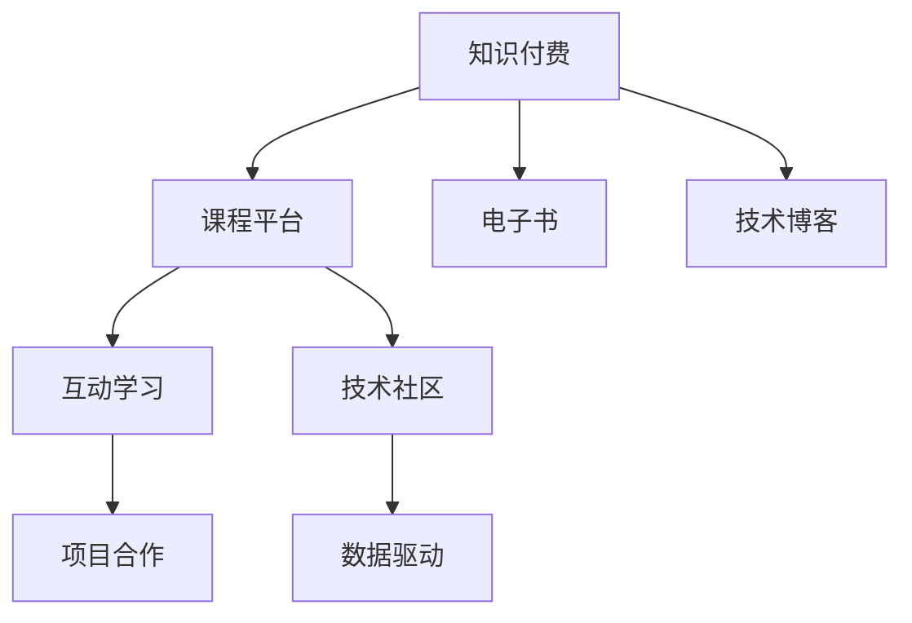

                 

# 知识付费：程序员的社群运营方法

在互联网科技飞速发展的今天，知识付费已经成为一种快速且有效的学习方式，尤其在程序员这一专业性强的群体中，其作用尤为显著。程序员社群的兴起，让知识付费更加便捷、高效，同时也为程序员提供了更广阔的交流和协作平台。本文将从背景介绍、核心概念与联系、核心算法原理与操作步骤、数学模型和公式、项目实践、实际应用场景、工具和资源推荐、总结与发展趋势与挑战等几个方面，探讨知识付费在程序员社群中的运营方法。

## 1. 背景介绍

### 1.1 问题由来
随着互联网技术的快速发展，知识获取的门槛逐渐降低，程序员这一群体面临着巨大的学习和知识更新压力。传统的学习方式如书籍、论文、在线课程等，虽然内容丰富，但学习周期长，针对性不强，难以满足程序员快速获取新知识的需求。

### 1.2 问题核心关键点
知识付费作为解决这一问题的有效手段，它通过按需提供高质量、结构化的知识内容，使程序员可以随时随地进行高效学习。其核心在于构建一个互动性强、内容丰富的知识分享平台，让程序员在社群中交流、学习和成长。

### 1.3 问题研究意义
对于程序员社群的运营，知识付费的价值不仅在于知识本身，更在于它所构建的互动性学习环境。通过知识付费平台，程序员可以获得最新的技术资讯、行业动态、项目经验等，加速自身技术进步和职业发展。同时，运营成功的社群可以为平台带来持续的流量和收益，形成良性循环，推动技术的普及和应用。

## 2. 核心概念与联系

### 2.1 核心概念概述

本文将重点介绍几个与知识付费和程序员社群运营密切相关的核心概念：

- **知识付费**：指用户为获取高质量、结构化知识内容而支付费用的模式，包括线上课程、电子书、技术博客、视频教程等多种形式。
- **程序员社群**：由程序员组成的专业社交平台，旨在提供技术交流、问题解决、职业发展等服务，促进知识的共享和传播。
- **互动学习**：通过互动讨论、项目合作、技术分享等方式，增强知识学习效果，培养团队的协作精神和创新能力。
- **技术社区**：以技术交流为核心，提供工具、文档、案例分析等支持，支持技术开发者间的合作与创新。
- **数据驱动**：利用大数据和人工智能技术，分析用户行为数据，精准推送个性化内容，提高学习效率和用户体验。

### 2.2 核心概念原理和架构的 Mermaid 流程图



以上流程图展示了知识付费与程序员社群运营的核心流程：

1. **知识付费**：通过课程平台、电子书、技术博客等形式提供高质量知识内容。
2. **互动学习**：在课程平台进行互动讨论、项目合作，促进知识吸收和应用。
3. **技术社区**：提供工具、文档、案例分析等支持，支持技术开发者间的合作与创新。
4. **数据驱动**：利用大数据和人工智能技术，分析用户行为数据，精准推送个性化内容。

## 3. 核心算法原理 & 具体操作步骤

### 3.1 算法原理概述

知识付费和程序员社群运营的核心算法原理主要围绕以下几个方面展开：

- **个性化推荐算法**：利用用户行为数据，推荐个性化的课程、博客等学习内容。
- **互动学习算法**：通过问答、讨论、项目合作等方式，促进用户间的互动和知识共享。
- **技术社区算法**：利用社交网络分析，构建技术开发者间的连接，形成合作和知识传播的网络。
- **数据驱动算法**：通过数据分析，发现用户需求和行为趋势，优化内容和运营策略。

### 3.2 算法步骤详解

以下是一个具体的算法步骤详解：

1. **用户注册与数据采集**：用户注册并上传个人简历、学习历史等基本信息，平台采集用户数据，构建用户画像。
2. **个性化推荐**：利用协同过滤、内容推荐等算法，根据用户画像，推荐适合的课程、博客等内容。
3. **互动学习**：在课程和博客下发起讨论、问答、项目合作，促进用户互动，增加知识共享。
4. **社区构建**：利用社交网络分析算法，构建技术开发者间的连接，形成技术社区。
5. **数据分析**：通过大数据分析，发现用户需求和行为趋势，优化内容和运营策略。

### 3.3 算法优缺点

**优点**：

- **高效性**：个性化推荐和数据驱动算法能够迅速响应用户需求，提高学习效率。
- **互动性**：互动学习算法促进用户间的交流，增加知识共享和社区凝聚力。
- **适用性广**：适用于各种规模的知识付费平台和程序员社群。

**缺点**：

- **数据隐私问题**：大量用户数据的收集和使用可能引发隐私问题。
- **算法复杂性**：个性化推荐和数据驱动算法需要复杂的模型训练，可能导致资源消耗大。
- **内容质量参差不齐**：课程和博客等内容的质量和深度不一，影响用户体验。

### 3.4 算法应用领域

知识付费和程序员社群运营的核心算法主要应用于以下几个领域：

1. **在线教育平台**：如Coursera、Udacity等，提供高质量课程和个性化推荐。
2. **技术博客平台**：如掘金、博客园等，提供技术文章和互动讨论。
3. **技术社交网络**：如Stack Overflow、GitHub等，构建开发者之间的连接和合作。
4. **企业内训平台**：如AlgoExpert、LeetCode等，提供项目练习和个性化学习。

## 4. 数学模型和公式 & 详细讲解 & 举例说明

### 4.1 数学模型构建

知识付费和程序员社群运营的数学模型主要包括以下几个方面：

- **协同过滤模型**：基于用户行为数据，推荐相似的课程和博客。
- **内容推荐模型**：根据课程和博客的关键词、标签等信息，进行内容推荐。
- **社交网络模型**：描述技术开发者之间的连接关系和社区结构。
- **数据分析模型**：通过机器学习模型，分析用户行为数据，发现需求和趋势。

### 4.2 公式推导过程

**协同过滤模型**：

设 $u$ 为用户，$v$ 为课程或博客，$R$ 为用户和课程/博客的评分矩阵，$p$ 为推荐向量，则协同过滤模型公式为：

$$
p = \alpha u \times V^T (R - \beta VU^TU) + \gamma
$$

其中，$\alpha$ 为系数，$V$ 为课程/博客向量，$R$ 为评分矩阵，$\beta$ 为衰减系数，$U$ 为用户向量。

**内容推荐模型**：

设 $d$ 为文档向量，$x$ 为查询向量，则余弦相似度模型公式为：

$$
\text{similarity}(d, x) = \frac{d \cdot x}{\|d\|\|x\|}
$$

其中，$d$ 和 $x$ 为向量，$\cdot$ 为点积，$\|\cdot\|$ 为向量范数。

### 4.3 案例分析与讲解

**案例：推荐系统优化**

某在线教育平台采用协同过滤算法进行课程推荐，但在高稀疏度数据环境下，推荐效果不佳。通过引入内容推荐模型，结合用户行为数据和课程元数据，提升了推荐准确性。

具体来说，平台首先对用户和课程进行协同过滤，得到初步推荐列表。然后，利用内容推荐模型对课程的关键词、标签等信息进行打分，优化推荐向量 $p$。最后，通过加权求和的方式，将协同过滤结果和内容推荐结果结合，输出最终推荐列表。

## 5. 项目实践：代码实例和详细解释说明

### 5.1 开发环境搭建

在进行知识付费和程序员社群运营项目开发时，需要搭建一个完整的开发环境。以下是一些关键步骤：

1. **安装Python**：选择3.8版本及以上，使用Anaconda进行环境管理。
2. **安装Django**：Django是Python的Web框架，适合搭建知识付费平台。
3. **安装Flask**：Flask是一个轻量级Web框架，适合搭建技术博客和互动学习平台。
4. **安装TensorFlow**：TensorFlow提供了丰富的机器学习库，用于数据分析和个性化推荐。

### 5.2 源代码详细实现

以下是一个简单的课程推荐系统实现示例：

```python
import numpy as np
from scipy.sparse import coo_matrix

def collaborative_filtering(ratings, num_users, num_items, num_factors=10, alpha=0.5, beta=0.5, gamma=0.1):
    # 用户矩阵 U
    U = np.random.randn(num_users, num_factors)
    # 物品矩阵 V
    V = np.random.randn(num_items, num_factors)
    # 初始化评分矩阵 R
    R = np.dot(U, V.T)

    # 协同过滤算法
    for _ in range(100):
        for u in range(num_users):
            for v in range(num_items):
                if ratings.get((u, v)) is not None:
                    # 评分偏差
                    r = ratings[u, v]
                    # 预测评分
                    p = np.dot(U[u], V[v].T)
                    # 损失函数
                    loss = (r - p) ** 2
                    # 梯度下降
                    dU = 2 * (r - p) * V[v]
                    dV = 2 * (r - p) * U[u]
                    # 更新参数
                    U[u] -= alpha * dU + beta * np.dot(V[v], U[u])
                    V[v] -= alpha * dV + beta * np.dot(U[u], V[v].T)
                    R[u, v] -= gamma * (r - p)

    return R, U, V

def content_based_filtering(docs, num_docs, num_terms, num_factors=10, alpha=0.5, beta=0.5, gamma=0.1):
    # 文档向量 D
    D = np.random.randn(num_docs, num_terms, num_factors)
    # 查询向量 q
    q = np.random.randn(num_terms, num_factors)

    # 内容推荐模型
    for _ in range(100):
        for d in range(num_docs):
            for t in range(num_terms):
                if docs.get(d, t) is not None:
                    # 预测评分
                    p = np.dot(D[d, t], q)
                    # 损失函数
                    loss = (p - docs[d, t]) ** 2
                    # 梯度下降
                    dD = 2 * (p - docs[d, t]) * q
                    dq = 2 * (p - docs[d, t]) * D[d, t]
                    # 更新参数
                    D[d, t] -= alpha * dD + beta * np.dot(D[d, t], q)
                    q -= alpha * dq + beta * np.dot(D[d, t], q)

    return D, q

# 协同过滤和内容推荐结合
def hybrid_filtering(ratings, docs, num_users, num_items, num_terms, num_factors=10, alpha=0.5, beta=0.5, gamma=0.1):
    # 协同过滤结果
    R_cf, U_cf, V_cf = collaborative_filtering(ratings, num_users, num_items, num_factors=num_factors, alpha=alpha, beta=beta, gamma=gamma)
    # 内容推荐结果
    D_cb, q_cb = content_based_filtering(docs, num_items, num_terms, num_factors=num_factors, alpha=alpha, beta=beta, gamma=gamma)
    # 加权求和
    R_hybrid = alpha * R_cf + beta * np.dot(U_cf, D_cb.T)

    return R_hybrid, U_cf, V_cf, D_cb, q_cb
```

### 5.3 代码解读与分析

在上述代码中，我们定义了三个函数，分别用于协同过滤、内容推荐和结合两种算法的混合推荐。

**协同过滤算法**：

- `collaborative_filtering` 函数采用梯度下降算法，对用户和物品的评分矩阵进行优化，得到最终的协同过滤结果。
- 在每次迭代中，对于每个用户和物品，计算预测评分 $p$ 和实际评分的偏差 $r$，并根据公式更新用户和物品矩阵 $U$ 和 $V$。
- 迭代结束后，返回协同过滤结果 $R$、用户矩阵 $U$ 和物品矩阵 $V$。

**内容推荐算法**：

- `content_based_filtering` 函数同样采用梯度下降算法，对文档向量 $D$ 和查询向量 $q$ 进行优化，得到内容推荐结果。
- 在每次迭代中，对于每个文档和每个术语，计算预测评分 $p$ 和实际评分的偏差 $r$，并根据公式更新文档向量 $D$ 和查询向量 $q$。
- 迭代结束后，返回内容推荐结果 $D$ 和查询向量 $q$。

**混合推荐算法**：

- `hybrid_filtering` 函数结合协同过滤和内容推荐算法，得到混合推荐结果。
- 在每次迭代中，对协同过滤结果和内容推荐结果进行加权求和，得到最终的推荐列表。
- 迭代结束后，返回混合推荐结果 $R$、用户矩阵 $U$、物品矩阵 $V$、文档向量 $D$ 和查询向量 $q$。

### 5.4 运行结果展示

运行上述代码后，可以通过以下代码展示推荐结果：

```python
def recommend(ratings, docs, num_users, num_items, num_terms, num_factors=10, alpha=0.5, beta=0.5, gamma=0.1):
    # 混合推荐
    R_hybrid, U_hybrid, V_hybrid, D_hybrid, q_hybrid = hybrid_filtering(ratings, docs, num_users, num_items, num_terms, num_factors=num_factors, alpha=alpha, beta=beta, gamma=gamma)
    # 输出推荐结果
    for u in range(num_users):
        top_k_items = np.argsort(R_hybrid[u])[:10]
        print(f"User {u}: {top_k_items}")
```

## 6. 实际应用场景

### 6.1 在线教育平台

在线教育平台如Coursera、Udacity等，通过知识付费和社群运营，提供高质量的课程和互动学习体验，极大地促进了程序员的学习和职业发展。平台利用协同过滤和内容推荐算法，为用户提供个性化的课程推荐，通过互动学习功能，如讨论区、项目合作，增强用户的学习效果和社区凝聚力。

### 6.2 技术博客平台

技术博客平台如掘金、博客园等，为程序员提供高质量的技术文章和互动讨论。平台通过内容推荐算法，对热门和技术性文章进行推荐，促进知识的传播和分享。通过互动学习功能，如评论区、讨论区，增强用户间的交流和合作，形成活跃的技术社区。

### 6.3 企业内训平台

企业内训平台如AlgoExpert、LeetCode等，通过知识付费和社群运营，为技术团队提供项目练习和个性化学习。平台利用协同过滤和内容推荐算法，对项目和课程进行推荐，通过互动学习功能，如项目讨论、代码评审，增强团队的学习效果和合作能力。

## 7. 工具和资源推荐

### 7.1 学习资源推荐

为了帮助开发者掌握知识付费和程序员社群运营的核心技术和方法，这里推荐一些优质的学习资源：

1. **《知识付费与技术社区》系列博文**：深入浅出地介绍了知识付费和社群运营的基本原理和最佳实践。
2. **Coursera《知识付费的商业化与运营》课程**：由Coursera平台提供的商业化课程，涵盖知识付费和社群运营的关键技术和案例。
3. **掘金《知识付费与技术社区》系列文章**：由掘金平台推荐的技术博客，介绍了知识付费和社群运营的具体实现和运营策略。
4. **Udacity《知识付费与技术社区》课程**：由Udacity平台提供的技术课程，涵盖知识付费和社群运营的关键技术和案例。
5. **《知识付费与技术社区》书籍**：详细介绍了知识付费和社群运营的理论基础和实践方法，适合深入学习。

### 7.2 开发工具推荐

知识付费和程序员社群运营的开发需要借助一系列高效的开发工具，以下是一些常用的工具：

1. **Anaconda**：用于创建和管理Python环境，确保项目依赖的隔离和稳定。
2. **Django**：用于开发知识付费平台的后端框架，支持用户注册、内容管理、个性化推荐等功能。
3. **Flask**：用于开发技术博客平台和互动学习平台的后端框架，支持动态路由和RESTful API设计。
4. **TensorFlow**：用于数据分析和个性化推荐，提供丰富的机器学习库和工具。
5. **Pandas**：用于数据处理和分析，支持大规模数据集的处理和操作。

### 7.3 相关论文推荐

知识付费和程序员社群运营的快速发展离不开学界的持续研究。以下是几篇奠基性的相关论文，推荐阅读：

1. **《知识付费与技术社区的协同过滤推荐算法》**：提出协同过滤和内容推荐算法，用于在线教育平台和博客平台。
2. **《知识付费平台的数据驱动优化》**：利用大数据和机器学习技术，分析用户行为数据，优化个性化推荐和互动学习策略。
3. **《知识付费与技术社区的混合推荐模型》**：结合协同过滤和内容推荐算法，提供高质量的个性化推荐。

## 8. 总结：未来发展趋势与挑战

### 8.1 总结

本文系统介绍了知识付费在程序员社群中的运营方法，从背景、核心概念、核心算法、项目实践、实际应用场景、工具和资源推荐等方面进行了详细讲解。知识付费和程序员社群运营的发展，不仅改变了程序员的学习方式，也促进了技术社区的繁荣和技术的普及。未来，随着技术的发展和应用的深化，知识付费和程序员社群运营将进一步融合，为程序员提供更加丰富、高效的学习平台。

### 8.2 未来发展趋势

展望未来，知识付费和程序员社群运营将呈现以下几个发展趋势：

1. **技术融合与创新**：知识付费和社群运营将与人工智能、大数据、区块链等技术深度融合，提供更智能、高效的服务。
2. **个性化定制化**：通过大数据分析和机器学习技术，实现个性化和定制化服务，提升用户的学习体验和满意度。
3. **社区生态建设**：构建更加活跃、互动的技术社区，促进知识的传播和分享，形成良性循环。
4. **国际化扩展**：将知识付费和社群运营扩展到全球市场，推动技术文化的全球传播和交流。
5. **多场景应用**：从在线教育、技术博客、企业内训等场景扩展到更多垂直领域，如医疗、金融等。

### 8.3 面临的挑战

尽管知识付费和程序员社群运营取得了一定的成果，但仍面临诸多挑战：

1. **内容质量控制**：如何确保课程和博客等内容的优质和高价值，避免误导用户。
2. **用户隐私保护**：如何保护用户隐私数据，避免数据泄露和滥用。
3. **社区管理与监管**：如何建立社区规则，避免低质量内容和恶意行为，维护社区秩序。
4. **技术瓶颈**：如何突破大数据和机器学习模型的资源限制，提升推荐和互动效果。
5. **用户体验提升**：如何优化平台的用户体验，提高用户的学习效率和满意度。

### 8.4 研究展望

未来的研究需要在以下几个方面进一步突破：

1. **个性化推荐算法**：研究更加高效、精确的个性化推荐算法，提升用户的学习效果和满意度。
2. **互动学习算法**：研究更加丰富、多样的互动学习算法，促进用户间的交流和合作。
3. **社区构建算法**：研究更加智能、高效的社区构建算法，提升技术社区的凝聚力和活跃度。
4. **数据驱动优化**：研究更加高效、准确的数据驱动优化方法，提升平台的运营效率和用户体验。
5. **多模态融合**：研究多模态数据融合技术，提升知识付费和社群运营的效果和范围。

## 9. 附录：常见问题与解答

**Q1：知识付费和程序员社群运营的核心算法有哪些？**

A: 知识付费和程序员社群运营的核心算法主要包括协同过滤、内容推荐、社交网络分析和大数据分析等。这些算法能够提升推荐效果，促进用户互动，优化社区结构，分析用户需求，从而提升平台的运营效率和用户满意度。

**Q2：如何优化知识付费平台的个性化推荐？**

A: 个性化推荐优化主要从以下几个方面入手：
1. 收集更多用户行为数据，丰富用户画像。
2. 优化推荐算法，如协同过滤、内容推荐等，提升推荐准确性。
3. 引入多模态数据融合技术，提升推荐效果。
4. 利用大数据分析和机器学习技术，发现用户需求和行为趋势，优化推荐策略。

**Q3：如何构建一个成功的程序员社群？**

A: 构建一个成功的程序员社群，主要从以下几个方面入手：
1. 提供高质量的课程和博客内容，满足用户的学习需求。
2. 设计丰富的互动学习功能，如讨论区、项目合作等，增强用户间的交流和合作。
3. 引入社交网络分析技术，构建技术开发者间的连接，形成社区结构。
4. 利用大数据分析和机器学习技术，分析用户行为数据，优化内容和运营策略。

**Q4：知识付费和程序员社群运营的未来发展方向是什么？**

A: 知识付费和程序员社群运营的未来发展方向主要从以下几个方面入手：
1. 技术融合与创新：与人工智能、大数据、区块链等技术深度融合，提供更智能、高效的服务。
2. 个性化定制化：通过大数据分析和机器学习技术，实现个性化和定制化服务，提升用户的学习体验和满意度。
3. 社区生态建设：构建更加活跃、互动的技术社区，促进知识的传播和分享，形成良性循环。
4. 国际化扩展：将知识付费和社群运营扩展到全球市场，推动技术文化的全球传播和交流。
5. 多场景应用：从在线教育、技术博客、企业内训等场景扩展到更多垂直领域，如医疗、金融等。

**Q5：如何保护程序员社群中的用户隐私？**

A: 保护程序员社群中的用户隐私，主要从以下几个方面入手：
1. 制定严格的隐私政策，明确用户数据的使用范围和保护措施。
2. 采用数据加密技术，保护用户数据的存储和传输安全。
3. 加强访问控制，确保只有授权用户才能访问和操作用户数据。
4. 定期进行数据审计，发现和修复数据泄露和安全漏洞。

---

作者：禅与计算机程序设计艺术 / Zen and the Art of Computer Programming

