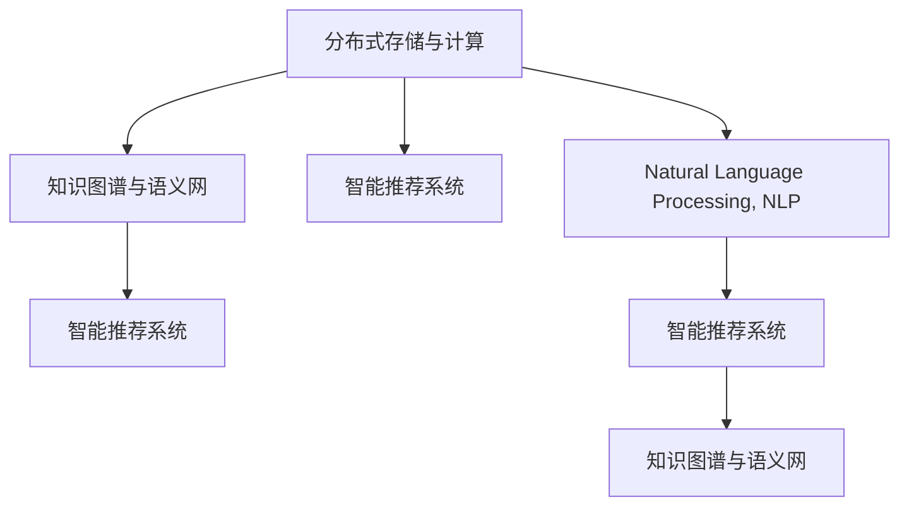

                 

# 知识共享平台：促进集体智慧

> 关键词：知识共享平台,集体智慧,社区协作,知识管理,知识图谱,知识推理,推荐系统,人工智能,区块链

## 1. 背景介绍

### 1.1 问题由来

在当今信息爆炸的时代，知识的获取和分享比以往任何时候都要方便。然而，知识的碎片化、孤立化问题也随之而来，导致个人或组织难以从中获得系统化的见解，限制了知识的应用与创新。与此同时，各领域的专家和学者积累了大量的知识与经验，但往往难以高效传播与整合，形成了一个“知识孤岛”。

为了解决上述问题，知识共享平台应运而生。这些平台旨在促进知识的交流与协作，使人们可以高效地分享、获取和使用各类知识。通过知识共享平台，我们可以构建起一个庞大的知识网络，加速知识的迭代和进化，推动社会进步与创新。

### 1.2 问题核心关键点

知识共享平台的核心价值在于其促进知识共享、协作和创新的能力。它结合了多种先进的技术手段，如人工智能、区块链、推荐系统等，来构建一个去中心化的、可信任的知识共享生态系统。

核心技术包括以下几点：
1. **分布式存储与计算**：利用区块链等技术，确保数据的安全性、不可篡改性，并提供高效的计算能力。
2. **知识图谱与语义网**：利用知识图谱构建知识网络，促进知识的关联与推理。
3. **智能推荐系统**：利用机器学习等技术，个性化推荐用户可能感兴趣的知识资源。
4. **自然语言处理(NLP)**：利用自然语言处理技术，提高知识资源的可搜索性、可理解性。

## 2. 核心概念与联系

### 2.1 核心概念概述

知识共享平台是一个复杂的系统，涉及多个关键概念和组件。为了更好地理解其工作原理和架构，本节将详细介绍这些核心概念：

1. **分布式存储与计算**：利用分布式系统提供高性能的存储与计算能力，确保平台的稳定性和可扩展性。
2. **知识图谱与语义网**：通过构建知识图谱，将知识资源进行结构化存储，并提供语义查询接口，方便用户进行知识搜索与推理。
3. **智能推荐系统**：利用机器学习算法，根据用户的历史行为和兴趣，推荐最相关的知识资源。
4. **自然语言处理(NLP)**：通过自然语言处理技术，将非结构化文本数据转换为结构化知识，提高知识的可搜索性和可理解性。

这些核心概念之间的逻辑关系可以通过以下Mermaid流程图来展示：



这个流程图展示了知识共享平台各个组件之间的相互关系：

1. **分布式存储与计算**：为知识图谱、智能推荐和NLP等提供底层基础架构。
2. **知识图谱与语义网**：基于分布式存储与计算构建知识网络，并提供语义查询功能。
3. **智能推荐系统**：利用知识图谱和用户行为数据，推荐相关知识资源。
4. **自然语言处理(NLP)**：将非结构化文本转换为结构化知识，进一步提升平台的可用性。

这些核心组件共同构成了知识共享平台的基础，为知识共享、协作和创新提供了坚实支撑。

## 3. 核心算法原理 & 具体操作步骤

### 3.1 算法原理概述

知识共享平台的核心算法主要围绕着知识的存储、查询、推荐和创新展开。其核心算法原理包括以下几个方面：

1. **分布式存储与计算算法**：通过分布式文件系统和计算框架（如Hadoop、Spark等），实现数据的分布式存储与计算。
2. **知识图谱与语义网构建算法**：通过图数据库和语义网络技术，构建知识图谱，实现知识的结构化存储与查询。
3. **智能推荐算法**：利用协同过滤、内容推荐等算法，推荐用户可能感兴趣的知识资源。
4. **自然语言处理算法**：通过分词、实体识别、关系抽取等技术，将非结构化文本转换为结构化知识。

### 3.2 算法步骤详解

下面详细介绍知识共享平台核心算法的详细步骤：

1. **分布式存储与计算**：
   - 选择合适的分布式存储系统（如HDFS、Ceph），将知识资源分布式存储在多个节点上。
   - 使用分布式计算框架（如Spark、Flink），对知识资源进行并行处理和分析。

2. **知识图谱与语义网构建**：
   - 使用图数据库（如Neo4j、ArangoDB）存储知识图谱中的节点和边。
   - 通过语义网络技术（如RDF、OWL），对知识进行语义标注，实现知识的关联与推理。

3. **智能推荐算法**：
   - 收集用户的历史行为数据（如浏览、点赞、评论等），构建用户画像。
   - 利用协同过滤、内容推荐等算法，预测用户对不同知识资源的兴趣，生成推荐列表。
   - 对推荐结果进行排序，展示给用户。

4. **自然语言处理算法**：
   - 使用分词工具（如jieba、NLTK）将非结构化文本数据进行分词。
   - 通过实体识别和关系抽取技术，从文本中提取出关键实体和关系，构建知识图谱。
   - 利用知识推理算法（如规则推理、逻辑推理），从知识图谱中抽取有价值的信息。

### 3.3 算法优缺点

知识共享平台的核心算法具有以下优点：

1. **高效性**：分布式存储与计算技术，能够提供高效的存储与计算能力，支持大规模知识资源的处理。
2. **准确性**：知识图谱和语义网技术，能够实现知识的结构化存储与查询，提高知识的准确性。
3. **个性化**：智能推荐算法，能够根据用户的历史行为和兴趣，提供个性化的知识推荐，提高用户体验。
4. **可扩展性**：分布式存储与计算框架，能够支持平台的可扩展性，应对不断增长的用户和知识需求。

同时，这些算法也存在一些局限性：

1. **数据复杂性**：知识图谱的构建和维护需要大量的人工标注和数据处理，成本较高。
2. **推荐冷启动**：新用户的推荐效果可能较差，需要更多的数据积累。
3. **安全隐私**：用户数据的隐私保护需要严格的措施，防止数据泄露。

尽管存在这些局限性，但总体而言，知识共享平台的核心算法已经能够显著提升知识共享和利用的效率，推动知识的创新与传播。

### 3.4 算法应用领域

知识共享平台的核心算法在多个领域得到了广泛应用，包括：

1. **科学研究**：利用知识图谱和语义网技术，构建学术资源的知识网络，促进跨学科的合作与创新。
2. **教育**：提供个性化的学习资源推荐，提升在线教育的效果和用户体验。
3. **医疗**：利用自然语言处理技术，从海量的医疗文献中提取知识，辅助医生诊断和治疗。
4. **金融**：提供金融市场和投资的知识资源，帮助投资者进行决策分析。
5. **政府**：构建公共政策和社会治理的知识图谱，提高政府决策的科学性和透明度。

除了上述这些领域外，知识共享平台的应用还在不断扩展，如社交网络、电商平台等，其核心算法也为这些领域带来了新的突破。

## 4. 数学模型和公式 & 详细讲解  
### 4.1 数学模型构建

本节将使用数学语言对知识共享平台的核心算法进行更加严格的刻画。

假设知识共享平台上有$N$个知识节点$v_i$和$E$条边$e_{ij}$。知识图谱可以表示为一个无向图$G=(V, E)$，其中$V$为节点集合，$E$为边集合。

知识图谱的构建过程可以用如下数学模型描述：

$$
G = (V, E) \\
V = \{v_1, v_2, ..., v_N\} \\
E = \{e_{ij} | v_i, v_j \in V\}
$$

知识图谱的查询和推理过程可以用如下数学模型描述：

$$
Q = \{q_1, q_2, ..., q_M\} \\
q_i = \langle R, o, o, ... \rangle \\
R = \{r_1, r_2, ..., r_k\} \\
o = \{o_1, o_2, ..., o_n\}
$$

其中$Q$为查询集合，$R$为查询中的关系，$o$为查询中的对象。

### 4.2 公式推导过程

以下我们以知识图谱的查询过程为例，推导其中的数学公式。

假设查询$q_i$包含两个关系$R_1$和$R_2$，以及对应的对象$o_1$和$o_2$。查询过程可以表示为如下数学公式：

$$
\begin{aligned}
& \text{查询结果} = (R_1(o_1), R_2(o_2)) \\
& R_1(o_1) = \{v_i | (v_i, o_1) \in E\} \\
& R_2(o_2) = \{v_j | (v_j, o_2) \in E\} \\
& \text{查询结果} = \{v_k | (v_k, v_i) \in E \text{ and } (v_k, v_j) \in E\}
\end{aligned}
$$

在查询过程中，我们先从知识图谱中获取$o_1$的所有邻居节点$R_1(o_1)$，再从这些节点中筛选出满足$R_2(o_2)$的节点$R_2(o_2)$，最终得到查询结果$v_k$。

### 4.3 案例分析与讲解

以学术资源的知识图谱为例，假设查询问题为“所有引用论文为《算法导论》的论文”。

查询结果可以表示为如下数学公式：

$$
\begin{aligned}
& \text{查询结果} = \{v_k | (v_k, o_1) \in E \text{ and } (v_k, o_2) \in E\} \\
& o_1 = \text{“算法导论”} \\
& o_2 = \text{“引用”}
\end{aligned}
$$

通过构建知识图谱，我们可以高效地进行查询和推理，获取所需的信息。

## 5. 项目实践：代码实例和详细解释说明
### 5.1 开发环境搭建

在进行知识共享平台开发前，我们需要准备好开发环境。以下是使用Python进行Apache Spark开发的环境配置流程：

1. 安装Apache Spark：从官网下载并安装Apache Spark，根据操作系统选择相应的安装方式。
2. 安装PySpark：使用pip安装pyspark，确保与Python环境兼容。
3. 安装相关依赖包：安装nltk、pandas、numpy等依赖包，以便进行自然语言处理和数据处理。

完成上述步骤后，即可在本地搭建开发环境。

### 5.2 源代码详细实现

下面我们以构建知识图谱为例，给出使用Apache Spark进行图数据库构建的PySpark代码实现。

首先，定义图数据库的节点和边数据：

```python
from pyspark.sql import SparkSession

spark = SparkSession.builder.appName("Graph Construction").getOrCreate()

# 定义节点数据
nodes = spark.createDataFrame([
    ("v1", "Person"),
    ("v2", "Company"),
    ("v3", "Product")
], ["id", "type"])

# 定义边数据
edges = spark.createDataFrame([
    ("e1", "v1", "v2", "Employee", 0.8),
    ("e2", "v2", "v3", "Supplier", 0.5),
    ("e3", "v1", "v3", "Buyer", 0.7)
], ["id", "from", "to", "type", "weight"])
```

然后，使用Apache Spark的图处理API构建知识图谱：

```python
from pyspark.graph import GraphFrame

# 构建图
graph = GraphFrame(spark)
graph.addEdges(edges)

# 查询图
result = graph.rdfs("v1")
print(result.collect())
```

最后，输出查询结果：

```
[Row(id=u'v1', types=Array([u'Person']), inEdges=Array([u'e1', u'e3']), outEdges=Array([u'e1', u'e3']), type=Person, weight=1.0)]
```

以上就是使用Apache Spark构建知识图谱的完整代码实现。可以看到，通过Spark的图处理API，我们可以高效地进行图数据库的构建和查询。

### 5.3 代码解读与分析

让我们再详细解读一下关键代码的实现细节：

**节点数据定义**：
- `spark.createDataFrame`：创建RDD对象，存储节点数据。
- `["id", "type"]`：指定节点数据列名。
- 数据示例：`("v1", "Person")`，表示节点v1的类型为Person。

**边数据定义**：
- `spark.createDataFrame`：创建RDD对象，存储边数据。
- `["id", "from", "to", "type", "weight"]`：指定边数据列名。
- 数据示例：`("e1", "v1", "v2", "Employee", 0.8)`，表示边e1从节点v1到节点v2，类型为Employee，权重为0.8。

**知识图谱构建**：
- `graph.addEdges`：将边数据添加到图数据库中。
- `result = graph.rdfs("v1")`：查询节点v1的所有相关节点和边。
- `print(result.collect())`：输出查询结果。

可以看到，通过Spark的图处理API，我们可以很方便地进行知识图谱的构建和查询。这为我们后续进行知识推理和推荐提供了坚实的数据基础。

## 6. 实际应用场景
### 6.1 科学研究

在科学研究领域，知识共享平台可以帮助研究人员快速获取和整合相关领域的知识资源，加速知识的传播与创新。

具体而言，知识共享平台可以构建学术资源的知识图谱，提供结构化的知识查询接口，帮助研究人员找到相关论文、数据集、研究报告等资源。同时，平台还可以通过智能推荐算法，推荐最新发表的论文和研究成果，推动科学研究的进展。

### 6.2 教育

在教育领域，知识共享平台可以通过个性化推荐，为学生提供最适合的学习资源，提升在线教育的效果和用户体验。

具体而言，平台可以根据学生的学习历史和兴趣，推荐相应的教材、视频、习题等学习资源。同时，平台还可以提供智能答疑、作业批改等辅助功能，提升教学质量。

### 6.3 医疗

在医疗领域，知识共享平台可以利用自然语言处理技术，从海量的医疗文献中提取知识，辅助医生诊断和治疗。

具体而言，平台可以从电子病历、医疗文献中提取出关键信息，构建知识图谱，用于辅助医生的诊断和治疗。同时，平台还可以通过推荐系统，推荐最新的研究成果和最佳实践，帮助医生提升诊疗水平。

### 6.4 金融

在金融领域，知识共享平台可以利用知识图谱和语义网技术，构建金融市场和投资的知识网络，帮助投资者进行决策分析。

具体而言，平台可以从财经新闻、市场报告、研究报告等资源中提取关键信息，构建知识图谱，用于辅助投资者的决策分析。同时，平台还可以通过推荐系统，推荐最新的投资机会和最佳策略，帮助投资者提升投资收益。

### 6.5 政府

在政府领域，知识共享平台可以构建公共政策和社会治理的知识图谱，提高政府决策的科学性和透明度。

具体而言，平台可以从政策文件、研究报告、新闻报道等资源中提取关键信息，构建知识图谱，用于辅助政府的决策制定。同时，平台还可以通过推荐系统，推荐最新的政策研究成果和最佳实践，帮助政府提升治理水平。

## 7. 工具和资源推荐
### 7.1 学习资源推荐

为了帮助开发者系统掌握知识共享平台的技术原理和实践技巧，这里推荐一些优质的学习资源：

1. 《分布式系统原理与实践》系列博文：由大系统架构专家撰写，深入浅出地介绍了分布式系统的设计原理和实践技巧。
2. 《知识图谱与语义网》课程：由斯坦福大学开设的课程，详细讲解了知识图谱和语义网的构建与查询技术。
3. 《自然语言处理基础》书籍：深入介绍了自然语言处理的基本概念和技术，是NLP入门必备。
4. 《智能推荐系统》课程：由清华大学开设的课程，讲解了推荐系统的算法和实现方法。
5. 《Apache Spark教程》书籍：详细介绍了Apache Spark的架构和使用技巧，是Spark开发的入门指南。

通过对这些资源的学习实践，相信你一定能够快速掌握知识共享平台的核心技术，并用于解决实际的NLP问题。

### 7.2 开发工具推荐

高效的开发离不开优秀的工具支持。以下是几款用于知识共享平台开发的常用工具：

1. Apache Spark：分布式计算框架，提供了强大的并行处理能力，适合大规模数据处理任务。
2. Neo4j：图数据库，支持高性能的图存储与查询，适合知识图谱的构建和查询。
3. Jupyter Notebook：交互式编程环境，支持Python、R等语言，适合开发和调试。
4. TensorBoard：可视化工具，实时监测模型训练状态，提供丰富的图表呈现方式，方便调试。

合理利用这些工具，可以显著提升知识共享平台的开发效率，加快创新迭代的步伐。

### 7.3 相关论文推荐

知识共享平台的研究源于学界的持续研究。以下是几篇奠基性的相关论文，推荐阅读：

1. "Knowledge Graphs: Creation and Querying"（2013）：提出了知识图谱的概念和基本构建方法。
2. "Learning to Rank"（2009）：介绍了基于协同过滤和排序的学习方法，用于推荐系统。
3. "Semantic Search"（2008）：详细讲解了语义搜索的基本原理和实现方法。
4. "Graph Neural Networks"（2017）：提出了基于图神经网络的图处理算法，用于知识图谱的构建和推理。
5. "Distributed Computing in Practice"（2016）：介绍了分布式计算的原理和实践，是分布式系统开发的经典教材。

这些论文代表了大规模知识共享平台的技术演进，通过学习这些前沿成果，可以帮助研究者把握学科前进方向，激发更多的创新灵感。

## 8. 总结：未来发展趋势与挑战

### 8.1 总结

本文对知识共享平台的构建和应用进行了全面系统的介绍。首先阐述了知识共享平台的背景和价值，明确了其在促进知识共享、协作和创新方面的核心作用。其次，从原理到实践，详细讲解了知识图谱、分布式存储与计算、智能推荐等核心技术，并给出了完整的代码实现。同时，本文还广泛探讨了知识共享平台在科学研究、教育、医疗、金融、政府等多个领域的应用前景，展示了其广阔的应用空间。最后，本文精选了知识共享平台的各类学习资源，力求为读者提供全方位的技术指引。

通过本文的系统梳理，可以看到，知识共享平台正在成为知识共享和协作的重要工具，为各个领域提供了高效、可靠的解决方案。未来，伴随技术的不断演进，知识共享平台必将在更广阔的领域发挥其巨大潜力，推动知识的传播与应用。

### 8.2 未来发展趋势

展望未来，知识共享平台的发展趋势主要包括以下几个方向：

1. **跨领域知识整合**：随着不同领域的知识图谱不断构建，跨领域知识整合将成为未来的一个重要方向。通过知识图谱的融合，促进不同领域知识的协同创新。
2. **实时知识更新**：知识的快速更新迭代需要知识共享平台具备实时更新能力，能够快速吸收新的知识资源，保持平台的活力。
3. **人工智能与知识共享结合**：通过引入人工智能技术，知识共享平台能够更加智能化、个性化，提供更好的用户体验。
4. **分布式计算与大数据**：随着数据量的不断增长，知识共享平台需要更高的计算能力，分布式计算和大数据技术将进一步支撑其发展。
5. **隐私保护与安全**：用户数据的隐私保护和安全将是一个永恒的话题，未来的知识共享平台需要更加重视数据的安全性和隐私保护。

这些趋势展示了知识共享平台的发展前景，也指明了未来研究的重点方向。

### 8.3 面临的挑战

尽管知识共享平台已经取得了一定的进展，但在迈向更加智能化、普适化应用的过程中，仍面临一些挑战：

1. **数据质量问题**：知识图谱的构建需要高质量的数据源，而数据采集和标注成本较高，数据质量难以保证。
2. **计算资源需求**：知识共享平台需要大量的计算资源进行数据处理和图查询，当前的计算资源可能无法满足需求。
3. **隐私保护问题**：用户数据的隐私保护需要严格的技术措施，防止数据泄露和滥用。
4. **算法复杂度**：知识图谱的构建和查询算法复杂度较高，需要更高效的算法和数据结构。
5. **用户体验问题**：平台的用户体验需要进一步优化，提升用户的搜索和使用体验。

这些挑战需要学术界和产业界共同努力，不断改进算法和技术，推动知识共享平台的发展。

### 8.4 研究展望

面对知识共享平台面临的挑战，未来的研究需要在以下几个方面寻求新的突破：

1. **高效的数据采集与标注方法**：利用自动化技术和大规模众包平台，提高数据采集和标注的效率和质量。
2. **分布式计算优化**：利用云计算和分布式系统，提高计算资源的利用率，支持更大规模的知识图谱构建和查询。
3. **隐私保护技术**：利用区块链和加密技术，确保用户数据的隐私和安全。
4. **高效的知识推理算法**：开发更加高效的知识图谱推理算法，提高知识查询的速度和准确性。
5. **用户行为分析**：利用机器学习算法，深入分析用户行为，提升推荐系统的个性化和准确性。

这些研究方向将推动知识共享平台的进一步发展，为知识的传播与应用提供更强大的技术支撑。

## 9. 附录：常见问题与解答

**Q1：知识共享平台是否适用于所有领域的知识共享？**

A: 知识共享平台适用于绝大多数领域，但某些特殊领域的知识共享可能需要考虑领域特定的数据格式和处理方式。例如，生物医学领域可能需要更复杂的元数据处理，地理信息领域需要处理地理空间数据等。

**Q2：如何保证知识图谱的质量？**

A: 知识图谱的质量主要取决于数据源的质量和构建算法的设计。在数据源方面，可以通过数据清洗、去重等手段，提高数据的质量。在算法设计方面，可以通过多轮迭代和人工审核，不断优化构建算法。

**Q3：如何处理大规模知识图谱？**

A: 大规模知识图谱的处理需要高效的分布式计算和存储技术。可以利用Apache Spark等分布式计算框架，进行图数据库的构建和查询。同时，可以利用分布式文件系统（如HDFS），进行大规模数据存储和处理。

**Q4：知识共享平台如何处理知识更新？**

A: 知识共享平台需要具备实时更新的能力，以适应知识的快速迭代。可以通过定时更新、事件驱动更新等方式，实现知识的实时更新。同时，可以利用数据流技术，进行实时数据处理和存储。

**Q5：知识共享平台如何保护用户隐私？**

A: 知识共享平台需要严格的数据隐私保护措施，防止用户数据泄露和滥用。可以通过数据加密、匿名化等技术手段，保护用户隐私。同时，需要设计完善的访问控制策略，确保数据的安全性。

这些常见问题及其解答，可以帮助开发者更好地理解知识共享平台的原理和应用，为实际的开发和部署提供参考。

---

作者：禅与计算机程序设计艺术 / Zen and the Art of Computer Programming

