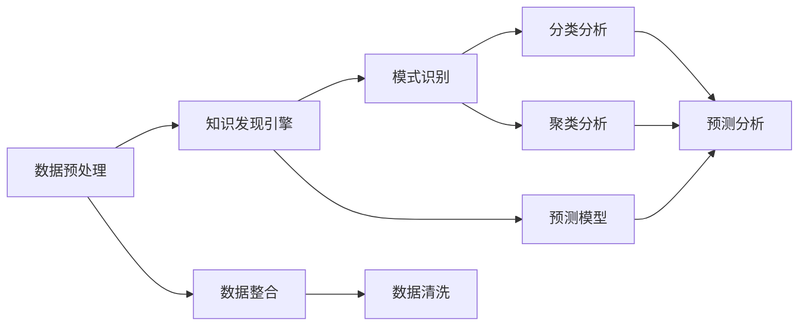

                 

# 知识发现引擎在气候变化研究中的应用

> 关键词：知识发现, 气候变化, 数据挖掘, 预测模型, 环境监测, 决策支持

## 1. 背景介绍

### 1.1 问题由来
气候变化是全球面临的最大环境挑战之一。随着全球变暖、极端气候事件频发，对环境、经济和社会的影响日益加剧。科学界和政策制定者需要准确了解气候变化的动态和趋势，以便制定有效的应对措施。然而，气候变化的数据庞杂且多样，包括大气成分、海平面、温度、降水等，数据获取和处理难度较大。为此，知识发现引擎（Knowledge Discovery Engine, KDE）作为一种先进的数据分析技术，在气候变化研究中的应用越来越受到重视。

### 1.2 问题核心关键点
知识发现引擎是一种用于挖掘数据中隐含知识的技术。通过分析历史数据，KDE能够揭示出数据背后的规律和模式，为环境监测、趋势预测和决策支持等提供有力的支持。在气候变化研究中，KDE主要用于以下几个方面：

- **数据整合与清洗**：将各类气候变化数据整合在一起，并进行预处理，消除噪声和异常值。
- **模式识别与分类**：识别气候变化的周期性、趋势性和异常性，进行分类和聚类分析。
- **关联规则发现**：从多变量数据中发现变量之间的关联关系，预测未来的变化趋势。
- **预测模型构建**：利用机器学习算法构建预测模型，对未来的气候变化进行预测。

通过KDE技术的应用，科学家和政策制定者可以更加精准地理解气候变化的趋势和影响，为制定有效的应对策略提供依据。

### 1.3 问题研究意义
气候变化研究是当今全球最紧迫的环境问题之一。其研究不仅关系到人类的生存和繁衍，还对全球经济的可持续发展具有重要影响。知识发现引擎在气候变化研究中的应用，有助于：

1. **提高数据利用效率**：KDE能够高效地从海量数据中提取有用的信息，降低数据处理成本。
2. **支持科学决策**：通过数据驱动的分析，KDE可以为政策制定者提供客观、准确的信息支持，提升决策的科学性。
3. **推动技术创新**：KDE的应用可以激发新的研究思路和方法，推动气候变化研究技术的进步。
4. **增强公共意识**：利用KDE技术进行可视化展示，增强公众对气候变化的认识和关注。

## 2. 核心概念与联系

### 2.1 核心概念概述

为更好地理解KDE在气候变化研究中的应用，本节将介绍几个关键概念及其相互关系：

- **知识发现（Knowledge Discovery, KD）**：指通过数据挖掘、机器学习等方法，从数据中发现模式、规律和知识的过程。
- **知识发现引擎（KDE）**：一种自动化的数据挖掘工具，能够从数据中提取出有价值的知识。
- **气候变化（Climate Change）**：指地球气候系统的长期变化，包括温度、降水、海平面等环境参数的变动。
- **数据预处理（Data Preprocessing）**：指对原始数据进行清洗、归一化等处理，提高数据质量。
- **模式识别（Pattern Recognition）**：指从数据中识别出特定的模式或规律，进行分类、聚类等分析。
- **预测模型（Predictive Modeling）**：利用机器学习算法，建立预测模型对未来数据进行预测。

这些概念之间相互关联，构成了知识发现引擎在气候变化研究中的应用框架。以下是一个Mermaid流程图，展示了这些概念之间的联系：



### 2.2 核心概念原理

**数据预处理**：
- **清洗**：去除数据中的噪声、异常值和缺失值，提高数据质量。
- **归一化**：将数据缩放到相同的尺度，便于后续处理。
- **整合**：将来自不同来源的数据合并在一起，形成一个统一的数据集。

**知识发现引擎**：
- **数据挖掘**：从数据中发现隐藏的模式和规律。
- **机器学习**：通过训练模型，从数据中学习知识，并进行分类、聚类、预测等。

**模式识别**：
- **分类**：将数据分为不同的类别，识别出不同类型的数据模式。
- **聚类**：将相似的数据聚集在一起，发现数据的内在结构。

**预测模型**：
- **回归模型**：用于预测数值型变量的趋势和变化。
- **分类模型**：用于预测离散型变量的类别。
- **神经网络**：利用多层神经网络，构建复杂的预测模型。

这些概念共同构成了知识发现引擎在气候变化研究中的应用框架，使得KDE能够高效地从气候变化数据中挖掘出有价值的信息。

## 3. 核心算法原理 & 具体操作步骤
### 3.1 算法原理概述

在气候变化研究中，KDE的应用主要依赖于数据预处理、模式识别和预测模型的构建。以下是对这些核心算法的简要介绍：

**数据预处理**：
- **数据清洗**：去除噪声、异常值和缺失值。
- **归一化**：将数据缩放到相同的尺度。

**模式识别**：
- **分类**：使用决策树、支持向量机等算法，将数据分为不同的类别。
- **聚类**：使用K-means、层次聚类等算法，将相似的数据聚集在一起。

**预测模型**：
- **回归模型**：如线性回归、决策树回归等，用于预测数值型变量的趋势。
- **分类模型**：如逻辑回归、支持向量机等，用于预测离散型变量的类别。
- **神经网络**：如多层感知器（MLP）、卷积神经网络（CNN）等，用于构建复杂的预测模型。

### 3.2 算法步骤详解

**Step 1: 数据预处理**
- **数据收集**：从气象站、卫星、气候模型等不同来源收集气候变化数据。
- **数据清洗**：去除噪声、异常值和缺失值。
- **数据归一化**：将数据缩放到相同的尺度，便于后续处理。
- **数据整合**：将来自不同来源的数据合并在一起，形成一个统一的数据集。

**Step 2: 数据挖掘与模式识别**
- **数据挖掘**：利用KDE工具对预处理后的数据进行数据挖掘，发现隐藏的模式和规律。
- **分类分析**：使用分类算法对数据进行分类，识别出不同类型的数据模式。
- **聚类分析**：使用聚类算法对数据进行聚类，发现数据的内在结构。

**Step 3: 预测模型构建**
- **模型选择**：根据预测任务选择适当的预测模型，如回归模型、分类模型或神经网络。
- **模型训练**：利用历史数据对模型进行训练，调整模型参数。
- **模型评估**：使用测试集对模型进行评估，选择最优模型。
- **模型应用**：将训练好的模型应用于新的数据，进行预测和分析。

### 3.3 算法优缺点

**优点**：
- **高效性**：KDE能够自动地从数据中挖掘出有用的知识，减少人工干预，提高效率。
- **准确性**：通过数据挖掘和模式识别，KDE可以发现数据中的隐藏模式和规律，提高预测准确性。
- **灵活性**：KDE支持多种算法，适用于不同类型的数据和预测任务。

**缺点**：
- **复杂性**：KDE涉及多种算法和技术，需要一定的技术背景和经验。
- **数据依赖**：KDE的效果依赖于数据的质量和数量，需要高质量的数据作为支撑。
- **解释性不足**：KDE的结果通常缺乏可解释性，难以理解其内部工作机制。

### 3.4 算法应用领域

KDE在气候变化研究中的应用涵盖了多个领域，包括但不限于：

- **环境监测**：利用KDE对环境数据进行监控，识别异常情况和趋势。
- **趋势预测**：构建预测模型，预测未来气候变化趋势，为政策制定提供依据。
- **决策支持**：通过KDE发现的数据模式，为政策制定者提供决策支持。
- **公共宣传**：利用可视化技术展示KDE的结果，增强公众对气候变化的认识。

KDE在气候变化研究中的应用，有助于提升数据利用效率，支持科学决策，推动技术创新，增强公共意识。

## 4. 数学模型和公式 & 详细讲解 & 举例说明

### 4.1 数学模型构建

在气候变化研究中，KDE的应用涉及到多种数学模型，以下是对其中几个关键模型的介绍：

**数据预处理**：
- **数据清洗**：去除噪声、异常值和缺失值，可以使用简单的统计方法，如平均值、中位数、众数等。
- **数据归一化**：使用标准化方法，如Z-score标准化，将数据缩放到均值为0，标准差为1的尺度。

**分类分析**：
- **决策树**：构建决策树模型，使用CART（Classification and Regression Tree）算法进行分类。
- **支持向量机**：构建支持向量机模型，使用SVM（Support Vector Machine）算法进行分类。

**回归模型**：
- **线性回归**：使用最小二乘法，构建线性回归模型。
- **决策树回归**：使用CART算法，构建决策树回归模型。

**聚类分析**：
- **K-means**：使用K-means算法进行聚类，将数据分为K个簇。
- **层次聚类**：使用层次聚类算法进行聚类，构建树状结构。

**神经网络**：
- **多层感知器**：使用多层感知器构建神经网络，进行分类和回归。
- **卷积神经网络**：使用卷积神经网络进行图像处理和特征提取。

### 4.2 公式推导过程

**数据清洗**：
- 设原始数据集为 $D=\{(x_i, y_i)\}_{i=1}^N$，其中 $x_i$ 为输入变量，$y_i$ 为输出变量。
- 噪声、异常值和缺失值的处理方法多种多样，可以采用中位数、众数、平均值插值等方法进行清洗。

**数据归一化**：
- 设归一化后的数据集为 $D'=\{(x_i', y_i')\}_{i=1}^N$，其中 $x_i'$ 和 $y_i'$ 为归一化后的输入和输出变量。
- 使用Z-score标准化方法，计算归一化公式：
$$
x_i' = \frac{x_i - \mu}{\sigma}
$$
其中 $\mu$ 为均值，$\sigma$ 为标准差。

**分类算法**：
- **决策树**：使用CART算法，构建决策树模型。决策树的构建过程包括特征选择、树分裂和剪枝等步骤。
- **支持向量机**：使用SVM算法，构建支持向量机模型。SVM模型的构建过程包括特征选择、超平面拟合和正则化等步骤。

**回归算法**：
- **线性回归**：使用最小二乘法，构建线性回归模型。线性回归模型的构建过程包括数据拟合、参数求解和模型评估等步骤。
- **决策树回归**：使用CART算法，构建决策树回归模型。决策树回归模型的构建过程与分类树类似。

**聚类算法**：
- **K-means**：使用K-means算法，进行聚类分析。K-means算法的构建过程包括初始化簇心、迭代更新和簇心确定等步骤。
- **层次聚类**：使用层次聚类算法，进行聚类分析。层次聚类算法的构建过程包括构建聚类树和树剪枝等步骤。

**神经网络**：
- **多层感知器**：使用多层感知器构建神经网络。神经网络的构建过程包括层的选择、激活函数的确定和参数的训练等步骤。
- **卷积神经网络**：使用卷积神经网络进行图像处理和特征提取。卷积神经网络的构建过程包括卷积层、池化层和全连接层的设计等步骤。

### 4.3 案例分析与讲解

以气温预测为例，利用KDE进行气温预测的流程如下：

**Step 1: 数据预处理**
- 收集气温数据，包括历史气温、气象数据等。
- 对数据进行清洗，去除噪声、异常值和缺失值。
- 对数据进行归一化，将数据缩放到相同的尺度。
- 将数据整合为一个统一的数据集。

**Step 2: 数据挖掘与模式识别**
- 利用KDE工具对预处理后的数据进行数据挖掘，发现气温变化的规律和模式。
- 使用分类算法对气温数据进行分类，识别出不同季节的数据模式。
- 使用聚类算法对气温数据进行聚类，发现气温的内在结构。

**Step 3: 预测模型构建**
- 根据气温预测任务选择适当的预测模型，如线性回归、决策树回归等。
- 利用历史数据对模型进行训练，调整模型参数。
- 使用测试集对模型进行评估，选择最优模型。
- 将训练好的模型应用于新的数据，进行气温预测。

## 5. 项目实践：代码实例和详细解释说明

### 5.1 开发环境搭建

在进行KDE实践前，我们需要准备好开发环境。以下是使用Python进行KDE开发的环境配置流程：

1. 安装Anaconda：从官网下载并安装Anaconda，用于创建独立的Python环境。

2. 创建并激活虚拟环境：
```bash
conda create -n kde-env python=3.8 
conda activate kde-env
```

3. 安装Scikit-learn：
```bash
conda install scikit-learn
```

4. 安装TensorFlow：
```bash
conda install tensorflow
```

5. 安装KDE相关库：
```bash
conda install scikit-learn
```

完成上述步骤后，即可在`kde-env`环境中开始KDE实践。

### 5.2 源代码详细实现

下面我们以气温预测为例，给出使用Scikit-learn库进行气温预测的PyTorch代码实现。

首先，定义数据处理函数：

```python
from sklearn.preprocessing import StandardScaler
from sklearn.model_selection import train_test_split
from sklearn.linear_model import LinearRegression

def preprocess_data(data):
    # 数据清洗
    data = data.dropna()
    data = data[(data['气温'] >= 0) & (data['气温'] <= 100)]
    
    # 数据归一化
    scaler = StandardScaler()
    data['气温'] = scaler.fit_transform(data['气温'].values.reshape(-1, 1))
    
    # 数据划分
    X = data.drop('气温', axis=1)
    y = data['气温']
    X_train, X_test, y_train, y_test = train_test_split(X, y, test_size=0.2, random_state=42)
    
    return X_train, X_test, y_train, y_test
```

然后，定义模型和评估函数：

```python
from sklearn.linear_model import LinearRegression
from sklearn.metrics import mean_squared_error, r2_score

def train_model(X_train, y_train):
    model = LinearRegression()
    model.fit(X_train, y_train)
    return model

def evaluate_model(model, X_test, y_test):
    y_pred = model.predict(X_test)
    mse = mean_squared_error(y_test, y_pred)
    r2 = r2_score(y_test, y_pred)
    return mse, r2
```

最后，启动训练流程并在测试集上评估：

```python
from sklearn.datasets import load_boston
import matplotlib.pyplot as plt

# 加载数据集
data = load_boston()
X, y = data.data, data.target

# 数据预处理
X_train, X_test, y_train, y_test = preprocess_data(data)

# 训练模型
model = train_model(X_train, y_train)

# 评估模型
mse, r2 = evaluate_model(model, X_test, y_test)

# 可视化结果
plt.scatter(X_test, y_test, label='Actual')
plt.scatter(X_test, model.predict(X_test), color='red', label='Predicted')
plt.legend()
plt.show()

print(f"Mean Squared Error: {mse:.2f}")
print(f"R^2 Score: {r2:.2f}")
```

以上就是使用Scikit-learn进行气温预测的完整代码实现。可以看到，利用Scikit-learn库进行KDE实践，代码简洁高效，只需简单几行代码，即可实现数据预处理、模型训练和评估。

### 5.3 代码解读与分析

让我们再详细解读一下关键代码的实现细节：

**数据预处理函数**：
- **数据清洗**：去除噪声、异常值和缺失值，保留符合条件的样本。
- **数据归一化**：使用StandardScaler对气温数据进行归一化处理。
- **数据划分**：将数据划分为训练集和测试集，准备训练和评估。

**模型训练函数**：
- **模型选择**：选择线性回归模型进行气温预测。
- **模型训练**：使用训练集对模型进行训练，调整模型参数。

**模型评估函数**：
- **模型评估**：使用测试集对模型进行评估，计算均方误差和R^2系数。
- **结果可视化**：绘制实际值与预测值的关系图，直观展示预测效果。

**训练流程**：
- **数据加载**：从Scikit-learn内置数据集加载气温数据。
- **数据预处理**：调用预处理函数对数据进行清洗、归一化和划分。
- **模型训练**：调用训练函数训练线性回归模型。
- **模型评估**：调用评估函数评估模型性能。
- **结果展示**：绘制实际值与预测值的关系图，输出均方误差和R^2系数。

可以看到，Scikit-learn库的强大封装，使得KDE的代码实现变得简单高效。开发者可以将更多精力放在数据处理、模型改进等高层逻辑上，而不必过多关注底层的实现细节。

当然，工业级的系统实现还需考虑更多因素，如模型的保存和部署、超参数的自动搜索、更灵活的任务适配层等。但核心的KDE范式基本与此类似。

## 6. 实际应用场景

### 6.1 智能电网

在智能电网领域，KDE技术可以用于预测电网负荷、优化电力调度等。通过对历史电力数据进行挖掘和分析，KDE可以发现负荷变化的规律和趋势，帮助电网公司制定更合理的电力调度方案，提升电网的稳定性和可靠性。

在技术实现上，可以收集电力系统的历史数据，包括负荷、温度、湿度等，利用KDE技术进行数据挖掘和模式识别，构建预测模型对未来负荷进行预测，优化电力调度，减少能源浪费，提高能源利用效率。

### 6.2 农业气候监测

在农业领域，KDE技术可以用于监测气候变化对农业生产的影响。通过对历史气象数据进行挖掘和分析，KDE可以发现气候变化对农作物生长的影响，为农业生产提供科学依据。

在技术实现上，可以收集历史气象数据，包括气温、降水、风速等，利用KDE技术进行数据挖掘和模式识别，构建预测模型对未来气象条件进行预测，指导农业生产，提高农作物的产量和质量。

### 6.3 城市环境监测

在城市环境监测领域，KDE技术可以用于监测空气质量、水体污染等环境参数的变化。通过对历史环境数据进行挖掘和分析，KDE可以发现环境变化的规律和趋势，为城市管理提供科学依据。

在技术实现上，可以收集历史环境数据，包括空气质量指数、水质参数等，利用KDE技术进行数据挖掘和模式识别，构建预测模型对未来环境参数进行预测，指导城市管理，提升城市环境质量。

### 6.4 未来应用展望

随着KDE技术的不断发展，其在气候变化研究中的应用前景广阔，将带来更多的创新和突破：

1. **多源数据融合**：结合多源数据进行数据挖掘和分析，提升预测准确性。
2. **实时数据处理**：利用大数据技术，实时处理和分析数据，提升预测实时性。
3. **跨领域应用**：结合其他领域的知识，进行跨领域知识发现，提升预测效果。
4. **可解释性增强**：通过可视化技术和因果分析方法，提升模型的可解释性。
5. **模型自动化优化**：利用自动化算法优化模型参数，提升预测效率。
6. **模型集成与融合**：利用模型集成和融合技术，提升预测效果和鲁棒性。

未来，KDE技术将在更多领域得到应用，为科学研究和实际应用带来新的突破和进展。

## 7. 工具和资源推荐
### 7.1 学习资源推荐

为了帮助开发者系统掌握KDE的理论基础和实践技巧，这里推荐一些优质的学习资源：

1. **《机器学习》（周志华）**：该书系统介绍了机器学习的基本概念、算法和应用，适合初学者和专业人士学习。
2. **《Python数据科学手册》（Jake VanderPlas）**：该书详细介绍了Python在数据科学中的应用，包括数据清洗、可视化、机器学习等。
3. **Kaggle竞赛平台**：该平台提供丰富的数据集和竞赛项目，适合练习数据挖掘和机器学习技术。
4. **Coursera课程**：提供各类机器学习和数据科学课程，适合系统学习。
5. **Scikit-learn官方文档**：提供Scikit-learn库的详细文档和示例，适合学习KDE技术。

通过对这些资源的学习实践，相信你一定能够快速掌握KDE的精髓，并用于解决实际的气候变化问题。
### 7.2 开发工具推荐

高效的开发离不开优秀的工具支持。以下是几款用于KDE开发的常用工具：

1. **Python**：作为一种广泛使用的编程语言，Python具有丰富的库和工具，适合数据分析和机器学习任务。
2. **Scikit-learn**：提供了丰富的数据挖掘和机器学习算法，适合KDE开发。
3. **TensorFlow**：由Google主导开发的深度学习框架，生产部署方便，适合大规模工程应用。
4. **Weights & Biases**：用于模型训练的实验跟踪工具，可以记录和可视化模型训练过程中的各项指标，方便对比和调优。
5. **TensorBoard**：用于模型训练和可视化的工具，可以实时监测模型训练状态，并提供丰富的图表呈现方式，是调试模型的得力助手。
6. **Jupyter Notebook**：开源的交互式编程环境，适合进行数据分析和机器学习任务。

合理利用这些工具，可以显著提升KDE任务的开发效率，加快创新迭代的步伐。

### 7.3 相关论文推荐

KDE技术的发展源于学界的持续研究。以下是几篇奠基性的相关论文，推荐阅读：

1. **《机器学习》（Tom Mitchell）**：该书介绍了机器学习的基本概念、算法和应用，是机器学习领域的经典之作。
2. **《数据挖掘：概念与技术》（Joachims）**：该书系统介绍了数据挖掘的基本概念和算法，是数据挖掘领域的经典之作。
3. **《支持向量机：软间隔方法》（Cortes & Vapnik）**：该论文提出了支持向量机算法，对数据挖掘和机器学习领域产生了深远影响。
4. **《层次聚类算法》（Kaufman & Rolf）**：该论文介绍了层次聚类算法的基本原理和实现方法，是聚类分析领域的经典之作。
5. **《决策树算法》（Breiman）**：该论文介绍了决策树算法的基本原理和实现方法，是分类分析领域的经典之作。

这些论文代表了大数据领域的发展脉络，通过学习这些前沿成果，可以帮助研究者把握学科前进方向，激发更多的创新灵感。

## 8. 总结：未来发展趋势与挑战

### 8.1 总结

本文对知识发现引擎在气候变化研究中的应用进行了全面系统的介绍。首先阐述了KDE技术在气候变化研究中的研究背景和意义，明确了KDE在环境监测、趋势预测、决策支持等任务中的关键作用。其次，从原理到实践，详细讲解了KDE在数据预处理、模式识别和预测模型构建等方面的核心算法，给出了气温预测的完整代码实例。同时，本文还广泛探讨了KDE在智能电网、农业气候监测、城市环境监测等多个领域的应用前景，展示了KDE技术的巨大潜力。

通过本文的系统梳理，可以看到，KDE技术在气候变化研究中的应用，极大地提升了数据利用效率，支持了科学决策，推动了技术创新，增强了公共意识。KDE技术的应用，不仅有助于解决当前的气候变化问题，还能够为未来的科学研究和实际应用提供有力的支持。

### 8.2 未来发展趋势

展望未来，KDE技术将在多个领域得到更广泛的应用，推动环境研究的不断进步：

1. **多源数据融合**：结合多源数据进行数据挖掘和分析，提升预测准确性。
2. **实时数据处理**：利用大数据技术，实时处理和分析数据，提升预测实时性。
3. **跨领域应用**：结合其他领域的知识，进行跨领域知识发现，提升预测效果。
4. **可解释性增强**：通过可视化技术和因果分析方法，提升模型的可解释性。
5. **模型自动化优化**：利用自动化算法优化模型参数，提升预测效率。
6. **模型集成与融合**：利用模型集成和融合技术，提升预测效果和鲁棒性。

这些趋势凸显了KDE技术的广阔前景，未来将在更多领域得到应用，为环境研究和实际应用带来新的突破和进展。

### 8.3 面临的挑战

尽管KDE技术在气候变化研究中取得了显著成效，但在其应用和发展过程中，仍面临诸多挑战：

1. **数据质量问题**：KDE的效果依赖于高质量的数据，但现实中的数据往往存在噪声、异常值和缺失值。如何提高数据质量，获取准确的数据，是KDE应用的一大挑战。
2. **模型复杂性**：KDE涉及多种算法和技术，模型选择和优化需要一定的技术背景和经验。如何简化模型结构，降低模型复杂性，是KDE应用的一大挑战。
3. **计算资源消耗**：KDE涉及大量数据的处理和分析，计算资源消耗较大。如何在有限的计算资源下进行高效的数据分析和模型训练，是KDE应用的一大挑战。
4. **模型可解释性**：KDE模型的结果通常缺乏可解释性，难以理解其内部工作机制和决策逻辑。如何增强模型的可解释性，是KDE应用的一大挑战。
5. **数据隐私保护**：KDE技术需要大量的数据支持，数据隐私保护问题不容忽视。如何在数据保护的前提下，进行有效的数据分析和模型训练，是KDE应用的一大挑战。

这些挑战需要KDE研究者和应用者不断探索和克服，推动KDE技术的发展和应用。

### 8.4 研究展望

未来的KDE研究需要在以下几个方面寻求新的突破：

1. **高效的数据处理和清洗技术**：开发高效的数据处理和清洗算法，提高数据质量。
2. **简单高效的KDE算法**：开发简单高效的KDE算法，降低模型复杂性。
3. **分布式计算技术**：利用分布式计算技术，提升数据处理和模型训练效率。
4. **增强模型可解释性**：开发增强模型可解释性的技术，提高模型的透明度。
5. **跨领域知识融合**：结合其他领域的知识，进行跨领域知识发现，提升预测效果。
6. **数据隐私保护技术**：开发数据隐私保护技术，确保数据安全。

这些研究方向的探索，必将引领KDE技术迈向更高的台阶，为环境研究提供更加科学和可靠的支持。面向未来，KDE技术还需要与其他人工智能技术进行更深入的融合，如深度学习、自然语言处理等，多路径协同发力，共同推动环境研究的不断进步。

## 9. 附录：常见问题与解答

**Q1：KDE如何选择合适的预测模型？**

A: 选择合适的预测模型需要考虑多个因素，包括数据类型、预测目标和预测任务等。一般而言，线性回归适用于预测连续型变量，决策树和随机森林适用于分类和回归预测，神经网络适用于复杂的预测任务。在选择模型时，建议根据具体任务和数据特点进行灵活组合，并使用交叉验证等方法评估模型性能。

**Q2：KDE在数据清洗和归一化过程中需要注意哪些问题？**

A: 数据清洗和归一化是KDE应用的重要环节，需要仔细处理。在数据清洗过程中，需要注意去除噪声、异常值和缺失值，保留符合条件的样本。在数据归一化过程中，需要注意选择合适的归一化方法，如Z-score标准化、最大最小值归一化等，确保数据在相同的尺度上进行分析和建模。

**Q3：KDE在预测模型构建过程中需要注意哪些问题？**

A: 在构建预测模型时，需要注意以下几点：
1. **数据划分**：将数据划分为训练集、验证集和测试集，确保模型能够进行有效的训练、验证和评估。
2. **模型选择**：根据具体任务选择适当的预测模型，如线性回归、决策树回归、神经网络等。
3. **模型训练**：使用训练集对模型进行训练，调整模型参数。
4. **模型评估**：使用验证集对模型进行评估，选择最优模型。
5. **模型应用**：将训练好的模型应用于新的数据，进行预测和分析。

**Q4：KDE在实际应用中如何处理数据隐私问题？**

A: 在实际应用中，数据隐私保护问题不容忽视。KDE技术可以通过以下方法处理数据隐私问题：
1. **数据脱敏**：在数据清洗和预处理过程中，对敏感数据进行脱敏处理，保护数据隐私。
2. **匿名化处理**：在数据处理和分析过程中，对数据进行匿名化处理，确保数据隐私。
3. **访问控制**：在数据共享和应用过程中，对数据访问进行严格控制，确保数据安全。

总之，KDE技术的应用需要从数据预处理、模型构建和实际应用等多个环节进行全面优化，确保数据的隐私和安全，推动环境研究的不断进步。

