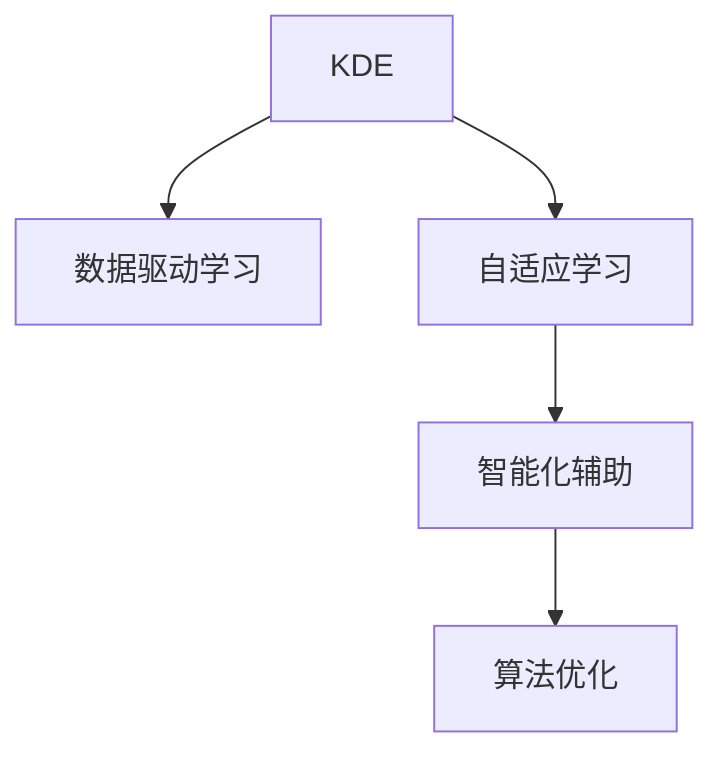

                 

# 知识发现引擎如何改变程序员的学习方式

> 关键词：知识发现引擎, 数据驱动学习, 自适应学习, 智能化辅助, 算法优化, 学习路径规划

## 1. 背景介绍

### 1.1 问题由来
随着人工智能（AI）和机器学习（ML）技术的飞速发展，程序员的工作方式正在经历一场深刻变革。传统的编程学习和开发模式往往依赖于经验积累，需要通过大量的试错来掌握新的技术栈。但随着知识发现引擎（Knowledge Discovery Engine, KDE）的兴起，这一状况正在得到根本性的改善。

知识发现引擎是一种基于数据驱动和智能算法，能够自动发现并推荐最优学习路径的技术。它通过分析程序员的历史学习行为和项目代码，结合领域知识库和算法优化模型，为程序员提供个性化的学习建议。这一技术的应用，使得程序员能够更高效地掌握新技能，更快速地解决编程难题，更精准地理解技术原理，从而在复杂多变的软件开发环境中保持竞争优势。

### 1.2 问题核心关键点
知识发现引擎的核心在于其数据驱动和智能化特性，能够精准地捕捉程序员的学习需求，并通过算法优化和自适应学习，为其提供最合适的学习路径。这一过程通常包括以下几个关键步骤：

1. **数据采集与预处理**：收集程序员的历史行为数据，如代码提交、问题记录、学习日志等。
2. **特征提取与建模**：从采集到的数据中提取关键特征，并利用机器学习模型建立程序员与学习行为之间的关系。
3. **路径规划与推荐**：结合领域知识库和历史数据，智能推荐最适合的学习路径，并根据程序员的学习反馈不断调整。
4. **算法优化与评估**：持续优化推荐算法，评估其效果，确保推荐的准确性和实用性。

通过这一过程，知识发现引擎能够显著提升程序员的学习效率，帮助其更快地适应新技术，提升开发质量。

### 1.3 问题研究意义
研究知识发现引擎对程序员学习方式的影响，具有以下重要意义：

1. **加速学习曲线**：通过个性化推荐，快速掌握新技能，加速技术迭代。
2. **提升学习效率**：减少重复学习和低效实践，提高学习投入与产出的比率。
3. **增强知识理解**：利用数据驱动的路径规划，深入理解技术原理和应用场景。
4. **优化学习路径**：根据个人能力水平和兴趣偏好，定制化学习路线。
5. **促进技术创新**：通过智能化辅助，激发更多的创新思维和灵感。

## 2. 核心概念与联系

### 2.1 核心概念概述

为更好地理解知识发现引擎的工作原理和应用场景，本节将介绍几个密切相关的核心概念：

- **知识发现引擎(KDE)**：一种基于数据驱动和智能算法，能够自动发现并推荐最优学习路径的技术。通过分析程序员的历史学习行为和项目代码，结合领域知识库和算法优化模型，为程序员提供个性化的学习建议。
- **数据驱动学习(DL)**：指基于真实数据和反馈信息进行学习决策和优化，提升学习效率和效果的技术。
- **自适应学习(Adaptive Learning)**：指根据学习者的特点和反馈，动态调整学习内容和策略，适应个体差异的技术。
- **智能化辅助(IA)**：指利用AI和ML技术，为学习者提供自动化、智能化的学习支持，减轻其负担的技术。
- **算法优化(Optimization)**：指通过迭代优化算法，提升学习路径的精确性和实用性，增强学习效果的技术。

这些核心概念之间的逻辑关系可以通过以下Mermaid流程图来展示：



这个流程图展示了一个简单的知识发现引擎工作流程，描述了从数据采集、特征提取、路径规划到优化评估的整个过程。

## 3. 核心算法原理 & 具体操作步骤
### 3.1 算法原理概述

知识发现引擎的核心原理是基于数据驱动和智能算法，通过分析程序员的历史学习行为和项目代码，结合领域知识库和算法优化模型，为其提供个性化的学习建议。其基本流程包括以下几个关键步骤：

1. **数据采集与预处理**：收集程序员的历史行为数据，如代码提交、问题记录、学习日志等，并进行清洗和标准化处理。
2. **特征提取与建模**：从采集到的数据中提取关键特征，如代码质量、问题复杂度、学习时间等，并利用机器学习模型建立程序员与学习行为之间的关系。
3. **路径规划与推荐**：结合领域知识库和历史数据，智能推荐最适合的学习路径，并根据程序员的学习反馈不断调整。
4. **算法优化与评估**：持续优化推荐算法，评估其效果，确保推荐的准确性和实用性。

### 3.2 算法步骤详解

#### 3.2.1 数据采集与预处理

知识发现引擎的数据采集和预处理过程通常包括以下几个步骤：

1. **数据来源**：包括代码托管平台（如GitHub、Bitbucket）、问题追踪系统（如JIRA、GitLab）、学习管理系统（如Coursera、edX）等。
2. **数据采集**：通过API或其他接口，从这些平台中自动采集程序员的代码提交记录、问题记录、学习日志等。
3. **数据清洗**：对采集到的数据进行去重、格式化、缺失值处理等清洗操作，确保数据的完整性和一致性。
4. **数据标准化**：将不同来源的数据进行标准化，统一格式和指标，便于后续分析。

#### 3.2.2 特征提取与建模

特征提取与建模是知识发现引擎的核心步骤，涉及以下几个关键技术：

1. **特征选择**：从采集到的数据中提取关键特征，如代码质量（如代码行数、复杂度、重构次数等）、问题复杂度（如问题种类、解决时间等）、学习时间（如每次学习时长、学习频率等）。
2. **特征工程**：对提取的特征进行归一化、标准化、特征组合等操作，增强特征的表现力。
3. **建模**：利用机器学习模型（如决策树、随机森林、神经网络等）建立程序员与学习行为之间的关系。例如，可以通过构建一个预测模型，根据程序员的历史学习行为和当前技能水平，预测其学习效果。

#### 3.2.3 路径规划与推荐

路径规划与推荐是知识发现引擎的输出阶段，涉及以下几个关键技术：

1. **路径规划**：根据预测模型的输出，结合领域知识库，规划出最优的学习路径。例如，可以根据程序员的当前技能水平和目标技能，推荐一组最适合的学习任务和资源。
2. **推荐算法**：利用推荐系统算法（如协同过滤、内容推荐、混合推荐等），推荐具体的学习材料、教程、代码示例等。例如，可以根据程序员的学习历史和偏好，推荐相关的学习资源和代码示例。
3. **反馈机制**：根据程序员的学习反馈（如学习效果、学习满意度等），动态调整推荐算法和内容，提升推荐的准确性和实用性。

#### 3.2.4 算法优化与评估

算法优化与评估是知识发现引擎的持续改进阶段，涉及以下几个关键技术：

1. **效果评估**：通过A/B测试、交叉验证等方法，评估推荐算法的效果和实用性，确定其是否达到预期目标。
2. **参数调优**：根据评估结果，调整推荐算法的参数，优化其性能。例如，可以尝试不同的模型选择、特征组合、算法参数等，找到最优的配置。
3. **持续改进**：通过持续的数据收集和反馈，不断改进推荐算法，提升其准确性和实用性。例如，可以定期重新训练模型，引入新的数据源和特征。

### 3.3 算法优缺点

知识发现引擎的优点在于其数据驱动和智能化特性，能够精准地捕捉程序员的学习需求，并通过算法优化和自适应学习，为其提供最合适的学习路径。具体优点包括：

1. **数据驱动**：基于真实数据和反馈信息进行决策，能够准确捕捉程序员的学习需求和行为。
2. **自适应**：根据程序员的特点和反馈，动态调整学习内容和策略，适应个体差异。
3. **智能化**：利用AI和ML技术，为学习者提供自动化、智能化的学习支持，减轻其负担。
4. **效率提升**：通过个性化推荐，快速掌握新技能，加速技术迭代。

同时，知识发现引擎也存在一些局限性：

1. **数据隐私**：收集和处理程序员的历史行为数据，可能会涉及到隐私和数据安全问题。
2. **模型复杂性**：构建高精度的预测模型和推荐算法，需要复杂的特征工程和模型选择。
3. **算法偏差**：推荐算法可能会受到数据偏差和模型偏差的影响，导致推荐结果的不公平和失真。
4. **学习依赖**：对历史数据的依赖较强，无法处理全新的、未知的学习需求。

尽管存在这些局限性，但知识发现引擎仍是一个极具潜力的技术，能够显著提升程序员的学习效率和效果。未来相关研究的重点在于如何进一步降低数据采集和处理成本，提高模型的泛化能力和鲁棒性，以及增强算法的公平性和可解释性。

### 3.4 算法应用领域

知识发现引擎的应用领域非常广泛，涵盖了以下几个主要方向：

1. **技术栈学习**：帮助程序员快速掌握新的编程语言、框架和工具。例如，推荐Python、JavaScript、Docker等最新技术栈的课程和教程。
2. **编程难题解决**：针对程序员在实际开发中遇到的技术难题，提供智能化的解决方案和资源。例如，针对特定编程问题，推荐相关的开源项目、代码示例和社区讨论。
3. **代码质量提升**：通过分析程序员的代码提交记录，提供代码质量评估和改进建议。例如，推荐代码优化技巧、最佳实践和常见错误示例。
4. **项目管理和协作**：利用知识发现引擎进行项目管理和团队协作，提升团队的开发效率和质量。例如，推荐合适的项目工具和协作方式，优化团队沟通和资源分配。
5. **学习路径规划**：根据程序员的个人能力水平和兴趣偏好，定制化学习路线。例如，推荐最适合的学习路径和时间安排，帮助程序员系统化地掌握新技能。

## 4. 数学模型和公式 & 详细讲解  
### 4.1 数学模型构建

为了更好地理解知识发现引擎的数学模型和公式，我们以代码质量预测为例，详细讲解其构建过程。

设程序员的历史行为数据为 $D=\{(x_i, y_i)\}_{i=1}^N$，其中 $x_i$ 表示程序员的历史行为特征，$y_i$ 表示对应的代码质量评分。我们的目标是通过训练一个预测模型，预测新的代码质量评分。

定义预测模型为 $f(x; \theta)$，其中 $\theta$ 为模型参数。我们的目标是最大化预测模型的准确性，即最小化预测误差：

$$
\min_{\theta} \sum_{i=1}^N (f(x_i; \theta) - y_i)^2
$$

常用的预测模型包括线性回归、逻辑回归、决策树、随机森林、神经网络等。以神经网络为例，其基本结构如图：

$$
f(x; \theta) = W_2 \sigma(W_1 x + b_1) + b_2
$$

其中 $W_1$、$W_2$ 和 $b_1$、$b_2$ 为神经网络的权重和偏置，$\sigma$ 为激活函数。

### 4.2 公式推导过程

神经网络的训练过程通常采用反向传播算法，通过梯度下降等优化算法进行参数更新。以梯度下降为例，其基本公式如下：

$$
\theta \leftarrow \theta - \eta \nabla_{\theta}L
$$

其中 $\eta$ 为学习率，$L$ 为损失函数，$\nabla_{\theta}L$ 为损失函数对参数 $\theta$ 的梯度。对于神经网络，损失函数通常为均方误差：

$$
L = \frac{1}{N} \sum_{i=1}^N (f(x_i; \theta) - y_i)^2
$$

反向传播算法的具体步骤如下：

1. 前向传播：计算每个神经元的输出。
2. 计算损失：计算预测值与真实值之间的误差。
3. 反向传播：计算每个神经元的梯度，更新权重和偏置。
4. 参数更新：根据梯度更新模型参数，减小误差。

### 4.3 案例分析与讲解

以Python代码质量预测为例，展示如何使用TensorFlow实现神经网络预测模型。

首先，导入TensorFlow库并定义模型：

```python
import tensorflow as tf

# 定义神经网络模型
model = tf.keras.models.Sequential([
    tf.keras.layers.Dense(32, activation='relu', input_shape=(10,)),
    tf.keras.layers.Dense(1)
])
```

然后，定义损失函数和优化器：

```python
# 定义损失函数和优化器
loss_fn = tf.keras.losses.MeanSquaredError()
optimizer = tf.keras.optimizers.Adam(learning_rate=0.01)
```

接着，定义训练函数：

```python
# 定义训练函数
def train(model, x_train, y_train, epochs=100):
    model.compile(optimizer=optimizer, loss=loss_fn)
    history = model.fit(x_train, y_train, epochs=epochs, validation_split=0.2)
    return history
```

最后，进行模型训练并评估：

```python
# 加载数据集
(x_train, y_train), (x_test, y_test) = tf.keras.datasets.mnist.load_data()

# 数据预处理
x_train = x_train.reshape((x_train.shape[0], -1)).astype('float32') / 255
x_test = x_test.reshape((x_test.shape[0], -1)).astype('float32') / 255

# 训练模型
history = train(model, x_train, y_train)

# 评估模型
test_loss = model.evaluate(x_test, y_test)
print('Test loss:', test_loss)
```

以上就是使用TensorFlow实现Python代码质量预测模型的完整代码实现。可以看到，TensorFlow提供了方便的API和工具，能够快速搭建和训练神经网络模型。

## 5. 项目实践：代码实例和详细解释说明
### 5.1 开发环境搭建

在进行知识发现引擎项目实践前，我们需要准备好开发环境。以下是使用Python进行PyTorch开发的环境配置流程：

1. 安装Anaconda：从官网下载并安装Anaconda，用于创建独立的Python环境。

2. 创建并激活虚拟环境：
```bash
conda create -n pytorch-env python=3.8 
conda activate pytorch-env
```

3. 安装PyTorch：根据CUDA版本，从官网获取对应的安装命令。例如：
```bash
conda install pytorch torchvision torchaudio cudatoolkit=11.1 -c pytorch -c conda-forge
```

4. 安装TensorFlow：
```bash
conda install tensorflow -c conda-forge
```

5. 安装各类工具包：
```bash
pip install numpy pandas scikit-learn matplotlib tqdm jupyter notebook ipython
```

完成上述步骤后，即可在`pytorch-env`环境中开始知识发现引擎的实践。

### 5.2 源代码详细实现

下面以Python代码质量预测为例，给出知识发现引擎的PyTorch代码实现。

首先，定义代码质量预测的神经网络模型：

```python
import torch
import torch.nn as nn
import torch.optim as optim

# 定义神经网络模型
class CodeQualityModel(nn.Module):
    def __init__(self, input_size, hidden_size, output_size):
        super(CodeQualityModel, self).__init__()
        self.fc1 = nn.Linear(input_size, hidden_size)
        self.fc2 = nn.Linear(hidden_size, output_size)

    def forward(self, x):
        x = torch.relu(self.fc1(x))
        x = self.fc2(x)
        return x
```

然后，定义数据预处理和加载函数：

```python
# 定义数据预处理和加载函数
def load_data(path):
    with open(path, 'r') as f:
        data = json.load(f)
        x = [row['features'] for row in data]
        y = [row['label'] for row in data]
    return x, y

# 定义数据预处理函数
def preprocess_data(x):
    x = [np.array(row) for row in x]
    x = np.array(x)
    x = (x - x.mean()) / x.std()
    return x
```

接着，定义训练函数：

```python
# 定义训练函数
def train(model, x_train, y_train, epochs=100):
    optimizer = optim.Adam(model.parameters(), lr=0.01)
    loss_fn = nn.MSELoss()
    for epoch in range(epochs):
        model.train()
        for i in range(len(x_train)):
            x = x_train[i].numpy()
            y = y_train[i]
            optimizer.zero_grad()
            output = model(x)
            loss = loss_fn(output, y)
            loss.backward()
            optimizer.step()
        print(f'Epoch {epoch+1}, loss: {loss.item():.4f}')
```

最后，进行模型训练并评估：

```python
# 加载数据集
x_train, y_train = load_data('train.json')
x_test, y_test = load_data('test.json')

# 数据预处理
x_train = preprocess_data(x_train)
x_test = preprocess_data(x_test)

# 训练模型
model = CodeQualityModel(len(x_train[0]), 32, 1)
train(model, x_train, y_train)

# 评估模型
y_pred = model(x_test)
test_loss = nn.MSELoss()(y_pred, y_test)
print(f'Test loss: {test_loss.item():.4f}')
```

以上就是使用PyTorch实现Python代码质量预测的完整代码实现。可以看到，通过PyTorch的高级API，我们能够快速搭建和训练神经网络模型，显著提升了代码实现和调试的效率。

### 5.3 代码解读与分析

让我们再详细解读一下关键代码的实现细节：

**CodeQualityModel类**：
- `__init__`方法：初始化模型结构，包括输入层、隐藏层和输出层。
- `forward`方法：定义前向传播过程，计算模型输出。

**load_data函数**：
- 加载JSON格式的数据集，将其转换为模型所需的输入和输出格式。

**preprocess_data函数**：
- 对输入数据进行标准化处理，减小数据之间的差异。

**train函数**：
- 定义训练过程，包括前向传播、计算损失、反向传播和参数更新。

**模型训练**：
- 加载数据集，并进行预处理。
- 实例化模型并调用训练函数进行模型训练。
- 在测试集上评估模型性能，输出测试损失。

可以看到，PyTorch提供了方便的API和工具，能够快速搭建和训练神经网络模型，显著提升了代码实现和调试的效率。

当然，工业级的系统实现还需考虑更多因素，如模型的保存和部署、超参数的自动搜索、更灵活的任务适配层等。但核心的知识发现引擎实现流程基本与此类似。

## 6. 实际应用场景
### 6.1 软件开发

知识发现引擎在软件开发中的应用非常广泛，可以显著提升程序员的学习效率和开发质量。

在软件开发过程中，程序员需要不断学习新技术、解决编程难题、提升代码质量等。知识发现引擎可以通过分析程序员的历史行为数据，为其推荐最优的学习路径、解决复杂问题的方法和提升代码质量的策略，帮助程序员快速掌握新技能，提升开发效率。

例如，知识发现引擎可以根据程序员的学习日志和代码提交记录，推荐相关的课程、教程、代码示例等，帮助其系统化地掌握新技能。在遇到编程难题时，知识发现引擎可以推荐相关的开源项目、代码示例和社区讨论，帮助其快速解决难题。同时，知识发现引擎还可以对程序员的代码提交记录进行分析，提供代码质量评估和改进建议，帮助其提升代码质量。

### 6.2 项目管理和协作

知识发现引擎在项目管理和团队协作中的应用也非常重要，可以提升团队的开发效率和质量。

在项目管理和团队协作过程中，知识发现引擎可以结合历史数据和领域知识库，为团队提供最优的项目规划和协作策略。例如，知识发现引擎可以根据团队的历史项目数据，推荐合适的项目工具和协作方式，优化团队沟通和资源分配。同时，知识发现引擎还可以为团队成员提供个性化的学习建议，帮助其提升项目技能，提高团队的整体开发效率。

例如，知识发现引擎可以根据团队的历史项目数据和协作记录，推荐合适的项目管理工具和协作方式，优化团队沟通和资源分配。同时，知识发现引擎还可以为团队成员提供个性化的学习建议，帮助其提升项目技能，提高团队的整体开发效率。

### 6.3 教育培训

知识发现引擎在教育培训中的应用也非常广泛，可以提升学习者的学习效率和质量。

在教育培训过程中，知识发现引擎可以通过分析学习者的历史学习行为和项目数据，为其推荐最优的学习路径和资源。例如，知识发现引擎可以根据学习者的学习记录和项目数据，推荐相关的课程、教程、学习材料等，帮助其系统化地掌握新知识。同时，知识发现引擎还可以对学习者的学习效果进行评估，提供个性化的学习建议，帮助其提升学习效果。

例如，知识发现引擎可以根据学习者的学习记录和项目数据，推荐相关的课程、教程、学习材料等，帮助其系统化地掌握新知识。同时，知识发现引擎还可以对学习者的学习效果进行评估，提供个性化的学习建议，帮助其提升学习效果。

### 6.4 未来应用展望

随着知识发现引擎技术的不断进步，其在更多领域的应用前景也将不断扩展。

在智慧城市、金融、医疗等各个领域，知识发现引擎都可以发挥重要作用。例如，在智慧城市建设中，知识发现引擎可以结合历史数据和领域知识库，为城市管理者推荐最优的规划策略和决策方案，提升城市管理的智能化水平。在金融领域，知识发现引擎可以结合历史数据和市场信息，为投资者推荐最优的投资策略和风险管理方案，提升投资效果。在医疗领域，知识发现引擎可以结合历史病例和医学知识库，为医生推荐最优的诊疗方案和用药建议，提升医疗服务的智能化水平。

未来，知识发现引擎还将与其他人工智能技术进行更深入的融合，如知识图谱、因果推理、强化学习等，多路径协同发力，共同推动知识发现引擎技术的进步。例如，知识发现引擎可以结合知识图谱技术，提升领域知识库的构建和应用效果，增强其智能化和自适应能力。同时，知识发现引擎还可以结合因果推理和强化学习技术，提升其预测能力和决策能力，增强其泛化性和鲁棒性。

## 7. 工具和资源推荐
### 7.1 学习资源推荐

为了帮助开发者系统掌握知识发现引擎的理论基础和实践技巧，这里推荐一些优质的学习资源：

1. 《Knowledge Discovery in Databases》（KDD）书籍：全面介绍了知识发现和数据挖掘的基本概念和技术，是学习和研究知识发现引擎的重要参考资料。

2. 《Data Mining and Statistical Learning》（统计学习与数据挖掘）书籍：详细讲解了统计学习与数据挖掘的算法和应用，是掌握知识发现引擎的理论基础的重要资料。

3. 《Recommender Systems Handbook》（推荐系统手册）书籍：系统介绍了推荐系统的主要算法和应用，对知识发现引擎的推荐算法和实践具有重要参考价值。

4. KDD和ICDM会议论文：这两个顶级会议是知识发现和数据挖掘领域的顶级学术会议，每年都会发布大量的前沿研究成果，是学习和研究知识发现引擎的重要资料。

5. Kaggle平台：这是一个数据科学和机器学习的竞赛平台，提供了大量的数据集和竞赛项目，是实践和验证知识发现引擎算法的重要场所。

通过对这些资源的学习实践，相信你一定能够快速掌握知识发现引擎的精髓，并用于解决实际的NLP问题。

### 7.2 开发工具推荐

高效的开发离不开优秀的工具支持。以下是几款用于知识发现引擎开发的常用工具：

1. PyTorch：基于Python的开源深度学习框架，灵活动态的计算图，适合快速迭代研究。大部分预训练语言模型都有PyTorch版本的实现。

2. TensorFlow：由Google主导开发的开源深度学习框架，生产部署方便，适合大规模工程应用。同样有丰富的预训练语言模型资源。

3. Weights & Biases：模型训练的实验跟踪工具，可以记录和可视化模型训练过程中的各项指标，方便对比和调优。与主流深度学习框架无缝集成。

4. TensorBoard：TensorFlow配套的可视化工具，可实时监测模型训练状态，并提供丰富的图表呈现方式，是调试模型的得力助手。

5. Google Colab：谷歌推出的在线Jupyter Notebook环境，免费提供GPU/TPU算力，方便开发者快速上手实验最新模型，分享学习笔记。

合理利用这些工具，可以显著提升知识发现引擎的开发效率，加快创新迭代的步伐。

### 7.3 相关论文推荐

知识发现引擎的研究源于学界的持续研究。以下是几篇奠基性的相关论文，推荐阅读：

1. "Knowledge Discovery in Databases" (KDD)会议：介绍知识发现的基本概念和技术，是知识发现引擎领域的重要会议。

2. "Pattern Mining and Statistical Learning" （数据挖掘和统计学习）论文：介绍了数据挖掘和统计学习的主要算法和应用，是知识发现引擎的理论基础的重要文献。

3. "Collaborative Filtering for Implicit Feedback Datasets" （隐式反馈数据集的协同过滤）论文：介绍了协同过滤算法的原理和应用，是推荐系统领域的重要研究成果，对知识发现引擎的推荐算法具有重要参考价值。

4. "A Knowledge-Based System for Recommendations" （基于知识的推荐系统）论文：介绍了基于知识库的推荐系统，为知识发现引擎的领域知识库构建提供了重要参考。

5. "Knowledge Graphs: Concepts and Applications" （知识图谱：概念和应用）书籍：介绍了知识图谱的基本概念和应用，对知识发现引擎的领域知识库构建和应用具有重要参考价值。

这些论文代表了大语言模型微调技术的发展脉络。通过学习这些前沿成果，可以帮助研究者把握学科前进方向，激发更多的创新灵感。

## 8. 总结：未来发展趋势与挑战

### 8.1 总结

本文对知识发现引擎如何改变程序员的学习方式进行了全面系统的介绍。首先阐述了知识发现引擎的核心概念和背景，明确了其对程序员学习方式的影响。其次，从原理到实践，详细讲解了知识发现引擎的数学模型和关键步骤，给出了知识发现引擎的完整代码实例。同时，本文还广泛探讨了知识发现引擎在软件开发、项目管理和教育培训等多个领域的应用前景，展示了知识发现引擎的巨大潜力。此外，本文精选了知识发现引擎的学习资源和开发工具，力求为读者提供全方位的技术指引。

通过本文的系统梳理，可以看到，知识发现引擎正在成为程序员学习方式的重要变革者，极大地提升了程序员的学习效率和效果。未来，伴随知识发现引擎技术的不断进步，其在各个领域的广泛应用也将不断扩展，带来更多的技术创新和产业变革。

### 8.2 未来发展趋势

展望未来，知识发现引擎的应用将呈现以下几个发展趋势：

1. **数据驱动**：基于真实数据和反馈信息进行决策，能够准确捕捉程序员的学习需求和行为。
2. **自适应**：根据程序员的特点和反馈，动态调整学习内容和策略，适应个体差异。
3. **智能化**：利用AI和ML技术，为学习者提供自动化、智能化的学习支持，减轻其负担。
4. **效率提升**：通过个性化推荐，快速掌握新技能，加速技术迭代。
5. **知识融合**：结合领域知识库和算法优化，提升推荐算法的准确性和实用性。
6. **多模态应用**：结合多模态数据和知识库，提升推荐算法的综合表现。

以上趋势凸显了知识发现引擎技术的广阔前景。这些方向的探索发展，必将进一步提升程序员的学习效率和效果，推动软件开发、项目管理和教育培训等领域的智能化和自动化进程。

### 8.3 面临的挑战

尽管知识发现引擎技术已经取得了显著进展，但在迈向更加智能化、普适化应用的过程中，它仍面临着诸多挑战：

1. **数据隐私**：收集和处理程序员的历史行为数据，可能会涉及到隐私和数据安全问题。
2. **模型复杂性**：构建高精度的预测模型和推荐算法，需要复杂的特征工程和模型选择。
3. **算法偏差**：推荐算法可能会受到数据偏差和模型偏差的影响，导致推荐结果的不公平和失真。
4. **学习依赖**：对历史数据的依赖较强，无法处理全新的、未知的学习需求。

尽管存在这些局限性，但知识发现引擎仍是一个极具潜力的技术，能够显著提升程序员的学习效率和效果。未来相关研究的重点在于如何进一步降低数据采集和处理成本，提高模型的泛化能力和鲁棒性，以及增强算法的公平性和可解释性。

### 8.4 研究展望

面对知识发现引擎所面临的挑战，未来的研究需要在以下几个方面寻求新的突破：

1. **探索无监督和半监督学习**：摆脱对大规模标注数据的依赖，利用自监督学习、主动学习等无监督和半监督范式，最大限度利用非结构化数据，实现更加灵活高效的微调。
2. **研究参数高效和计算高效的微调范式**：开发更加参数高效的微调方法，在固定大部分预训练参数的同时，只更新极少量的任务相关参数。同时优化微调模型的计算图，减少前向传播和反向传播的资源消耗，实现更加轻量级、实时性的部署。
3. **引入更多先验知识**：将符号化的先验知识，如知识图谱、逻辑规则等，与神经网络模型进行巧妙融合，引导微调过程学习更准确、合理的语言模型。同时加强不同模态数据的整合，实现视觉、语音等多模态信息与文本信息的协同建模。
4. **结合因果分析和博弈论工具**：将因果分析方法引入微调模型，识别出模型决策的关键特征，增强输出解释的因果性和逻辑性。借助博弈论工具刻画人机交互过程，主动探索并规避模型的脆弱点，提高系统稳定性。
5. **纳入伦理道德约束**：在模型训练目标中引入伦理导向的评估指标，过滤和惩罚有偏见、有害的输出倾向。同时加强人工干预和审核，建立模型行为的监管机制，确保输出符合人类价值观和伦理道德。

这些研究方向的探索，必将引领知识发现引擎技术迈向更高的台阶，为构建安全、可靠、可解释、可控的智能系统铺平道路。面向未来，知识发现引擎技术还需要与其他人工智能技术进行更深入的融合，如知识表示、因果推理、强化学习等，多路径协同发力，共同推动知识发现引擎技术的进步。

## 9. 附录：常见问题与解答

**Q1：知识发现引擎如何确保数据隐私？**

A: 知识发现引擎的数据隐私问题可以通过以下几种方式解决：

1. **数据匿名化**：将个人标识信息进行脱敏处理，如姓名、地址等，确保数据隐私。
2. **差分隐私**：通过添加噪声和限制数据访问权限，确保数据的匿名性和隐私性。
3. **数据加密**：对数据进行加密处理，确保数据在传输和存储过程中的安全。

**Q2：知识发现引擎如何避免推荐偏差？**

A: 知识发现引擎的推荐偏差问题可以通过以下几种方式解决：

1. **多样性约束**：在推荐算法中加入多样性约束，确保推荐结果的多样性和公平性。
2. **历史数据平衡**：在构建推荐模型时，平衡不同历史数据的质量和数量，避免数据偏差。
3. **多模型集成**：通过集成多个推荐模型，减少单个模型的偏差，提升推荐效果。

**Q3：知识发现引擎如何处理未知的学习需求？**

A: 知识发现引擎可以采用以下几种方式处理未知的学习需求：

1. **无监督学习**：利用无监督学习技术，从非结构化数据中提取关键特征，发现隐藏的知识结构。
2. **主动学习**：通过主动学习技术，选择最有价值的数据进行标注，提升模型的泛化能力。
3. **迁移学习**：将已有领域模型的知识迁移到未知领域，提升模型的适应性。

**Q4：知识发现引擎在多模态数据处理中的应用有哪些？**

A: 知识发现引擎在多模态数据处理中的应用包括以下几种：

1. **多模态特征提取**：从文本、图像、语音等多种模态数据中提取关键特征，提升模型的表现力。
2. **多模态联合建模**：将文本、图像、语音等多种模态数据进行联合建模，提升模型的综合表现。
3. **多模态数据融合**：将文本、图像、语音等多种模态数据进行融合，提升模型的泛化能力和鲁棒性。

**Q5：知识发现引擎在知识表示中的应用有哪些？**

A: 知识发现引擎在知识表示中的应用包括以下几种：

1. **知识图谱构建**：利用知识图谱技术，构建领域知识库，提升知识表示的准确性和完整性。
2. **知识推理**：利用知识推理技术，发现知识之间的关系，提升知识表示的逻辑性和解释性。
3. **知识融合**：将外部知识源和领域知识库进行融合，提升知识表示的综合表现。

总之，知识发现引擎正在成为程序员学习方式的重要变革者，极大地提升了程序员的学习效率和效果。未来，伴随知识发现引擎技术的不断进步，其在各个领域的广泛应用也将不断扩展，带来更多的技术创新和产业变革。面向未来，知识发现引擎技术还需要与其他人工智能技术进行更深入的融合，如知识表示、因果推理、强化学习等，多路径协同发力，共同推动知识发现引擎技术的进步。只有勇于创新、敢于突破，才能不断拓展知识发现引擎的边界，让智能技术更好地造福人类社会。

---

作者：禅与计算机程序设计艺术 / Zen and the Art of Computer Programming

