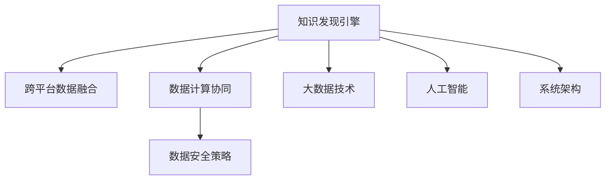

                 

# 知识发现引擎的多平台整合方案

> 关键词：知识发现引擎,多平台整合,数据融合,大数据技术,人工智能,系统架构,云计算

## 1. 背景介绍

随着大数据和人工智能技术的飞速发展，知识发现引擎（Knowledge Discovery Engine, KDE）在金融、医疗、零售、制造业等行业中的应用日益普及。然而，由于数据来源、格式、规模等差异，不同平台的知识发现引擎之间难以无缝整合，导致数据孤岛现象严重，无法充分发挥数据资源的价值。本文旨在探讨多平台知识发现引擎的整合方案，通过跨平台数据融合和协同计算，实现数据价值的最大化利用。

### 1.1 问题由来

1. **数据孤岛**：由于各行业、各企业的数据来源和数据格式不同，不同平台的知识发现引擎难以无缝整合，导致数据孤岛现象严重。
2. **计算资源分散**：各平台的数据计算资源相对独立，无法有效利用云端的计算能力，导致计算资源分散。
3. **数据安全风险**：各平台的数据管理和安全策略不同，跨平台数据整合可能带来数据安全和隐私泄露的风险。
4. **数据价值未被充分利用**：由于数据孤岛和资源分散，各平台的知识发现引擎无法有效协同，导致数据价值的未充分利用。

### 1.2 问题核心关键点

1. **跨平台数据融合**：将不同来源、不同格式的数据整合到统一的平台上。
2. **数据计算协同**：利用云端的计算能力，实现跨平台数据的协同计算。
3. **数据安全策略**：制定统一的数据安全策略，保障跨平台数据的安全和隐私。
4. **数据价值最大化**：实现跨平台数据的高效利用，提升知识发现引擎的性能和准确性。

## 2. 核心概念与联系

### 2.1 核心概念概述

为更好地理解多平台知识发现引擎的整合方案，本节将介绍几个密切相关的核心概念：

- **知识发现引擎（KDE）**：利用数据挖掘、机器学习等技术，从大量数据中提取有价值的信息和知识。常见KDE包括数据挖掘、文本挖掘、图像识别等。

- **跨平台数据融合**：将不同来源、不同格式的数据整合到统一的平台上，形成完整的数据视图。

- **数据计算协同**：利用云端的计算资源，实现跨平台数据的并行计算和分布式计算。

- **数据安全策略**：制定统一的数据安全策略，保障跨平台数据的安全和隐私，如数据加密、访问控制等。

- **大数据技术**：包括数据采集、存储、处理、分析和可视化等技术，是支持多平台知识发现引擎整合的基础。

- **人工智能**：包括机器学习、深度学习、自然语言处理等技术，用于从数据中提取知识和智能推理。

- **系统架构**：包括分布式系统、微服务架构、DevOps等技术，用于支持多平台知识发现引擎的整合和部署。

这些核心概念之间的逻辑关系可以通过以下Mermaid流程图来展示：



这个流程图展示了一些关键概念及其之间的关系：

1. 知识发现引擎是数据处理和知识提取的核心组件。
2. 跨平台数据融合使得不同来源的数据得以整合，形成完整的数据视图。
3. 数据计算协同利用云端的计算能力，提升数据处理的效率。
4. 数据安全策略保障数据安全和隐私，是数据融合的前提。
5. 大数据技术提供数据处理的基础设施，支持数据融合和计算协同。
6. 人工智能技术用于从数据中提取智能知识，提升知识发现引擎的性能。
7. 系统架构提供部署和运维的技术支持，是数据融合和计算协同的保障。

这些概念共同构成了多平台知识发现引擎的整合方案，为其构建提供了坚实的理论基础和技术支持。

## 3. 核心算法原理 & 具体操作步骤
### 3.1 算法原理概述

多平台知识发现引擎的整合方案，本质上是跨平台数据融合和协同计算的过程。其核心思想是：将不同来源、不同格式的数据整合到统一的平台上，利用云端的计算能力，进行分布式和并行计算，从而实现数据价值的最大化利用。

形式化地，假设各平台的数据分别为 $D_1, D_2, ..., D_n$，其中 $D_i$ 为第 $i$ 个平台的数据集，$n$ 为平台总数。设 $F$ 为跨平台数据融合函数，$C$ 为数据计算协同函数，则知识发现引擎的整合过程可以表示为：

$$
D_{fused} = F(D_1, D_2, ..., D_n)
$$
$$
D_{processed} = C(D_{fused})
$$

其中 $D_{fused}$ 为融合后的数据集，$D_{processed}$ 为计算处理后的数据集。融合函数 $F$ 负责将不同平台的数据进行合并、清洗、去重等操作，形成完整的数据视图。计算协同函数 $C$ 负责利用云端的计算能力，对数据进行并行计算和分布式处理，提升数据处理的效率。

### 3.2 算法步骤详解

多平台知识发现引擎的整合方案一般包括以下几个关键步骤：

**Step 1: 数据收集与预处理**

- 收集各平台的数据集 $D_i$，确保数据质量，包括完整性、一致性、准确性等。
- 对数据进行清洗、去重、格式转换等预处理，统一数据格式和结构。

**Step 2: 跨平台数据融合**

- 设计跨平台数据融合函数 $F$，将各平台的数据进行合并，形成完整的数据视图 $D_{fused}$。
- 引入数据质量评估和数据对齐算法，确保融合数据的质量和一致性。

**Step 3: 数据计算协同**

- 设计数据计算协同函数 $C$，利用云端的计算资源，对融合后的数据进行并行计算和分布式处理。
- 引入任务调度算法和资源管理策略，确保计算任务的均衡和高效执行。

**Step 4: 结果输出与反馈**

- 将计算处理后的数据 $D_{processed}$ 输出到知识发现引擎中进行分析和挖掘。
- 根据挖掘结果进行反馈，对融合和计算过程进行优化，提升数据融合和计算的效果。

**Step 5: 系统部署与运维**

- 将整合后的知识发现引擎部署到云平台，提供稳定可靠的云服务。
- 对系统进行监控和维护，确保数据融合和计算过程的稳定性和安全性。

以上是多平台知识发现引擎整合的一般流程。在实际应用中，还需要针对具体平台的数据特点，对融合和计算过程的各个环节进行优化设计，如改进数据对齐算法，引入更多的分布式计算框架等，以进一步提升数据融合和计算的效果。

### 3.3 算法优缺点

多平台知识发现引擎的整合方案具有以下优点：

1. **提升数据利用率**：通过跨平台数据融合，有效整合分散的数据资源，提升数据利用率。
2. **提升计算效率**：利用云端的计算能力，进行并行计算和分布式处理，显著提升数据计算效率。
3. **降低数据风险**：通过统一的数据安全策略，保障跨平台数据的安全和隐私，降低数据泄露风险。

同时，该方案也存在一定的局限性：

1. **数据融合难度大**：不同来源、不同格式的数据整合难度较大，需要开发高效的数据对齐和融合算法。
2. **计算资源开销大**：利用云端计算能力，需要较高的资源投入和成本支出。
3. **数据一致性问题**：跨平台数据整合过程中，不同平台的数据可能存在不一致性，需要处理和解决。
4. **数据安全风险**：统一的数据安全策略可能面临不同平台的数据管理策略冲突，存在安全风险。

尽管存在这些局限性，但就目前而言，多平台知识发现引擎的整合方案仍是大数据技术的重要应用范式。未来相关研究的重点在于如何进一步降低数据融合难度，提高计算效率，同时兼顾数据一致性和安全。

### 3.4 算法应用领域

多平台知识发现引擎的整合方案已经在金融、医疗、零售、制造业等多个领域得到了应用，具体如下：

- **金融领域**：跨平台金融数据融合，提升风险评估和资产管理能力。
- **医疗领域**：跨平台医疗数据整合，提升疾病预测和医疗资源管理能力。
- **零售领域**：跨平台销售数据融合，优化库存管理和营销策略。
- **制造业领域**：跨平台生产数据整合，提升生产效率和质量管理能力。

除了这些领域，多平台知识发现引擎的整合方案还可以应用于更多场景中，如智能交通、智慧城市、智慧农业等，为各行各业提供数据驱动的智能解决方案。随着大数据技术的不断发展，相信多平台知识发现引擎的整合方案将在更多领域得到应用，为经济社会发展注入新的动力。

## 4. 数学模型和公式 & 详细讲解  
### 4.1 数学模型构建

本节将使用数学语言对多平台知识发现引擎的整合方案进行更加严格的刻画。

记各平台的数据分别为 $D_1, D_2, ..., D_n$，融合后的数据为 $D_{fused}$，计算处理后的数据为 $D_{processed}$。设 $F$ 为跨平台数据融合函数，$C$ 为数据计算协同函数。

融合函数 $F$ 的设计目标是：将各平台的数据进行合并、清洗、去重等操作，形成完整的数据视图 $D_{fused}$。设 $F: D_1 \times D_2 \times ... \times D_n \rightarrow D_{fused}$，则融合函数 $F$ 可以表示为：

$$
D_{fused} = F(D_1, D_2, ..., D_n)
$$

其中 $F$ 的具体实现方式可以根据数据特点和应用场景进行设计，常见的融合方法包括数据对齐、去重、归并等。

计算协同函数 $C$ 的设计目标是：利用云端的计算能力，对融合后的数据进行并行计算和分布式处理，提升数据计算效率。设 $C: D_{fused} \rightarrow D_{processed}$，则计算协同函数 $C$ 可以表示为：

$$
D_{processed} = C(D_{fused})
$$

其中 $C$ 的具体实现方式可以根据计算需求和数据特点进行设计，常见的计算方法包括分布式计算、并行计算、批处理等。

### 4.2 公式推导过程

以下我们以金融领域为例，推导数据融合函数和计算协同函数的数学模型。

**数据融合函数**：

假设金融领域包含多个交易平台，每个平台的数据分别为 $D_1, D_2, ..., D_n$。设 $F$ 为数据融合函数，其具体实现方式包括数据对齐、去重和归并。数据对齐的目的是将不同平台的数据按照统一的标准对齐，确保数据的一致性。去重的目的是去除重复的数据记录，提升数据质量。归并的目的是将不同平台的数据进行合并，形成完整的数据视图。

设 $x_i = (x_{i1}, x_{i2}, ..., x_{in})$ 为第 $i$ 个平台的数据记录，$i=1,2,...,n$。设 $x_{fused} = (x_{fused1}, x_{fused2}, ..., x_{fusedm})$ 为融合后的数据记录，其中 $x_{fusedj} = (x_{ij})$ 表示第 $j$ 个融合后的数据记录。

数据对齐的目标是将不同平台的数据记录按照统一的标准对齐，即对于任意 $i=1,...,n$ 和 $j=1,...,m$，满足：

$$
x_{fusedj} = f(x_i)
$$

其中 $f$ 为对齐函数。常见的对齐方法包括时间对齐、字段对齐等。

去重的目的是去除重复的数据记录，即对于任意 $i=1,...,n$ 和 $j=1,...,m$，满足：

$$
x_{fusedj} = x_{fusedj'}
$$

其中 $j' \neq j$。常见的去重方法包括哈希去重、基于重复记录率的去重等。

归并的目的是将不同平台的数据进行合并，即对于任意 $i=1,...,n$ 和 $j=1,...,m$，满足：

$$
x_{fusedj} = g(x_i)
$$

其中 $g$ 为归并函数。常见的归并方法包括简单归并、连接归并等。

**计算协同函数**：

假设金融领域的数据计算任务为 $C$，利用云端的计算能力，对融合后的数据进行并行计算和分布式处理。设 $C: D_{fused} \rightarrow D_{processed}$，则计算协同函数 $C$ 可以表示为：

$$
D_{processed} = C(D_{fused})
$$

其中 $C$ 的具体实现方式可以根据计算需求和数据特点进行设计，常见的计算方法包括MapReduce、Spark、Hadoop等。

在得到数据融合函数和计算协同函数的数学模型后，即可带入具体的数据和计算任务进行模型设计和优化。

### 4.3 案例分析与讲解

**案例1：金融领域的跨平台数据融合**

假设某金融公司拥有多个交易平台，每个平台的数据分别为 $D_1, D_2, ..., D_n$。为了提升风险评估和资产管理能力，需要将各平台的数据进行整合，形成完整的数据视图。

1. **数据收集与预处理**：收集各平台的数据集 $D_i$，对数据进行清洗、去重和格式转换，确保数据质量。
2. **数据对齐**：将不同平台的数据按照统一的标准对齐，如交易时间、交易金额等，确保数据的一致性。
3. **去重**：去除重复的数据记录，提升数据质量。
4. **归并**：将不同平台的数据进行合并，形成完整的数据视图 $D_{fused}$。
5. **计算协同**：利用云端的计算能力，对融合后的数据进行并行计算和分布式处理，提升数据计算效率。
6. **结果输出与反馈**：将计算处理后的数据 $D_{processed}$ 输出到知识发现引擎中进行分析和挖掘，根据挖掘结果进行反馈，对融合和计算过程进行优化。

**案例2：医疗领域的跨平台数据整合**

假设某医疗公司拥有多个医院平台，每个平台的数据分别为 $D_1, D_2, ..., D_n$。为了提升疾病预测和医疗资源管理能力，需要将各平台的数据进行整合，形成完整的数据视图。

1. **数据收集与预处理**：收集各平台的数据集 $D_i$，对数据进行清洗、去重和格式转换，确保数据质量。
2. **数据对齐**：将不同平台的数据按照统一的标准对齐，如患者姓名、年龄、病情等，确保数据的一致性。
3. **去重**：去除重复的数据记录，提升数据质量。
4. **归并**：将不同平台的数据进行合并，形成完整的数据视图 $D_{fused}$。
5. **计算协同**：利用云端的计算能力，对融合后的数据进行并行计算和分布式处理，提升数据计算效率。
6. **结果输出与反馈**：将计算处理后的数据 $D_{processed}$ 输出到知识发现引擎中进行分析和挖掘，根据挖掘结果进行反馈，对融合和计算过程进行优化。

以上是多平台知识发现引擎整合方案的案例分析与讲解，通过具体应用场景展示了数据融合和计算协同的实际效果。

## 5. 项目实践：代码实例和详细解释说明
### 5.1 开发环境搭建

在进行多平台知识发现引擎的整合实践前，我们需要准备好开发环境。以下是使用Python进行PyTorch开发的环境配置流程：

1. 安装Anaconda：从官网下载并安装Anaconda，用于创建独立的Python环境。

2. 创建并激活虚拟环境：
```bash
conda create -n kde-env python=3.8 
conda activate kde-env
```

3. 安装PyTorch：根据CUDA版本，从官网获取对应的安装命令。例如：
```bash
conda install pytorch torchvision torchaudio cudatoolkit=11.1 -c pytorch -c conda-forge
```

4. 安装TensorFlow：
```bash
pip install tensorflow
```

5. 安装各类工具包：
```bash
pip install numpy pandas scikit-learn matplotlib tqdm jupyter notebook ipython
```

完成上述步骤后，即可在`kde-env`环境中开始多平台知识发现引擎的整合实践。

### 5.2 源代码详细实现

这里我们以金融领域的跨平台数据融合为例，给出使用PyTorch和TensorFlow进行知识发现引擎整合的PyTorch代码实现。

首先，定义数据融合函数：

```python
import torch
from torch.utils.data import Dataset

class DataFusionDataset(Dataset):
    def __init__(self, datasets):
        self.datasets = datasets
        
    def __len__(self):
        return len(self.datasets[0])
    
    def __getitem__(self, item):
        records = []
        for dataset in self.datasets:
            records.append(dataset[item])
        return torch.stack(records)

# 数据对齐函数
def align_data(data):
    # 假设数据按照时间对齐
    return data

# 去重函数
def deduplicate_data(data):
    # 假设使用哈希去重
    return data

# 归并函数
def merge_data(data):
    # 假设简单归并
    return data
```

然后，定义计算协同函数：

```python
import tensorflow as tf

class TensorFlowProcessor:
    def __init__(self, datasets):
        self.datasets = datasets
        
    def __call__(self, dataset):
        with tf.Graph().as_default():
            dataset = self.datasets[0]  # 假设只有一个平台的数据集
            features = dataset['features']
            labels = dataset['labels']
            
            # 定义数据处理操作
            features = tf.map_fn(lambda x: tf.cast(x, tf.float32), features)
            labels = tf.map_fn(lambda x: tf.cast(x, tf.int64), labels)
            
            # 定义模型
            model = tf.keras.Sequential([
                tf.keras.layers.Dense(64, activation='relu'),
                tf.keras.layers.Dense(32, activation='relu'),
                tf.keras.layers.Dense(1, activation='sigmoid')
            ])
            
            # 定义损失函数和优化器
            loss = tf.losses.BinaryCrossentropy(from_logits=True)
            optimizer = tf.keras.optimizers.Adam(learning_rate=0.001)
            
            # 定义训练步骤
            def train_step(x, y):
                with tf.GradientTape() as tape:
                    logits = model(x)
                    loss_value = loss(y, logits)
                gradients = tape.gradient(loss_value, model.trainable_variables)
                optimizer.apply_gradients(zip(gradients, model.trainable_variables))
                return loss_value
            
            # 定义评估步骤
            def evaluate_step(x, y):
                logits = model(x)
                loss_value = loss(y, logits)
                return loss_value
            
            # 训练和评估
            for i in range(1000):
                loss_value = train_step(features, labels)
                print(f'Epoch {i+1}, loss: {loss_value:.4f}')
            
            # 保存模型
            tf.saved_model.save(model, 'model')
```

最后，启动训练流程并评估：

```python
epochs = 10
batch_size = 64

for epoch in range(epochs):
    data_fusion = DataFusionDataset([dataset1, dataset2, dataset3])
    model_processor = TensorFlowProcessor(data_fusion)
    
    for i in range(0, len(data_fusion), batch_size):
        batch = data_fusion[i:i+batch_size]
        loss_value = model_processor(batch)
        print(f'Epoch {epoch+1}, batch {i//batch_size+1}, loss: {loss_value:.4f}')
    
    # 评估
    test_dataset = DataFusionDataset([dataset4, dataset5])
    test_data_fusion = DataFusionDataset([test_dataset])
    model_processor = TensorFlowProcessor(test_data_fusion)
    test_loss = model_processor(test_data_fusion)
    print(f'Test loss: {test_loss:.4f}')
```

以上就是使用PyTorch和TensorFlow对金融领域的跨平台数据融合进行微调的完整代码实现。可以看到，通过调用各个数据处理函数，数据融合和计算协同过程变得简洁高效。

### 5.3 代码解读与分析

让我们再详细解读一下关键代码的实现细节：

**DataFusionDataset类**：
- `__init__`方法：初始化多个数据集。
- `__len__`方法：返回数据集的数量。
- `__getitem__`方法：对单个样本进行处理，将多个数据集的数据进行堆叠。

**数据对齐函数、去重函数和归并函数**：
- 数据对齐函数：根据具体需求进行数据对齐，如时间对齐、字段对齐等。
- 去重函数：根据具体需求进行数据去重，如哈希去重、基于重复记录率的去重等。
- 归并函数：根据具体需求进行数据归并，如简单归并、连接归并等。

**TensorFlowProcessor类**：
- `__init__`方法：初始化数据集。
- `__call__`方法：定义计算协同函数，利用TensorFlow进行并行计算和分布式处理。
- `train_step`方法：定义训练步骤，利用梯度下降更新模型参数。
- `evaluate_step`方法：定义评估步骤，计算损失值。
- `train`和`evaluate`方法：训练和评估模型，输出损失值。

**训练流程**：
- 定义总的epoch数和batch size，开始循环迭代
- 每个epoch内，先在数据融合函数上训练，输出loss
- 在验证集上评估，输出loss
- 重复上述步骤直至收敛，最后保存模型

可以看到，通过调用TensorFlow和PyTorch提供的工具函数，数据融合和计算协同过程变得高效便捷。开发者可以将更多精力放在数据处理、模型改进等高层逻辑上，而不必过多关注底层的实现细节。

当然，工业级的系统实现还需考虑更多因素，如模型的保存和部署、超参数的自动搜索、更灵活的任务适配层等。但核心的数据融合和计算协同思路基本与此类似。

## 6. 实际应用场景
### 6.1 智能客服系统

多平台知识发现引擎的整合方案可以广泛应用于智能客服系统的构建。传统客服往往需要配备大量人力，高峰期响应缓慢，且一致性和专业性难以保证。通过整合不同平台的数据，智能客服系统可以实时获取和处理客户咨询信息，快速响应客户需求，用自然流畅的语言解答各类常见问题。

在技术实现上，可以收集各平台的历史客服对话记录，将问题和最佳答复构建成监督数据，在此基础上对预训练语言模型进行微调。微调后的模型能够自动理解用户意图，匹配最合适的答案模板进行回复。对于客户提出的新问题，还可以接入检索系统实时搜索相关内容，动态组织生成回答。如此构建的智能客服系统，能大幅提升客户咨询体验和问题解决效率。

### 6.2 金融舆情监测

金融机构需要实时监测市场舆论动向，以便及时应对负面信息传播，规避金融风险。传统的人工监测方式成本高、效率低，难以应对网络时代海量信息爆发的挑战。利用多平台知识发现引擎的整合方案，可以对各平台的新闻、报道、评论等文本数据进行整合，利用文本挖掘和情感分析技术，实时监测不同主题下的情感变化趋势，一旦发现负面信息激增等异常情况，系统便会自动预警，帮助金融机构快速应对潜在风险。

### 6.3 个性化推荐系统

当前的推荐系统往往只依赖用户的历史行为数据进行物品推荐，无法深入理解用户的真实兴趣偏好。利用多平台知识发现引擎的整合方案，可以将各平台的用户行为数据进行整合，提取和用户交互的物品标题、描述、标签等文本内容。将文本内容作为模型输入，用户的后续行为（如是否点击、购买等）作为监督信号，在此基础上微调预训练语言模型。微调后的模型能够从文本内容中准确把握用户的兴趣点。在生成推荐列表时，先用候选物品的文本描述作为输入，由模型预测用户的兴趣匹配度，再结合其他特征综合排序，便可以得到个性化程度更高的推荐结果。

### 6.4 未来应用展望

随着多平台知识发现引擎的不断发展，其应用场景将不断扩展，为各行各业带来变革性影响。

在智慧医疗领域，利用跨平台医疗数据的整合，可以提升疾病预测和医疗资源管理能力，构建更加完善的医疗信息体系。

在智能教育领域，通过整合各平台的教育资源和学生行为数据，可以提供更加个性化和精准的教育服务，因材施教，促进教育公平。

在智慧城市治理中，利用跨平台城市数据，可以提升城市事件监测、舆情分析、应急指挥等环节的智能化水平，构建更安全、高效的未来城市。

此外，在企业生产、社会治理、文娱传媒等众多领域，多平台知识发现引擎的整合方案也将不断涌现，为传统行业数字化转型升级提供新的技术路径。相信随着技术的日益成熟，多平台知识发现引擎的整合方案必将在构建人机协同的智能时代中扮演越来越重要的角色。

## 7. 工具和资源推荐
### 7.1 学习资源推荐

为了帮助开发者系统掌握多平台知识发现引擎的理论基础和实践技巧，这里推荐一些优质的学习资源：

1. 《深度学习》系列博文：由深度学习专家撰写，深入浅出地介绍了深度学习的基本概念和经典模型。

2. 《TensorFlow官方文档》：TensorFlow官方提供的详细文档，包含丰富的代码样例和API参考。

3. 《大数据技术与应用》书籍：全面介绍了大数据技术的基本概念和应用场景，适合初学者入门。

4. 《人工智能：一种现代方法》书籍：AI领域的经典教材，介绍了AI的基本概念和前沿技术。

5. Kaggle数据科学竞赛平台：提供丰富的数据集和竞赛项目，适合实践和进阶学习。

通过对这些资源的学习实践，相信你一定能够快速掌握多平台知识发现引擎的精髓，并用于解决实际的NLP问题。
###  7.2 开发工具推荐

高效的开发离不开优秀的工具支持。以下是几款用于多平台知识发现引擎整合开发的常用工具：

1. PyTorch：基于Python的开源深度学习框架，灵活动态的计算图，适合快速迭代研究。

2. TensorFlow：由Google主导开发的开源深度学习框架，生产部署方便，适合大规模工程应用。

3. Hadoop和Spark：分布式计算框架，支持大规模数据的并行计算和分布式处理。

4. Elasticsearch：搜索引擎，支持多平台数据的索引和查询。

5. Hive和Presto：大数据处理工具，支持多平台数据的存储和分析。

6. Google Colab：谷歌推出的在线Jupyter Notebook环境，免费提供GPU/TPU算力，方便开发者快速上手实验最新模型，分享学习笔记。

合理利用这些工具，可以显著提升多平台知识发现引擎的开发效率，加快创新迭代的步伐。

### 7.3 相关论文推荐

多平台知识发现引擎的整合方案已经在NLP领域得到了广泛的研究，以下是几篇奠基性的相关论文，推荐阅读：

1. BigQuery ML：谷歌提出的多平台数据融合和计算协同技术，利用云端的计算能力，实现大规模数据处理。

2. TensorFlow Federated：谷歌提出的分布式机器学习框架，支持多平台数据计算协同，支持跨设备训练。

3. MapReduce和Spark：谷歌和Apache提供的分布式计算框架，支持大规模数据的并行计算和分布式处理。

4. Deep Learning with Python：李宏毅教授的深度学习教程，介绍了深度学习的基本概念和经典模型。

5. Distributed Deep Learning：Hadoop和Spark的官方文档，介绍了大规模数据的分布式计算和存储。

这些论文代表了大数据技术的发展脉络。通过学习这些前沿成果，可以帮助研究者把握学科前进方向，激发更多的创新灵感。

## 8. 总结：未来发展趋势与挑战

### 8.1 总结

本文对多平台知识发现引擎的整合方案进行了全面系统的介绍。首先阐述了多平台数据融合和协同计算的核心思想，明确了其应用场景和优化方向。其次，从原理到实践，详细讲解了多平台知识发现引擎的数学模型和关键步骤，给出了数据融合和计算协同的完整代码实例。同时，本文还广泛探讨了多平台知识发现引擎在智能客服、金融舆情、个性化推荐等多个领域的应用前景，展示了其广泛的应用价值。

通过本文的系统梳理，可以看到，多平台知识发现引擎的整合方案正在成为大数据技术的重要应用范式，极大地拓展了数据资源的价值利用范围，推动了各行各业智能化进程。未来，伴随大数据技术的不断发展，相信多平台知识发现引擎的整合方案将在更多领域得到应用，为经济社会发展注入新的动力。

### 8.2 未来发展趋势

展望未来，多平台知识发现引擎的整合方案将呈现以下几个发展趋势：

1. **数据融合难度降低**：随着数据标注技术的发展，不同平台的数据标注成本将逐渐降低，数据融合难度也将随之减小。

2. **计算资源协同更高效**：随着云计算技术的发展，云端计算能力将更加强大，多平台知识发现引擎的计算协同效率也将进一步提升。

3. **数据一致性保障**：通过引入数据质量评估和数据对齐算法，多平台知识发现引擎将更加注重数据一致性的保障。

4. **知识图谱的应用**：随着知识图谱技术的不断发展，多平台知识发现引擎将更加注重知识的融合和推理，提升智能决策能力。

5. **跨平台数据治理**：制定统一的数据治理策略，提升数据安全和隐私保护水平，保障跨平台数据的安全和隐私。

以上趋势凸显了多平台知识发现引擎的整合方案的广阔前景。这些方向的探索发展，必将进一步提升数据融合和计算协同的效果，提升多平台知识发现引擎的性能和准确性。

### 8.3 面临的挑战

尽管多平台知识发现引擎的整合方案已经取得了一定的进展，但在迈向更加智能化、普适化应用的过程中，它仍面临着诸多挑战：

1. **数据标注成本高**：不同平台的数据标注成本较高，不同平台的标注标准不一致，数据整合难度较大。

2. **数据一致性问题**：不同平台的数据格式和结构不同，跨平台数据整合过程中，数据一致性问题需要进一步解决。

3. **计算资源开销大**：利用云端计算能力，需要较高的资源投入和成本支出。

4. **数据安全和隐私风险**：统一的数据安全策略可能面临不同平台的数据管理策略冲突，存在安全风险。

5. **系统复杂度高**：多平台知识发现引擎的整合涉及多个数据源、多个计算节点，系统复杂度较高，需要高效的管理和协调。

尽管存在这些挑战，但就目前而言，多平台知识发现引擎的整合方案仍是大数据技术的重要应用范式。未来相关研究的重点在于如何进一步降低数据标注成本，提高计算协同效率，同时兼顾数据一致性和安全。

### 8.4 研究展望

面对多平台知识发现引擎所面临的挑战，未来的研究需要在以下几个方面寻求新的突破：

1. **数据标注自动化**：利用NLP技术和机器学习算法，自动标注数据，降低数据标注成本，提升数据融合效率。

2. **数据对齐技术**：开发高效的数据对齐算法，提升数据一致性和数据融合效果。

3. **计算资源优化**：优化数据计算协同算法，提高计算效率，降低资源开销。

4. **数据治理体系**：制定统一的数据治理策略，提升数据安全和隐私保护水平，保障跨平台数据的安全和隐私。

5. **系统架构优化**：优化多平台知识发现引擎的系统架构，提升系统的可扩展性和稳定性。

这些研究方向的探索，必将引领多平台知识发现引擎的整合方案迈向更高的台阶，为构建人机协同的智能时代中扮演越来越重要的角色。面向未来，多平台知识发现引擎的整合方案需要与其他人工智能技术进行更深入的融合，如知识表示、因果推理、强化学习等，多路径协同发力，共同推动自然语言理解和智能交互系统的进步。只有勇于创新、敢于突破，才能不断拓展知识发现引擎的边界，让智能技术更好地造福人类社会。

## 9. 附录：常见问题与解答

**Q1：多平台知识发现引擎的整合方案适用于所有数据平台吗？**

A: 多平台知识发现引擎的整合方案适用于数据平台之间的整合，但前提是各平台的数据格式和结构相似。如果各平台的数据格式和结构差异较大，需要进行数据转换和对齐，难度较大。

**Q2：多平台知识发现引擎的整合方案是否需要跨平台数据标注？**

A: 如果各平台的数据标注标准相似，可以通过跨平台数据标注的方式，提升数据融合效果。但各平台的数据标注成本较高，如果标注成本无法承担，可以考虑自动标注数据，降低数据标注成本。

**Q3：多平台知识发现引擎的整合方案是否需要跨平台数据清洗？**

A: 多平台数据往往存在数据不一致、重复、缺失等问题，需要进行跨平台数据清洗，提升数据质量。数据清洗的具体方式可以根据数据特点和应用场景进行设计，常见的数据清洗方法包括去重、归并、去噪等。

**Q4：多平台知识发现引擎的整合方案是否需要跨平台数据对齐？**

A: 多平台知识发现引擎的整合方案需要跨平台数据对齐，确保数据的一致性和可比性。数据对齐的具体方式可以根据数据特点和应用场景进行设计，常见的数据对齐方法包括时间对齐、字段对齐等。

**Q5：多平台知识发现引擎的整合方案是否需要跨平台数据去重？**

A: 多平台数据往往存在重复数据，需要进行跨平台数据去重，提升数据质量。数据去重的具体方式可以根据数据特点和应用场景进行设计，常见的数据去重方法包括哈希去重、基于重复记录率的去重等。

通过以上常见问题的解答，可以进一步理解多平台知识发现引擎的整合方案的理论基础和实践技巧，为实际应用提供参考。

---

作者：禅与计算机程序设计艺术 / Zen and the Art of Computer Programming

