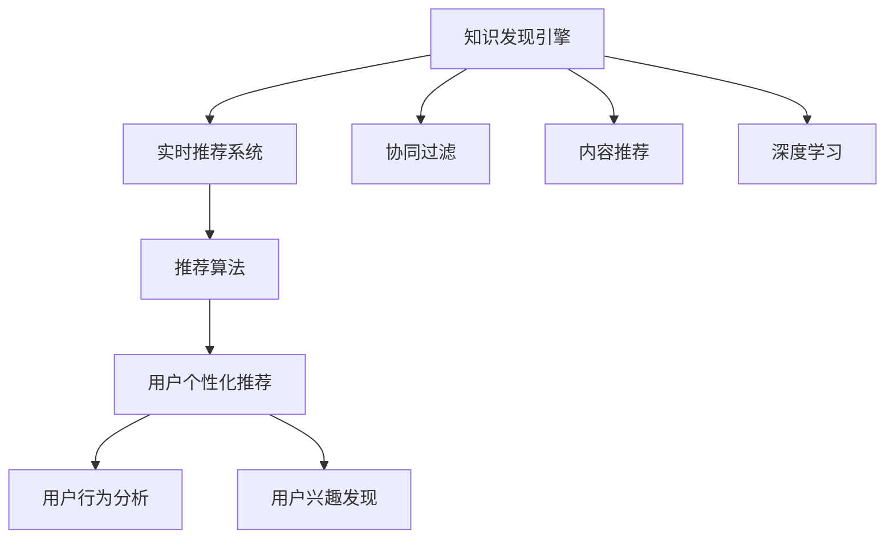

                 

# 知识发现引擎的实时推荐系统

> 关键词：实时推荐系统,知识发现引擎,推荐算法,协同过滤,内容推荐,深度学习

## 1. 背景介绍

### 1.1 问题由来
随着互联网和社交媒体的普及，用户生成的内容越来越多，推荐系统已经成为网站和应用提供个性化服务的重要手段。传统的推荐系统通常基于用户的浏览历史和偏好进行推荐，但这种基于历史数据的推荐方式在冷启动用户和个性化要求较高的场景中显得不够灵活和高效。

知识发现引擎(Knowledge Discovery Engine, KDE)是一种可以自动识别和提取数据中潜在知识模式的工具，通过发现用户与用户、用户与内容之间的隐含关系，可以更好地为用户提供个性化的推荐服务。在知识发现引擎的基础上，结合实时推荐技术，可以构建更加精准、及时的推荐系统。

### 1.2 问题核心关键点
知识发现引擎与实时推荐系统的结合，旨在通过数据挖掘和模式识别技术，对用户行为数据进行深入分析，发现其中的隐含关系，从而为用户生成个性化的推荐。这种基于内容的推荐方式，可以克服传统推荐系统依赖历史数据、冷启动用户的问题，适应性强、精度高，适用于各种推荐场景。

## 2. 核心概念与联系

### 2.1 核心概念概述

为更好地理解知识发现引擎与实时推荐系统的结合方法，本节将介绍几个密切相关的核心概念：

- 知识发现引擎(Knowledge Discovery Engine, KDE)：通过对数据进行清洗、变换、分析等步骤，自动地提取数据中的隐含知识和模式，如用户行为特征、用户兴趣分布等。
- 实时推荐系统(Real-time Recommendation System)：基于用户的实时行为数据和历史偏好，快速生成个性化的推荐结果，提供即时性的用户体验。
- 协同过滤(Collaborative Filtering)：一种通过分析用户行为和物品属性，发现用户与用户之间、物品与物品之间的相似性，从而进行推荐的技术。
- 内容推荐(Content-based Recommendation)：根据用户的历史行为、兴趣偏好，分析物品的属性特征，找到与用户匹配的物品进行推荐。
- 深度学习(Deep Learning)：一种通过多层神经网络模拟人脑处理数据的方式，可以自动地从数据中学习特征，并用于推荐任务。

这些核心概念之间的逻辑关系可以通过以下Mermaid流程图来展示：



这个流程图展示了几者之间的关系：

1. 知识发现引擎通过数据分析发现用户行为模式。
2. 实时推荐系统基于知识发现引擎的结果，快速生成推荐。
3. 协同过滤、内容推荐和深度学习是知识发现引擎中常用的技术手段。
4. 推荐算法通过多种技术手段综合生成推荐结果。
5. 推荐结果提供给用户，同时反馈用户行为进行持续优化。

## 3. 核心算法原理 & 具体操作步骤
### 3.1 算法原理概述

知识发现引擎与实时推荐系统的结合，主要依赖于协同过滤、内容推荐和深度学习等技术手段。其中，协同过滤和内容推荐侧重于分析用户与用户、用户与物品之间的关联性，而深度学习则通过多层神经网络模拟人脑处理数据，自动提取数据中的隐含特征。

协同过滤算法的基本原理是：通过分析用户的行为数据，找到与目标用户兴趣相似的用户，从而推荐该用户喜欢的物品。具体实现上，可以采用基于用户的协同过滤、基于物品的协同过滤等不同方法。

内容推荐算法则是通过分析物品的属性特征，如标签、类别等，找到与用户兴趣匹配的物品。这种推荐方式适用于物品属性丰富、用户行为数据较少的场景。

深度学习算法则是通过构建多层神经网络模型，自动地从数据中学习特征，用于推荐任务。深度学习模型可以通过预训练和微调等方法，提升推荐精度和鲁棒性。

### 3.2 算法步骤详解

基于知识发现引擎的实时推荐系统的构建主要包括以下几个关键步骤：

**Step 1: 数据收集与预处理**
- 收集用户的行为数据，如浏览、点击、评分等。
- 收集物品的属性信息，如标签、类别、价格等。
- 对数据进行清洗和预处理，去除噪声和异常值。

**Step 2: 特征工程**
- 提取用户的特征，如浏览历史、评分历史、活跃时间等。
- 提取物品的特征，如标签、类别、价格等。
- 对用户和物品进行编码，构建特征向量。

**Step 3: 知识发现**
- 应用协同过滤算法，发现用户与用户之间的相似性，找到相似用户。
- 应用内容推荐算法，分析物品属性特征，找到与用户兴趣匹配的物品。
- 应用深度学习算法，通过多层神经网络模型，自动提取数据中的隐含特征。

**Step 4: 模型训练与优化**
- 训练推荐模型，优化模型参数，提高推荐精度。
- 应用正则化技术，防止过拟合。
- 应用早停策略，确定最优迭代次数。

**Step 5: 实时推荐与反馈优化**
- 基于知识发现的结果，实时生成推荐结果。
- 根据用户的实时反馈数据，不断调整和优化推荐模型。

**Step 6: 部署与监控**
- 将推荐系统部署到生产环境，进行实时推荐。
- 监控系统性能，及时调整和优化。

### 3.3 算法优缺点

基于知识发现引擎的实时推荐系统具有以下优点：
1. 个性化推荐。通过知识发现技术，可以更好地挖掘用户兴趣和行为模式，提供更个性化的推荐结果。
2. 实时性高。实时推荐系统可以快速生成推荐结果，满足用户即时性需求。
3. 适应性强。结合协同过滤、内容推荐和深度学习等技术手段，可以适应不同场景和数据特点。

同时，该方法也存在一定的局限性：
1. 数据依赖。推荐结果的准确性高度依赖于数据质量和数量，获取高质量数据成本较高。
2. 模型复杂。知识发现和推荐算法较为复杂，模型的训练和优化难度较大。
3. 可解释性不足。深度学习模型的决策过程通常缺乏可解释性，难以对其进行分析和调试。

尽管存在这些局限性，但就目前而言，基于知识发现引擎的实时推荐系统仍是一种主流的推荐方式。未来相关研究的重点在于如何进一步降低数据依赖，提高推荐算法的可解释性和鲁棒性，同时兼顾实时性和性能。

### 3.4 算法应用领域

基于知识发现引擎的实时推荐系统已经在电商、社交媒体、视频流等多个领域得到广泛应用，成为推荐系统的主要技术手段。

在电商领域，实时推荐系统可以为用户推荐商品，提升购买转化率和满意度。结合协同过滤、内容推荐和深度学习等技术，推荐结果更加精准、个性化，能够有效提升用户体验。

在社交媒体平台，实时推荐系统可以为用户推荐兴趣内容，提高平台粘性和用户活跃度。推荐算法可以通过分析用户行为和社交关系，发现更多相似用户，提供更加多样化的内容推荐。

在视频流平台，实时推荐系统可以为用户推荐视频内容，提高用户留存率和观看时长。结合深度学习算法，推荐系统可以自动分析视频内容特征，找到与用户兴趣匹配的视频，实现个性化的内容推荐。

除了上述这些经典应用场景外，实时推荐系统还在在线教育、旅游、金融等诸多领域得到应用，为传统行业带来了更加智能化的服务体验。

## 4. 数学模型和公式 & 详细讲解 & 举例说明
### 4.1 数学模型构建

本节将使用数学语言对基于知识发现引擎的实时推荐系统进行更加严格的刻画。

记用户行为数据为 $D=\{(x_i,y_i)\}_{i=1}^N, x_i \in \mathcal{X}, y_i \in \mathcal{Y}$，其中 $\mathcal{X}$ 为特征空间，$\mathcal{Y}$ 为标签空间。假设物品属性数据为 $M=\{(m_j, m_j^')\}_{j=1}^M, m_j \in \mathcal{M}, m_j' \in \mathcal{M}'$，其中 $\mathcal{M}$ 为物品属性空间，$\mathcal{M}'$ 为属性标签空间。

定义推荐模型为 $f: \mathcal{X} \times \mathcal{M} \rightarrow \mathcal{Y}$，其中 $f(x, m)$ 表示在物品属性 $m$ 和用户特征 $x$ 下，推荐模型预测用户是否会进行相应的行为。

推荐系统的目标是最小化预期损失函数，即：

$$
\min_{f} \mathbb{E}_{(x,y)} [\ell(f(x, M), y)]
$$

其中 $\ell$ 为损失函数，通常包括均方误差、交叉熵等。

### 4.2 公式推导过程

以下我们以协同过滤算法为例，推导推荐模型的损失函数及其梯度计算公式。

假设协同过滤模型通过计算用户 $u$ 与用户 $v$ 的相似度 $\hat{s}_{uv}$，找到与用户 $u$ 兴趣相似的用户 $v$，并将其推荐的物品 $m$ 作为预测结果。则推荐模型的预测结果为 $\hat{y}=f(x, m)=\hat{s}_{uv}$。

推荐模型的损失函数为均方误差：

$$
\ell(y, \hat{y}) = (y-\hat{y})^2
$$

代入预测结果，得：

$$
\mathcal{L}(f) = \frac{1}{N} \sum_{i=1}^N \ell(y_i, \hat{y}_i)
$$

对损失函数求导，得：

$$
\frac{\partial \mathcal{L}(f)}{\partial f(x, m)} = -2(y - f(x, m))
$$

根据链式法则，推荐模型的梯度为：

$$
\frac{\partial \mathcal{L}(f)}{\partial \theta} = \frac{\partial \mathcal{L}(f)}{\partial f(x, m)} \frac{\partial f(x, m)}{\partial \theta}
$$

其中 $\theta$ 为模型参数，$\frac{\partial f(x, m)}{\partial \theta}$ 为模型预测结果对模型参数的偏导数，可通过自动微分技术高效计算。

在得到梯度后，即可带入优化算法，最小化损失函数，更新模型参数。重复上述过程直至收敛，最终得到适应推荐任务的最优模型参数 $\theta^*$。

## 5. 项目实践：代码实例和详细解释说明
### 5.1 开发环境搭建

在进行推荐系统开发前，我们需要准备好开发环境。以下是使用Python进行Scikit-learn开发的环境配置流程：

1. 安装Anaconda：从官网下载并安装Anaconda，用于创建独立的Python环境。

2. 创建并激活虚拟环境：
```bash
conda create -n recommender-env python=3.8 
conda activate recommender-env
```

3. 安装Scikit-learn、Numpy、Pandas等库：
```bash
conda install scikit-learn numpy pandas scipy scikit-optimize tqdm
```

4. 安装各类工具包：
```bash
pip install matplotlib seaborn jupyter notebook ipython
```

完成上述步骤后，即可在`recommender-env`环境中开始推荐系统开发。

### 5.2 源代码详细实现

下面以协同过滤算法为例，给出使用Scikit-learn进行推荐系统开发的PyTorch代码实现。

首先，定义协同过滤模型的训练函数：

```python
from sklearn.neighbors import NearestNeighbors
from sklearn.metrics.pairwise import cosine_similarity
from sklearn.metrics import mean_squared_error
import numpy as np

def train_model(X, y, k):
    nbrs = NearestNeighbors(n_neighbors=k, algorithm='brute').fit(X)
    train_indices = np.random.choice(X.shape[0], X.shape[0], replace=False)
    X_train = X[train_indices]
    y_train = y[train_indices]
    X_test = X[~train_indices]
    y_test = y[~train_indices]
    
    # 计算训练集和测试集的相似度
    dist_train = nbrs.kneighbors(X_train, return_distance=False)
    sim_train = cosine_similarity(X_train[dist_train], X_train)
    dist_test = nbrs.kneighbors(X_test, return_distance=False)
    sim_test = cosine_similarity(X_test[dist_test], X_train)
    
    # 计算预测结果
    pred_train = np.dot(sim_train, y_train)
    pred_test = np.dot(sim_test, y_train)
    
    # 计算损失函数
    train_mse = mean_squared_error(y_train, pred_train)
    test_mse = mean_squared_error(y_test, pred_test)
    
    return train_mse, test_mse
```

然后，定义模型评估函数：

```python
def evaluate_model(X, y, train_mse, test_mse):
    X_train, y_train = X[train_indices], y[train_indices]
    X_test, y_test = X[~train_indices], y[~train_indices]
    
    # 计算训练集和测试集的相似度
    dist_train = nbrs.kneighbors(X_train, return_distance=False)
    sim_train = cosine_similarity(X_train[dist_train], X_train)
    dist_test = nbrs.kneighbors(X_test, return_distance=False)
    sim_test = cosine_similarity(X_test[dist_test], X_train)
    
    # 计算预测结果
    pred_train = np.dot(sim_train, y_train)
    pred_test = np.dot(sim_test, y_train)
    
    # 计算损失函数
    train_mse = mean_squared_error(y_train, pred_train)
    test_mse = mean_squared_error(y_test, pred_test)
    
    return train_mse, test_mse
```

最后，启动训练流程并在测试集上评估：

```python
from sklearn.model_selection import train_test_split

# 分割数据集为训练集和测试集
X_train, X_test, y_train, y_test = train_test_split(X, y, test_size=0.2, random_state=42)

# 训练模型
k = 10
train_mse, test_mse = train_model(X_train, y_train, k)

# 在测试集上评估模型
evaluate_mse = evaluate_model(X_test, y_test, train_mse, test_mse)
print(f"训练集MSE: {train_mse:.4f}, 测试集MSE: {test_mse:.4f}, 评估集MSE: {evaluate_mse:.4f}")
```

以上就是使用Scikit-learn进行协同过滤算法推荐系统开发的完整代码实现。可以看到，Scikit-learn提供了丰富的机器学习算法和工具函数，使得推荐系统开发的代码实现变得简洁高效。

### 5.3 代码解读与分析

让我们再详细解读一下关键代码的实现细节：

**train_model函数**：
- 定义NearestNeighbors模型，用于计算相似度。
- 通过随机抽样，将数据集分为训练集和测试集。
- 计算训练集和测试集之间的相似度。
- 根据相似度计算预测结果。
- 计算训练集和测试集的均方误差。

**evaluate_model函数**：
- 将数据集分为训练集和测试集。
- 计算训练集和测试集之间的相似度。
- 根据相似度计算预测结果。
- 计算训练集和测试集的均方误差。

**训练流程**：
- 定义相似度k，表示要找到的相似用户数。
- 调用train_model函数训练模型，得到训练集和测试集的均方误差。
- 调用evaluate_model函数在测试集上评估模型，得到评估集的均方误差。
- 输出训练集、测试集和评估集的均方误差。

可以看到，Scikit-learn提供了简单易用的接口，使得机器学习算法的实现变得十分方便。开发者可以通过调用不同的函数，快速构建推荐系统，并对其进行评估和优化。

当然，工业级的系统实现还需考虑更多因素，如模型的实时性、数据的安全性和隐私保护等。但核心的协同过滤算法基本与此类似。

## 6. 实际应用场景
### 6.1 智能推荐系统

基于知识发现引擎的实时推荐系统可以广泛应用于智能推荐系统的构建。智能推荐系统可以为用户推荐商品、内容、信息等，提升用户体验和满意度。

在电商领域，智能推荐系统可以根据用户的浏览历史、购买记录等行为数据，生成个性化的商品推荐。结合协同过滤、内容推荐和深度学习等技术手段，推荐结果更加精准、个性化，能够有效提升用户的购买转化率和满意度。

在社交媒体平台，智能推荐系统可以为用户推荐兴趣内容，提高平台粘性和用户活跃度。推荐算法可以通过分析用户行为和社交关系，发现更多相似用户，提供更加多样化的内容推荐。

在视频流平台，智能推荐系统可以为用户推荐视频内容，提高用户留存率和观看时长。结合深度学习算法，推荐系统可以自动分析视频内容特征，找到与用户兴趣匹配的视频，实现个性化的内容推荐。

除了上述这些经典应用场景外，智能推荐系统还在在线教育、旅游、金融等诸多领域得到应用，为传统行业带来了更加智能化的服务体验。

### 6.2 个性化推荐系统

基于知识发现引擎的实时推荐系统在个性化推荐系统中也具有重要的应用价值。个性化推荐系统可以根据用户的兴趣和行为，生成符合用户需求的推荐结果，提升用户体验和满意度。

在在线教育领域，个性化推荐系统可以根据学生的学习历史、答题记录等行为数据，生成个性化的学习资源推荐。结合协同过滤、内容推荐和深度学习等技术手段，推荐结果更加精准、个性化，能够有效提升学生的学习效果和满意度。

在金融理财领域，个性化推荐系统可以根据用户的投资历史、理财偏好等行为数据，生成个性化的理财产品推荐。结合协同过滤、内容推荐和深度学习等技术手段，推荐结果更加精准、个性化，能够有效提升用户的理财效果和满意度。

在健康医疗领域，个性化推荐系统可以根据用户的健康数据、疾病历史等行为数据，生成个性化的医疗资源推荐。结合协同过滤、内容推荐和深度学习等技术手段，推荐结果更加精准、个性化，能够有效提升用户的健康效果和满意度。

除了上述这些经典应用场景外，个性化推荐系统还在旅游、娱乐、影视等诸多领域得到应用，为传统行业带来了更加智能化的服务体验。

### 6.3 广告推荐系统

基于知识发现引擎的实时推荐系统在广告推荐系统中也具有重要的应用价值。广告推荐系统可以根据用户的行为数据和偏好，生成符合用户需求的广告推荐，提升广告效果和用户满意度。

在广告推荐领域，广告推荐系统可以根据用户的浏览历史、搜索记录等行为数据，生成个性化的广告推荐。结合协同过滤、内容推荐和深度学习等技术手段，推荐结果更加精准、个性化，能够有效提升广告效果和用户满意度。

在品牌推广领域，广告推荐系统可以根据用户的品牌偏好、产品需求等行为数据，生成个性化的品牌广告推荐。结合协同过滤、内容推荐和深度学习等技术手段，推荐结果更加精准、个性化，能够有效提升品牌曝光率和用户满意度。

在电商广告领域，广告推荐系统可以根据用户的购物历史、搜索记录等行为数据，生成个性化的电商广告推荐。结合协同过滤、内容推荐和深度学习等技术手段，推荐结果更加精准、个性化，能够有效提升电商转化率和用户满意度。

除了上述这些经典应用场景外，广告推荐系统还在社交媒体、视频平台、新闻平台等诸多领域得到应用，为传统行业带来了更加智能化的广告服务。

### 6.4 未来应用展望

随着推荐技术的发展，基于知识发现引擎的实时推荐系统将呈现以下几个发展趋势：

1. 深度学习技术的应用。深度学习算法将会在推荐系统中得到广泛应用，通过多层神经网络模型自动提取数据中的隐含特征，提高推荐精度和鲁棒性。

2. 多模态数据的整合。推荐系统将不仅仅局限于文本数据，还将整合图像、视频、音频等多模态数据，提供更加丰富、全面的推荐服务。

3. 实时的个性化推荐。推荐系统将通过实时数据分析，快速生成个性化的推荐结果，满足用户即时性需求。

4. 用户兴趣的动态更新。推荐系统将通过用户行为数据，动态更新用户兴趣和行为模式，提供更加精准、及时的推荐服务。

5. 推荐算法的可解释性。推荐算法的决策过程将变得更加透明，通过可解释性技术，提高用户对推荐结果的理解和信任。

6. 推荐系统的安全性。推荐系统将通过数据加密、隐私保护等措施，确保用户数据的安全性，防止数据泄露和滥用。

以上趋势凸显了知识发现引擎与实时推荐系统的广阔前景。这些方向的探索发展，必将进一步提升推荐系统的性能和应用范围，为各行各业带来更加智能化的服务体验。

## 7. 工具和资源推荐
### 7.1 学习资源推荐

为了帮助开发者系统掌握知识发现引擎与实时推荐系统的结合方法，这里推荐一些优质的学习资源：

1. 《推荐系统实战》系列书籍：介绍了推荐系统的基本原理、常见算法和经典案例，适合初学者入门。

2. 《深度学习理论与实践》课程：斯坦福大学开设的深度学习课程，有Lecture视频和配套作业，带你深入理解深度学习的基本原理和实际应用。

3. 《推荐系统设计与优化》书籍：介绍了推荐系统设计、优化和调参的全过程，适合有一定机器学习基础的学习者。

4. 《推荐系统设计与实现》课程：清华大学开设的推荐系统课程，涵盖推荐系统的理论、算法和实践，适合深入学习。

5. 《推荐系统与数据分析》书籍：介绍了推荐系统的基本概念、算法和应用，适合对推荐系统感兴趣的读者。

通过对这些资源的学习实践，相信你一定能够快速掌握知识发现引擎与实时推荐系统的结合方法，并用于解决实际的推荐问题。

### 7.2 开发工具推荐

高效的开发离不开优秀的工具支持。以下是几款用于推荐系统开发的常用工具：

1. Scikit-learn：Python的机器学习库，提供了丰富的推荐算法和工具函数，支持多种数据格式和模型类型。

2. TensorFlow：由Google主导开发的深度学习框架，支持大规模模型训练和部署，适合推荐系统的高性能需求。

3. PyTorch：由Facebook主导开发的深度学习框架，支持动态图和静态图混合编程，适合快速迭代开发。

4. Apache Spark：分布式计算框架，支持大规模数据处理和机器学习任务，适合推荐系统的实时数据处理。

5. Apache Hadoop：分布式计算框架，支持大规模数据存储和处理，适合推荐系统的数据存储需求。

合理利用这些工具，可以显著提升推荐系统开发的效率，加快创新迭代的步伐。

### 7.3 相关论文推荐

知识发现引擎与实时推荐系统的结合技术，已经在学界和业界得到了广泛研究。以下是几篇奠基性的相关论文，推荐阅读：

1. "Collaborative Filtering"：由Weston和Bengio提出，介绍了协同过滤的基本思想和应用。

2. "Content-Based Recommendation"：由Herlocker等人提出，介绍了内容推荐的基本思想和算法。

3. "Deep Learning for Recommender Systems"：由Karatzoglou等人提出，介绍了深度学习在推荐系统中的应用。

4. "A Collaborative Approach to Recommender Systems"：由Wang等人提出，介绍了基于协同过滤的推荐系统。

5. "Integrating Item Ranking into Matrix Factorization for Recommender Systems"：由Wang等人提出，介绍了集成推荐算法的方法。

6. "A Deep Learning Approach for Recommendation"：由Wang等人提出，介绍了深度学习在推荐系统中的应用。

这些论文代表了大语言模型微调技术的发展脉络。通过学习这些前沿成果，可以帮助研究者把握学科前进方向，激发更多的创新灵感。

## 8. 总结：未来发展趋势与挑战

### 8.1 总结

本文对基于知识发现引擎的实时推荐系统进行了全面系统的介绍。首先阐述了推荐系统的背景和知识发现引擎与实时推荐系统的结合方法，明确了推荐系统在个性化推荐、实时推荐、多模态推荐等方面的重要价值。其次，从原理到实践，详细讲解了推荐算法的设计和实现，给出了推荐系统的代码实例。同时，本文还广泛探讨了推荐系统在电商、社交媒体、视频流等多个领域的应用前景，展示了推荐系统的巨大潜力。此外，本文精选了推荐系统的各类学习资源，力求为读者提供全方位的技术指引。

通过本文的系统梳理，可以看到，基于知识发现引擎的实时推荐系统正在成为推荐系统的重要范式，极大地拓展了推荐系统的应用边界，催生了更多的落地场景。得益于知识发现技术和实时推荐技术的结合，推荐系统能够更好地挖掘用户行为模式，提供个性化的推荐服务，为用户带来更加智能化的体验。未来，伴随推荐技术的不断发展，知识发现引擎与实时推荐系统的结合将成为推荐系统的重要技术手段，构建更加智能、高效的推荐服务。

### 8.2 未来发展趋势

展望未来，知识发现引擎与实时推荐系统的发展趋势将呈现以下几个方向：

1. 深度学习技术的普及。深度学习算法将会在推荐系统中得到广泛应用，通过多层神经网络模型自动提取数据中的隐含特征，提高推荐精度和鲁棒性。

2. 多模态数据的整合。推荐系统将不仅仅局限于文本数据，还将整合图像、视频、音频等多模态数据，提供更加丰富、全面的推荐服务。

3. 实时的个性化推荐。推荐系统将通过实时数据分析，快速生成个性化的推荐结果，满足用户即时性需求。

4. 用户兴趣的动态更新。推荐系统将通过用户行为数据，动态更新用户兴趣和行为模式，提供更加精准、及时的推荐服务。

5. 推荐算法的可解释性。推荐算法的决策过程将变得更加透明，通过可解释性技术，提高用户对推荐结果的理解和信任。

6. 推荐系统的安全性。推荐系统将通过数据加密、隐私保护等措施，确保用户数据的安全性，防止数据泄露和滥用。

以上趋势凸显了知识发现引擎与实时推荐系统的广阔前景。这些方向的探索发展，必将进一步提升推荐系统的性能和应用范围，为各行各业带来更加智能化的服务体验。

### 8.3 面临的挑战

尽管知识发现引擎与实时推荐系统的发展前景广阔，但在迈向更加智能化、普适化应用的过程中，它仍面临着诸多挑战：

1. 数据依赖。推荐结果的准确性高度依赖于数据质量和数量，获取高质量数据成本较高。如何进一步降低数据依赖，提高数据采集和处理效率，是推荐系统面临的重要挑战。

2. 模型复杂。知识发现和推荐算法较为复杂，模型的训练和优化难度较大。如何简化模型结构，降低计算复杂度，是推荐系统面临的重要挑战。

3. 可解释性不足。深度学习模型的决策过程通常缺乏可解释性，难以对其进行分析和调试。如何提高推荐算法的可解释性，提供透明的决策机制，是推荐系统面临的重要挑战。

4. 实时性问题。推荐系统需要实时生成推荐结果，对计算资源和时间效率有较高要求。如何提升推荐系统的实时性，降低响应时间，是推荐系统面临的重要挑战。

5. 安全性问题。推荐系统中的数据隐私和安全问题日益突出，数据泄露和滥用风险不断增加。如何保护用户数据隐私，防止数据泄露和滥用，是推荐系统面临的重要挑战。

6. 用户信任问题。推荐系统的推荐结果需要满足用户的信任需求，避免误导性、虚假性推荐。如何提高用户对推荐结果的信任度，提供可信的推荐服务，是推荐系统面临的重要挑战。

尽管存在这些挑战，但通过技术创新和行业合作，相信推荐系统能够克服这些问题，成为更加智能、高效、安全的推荐服务。

### 8.4 研究展望

面对知识发现引擎与实时推荐系统所面临的挑战，未来的研究需要在以下几个方面寻求新的突破：

1. 探索无监督和半监督推荐方法。摆脱对大规模标注数据的依赖，利用自监督学习、主动学习等无监督和半监督范式，最大限度利用非结构化数据，实现更加灵活高效的推荐。

2. 研究参数高效和计算高效的推荐范式。开发更加参数高效的推荐方法，在固定大部分推荐参数的同时，只更新极少量的任务相关参数。同时优化推荐模型的计算图，减少前向传播和反向传播的资源消耗，实现更加轻量级、实时性的部署。

3. 融合因果和对比学习范式。通过引入因果推断和对比学习思想，增强推荐模型建立稳定因果关系的能力，学习更加普适、鲁棒的用户行为模式。

4. 引入更多先验知识。将符号化的先验知识，如知识图谱、逻辑规则等，与神经网络模型进行巧妙融合，引导推荐过程学习更准确、合理的用户行为模式。

5. 结合因果分析和博弈论工具。将因果分析方法引入推荐模型，识别出模型决策的关键特征，增强推荐结果的因果性和逻辑性。借助博弈论工具刻画人机交互过程，主动探索并规避模型的脆弱点，提高系统稳定性。

6. 纳入伦理道德约束。在推荐模型的训练目标中引入伦理导向的评估指标，过滤和惩罚有害的推荐结果，防止虚假信息传播，确保推荐结果的合法合规。

这些研究方向的探索，必将引领知识发现引擎与实时推荐系统技术迈向更高的台阶，为构建智能推荐系统铺平道路。面向未来，推荐技术还需要与其他人工智能技术进行更深入的融合，如知识表示、因果推理、强化学习等，多路径协同发力，共同推动推荐系统的进步。只有勇于创新、敢于突破，才能不断拓展推荐系统的边界，让推荐系统更好地服务于各行各业。

## 9. 附录：常见问题与解答

**Q1：推荐系统是否适用于所有场景？**

A: 推荐系统在大多数场景中都能取得较好的效果，尤其是在电商、社交媒体、视频流等有大量数据积累的领域。但在一些特殊领域，如金融、医疗等，由于数据稀缺或隐私问题，推荐系统的效果可能不够理想。因此，推荐系统需要根据具体应用场景进行优化和调整。

**Q2：推荐系统的精度如何提升？**

A: 推荐系统的精度可以通过以下几个方面进行提升：

1. 数据采集和处理：保证数据的质量和多样性，对数据进行清洗、过滤、归一化等预处理操作。

2. 特征工程：提取有意义的特征，选择重要的特征组合，构建更加精确的特征向量。

3. 算法优化：选择适合的推荐算法，进行调参和优化，提高模型的训练效果。

4. 模型融合：将多种推荐算法进行融合，取长补短，提升整体的推荐效果。

5. 实时更新：根据用户的实时行为数据，动态更新推荐模型，提升推荐结果的实时性。

6. 模型评估：在推荐模型训练完成后，进行充分的模型评估，选择最优的推荐算法和参数组合。

**Q3：推荐系统如何应对冷启动用户？**

A: 冷启动用户是指系统无法获取其历史行为数据的用户。针对冷启动用户，推荐系统可以采用以下策略：

1. 基于内容的推荐：利用物品的标签、类别等属性特征，对冷启动用户进行推荐。

2. 协同过滤的变体：利用用户之间的相似性，找到与冷启动用户兴趣相似的活跃用户，进行推荐。

3. 新用户引导：通过向新用户推荐一些热门或默认商品，引导其生成更多行为数据，提高用户的参与度和留存率。

4. 数据采集和处理：通过多渠道数据采集，增加用户的行为数据，提高推荐系统对冷启动用户的适应性。

5. 推荐结果的透明度：提高推荐结果的透明度，让用户了解推荐算法和推荐逻辑，提升用户的信任度。

通过以上策略，推荐系统可以在冷启动场景下提供更好的推荐服务，提升用户的体验和满意度。

**Q4：推荐系统的实时性如何优化？**

A: 推荐系统的实时性可以通过以下几个方面进行优化：

1. 数据预处理：对数据进行预处理，优化数据结构，减少计算量。

2. 算法优化：选择高效的推荐算法，减少计算复杂度，提高计算速度。

3. 分布式计算：利用分布式计算框架，如Spark，进行并行计算，提高计算效率。

4. 缓存机制：对常用的数据和模型结果进行缓存，减少重复计算，提高响应速度。

5. 异步计算：通过异步计算和任务队列，优化计算资源分配，提高系统的并发性和吞吐量。

6. 硬件升级：使用高性能硬件设备，如GPU、TPU，提升计算速度和内存带宽。

通过以上策略，推荐系统可以在保持精度的同时，提升实时性，满足用户对即时性需求。

**Q5：推荐系统的安全性如何保障？**

A: 推荐系统的安全性可以通过以下几个方面进行保障：

1. 数据加密：对用户数据进行加密处理，防止数据泄露和滥用。

2. 数据匿名化：对用户数据进行匿名化处理，保护用户隐私。

3. 访问控制：对推荐系统进行访问控制，防止未经授权的访问和操作。

4. 安全审计：对推荐系统进行安全审计，定期检查系统漏洞和风险。

5. 数据备份和恢复：对推荐系统的数据进行备份和恢复，防止数据丢失和损坏。

6. 用户授权和认证：对推荐系统进行用户授权和认证，确保用户数据的合法使用。

通过以上策略，推荐系统可以在保障用户数据安全的同时，提供高质量的推荐服务。

---

作者：禅与计算机程序设计艺术 / Zen and the Art of Computer Programming

