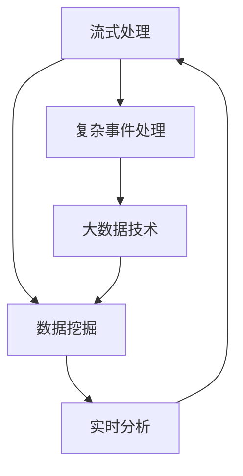

                 

# 知识发现引擎的实时数据处理技术

> 关键词：知识发现引擎,实时数据处理,流式处理,复杂事件处理,数据挖掘,人工智能,大数据

## 1. 背景介绍

在当今数据驱动的时代，知识发现引擎（Knowledge Discovery Engine, KDE）已经成为企业决策支持和智能化业务分析的重要工具。它通过高效的数据处理和分析，帮助组织从海量的数据中提取有价值的知识，并用于指导业务决策和战略规划。然而，面对不断增长的数据量和日益复杂的业务需求，如何高效、准确地处理和分析实时数据，成为知识发现引擎的一项重要挑战。

### 1.1 问题由来

随着互联网、物联网等技术的发展，实时数据生成速度急剧增加。传统的批量处理方式难以满足实时性要求，无法及时响应数据变化和用户需求。而知识发现引擎必须具备实时处理能力，才能真正发挥其在决策支持方面的作用。

传统知识发现引擎采用批处理模式，即数据按固定时间间隔集中收集、存储和分析，响应时间较长。而实时数据处理则要求系统能够快速响应数据变化，在毫秒级甚至微秒级的时间内完成数据处理和分析，并产生实时反馈。这对系统的计算能力、存储能力和网络带宽提出了极高的要求。

### 1.2 问题核心关键点

实时数据处理的难点主要包括以下几个方面：

- 数据量大、种类繁多。实时数据来自各个业务环节，包括用户行为、交易记录、传感器数据等，数据种类和规模非常庞大。
- 数据流速度快、实时性强。数据实时生成，需要系统能够高效地进行流式处理，避免数据丢失和延迟。
- 数据结构复杂、多源异构。实时数据不仅包含结构化数据，还有大量的非结构化数据、半结构化数据，且数据源多样，格式各异。
- 分析结果要求实时、准确。知识发现引擎需要实时产生分析结果，并准确反映数据变化趋势和业务规律。

## 2. 核心概念与联系

### 2.1 核心概念概述

为了解决实时数据处理的难题，本文将介绍几种关键技术：流式处理(Real-time Streaming Processing)、复杂事件处理(Complex Event Processing, CEP)、数据挖掘(Data Mining)和大数据技术(Big Data Technology)。这些技术通过不同层面的优化和整合，共同构建起高效、稳定的知识发现引擎。

- **流式处理**：将数据处理过程分解为连续的流数据流，对实时数据进行逐条处理和分析。
- **复杂事件处理**：基于事件驱动模型，对数据流中的事件进行关联分析，实现复杂业务规则的实时处理。
- **数据挖掘**：利用机器学习和统计学方法，从数据中发现有用的模式和知识。
- **大数据技术**：通过分布式计算和存储技术，处理和分析海量数据。

这些核心概念之间的关系可以通过以下Mermaid流程图来展示：



这个流程图展示了从数据源到实时分析的全过程：

1. 实时数据通过流式处理进行逐条处理。
2. 复杂事件处理对数据流中的事件进行关联分析。
3. 数据挖掘在复杂事件处理的基础上，提取有用的模式和知识。
4. 大数据技术用于处理海量数据，提供强有力的计算和存储支持。
5. 最终生成实时分析结果，反馈到数据源进行进一步处理。

## 3. 核心算法原理 & 具体操作步骤

### 3.1 算法原理概述

实时数据处理的核心在于高效、准确地进行数据流分析和实时反馈。本文将详细介绍流式处理、复杂事件处理和数据挖掘的算法原理，以及如何在实时数据场景下实现它们的具体操作步骤。

### 3.2 算法步骤详解

#### 3.2.1 流式处理

流式处理的基本步骤包括数据捕获、数据流传输、数据流处理和数据流存储：

1. **数据捕获**：通过网络接口、传感器、日志系统等获取实时数据流。
2. **数据流传输**：将数据流传输到处理节点，通常使用消息队列或数据流管道。
3. **数据流处理**：在处理节点对数据流进行逐条处理，提取有用信息。
4. **数据流存储**：将处理后的数据流存储到数据库或文件系统中，供后续分析使用。

#### 3.2.2 复杂事件处理

复杂事件处理的基本步骤包括事件捕获、事件存储、事件关联分析和事件决策：

1. **事件捕获**：通过事件源捕获事件流，通常使用消息队列或事件驱动架构。
2. **事件存储**：将事件流存储到事件存储系统中，供后续分析使用。
3. **事件关联分析**：使用规则引擎或流式处理框架，对事件流进行关联分析，提取事件模式。
4. **事件决策**：根据分析结果，触发相应决策或生成新的事件流。

#### 3.2.3 数据挖掘

数据挖掘的基本步骤包括数据预处理、特征提取、模型训练和模式发现：

1. **数据预处理**：清洗和整理数据，处理缺失值、异常值等问题。
2. **特征提取**：从数据中提取有用的特征，供后续建模使用。
3. **模型训练**：使用机器学习算法，训练数据挖掘模型。
4. **模式发现**：使用模型对数据进行预测和分类，发现有用模式和知识。

### 3.3 算法优缺点

#### 3.3.1 流式处理

**优点**：
- 实时响应数据变化，避免数据延迟和丢失。
- 数据流按顺序处理，容易实现流水线操作。
- 数据流处理过程可并行化，提高处理效率。

**缺点**：
- 数据流的处理过程需要持续监控和管理，系统复杂度高。
- 数据流的误处理和异常情况较多，需要额外处理机制。
- 数据流处理的扩展性较差，容易受到数据量、计算资源等因素限制。

#### 3.3.2 复杂事件处理

**优点**：
- 基于事件驱动模型，灵活性强，能够处理复杂业务规则。
- 事件流的数据关联分析能够发现隐含模式，提升决策精度。
- 实时性高，能够及时响应数据变化。

**缺点**：
- 事件流的处理过程需要考虑多个事件之间的关系，系统复杂度高。
- 规则引擎的设计和实现较为复杂，需要专业知识和经验。
- 数据流的误处理和异常情况较多，需要额外处理机制。

#### 3.3.3 数据挖掘

**优点**：
- 能够从数据中发现有用模式和知识，提升决策水平。
- 利用机器学习算法，自动化程度高，易于实现。
- 数据挖掘结果可以不断迭代优化，提升精度。

**缺点**：
- 数据挖掘模型需要大量的训练数据，数据预处理较为复杂。
- 模型过于复杂容易过拟合，导致泛化能力不足。
- 数据挖掘的计算复杂度较高，需要大量计算资源。

### 3.4 算法应用领域

基于以上三种算法原理，实时数据处理技术在多个领域得到了广泛应用：

- **金融领域**：实时处理交易数据、客户行为数据等，用于风险控制、欺诈检测、投资决策等。
- **物联网领域**：实时处理传感器数据、设备状态数据等，用于设备监控、智能家居、工业生产等。
- **网络安全领域**：实时处理日志数据、攻击数据等，用于入侵检测、异常行为分析、安全预警等。
- **医疗健康领域**：实时处理患者数据、医疗记录等，用于疾病预测、健康监测、资源调配等。
- **社交媒体领域**：实时处理用户数据、内容数据等，用于舆情分析、用户行为分析、内容推荐等。

## 4. 数学模型和公式 & 详细讲解 & 举例说明

### 4.1 数学模型构建

本节将使用数学语言对实时数据处理技术的算法原理进行更加严格的刻画。

记实时数据流为 $D_t = \{d_1, d_2, \cdots, d_t\}$，其中 $d_t = (x_t, y_t)$ 表示数据流中第 $t$ 条数据，$x_t$ 为特征向量，$y_t$ 为标签。

定义事件流为 $E_t = \{e_1, e_2, \cdots, e_t\}$，其中 $e_t = (t, d_t, o_t)$ 表示数据流中第 $t$ 条数据生成的事件，$t$ 为时间戳，$d_t$ 为数据向量，$o_t$ 为操作类型（如增加、删除、修改等）。

定义规则引擎为 $R$，其中 $R = \{(r_1, c_1), (r_2, c_2), \cdots, (r_n, c_n)\}$，其中 $r_i$ 为规则，$c_i$ 为对应的操作类型。

定义数据挖掘模型为 $M$，其中 $M = \{(m_1, c_1), (m_2, c_2), \cdots, (m_n, c_n)\}$，其中 $m_i$ 为数据挖掘模型，$c_i$ 为对应的操作类型。

### 4.2 公式推导过程

#### 4.2.1 流式处理

流式处理的数学模型可以表示为：

$$
D_t = \{d_1, d_2, \cdots, d_t\} \rightarrow D'_t = \{d'_1, d'_2, \cdots, d'_t\}
$$

其中 $D'_t$ 为处理后的数据流。数据流处理过程可以表示为：

$$
d'_t = \mathcal{F}(d_t, \theta)
$$

其中 $\mathcal{F}$ 为数据流处理函数，$\theta$ 为处理函数的参数。

#### 4.2.2 复杂事件处理

复杂事件处理的数学模型可以表示为：

$$
E_t = \{e_1, e_2, \cdots, e_t\} \rightarrow E'_t = \{e'_1, e'_2, \cdots, e'_t\}
$$

其中 $E'_t$ 为处理后的事件流。事件关联分析过程可以表示为：

$$
e'_t = \mathcal{G}(e_t, \rho)
$$

其中 $\mathcal{G}$ 为事件关联分析函数，$\rho$ 为关联规则。

#### 4.2.3 数据挖掘

数据挖掘的数学模型可以表示为：

$$
D_t = \{d_1, d_2, \cdots, d_t\} \rightarrow D'_t = \{d'_1, d'_2, \cdots, d'_t\}
$$

其中 $D'_t$ 为处理后的数据流。数据挖掘过程可以表示为：

$$
d'_t = \mathcal{M}(d_t, \omega)
$$

其中 $\mathcal{M}$ 为数据挖掘模型，$\omega$ 为模型参数。

### 4.3 案例分析与讲解

#### 4.3.1 流式处理案例

假设某电商平台实时接收用户订单数据流 $D_t = \{d_1, d_2, \cdots, d_t\}$，其中 $d_t = (user_id, item_id, price, time)$，表示第 $t$ 条订单的买家ID、商品ID、价格和时间。

为了实时监控订单情况，电商平台设计了订单流式处理系统。该系统通过网络接口捕获订单数据流，将其传输到处理节点，对每条订单数据进行处理，提取有用信息。处理后的数据流 $D'_t = \{d'_1, d'_2, \cdots, d'_t\}$ 存储到数据库中，供后续分析使用。

具体步骤如下：

1. 捕获订单数据流 $D_t$。
2. 将数据流传输到处理节点。
3. 在处理节点对每条订单数据进行处理，提取有用信息，如订单总额、订单数量等。
4. 将处理后的数据流 $D'_t$ 存储到数据库中。

#### 4.3.2 复杂事件处理案例

假设某银行实时接收交易数据流 $E_t = \{e_1, e_2, \cdots, e_t\}$，其中 $e_t = (time, amount, type)$，表示第 $t$ 条交易的时间戳、金额和类型（如转账、消费、取现等）。

为了实时监控交易情况，银行设计了交易流式处理系统。该系统通过网络接口捕获交易数据流，将其传输到处理节点，对每条交易数据进行处理，关联分析交易事件。处理后的数据流 $E'_t = \{e'_1, e'_2, \cdots, e'_t\}$ 存储到数据库中，供后续分析使用。

具体步骤如下：

1. 捕获交易数据流 $E_t$。
2. 将数据流传输到处理节点。
3. 在处理节点对每条交易数据进行处理，关联分析交易事件，如判断异常交易、识别诈骗行为等。
4. 将处理后的数据流 $E'_t$ 存储到数据库中。

#### 4.3.3 数据挖掘案例

假设某社交媒体平台实时接收用户评论数据流 $D_t = \{d_1, d_2, \cdots, d_t\}$，其中 $d_t = (user_id, comment, time)$，表示第 $t$ 条评论的买家ID、评论内容和发表时间。

为了实时分析用户行为，社交媒体平台设计了评论流式处理系统。该系统通过网络接口捕获评论数据流，将其传输到处理节点，对每条评论数据进行处理，提取有用信息。处理后的数据流 $D'_t = \{d'_1, d'_2, \cdots, d'_t\}$ 存储到数据库中，供后续分析使用。

具体步骤如下：

1. 捕获评论数据流 $D_t$。
2. 将数据流传输到处理节点。
3. 在处理节点对每条评论数据进行处理，提取有用信息，如热门话题、用户情感倾向等。
4. 将处理后的数据流 $D'_t$ 存储到数据库中。

## 5. 项目实践：代码实例和详细解释说明

### 5.1 开发环境搭建

在进行实时数据处理实践前，我们需要准备好开发环境。以下是使用Python进行Apache Kafka和Apache Flink进行流式处理的开发环境配置流程：

1. 安装Apache Kafka：从官网下载并安装Apache Kafka，用于实时数据传输。
2. 安装Apache Flink：从官网下载并安装Apache Flink，用于实时数据处理。
3. 安装PyTorch：使用Anaconda安装PyTorch，用于机器学习模型的实现。
4. 安装必要的Python库：如numpy、pandas、scikit-learn等。

完成上述步骤后，即可在本地环境中开始实时数据处理实践。

### 5.2 源代码详细实现

这里我们以订单流式处理为例，给出使用Apache Flink对订单数据进行流式处理的Python代码实现。

```python
from pyflink.datastream import StreamExecutionEnvironment
from pyflink.table import StreamTableEnvironment, DataTypes
from pyflink.table.descriptors import Schema, Kafka, Json

# 创建Flink环境
env = StreamExecutionEnvironment.get_execution_environment()
table_env = StreamTableEnvironment.create(env)

# 定义订单数据类型
order_schema = Schema()
order_schema.add_field("user_id", DataTypes.STRING())
order_schema.add_field("item_id", DataTypes.STRING())
order_schema.add_field("price", DataTypes.DOUBLE())
order_schema.add_field("time", DataTypes.TIMESTAMP(3))

# 定义Kafka连接信息
kafka_conn = Kafka()
kafka_conn.set_bootstrap_servers("localhost:9092")
kafka_conn.set_topic("orders")

# 定义订单数据流
order_table = table_env.scan(kafka_conn, order_schema)

# 定义订单处理函数
def order_processor(order):
    # 提取订单总额、订单数量等有用信息
    order_total = sum(order["price"])
    order_count = len(order)

    # 输出处理后的订单信息
    print(f"User {order['user_id']}, total {order_total}, count {order_count}")

# 对订单数据进行处理
order_table.select([order_processor(order)])
```

### 5.3 代码解读与分析

让我们再详细解读一下关键代码的实现细节：

**订单数据类型定义**：
- 使用`DataTypes`定义订单数据的类型，包括`user_id`、`item_id`、`price`和`time`四个字段。

**Kafka连接信息定义**：
- 使用`Kafka`类定义Kafka连接信息，包括`bootstrap_servers`和`topic`两个参数。

**订单数据流定义**：
- 使用`table_env.scan`方法从Kafka中读取订单数据流，并将其转换为Flink Table API的表对象。

**订单处理函数定义**：
- 定义一个`order_processor`函数，用于提取订单总额、订单数量等有用信息，并进行相应的处理。

**订单处理逻辑实现**：
- 使用`table_env.select`方法对订单数据流进行处理，将`order_processor`函数应用到每个订单上，并输出处理后的订单信息。

可以看到，Apache Flink提供了强大的分布式流式处理能力，能够方便地实现实时数据流处理。开发者可以将更多精力放在业务逻辑的设计和实现上，而不必过多关注底层的实现细节。

当然，工业级的系统实现还需考虑更多因素，如高可用性、容错性、可扩展性等，但核心的流式处理范式基本与此类似。

## 6. 实际应用场景

### 6.1 智能客服系统

基于实时数据处理技术，智能客服系统能够实时监控客户咨询情况，快速响应客户需求。例如，某电商平台实时接收用户咨询数据流，通过实时处理和分析，快速响应客户咨询，解答用户问题，并提供个性化的推荐服务。

在技术实现上，可以设计实时数据流处理系统，对用户咨询数据进行实时处理和分析，提取有用信息，如用户咨询热点、常见问题等。根据分析结果，系统能够及时调整客服策略，提升客户咨询体验和满意度。

### 6.2 金融交易系统

金融交易系统需要实时监控交易情况，快速响应交易异常，保障金融安全。例如，某银行实时接收交易数据流，通过实时处理和分析，检测异常交易，识别诈骗行为，并及时采取措施。

在技术实现上，可以设计实时数据流处理系统，对交易数据进行实时处理和分析，提取有用信息，如交易金额、交易类型等。根据分析结果，系统能够及时发现异常交易，预防金融风险。

### 6.3 智能交通系统

智能交通系统需要实时监控交通情况，优化交通流量，保障交通安全。例如，某城市实时接收交通数据流，通过实时处理和分析，检测交通异常，优化交通流量，并及时采取措施。

在技术实现上，可以设计实时数据流处理系统，对交通数据进行实时处理和分析，提取有用信息，如交通流量、车辆速度等。根据分析结果，系统能够及时调整交通信号灯，优化交通流量，保障交通安全。

## 7. 工具和资源推荐

### 7.1 学习资源推荐

为了帮助开发者系统掌握实时数据处理技术的理论基础和实践技巧，这里推荐一些优质的学习资源：

1. Apache Kafka官方文档：详细介绍Apache Kafka的基本概念、安装配置和使用方法。
2. Apache Flink官方文档：详细介绍Apache Flink的基本概念、安装配置和使用方法。
3. Python流式处理教程：详细介绍Python流式处理的基本概念和实现方法，适合初学者入门。
4. Scala流式处理教程：详细介绍Scala流式处理的基本概念和实现方法，适合有一定编程基础的开发者。
5. 大数据处理技术：详细介绍Hadoop、Spark、Hive等大数据处理技术的基本概念和使用方法。

通过对这些资源的学习实践，相信你一定能够快速掌握实时数据处理技术的精髓，并用于解决实际的业务问题。

### 7.2 开发工具推荐

高效的开发离不开优秀的工具支持。以下是几款用于实时数据处理开发的常用工具：

1. Apache Kafka：开源的分布式流式消息队列系统，支持高吞吐量和低延迟的数据传输。
2. Apache Flink：开源的分布式流式处理框架，支持高可靠性和高吞吐量的数据处理。
3. Apache Spark Streaming：开源的分布式流式处理框架，支持高效的数据处理和实时分析。
4. PyTorch Lightning：开源的深度学习框架，支持快速构建和训练深度学习模型。
5. TensorFlow Datasets：开源的数据集管理工具，支持高效的数据加载和管理。

合理利用这些工具，可以显著提升实时数据处理任务的开发效率，加快创新迭代的步伐。

### 7.3 相关论文推荐

实时数据处理技术的发展源于学界的持续研究。以下是几篇奠基性的相关论文，推荐阅读：

1. 《Efficient and Resilient Scalable Stream Processing》：介绍实时流式处理的系统架构和实现方法，解决实时数据处理的可扩展性和容错性问题。
2. 《Complex Event Processing for Business Intelligence》：介绍复杂事件处理的基本概念和应用场景，探讨如何利用事件驱动模型提升业务智能。
3. 《Knowledge Discovery in Databases》：介绍数据挖掘的基本概念和应用方法，探讨如何从数据中发现有用的模式和知识。
4. 《Big Data Analytics》：介绍大数据处理的基本概念和应用方法，探讨如何利用大数据技术处理和分析海量数据。

这些论文代表了大数据处理技术的发展脉络。通过学习这些前沿成果，可以帮助研究者把握学科前进方向，激发更多的创新灵感。

## 8. 总结：未来发展趋势与挑战

### 8.1 总结

本文对实时数据处理技术的核心概念、算法原理和具体操作步骤进行了全面系统的介绍。首先阐述了实时数据处理技术的背景和意义，明确了其在高性能计算和实时分析方面的独特价值。其次，从流式处理、复杂事件处理和数据挖掘三个角度，详细讲解了实时数据处理的具体算法步骤。最后，本文介绍了实时数据处理技术在智能客服、金融交易、智能交通等领域的实际应用场景，展示了实时数据处理技术的广泛应用前景。

通过本文的系统梳理，可以看到，实时数据处理技术在大数据时代具有重要意义，能够帮助组织快速响应数据变化，提升业务决策水平。未来，随着大数据和人工智能技术的不断进步，实时数据处理技术还将迎来更多创新和突破，助力企业实现智能化转型升级。

### 8.2 未来发展趋势

展望未来，实时数据处理技术将呈现以下几个发展趋势：

1. 流式处理性能提升。随着硬件设备的不断升级和优化，实时数据处理系统的处理能力将大幅提升，能够支持更大规模的数据流处理。
2. 复杂事件处理规则优化。基于机器学习和人工智能技术，复杂事件处理规则将更加灵活和智能化，提升决策精度和自动化水平。
3. 数据挖掘模型优化。利用深度学习算法，数据挖掘模型的复杂度和准确度将不断提高，能够从数据中发现更多有用模式和知识。
4. 实时分析应用场景扩展。实时数据处理技术将在更多领域得到应用，如智能制造、智慧城市、环境保护等，提升各行业的智能化水平。
5. 跨平台集成。实时数据处理技术将与云计算、物联网、区块链等新兴技术深度融合，形成更加全面、智能的业务支持系统。

以上趋势凸显了实时数据处理技术的广阔前景。这些方向的探索发展，必将进一步提升实时数据处理系统的性能和应用范围，为各行各业带来新的机遇和挑战。

### 8.3 面临的挑战

尽管实时数据处理技术已经取得了瞩目成就，但在迈向更加智能化、普适化应用的过程中，它仍面临着诸多挑战：

1. 数据量大、种类繁多。实时数据来自各个业务环节，数据种类和规模非常庞大，如何高效地进行数据流处理是一个重大挑战。
2. 数据流速度快、实时性强。数据实时生成，需要系统能够高效地进行流式处理，避免数据丢失和延迟。
3. 数据结构复杂、多源异构。实时数据不仅包含结构化数据，还有大量的非结构化数据、半结构化数据，且数据源多样，格式各异，如何统一管理和处理是一个重要难题。
4. 系统复杂度高。实时数据处理系统涉及流式处理、复杂事件处理、数据挖掘等多个子系统，系统设计和实现复杂度高。
5. 数据安全和隐私保护。实时数据处理过程中，数据的敏感性和隐私保护问题需高度重视，需要采用严格的数据安全措施和隐私保护技术。

### 8.4 研究展望

面对实时数据处理面临的种种挑战，未来的研究需要在以下几个方面寻求新的突破：

1. 探索高效、可扩展的流式处理算法。研发高性能的流式处理算法，优化系统资源使用，提升实时数据处理能力。
2. 开发智能、灵活的复杂事件处理规则。利用人工智能技术，设计智能化的复杂事件处理规则，提升决策精度和自动化水平。
3. 研究数据挖掘模型的泛化能力和鲁棒性。设计泛化能力和鲁棒性更强的数据挖掘模型，提升模型准确度和鲁棒性。
4. 融合多源异构数据的处理技术。研究多源异构数据的统一管理和处理技术，提升数据处理能力和质量。
5. 引入人工智能和机器学习技术。利用人工智能和机器学习技术，提升实时数据处理系统的智能化水平。

这些研究方向的探索，必将引领实时数据处理技术迈向更高的台阶，为构建智能化、智能化的业务支持系统铺平道路。面向未来，实时数据处理技术还需要与其他新兴技术进行更深入的融合，如区块链、物联网等，多路径协同发力，共同推动各行业的智能化转型升级。只有勇于创新、敢于突破，才能不断拓展实时数据处理技术的边界，为各行各业带来新的机遇和挑战。

## 9. 附录：常见问题与解答

**Q1：实时数据处理和批处理有什么区别？**

A: 实时数据处理和批处理的主要区别在于数据处理方式和时间特性。批处理是基于固定时间间隔的数据集合进行批量处理，处理过程较为稳定和可控，但响应时间较长。实时数据处理是对数据流进行逐条处理，处理过程动态和实时，能够快速响应数据变化。

**Q2：实时数据处理中如何保证数据的一致性和完整性？**

A: 实时数据处理中保证数据一致性和完整性的方法包括：
1. 数据校验：对数据进行校验，确保数据质量。
2. 数据冗余：使用数据冗余技术，保证数据的备份和恢复。
3. 事务处理：使用事务处理机制，保证数据的一致性。
4. 容错机制：设计容错机制，保证系统的稳定性和可靠性。

**Q3：实时数据处理中如何处理数据流中的异常情况？**

A: 实时数据处理中处理数据流中的异常情况的方法包括：
1. 异常检测：使用异常检测算法，识别和过滤异常数据。
2. 数据修复：对异常数据进行修复或替换，确保数据的完整性。
3. 数据重传：设计数据重传机制，保证数据的可靠性。
4. 规则引擎：使用规则引擎，根据业务规则对异常数据进行处理。

**Q4：实时数据处理中如何提高数据处理效率？**

A: 实时数据处理中提高数据处理效率的方法包括：
1. 并行处理：使用并行处理技术，提升数据处理能力。
2. 流水线处理：使用流水线处理技术，提升数据处理效率。
3. 数据压缩：使用数据压缩技术，减少数据存储和传输的资源消耗。
4. 算法优化：优化数据处理算法，提升处理效率。

**Q5：实时数据处理中如何保证数据的安全性和隐私保护？**

A: 实时数据处理中保证数据的安全性和隐私保护的方法包括：
1. 数据加密：使用数据加密技术，保护数据的安全性。
2. 访问控制：设计访问控制机制，限制数据的访问权限。
3. 数据匿名化：对数据进行匿名化处理，保护用户隐私。
4. 审计和监控：设计审计和监控机制，及时发现和处理异常情况。

这些常见问题的解答，希望能为你提供一些帮助，在实时数据处理技术的探索和实践中，不断总结经验，积累知识，掌握新技术，迎接未来的挑战和机遇。

