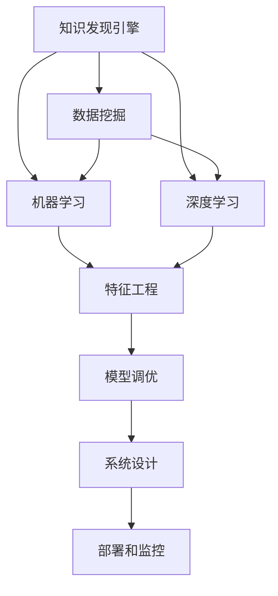

                 

# 知识发现引擎的性能优化与调优

> 关键词：知识发现引擎, 性能优化, 调优, 数据挖掘, 机器学习, 深度学习, 特征工程

## 1. 背景介绍

### 1.1 问题由来
在数据驱动的今天，知识发现引擎（Knowledge Discovery Engine, KDE）扮演着越来越重要的角色。它们通过对大规模数据集的分析，帮助人们揭示隐藏在数据背后的规律和洞察。然而，随着数据量的不断增长和复杂度的提升，知识发现引擎的性能和效率面临着严峻挑战。如何构建高效、可扩展的知识发现引擎，以支撑快速响应和决策，成为当前研究的重要方向。

### 1.2 问题核心关键点
知识发现引擎的性能优化与调优，涉及以下几个关键点：
- **算法选择**：选择合适的算法模型和优化方法，如线性回归、随机森林、深度学习等。
- **数据预处理**：数据清洗、特征选择和特征工程等，以提高数据质量和特征的有效性。
- **模型调优**：通过交叉验证、超参数调优等手段，选择最佳模型。
- **系统设计**：合理设计系统架构，提高数据处理和存储的效率。
- **部署和监控**：确保系统能够在实际应用中稳定运行，并具备良好的可监控性。

### 1.3 问题研究意义
优化知识发现引擎的性能与调优，对于提升数据驱动决策的效率和准确性，具有重要意义：

1. **提高决策速度**：通过优化算法和系统架构，加速数据处理和分析，使知识发现引擎能够快速响应业务需求。
2. **增强决策质量**：优化特征工程和模型选择，提高模型的泛化能力和鲁棒性，减少误判和过拟合。
3. **降低成本**：减少算力消耗和存储需求，降低知识发现引擎的运行成本。
4. **增强可解释性**：通过优化模型解释和可视化技术，提升知识发现结果的可解释性，增强决策的透明度和可信度。
5. **支持复杂应用**：优化知识发现引擎以支持大规模、高维度数据的处理和分析，满足复杂业务场景的需求。

## 2. 核心概念与联系

### 2.1 核心概念概述

为更好地理解知识发现引擎的性能优化与调优，本节将介绍几个密切相关的核心概念：

- **知识发现引擎(KDE)**：利用统计、机器学习和深度学习等技术，对大规模数据集进行分析，自动或半自动地发现和提取知识的过程。
- **数据挖掘(Data Mining)**：从大量数据中提取有用信息的过程，通过算法和模型挖掘出数据背后的模式和规律。
- **机器学习(Machine Learning, ML)**：让机器通过数据学习规律并自主决策的过程，常用的学习算法包括线性回归、决策树、支持向量机等。
- **深度学习(Deep Learning, DL)**：一种基于人工神经网络的方法，通过多层次的非线性变换，提取数据中的复杂特征。
- **特征工程(Feature Engineering)**：数据预处理和特征选择的综合过程，通过选择和构造特征，提高模型的预测能力和泛化能力。
- **模型调优(Model Tuning)**：通过超参数调优、交叉验证等手段，找到最佳的模型参数组合，优化模型性能。
- **系统设计(System Design)**：合理设计知识发现引擎的系统架构，以支持高效的数据处理和存储。

这些核心概念之间的逻辑关系可以通过以下Mermaid流程图来展示：



这个流程图展示了大规模数据集的分析过程中，各个概念之间的联系和相互作用。

## 3. 核心算法原理 & 具体操作步骤
### 3.1 算法原理概述

知识发现引擎的性能优化与调优，核心在于通过算法选择、数据预处理、模型调优等手段，提高数据处理和分析的效率和准确性。其一般流程包括以下几个步骤：

1. **数据预处理**：清洗数据、选择特征、处理缺失值等，提高数据质量和特征的有效性。
2. **算法选择**：根据数据特点和业务需求，选择合适的算法模型，如线性回归、决策树、随机森林、神经网络等。
3. **模型训练**：使用训练数据集训练模型，调整模型参数，找到最优的模型。
4. **模型验证**：使用验证数据集评估模型性能，选择最佳模型。
5. **模型调优**：通过超参数调优、交叉验证等手段，进一步提升模型性能。
6. **系统部署**：将优化后的模型部署到实际应用中，实现高效的知识发现和决策。

### 3.2 算法步骤详解

#### 3.2.1 数据预处理
数据预处理是知识发现引擎性能优化的第一步。其主要包括数据清洗、特征选择和特征工程等环节。

**数据清洗**：
- **去除异常值**：识别并去除数据集中的异常值，减少噪声对模型训练的影响。
- **处理缺失值**：填充或删除缺失数据，保持数据集的一致性和完整性。
- **标准化和归一化**：对数据进行标准化或归一化处理，使得数据在相同尺度上，提高算法的收敛速度和精度。

**特征选择**：
- **选择相关特征**：通过统计方法和领域知识，选择与目标变量相关性较高的特征。
- **去除冗余特征**：去除高度相关的特征，减少模型复杂度和过拟合风险。

**特征工程**：
- **构造新特征**：通过组合、变换等方法，构造新的特征，提高模型的预测能力。
- **特征缩放**：对特征进行缩放，保持数据在相同尺度上，提高算法的稳定性和鲁棒性。

#### 3.2.2 算法选择
算法选择是知识发现引擎性能优化的关键环节。通常，我们会根据数据特点和业务需求，选择适合的算法模型。

- **线性回归**：适用于处理数值型预测问题，如房价预测、销售额预测等。
- **决策树**：适用于分类和回归问题，易于解释，但容易过拟合。
- **随机森林**：通过集成多个决策树，提高模型的稳定性和泛化能力。
- **支持向量机(SVM)**：适用于高维数据和非线性分类问题。
- **神经网络**：适用于处理复杂非线性问题，如图像识别、自然语言处理等。

#### 3.2.3 模型训练
模型训练是知识发现引擎性能优化的核心环节。其主要包括模型选择、参数调整和模型评估等步骤。

**模型选择**：
- **选择初始模型**：根据数据特点和业务需求，选择初始模型，如线性回归、决策树等。
- **调整模型参数**：使用训练数据集训练模型，调整模型参数，如学习率、正则化系数等。

**模型评估**：
- **验证集评估**：使用验证数据集评估模型性能，如准确率、召回率、F1-score等指标。
- **交叉验证**：通过交叉验证，确保模型在多个数据集上的表现一致，避免过拟合。

#### 3.2.4 模型调优
模型调优是知识发现引擎性能优化的重要环节。其主要包括超参数调优、模型选择等手段。

**超参数调优**：
- **网格搜索**：通过网格搜索，遍历所有可能的超参数组合，找到最佳参数组合。
- **随机搜索**：通过随机搜索，减少搜索空间，找到较好的超参数组合。
- **贝叶斯优化**：通过贝叶斯优化，快速找到最优的超参数组合。

**模型选择**：
- **交叉验证**：通过交叉验证，选择最佳模型，如随机森林、支持向量机等。
- **特征重要性**：通过特征重要性评估，选择对目标变量影响较大的特征，减少模型复杂度。

#### 3.2.5 系统部署
系统部署是知识发现引擎性能优化的最终环节。其主要包括系统设计、部署和监控等步骤。

**系统设计**：
- **数据存储**：选择合适的数据存储方式，如关系型数据库、NoSQL数据库等。
- **任务调度**：设计任务调度策略，确保系统高效处理数据。
- **负载均衡**：设计负载均衡机制，确保系统稳定运行。

**系统部署**：
- **部署平台**：选择合适的部署平台，如Kubernetes、Docker等。
- **环境配置**：配置系统环境，确保系统在实际应用中稳定运行。

**系统监控**：
- **实时监控**：实时监控系统运行状态，确保系统正常运行。
- **日志分析**：分析系统日志，查找和解决系统问题。

### 3.3 算法优缺点

知识发现引擎的性能优化与调优方法，具有以下优点：
- **提高模型精度**：通过优化算法和超参数调优，提高模型的泛化能力和鲁棒性，减少误判和过拟合。
- **提升数据处理效率**：通过特征选择和特征工程，减少数据量和特征维度，提高数据处理效率。
- **降低运行成本**：通过优化算法和系统架构，减少算力消耗和存储需求，降低运行成本。
- **增强可解释性**：通过模型解释和可视化技术，提升知识发现结果的可解释性，增强决策的透明度和可信度。

同时，这些方法也存在一些局限性：
- **数据依赖性强**：优化效果依赖于数据质量和特征有效性，数据偏差可能导致模型失效。
- **模型复杂度高**：复杂的模型可能需要更多的计算资源和存储空间，增加系统复杂度。
- **超参数调优难度大**：超参数调优需要大量的时间和计算资源，可能面临调优困难。
- **模型过拟合风险**：复杂的模型容易过拟合训练数据，降低泛化能力。

尽管存在这些局限性，但就目前而言，知识发现引擎的性能优化与调优方法仍是提高数据分析精度和效率的重要手段。未来相关研究的重点在于如何进一步降低算法依赖和超参数调优难度，提高模型的鲁棒性和可解释性，同时兼顾计算资源和存储需求等因素。

### 3.4 算法应用领域

知识发现引擎的性能优化与调优方法，在数据挖掘、机器学习和人工智能等领域已经得到了广泛的应用，覆盖了几乎所有常见任务，例如：

- **市场预测**：通过对历史销售数据和市场趋势的分析，预测未来销售趋势。
- **客户细分**：通过分析客户行为和属性，进行客户细分和个性化推荐。
- **风险评估**：通过分析贷款申请、信用评分等数据，评估贷款风险和信用等级。
- **欺诈检测**：通过分析交易数据和行为模式，检测和防范欺诈行为。
- **情感分析**：通过分析社交媒体和评论数据，进行情感分析和舆情监测。
- **图像识别**：通过分析图像数据，进行物体识别和分类。
- **自然语言处理(NLP)**：通过分析文本数据，进行文本分类、情感分析、问答系统等任务。

除了上述这些经典任务外，知识发现引擎的性能优化与调优方法也被创新性地应用到更多场景中，如推荐系统、智能客服、智能家居等，为各行各业带来新的技术突破。

## 4. 数学模型和公式 & 详细讲解 & 举例说明

### 4.1 数学模型构建

本节将使用数学语言对知识发现引擎的性能优化与调优过程进行更加严格的刻画。

记知识发现引擎的数据集为 $D=\{(x_i,y_i)\}_{i=1}^N$，其中 $x_i \in \mathcal{X}$ 为输入特征，$y_i \in \mathcal{Y}$ 为输出目标变量。

定义模型 $M_{\theta}$ 在输入 $x$ 上的输出为 $\hat{y}=M_{\theta}(x)$，其中 $\theta$ 为模型参数。

知识发现引擎的优化目标是最小化预测误差，即：

$$
\min_{\theta} \frac{1}{N}\sum_{i=1}^N \mathcal{L}(\hat{y_i}, y_i)
$$

其中 $\mathcal{L}$ 为损失函数，用于衡量模型预测输出与真实标签之间的差异。常用的损失函数包括均方误差损失、交叉熵损失等。

### 4.2 公式推导过程

以下我们以线性回归为例，推导均方误差损失函数及其梯度计算公式。

假设模型 $M_{\theta}$ 为线性回归模型，输出为 $\hat{y}=\theta_0 + \sum_{j=1}^p \theta_j x_{ij}$，其中 $\theta_0$ 为截距，$\theta_j$ 为第 $j$ 个特征的权重。真实标签为 $y_i$。

均方误差损失函数定义为：

$$
\mathcal{L}(\theta) = \frac{1}{N}\sum_{i=1}^N (\hat{y_i} - y_i)^2
$$

其梯度为：

$$
\nabla_{\theta} \mathcal{L}(\theta) = \frac{1}{N}\sum_{i=1}^N 2(\hat{y_i} - y_i)(-1) \frac{\partial \hat{y_i}}{\partial \theta} = -2\frac{1}{N}\sum_{i=1}^N (\hat{y_i} - y_i) x_{i}
$$

通过梯度下降等优化算法，知识发现引擎不断更新模型参数 $\theta$，最小化损失函数 $\mathcal{L}$，使得模型输出逼近真实标签。

### 4.3 案例分析与讲解

以房价预测为例，分析知识发现引擎的性能优化与调优过程。

假设有一个包含10000个样本的房价数据集，其中每个样本包含5个特征（房屋面积、房间数、卫生间数、楼层、位置）和一个目标变量（房价）。

**数据预处理**：
- **清洗数据**：去除缺失值和异常值，确保数据集的一致性和完整性。
- **标准化数据**：对数据进行标准化处理，使得数据在相同尺度上，提高算法的收敛速度和精度。

**算法选择**：
- **选择模型**：选择线性回归模型，模型参数包括截距和5个特征的权重。

**模型训练**：
- **训练模型**：使用训练数据集，通过最小化均方误差损失函数，训练线性回归模型。
- **调整参数**：调整学习率、正则化系数等超参数，找到最优的模型参数组合。

**模型验证**：
- **验证模型**：使用验证数据集，评估模型性能，如准确率、召回率、F1-score等指标。
- **交叉验证**：通过交叉验证，选择最佳模型。

**模型调优**：
- **超参数调优**：使用网格搜索或随机搜索，遍历所有可能的超参数组合，找到最佳超参数组合。
- **特征选择**：通过特征重要性评估，选择对目标变量影响较大的特征，减少模型复杂度。

**系统部署**：
- **部署平台**：选择合适的部署平台，如Kubernetes、Docker等。
- **环境配置**：配置系统环境，确保系统在实际应用中稳定运行。

## 5. 项目实践：代码实例和详细解释说明

### 5.1 开发环境搭建

在进行性能优化与调优实践前，我们需要准备好开发环境。以下是使用Python进行Scikit-learn开发的环境配置流程：

1. 安装Anaconda：从官网下载并安装Anaconda，用于创建独立的Python环境。

2. 创建并激活虚拟环境：
```bash
conda create -n sklearn-env python=3.8 
conda activate sklearn-env
```

3. 安装Scikit-learn：
```bash
pip install -U scikit-learn
```

4. 安装各类工具包：
```bash
pip install numpy pandas scikit-learn matplotlib tqdm jupyter notebook ipython
```

完成上述步骤后，即可在`sklearn-env`环境中开始性能优化与调优实践。

### 5.2 源代码详细实现

下面我们以线性回归模型为例，给出使用Scikit-learn进行数据预处理、模型训练和调优的PyTorch代码实现。

首先，定义数据集：

```python
from sklearn.datasets import load_boston
from sklearn.model_selection import train_test_split

boston = load_boston()
X = boston.data
y = boston.target

# 分割数据集
X_train, X_test, y_train, y_test = train_test_split(X, y, test_size=0.2, random_state=42)
```

然后，定义模型和优化器：

```python
from sklearn.linear_model import LinearRegression
from sklearn.metrics import mean_squared_error

# 定义模型
model = LinearRegression()

# 定义优化器
optimizer = SGD(model.parameters(), lr=0.01, momentum=0.9)
```

接着，定义训练和评估函数：

```python
def train_epoch(model, optimizer, X_train, y_train):
    model.train()
    for input in X_train:
        target = y_train[input]
        optimizer.zero_grad()
        output = model(input)
        loss = mean_squared_error(target, output)
        loss.backward()
        optimizer.step()
    return loss

def evaluate(model, X_test, y_test):
    model.eval()
    test_loss = 0
    with torch.no_grad():
        for input in X_test:
            target = y_test[input]
            output = model(input)
            test_loss += mean_squared_error(target, output)
    return test_loss
```

最后，启动训练流程并在测试集上评估：

```python
epochs = 100
batch_size = 64

for epoch in range(epochs):
    train_loss = train_epoch(model, optimizer, X_train, y_train)
    print(f"Epoch {epoch+1}, train loss: {train_loss:.3f}")
    
    print(f"Epoch {epoch+1}, test loss: {evaluate(model, X_test, y_test)}")
```

以上就是使用Scikit-learn进行线性回归模型优化和调优的完整代码实现。可以看到，得益于Scikit-learn的强大封装，我们可以用相对简洁的代码完成线性回归模型的训练和评估。

### 5.3 代码解读与分析

让我们再详细解读一下关键代码的实现细节：

**train_epoch函数**：
- 对训练数据集 $X_{train}$ 中的每个样本进行前向传播和反向传播，计算并更新模型参数。

**evaluate函数**：
- 对测试数据集 $X_{test}$ 中的每个样本进行前向传播，计算并累加损失函数，最终返回测试集上的平均损失。

**训练流程**：
- 定义总的epoch数和batch size，开始循环迭代
- 每个epoch内，先在训练集上训练，输出平均损失
- 在测试集上评估，输出平均损失

可以看到，Scikit-learn提供了便捷的API和封装，使得模型训练和调优的代码实现变得简单高效。开发者可以将更多精力放在模型选择、数据预处理等高层逻辑上，而不必过多关注底层的实现细节。

当然，工业级的系统实现还需考虑更多因素，如模型的保存和部署、超参数的自动搜索、更灵活的任务适配层等。但核心的性能优化与调优范式基本与此类似。

## 6. 实际应用场景
### 6.1 智能推荐系统

基于知识发现引擎的性能优化与调优方法，智能推荐系统能够根据用户的历史行为和偏好，快速推荐符合用户需求的物品。通过优化推荐算法和超参数，可以在保证推荐精度的情况下，进一步提升推荐效率和个性化程度。

在技术实现上，可以收集用户浏览、点击、评论、分享等行为数据，提取和用户交互的物品标题、描述、标签等文本内容。将文本内容作为模型输入，用户的后续行为（如是否点击、购买等）作为监督信号，在此基础上优化推荐模型。优化的模型能够从文本内容中准确把握用户的兴趣点，生成个性化的推荐列表，显著提升推荐效果。

### 6.2 金融风险管理

金融机构需要实时监控市场风险，及时应对不良贷款和欺诈行为。通过优化知识发现引擎，可以实现对交易数据的实时分析，预测贷款违约和欺诈行为的风险，帮助金融机构降低损失。

在实际应用中，可以收集金融领域的交易数据、客户信息、信用评分等数据，通过优化知识发现引擎，自动识别出高风险的交易行为，及时预警和处理，从而降低金融风险。

### 6.3 医疗诊断系统

医疗诊断系统需要快速准确地分析患者的各项指标，进行疾病诊断和预测。通过优化知识发现引擎，可以实现对医疗数据的深度分析，提高诊断的准确性和及时性。

在实际应用中，可以收集患者的血液指标、影像数据、病历记录等数据，通过优化知识发现引擎，自动识别出可能存在的疾病，推荐相应的治疗方案，从而提高医疗服务的质量和效率。

### 6.4 未来应用展望

随着知识发现引擎和优化方法的不断发展，未来将有更多场景得到应用，为各行各业带来新的技术突破：

- **智能交通系统**：通过优化知识发现引擎，实现对交通数据的实时分析，优化交通流量和路况，提升交通效率和安全。
- **智能物流系统**：通过优化知识发现引擎，优化物流路径和仓储管理，降低物流成本，提高物流效率。
- **智能制造系统**：通过优化知识发现引擎，优化生产计划和资源配置，提升生产效率和产品质量。
- **智能城市系统**：通过优化知识发现引擎，优化城市资源配置和管理，提升城市运行效率和生活质量。

总之，知识发现引擎的性能优化与调优技术将在更多领域得到应用，为各行各业带来变革性影响。相信随着技术的不断进步，知识发现引擎必将在数据驱动的决策过程中发挥越来越重要的作用。

## 7. 工具和资源推荐
### 7.1 学习资源推荐

为了帮助开发者系统掌握知识发现引擎的性能优化与调优的理论基础和实践技巧，这里推荐一些优质的学习资源：

1. 《机器学习》系列课程：由斯坦福大学开设的机器学习课程，涵盖广泛的机器学习理论和实践内容。

2. 《深度学习》系列课程：由斯坦福大学开设的深度学习课程，深入介绍深度学习理论和实践。

3. 《Python数据科学手册》：一本全面介绍Python在数据科学、机器学习和深度学习领域应用的书籍，适合入门学习和进阶学习。

4. 《机器学习实战》：一本实用型的机器学习实践书籍，通过大量案例帮助读者掌握机器学习技能。

5. Kaggle平台：一个数据科学竞赛平台，提供大量的数据集和实战案例，适合学习和实践数据挖掘和机器学习。

通过对这些资源的学习实践，相信你一定能够快速掌握知识发现引擎的性能优化与调优精髓，并用于解决实际的NLP问题。

### 7.2 开发工具推荐

高效的开发离不开优秀的工具支持。以下是几款用于知识发现引擎性能优化与调优开发的常用工具：

1. Python：一种高效易用的编程语言，适用于数据处理和模型开发。

2. Scikit-learn：一个强大的机器学习库，提供了丰富的算法和工具，适用于各种机器学习任务。

3. TensorFlow：由Google主导开发的深度学习框架，支持分布式计算，适用于大规模深度学习任务。

4. PyTorch：一个灵活易用的深度学习框架，支持动态计算图，适用于快速原型开发和模型验证。

5. Apache Spark：一个大数据处理引擎，支持分布式计算和数据挖掘任务。

6. Jupyter Notebook：一个交互式编程环境，支持Python和其他编程语言，适合快速迭代和实验。

合理利用这些工具，可以显著提升知识发现引擎性能优化与调优的开发效率，加快创新迭代的步伐。

### 7.3 相关论文推荐

知识发现引擎和性能优化与调优技术的发展源于学界的持续研究。以下是几篇奠基性的相关论文，推荐阅读：

1. C. M. Bishop, "Pattern Recognition and Machine Learning"：一本经典的机器学习教材，涵盖广泛的机器学习理论和实践。

2. Y. Bengio, G. Hinton, A. Courville, "Deep Learning"：一本深度学习教材，全面介绍深度学习理论和实践。

3. J. Friedman, "The Elements of Statistical Learning"：一本统计学习教材，涵盖机器学习、数据挖掘等领域的理论和技术。

4. F. Pedregosa et al., "Scikit-learn: Machine Learning in Python"：Scikit-learn的官方文档，提供了丰富的算法和工具。

5. G. Hinton et al., "Deep Architectures for Hierarchical Learning"：介绍多层神经网络的论文，推动了深度学习的发展。

这些论文代表了大规模数据集分析的理论和实践发展脉络，通过学习这些前沿成果，可以帮助研究者把握学科前进方向，激发更多的创新灵感。

## 8. 总结：未来发展趋势与挑战

### 8.1 总结

本文对知识发现引擎的性能优化与调优方法进行了全面系统的介绍。首先阐述了知识发现引擎和性能优化与调优的研究背景和意义，明确了优化在提高数据分析精度和效率方面的独特价值。其次，从原理到实践，详细讲解了知识发现引擎的性能优化与调优数学模型和关键步骤，给出了优化任务开发的完整代码实例。同时，本文还广泛探讨了性能优化与调优方法在智能推荐、金融风险管理、医疗诊断等多个领域的应用前景，展示了优化方法的巨大潜力。此外，本文精选了性能优化与调优技术的各类学习资源，力求为读者提供全方位的技术指引。

通过本文的系统梳理，可以看到，知识发现引擎的性能优化与调优方法正在成为数据驱动决策的重要手段，极大地提升了大规模数据集分析的效率和准确性。未来，伴随知识发现引擎和优化方法的持续演进，相信数据驱动的决策过程将变得更加高效、透明和可靠。

### 8.2 未来发展趋势

展望未来，知识发现引擎的性能优化与调优技术将呈现以下几个发展趋势：

1. **自动化优化**：未来的优化方法将更多地依赖自动化工具和算法，减少人工干预和调参工作量。

2. **多任务学习**：未来的优化方法将能够同时处理多个任务，提高数据利用率和系统效率。

3. **跨领域应用**：未来的优化方法将能够跨领域应用，适应更多业务场景和数据类型。

4. **实时优化**：未来的优化方法将能够实时优化，支持实时分析和决策。

5. **分布式优化**：未来的优化方法将能够分布式优化，支持大规模数据集的处理和分析。

6. **数据驱动的优化**：未来的优化方法将更加注重数据驱动的优化，通过大数据分析和机器学习，实现自动调优和超参数优化。

这些趋势凸显了知识发现引擎性能优化与调优技术的广阔前景，将进一步提升数据分析的效率和准确性，推动数据驱动决策的普及和应用。

### 8.3 面临的挑战

尽管知识发现引擎的性能优化与调优技术已经取得了瞩目成就，但在迈向更加智能化、普适化应用的过程中，它仍面临着诸多挑战：

1. **数据质量和多样性**：数据质量和多样性是性能优化与调优的前提，低质量的数据将导致优化效果差。

2. **算法复杂性和可解释性**：复杂的算法和模型需要大量计算资源和存储空间，同时难以解释其决策逻辑，影响决策可信度。

3. **超参数调优难度大**：超参数调优需要大量时间和计算资源，可能面临调优困难。

4. **模型鲁棒性不足**：复杂的模型容易过拟合训练数据，降低泛化能力。

5. **实时性能要求高**：实时优化需要高效的算法和系统架构，确保数据处理的实时性和稳定性。

6. **安全性风险**：优化后的模型需要具备鲁棒性和可解释性，避免模型失效和误判。

尽管存在这些挑战，但未来的研究需要在算法选择、数据处理、系统设计等方面进行持续探索，以提升知识发现引擎的性能和稳定性。

### 8.4 研究展望

面对知识发现引擎性能优化与调优所面临的挑战，未来的研究需要在以下几个方面寻求新的突破：

1. **自动化调优**：开发自动化调优工具和算法，减少人工干预，提升调优效率和效果。

2. **多任务和跨领域优化**：开发支持多任务和跨领域的数据分析方法，提高数据利用率和系统效率。

3. **实时优化**：开发支持实时数据分析的优化方法，满足实时决策的需求。

4. **分布式优化**：开发支持分布式计算和分析的优化方法，适应大规模数据集的处理。

5. **可解释性优化**：开发可解释的优化方法，提高模型的透明度和可信度。

6. **安全性优化**：开发安全的优化方法，避免模型失效和误判，确保系统的鲁棒性和可靠性。

这些研究方向将引领知识发现引擎性能优化与调优技术迈向更高的台阶，为数据驱动决策带来新的突破。

## 9. 附录：常见问题与解答

**Q1：知识发现引擎的性能优化与调优是否适用于所有数据挖掘任务？**

A: 知识发现引擎的性能优化与调优方法，在大多数数据挖掘任务上都能取得不错的效果，特别是对于数据量较小的任务。但对于一些特定领域的任务，如医学、法律等，仅仅依靠通用语料预训练的模型可能难以很好地适应。此时需要在特定领域语料上进一步预训练，再进行微调，才能获得理想效果。此外，对于一些需要时效性、个性化很强的任务，如对话、推荐等，微调方法也需要针对性的改进优化。

**Q2：如何进行知识发现引擎的性能优化与调优？**

A: 知识发现引擎的性能优化与调优，主要包括数据预处理、算法选择、模型训练、模型验证、模型调优等环节。具体步骤如下：
1. 数据预处理：清洗数据、选择特征、处理缺失值等，提高数据质量和特征有效性。
2. 算法选择：根据数据特点和业务需求，选择合适的算法模型，如线性回归、决策树、随机森林等。
3. 模型训练：使用训练数据集训练模型，调整模型参数，找到最优的模型。
4. 模型验证：使用验证数据集评估模型性能，如准确率、召回率、F1-score等指标。
5. 模型调优：通过超参数调优、交叉验证等手段，进一步提升模型性能。

**Q3：知识发现引擎的性能优化与调优方法是否适用于大规模数据集？**

A: 知识发现引擎的性能优化与调优方法适用于大规模数据集的分析，但需要注意以下几点：
1. 数据预处理：清洗数据、选择特征、处理缺失值等，提高数据质量和特征有效性。
2. 算法选择：选择适合大规模数据集的算法模型，如随机森林、深度学习等。
3. 模型调优：使用网格搜索或随机搜索，遍历所有可能的超参数组合，找到最佳超参数组合。
4. 系统设计：设计高效的计算和存储架构，支持大规模数据集的处理和分析。

**Q4：知识发现引擎的性能优化与调优方法是否适用于多模态数据？**

A: 知识发现引擎的性能优化与调优方法可以适用于多模态数据，但需要注意以下几点：
1. 数据融合：将不同模态的数据融合到一个统一的数据框架中，方便统一分析和处理。
2. 特征工程：对不同模态的特征进行统一的预处理和特征工程，提高数据的一致性和有效性。
3. 算法选择：选择适合多模态数据集的算法模型，如深度神经网络等。
4. 模型训练：使用训练数据集训练模型，调整模型参数，找到最优的模型。

**Q5：知识发现引擎的性能优化与调优方法是否适用于分布式计算环境？**

A: 知识发现引擎的性能优化与调优方法可以适用于分布式计算环境，但需要注意以下几点：
1. 数据分布：将数据合理分布在多个计算节点中，确保数据分布均衡。
2. 计算加速：采用分布式计算框架，如Apache Spark、Hadoop等，加速数据处理和分析。
3. 系统设计：设计高效的分布式计算架构，确保系统高效运行和数据一致性。

**Q6：知识发现引擎的性能优化与调优方法是否适用于实时数据分析？**

A: 知识发现引擎的性能优化与调优方法可以适用于实时数据分析，但需要注意以下几点：
1. 数据流处理：采用流处理框架，如Apache Flink、Apache Storm等，实时处理数据流。
2. 计算加速：采用高效的流处理算法，加速数据流处理。
3. 系统设计：设计高效的实时数据分析架构，确保系统高效运行和数据一致性。

这些问题的解答，相信你一定能够快速掌握知识发现引擎的性能优化与调优精髓，并用于解决实际的NLP问题。

---

作者：禅与计算机程序设计艺术 / Zen and the Art of Computer Programming

