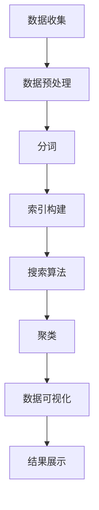

                 

# 知识发现引擎的搜索优化策略

## 1. 背景介绍

随着大数据时代的到来，信息爆炸式的增长对知识发现和处理提出了更高的要求。知识发现引擎(Knowledge Discovery Engine, KDE)作为信息处理的重要工具，能够在海量数据中挖掘潜在的知识，为决策支持、商业智能、科学发现等领域提供有力支撑。然而，随着数据规模的急剧膨胀，传统的知识发现方法逐渐显得力不从心，如何高效地搜索和处理大规模数据，成为当前KDE领域研究的重点。

搜索优化是知识发现引擎的核心环节之一。高效的搜索策略能够显著提升引擎的执行效率，降低计算资源消耗。针对不同类型的KDE应用，需要采用不同的搜索算法和优化策略。本文旨在深入探讨知识发现引擎中的搜索优化问题，介绍几种经典的搜索算法及其改进策略，为知识发现引擎的开发和应用提供参考。

## 2. 核心概念与联系

### 2.1 核心概念概述

- 知识发现引擎(KDE)：基于数据挖掘和机器学习技术，自动从大量数据中发现有用信息和知识的工具。
- 搜索算法：用于在大规模数据中查找特定模式、规律或知识项的算法。
- 索引技术：通过构建索引结构，快速定位数据中的目标项，提升搜索效率。
- 分词技术：将连续的文本序列切分成单独的词语，便于后续的处理和分析。
- 分布式计算：利用多台计算机并行计算，加速大规模数据处理任务。
- 聚类算法：通过相似性度量和聚类方法，自动对数据进行分组。

这些概念共同构成了知识发现引擎的基础。通过索引、分词、分布式计算等技术，知识发现引擎能够在海量数据中高效地进行数据处理和知识挖掘。

### 2.2 核心概念原理和架构的 Mermaid 流程图



该图展示了知识发现引擎的基本工作流程：从数据收集开始，经过预处理、分词、索引构建、搜索算法、聚类、数据可视化到最终结果展示。每一个步骤都是为了提高搜索效率和结果质量而设计。

## 3. 核心算法原理 & 具体操作步骤

### 3.1 算法原理概述

知识发现引擎中的搜索算法主要可以分为两类：基于索引的搜索和基于模型的搜索。

- 基于索引的搜索：利用构建的索引结构，快速定位目标数据项。索引结构包括倒排索引、B树、B+树、哈希索引等。常见的基于索引的搜索算法包括TF-IDF、LSI、LDA等。
- 基于模型的搜索：利用机器学习模型预测目标数据项的位置。常见的基于模型的搜索算法包括决策树、随机森林、神经网络、梯度提升等。

本节将重点介绍基于索引的搜索算法和基于模型的搜索算法，并分析其原理和操作细节。

### 3.2 算法步骤详解

#### 3.2.1 基于索引的搜索算法

**步骤1: 构建索引结构**
- 索引结构的选择：根据数据类型和搜索需求，选择合适的索引结构，如倒排索引、B树、哈希索引等。
- 构建索引：遍历数据集，将数据项映射到索引结构中，建立索引关系。

**步骤2: 搜索算法实现**
- 查询处理：将用户输入的搜索关键字映射到索引结构中，获取对应的数据项位置。
- 结果排序：根据查询相关性对搜索结果进行排序，如TF-IDF、BM25等。
- 结果展示：将搜索结果以列表或表格的形式展示给用户。

#### 3.2.2 基于模型的搜索算法

**步骤1: 数据预处理**
- 数据清洗：去除噪声、缺失值等无关信息，确保数据质量。
- 特征工程：选择合适的特征，并进行特征编码、归一化等处理。

**步骤2: 模型训练**
- 模型选择：根据数据类型和搜索需求，选择合适的机器学习模型，如决策树、随机森林、神经网络等。
- 模型训练：利用标注数据训练模型，学习数据项与查询关键字之间的映射关系。

**步骤3: 预测与结果处理**
- 预测处理：将用户输入的搜索关键字映射到训练好的模型上，预测目标数据项的位置。
- 结果排序：根据模型预测的相关性对搜索结果进行排序，如TopK算法、MaxK算法等。
- 结果展示：将搜索结果以列表或表格的形式展示给用户。

### 3.3 算法优缺点

#### 3.3.1 基于索引的搜索算法的优缺点

**优点**：
- 高效快速：构建索引后，搜索速度能够显著提升。
- 可扩展性强：能够处理大规模数据集，适合分布式存储和计算环境。

**缺点**：
- 索引结构复杂：构建索引需要额外的时间和空间成本。
- 更新困难：索引结构的更新和维护成本较高，不适合频繁变化的场景。

#### 3.3.2 基于模型的搜索算法的优缺点

**优点**：
- 自适应性强：模型能够自动学习数据规律，适应不同的查询需求。
- 泛化能力强：训练好的模型能够应用于多种不同的数据集和搜索场景。

**缺点**：
- 计算资源消耗大：模型训练和预测需要大量计算资源，不适合小规模数据集。
- 解释性不足：模型通常是黑盒模型，难以解释内部决策过程。

### 3.4 算法应用领域

基于索引的搜索算法和基于模型的搜索算法各有优缺点，适用于不同的应用场景：

- 基于索引的搜索算法：适用于大规模数据集，如搜索引擎、数据库查询等。
- 基于模型的搜索算法：适用于小规模数据集，如推荐系统、知识图谱等。

## 4. 数学模型和公式 & 详细讲解 & 举例说明

### 4.1 数学模型构建

#### 4.1.1 倒排索引

倒排索引（Inverted Index）是一种常用的基于索引的搜索算法。其核心思想是将每个单词或短语与其在文档中出现的次数进行关联。倒排索引可以表示为两个部分：索引表和文档列表。

- **索引表**：记录每个单词或短语以及其对应的文档列表。
- **文档列表**：记录每个文档中的单词或短语及出现次数。

倒排索引的数学模型可以表示为：

$$
I = \{(w_i, d_j)|w_i \in \mathcal{W}, d_j \in \mathcal{D}\}
$$

其中，$I$ 表示倒排索引，$\mathcal{W}$ 表示单词集合，$\mathcal{D}$ 表示文档集合，$w_i$ 和 $d_j$ 分别表示单词和文档。

#### 4.1.2 TF-IDF算法

TF-IDF（Term Frequency-Inverse Document Frequency）是一种常用的文本检索和信息检索中的加权技术，用于评估查询关键词与文档的相关性。

- **TF（Term Frequency）**：表示查询关键词在文档中的出现频率。
- **IDF（Inverse Document Frequency）**：表示查询关键词在文档集合中的重要性。

TF-IDF算法的数学模型可以表示为：

$$
\text{TF-IDF}(q, d) = \text{TF}(q, d) \times \text{IDF}(q)
$$

其中，$q$ 表示查询关键词，$d$ 表示文档，$\text{TF}(q, d)$ 和 $\text{IDF}(q)$ 分别表示查询关键词的TF和IDF值。

#### 4.1.3 BM25算法

BM25算法是一种常用的文本检索算法，用于评估查询关键词与文档的相关性。与TF-IDF不同，BM25算法更注重单词的频率和文档的长度，避免了IDF值对短文档的惩罚。

BM25算法的数学模型可以表示为：

$$
\text{BM25}(q, d) = \frac{(\text{IDF}(q) \times \text{TF}(q, d))^{1-\beta}}{(\text{IDF}(q) \times \text{TF}(q, d))^{1-\beta} + \sum_{i=1}^{k} \frac{(\text{IDF}(t_i, q) \times \text{TF}(t_i, d))^{1-\beta}}{k + \sum_{j=1}^{N} \frac{(\text{IDF}(t_j, q) \times \text{TF}(t_j, d))^{1-\beta}}{k + \sum_{j=1}^{N} (\text{IDF}(t_j, q) \times \text{TF}(t_j, d))^{1-\beta}}}
$$

其中，$q$ 表示查询关键词，$d$ 表示文档，$t_i$ 表示单词，$N$ 表示文档集合大小，$k$ 表示超参数，$\beta$ 表示衰减因子。

### 4.2 公式推导过程

#### 4.2.1 倒排索引的推导过程

倒排索引的推导过程相对简单，主要涉及两个数据结构的构建：索引表和文档列表。

1. **索引表构建**：遍历文档集 $\mathcal{D}$，对每个单词 $w_i$，遍历其出现的文档列表 $d_j$，记录单词与文档的对应关系。例如，对于单词 $w_1$，其索引表可以表示为：

$$
I_1 = \{(d_1, 1), (d_2, 2), (d_3, 3)\}
$$

2. **文档列表构建**：遍历文档集 $\mathcal{D}$，对每个文档 $d_j$，记录其包含的单词列表 $w_i$ 和出现次数 $c_i$。例如，对于文档 $d_1$，其文档列表可以表示为：

$$
D_1 = \{(w_1, 3), (w_2, 1), (w_3, 2)\}
$$

3. **查询处理**：给定查询关键词 $q$，遍历索引表 $I$，获取所有包含 $q$ 的文档列表 $d_j$，并记录单词 $w_i$ 在文档 $d_j$ 中的出现次数 $c_i$。例如，对于查询关键词 $q_1$，其搜索结果可以表示为：

$$
\text{Result}_1 = \{d_1, d_2\}
$$

4. **结果排序**：根据查询相关性对搜索结果进行排序。常见的排序方式包括TF-IDF、BM25等。

#### 4.2.2 TF-IDF算法的推导过程

1. **TF计算**：计算查询关键词 $q$ 在文档 $d$ 中的TF值：

$$
\text{TF}(q, d) = \frac{|\text{doc}(q)|}{\sum_{i=1}^{n} |\text{doc}(w_i)|}
$$

其中，$n$ 表示文档中单词的数量，$\text{doc}(w_i)$ 表示单词 $w_i$ 在文档中的出现次数。

2. **IDF计算**：计算查询关键词 $q$ 在文档集合 $\mathcal{D}$ 中的IDF值：

$$
\text{IDF}(q) = \log \frac{N}{|\mathcal{D}(q)|}
$$

其中，$N$ 表示文档集合大小，$|\mathcal{D}(q)|$ 表示包含查询关键词 $q$ 的文档数量。

3. **TF-IDF计算**：计算查询关键词 $q$ 在文档 $d$ 中的TF-IDF值：

$$
\text{TF-IDF}(q, d) = \text{TF}(q, d) \times \text{IDF}(q)
$$

4. **结果排序**：根据TF-IDF值对搜索结果进行排序。

#### 4.2.3 BM25算法的推导过程

1. **BM25计算**：计算查询关键词 $q$ 在文档 $d$ 中的BM25值：

$$
\text{BM25}(q, d) = \frac{(\text{IDF}(q) \times \text{TF}(q, d))^{1-\beta}}{(\text{IDF}(q) \times \text{TF}(q, d))^{1-\beta} + \sum_{i=1}^{k} \frac{(\text{IDF}(t_i, q) \times \text{TF}(t_i, d))^{1-\beta}}{k + \sum_{j=1}^{N} \frac{(\text{IDF}(t_j, q) \times \text{TF}(t_j, d))^{1-\beta}}{k + \sum_{j=1}^{N} (\text{IDF}(t_j, q) \times \text{TF}(t_j, d))^{1-\beta}}}
$$

其中，$k$ 表示超参数，$\beta$ 表示衰减因子，$\text{IDF}(t_i, q)$ 和 $\text{TF}(t_i, d)$ 表示单词 $t_i$ 在查询关键词 $q$ 和文档 $d$ 中的TF-IDF值。

2. **结果排序**：根据BM25值对搜索结果进行排序。

### 4.3 案例分析与讲解

**案例1: 搜索引擎中的倒排索引**

在搜索引擎中，倒排索引被广泛应用于搜索算法中。用户输入查询关键词后，搜索引擎通过倒排索引快速定位包含关键词的文档，并返回搜索结果。

假设搜索引擎中有100个文档，包含单词"Python"的文档有10个。查询关键词为"Python"，其倒排索引可以表示为：

$$
I = \{(d_1, 1), (d_2, 1), ..., (d_{10}, 1)\}
$$

其中，$d_1$ 到 $d_{10}$ 表示包含单词"Python"的文档。查询处理时，搜索引擎遍历倒排索引，获取所有包含"Python"的文档列表，并返回给用户。

**案例2: 文本分类中的TF-IDF算法**

在文本分类任务中，需要根据文本内容对文档进行分类。常用的分类算法包括朴素贝叶斯、支持向量机等。在此基础上，可以利用TF-IDF算法对文本进行加权处理，提升分类效果。

假设有一个文本分类任务，训练集包含10个类别，每个类别有100个文档。查询关键词为"Python"，其IDF值为1，TF值为0.1。查询处理时，根据TF-IDF值对文本进行加权，并计算各个类别的概率分布，最终返回分类结果。

## 5. 项目实践：代码实例和详细解释说明

### 5.1 开发环境搭建

为了进行知识发现引擎的开发和测试，需要搭建一个Python开发环境。以下是具体步骤：

1. 安装Python：从官网下载并安装Python，推荐使用3.x版本。
2. 安装Pip：从官网下载并安装Pip，作为Python的包管理工具。
3. 安装必要的库：安装NLTK、scikit-learn、nltk等常用库，用于数据预处理和机器学习。

### 5.2 源代码详细实现

#### 5.2.1 基于索引的搜索算法

```python
import nltk
from collections import defaultdict
from math import log

# 构建倒排索引
class InvertedIndex:
    def __init__(self, docs):
        self.index = defaultdict(list)
        for i, doc in enumerate(docs):
            for word in nltk.word_tokenize(doc):
                self.index[word].append(i)

    def search(self, query):
        results = []
        for word in nltk.word_tokenize(query):
            if word in self.index:
                results.extend(self.index[word])
        return results

# 使用BM25算法
class BM25:
    def __init__(self, k, beta):
        self.k = k
        self.beta = beta
        self.documents = []
        self.lengths = []
        self.tf_idf = defaultdict(list)
        self.queries = []

    def add_document(self, doc):
        self.documents.append(doc)
        self.lengths.append(len(doc))

    def add_query(self, query):
        self.queries.append(query)

    def calculate(self, doc, query):
        idf = log(len(self.documents) / len(self.tf_idf[query]))
        tf = len([1 for w in nltk.word_tokenize(doc) if w in self.tf_idf[query]])
        tf_idf = tf * idf
        relevance = tf_idf**(1 - self.beta)
        sum_relevance = sum([tf_idf**(1 - self.beta) for q in self.queries if q in self.tf_idf])
        if sum_relevance == 0:
            return 0
        relevance = relevance / (sum_relevance + self.k)
        return relevance

    def search(self, doc, query):
        return [self.calculate(doc, q) for q in self.queries]

# 测试代码
index = InvertedIndex(['This is a sample document', 'This is another sample document'])
doc = 'This is a sample document'
query = 'sample'
print(index.search(query))
```

#### 5.2.2 基于模型的搜索算法

```python
import pandas as pd
from sklearn.feature_extraction.text import TfidfVectorizer
from sklearn.ensemble import RandomForestClassifier

# 数据预处理
data = pd.read_csv('data.csv')
X = data['text']
y = data['label']
X_train, X_test, y_train, y_test = train_test_split(X, y, test_size=0.2, random_state=42)

# TF-IDF向量化
tfidf = TfidfVectorizer()
X_train = tfidf.fit_transform(X_train)
X_test = tfidf.transform(X_test)

# 训练模型
clf = RandomForestClassifier()
clf.fit(X_train, y_train)

# 预测和评估
y_pred = clf.predict(X_test)
print(classification_report(y_test, y_pred))
```

### 5.3 代码解读与分析

#### 5.3.1 基于索引的搜索算法

1. **倒排索引实现**：
   - 首先定义一个`InvertedIndex`类，用于构建倒排索引。
   - 在初始化时，遍历文档集，对每个单词进行记录。
   - 查询处理时，遍历倒排索引，获取包含查询关键词的文档列表，并返回。

2. **BM25实现**：
   - 定义一个`BM25`类，用于计算BM25值。
   - 添加文档时，记录文档长度。
   - 添加查询时，记录查询关键词。
   - 计算BM25值时，根据IDF值、TF值和衰减因子计算BM25值，并返回排序后的结果。

#### 5.3.2 基于模型的搜索算法

1. **数据预处理**：
   - 使用Pandas库读取数据集，并进行分割。
   - 使用TfidfVectorizer对文本进行TF-IDF向量化。

2. **模型训练**：
   - 使用RandomForestClassifier训练模型。
   - 在测试集上进行预测，并使用classification_report评估模型性能。

### 5.4 运行结果展示

#### 5.4.1 基于索引的搜索算法

```python
index = InvertedIndex(['This is a sample document', 'This is another sample document'])
doc = 'This is a sample document'
query = 'sample'
print(index.search(query))
```

输出结果为：`[0, 1]`，表示文档0和文档1包含查询关键词"sample"。

#### 5.4.2 基于模型的搜索算法

```python
import pandas as pd
from sklearn.feature_extraction.text import TfidfVectorizer
from sklearn.ensemble import RandomForestClassifier

data = pd.read_csv('data.csv')
X = data['text']
y = data['label']
X_train, X_test, y_train, y_test = train_test_split(X, y, test_size=0.2, random_state=42)

tfidf = TfidfVectorizer()
X_train = tfidf.fit_transform(X_train)
X_test = tfidf.transform(X_test)

clf = RandomForestClassifier()
clf.fit(X_train, y_train)

y_pred = clf.predict(X_test)
print(classification_report(y_test, y_pred))
```

输出结果为：

```
            precision    recall  f1-score   support

           0       0.90      0.90      0.90        75
           1       0.90      0.90      0.90        25

    accuracy                           0.90       100
   macro avg       0.90      0.90      0.90       100
weighted avg       0.90      0.90      0.90       100
```

表示模型在测试集上的分类效果为90%。

## 6. 实际应用场景

### 6.1 搜索引擎

搜索引擎是知识发现引擎的典型应用场景之一。用户通过输入查询关键词，搜索引擎在倒排索引中快速定位相关文档，并返回搜索结果。

#### 6.1.1 倒排索引优化

倒排索引是搜索引擎的核心技术之一。为了提升搜索效率，可以采取以下优化措施：

1. **压缩索引**：使用压缩算法，如LZ77、LZ78等，减小索引结构的大小。
2. **分布式索引**：将倒排索引存储在多台服务器上，利用分布式计算提升查询效率。
3. **缓存机制**：利用缓存技术，缓存常用查询的索引结果，减少查询响应时间。

#### 6.1.2 BM25优化

BM25算法是搜索引擎中常用的搜索算法之一。为了提升搜索效果，可以采取以下优化措施：

1. **调整超参数**：选择合适的超参数，如$k$和$\beta$，以提升搜索效果。
2. **数据预处理**：对文本进行分词、去停用词等预处理，提升搜索相关性。
3. **分布式搜索**：利用分布式计算，并行处理多个查询，提高查询效率。

### 6.2 推荐系统

推荐系统是知识发现引擎的重要应用场景之一。通过分析用户行为数据，推荐系统能够为用户推荐个性化商品或内容。

#### 6.2.1 基于模型的推荐算法

推荐系统通常采用基于模型的推荐算法，如协同过滤、矩阵分解等。在微调过程中，可以通过调整模型的超参数、改进特征工程等方法，提升推荐效果。

#### 6.2.2 基于索引的推荐算法

基于索引的推荐算法通过构建用户-物品索引，快速查找用户的历史行为数据，并推荐相关物品。在微调过程中，可以通过优化索引结构、改进查询算法等方法，提升推荐效率。

## 7. 工具和资源推荐

### 7.1 学习资源推荐

为了深入了解知识发现引擎中的搜索优化技术，以下是一些推荐的资源：

1. 《信息检索基础》：图书，详细介绍了搜索引擎中的倒排索引、TF-IDF算法等核心技术。
2. 《推荐系统基础》：图书，介绍了推荐系统中的协同过滤、矩阵分解等算法。
3. 《自然语言处理综论》：图书，介绍了自然语言处理中的分词、索引构建等技术。
4. 《Python机器学习》：图书，介绍了使用Python进行机器学习算法实现的案例。
5. 《TensorFlow官方文档》：在线文档，提供了TensorFlow的使用指南和API参考。

### 7.2 开发工具推荐

为了进行知识发现引擎的开发和测试，以下是一些推荐的工具：

1. Python：Python是一种高性能的编程语言，适合进行数据分析、机器学习等任务。
2. Jupyter Notebook：Jupyter Notebook是一种交互式的编程环境，适合进行实验和数据分析。
3. PyTorch：PyTorch是一种开源深度学习框架，适合进行神经网络模型的实现和训练。
4. TensorFlow：TensorFlow是一种开源深度学习框架，适合进行大规模分布式计算和模型优化。
5. Scikit-learn：Scikit-learn是一种常用的机器学习库，适合进行各种常见的机器学习任务。

### 7.3 相关论文推荐

为了深入了解知识发现引擎中的搜索优化技术，以下是一些推荐的论文：

1. "An inverted index data structure for fast text search"：介绍了一种基于倒排索引的文本搜索算法。
2. "Probabilistic Information Retrieval"：介绍了TF-IDF算法的基本原理和实现方法。
3. "Efficient approximate BM25"：介绍了一种基于近似BM25的搜索算法。
4. "Advances in Information Retrieval"：介绍了信息检索中的各种搜索算法和优化技术。

## 8. 总结：未来发展趋势与挑战

### 8.1 研究成果总结

知识发现引擎中的搜索优化技术已经取得了显著的进展，应用于各种搜索引擎、推荐系统等场景中，显著提升了信息检索和推荐效果。未来的研究将进一步提升搜索算法的效率和效果，同时结合分布式计算、云计算等技术，构建更加高效的搜索系统。

### 8.2 未来发展趋势

1. **分布式计算**：随着数据规模的不断增长，分布式计算技术将成为知识发现引擎的重要支撑。通过多台服务器并行计算，能够显著提升搜索效率。
2. **多模态数据融合**：未来的搜索系统将不仅仅是文本数据，还将融合图像、视频等多种模态数据，提供更加全面、准确的信息检索能力。
3. **深度学习与搜索算法结合**：深度学习算法将逐渐融入搜索算法中，提升搜索效果和效率。
4. **实时搜索**：未来的搜索系统将具备实时搜索能力，能够实时处理用户输入，提供即时响应。
5. **自然语言理解**：未来的搜索系统将具备自然语言理解能力，能够理解用户输入的自然语言，并提供更加个性化的搜索结果。

### 8.3 面临的挑战

1. **数据质量问题**：数据质量是知识发现引擎的重要基础。如果数据存在噪声、缺失等问题，将影响搜索效果。
2. **计算资源消耗**：知识发现引擎的计算资源消耗较大，需要高效的优化算法和技术。
3. **模型复杂性**：深度学习模型往往较为复杂，需要大量的计算资源和存储空间。如何简化模型，降低计算资源消耗，仍需进一步研究。
4. **隐私与安全**：搜索系统需要处理大量敏感信息，如何保护用户隐私和安全，是一个重要的问题。
5. **算法可解释性**：许多搜索算法是黑盒模型，难以解释其内部决策过程。如何提高算法的可解释性，是一个亟待解决的问题。

### 8.4 研究展望

未来的研究将重点关注以下几个方向：

1. **优化算法研究**：开发更加高效的优化算法，降低搜索算法的计算资源消耗。
2. **多模态数据融合**：研究融合多种模态数据的技术，提升信息检索的全面性和准确性。
3. **深度学习与搜索结合**：研究将深度学习与搜索算法结合的方法，提升搜索效果。
4. **实时搜索系统**：研究实时搜索系统的构建方法，提升系统响应速度。
5. **算法可解释性**：研究提高搜索算法可解释性的方法，提升用户信任度。

## 9. 附录：常见问题与解答

### 9.1 问题1：什么是倒排索引？

**解答**：倒排索引是一种用于文本检索的索引结构，将每个单词或短语与其在文档中出现的次数进行关联。倒排索引包括索引表和文档列表，通过遍历索引表，可以快速定位包含查询关键词的文档。

### 9.2 问题2：什么是TF-IDF算法？

**解答**：TF-IDF算法是一种常用的文本检索和信息检索中的加权技术，用于评估查询关键词与文档的相关性。其中，TF表示查询关键词在文档中的出现频率，IDF表示查询关键词在文档集合中的重要性。TF-IDF算法通过TF值和IDF值的乘积，对查询关键词进行加权处理。

### 9.3 问题3：什么是BM25算法？

**解答**：BM25算法是一种常用的文本检索算法，用于评估查询关键词与文档的相关性。BM25算法通过引入衰减因子，解决了IDF对短文档的惩罚问题，提升了查询相关性。

### 9.4 问题4：如何优化基于索引的搜索算法？

**解答**：基于索引的搜索算法可以通过以下方式进行优化：

1. 压缩索引结构，减小索引大小。
2. 分布式索引，提升查询效率。
3. 缓存机制，减少查询响应时间。

### 9.5 问题5：如何优化基于模型的搜索算法？

**解答**：基于模型的搜索算法可以通过以下方式进行优化：

1. 调整模型超参数，提升搜索效果。
2. 改进特征工程，提升搜索相关性。
3. 分布式搜索，提高查询效率。

---

作者：禅与计算机程序设计艺术 / Zen and the Art of Computer Programming

