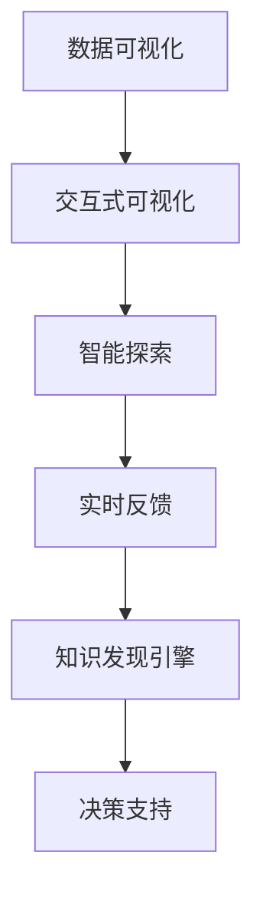

                 

# 知识发现引擎的数据可视化技术与实现

## 1. 背景介绍

### 1.1 问题由来

随着大数据时代的到来，企业拥有越来越多的数据资源，这些数据不仅包括结构化数据，还包括非结构化数据（如日志文件、文档、图片、视频等）。如何从海量数据中提取有价值的信息，进而支持企业做出更精准的决策，成为亟待解决的问题。数据可视化技术应运而生，它能够将数据转换为图形、图表、地图等可视化形式，直观地呈现数据的结构和内在关系，从而帮助用户理解数据、发现知识、做出决策。

### 1.2 问题核心关键点

知识发现引擎（Knowledge Discovery Engine, KDE）是一种自动化数据分析工具，它通过将数据可视化技术应用于大规模数据集，自动发现其中的模式和关联，为企业提供智能决策支持。基于数据可视化技术的知识发现引擎通常具备以下几个特点：

- **自动化发现**：通过算法自动发现数据中的模式和关联，无需人工干预。
- **交互式探索**：支持用户通过交互式界面，灵活探索数据，进一步深入分析。
- **实时反馈**：在数据输入和分析过程中实时展示分析结果，便于用户实时调整和优化。
- **可视化展示**：能够将分析结果以图形、图表、地图等形式直观呈现，便于用户理解和使用。

数据可视化技术与知识发现引擎的结合，能够在数据驱动的决策过程中发挥重要作用。然而，如何设计高效、可扩展的数据可视化算法，并结合具体的知识发现任务，优化分析过程，是当前面临的一个关键问题。

## 2. 核心概念与联系

### 2.1 核心概念概述

为更好地理解数据可视化技术在知识发现引擎中的应用，本节将介绍几个关键概念：

- **数据可视化**：将数据转换为图形、图表、地图等可视化形式，直观展示数据的结构和内在关系。
- **交互式可视化**：支持用户通过交互式界面，对数据进行灵活探索和深入分析。
- **智能探索**：通过算法自动发现数据中的模式和关联，无需人工干预。
- **实时反馈**：在数据输入和分析过程中，实时展示分析结果，支持用户实时调整和优化。
- **知识发现引擎**：利用数据可视化技术，自动从大规模数据中发现知识，支持企业做出智能决策。

这些概念之间的联系可以通过以下Mermaid流程图来展示：



这个流程图展示了数据可视化技术的核心流程：首先对数据进行可视化，然后通过交互式界面进行智能探索，实时反馈分析结果，最终通过知识发现引擎支持企业做出决策。

## 3. 核心算法原理 & 具体操作步骤

### 3.1 算法原理概述

数据可视化算法通常包含以下几个步骤：

1. **数据预处理**：清洗和处理原始数据，确保数据的质量和一致性。
2. **数据转换**：将数据转换为可视化形式，如图形、图表、地图等。
3. **交互式探索**：支持用户通过交互式界面，对数据进行灵活探索和深入分析。
4. **实时反馈**：在数据输入和分析过程中，实时展示分析结果，支持用户实时调整和优化。
5. **知识发现**：利用数据可视化技术，自动从大规模数据中发现知识，支持企业做出智能决策。

数据可视化算法的核心思想是通过图形、图表等形式，将数据转换为可视化形式，直观展示数据的结构和内在关系，支持用户对数据进行深入分析，发现其中的模式和关联，从而支持企业做出更精准的决策。

### 3.2 算法步骤详解

基于数据可视化技术的知识发现引擎一般包括以下几个关键步骤：

**Step 1: 数据预处理**

数据预处理是数据可视化的第一步，主要包括以下几个方面：

- 数据清洗：去除数据中的噪声、缺失值和异常值，确保数据的质量。
- 数据转换：将原始数据转换为适合可视化的格式，如时间序列数据转换为折线图。
- 数据归一化：将数据进行归一化处理，使得数据具有相同的量纲。

**Step 2: 数据转换**

数据转换是将数据转换为可视化形式的过程。常见的数据转换方式包括：

- 折线图：用于展示时间序列数据的变化趋势。
- 散点图：用于展示两个变量之间的关系。
- 柱状图：用于展示各分类数据的分布情况。
- 地图：用于展示地理数据的分布情况。
- 热力图：用于展示数据的密度分布情况。

**Step 3: 交互式探索**

交互式探索是指通过交互式界面，支持用户对数据进行灵活探索和深入分析的过程。常见的交互式探索方式包括：

- 滑块：用于动态调整数据的展示范围。
- 筛选器：用于筛选数据集中的特定分类或时间段。
- 悬停工具提示：用于展示数据点的详细信息。
- 数据编辑：允许用户对数据进行修改和更新。

**Step 4: 实时反馈**

实时反馈是指在数据输入和分析过程中，实时展示分析结果，支持用户实时调整和优化。常见的实时反馈方式包括：

- 动态更新：实时更新图表和地图上的数据。
- 报警机制：当数据异常或分析结果不理想时，触发报警。
- 预测展示：展示数据预测结果，支持用户进行未来预测。

**Step 5: 知识发现**

知识发现是指利用数据可视化技术，自动从大规模数据中发现知识，支持企业做出智能决策。常见的知识发现方法包括：

- 聚类分析：将数据按照相似度进行分组。
- 关联规则分析：发现数据中的关联规则。
- 时间序列分析：分析数据的时间变化趋势。
- 异常检测：检测数据中的异常点。

### 3.3 算法优缺点

基于数据可视化技术的知识发现引擎具有以下优点：

- **直观展示**：通过图形、图表等形式，直观展示数据的结构和内在关系，易于理解和使用。
- **灵活探索**：支持用户通过交互式界面，对数据进行灵活探索和深入分析。
- **实时反馈**：在数据输入和分析过程中，实时展示分析结果，支持用户实时调整和优化。
- **自动化发现**：通过算法自动发现数据中的模式和关联，无需人工干预。

同时，该方法也存在一定的局限性：

- **数据复杂性**：对于大规模、高维度的数据，可视化效果可能较差，需要进一步优化和简化。
- **算法复杂性**：不同的数据可视化算法有不同的计算复杂度，需要根据具体情况选择合适的算法。
- **用户需求匹配**：不同用户对数据可视化有不同的需求，需要根据用户需求进行个性化定制。
- **数据隐私**：在数据可视化的过程中，需要注意数据隐私和安全问题。

尽管存在这些局限性，但就目前而言，基于数据可视化技术的知识发现引擎在数据分析和决策支持方面仍具有广泛的应用前景。未来相关研究的重点在于如何进一步降低算法复杂度，提高数据可视化效果，优化用户交互体验，同时兼顾数据隐私和安全等因素。

### 3.4 算法应用领域

基于数据可视化技术的知识发现引擎在多个领域得到了广泛应用，例如：

- **金融领域**：用于分析股票价格、金融市场趋势等，帮助投资者做出投资决策。
- **医疗领域**：用于分析患者数据、医疗记录等，支持医生做出诊断和治疗决策。
- **市场营销**：用于分析客户数据、销售记录等，帮助企业优化营销策略。
- **物流管理**：用于分析物流数据、运输路线等，优化物流管理方案。
- **城市规划**：用于分析城市交通、公共设施分布等，支持城市规划和建设。

除了上述这些经典领域外，基于数据可视化技术的知识发现引擎还被创新性地应用到更多场景中，如智能交通、智慧能源、智能制造等，为各行业的智能化升级提供了新的解决方案。随着技术的不断进步，基于数据可视化技术的知识发现引擎必将在更多领域得到应用，为各行业的发展注入新的活力。

## 4. 数学模型和公式 & 详细讲解  
### 4.1 数学模型构建

数据可视化算法通常包含以下几个关键数学模型：

- **折线图模型**：用于展示时间序列数据的变化趋势。
- **散点图模型**：用于展示两个变量之间的关系。
- **柱状图模型**：用于展示各分类数据的分布情况。
- **地图模型**：用于展示地理数据的分布情况。
- **热力图模型**：用于展示数据的密度分布情况。

以下以折线图模型为例，详细讲解其数学模型和公式推导过程。

**折线图模型**

假设有一组时间序列数据 $(x_i, y_i)$，其中 $x_i$ 表示时间，$y_i$ 表示对应时间点的数据值。折线图的数学模型可以表示为：

$$
f(x) = \sum_{i=1}^N a_i \exp(-b_i x)
$$

其中 $a_i$ 和 $b_i$ 是模型的参数，需要通过最小化误差函数进行优化。

设 $n$ 个数据点 $(x_i, y_i)$ 的误差函数为：

$$
E(y, f(x)) = \frac{1}{n} \sum_{i=1}^N (y_i - f(x_i))^2
$$

为了最小化误差函数，需要求导并令导数为零，得到：

$$
\frac{\partial E(y, f(x))}{\partial a_i} = -\frac{2}{n} \sum_{i=1}^N (y_i - f(x_i)) \exp(-b_i x_i) = 0
$$

解得：

$$
a_i = \frac{1}{n} \sum_{i=1}^N y_i \exp(-b_i x_i)
$$

类似地，可以求得 $b_i$ 的值。通过上述方法，可以得到时间序列数据的折线图模型，用于展示数据的趋势和变化。

### 4.2 公式推导过程

以下以散点图模型为例，详细讲解其数学模型和公式推导过程。

**散点图模型**

假设有一组数据点 $(x_i, y_i)$，其中 $x_i$ 和 $y_i$ 分别表示两个变量的值。散点图的数学模型可以表示为：

$$
f(x) = c_1 \exp(c_2 x) + c_3 \exp(c_4 x)
$$

其中 $c_1, c_2, c_3, c_4$ 是模型的参数，需要通过最小化误差函数进行优化。

设 $n$ 个数据点 $(x_i, y_i)$ 的误差函数为：

$$
E(y, f(x)) = \frac{1}{n} \sum_{i=1}^N (y_i - f(x_i))^2
$$

为了最小化误差函数，需要求导并令导数为零，得到：

$$
\frac{\partial E(y, f(x))}{\partial c_1} = -\frac{2}{n} \sum_{i=1}^N (y_i - f(x_i)) \exp(c_2 x_i) = 0
$$

解得：

$$
c_1 = \frac{1}{n} \sum_{i=1}^N y_i \exp(c_2 x_i)
$$

类似地，可以求得 $c_2, c_3, c_4$ 的值。通过上述方法，可以得到两个变量之间的关系模型，用于展示数据的分布和相关性。

## 5. 项目实践：代码实例和详细解释说明
### 5.1 开发环境搭建

在进行数据可视化实践前，我们需要准备好开发环境。以下是使用Python进行Matplotlib开发的环境配置流程：

1. 安装Anaconda：从官网下载并安装Anaconda，用于创建独立的Python环境。

2. 创建并激活虚拟环境：
```bash
conda create -n pyenv python=3.8 
conda activate pyenv
```

3. 安装Matplotlib：
```bash
conda install matplotlib
```

4. 安装其他相关库：
```bash
pip install numpy pandas seaborn sklearn
```

完成上述步骤后，即可在`pyenv`环境中开始数据可视化实践。

### 5.2 源代码详细实现

下面我们以时间序列数据为例，给出使用Matplotlib进行折线图可视化的PyTorch代码实现。

首先，定义时间序列数据的预处理函数：

```python
import pandas as pd
import numpy as np
import matplotlib.pyplot as plt

def preprocess_data(data):
    # 清洗数据
    data = data.dropna()
    # 归一化处理
    data = (data - data.mean()) / data.std()
    return data
```

然后，定义折线图函数：

```python
def plot_line_chart(data, title):
    # 创建图形对象
    fig, ax = plt.subplots()
    # 设置图形标题
    ax.set_title(title)
    # 绘制折线图
    ax.plot(data)
    # 设置x轴和y轴标签
    ax.set_xlabel('Time')
    ax.set_ylabel('Value')
    # 显示图形
    plt.show()
```

接着，定义数据可视化函数：

```python
def visualize_data(data, title):
    # 预处理数据
    processed_data = preprocess_data(data)
    # 绘制折线图
    plot_line_chart(processed_data, title)
```

最后，启动数据可视化流程：

```python
# 加载数据
data = pd.read_csv('data.csv')
# 可视化数据
visualize_data(data, 'Time Series Data')
```

以上就是使用Matplotlib进行时间序列数据折线图可视化的完整代码实现。可以看到，Matplotlib提供了丰富的图形绘制功能，可以方便地对时间序列数据进行可视化展示。

### 5.3 代码解读与分析

让我们再详细解读一下关键代码的实现细节：

**preprocess_data函数**：
- 清洗数据：使用`dropna()`函数去除缺失值和异常值，确保数据的质量。
- 归一化处理：使用标准化方法对数据进行归一化处理，使得数据具有相同的量纲。

**plot_line_chart函数**：
- 创建图形对象：使用`plt.subplots()`函数创建图形对象。
- 设置图形标题：使用`ax.set_title()`函数设置图形标题。
- 绘制折线图：使用`ax.plot()`函数绘制折线图。
- 设置x轴和y轴标签：使用`ax.set_xlabel()`和`ax.set_ylabel()`函数设置x轴和y轴标签。
- 显示图形：使用`plt.show()`函数显示图形。

**visualize_data函数**：
- 预处理数据：调用`preprocess_data()`函数预处理数据。
- 绘制折线图：调用`plot_line_chart()`函数绘制折线图。

**主函数**：
- 加载数据：使用`pd.read_csv()`函数加载时间序列数据。
- 可视化数据：调用`visualize_data()`函数进行数据可视化。

可以看到，Matplotlib提供了一套完善的绘图接口，可以轻松地实现各种类型的图表绘制。通过自定义函数，可以方便地对数据进行预处理和可视化展示。

## 6. 实际应用场景

### 6.1 智能交通系统

基于数据可视化技术的知识发现引擎，可以广泛应用于智能交通系统的构建。传统的交通监控系统依赖于人工观察和判断，效率低、成本高，难以适应日益增长的交通需求。通过数据可视化技术，可以实时展示交通流量、车辆速度、事故情况等数据，支持交通管理部门进行智能调度，优化交通流，减少拥堵和事故发生率。

在技术实现上，可以采集城市交通路口的监控摄像头数据，将车辆、行人和道路等场景进行实时分析和可视化展示，自动发现交通异常情况并报警，提高交通管理的自动化和智能化水平，构建更安全、高效的交通系统。

### 6.2 智慧医疗系统

在智慧医疗系统中，基于数据可视化技术的知识发现引擎可以用于分析患者数据、医疗记录等，支持医生进行诊断和治疗决策。通过数据可视化，可以直观展示患者病史、检查结果、治疗效果等数据，帮助医生快速识别病情，制定个性化治疗方案，提高医疗服务的效率和质量。

在具体应用中，可以将患者的电子病历数据可视化展示，帮助医生进行病情分析和诊断，同时支持医生进行治疗效果评估和病案归档，提高医疗服务的标准化和规范性。

### 6.3 金融风控系统

在金融风控系统中，基于数据可视化技术的知识发现引擎可以用于分析交易数据、客户行为等，支持金融机构进行风险评估和决策。通过数据可视化，可以直观展示交易趋势、客户信用、交易异常等数据，帮助金融机构识别潜在的风险点，制定相应的风险控制策略，提高金融服务的可靠性和安全性。

在具体应用中，可以将交易数据可视化展示，帮助金融机构进行交易行为分析，检测异常交易行为并进行风险预警，同时支持金融机构进行客户信用评估和反欺诈分析，提升金融服务的效率和质量。

### 6.4 未来应用展望

随着数据可视化技术和知识发现引擎的不断发展，其在更多领域的应用前景将会更加广阔。

- **智能制造**：用于分析生产数据、设备状态等，支持企业进行智能制造，优化生产流程，提高生产效率。
- **智慧农业**：用于分析气象数据、土壤数据等，支持农业生产者进行精准农业，提高农业生产效率和质量。
- **智慧能源**：用于分析能源消耗、电力负荷等，支持能源公司进行智能调度，优化能源分配，提高能源利用效率。
- **智慧城市**：用于分析城市数据、交通数据等，支持城市规划和建设，优化城市管理，提高城市运行效率。

## 7. 工具和资源推荐

### 7.1 学习资源推荐

为了帮助开发者系统掌握数据可视化技术，这里推荐一些优质的学习资源：

1. **《Python数据可视化》课程**：由Coursera提供，介绍了数据可视化的基本概念和常用工具，如Matplotlib、Seaborn等。

2. **《数据可视化之美》书籍**：详细讲解了数据可视化技术的基本原理和实践方法，适合初学者和中级开发者。

3. **Kaggle数据可视化比赛**：Kaggle平台上的数据可视化比赛，可以练习和展示数据可视化技能，与其他数据科学家交流学习。

4. **Tableau学习资源**：Tableau是一款流行的数据可视化工具，官方提供丰富的学习资源，适合高级开发者。

5. **D3.js学习资源**：D3.js是一款强大的数据可视化库，官方提供丰富的学习资源和示例代码，适合高级开发者。

通过对这些资源的学习实践，相信你一定能够快速掌握数据可视化技术的精髓，并用于解决实际的NLP问题。

### 7.2 开发工具推荐

高效的开发离不开优秀的工具支持。以下是几款用于数据可视化开发的常用工具：

1. **Matplotlib**：Python的数据可视化库，支持多种图形绘制，适合动态图形展示。

2. **Seaborn**：基于Matplotlib的数据可视化库，支持统计图形绘制，适合复杂图形展示。

3. **Tableau**：流行的商业数据可视化工具，支持拖放式界面设计，适合数据探索和决策支持。

4. **D3.js**：开源的数据可视化库，支持HTML和JavaScript，适合Web应用程序开发。

5. **Plotly**：开源的数据可视化库，支持多种编程语言，适合数据科学和机器学习领域的应用。

合理利用这些工具，可以显著提升数据可视化任务的开发效率，加快创新迭代的步伐。

### 7.3 相关论文推荐

数据可视化技术与知识发现引擎的发展源于学界的持续研究。以下是几篇奠基性的相关论文，推荐阅读：

1. **《交互式可视化技术》论文**：介绍了交互式可视化的基本概念和常用技术，如滑块、筛选器、悬停工具提示等。

2. **《实时数据可视化系统》论文**：介绍了一种实时数据可视化系统的设计和实现方法，支持用户进行动态数据展示。

3. **《大数据可视化技术》论文**：详细讲解了大数据可视化技术的基本原理和常用方法，如流式可视化、分布式可视化等。

4. **《智能数据可视化系统》论文**：介绍了一种基于机器学习的智能数据可视化系统的设计和实现方法，支持用户进行智能数据探索。

5. **《可视化技术在知识发现中的应用》论文**：详细讲解了可视化技术在知识发现中的应用方法，如聚类分析、关联规则分析等。

这些论文代表了大数据可视化技术的发展脉络。通过学习这些前沿成果，可以帮助研究者把握学科前进方向，激发更多的创新灵感。

## 8. 总结：未来发展趋势与挑战

### 8.1 总结

本文对基于数据可视化技术的知识发现引擎进行了全面系统的介绍。首先阐述了数据可视化技术在知识发现引擎中的应用背景和意义，明确了知识发现引擎在数据分析和决策支持中的独特价值。其次，从原理到实践，详细讲解了数据可视化算法的核心步骤和关键技术，给出了数据可视化任务开发的完整代码实例。同时，本文还广泛探讨了数据可视化技术在智能交通、智慧医疗、金融风控等多个行业领域的应用前景，展示了数据可视化技术的广阔前景。

通过本文的系统梳理，可以看到，基于数据可视化技术的知识发现引擎正在成为数据分析和决策支持的重要范式，极大地拓展了数据驱动决策的边界，催生了更多的落地场景。未来，伴随数据可视化技术和知识发现引擎的不断演进，基于数据可视化技术的知识发现引擎必将在更多领域得到应用，为各行业的发展注入新的活力。

### 8.2 未来发展趋势

展望未来，数据可视化技术将呈现以下几个发展趋势：

1. **交互式可视化**：支持用户通过交互式界面，对数据进行灵活探索和深入分析，增强用户使用体验。
2. **实时数据可视化**：支持数据在输入和分析过程中实时展示，支持用户实时调整和优化，提高数据处理效率。
3. **智能可视化**：通过算法自动发现数据中的模式和关联，无需人工干预，提升数据发现能力。
4. **多模态可视化**：支持多种数据类型的可视化，如时间序列数据、地理数据、文本数据等，支持用户进行综合分析。
5. **可视化融合**：将数据可视化与机器学习、自然语言处理等技术进行融合，提升数据处理能力，支持复杂任务分析。

以上趋势凸显了数据可视化技术的广阔前景。这些方向的探索发展，必将进一步提升数据可视化技术在数据分析和决策支持中的作用，为各行业的发展注入新的动力。

### 8.3 面临的挑战

尽管数据可视化技术在多个领域得到了广泛应用，但在迈向更加智能化、普适化应用的过程中，仍然面临诸多挑战：

1. **数据复杂性**：对于大规模、高维度的数据，可视化效果可能较差，需要进一步优化和简化。
2. **算法复杂性**：不同的数据可视化算法有不同的计算复杂度，需要根据具体情况选择合适的算法。
3. **用户需求匹配**：不同用户对数据可视化有不同的需求，需要根据用户需求进行个性化定制。
4. **数据隐私**：在数据可视化的过程中，需要注意数据隐私和安全问题。
5. **跨平台支持**：不同平台对数据可视化的支持程度不同，需要开发跨平台兼容的数据可视化系统。

尽管存在这些挑战，但通过不断优化算法和工具，提升数据可视化效果，兼顾用户需求，加强数据隐私和安全，支持跨平台开发，数据可视化技术必将进一步提升数据分析和决策支持能力，为各行业的发展注入新的活力。

### 8.4 未来突破

面对数据可视化技术面临的种种挑战，未来的研究需要在以下几个方面寻求新的突破：

1. **数据压缩技术**：采用数据压缩技术，提高数据可视化的效率和效果，支持大规模数据可视化。
2. **跨平台技术**：开发跨平台兼容的数据可视化工具，支持多种操作系统和设备，提高数据可视化系统的通用性。
3. **增强现实技术**：结合增强现实技术，支持用户进行三维可视化，增强用户体验。
4. **人工智能技术**：将人工智能技术引入数据可视化系统，支持自动发现数据中的模式和关联，提升数据发现能力。
5. **云可视化技术**：开发云可视化系统，支持数据在云端进行实时处理和展示，提高数据处理效率。

这些研究方向的探索，必将引领数据可视化技术迈向更高的台阶，为各行业的发展注入新的活力。

## 9. 附录：常见问题与解答

**Q1：数据可视化与机器学习的关系是什么？**

A: 数据可视化与机器学习是紧密相关的，数据可视化可以直观展示数据结构和内在关系，支持机器学习模型的训练和调优。机器学习模型可以自动发现数据中的模式和关联，支持数据可视化的智能探索和深入分析。通过数据可视化和机器学习的结合，可以提升数据分析和决策支持能力。

**Q2：如何选择合适的数据可视化工具？**

A: 选择数据可视化工具时，需要考虑以下几个因素：
1. 功能需求：根据具体的任务需求，选择支持多类型数据可视化、交互式探索、实时反馈等功能的工具。
2. 用户体验：选择界面友好、操作简便、易于学习的工具，提高用户的使用体验。
3. 性能要求：选择性能稳定、支持大规模数据处理的工具，提高数据处理效率。
4. 开源程度：选择开源免费或授权费用较低的工具，降低开发成本。
5. 社区支持：选择有活跃社区支持的工具，便于获取技术支持和资源。

**Q3：数据可视化过程中的数据隐私和安全问题如何解决？**

A: 在数据可视化的过程中，需要特别注意数据隐私和安全问题。常见的解决方法包括：
1. 数据匿名化：将敏感数据进行匿名化处理，保护用户隐私。
2. 数据加密：对数据进行加密处理，防止数据泄露。
3. 访问控制：设置访问控制权限，确保只有授权用户可以访问数据可视化系统。
4. 数据审计：记录数据访问和操作日志，便于监控和审计。
5. 合规性检查：确保数据可视化系统符合相关法律法规和行业标准，如GDPR、HIPAA等。

这些方法可以在数据可视化的过程中，保护数据隐私和安全，增强系统的可信度和可靠性。

**Q4：数据可视化过程中如何避免过拟合？**

A: 数据可视化过程中，过拟合是一个常见的问题。常见的解决方法包括：
1. 数据清洗：清洗数据，去除噪声、缺失值和异常值，确保数据质量。
2. 数据归一化：对数据进行归一化处理，使得数据具有相同的量纲，减少数据不一致性的影响。
3. 数据采样：采用随机采样、分层采样等方法，减少数据集的大小，降低过拟合风险。
4. 数据增强：通过数据增强技术，如旋转、平移、缩放等，增加数据多样性，降低过拟合风险。
5. 交叉验证：采用交叉验证方法，评估模型在不同数据集上的表现，避免模型对单一数据集的过拟合。

这些方法可以在数据可视化的过程中，减少过拟合的风险，提高数据的可靠性和准确性。

**Q5：数据可视化过程中如何提高可视化效果？**

A: 提高数据可视化效果可以从以下几个方面入手：
1. 选择合适的可视化类型：根据数据特点和任务需求，选择合适的可视化类型，如图表、地图、热力图等，确保数据的可视化效果。
2. 优化图形设计：优化图形的颜色、字体、标签等设计，确保图形美观、易读。
3. 动态展示：采用动态展示技术，如动态更新、动态过滤等，增强用户的使用体验。
4. 交互式探索：支持用户通过交互式界面，对数据进行灵活探索和深入分析，提高数据发现能力。
5. 可视化融合：将数据可视化与机器学习、自然语言处理等技术进行融合，提升数据处理能力，支持复杂任务分析。

这些方法可以在数据可视化的过程中，提高可视化效果，增强用户的使用体验，提升数据分析和决策支持能力。

---

作者：禅与计算机程序设计艺术 / Zen and the Art of Computer Programming

