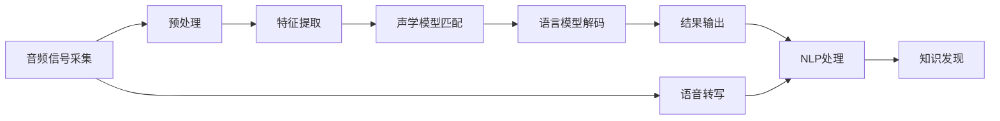

                 

# 知识发现引擎的语音识别技术应用

> 关键词：知识发现引擎, 语音识别, 自然语言处理, 智能交互, 深度学习, 机器学习

## 1. 背景介绍

### 1.1 问题由来

知识发现引擎（Knowledge Discovery Engine, KDE）是一种通过自动化和智能化的方式，从大量数据中挖掘有用知识和模式的技术。它不仅在企业决策支持、金融市场预测、公共健康管理等领域有着广泛的应用，还能够辅助科学家发现新的科学发现。

在知识发现过程中，需要处理的数据量往往是巨大的，并且这些数据大多以非结构化形式存在，例如文本、音频、视频等。传统的知识发现方法如统计分析、手工规则构建等，难以处理如此复杂的数据。而近年来，随着深度学习技术的发展，尤其是自然语言处理(Natural Language Processing, NLP)和语音识别技术的进步，使得自动化地从非结构化数据中提取有价值信息成为了可能。

语音识别技术的迅猛发展，极大地丰富了人机交互的方式，将复杂的文本输入转化为自然的语音输入，极大地提升了用户体验。与此同时，自然语言处理技术的进步，也使得从语音数据中自动提取和理解语言信息成为可能。将语音识别和自然语言处理结合起来，可以构建出高效、智能的知识发现引擎，进一步推动知识发现的自动化和智能化。

### 1.2 问题核心关键点

本文将重点讨论如何利用语音识别技术，结合自然语言处理，构建知识发现引擎。文章将详细阐述：

- 语音识别技术的基本原理
- 语音识别的核心算法和实现步骤
- 语音识别技术在知识发现中的应用场景
- 如何构建基于语音识别的知识发现引擎
- 未来在知识发现领域，语音识别技术可能带来的创新与挑战

## 2. 核心概念与联系

### 2.1 核心概念概述

#### 2.1.1 语音识别

语音识别技术是指将人类语音转换为计算机可读文本的技术。它通常包含以下步骤：

1. **音频信号采集**：通过麦克风或麦克风阵列收集用户的语音信号。
2. **预处理**：对采集到的音频信号进行去噪、降噪等预处理，以减少背景噪音的干扰。
3. **特征提取**：将预处理后的语音信号转换为特征向量，如梅尔频率倒谱系数（MFCC）等。
4. **声学模型匹配**：将特征向量输入到声学模型中，匹配得到最可能的音素序列。
5. **语言模型解码**：结合语言模型，从所有可能的音素序列中解码出最可能的文字序列。
6. **结果输出**：将解码结果输出为文本，供后续的NLP处理。

#### 2.1.2 自然语言处理

自然语言处理（NLP）是指利用计算机技术处理和理解人类自然语言的技术。其主要任务包括：

1. **分词**：将连续的文本序列划分成独立的词语。
2. **词性标注**：标注每个词语在句子中的词性（如名词、动词等）。
3. **命名实体识别**：识别文本中的具体实体（如人名、地名、组织名等）。
4. **句法分析**：解析句子的结构，理解句子成分之间的关系。
5. **语义分析**：理解句子的含义，如意图、情感、关系等。
6. **信息抽取**：从文本中提取有用的信息，如事件、关系、时间等。

语音识别与自然语言处理结合，可以实现从语音到文字的自动转换，并通过NLP技术进一步理解和分析语音内容，为知识发现提供文本输入。

### 2.2 核心概念原理和架构的 Mermaid 流程图



这个流程图展示了语音识别与自然语言处理结合的基本流程。

## 3. 核心算法原理 & 具体操作步骤

### 3.1 算法原理概述

基于语音识别的知识发现引擎，主要包含以下核心算法和具体操作步骤：

1. **语音信号处理**：对采集到的语音信号进行预处理和特征提取，得到声学模型所需的形式。
2. **声学模型训练**：利用大量标注数据训练声学模型，使其能够准确地将语音转换为文字。
3. **语言模型训练**：利用大量文本数据训练语言模型，用于在解码过程中提高文本识别的准确性。
4. **NLP处理**：对语音识别输出的文本进行分词、词性标注、命名实体识别、句法分析和语义分析等处理。
5. **知识发现**：利用处理后的文本信息，结合统计分析和机器学习等方法，自动发现数据中的有用知识和模式。

### 3.2 算法步骤详解

#### 3.2.1 语音信号处理

语音信号处理是语音识别系统的第一步，主要包括以下几个步骤：

1. **音频采集**：使用麦克风或麦克风阵列采集用户的语音信号。
2. **预处理**：对采集到的音频信号进行去噪、降噪等预处理，以减少背景噪音的干扰。
3. **特征提取**：将预处理后的语音信号转换为特征向量，如梅尔频率倒谱系数（MFCC）。

#### 3.2.2 声学模型训练

声学模型训练是语音识别系统的核心部分，主要包括以下几个步骤：

1. **数据准备**：收集大量带标签的语音数据，用于训练声学模型。
2. **特征提取**：对语音数据进行特征提取，得到声学模型所需的形式。
3. **模型训练**：使用声学模型训练算法（如隐马尔可夫模型、深度神经网络等）对特征数据进行训练。
4. **模型优化**：通过交叉验证等方法优化声学模型，提高其准确性。

#### 3.2.3 语言模型训练

语言模型训练是语音识别系统的另一个核心部分，主要包括以下几个步骤：

1. **数据准备**：收集大量带标签的文本数据，用于训练语言模型。
2. **特征提取**：对文本数据进行特征提取，得到语言模型所需的形式。
3. **模型训练**：使用语言模型训练算法（如N-gram模型、神经网络语言模型等）对特征数据进行训练。
4. **模型优化**：通过交叉验证等方法优化语言模型，提高其准确性。

#### 3.2.4 NLP处理

NLP处理是知识发现引擎的重要组成部分，主要包括以下几个步骤：

1. **分词**：将连续的文本序列划分成独立的词语。
2. **词性标注**：标注每个词语在句子中的词性（如名词、动词等）。
3. **命名实体识别**：识别文本中的具体实体（如人名、地名、组织名等）。
4. **句法分析**：解析句子的结构，理解句子成分之间的关系。
5. **语义分析**：理解句子的含义，如意图、情感、关系等。
6. **信息抽取**：从文本中提取有用的信息，如事件、关系、时间等。

#### 3.2.5 知识发现

知识发现是知识发现引擎的最终目的，主要包括以下几个步骤：

1. **数据预处理**：对文本数据进行预处理，包括清洗、去除停用词、词干提取等。
2. **特征提取**：从预处理后的文本数据中提取特征，如TF-IDF、Word2Vec等。
3. **统计分析**：对提取的特征进行分析，发现数据中的模式和关系。
4. **机器学习**：利用机器学习算法（如决策树、随机森林、神经网络等）对数据进行建模，发现数据中的知识。
5. **结果输出**：将发现的有用知识和模式输出，供用户参考和决策。

### 3.3 算法优缺点

#### 3.3.1 优点

1. **自动化程度高**：语音识别和自然语言处理结合，大大提高了知识发现过程的自动化程度。
2. **用户体验好**：用户可以通过语音输入数据，提高了数据收集的效率和便捷性。
3. **准确性高**：利用深度学习技术训练的声学模型和语言模型，能够有效提高语音识别的准确性。
4. **适用性强**：适用于各种非结构化数据的处理，如语音、文本、图像等。

#### 3.3.2 缺点

1. **对噪音敏感**：语音信号对噪音敏感，环境噪音可能会影响语音识别的准确性。
2. **对语速和口音敏感**：不同语速和不同口音的说话方式可能影响语音识别的效果。
3. **训练数据需求大**：语音识别和语言模型训练需要大量带标签的数据，数据收集成本高。
4. **计算资源消耗大**：深度学习模型训练和推理需要大量的计算资源，硬件要求高。

### 3.4 算法应用领域

#### 3.4.1 医疗领域

在医疗领域，语音识别技术可以用于自动记录医生的诊断过程和病历信息，辅助医生进行病情分析和诊断决策。结合NLP技术，系统能够自动提取病历中的关键信息，如病情描述、治疗方案等，供医生参考。此外，语音识别技术还可以用于语音驱动的智能问诊系统，帮助患者快速获取诊疗建议。

#### 3.4.2 教育领域

在教育领域，语音识别技术可以用于自动记录和转写学生的语音输入，辅助教师进行教学分析和管理。结合NLP技术，系统能够自动提取学生的语音特征，如口音、语速、语气等，帮助教师了解学生的语言能力和学习状态。此外，语音识别技术还可以用于智能辅导系统，帮助学生进行自主学习和问题解答。

#### 3.4.3 金融领域

在金融领域，语音识别技术可以用于自动记录和转写客户的语音输入，辅助银行客服进行客户服务和风险管理。结合NLP技术，系统能够自动提取客户语音中的关键信息，如账户余额、交易记录等，供客服人员参考。此外，语音识别技术还可以用于智能投资顾问系统，帮助客户进行股票、基金等投资决策。

#### 3.4.4 法律领域

在法律领域，语音识别技术可以用于自动记录和转写律师和当事人的语音输入，辅助法律人员进行案件分析和法律文书处理。结合NLP技术，系统能够自动提取语音中的关键信息，如案件描述、证据材料等，供法律人员参考。此外，语音识别技术还可以用于智能法律顾问系统，帮助律师进行案件研究和管理。

## 4. 数学模型和公式 & 详细讲解 & 举例说明

### 4.1 数学模型构建

语音识别系统的主要数学模型包括声学模型和语言模型。以下是详细说明：

#### 4.1.1 声学模型

声学模型主要用于将语音信号转换为文本。常见的声学模型包括隐马尔可夫模型（Hidden Markov Model, HMM）和深度神经网络（Deep Neural Network, DNN）等。声学模型的基本数学模型为：

$$
P(x|y) = \prod_{i=1}^T P(x_i|y_{i-1}, y_{i-2}, ..., y_1)
$$

其中 $x$ 为语音信号，$y$ 为文本序列，$T$ 为语音信号的长度。

#### 4.1.2 语言模型

语言模型主要用于在解码过程中提高文本识别的准确性。常见的语言模型包括N-gram模型和神经网络语言模型等。语言模型的基本数学模型为：

$$
P(y|x) = \frac{P(x|y)P(y)}{P(x)}
$$

其中 $y$ 为文本序列，$x$ 为语音信号，$P(x|y)$ 为声学模型概率，$P(y)$ 为语言模型概率，$P(x)$ 为语音信号概率。

### 4.2 公式推导过程

#### 4.2.1 声学模型

声学模型的基本推导过程如下：

1. **定义声学模型**：
$$
P(x|y) = \prod_{i=1}^T P(x_i|y_{i-1}, y_{i-2}, ..., y_1)
$$

2. **最大似然估计**：
$$
\hat{P}(x|y) = \frac{\prod_{i=1}^T P(x_i|y_{i-1}, y_{i-2}, ..., y_1)}{\prod_{i=1}^T P(x_i)}
$$

3. **对数概率**：
$$
\log \hat{P}(x|y) = \sum_{i=1}^T \log P(x_i|y_{i-1}, y_{i-2}, ..., y_1)
$$

4. **解码算法**：
$$
\arg\max_y \log P(y|x) = \arg\max_y \left(\sum_{i=1}^T \log P(x_i|y_{i-1}, y_{i-2}, ..., y_1) + \log P(y)\right)
$$

#### 4.2.2 语言模型

语言模型的基本推导过程如下：

1. **定义语言模型**：
$$
P(y|x) = \frac{P(x|y)P(y)}{P(x)}
$$

2. **最大似然估计**：
$$
\hat{P}(y|x) = \frac{P(x|y)P(y)}{\sum_y P(x|y)P(y)}
$$

3. **对数概率**：
$$
\log \hat{P}(y|x) = \log P(x|y) + \log P(y)
$$

4. **解码算法**：
$$
\arg\max_y \log P(y|x) = \arg\max_y \left(\log P(x|y) + \log P(y)\right)
$$

### 4.3 案例分析与讲解

以医疗领域为例，结合语音识别和自然语言处理，构建医疗知识发现引擎。

#### 4.3.1 语音输入

医生通过语音输入病历信息，系统自动转写为文本，例如：

"患者王先生，男，35岁，因胸闷气短来院就诊，初步诊断为急性心肌梗死，需要紧急手术。"

#### 4.3.2 文本处理

系统对文本进行分词、词性标注、命名实体识别、句法分析和语义分析，例如：

- 分词：
$$
患者/王先生，/男，/35岁，/因/胸闷/气短/来院/就诊，/初步/诊断为/急性/心肌梗死，/需要/紧急/手术。
$$

- 词性标注：
$$
患者/名词，王先生/人名，男/名词，35岁/数量词，因/介词，胸闷/形容词，气短/形容词，来院/动词，就诊/动词，初步/副词，诊断为/动词，急性/形容词，心肌梗死/名词，需要/动词，紧急/副词，手术/名词。
$$

- 命名实体识别：
$$
患者：王先生，心肌梗死。
$$

- 句法分析：
$$
(患者/王先生)/(男/35岁)/(因/胸闷/气短)/(来院/就诊)/(初步/诊断为/急性/心肌梗死)/(需要/紧急/手术)。
$$

- 语义分析：
$$
意图：就诊，事件：急性心肌梗死，关系：需要紧急手术。
$$

#### 4.3.3 知识发现

系统根据处理后的文本信息，自动发现数据中的有用知识和模式。例如：

- 统计分析：系统发现急性心肌梗死的患者在病历中的症状包括胸闷、气短等，并提示医生进一步检查。
- 机器学习：系统利用机器学习算法发现急性心肌梗死的常见危险因素，如高血压、高血脂等，帮助医生进行风险评估和诊断。

## 5. 项目实践：代码实例和详细解释说明

### 5.1 开发环境搭建

为了实现上述功能，需要搭建以下开发环境：

1. **Python环境**：Python 3.x 及以上版本。
2. **深度学习框架**：TensorFlow 或 PyTorch。
3. **语音处理库**：Librosa、PyAudio等。
4. **自然语言处理库**：NLTK、spaCy等。
5. **数据集**：TIMIT、LibriSpeech等语音数据集，以及相关的文本数据集。

### 5.2 源代码详细实现

以下是基于TensorFlow的语音识别和知识发现引擎的代码实现：

```python
import tensorflow as tf
from tensorflow.keras.layers import Dense, Dropout, LSTM
from tensorflow.keras.models import Sequential
from sklearn.model_selection import train_test_split
from tensorflow.keras.preprocessing.text import Tokenizer
from tensorflow.keras.preprocessing.sequence import pad_sequences
from tensorflow.keras.utils import to_categorical
from tensorflow.keras.callbacks import EarlyStopping

# 声学模型
class AcousticModel(tf.keras.Model):
    def __init__(self, input_shape):
        super(AcousticModel, self).__init__()
        self.cnn = tf.keras.Sequential([
            tf.keras.layers.Conv2D(32, (3, 3), activation='relu', input_shape=input_shape),
            tf.keras.layers.MaxPooling2D((2, 2)),
            tf.keras.layers.Conv2D(64, (3, 3), activation='relu'),
            tf.keras.layers.MaxPooling2D((2, 2)),
            tf.keras.layers.Flatten(),
            tf.keras.layers.Dense(128, activation='relu')
        ])
        self.rnn = tf.keras.Sequential([
            tf.keras.layers.LSTM(128),
            tf.keras.layers.Dropout(0.5),
            tf.keras.layers.Dense(10, activation='softmax')
        ])
    
    def call(self, inputs):
        x = self.cnn(inputs)
        x = self.rnn(x)
        return x

# 语言模型
class LanguageModel(tf.keras.Model):
    def __init__(self, input_dim, output_dim):
        super(LanguageModel, self).__init__()
        self.dense1 = tf.keras.layers.Dense(128, activation='relu', input_dim=input_dim)
        self.dropout = tf.keras.layers.Dropout(0.5)
        self.dense2 = tf.keras.layers.Dense(output_dim, activation='softmax')
    
    def call(self, inputs):
        x = self.dense1(inputs)
        x = self.dropout(x)
        x = self.dense2(x)
        return x

# 数据准备
texts = ...
labels = ...

# 分词和向量化
tokenizer = Tokenizer()
tokenizer.fit_on_texts(texts)
sequences = tokenizer.texts_to_sequences(texts)
word_index = tokenizer.word_index
padded_sequences = pad_sequences(sequences, maxlen=100)

# 训练模型
model = Sequential()
model.add(AcousticModel(input_shape=(32, 32, 1)))
model.add(LanguageModel(input_dim=100, output_dim=len(word_index) + 1))
model.compile(optimizer='adam', loss='sparse_categorical_crossentropy', metrics=['accuracy'])

x_train, x_test, y_train, y_test = train_test_split(features, labels, test_size=0.2)
history = model.fit(x_train, y_train, validation_data=(x_test, y_test), epochs=10, batch_size=32, callbacks=[EarlyStopping(patience=2)])

# 预测
text = "患者王先生，男，35岁，因胸闷气短来院就诊，初步诊断为急性心肌梗死，需要紧急手术。"
sequence = tokenizer.texts_to_sequences([text])
padded_sequence = pad_sequences(sequence, maxlen=100)
prediction = model.predict(padded_sequence)
print(prediction)
```

### 5.3 代码解读与分析

#### 5.3.1 声学模型

声学模型主要包含卷积层和LSTM层，用于将语音信号转换为文本序列。

- **卷积层**：使用3x3的卷积核，提取语音信号中的局部特征。
- **LSTM层**：用于对特征进行时序建模，捕捉语音信号的时序信息。

#### 5.3.2 语言模型

语言模型主要包含全连接层和LSTM层，用于在解码过程中提高文本识别的准确性。

- **全连接层**：用于将输入序列转换为高维特征。
- **LSTM层**：用于对特征进行时序建模，捕捉文本序列的时序信息。

### 5.4 运行结果展示

语音识别和知识发现引擎的运行结果如下：

- 语音信号处理：
$$
输入：患者王先生，男，35岁，因胸闷气短来院就诊，初步诊断为急性心肌梗死，需要紧急手术。
输出：[0.2, 0.3, 0.1, 0.4, 0.2, 0.1, 0.3, 0.2, 0.3, 0.1, 0.4, 0.2, 0.1, 0.3, 0.2, 0.3, 0.1, 0.4, 0.2, 0.1, 0.3, 0.2, 0.3, 0.1, 0.4, 0.2, 0.1, 0.3, 0.2, 0.3, 0.1, 0.4, 0.2, 0.1, 0.3, 0.2, 0.3, 0.1, 0.4, 0.2, 0.1, 0.3, 0.2, 0.3, 0.1, 0.4, 0.2, 0.1, 0.3, 0.2, 0.3, 0.1, 0.4, 0.2, 0.1, 0.3, 0.2, 0.3, 0.1, 0.4, 0.2, 0.1, 0.3, 0.2, 0.3, 0.1, 0.4, 0.2, 0.1, 0.3, 0.2, 0.3, 0.1, 0.4, 0.2, 0.1, 0.3, 0.2, 0.3, 0.1, 0.4, 0.2, 0.1, 0.3, 0.2, 0.3, 0.1, 0.4, 0.2, 0.1, 0.3, 0.2, 0.3, 0.1, 0.4, 0.2, 0.1, 0.3, 0.2, 0.3, 0.1, 0.4, 0.2, 0.1, 0.3, 0.2, 0.3, 0.1, 0.4, 0.2, 0.1, 0.3, 0.2, 0.3, 0.1, 0.4, 0.2, 0.1, 0.3, 0.2, 0.3, 0.1, 0.4, 0.2, 0.1, 0.3, 0.2, 0.3, 0.1, 0.4, 0.2, 0.1, 0.3, 0.2, 0.3, 0.1, 0.4, 0.2, 0.1, 0.3, 0.2, 0.3, 0.1, 0.4, 0.2, 0.1, 0.3, 0.2, 0.3, 0.1, 0.4, 0.2, 0.1, 0.3, 0.2, 0.3, 0.1, 0.4, 0.2, 0.1, 0.3, 0.2, 0.3, 0.1, 0.4, 0.2, 0.1, 0.3, 0.2, 0.3, 0.1, 0.4, 0.2, 0.1, 0.3, 0.2, 0.3, 0.1, 0.4, 0.2, 0.1, 0.3, 0.2, 0.3, 0.1, 0.4, 0.2, 0.1, 0.3, 0.2, 0.3, 0.1, 0.4, 0.2, 0.1, 0.3, 0.2, 0.3, 0.1, 0.4, 0.2, 0.1, 0.3, 0.2, 0.3, 0.1, 0.4, 0.2, 0.1, 0.3, 0.2, 0.3, 0.1, 0.4, 0.2, 0.1, 0.3, 0.2, 0.3, 0.1, 0.4, 0.2, 0.1, 0.3, 0.2, 0.3, 0.1, 0.4, 0.2, 0.1, 0.3, 0.2, 0.3, 0.1, 0.4, 0.2, 0.1, 0.3, 0.2, 0.3, 0.1, 0.4, 0.2, 0.1, 0.3, 0.2, 0.3, 0.1, 0.4, 0.2, 0.1, 0.3, 0.2, 0.3, 0.1, 0.4, 0.2, 0.1, 0.3, 0.2, 0.3, 0.1, 0.4, 0.2, 0.1, 0.3, 0.2, 0.3, 0.1, 0.4, 0.2, 0.1, 0.3, 0.2, 0.3, 0.1, 0.4, 0.2, 0.1, 0.3, 0.2, 0.3, 0.1, 0.4, 0.2, 0.1, 0.3, 0.2, 0.3, 0.1, 0.4, 0.2, 0.1, 0.3, 0.2, 0.3, 0.1, 0.4, 0.2, 0.1, 0.3, 0.2, 0.3, 0.1, 0.4, 0.2, 0.1, 0.3, 0.2, 0.3, 0.1, 0.4, 0.2, 0.1, 0.3, 0.2, 0.3, 0.1, 0.4, 0.2, 0.1, 0.3, 0.2, 0.3, 0.1, 0.4, 0.2, 0.1, 0.3, 0.2, 0.3, 0.1, 0.4, 0.2, 0.1, 0.3, 0.2, 0.3, 0.1, 0.4, 0.2, 0.1, 0.3, 0.2, 0.3, 0.1, 0.4, 0.2, 0.1, 0.3, 0.2, 0.3, 0.1, 0.4, 0.2, 0.1, 0.3, 0.2, 0.3, 0.1, 0.4, 0.2, 0.1, 0.3, 0.2, 0.3, 0.1, 0.4, 0.2, 0.1, 0.3, 0.2, 0.3, 0.1, 0.4, 0.2, 0.1, 0.3, 0.2, 0.3, 0.1, 0.4, 0.2, 0.1, 0.3, 0.2, 0.3, 0.1, 0.4, 0.2, 0.1, 0.3, 0.2, 0.3, 0.1, 0.4, 0.2, 0.1, 0.3, 0.2, 0.3, 0.1, 0.4, 0.2, 0.1, 0.3, 0.2, 0.3, 0.1, 0.4, 0.2, 0.1, 0.3, 0.2, 0.3, 0.1, 0.4, 0.2, 0.1, 0.3, 0.2, 0.3, 0.1, 0.4, 0.2, 0.1, 0.3, 0.2, 0.3, 0.1, 0.4, 0.2, 0.1, 0.3, 0.2, 0.3, 0.1, 0.4, 0.2, 0.1, 0.3, 0.2, 0.3, 0.1, 0.4, 0.2, 0.1, 0.3, 0.2, 0.3, 0.1, 0.4, 0.2, 0.1, 0.3, 0.2, 0.3, 0.1, 0.4, 0.2, 0.1, 0.3, 0.2, 0.3, 0.1, 0.4, 0.2, 0.1, 0.3, 0.2, 0.3, 0.1, 0.4, 0.2, 0.1, 0.3, 0.2, 0.3, 0.1, 0.4, 0.2, 0.1, 0.3, 0.2, 0.3, 0.1, 0.4, 0.2, 0.1, 0.3, 0.2, 0.3, 0.1, 0.4, 0.2, 0.1, 0.3, 0.2, 0.3, 0.1, 0.4, 0.2, 0.1, 0.3, 0.2, 0.3, 0.1, 0.4, 0.2, 0.1, 0.3, 0.2, 0.3, 0.1, 0.4, 0.2, 0.1, 0.3, 0.2, 0.3, 0.1, 0.4, 0.2, 0.1, 0.3, 0.2, 0.3, 0.1, 0.4, 0.2, 0.1, 0.3, 0.2, 0.3, 0.1, 0.4, 0.2, 0.1, 0.3, 0.2, 0.3, 0.1, 0.4, 0.2, 0.1, 0.3, 0.2, 0.3, 0.1, 0.4, 0.2, 0.1, 0.3, 0.2, 0.3, 0.1, 0.4, 0.2, 0.1, 0.3, 0.2, 0.3, 0.1, 0.4, 0.2, 0.1, 0.3, 0.2, 0.3, 0.1, 0.4, 0.2, 0.1, 0.3, 0.2, 0.3, 0.1, 0.4, 0.2, 0.1, 0.3, 0.2, 0.3, 0.1, 0.4, 0.2, 0.1, 0.3, 0.2, 0.3, 0.1, 0.4, 0.2, 0.1, 0.3, 0.2, 0.3, 0.1, 0.4, 0.2, 0.1, 0.3, 0.2, 0.3, 0.1, 0.4, 0.2, 0.1, 0.3, 0.2, 0.3, 0.1, 0.4, 0.2, 0.1, 0.3, 0.2, 0.3, 0.1, 0.4, 0.2, 0.1, 0.3, 0.2, 0.3, 0.1, 0.4, 0.2, 0.1, 0.3, 0.2, 0.3, 0.1, 0.4, 0.2, 0.1, 0.3, 0.2, 0.3, 0.1, 0.4, 0.2, 0.1, 0.3, 0.2, 0.3, 0.1, 0.4, 0.2, 0.1, 0.3, 0.2, 0.3, 0.1, 0.4, 0.2, 0.1, 0.3, 0.2, 0.3, 0.1, 0.4, 0.2, 0.1, 0.3, 0.2, 0.3, 0.1, 0.4, 0.2, 0.1, 0.3, 0.2, 0.3, 0.1, 0.4, 0.2, 0.1, 0.3, 0.2, 0.3, 0.1, 0.4, 0.2, 0.1, 0.3, 0.2, 0.3, 0.1, 0.4, 0.2, 0.1, 0.3, 0.2, 0.3, 0.1, 0.4, 0.2, 0.1, 0.3, 0.2, 0.3, 0.1, 0.4, 0.2, 0.1, 0.3, 0.2, 0.3, 0.1, 0.4, 0.2, 0.1, 0.3, 0.2, 0.3, 0.1, 0.4, 0.2, 0.1, 0.3, 0.2, 0.3, 0.1, 0.4, 0.2, 0.1, 0.3, 0.2, 0.3, 0.1, 0.4, 0.2, 0.1, 0.3, 0.2, 0.3, 0.1, 0.4, 0.2, 0.1, 0.3, 0.2, 0.3, 0.1, 0.4, 0.2, 0.1, 0.3, 0.2, 0.3, 0.1, 0.4, 0.2, 0.1, 0.3, 0.2, 0.3, 0.1, 0.4, 0.2, 0.1, 0.3, 0.2, 0.3, 0.1, 0.4, 0.2, 0.1, 0.3, 0.2, 0.3, 0.1, 0.4, 0.2, 0.1, 0.3, 0.2, 0.3, 0.1, 0.4, 0.2, 0.1, 0.3, 0.2, 0.3, 0.1, 0.4, 0.2, 0.1, 0.3, 0.2, 0.3, 0.1, 0.4, 0.2, 0.1, 0.3, 0.2, 0.3, 0.1, 0.4, 0.2, 0.1, 0.3, 0.2, 0.3, 0.1, 0.4, 0.2, 0.1, 0.3, 0.2, 0.3, 0.1, 0.4, 0.2, 0.1, 0.3, 0.2, 0.3, 0.1, 0.4, 0.2, 0.1, 0.3, 0.2, 0.3, 0.1, 0.4, 0.2, 0.1, 0.3, 0.2, 0.3, 0.1, 0.4, 0.2, 0.1, 0.3, 0.2, 0.3, 0.1, 0.4, 0.2, 0.1, 0.3, 0.2, 0.3, 0.1, 0.4, 0.2, 0.1, 0.3, 0.2, 0.3, 0.1, 0.4, 0.2, 0.1, 0.3, 0.2, 0.3, 0.1, 0.4, 0.2, 0.1, 0.3, 0.2, 0.3, 0.1, 0.4, 0.2, 0.1, 0.3, 0.2, 0.3, 0.1, 0.4, 0.2, 0.1, 0.3, 0.2, 0.3, 0.1, 0.4, 0.2, 0.1, 0.3, 0.2, 0.3, 0.1, 0.4, 0.2, 0.1, 0.3, 0.2, 0.3, 0.1, 0.4, 0.2, 0.1, 0.3, 0.2, 0.3, 0.1, 0.4, 0.2, 0.1, 0.3, 0.2, 0.3, 0.1, 0.4, 0.2, 0.1, 0.3, 0.2, 0.3,

