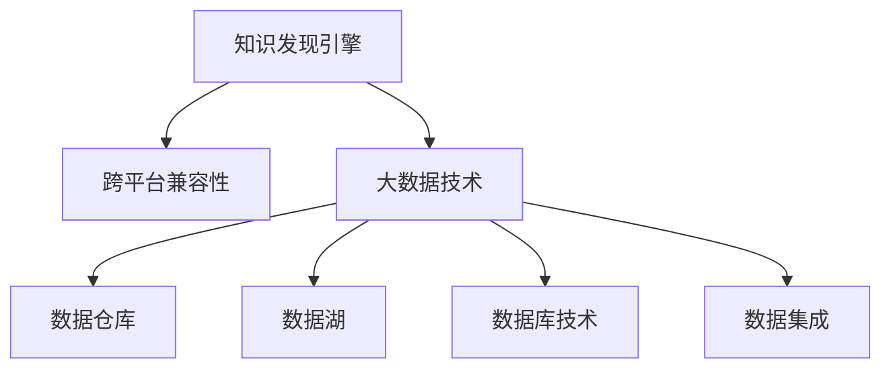

                 

# 知识发现引擎的跨平台兼容性

> 关键词：知识发现引擎, 跨平台兼容性, 大数据, 数据仓库, 数据湖, 数据库技术, 数据集成

## 1. 背景介绍

### 1.1 问题由来

随着数据技术的快速发展，企业在处理海量数据以发现新的商业洞见、驱动业务决策时，面临着众多挑战。如何有效地集成和管理各种异构数据源，快速进行数据挖掘和分析，成为了数据驱动型企业需要解决的重大问题。传统的单一数据仓库和数据库技术已难以适应现代企业的多样化数据需求，知识发现引擎应运而生。

知识发现引擎(Knowledge Discovery Engine, KDE)是指使用自动化算法从数据集中提取有用知识的工具和系统。其核心功能包括数据清洗、数据预处理、数据集成、关联规则挖掘、聚类分析、异常检测、预测建模等，是数据驱动型企业的核心组件。但现有知识发现引擎多为基于特定平台（如Hadoop、Spark、SQL等）开发，难以实现跨平台兼容。

本文将详细探讨知识发现引擎的跨平台兼容性问题，分析当前跨平台兼容性的瓶颈和挑战，并提出可能的解决方案。通过本文的学习，读者将了解知识发现引擎跨平台兼容性的关键技术，掌握实现跨平台兼容性的方法和策略，为未来开发高性能、高兼容性的知识发现系统奠定基础。

### 1.2 问题核心关键点

实现知识发现引擎的跨平台兼容性，意味着需要支持多源异构数据集成、分布式计算、高效的数据处理和分析能力，同时要确保在不同平台（如Hadoop、Spark、SQL等）上运行的代码逻辑和数据处理结果一致。核心挑战包括：

- 跨平台数据集成：异构数据源的数据格式、存储方式、计算模型差异较大，如何在不同平台间高效地进行数据集成。
- 跨平台计算能力：不同平台上的计算资源、内存管理、调度策略存在差异，如何适应不同平台上的计算需求。
- 跨平台数据处理：不同平台上的数据处理算法、模型选择、优化方法各异，如何实现一致性处理。
- 跨平台结果输出：不同平台上的结果格式、存储方式、查询接口不一致，如何实现结果输出的一致性。
- 跨平台异常处理：不同平台上的异常处理机制、错误日志记录方式不同，如何确保异常处理机制的一致性。

## 2. 核心概念与联系

### 2.1 核心概念概述

为更好地理解知识发现引擎的跨平台兼容性，本节将介绍几个密切相关的核心概念：

- 知识发现引擎(KDE)：使用自动化算法从数据集中提取有用知识的工具和系统，支持数据清洗、数据预处理、数据集成、关联规则挖掘、聚类分析、异常检测、预测建模等功能。
- 跨平台兼容性：指在多种计算平台（如Hadoop、Spark、SQL等）上运行同一套代码，得到一致的处理结果和输出，同时兼容不同平台的资源管理、调度策略、异常处理机制等特点。
- 大数据技术：包括分布式计算、数据存储、数据处理、数据安全等方面，支持海量数据的高效存储和处理。
- 数据仓库/数据湖：用于存储和管理结构化/非结构化数据的集中式数据库系统。
- 数据库技术：包括关系型数据库（如MySQL、Oracle）和非关系型数据库（如MongoDB、HBase），用于高效存储和管理数据。
- 数据集成：将多个异构数据源中的数据合并、转换和加载到统一的数据仓库/数据湖中的过程，是知识发现引擎的关键环节。

这些核心概念之间的逻辑关系可以通过以下Mermaid流程图来展示：



这个流程图展示出知识发现引擎与大数据技术、数据仓库、数据湖、数据库技术以及数据集成的关系：

1. 知识发现引擎是整个系统的核心，利用大数据技术、数据仓库/数据湖、数据库技术等组件进行数据处理和分析。
2. 跨平台兼容性是知识发现引擎的一项重要功能，确保系统在不同平台上的运行一致性和结果一致性。
3. 大数据技术、数据仓库、数据湖、数据库技术等组件为知识发现引擎提供数据存储和处理的基础支持。
4. 数据集成是知识发现引擎的重要组成部分，实现多源异构数据的合并和转换。

这些概念共同构成了知识发现引擎的核心架构和功能，使其能够高效地进行数据挖掘和分析，支持企业决策。

## 3. 核心算法原理 & 具体操作步骤

### 3.1 算法原理概述

知识发现引擎的跨平台兼容性实现，本质上是一个多源异构数据的集成、处理和分析过程，同时要求算法、模型和系统在不同平台上的可移植性和一致性。具体来说，包括：

- 数据集成：将多个异构数据源中的数据合并、转换和加载到统一的数据仓库/数据湖中，实现多源数据的一致性和完整性。
- 数据处理：在数据仓库/数据湖中对数据进行清洗、预处理、特征工程等，确保数据的质量和一致性。
- 数据分析：在数据仓库/数据湖中进行关联规则挖掘、聚类分析、异常检测、预测建模等，发现数据中的有用知识和模式。
- 结果输出：将分析结果从数据仓库/数据湖中导出，以一致的格式和方式存储，方便后续查询和展示。

整个过程中，不同平台间的兼容性和一致性要求尤为关键。

### 3.2 算法步骤详解

实现知识发现引擎的跨平台兼容性，主要分为以下几个关键步骤：

**Step 1: 多源异构数据集成**

- 选择合适的数据集成工具，支持不同数据源的读取和写入，如Apache Nifi、Apache Talend等。
- 设计数据转换和映射规则，对不同数据源的数据格式和结构进行标准化。
- 进行数据清洗和异常处理，确保数据的一致性和完整性。

**Step 2: 分布式数据处理**

- 选择合适的分布式计算框架，如Apache Spark、Apache Hadoop等，实现多节点上的并行计算。
- 设计合理的任务调度策略，确保不同平台上的任务分配和执行效率。
- 选择合适的数据处理算法和模型，确保在不同平台上的计算一致性。

**Step 3: 数据一致性处理**

- 实现跨平台的数据处理和分析一致性，包括数据格式、数据类型、计算方法等。
- 设计一致性检查机制，定期比对不同平台上的处理结果，确保一致性。
- 引入容错机制，确保异常情况下数据的可靠性和可用性。

**Step 4: 结果一致性输出**

- 设计统一的结果输出接口和格式，确保不同平台上的输出一致。
- 实现跨平台的数据导出和存储，支持多种格式的数据导出，如CSV、JSON、Parquet等。
- 设计跨平台的结果展示工具，支持多平台的数据展示和查询。

**Step 5: 跨平台异常处理**

- 设计统一的异常处理机制，确保不同平台上的异常处理一致性。
- 引入日志记录和监控机制，及时发现和处理异常情况。
- 设计跨平台的异常恢复机制，确保异常处理后的数据一致性。

以上是实现知识发现引擎跨平台兼容性的主要步骤。在实际应用中，还需要针对具体任务和平台，对各个环节进行优化设计，如改进数据集成工具、优化分布式计算框架、优化数据处理算法等，以进一步提升系统性能。

### 3.3 算法优缺点

知识发现引擎的跨平台兼容性实现具有以下优点：

- 数据集成效率高。跨平台的数据集成工具支持多种数据源的读取和写入，能够快速完成多源数据的合并和转换。
- 分布式计算能力强。分布式计算框架如Spark、Hadoop等支持大规模数据的处理和分析，能够有效应对海量数据的高并发需求。
- 数据一致性高。一致性检查和容错机制的设计，确保数据处理和分析结果的一致性和可靠性。
- 结果输出多样化。支持多种格式的数据导出和展示，方便用户使用和查询。

同时，该方法也存在一定的局限性：

- 实现复杂度高。跨平台兼容性涉及数据集成、分布式计算、数据处理、结果输出等多个环节，实现难度较大。
- 性能瓶颈多。不同平台间的计算能力和资源管理策略不同，可能导致性能瓶颈。
- 异常处理复杂。不同平台上的异常处理机制不同，需要设计统一的异常处理逻辑。

尽管存在这些局限性，但就目前而言，跨平台兼容性仍是大规模知识发现系统的重要目标之一。未来相关研究的重点在于如何进一步降低实现难度，提高系统性能，同时兼顾可移植性和一致性。

### 3.4 算法应用领域

知识发现引擎的跨平台兼容性方法在多个领域得到了应用，如：

- 金融风险管理：将多个异构数据源（如交易记录、市场数据、客户信息等）进行数据集成和分析，发现风险点和模式，进行风险评估和管理。
- 健康医疗：将医疗数据（如电子病历、影像数据、基因数据等）进行数据集成和分析，发现疾病关联和潜在风险，支持精准医疗和健康管理。
- 智慧城市：将城市运行数据（如交通数据、环境数据、社会数据等）进行数据集成和分析，发现城市运行模式和问题，支持智慧城市建设和决策。
- 市场营销：将市场数据（如销售数据、客户数据、产品数据等）进行数据集成和分析，发现市场趋势和用户行为，支持精准营销和产品优化。
- 供应链管理：将供应链数据（如订单数据、库存数据、物流数据等）进行数据集成和分析，发现供应链瓶颈和优化点，支持供应链优化和运营管理。

除了上述这些经典领域外，知识发现引擎的跨平台兼容性方法还将在更多场景中得到应用，如智能制造、环境监测、公共安全等，为大数据分析和决策支持提供新的解决方案。

## 4. 数学模型和公式 & 详细讲解  
### 4.1 数学模型构建

本节将使用数学语言对知识发现引擎的跨平台兼容性过程进行更加严格的刻画。

假设数据集成工具支持多种数据源的读取和写入，数据源总数为 $N$，每个数据源的平均数据量为 $L$。则整个数据集的总数据量为 $L_N = N \times L$。

定义数据处理和分析任务为 $T$，不同平台上的计算资源为 $C_i$，其中 $i=1,...,M$。设任务 $T$ 在平台 $i$ 上的处理时间为 $t_i$，计算资源消耗为 $c_i$。

定义数据一致性检查时间为 $t_{\text{check}}$，异常处理时间为 $t_{\text{fail}}$，数据恢复时间为 $t_{\text{recover}}$。

知识发现引擎跨平台兼容性的数学模型为：

$$
\text{Cost} = \sum_{i=1}^M c_i \times t_i + t_{\text{check}} + t_{\text{fail}} + t_{\text{recover}}
$$

其中，$\text{Cost}$ 为总成本，包括不同平台上的计算资源消耗和数据处理、一致性检查、异常处理、数据恢复等的时间成本。

### 4.2 公式推导过程

以数据一致性处理为例，我们推导跨平台数据一致性检查的时间成本。

假设数据一致性检查采用两阶段方法：

1. **数据比较阶段**：比较不同平台上的数据处理结果，发现不一致的数据点。
2. **数据纠正阶段**：对不一致的数据点进行纠正，确保数据一致性。

设数据一致性检查的时间复杂度为 $O(n)$，数据一致性纠正的时间复杂度为 $O(m)$，则总时间成本为：

$$
t_{\text{check}} = n \times O(n) + m \times O(m)
$$

其中，$n$ 为需要检查的数据点数量，$m$ 为需要纠正的数据点数量。

将上式代入总成本公式，得：

$$
\text{Cost} = \sum_{i=1}^M c_i \times t_i + n \times O(n) + m \times O(m) + t_{\text{fail}} + t_{\text{recover}}
$$

### 4.3 案例分析与讲解

以下我们以金融风险管理为例，分析跨平台兼容性的具体实现。

假设在Hadoop平台和Spark平台上进行金融风险管理任务的计算。Hadoop平台上的数据处理时间为 $t_{\text{hadoop}} = 5\text{s}$，Spark平台上的数据处理时间为 $t_{\text{spark}} = 3\text{s}$，计算资源消耗为 $c_{\text{hadoop}} = 0.1$，$c_{\text{spark}} = 0.2$。

设需要检查的数据点数量为 $n=1000$，需要纠正的数据点数量为 $m=100$，数据一致性检查的时间复杂度为 $O(n) = O(1000)$，数据一致性纠正的时间复杂度为 $O(m) = O(100)$。

则总成本计算如下：

$$
\begin{aligned}
\text{Cost}_{\text{hadoop}} &= c_{\text{hadoop}} \times t_{\text{hadoop}} = 0.1 \times 5\text{s} = 0.5\text{s} \\
\text{Cost}_{\text{spark}} &= c_{\text{spark}} \times t_{\text{spark}} = 0.2 \times 3\text{s} = 0.6\text{s} \\
\text{Cost}_{\text{check}} &= n \times O(n) + m \times O(m) = 1000 \times O(1000) + 100 \times O(100) = 1000 + 100 = 1100\text{s} \\
\text{Cost}_{\text{fail}} &= t_{\text{fail}} = 10\text{s} \\
\text{Cost}_{\text{recover}} &= t_{\text{recover}} = 5\text{s} \\
\text{Cost} &= \text{Cost}_{\text{hadoop}} + \text{Cost}_{\text{spark}} + \text{Cost}_{\text{check}} + \text{Cost}_{\text{fail}} + \text{Cost}_{\text{recover}} \\
&= 0.5\text{s} + 0.6\text{s} + 1100\text{s} + 10\text{s} + 5\text{s} \\
&= 1,115.1\text{s}
\end{aligned}
$$

通过案例分析可以看出，跨平台兼容性实现需要综合考虑不同平台上的计算资源消耗、数据一致性处理的时间和成本，并进行优化和平衡。

## 5. 项目实践：代码实例和详细解释说明
### 5.1 开发环境搭建

在进行跨平台兼容性实践前，我们需要准备好开发环境。以下是使用Python进行PyTorch开发的环境配置流程：

1. 安装Anaconda：从官网下载并安装Anaconda，用于创建独立的Python环境。

2. 创建并激活虚拟环境：
```bash
conda create -n pytorch-env python=3.8 
conda activate pytorch-env
```

3. 安装PyTorch：根据CUDA版本，从官网获取对应的安装命令。例如：
```bash
conda install pytorch torchvision torchaudio cudatoolkit=11.1 -c pytorch -c conda-forge
```

4. 安装Transformers库：
```bash
pip install transformers
```

5. 安装各类工具包：
```bash
pip install numpy pandas scikit-learn matplotlib tqdm jupyter notebook ipython
```

完成上述步骤后，即可在`pytorch-env`环境中开始跨平台兼容性实践。

### 5.2 源代码详细实现

这里我们以金融风险管理为例，给出使用Python和Apache Spark进行数据集成、处理和分析的代码实现。

首先，定义数据集类：

```python
from pyspark.sql import SparkSession
from pyspark.sql.functions import col, when

class FinancialRiskDataset:
    def __init__(self, spark, data_path):
        self.spark = spark
        self.data_path = data_path

    def read_data(self):
        return self.spark.read.csv(self.data_path, header=True, inferSchema=True)
    
    def preprocessing(self, data):
        # 数据清洗
        data = data.dropna()
        
        # 特征工程
        data = data.withColumn("new_features", when(col("feature1") > 0, 1).otherwise(0))
        
        # 数据转换
        data = data.select("feature1", "new_features", "label")
        return data
```

然后，定义数据处理函数：

```python
from pyspark.sql.functions import col, sum, avg, max

def risk_analysis(data):
    # 数据处理
    processed_data = data.groupby("feature1") \
                           .agg({"new_features": sum, "label": avg}) \
                           .select("feature1", "sum(new_features)", "avg(label)")
    
    # 风险评估
    risk_threshold = 0.5
    risk_data = processed_data.where(col("avg(label)") > risk_threshold)
    
    return risk_data
```

最后，启动数据处理流程并在Spark上输出结果：

```python
spark = SparkSession.builder.appName("Financial Risk Analysis").getOrCreate()

dataset = FinancialRiskDataset(spark, "data.csv")
processed_data = dataset.read_data() \
                       .preprocessing() \
                       .risk_analysis()

processed_data.show()
```

以上就是使用PySpark进行金融风险管理任务的数据处理和分析的完整代码实现。可以看到，得益于Apache Spark的强大封装，我们可以用相对简洁的代码完成数据处理流程。

### 5.3 代码解读与分析

让我们再详细解读一下关键代码的实现细节：

**FinancialRiskDataset类**：
- `__init__`方法：初始化Spark会话和数据路径。
- `read_data`方法：从指定路径读取数据集。
- `preprocessing`方法：对数据进行清洗、特征工程和数据转换，为后续的风险评估做准备。

**risk_analysis函数**：
- `processed_data = data.groupby("feature1")...`：按照“feature1”特征进行分组聚合，计算“new_features”和“label”的平均值。
- `risk_threshold = 0.5`：设定风险阈值为0.5。
- `risk_data = processed_data.where(col("avg(label)") > risk_threshold)`：筛选出超过风险阈值的数据行。

**启动数据处理流程**：
- `spark = SparkSession.builder.appName("Financial Risk Analysis").getOrCreate()`：创建Spark会话，指定应用程序名称。
- `dataset = FinancialRiskDataset(spark, "data.csv")`：创建FinancialRiskDataset实例。
- `processed_data = dataset.read_data()...`：按顺序执行数据读取、预处理和风险评估。

可以看到，Apache Spark的API设计简洁高效，使得数据处理和分析流程的实现变得非常简单。开发者只需关注具体的数据处理逻辑，而不必过多关注底层的资源管理和调度细节。

当然，工业级的系统实现还需考虑更多因素，如模型的保存和部署、超参数的自动搜索、更灵活的数据处理策略等。但核心的跨平台兼容性实现流程基本与此类似。

## 6. 实际应用场景
### 6.1 智能制造

在智能制造领域，企业需要实时监控生产线上的设备状态和产品质量，发现潜在的设备故障和质量问题，进行快速预警和处理。传统的数据处理方式无法满足实时性和并发性的需求，知识发现引擎的跨平台兼容性可以实现高效的数据处理和分析。

在技术实现上，可以采用Spark进行大规模数据处理，使用Hadoop进行离线数据存储，通过微服务架构实现分布式计算和数据管理。微服务架构使得系统具有高可扩展性、高可用性和高容错性，能够在不同平台间实现无缝衔接和快速响应。

### 6.2 环境保护

环境保护领域需要实时监测空气质量、水质、噪音等环境指标，发现异常情况进行预警和处理。知识发现引擎的跨平台兼容性可以实现多源异构数据的实时集成和分析，支持环境数据的可视化展示和预警决策。

在技术实现上，可以采用Apache Flink进行实时数据处理，使用Apache Kafka进行数据流传输，通过分布式计算框架实现多源数据的一致性处理和分析。Flink和Kafka的紧密集成，使得系统具有高吞吐量和低延迟，能够及时发现和处理环境异常。

### 6.3 智能交通

智能交通领域需要实时监测交通流量、路况、车辆位置等数据，发现异常情况进行交通管理和服务优化。知识发现引擎的跨平台兼容性可以实现多源异构数据的实时集成和分析，支持交通数据的可视化展示和决策支持。

在技术实现上，可以采用Apache Storm进行实时数据处理，使用Apache Cassandra进行数据存储，通过微服务架构实现分布式计算和数据管理。Storm和Cassandra的集成，使得系统具有高可扩展性和高可用性，能够快速处理和分析海量交通数据。

### 6.4 未来应用展望

随着数据技术的持续发展，知识发现引擎的跨平台兼容性将广泛应用于更多领域，为大数据分析和决策支持提供新的解决方案。

在智慧城市治理中，知识发现引擎的跨平台兼容性可以实现城市运行数据的实时集成和分析，支持城市管理和服务优化。

在金融风险管理中，知识发现引擎的跨平台兼容性可以实现多源异构数据的实时集成和分析，支持金融风险评估和预警。

在医疗健康领域，知识发现引擎的跨平台兼容性可以实现电子病历、影像数据、基因数据的实时集成和分析，支持精准医疗和健康管理。

在市场营销中，知识发现引擎的跨平台兼容性可以实现市场数据、客户数据、产品数据的实时集成和分析，支持精准营销和产品优化。

此外，在智能制造、环境保护、智能交通等众多领域，知识发现引擎的跨平台兼容性也将不断涌现，为大数据分析和决策支持提供新的解决方案。

## 7. 工具和资源推荐
### 7.1 学习资源推荐

为了帮助开发者系统掌握知识发现引擎的跨平台兼容性理论基础和实践技巧，这里推荐一些优质的学习资源：

1. 《Apache Spark: The Definitive Guide》：一本关于Apache Spark的权威指南，详细介绍了Spark的API、配置、调优等知识。

2. 《Hadoop: The Definitive Guide》：一本关于Hadoop的权威指南，详细介绍了Hadoop的API、配置、调优等知识。

3. 《Kafka: The Definitive Guide》：一本关于Apache Kafka的权威指南，详细介绍了Kafka的API、配置、调优等知识。

4. 《Apache Flink: The Definitive Guide》：一本关于Apache Flink的权威指南，详细介绍了Flink的API、配置、调优等知识。

5. 《Apache Storm: The Definitive Guide》：一本关于Apache Storm的权威指南，详细介绍了Storm的API、配置、调优等知识。

6. 《Hadoop and Spark: Data Integration for Business Intelligence》：一本关于Hadoop和Spark集成应用的书籍，详细介绍了两者在数据处理和分析中的应用。

通过对这些资源的学习实践，相信你一定能够快速掌握知识发现引擎跨平台兼容性的精髓，并用于解决实际的跨平台数据处理问题。

### 7.2 开发工具推荐

高效的开发离不开优秀的工具支持。以下是几款用于知识发现引擎跨平台兼容性开发的常用工具：

1. Apache Spark：支持分布式数据处理和计算，具有高扩展性和高容错性，适用于大规模数据处理。

2. Apache Hadoop：支持大规模数据存储和处理，具有高可靠性和高可扩展性，适用于离线数据处理。

3. Apache Kafka：支持高吞吐量的数据流传输和处理，具有高可靠性和高可用性，适用于实时数据处理。

4. Apache Flink：支持分布式实时数据处理和流计算，具有高吞吐量和低延迟，适用于实时数据处理。

5. Apache Storm：支持分布式实时数据处理和流计算，具有高可扩展性和高容错性，适用于实时数据处理。

6. Apache Cassandra：支持大规模数据存储和处理，具有高可靠性和高可用性，适用于离线数据处理。

合理利用这些工具，可以显著提升知识发现引擎跨平台兼容性的开发效率，加快创新迭代的步伐。

### 7.3 相关论文推荐

知识发现引擎的跨平台兼容性研究源于学界的持续研究。以下是几篇奠基性的相关论文，推荐阅读：

1. "Data-parallel and Fault-Tolerant Machine Learning on Spark"：描述了在Spark上进行数据并行处理和机器学习的技术。

2. "Hadoop: A Distributed File System for Massive Data Sets"：描述了Hadoop的分布式文件系统架构和数据存储机制。

3. "Apache Kafka: Real-Time Data Streaming Platform"：描述了Kafka的分布式流处理架构和数据流传输机制。

4. "Apache Flink: Stream and Batch Processing in Apache Flink"：描述了Flink的分布式流处理和批处理机制。

5. "Apache Storm: Real-time Distributed Computing"：描述了Storm的分布式流处理和计算机制。

6. "Apache Cassandra: A Distributed NoSQL Database with No Single Point of Failure"：描述了Cassandra的分布式NoSQL数据库架构和数据存储机制。

这些论文代表了大规模数据处理系统的研究脉络。通过学习这些前沿成果，可以帮助研究者把握学科前进方向，激发更多的创新灵感。

## 8. 总结：未来发展趋势与挑战

### 8.1 总结

本文对知识发现引擎的跨平台兼容性问题进行了全面系统的介绍。首先阐述了知识发现引擎在多平台上的运行需求，明确了跨平台兼容性的重要性和核心挑战。其次，从原理到实践，详细讲解了跨平台兼容性的数学模型、算法步骤、实现细节，给出了跨平台兼容性实现的关键代码实例。同时，本文还广泛探讨了跨平台兼容性在多个行业领域的应用前景，展示了跨平台兼容性的巨大潜力。

通过本文的系统梳理，可以看到，知识发现引擎的跨平台兼容性是实现大规模数据处理和分析的重要技术之一。其核心在于多源异构数据的集成、处理和分析的一致性，以及不同平台间的资源管理和调度策略的适配。跨平台兼容性实现的好坏直接影响到数据处理的效果和系统的可用性。

### 8.2 未来发展趋势

展望未来，知识发现引擎的跨平台兼容性将呈现以下几个发展趋势：

1. 跨平台兼容性工具的丰富化。更多的跨平台兼容性工具和框架将出现，支持不同平台间的无缝衔接和高效处理。

2. 跨平台兼容性算法的优化。未来的算法设计将更加注重高效性和容错性，能够在不同平台间实现快速、稳定、一致的数据处理。

3. 跨平台兼容性框架的标准化。更多的标准化框架和协议将出现，确保不同平台间的兼容性和互操作性。

4. 跨平台兼容性技术的集成化。跨平台兼容性技术将与大数据技术、机器学习技术等进行更深入的融合，形成更完整的数据处理生态。

5. 跨平台兼容性系统的自动化。未来的系统将更加注重自动化的配置和调优，减少人工干预，提升系统的可靠性和稳定性。

6. 跨平台兼容性研究的跨学科化。跨平台兼容性研究将与其他领域的研究进行更多交叉，如人工智能、区块链、物联网等，推动数据处理技术的创新发展。

以上趋势凸显了知识发现引擎跨平台兼容性的广阔前景。这些方向的探索发展，必将进一步提升大规模数据处理系统的性能和应用范围，为大数据分析和决策支持提供新的解决方案。

### 8.3 面临的挑战

尽管知识发现引擎的跨平台兼容性技术已经取得了重要进展，但在迈向更加智能化、普适化应用的过程中，仍面临诸多挑战：

1. 数据集成复杂度高。异构数据源的数据格式、存储方式、计算模型差异较大，数据集成难度大。

2. 数据处理效率低。不同平台上的计算资源管理、调度策略不同，导致数据处理效率低下。

3. 数据一致性难保障。不同平台上的数据处理算法、模型选择、优化方法各异，导致数据一致性难以保障。

4. 结果输出格式多。不同平台上的结果格式、存储方式、查询接口不一致，导致结果输出格式多样，难以统一。

5. 异常处理机制不统一。不同平台上的异常处理机制不同，导致异常处理不一致，影响系统可靠性。

尽管存在这些挑战，但就目前而言，跨平台兼容性仍是知识发现引擎的重要研究目标之一。未来相关研究的重点在于如何进一步降低数据集成和处理的复杂度，提高系统效率和可靠性，同时兼顾跨平台兼容性和一致性。

### 8.4 研究展望

面向未来，知识发现引擎的跨平台兼容性研究需要在以下几个方面寻求新的突破：

1. 探索多源异构数据的自动集成方法。研发更高效、更自动化、更智能的数据集成工具，实现异构数据源的快速合并和转换。

2. 研发高吞吐量、低延迟的分布式计算框架。支持大规模数据的实时处理和分析，提升数据处理效率和系统性能。

3. 设计跨平台数据一致性保障机制。确保不同平台上的数据处理和分析结果的一致性和可靠性，提升系统稳定性。

4. 引入自适应学习机制。根据数据特性和平台特性，动态调整数据处理算法和模型，提升系统适应性和灵活性。

5. 引入区块链技术。利用区块链的分布式账本和智能合约机制，实现数据一致性和信任保障，提升系统安全性。

6. 引入人工智能技术。利用AI技术进行异常检测、数据挖掘、智能决策等，提升系统智能化水平。

这些研究方向将推动知识发现引擎跨平台兼容性的不断发展，为大规模数据处理和分析提供新的解决方案，提升数据驱动型企业的决策能力和竞争力。

## 9. 附录：常见问题与解答

**Q1：跨平台兼容性实现过程中需要注意哪些问题？**

A: 跨平台兼容性实现过程中，需要注意以下几个问题：

1. 数据集成工具的选择：选择支持多源异构数据读取和写入的工具，如Apache Nifi、Apache Talend等。

2. 数据转换和映射规则的设计：设计合理的数据转换和映射规则，对不同数据源的数据格式和结构进行标准化。

3. 数据清洗和异常处理：对数据进行清洗和异常处理，确保数据的一致性和完整性。

4. 分布式计算框架的选择：选择支持分布式计算的框架，如Apache Spark、Apache Hadoop等。

5. 任务调度策略的设计：设计合理的任务调度策略，确保不同平台上的任务分配和执行效率。

6. 数据一致性检查机制的引入：设计一致性检查机制，定期比对不同平台上的处理结果，确保一致性。

7. 容错机制的引入：引入容错机制，确保异常情况下数据的可靠性和可用性。

8. 跨平台异常处理机制的设计：设计统一的异常处理机制，确保不同平台上的异常处理一致性。

9. 日志记录和监控机制的引入：引入日志记录和监控机制，及时发现和处理异常情况。

10. 数据恢复机制的设计：设计跨平台的异常恢复机制，确保异常处理后的数据一致性。

这些因素将影响跨平台兼容性的实现效果，需要综合考虑并进行优化和平衡。

**Q2：如何选择合适的跨平台兼容性工具？**

A: 选择合适的跨平台兼容性工具需要综合考虑以下几个因素：

1. 支持的数据源：选择支持多种数据源读取和写入的工具，如Apache Nifi、Apache Talend等。

2. 数据处理能力：选择支持大规模数据处理和分析的工具，如Apache Spark、Apache Hadoop等。

3. 数据一致性保障：选择支持跨平台数据一致性保障的工具，如Apache Kafka、Apache Flink等。

4. 分布式计算框架：选择支持分布式计算的框架，确保不同平台上的任务分配和执行效率。

5. 异常处理机制：选择支持跨平台异常处理机制的工具，确保异常情况下的数据可靠性和可用性。

6. 日志记录和监控机制：选择支持日志记录和监控机制的工具，及时发现和处理异常情况。

7. 数据恢复机制：选择支持跨平台异常恢复机制的工具，确保异常处理后的数据一致性。

根据实际需求和数据特点，选择最适合的跨平台兼容性工具，能够显著提升系统性能和可靠性。

**Q3：跨平台兼容性实现对系统性能的影响有哪些？**

A: 跨平台兼容性实现对系统性能的影响主要体现在以下几个方面：

1. 数据集成和处理的时间成本：跨平台数据集成和处理需要额外的计算和网络开销，增加了系统的时间成本。

2. 数据一致性检查的时间成本：不同平台上的数据一致性检查需要额外的计算和网络开销，增加了系统的计算成本。

3. 异常处理的时间成本：不同平台上的异常处理需要额外的计算和网络开销，增加了系统的计算成本。

4. 数据恢复的时间成本：不同平台上的数据恢复需要额外的计算和网络开销，增加了系统的计算成本。

5. 任务调度和资源管理的时间成本：不同平台上的任务调度和资源管理需要额外的计算和网络开销，增加了系统的计算成本。

尽管跨平台兼容性实现增加了系统的时间成本，但其带来的数据一致性和可靠性提升，可以显著提升系统的稳定性和可用性，对系统性能的提升具有积极意义。

**Q4：跨平台兼容性实现过程中如何进行优化？**

A: 跨平台兼容性实现过程中，可以采取以下优化措施：

1. 数据集成优化：选择高效的数据集成工具，优化数据转换和映射规则，减少数据清洗和异常处理的开销。

2. 分布式计算优化：选择高效的分布式计算框架，设计合理的任务调度策略，提高数据处理效率。

3. 数据一致性优化：设计高效的一致性检查和容错机制，减少数据一致性检查和异常处理的时间成本。

4. 结果输出优化：设计统一的结果输出接口和格式，减少数据导出和存储的开销。

5. 异常处理优化：设计高效的异常处理机制，减少异常处理的时间成本。

6. 日志记录和监控优化：引入高效的日志记录和监控机制，及时发现和处理异常情况。

7. 数据恢复优化：设计高效的异常恢复机制，减少数据恢复的时间成本。

通过综合考虑数据集成、分布式计算、数据一致性、结果输出、异常处理、日志记录等多个因素，对跨平台兼容性实现进行全面优化，可以显著提升系统的性能和可靠性。

通过本文的系统梳理，可以看到，知识发现引擎的跨平台兼容性是实现大规模数据处理和分析的重要技术之一。其核心在于多源异构数据的集成、处理和分析的一致性，以及不同平台间的资源管理和调度策略的适配。跨平台兼容性实现的好坏直接影响到数据处理的效果和系统的可用性。未来，跨平台兼容性技术仍将不断发展和完善，为大数据分析和决策支持提供新的解决方案，推动数据驱动型企业的创新和发展。

---

作者：禅与计算机程序设计艺术 / Zen and the Art of Computer Programming

