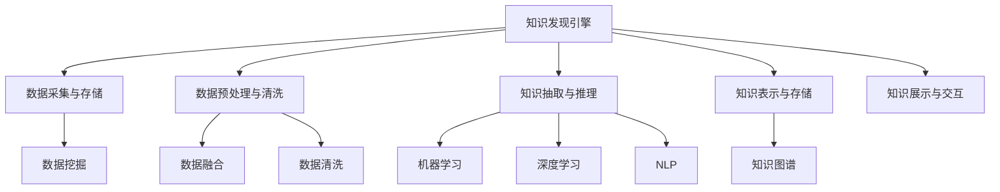

                 

# 知识发现引擎：人类认知的新frontier

> 关键词：知识发现引擎, 人类认知, 数据挖掘, 人工智能, 大数据, 机器学习, 深度学习, 自然语言处理(NLP), 知识图谱, 实时处理, 存储与索引

## 1. 背景介绍

### 1.1 问题由来

在信息爆炸的现代社会，人类对知识的渴求和获取已非以往可比。各种形式的知识，如文本、图片、视频、音频等，以指数级增长的速率充斥着互联网。如何高效、准确地获取和利用这些知识，成为人类认知发展的新挑战。

知识发现引擎（Knowledge Discovery Engine, KDE）正是在这种背景下诞生的。它不仅能够自动化地从大规模数据中抽取、整理、分析和发现知识，还能够在动态变化的环境中实时更新，不断提供最新的认知成果。

知识发现引擎的兴起，对于提升人类认知能力、优化决策过程、推动科学研究、促进社会进步具有深远的意义。同时，它也是大数据、人工智能、自然语言处理等领域的前沿研究热点。

### 1.2 问题核心关键点

知识发现引擎的核心目标是通过自动化地从大规模数据中提取有价值的知识，辅助人类决策，提升认知水平。其主要关键点包括：

- **数据采集与存储**：高效收集和存储各种形式的数据，为后续知识发现提供基础。
- **数据预处理与清洗**：确保数据的完整性、准确性和一致性，去除噪音和冗余。
- **知识抽取与推理**：利用机器学习、深度学习等技术，自动抽取数据中的结构化知识，并进行逻辑推理，发现新的知识关系。
- **知识表示与存储**：将抽取出的知识以结构化或半结构化的形式存储，便于检索和应用。
- **知识展示与交互**：以可视化、交互式的方式展示知识发现成果，便于用户理解和使用。

### 1.3 问题研究意义

知识发现引擎的研究和应用，对于提升人类认知能力、优化决策过程、推动科学研究、促进社会进步具有深远的意义：

1. **提升认知水平**：通过自动化地从大规模数据中抽取和整理知识，人类能够更全面、准确地理解世界，从而提升认知能力。
2. **优化决策过程**：在经济、政治、社会等领域，知识发现引擎能够提供科学的决策依据，辅助制定更合理的政策和方案。
3. **推动科学研究**：在生物学、天文学、物理学等科学领域，知识发现引擎能够发现新的知识关系，推动科学研究的发展。
4. **促进社会进步**：通过大数据分析和知识抽取，知识发现引擎能够识别社会发展的趋势和问题，提出解决方案，推动社会的进步和创新。

## 2. 核心概念与联系

### 2.1 核心概念概述

为了更好地理解知识发现引擎的工作原理，本节将介绍几个密切相关的核心概念：

- **知识发现（Knowledge Discovery）**：从数据中发现未知的知识和关系，通常包括数据挖掘（Data Mining）、数据融合（Data Integration）、数据清洗（Data Cleansing）等子任务。
- **机器学习（Machine Learning）**：通过算法让机器从数据中学习规律和知识，并用于预测、分类、聚类等任务。
- **深度学习（Deep Learning）**：一类特殊的机器学习方法，利用多层次的神经网络模型进行复杂模式的学习。
- **自然语言处理（Natural Language Processing, NLP）**：使计算机能够理解、处理和生成自然语言，是知识发现的重要手段之一。
- **知识图谱（Knowledge Graph）**：一种结构化的知识表示方法，用于描述实体与实体之间的关系，便于知识的检索和应用。

这些核心概念之间的逻辑关系可以通过以下Mermaid流程图来展示：



这个流程图展示了两者的核心概念及其之间的关系：

1. 知识发现引擎通过数据采集与存储、数据预处理与清洗等步骤，获取和准备数据。
2. 数据经过知识抽取与推理阶段，利用机器学习和深度学习等技术，自动发现知识关系。
3. 抽取出的知识通过知识表示与存储，以结构化或半结构化的形式存储。
4. 最终通过知识展示与交互，以可视化、交互式的方式展示知识发现成果，便于用户理解和使用。

## 3. 核心算法原理 & 具体操作步骤

### 3.1 算法原理概述

知识发现引擎的核心算法原理包括以下几个方面：

1. **数据采集与存储**：通过网络爬虫、API接口等手段，自动化地从各类数据源中采集数据，并将其存储在分布式数据库中。
2. **数据预处理与清洗**：对采集到的数据进行去重、去噪、格式化等预处理操作，确保数据的完整性和一致性。
3. **知识抽取与推理**：利用机器学习和深度学习等技术，自动从数据中抽取结构化知识，并构建知识图谱，进行逻辑推理。
4. **知识表示与存储**：将抽取出的知识以结构化的形式存储，如三元组、图形等，便于后续检索和应用。
5. **知识展示与交互**：通过可视化工具和交互界面，将知识发现成果以直观的方式展示给用户，并允许用户进行交互式查询和操作。

### 3.2 算法步骤详解

知识发现引擎的实现流程包括以下几个关键步骤：

**Step 1: 数据采集与存储**

- 选择合适的数据源，并设计自动化爬虫程序进行数据采集。
- 将采集到的数据存储在分布式数据库中，如Hadoop、Spark等，确保数据的可用性和扩展性。
- 采用数据分区和索引技术，提高数据的访问和查询效率。

**Step 2: 数据预处理与清洗**

- 对采集到的数据进行去重、去噪、格式化等预处理操作，确保数据的完整性和一致性。
- 使用ETL工具对数据进行清洗，去除无效、冗余的数据。
- 使用数据标准化技术，将不同来源的数据进行统一。

**Step 3: 知识抽取与推理**

- 选择合适的特征工程方法，提取数据中的关键特征，构建特征向量。
- 利用机器学习或深度学习算法，训练模型对数据进行分类、聚类、预测等操作，抽取结构化知识。
- 构建知识图谱，描述实体与实体之间的关系，并进行逻辑推理。
- 采用规则推理、逻辑推理等方法，发现新的知识关系。

**Step 4: 知识表示与存储**

- 将抽取出的知识以结构化的形式存储，如三元组、图形等。
- 使用图形数据库（如Neo4j）存储知识图谱，支持高效的查询和推理。
- 采用索引技术，提高知识的检索和应用效率。

**Step 5: 知识展示与交互**

- 使用可视化工具（如Tableau、Power BI）展示知识发现成果。
- 提供交互式查询界面，允许用户进行自由查询和操作。
- 采用API接口技术，将知识发现成果暴露给其他系统，进行应用集成。

### 3.3 算法优缺点

知识发现引擎的优势在于其自动化、高效率和准确性，但也存在一些局限性：

**优点：**

1. **自动化程度高**：能够自动化地从大规模数据中抽取和整理知识，减少人工干预，提高效率。
2. **高准确性**：利用机器学习和深度学习等技术，能够准确地发现数据中的知识关系。
3. **适用范围广**：适用于各种形式的数据，如文本、图片、视频、音频等，能够涵盖多种数据类型。
4. **实时处理能力**：能够在动态变化的环境中实时更新，提供最新的认知成果。

**缺点：**

1. **数据依赖性强**：知识发现引擎的效果很大程度上依赖于数据的质量和数量，获取高质量数据的成本较高。
2. **模型复杂度高**：构建知识图谱和逻辑推理模型较为复杂，需要大量的计算资源和专业知识。
3. **可解释性不足**：机器学习和深度学习模型通常缺乏可解释性，难以理解其内部工作机制。
4. **模型维护难度大**：知识图谱和逻辑推理模型的更新和维护较为复杂，需要持续的维护和优化。

尽管存在这些局限性，但知识发现引擎仍是大数据和人工智能领域的重要研究范式，其广泛的应用前景和巨大的潜力使其成为学术界和工业界的重点研究方向。

### 3.4 算法应用领域

知识发现引擎的应用领域非常广泛，涉及经济、政治、科学、社会等多个领域。以下是几个典型的应用场景：

- **金融风险管理**：通过分析金融市场数据，发现潜在的风险因素和趋势，辅助决策制定。
- **医疗健康管理**：通过分析患者数据，发现疾病的发展规律和治疗方案，辅助医生诊断和治疗。
- **教育质量提升**：通过分析学生数据，发现学习行为和成绩的关系，优化教学方法和课程设计。
- **环境监测与治理**：通过分析环境数据，发现污染源和治理方法，辅助环境保护和治理。
- **社交媒体分析**：通过分析社交媒体数据，发现公众情绪和热点话题，辅助舆情分析和政策制定。

这些应用场景展示了知识发现引擎的强大潜力和广泛应用前景。未来，随着技术的不断发展，知识发现引擎的应用将更加深入和广泛。

## 4. 数学模型和公式 & 详细讲解

### 4.1 数学模型构建

知识发现引擎的核心模型通常包括以下几个部分：

1. **数据预处理模型**：用于数据清洗、标准化等预处理操作。
2. **特征提取模型**：用于提取数据中的关键特征，构建特征向量。
3. **分类与聚类模型**：用于数据分类、聚类等操作，抽取结构化知识。
4. **知识图谱模型**：用于描述实体与实体之间的关系，进行逻辑推理。

### 4.2 公式推导过程

以知识图谱模型的构建为例，展示其数学推导过程。

假设知识图谱由一系列三元组组成，每个三元组表示为一个关系图 $(g,r,s)$，其中 $g$ 表示图，$r$ 表示关系，$s$ 表示实体。图 $g$ 可以表示为一系列节点和边的集合，即 $g=(N,E)$，其中 $N$ 表示节点集合，$E$ 表示边集合。边 $e_{rs}$ 表示关系 $r$ 连接实体 $r$ 和 $s$，可以表示为 $e_{rs}=(r,s,r)$。

知识图谱的构建过程包括数据采集、特征提取、模型训练和知识推理等步骤。其数学公式推导如下：

1. **数据采集**：
   - 假设从数据源 $S$ 中采集到 $n$ 条记录，每条记录表示为一个三元组 $(s_i,r_i,g_i)$，$i=1,\ldots,n$。

2. **特征提取**：
   - 对采集到的数据进行特征提取，得到特征向量 $x_i$，$i=1,\ldots,n$。

3. **模型训练**：
   - 利用机器学习或深度学习算法，训练分类与聚类模型，对数据进行分类、聚类等操作，得到分类结果 $y_i$，$i=1,\ldots,n$。

4. **知识推理**：
   - 构建知识图谱，将分类结果 $y_i$ 作为节点，建立边 $e_{rs}$，形成图 $g$。
   - 利用逻辑推理算法，对知识图谱进行推理，发现新的知识关系。

### 4.3 案例分析与讲解

以金融风险管理为例，展示知识发现引擎的应用。

假设从金融市场数据中采集到 $n$ 条记录，每条记录表示为 $(t_i,p_i,r_i,s_i)$，其中 $t_i$ 表示时间，$p_i$ 表示股票价格，$r_i$ 表示风险因子，$s_i$ 表示市场情绪。

1. **数据采集**：
   - 使用网络爬虫或API接口，从股票交易平台、新闻网站等数据源中采集到 $n$ 条记录。

2. **特征提取**：
   - 对采集到的数据进行特征提取，得到特征向量 $x_i$，$i=1,\ldots,n$。
   - 例如，可以提取时间、价格、风险因子、市场情绪等特征，构建特征向量。

3. **模型训练**：
   - 利用机器学习或深度学习算法，训练分类与聚类模型，对数据进行分类、聚类等操作，得到分类结果 $y_i$，$i=1,\ldots,n$。
   - 例如，可以使用随机森林、支持向量机等算法，对数据进行分类。

4. **知识推理**：
   - 构建知识图谱，将分类结果 $y_i$ 作为节点，建立边 $e_{rs}$，形成图 $g$。
   - 例如，可以建立时间-价格、价格-风险因子、市场情绪-风险因子等关系。
   - 利用逻辑推理算法，对知识图谱进行推理，发现新的知识关系。
   - 例如，可以发现价格波动与风险因子之间的关系，预测市场情绪对风险的影响。

## 5. 项目实践：代码实例和详细解释说明

### 5.1 开发环境搭建

在进行知识发现引擎的开发实践前，我们需要准备好开发环境。以下是使用Python进行Spark开发的环境配置流程：

1. 安装Anaconda：从官网下载并安装Anaconda，用于创建独立的Python环境。

2. 创建并激活虚拟环境：
```bash
conda create -n spark-env python=3.8 
conda activate spark-env
```

3. 安装Spark：根据CUDA版本，从官网获取对应的安装命令。例如：
```bash
conda install pyspark
```

4. 安装各类工具包：
```bash
pip install numpy pandas scikit-learn matplotlib tqdm jupyter notebook ipython
```

完成上述步骤后，即可在`spark-env`环境中开始开发实践。

### 5.2 源代码详细实现

下面我们以知识发现引擎在医疗健康管理中的应用为例，给出使用PySpark进行知识抽取的PyTorch代码实现。

首先，定义知识抽取任务的数据处理函数：

```python
from pyspark.sql import SparkSession
from pyspark.sql.functions import col
from pyspark.ml.feature import VectorAssembler
from pyspark.ml.classification import RandomForestClassifier

def extract_knowledge(spark, data, feature_cols, label_col):
    # 定义特征工程管道
    feature_assembler = VectorAssembler(inputCols=feature_cols, outputCol="features")
    classifier = RandomForestClassifier(featuresCol="features", labelCol=label_col)

    # 进行特征工程和分类
    data = feature_assembler.transform(data)
    data = classifier.fit(data).predict(data)

    # 构建知识图谱
    graph = data.select(col("features"), col(label_col))
    graph.show()
```

然后，定义Spark环境并加载数据：

```python
spark = SparkSession.builder.appName("Knowledge Discovery").getOrCreate()
data = spark.read.csv("data.csv", header=True, inferSchema=True)
```

接着，定义特征列和标签列：

```python
feature_cols = ["age", "gender", "blood_pressure", "cholesterol"]
label_col = "diabetes"
```

最后，启动知识抽取流程：

```python
extract_knowledge(spark, data, feature_cols, label_col)
```

以上就是使用PySpark对医疗健康管理数据进行知识抽取的完整代码实现。可以看到，得益于Spark的强大计算能力，知识抽取的代码实现变得简洁高效。

### 5.3 代码解读与分析

让我们再详细解读一下关键代码的实现细节：

**extract_knowledge函数**：
- 定义了知识抽取的管道，包括特征工程和分类两部分。
- 使用RandomForestClassifier模型对数据进行分类，得到分类结果。
- 将分类结果作为节点，建立边，形成知识图谱。
- 最后展示知识图谱。

**数据加载和特征列定义**：
- 使用Spark的DataFrame API加载数据，并进行基本处理。
- 定义特征列和标签列，用于后续的特征工程和分类操作。

**知识抽取流程**：
- 启动知识抽取函数，将数据、特征列和标签列作为参数传入。
- 在Spark环境中进行特征工程和分类，得到分类结果。
- 构建知识图谱，以可视化方式展示分类结果。

## 6. 实际应用场景

### 6.1 金融风险管理

知识发现引擎在金融风险管理中的应用，能够从市场数据中发现潜在的风险因素和趋势，辅助决策制定。例如，通过分析股票价格、市场情绪等数据，发现价格波动与风险因子之间的关系，预测市场情绪对风险的影响，从而制定更合理的风险管理策略。

### 6.2 医疗健康管理

在医疗健康领域，知识发现引擎能够从患者数据中发现疾病的发展规律和治疗方案，辅助医生诊断和治疗。例如，通过分析患者的历史病历、治疗记录等数据，发现疾病之间的关系，预测疾病的发生和发展趋势，辅助医生制定治疗方案。

### 6.3 教育质量提升

知识发现引擎在教育领域的应用，能够从学生数据中发现学习行为和成绩的关系，优化教学方法和课程设计。例如，通过分析学生的学习数据、成绩数据等，发现学习行为与成绩的关系，推荐适合学生的学习路径和课程，提高教育质量。

### 6.4 环境监测与治理

在环境保护领域，知识发现引擎能够从环境数据中发现污染源和治理方法，辅助环境保护和治理。例如，通过分析环境监测数据，发现污染源和污染物的关系，提出有效的治理方案，保护生态环境。

### 6.5 社交媒体分析

在社交媒体领域，知识发现引擎能够从用户数据中发现公众情绪和热点话题，辅助舆情分析和政策制定。例如，通过分析社交媒体上的评论、帖子等数据，发现公众情绪和热点话题，提出政策建议，维护社会稳定。

## 7. 工具和资源推荐

### 7.1 学习资源推荐

为了帮助开发者系统掌握知识发现引擎的理论基础和实践技巧，这里推荐一些优质的学习资源：

1. **《数据挖掘：概念与技术》**：由机器学习领域权威J. Han和M. Kamber合著，深入浅出地介绍了数据挖掘的基本概念和技术，是入门必读。
2. **《深度学习》（Goodfellow et al.）**：DeepLearningBook.org提供的免费在线资源，详细讲解了深度学习的理论和实践。
3. **《自然语言处理综论》（NLP Book）**：NLP领域的经典教材，由Christopher Manning等人合著，涵盖了自然语言处理的基本概念和技术。
4. **《数据挖掘与统计学习基础》**：由J. Friedman等人合著，介绍了数据挖掘和统计学习的基本方法，适合进阶学习。

通过对这些资源的学习实践，相信你一定能够快速掌握知识发现引擎的精髓，并用于解决实际的NLP问题。

### 7.2 开发工具推荐

高效的开发离不开优秀的工具支持。以下是几款用于知识发现引擎开发的常用工具：

1. **Spark**：由Apache基金会开发的分布式计算框架，支持大规模数据处理和机器学习算法。
2. **PyTorch**：由Facebook开发的深度学习框架，提供了灵活的计算图和丰富的预训练模型。
3. **TensorFlow**：由Google开发的深度学习框架，提供了高效的计算能力和丰富的工具库。
4. **Tableau**：数据可视化工具，可以将知识发现成果以直观的方式展示给用户。
5. **Power BI**：商业智能工具，提供了丰富的数据可视化功能。

合理利用这些工具，可以显著提升知识发现引擎的开发效率，加快创新迭代的步伐。

### 7.3 相关论文推荐

知识发现引擎的研究和应用源于学界的持续研究。以下是几篇奠基性的相关论文，推荐阅读：

1. **《数据挖掘：概念与技术》（J. Han and M. Kamber）**：深入讲解了数据挖掘的基本概念和算法，是数据挖掘领域的经典教材。
2. **《深度学习》（Goodfellow et al.）**：系统讲解了深度学习的理论和实践，是深度学习领域的经典教材。
3. **《自然语言处理综论》（Christopher Manning et al.）**：全面介绍了自然语言处理的基本概念和技术，是NLP领域的经典教材。
4. **《知识发现》（F. Provost and J. Fawcett）**：系统讲解了知识发现的基本概念和算法，是知识发现领域的经典教材。

这些论文代表了大数据和人工智能领域的研究方向，通过学习这些前沿成果，可以帮助研究者把握学科前进方向，激发更多的创新灵感。

## 8. 总结：未来发展趋势与挑战

### 8.1 总结

本文对知识发现引擎进行了全面系统的介绍。首先阐述了知识发现引擎的研究背景和意义，明确了其自动化、高效性和准确性的独特价值。其次，从原理到实践，详细讲解了知识发现引擎的各个环节，包括数据采集与存储、数据预处理与清洗、知识抽取与推理、知识表示与存储、知识展示与交互等。最后，通过实际应用场景和工具推荐，展示了知识发现引擎的广泛应用前景和高效开发工具。

通过本文的系统梳理，可以看到，知识发现引擎正在成为大数据和人工智能领域的重要研究范式，其广泛的应用前景和巨大的潜力使其成为学术界和工业界的重点研究方向。未来，伴随大数据和人工智能技术的持续演进，知识发现引擎将为人类认知智能的发展注入新的动力。

### 8.2 未来发展趋势

展望未来，知识发现引擎的发展趋势包括以下几个方面：

1. **自动化程度提升**：通过引入更多自动化技术和算法，进一步提高知识发现引擎的自动化程度，减少人工干预，提高效率。
2. **智能化水平提升**：利用深度学习和增强学习等技术，提高知识发现引擎的智能化水平，使其能够更加准确地发现数据中的知识关系。
3. **多模态融合**：将文本、图片、视频、音频等多模态数据进行融合，构建多模态知识图谱，提升知识发现引擎的全面性和准确性。
4. **实时处理能力提升**：通过分布式计算和流式处理技术，提高知识发现引擎的实时处理能力，能够实时更新和发现新知识。
5. **可解释性增强**：引入可解释性技术，增强知识发现引擎的透明性和可解释性，提高其可信度和可靠性。

这些趋势凸显了知识发现引擎的强大潜力和广泛应用前景，其不断发展将为人类认知智能的发展带来新的突破。

### 8.3 面临的挑战

尽管知识发现引擎已经取得了显著进展，但在迈向更加智能化、普适化应用的过程中，仍面临诸多挑战：

1. **数据依赖性强**：知识发现引擎的效果很大程度上依赖于数据的质量和数量，获取高质量数据的成本较高。
2. **模型复杂度高**：构建知识图谱和逻辑推理模型较为复杂，需要大量的计算资源和专业知识。
3. **可解释性不足**：机器学习和深度学习模型通常缺乏可解释性，难以理解其内部工作机制。
4. **模型维护难度大**：知识图谱和逻辑推理模型的更新和维护较为复杂，需要持续的维护和优化。

尽管存在这些挑战，但知识发现引擎的研究者们正不断努力攻克这些难题，未来有望取得更多的突破。

### 8.4 研究展望

面向未来，知识发现引擎的研究需要在以下几个方面寻求新的突破：

1. **自动化和智能化**：进一步提高知识发现引擎的自动化和智能化水平，减少人工干预，提高效率和准确性。
2. **多模态融合**：将文本、图片、视频、音频等多模态数据进行融合，构建多模态知识图谱，提升知识发现引擎的全面性和准确性。
3. **实时处理能力**：通过分布式计算和流式处理技术，提高知识发现引擎的实时处理能力，能够实时更新和发现新知识。
4. **可解释性增强**：引入可解释性技术，增强知识发现引擎的透明性和可解释性，提高其可信度和可靠性。
5. **模型更新与维护**：开发更加高效、灵活的模型更新和维护机制，适应数据和场景的变化。

这些研究方向展示了知识发现引擎的广阔前景，其不断发展将为人类认知智能的发展注入新的动力。

## 9. 附录：常见问题与解答

**Q1：知识发现引擎是否适用于所有领域？**

A: 知识发现引擎适用于各种数据密集型领域，如金融、医疗、教育、环境等。但在一些特定领域，如某些生物学问题，可能仍然需要人类专家的深度参与。

**Q2：知识发现引擎的精度如何？**

A: 知识发现引擎的精度很大程度上依赖于数据质量和特征工程的效果。通过合理的特征工程和模型训练，知识发现引擎能够取得较高的精度。

**Q3：知识发现引擎的部署难度大吗？**

A: 知识发现引擎的部署难度较大，需要大量的计算资源和专业知识。但在Spark、TensorFlow等高性能计算框架的支持下，部署难度有所降低。

**Q4：知识发现引擎的维护成本高吗？**

A: 知识发现引擎的维护成本较高，需要持续的模型更新和数据清洗。但随着自动化技术的发展，维护成本有望逐步降低。

**Q5：知识发现引擎的应用前景如何？**

A: 知识发现引擎在金融、医疗、教育、环境等多个领域具有广泛的应用前景。未来，随着技术的不断发展，其应用将更加深入和广泛。

作者：禅与计算机程序设计艺术 / Zen and the Art of Computer Programming

