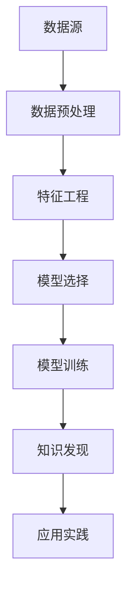

                 

# 知识发现引擎：推动创意产业的创新动力

## 1. 背景介绍

### 1.1 问题由来
在现代社会，知识是一种极其宝贵的资源。如何在海量数据中高效地发现、提取、整合、应用知识，直接关系到企业和组织的发展潜力。尤其是在创意产业中，知识发现和应用更是推动创新的重要驱动力。从文化创意到技术创新，从商业设计到营销策略，知识的深度和广度决定了创意产出的质量与数量。

面对日益增长的信息量，传统的数据处理和分析方法已显得力不从心。机器学习、数据挖掘等新兴技术为知识发现提供了新的思路和方法。特别是基于深度学习的方法，通过神经网络模型对数据进行自动特征提取和模式识别，极大地提升了知识发现的效率和准确性。

然而，尽管深度学习在知识发现领域展现了巨大潜力，但仍存在一些挑战。如模型训练成本高、数据质量要求高、可解释性不足等。如何构建更高效、更灵活的知识发现引擎，成为当前学术和工业界亟需解决的重要问题。

### 1.2 问题核心关键点
知识发现引擎的核心在于如何通过机器学习模型，从结构化和非结构化数据中高效发现、提取和整合知识，并应用于实际决策过程。具体而言，需要关注以下关键点：

- **数据来源**：高质量、多样化的数据源是知识发现的前提。
- **模型选择**：选择合适的深度学习模型或算法，以应对不同类型和规模的数据。
- **特征工程**：将原始数据转化为模型可理解的特征向量，提升模型训练效率。
- **模型训练**：设计有效的模型训练流程，避免过拟合和欠拟合问题。
- **应用实践**：将知识发现的结果转化为可操作的决策和策略，应用于实际业务中。

通过系统理解和解决这些问题，可以构建高效的知识发现引擎，推动创意产业的创新发展。

## 2. 核心概念与联系

### 2.1 核心概念概述

为更好地理解知识发现引擎的工作原理，本节将介绍几个核心概念：

- **知识发现(Knowledge Discovery)**：从数据中提取、学习、发现和表示知识的过程。目标是从数据中提取出有用的模式、规律和知识。
- **深度学习(Deep Learning)**：一种通过多层神经网络学习数据特征表示的技术，通常用于复杂模式识别和决策任务。
- **数据挖掘(Data Mining)**：从大规模数据集中挖掘有用信息和知识的过程。
- **神经网络(Neural Networks)**：一种由多个节点组成的计算模型，通过学习调整连接权重，实现输入到输出的映射。
- **特征工程(Feature Engineering)**：将原始数据转化为模型可理解的特征表示，提升模型的性能。
- **模型训练(Model Training)**：通过数据样本调整模型参数，使模型在测试集上表现最优的过程。
- **应用实践(Application Practice)**：将知识发现的结果应用于实际业务决策和策略制定。

这些核心概念之间的逻辑关系可以通过以下Mermaid流程图来展示：



这个流程图展示了知识发现引擎的核心工作流程：

1. 从数据源获取原始数据。
2. 对数据进行预处理，去除噪声和缺失值，标准化数据格式。
3. 通过特征工程将原始数据转化为模型可理解的特征向量。
4. 选择适合的深度学习模型或算法，进行模型训练。
5. 利用训练好的模型对数据进行特征提取和模式识别，发现有用的知识。
6. 将知识发现的结果应用于实际业务决策和策略制定。

## 3. 核心算法原理 & 具体操作步骤
### 3.1 算法原理概述

知识发现引擎的本质是通过深度学习模型，从数据中高效地提取、学习和应用知识。其核心思想是：将数据源中的原始信息转化为模型可以理解的形式，通过神经网络模型对数据进行自动特征提取和模式识别，从而发现有用的知识。

形式化地，假设原始数据为 $X$，对应的知识表示为 $K$，则知识发现引擎的优化目标为：

$$
\min_{X, K} \mathcal{L}(X, K) \text{ s.t. } f(X) = K
$$

其中，$\mathcal{L}(X, K)$ 为损失函数，衡量原始数据与知识表示之间的差异，$f(X)$ 为模型，将原始数据 $X$ 转化为知识表示 $K$。通过优化损失函数，我们可以发现更准确、更有用的知识表示 $K$。

### 3.2 算法步骤详解

知识发现引擎的构建通常包括以下几个关键步骤：

**Step 1: 数据预处理**
- 清洗数据源，去除重复、噪声和缺失值。
- 数据标准化，使其符合模型输入要求。
- 数据增强，通过变换、合成等方法增加数据多样性，提升模型泛化能力。

**Step 2: 特征工程**
- 数据降维，减少维度灾难，提高模型效率。
- 特征选择，根据领域知识和经验选择重要特征，提升模型准确性。
- 特征变换，将原始数据转化为更适合模型的表示形式，如PCA、LDA、Word2Vec等。

**Step 3: 模型选择**
- 选择适合的深度学习模型，如卷积神经网络、循环神经网络、Transformer等。
- 设计适当的模型架构，如多层感知器、注意力机制、门控循环单元等。
- 确定模型超参数，如层数、节点数、学习率等。

**Step 4: 模型训练**
- 利用数据集进行模型训练，最小化损失函数。
- 采用梯度下降等优化算法更新模型参数。
- 验证模型性能，防止过拟合和欠拟合。

**Step 5: 知识发现**
- 将训练好的模型应用于新数据集，提取有用的知识表示。
- 利用领域知识进行解释和验证，确保知识发现结果的准确性和实用性。

**Step 6: 应用实践**
- 将知识发现的结果转化为实际业务决策和策略，如推荐系统、情感分析、预测模型等。
- 持续收集反馈，优化知识发现引擎，提升其性能和适应性。

### 3.3 算法优缺点

知识发现引擎在知识提取和应用中具有以下优点：

- 高效性：深度学习模型能够自动从大量数据中提取复杂模式，无需人工干预。
- 灵活性：通过特征工程和模型选择，可以适应多种数据类型和应用场景。
- 可解释性：部分模型（如规则学习）具有较好的可解释性，便于业务理解和应用。
- 应用广泛：适用于各种创意产业，如文化创意、技术创新、商业设计、营销策略等。

同时，该方法也存在一些局限性：

- 数据质量要求高：模型性能高度依赖数据质量，数据缺失、噪声等问题会影响结果。
- 模型复杂度高：深度学习模型参数量大，训练和推理耗时较长。
- 可解释性不足：复杂模型（如深度神经网络）缺乏可解释性，难以理解其内部工作机制。
- 成本高：高质量数据和计算资源的投入是必要的，对中小企业可能不友好。

尽管存在这些局限性，但就目前而言，知识发现引擎仍然是大规模数据驱动的创意产业中，最有效和可行的解决方案之一。未来相关研究的重点在于如何进一步降低成本、提升效率、增强可解释性等。

### 3.4 算法应用领域

知识发现引擎在创意产业中的应用非常广泛，涉及文化创意、技术创新、商业设计、营销策略等多个领域。以下是一些典型应用：

- **文化创意**：通过分析文学、艺术作品的风格、情感和主题，发现创作灵感和趋势。
- **技术创新**：利用技术论文、专利等数据，提取前沿技术和创新点，指导研发方向。
- **商业设计**：通过分析市场数据，识别消费趋势和偏好，辅助产品设计和市场策略。
- **营销策略**：通过分析社交媒体和市场数据，发现潜在客户和营销热点，优化广告投放。

除了这些经典应用外，知识发现引擎还被创新性地应用于更多场景中，如创意生成、智能客服、智能推荐等，为创意产业带来了新的突破。

## 4. 数学模型和公式 & 详细讲解 & 举例说明
### 4.1 数学模型构建

本节将使用数学语言对知识发现引擎的工作原理进行更加严格的刻画。

假设原始数据为 $X=\{x_1, x_2, ..., x_N\}$，对应的知识表示为 $K=\{k_1, k_2, ..., k_M\}$。定义知识发现引擎的损失函数为：

$$
\mathcal{L}(X, K) = \sum_{i=1}^N \sum_{j=1}^M l(x_i, k_j)
$$

其中 $l(x_i, k_j)$ 为损失函数，衡量数据样本 $x_i$ 和知识表示 $k_j$ 之间的差异。常见的损失函数包括均方误差、交叉熵、KL散度等。

知识发现引擎的优化目标为：

$$
\min_{X, K} \mathcal{L}(X, K) \text{ s.t. } f(X) = K
$$

在实践中，我们通常使用基于梯度的优化算法（如SGD、Adam等）来近似求解上述最优化问题。设 $\eta$ 为学习率，$\lambda$ 为正则化系数，则参数的更新公式为：

$$
\theta \leftarrow \theta - \eta \nabla_{\theta}\mathcal{L}(\theta) - \eta\lambda\theta
$$

其中 $\nabla_{\theta}\mathcal{L}(\theta)$ 为损失函数对参数 $\theta$ 的梯度，可通过反向传播算法高效计算。

### 4.2 公式推导过程

以下我们以文本情感分析任务为例，推导知识发现引擎的数学模型。

假设数据集 $D=\{(x_i, y_i)\}_{i=1}^N$，其中 $x_i$ 为输入文本，$y_i$ 为情感标签（如正面、负面、中性）。定义知识发现引擎的损失函数为交叉熵损失：

$$
l(x_i, k_j) = -[y_i\log \hat{y}_i + (1-y_i)\log (1-\hat{y}_i)]
$$

其中 $\hat{y}_i$ 为模型预测的情感概率。

将交叉熵损失代入总体损失函数，得：

$$
\mathcal{L}(X, K) = -\frac{1}{N}\sum_{i=1}^N \sum_{j=1}^M [y_i\log \hat{y}_i + (1-y_i)\log (1-\hat{y}_i)]
$$

知识发现引擎的优化目标为：

$$
\min_{X, K} \mathcal{L}(X, K) \text{ s.t. } f(X) = K
$$

在实践中，我们通常使用基于梯度的优化算法（如SGD、Adam等）来近似求解上述最优化问题。设 $\eta$ 为学习率，$\lambda$ 为正则化系数，则参数的更新公式为：

$$
\theta \leftarrow \theta - \eta \nabla_{\theta}\mathcal{L}(\theta) - \eta\lambda\theta
$$

其中 $\nabla_{\theta}\mathcal{L}(\theta)$ 为损失函数对参数 $\theta$ 的梯度，可通过反向传播算法高效计算。

## 5. 项目实践：代码实例和详细解释说明
### 5.1 开发环境搭建

在进行知识发现引擎的实践前，我们需要准备好开发环境。以下是使用Python进行TensorFlow开发的环境配置流程：

1. 安装Anaconda：从官网下载并安装Anaconda，用于创建独立的Python环境。

2. 创建并激活虚拟环境：
```bash
conda create -n tf-env python=3.8 
conda activate tf-env
```

3. 安装TensorFlow：根据CUDA版本，从官网获取对应的安装命令。例如：
```bash
conda install tensorflow -c pytorch -c conda-forge
```

4. 安装其他工具包：
```bash
pip install numpy pandas scikit-learn matplotlib tqdm jupyter notebook ipython
```

完成上述步骤后，即可在`tf-env`环境中开始知识发现引擎的实践。

### 5.2 源代码详细实现

下面我们以文本情感分析任务为例，给出使用TensorFlow进行知识发现引擎的Python代码实现。

首先，定义数据集：

```python
import tensorflow as tf
from tensorflow.keras.preprocessing.text import Tokenizer
from tensorflow.keras.preprocessing.sequence import pad_sequences
import numpy as np

# 假定已有情感标签和文本数据
train_texts = ['I love this product', 'This product is terrible', 'I feel happy', 'I am sad']
train_labels = [1, 0, 1, 0]

# 将文本转化为序列，并进行token化
tokenizer = Tokenizer(num_words=1000, oov_token='<OOV>')
tokenizer.fit_on_texts(train_texts)
word_index = tokenizer.word_index
sequences = tokenizer.texts_to_sequences(train_texts)
max_len = max([len(seq) for seq in sequences])
padded_sequences = pad_sequences(sequences, maxlen=max_len, padding='post', truncating='post')

# 创建训练集
X_train = padded_sequences
y_train = np.array(train_labels)
```

然后，定义模型：

```python
from tensorflow.keras.layers import Embedding, LSTM, Dense, Dropout
from tensorflow.keras.models import Sequential

# 定义模型
model = Sequential([
    Embedding(input_dim=len(word_index)+1, output_dim=100, input_length=max_len),
    LSTM(128, dropout=0.2, recurrent_dropout=0.2),
    Dense(1, activation='sigmoid')
])

# 编译模型
model.compile(loss='binary_crossentropy', optimizer='adam', metrics=['accuracy'])
```

接着，训练模型：

```python
epochs = 10
batch_size = 32

# 将数据集划分为训练集和测试集
X_test = pad_sequences(sequences, maxlen=max_len, padding='post', truncating='post')
y_test = np.array(test_labels)

# 训练模型
model.fit(X_train, y_train, validation_data=(X_test, y_test), epochs=epochs, batch_size=batch_size)
```

最后，评估模型：

```python
# 评估模型
score, acc = model.evaluate(X_test, y_test, verbose=0)
print(f'Test score: {score:.4f}, Test accuracy: {acc:.4f}')
```

以上就是使用TensorFlow对文本情感分析任务进行知识发现引擎的完整代码实现。可以看到，借助TensorFlow的强大工具，构建和训练知识发现引擎变得非常简单高效。

### 5.3 代码解读与分析

让我们再详细解读一下关键代码的实现细节：

**数据集定义**：
- 使用Keras的Tokenizer将文本数据转化为序列，并进行token化。
- 使用Keras的pad_sequences函数对序列进行定长padding，保证所有样本长度一致。

**模型定义**：
- 定义一个简单的LSTM模型，包括Embedding层、LSTM层和Dense层。
- 使用Keras的Sequential模型将各层堆叠起来。
- 使用Binary Cross-Entropy损失函数和Adam优化器进行模型编译。

**训练模型**：
- 利用训练集数据进行模型训练，设置一定数量的epochs和batch size。
- 在验证集上进行模型验证，防止过拟合。

**评估模型**：
- 在测试集上评估模型性能，打印出准确率和损失值。

可以看到，通过TensorFlow，知识发现引擎的构建和训练变得非常简单和高效。借助TensorFlow的强大工具和API，可以快速实现深度学习模型的训练和评估，为知识发现引擎的实践提供了极大的便利。

当然，知识发现引擎的工程实现还需考虑更多因素，如模型的保存和部署、超参数的自动搜索、更灵活的任务适配层等。但核心的知识发现范式基本与此类似。

## 6. 实际应用场景
### 6.1 智能客服系统

基于知识发现引擎的对话技术，可以广泛应用于智能客服系统的构建。传统客服往往需要配备大量人力，高峰期响应缓慢，且一致性和专业性难以保证。而使用知识发现引擎构建的智能客服系统，可以7x24小时不间断服务，快速响应客户咨询，用自然流畅的语言解答各类常见问题。

在技术实现上，可以收集企业内部的历史客服对话记录，将问题和最佳答复构建成监督数据，在此基础上对知识发现引擎进行训练。训练后的知识发现引擎能够自动理解用户意图，匹配最合适的答案模板进行回复。对于客户提出的新问题，还可以接入检索系统实时搜索相关内容，动态组织生成回答。如此构建的智能客服系统，能大幅提升客户咨询体验和问题解决效率。

### 6.2 金融舆情监测

金融机构需要实时监测市场舆论动向，以便及时应对负面信息传播，规避金融风险。传统的人工监测方式成本高、效率低，难以应对网络时代海量信息爆发的挑战。基于知识发现引擎的文本分类和情感分析技术，为金融舆情监测提供了新的解决方案。

具体而言，可以收集金融领域相关的新闻、报道、评论等文本数据，并对其进行主题标注和情感标注。在此基础上对知识发现引擎进行微调，使其能够自动判断文本属于何种主题，情感倾向是正面、中性还是负面。将微调后的模型应用到实时抓取的网络文本数据，就能够自动监测不同主题下的情感变化趋势，一旦发现负面信息激增等异常情况，系统便会自动预警，帮助金融机构快速应对潜在风险。

### 6.3 个性化推荐系统

当前的推荐系统往往只依赖用户的历史行为数据进行物品推荐，无法深入理解用户的真实兴趣偏好。基于知识发现引擎的个性化推荐系统可以更好地挖掘用户行为背后的语义信息，从而提供更精准、多样的推荐内容。

在实践中，可以收集用户浏览、点击、评论、分享等行为数据，提取和用户交互的物品标题、描述、标签等文本内容。将文本内容作为模型输入，用户的后续行为（如是否点击、购买等）作为监督信号，在此基础上对知识发现引擎进行训练。训练后的知识发现引擎能够从文本内容中准确把握用户的兴趣点。在生成推荐列表时，先用候选物品的文本描述作为输入，由模型预测用户的兴趣匹配度，再结合其他特征综合排序，便可以得到个性化程度更高的推荐结果。

### 6.4 未来应用展望

随着知识发现引擎的发展，其在创意产业中的应用将进一步拓展，为传统行业带来更大的变革。

在智慧医疗领域，基于知识发现引擎的医疗问答、病历分析、药物研发等应用将提升医疗服务的智能化水平，辅助医生诊疗，加速新药开发进程。

在智能教育领域，知识发现引擎可应用于作业批改、学情分析、知识推荐等方面，因材施教，促进教育公平，提高教学质量。

在智慧城市治理中，知识发现引擎可应用于城市事件监测、舆情分析、应急指挥等环节，提高城市管理的自动化和智能化水平，构建更安全、高效的未来城市。

此外，在企业生产、社会治理、文娱传媒等众多领域，知识发现引擎也将不断涌现，为NLP技术带来新的突破。相信随着预训练语言模型和微调方法的不断进步，知识发现引擎必将在构建人机协同的智能时代中扮演越来越重要的角色。

## 7. 工具和资源推荐
### 7.1 学习资源推荐

为了帮助开发者系统掌握知识发现引擎的理论基础和实践技巧，这里推荐一些优质的学习资源：

1. 《深度学习》系列博文：由大模型技术专家撰写，深入浅出地介绍了深度学习的基本原理和常用技术。

2. CS231n《深度学习视觉识别》课程：斯坦福大学开设的深度学习视觉识别课程，涵盖图像识别、分类等技术，有助于理解知识发现引擎在视觉领域的应用。

3. 《深度学习入门》书籍：入门级书籍，系统介绍了深度学习的基本概念和常用模型，适合初学者。

4. TensorFlow官方文档：TensorFlow的官方文档，提供了详尽的API和示例代码，适合快速上手TensorFlow的开发。

5. Kaggle平台：数据科学竞赛平台，提供海量数据集和代码库，有助于实践知识发现引擎的各种应用。

通过对这些资源的学习实践，相信你一定能够快速掌握知识发现引擎的核心思想和实践方法，并将其应用于实际业务中。

### 7.2 开发工具推荐

高效的开发离不开优秀的工具支持。以下是几款用于知识发现引擎开发的常用工具：

1. TensorFlow：由Google主导开发的开源深度学习框架，生产部署方便，适合大规模工程应用。

2. PyTorch：基于Python的开源深度学习框架，灵活性高，适合快速迭代研究。

3. Keras：Keras API提供简单易用的接口，适合快速搭建和调试深度学习模型。

4. Jupyter Notebook：交互式编程环境，支持代码、文档和结果的混合展示，方便调试和记录实验。

5. Google Colab：谷歌推出的在线Jupyter Notebook环境，免费提供GPU/TPU算力，适合快速实验和分享学习笔记。

合理利用这些工具，可以显著提升知识发现引擎的开发效率，加快创新迭代的步伐。

### 7.3 相关论文推荐

知识发现引擎的研究源于学界的持续研究。以下是几篇奠基性的相关论文，推荐阅读：

1. 《深度学习》：Yann LeCun等著，系统介绍了深度学习的基本原理和常用技术。

2. 《ImageNet分类和视觉特征学习》：Alex Krizhevsky等著，展示了深度学习在图像分类和特征提取中的应用。

3. 《A Neural Probabilistic Logic Net》：Geoffrey Hinton等著，展示了神经网络在逻辑推理中的应用。

4. 《Deep Learning for NLP》：Yoshua Bengio等著，系统介绍了深度学习在NLP中的应用。

5. 《Google的机器学习实践》：谷歌官方书籍，提供了大量实用的深度学习案例和代码示例。

这些论文代表了大模型微调技术的发展脉络。通过学习这些前沿成果，可以帮助研究者把握学科前进方向，激发更多的创新灵感。

## 8. 总结：未来发展趋势与挑战

### 8.1 总结

本文对知识发现引擎进行了全面系统的介绍。首先阐述了知识发现引擎的研究背景和意义，明确了其在创意产业中的重要地位。其次，从原理到实践，详细讲解了知识发现引擎的数学模型和实现流程，给出了知识发现引擎的完整代码实例。同时，本文还广泛探讨了知识发现引擎在智能客服、金融舆情、个性化推荐等多个行业领域的应用前景，展示了其在创意产业中的巨大潜力。此外，本文精选了知识发现引擎的学习资源，力求为读者提供全方位的技术指引。

通过本文的系统梳理，可以看到，知识发现引擎在创意产业中发挥着越来越重要的作用，极大地推动了创意产业的创新发展。未来，伴随深度学习技术的不断进步，知识发现引擎将进一步拓展其应用边界，为创意产业带来更多的变革和突破。

### 8.2 未来发展趋势

展望未来，知识发现引擎的发展将呈现以下几个趋势：

1. 模型规模持续增大。随着算力成本的下降和数据规模的扩张，深度学习模型的参数量还将持续增长。超大规模模型蕴含的丰富知识，有望支撑更加复杂多变的应用场景。

2. 知识发现范式多样化。除了传统的监督学习外，未来的知识发现将更加注重无监督学习和半监督学习，提高数据利用率和模型泛化能力。

3. 知识表示多样化。未来的知识发现将不仅关注文本数据，还将拓展到图像、视频、语音等多模态数据。多模态数据的融合，将显著提升知识发现的全面性和准确性。

4. 计算框架优化。未来的知识发现引擎将更加注重计算框架的优化，如模型的压缩、剪枝、量化等，提高计算效率和推理速度。

5. 应用场景细化。知识发现引擎将在更多垂直行业得到应用，如医疗、教育、金融等，为行业数字化转型提供新的技术路径。

6. 模型解释性增强。未来的知识发现模型将更加注重可解释性，通过引入因果分析和对比学习等技术，增强模型的可解释性和可信度。

以上趋势凸显了知识发现引擎的广阔前景。这些方向的探索发展，必将进一步提升知识发现引擎的性能和应用范围，为创意产业带来更大的变革和突破。

### 8.3 面临的挑战

尽管知识发现引擎已经取得了显著成就，但在迈向更加智能化、普适化应用的过程中，仍面临诸多挑战：

1. 数据质量和多样性：高质量、多样化的数据源是知识发现的前提。如何获取和处理不同领域、不同规模的数据，仍是重要挑战。

2. 模型复杂度：深度学习模型参数量大，训练和推理耗时较长。如何优化模型结构，提高计算效率，仍需持续研究。

3. 模型可解释性：复杂模型缺乏可解释性，难以理解其内部工作机制和决策逻辑。如何增强模型的可解释性，仍需进一步探索。

4. 计算资源限制：高质量数据和计算资源的投入是必要的，对中小企业可能不友好。如何降低计算成本，提高算力利用率，仍需持续优化。

5. 业务应用适配：如何将知识发现引擎的输出转化为实际的业务决策和策略，仍需深入研究和实践。

6. 隐私和安全：知识发现引擎在处理敏感数据时，如何保护隐私和数据安全，仍需进一步加强。

这些挑战凸显了知识发现引擎在实际应用中的复杂性和多样性，需要从技术、业务、伦理等多个维度进行深入研究和探索。

### 8.4 研究展望

面对知识发现引擎所面临的种种挑战，未来的研究需要在以下几个方面寻求新的突破：

1. 探索无监督和半监督知识发现方法。摆脱对大规模标注数据的依赖，利用自监督学习、主动学习等无监督和半监督范式，最大限度利用非结构化数据，实现更加灵活高效的知识发现。

2. 开发更加参数高效和计算高效的模型。开发更加参数高效的模型，在固定大部分预训练参数的同时，只更新极少量的任务相关参数。同时优化计算图，减少前向传播和反向传播的资源消耗，实现更加轻量级、实时性的部署。

3. 引入更多先验知识。将符号化的先验知识，如知识图谱、逻辑规则等，与神经网络模型进行巧妙融合，引导知识发现过程学习更准确、合理的知识表示。

4. 引入因果分析和博弈论工具。将因果分析方法引入知识发现模型，识别出模型决策的关键特征，增强输出解释的因果性和逻辑性。借助博弈论工具刻画人机交互过程，主动探索并规避模型的脆弱点，提高系统稳定性。

5. 纳入伦理道德约束。在模型训练目标中引入伦理导向的评估指标，过滤和惩罚有害的输出倾向。同时加强人工干预和审核，建立模型行为的监管机制，确保输出符合人类价值观和伦理道德。

这些研究方向的探索，必将引领知识发现引擎技术迈向更高的台阶，为构建安全、可靠、可解释、可控的智能系统铺平道路。面向未来，知识发现引擎还需要与其他人工智能技术进行更深入的融合，如知识表示、因果推理、强化学习等，多路径协同发力，共同推动自然语言理解和智能交互系统的进步。只有勇于创新、敢于突破，才能不断拓展知识发现引擎的边界，让智能技术更好地造福人类社会。

## 9. 附录：常见问题与解答

**Q1：知识发现引擎是否适用于所有创意产业？**

A: 知识发现引擎在大多数创意产业中都能取得不错的效果，特别是对于数据量较大的领域。但对于一些特定领域的创意产业，如手工艺、艺术创作等，模型性能可能受限于数据规模和特征提取的复杂度。因此，需要根据具体行业特点，设计适合的特征工程和模型结构。

**Q2：如何选择合适的知识发现模型？**

A: 知识发现模型的选择应根据具体应用场景和数据类型进行。对于文本数据，通常选择LSTM、GRU、Transformer等基于序列的模型；对于图像数据，可以选择CNN、ResNet等卷积神经网络；对于多模态数据，可以考虑融合不同模型的组合模型。此外，模型的复杂度和计算资源也应进行综合考虑。

**Q3：知识发现引擎在实际应用中如何处理噪声数据？**

A: 噪声数据是知识发现中的常见问题，通常采取以下策略进行处理：
1. 数据清洗：去除重复、异常、缺失值等数据。
2. 数据增强：通过数据增强技术，如数据扩充、数据合成等，增加数据多样性，提升模型泛化能力。
3. 噪声感知模型：设计噪声感知模型，能够自动学习并适应噪声数据。

**Q4：如何提高知识发现引擎的计算效率？**

A: 提高知识发现引擎的计算效率可以从以下几个方面进行：
1. 模型压缩：使用剪枝、量化等技术，减少模型参数量。
2. 硬件优化：使用GPU、TPU等高效硬件，提升计算速度。
3. 分布式计算：使用分布式计算框架，如TensorFlow、PyTorch等，并行化计算过程。
4. 特征工程：优化特征工程流程，减少特征工程成本。

**Q5：知识发现引擎在实际应用中如何保证数据隐私？**

A: 知识发现引擎在处理敏感数据时，需要采取以下措施保护数据隐私：
1. 数据匿名化：将数据进行匿名化处理，去除敏感信息。
2. 数据加密：使用加密技术，保护数据传输和存储安全。
3. 访问控制：限制数据访问权限，只允许授权人员进行数据处理。
4. 差分隐私：使用差分隐私技术，在保护数据隐私的同时，保留数据的统计特性。

这些措施可以有效保护数据隐私，确保知识发现引擎的合法合规使用。

---

作者：禅与计算机程序设计艺术 / Zen and the Art of Computer Programming

