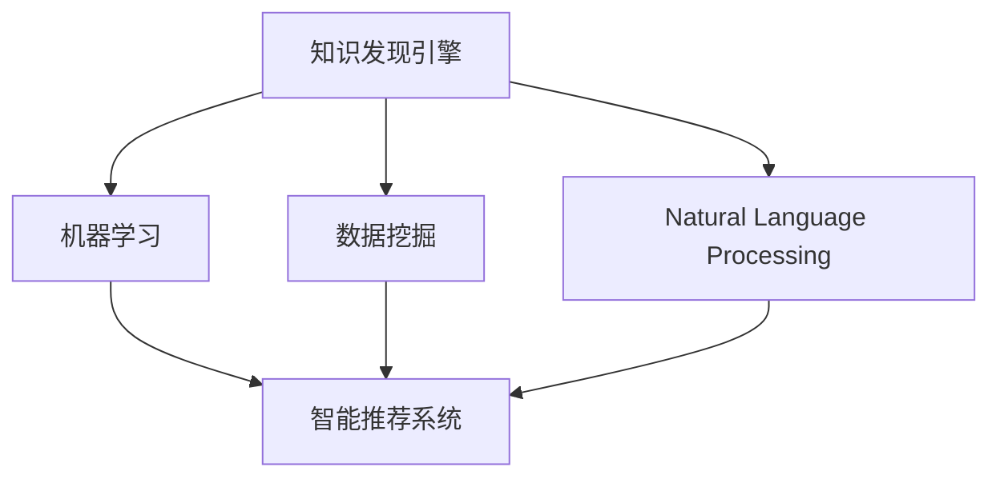

                 

# 知识发现引擎：教育领域的个性化变革

> 关键词：个性化学习, 知识发现引擎, 教育技术, 机器学习, 学生行为分析, 智能推荐系统

## 1. 背景介绍

### 1.1 问题由来
随着教育信息化的不断推进，数字化学习资源和在线教育平台得到了快速普及。在丰富的学习资源和先进的教育技术支持之下，学生学习方式的个性化需求愈发凸显。如何准确了解学生的学习状态和知识掌握情况，以实现更为精准、高效的学习推荐，成为了教育领域的一大挑战。

在这一背景下，知识发现引擎（Knowledge Discovery Engine, KDE）应运而生。KDE通过集成机器学习、自然语言处理、数据挖掘等技术，可以从海量教育数据中挖掘出有意义的知识模式，帮助教育者发现学生学习的规律，从而实现个性化学习资源的推荐和个性化教学路径的构建。

### 1.2 问题核心关键点
知识发现引擎的核心在于其高效的数据分析和智能推荐能力。它能够从学生的学习行为、知识掌握情况、情感反馈等多个维度，综合分析并挖掘出个性化的知识发现模式，进而指导个性化学习资源的推荐。此外，KDE的灵活性使其可以应用于多种教育场景，从在线课程推荐到个性化作业设计，从学习分析到智慧课堂建设，都展现出了强大的应用潜力。

## 2. 核心概念与联系

### 2.1 核心概念概述

为更好地理解知识发现引擎在教育领域的应用，本节将介绍几个密切相关的核心概念：

- 知识发现引擎（Knowledge Discovery Engine, KDE）：通过机器学习、数据挖掘等技术，从海量教育数据中自动发现知识模式，指导个性化学习资源推荐和个性化教学路径构建的系统。

- 个性化学习（Personalized Learning）：根据学生的学习偏好、知识掌握情况等个性化需求，提供定制化的学习资源和教学路径，提升学习效果和体验。

- 机器学习（Machine Learning）：一种利用数据训练模型，自动发现规律和模式的技术，是KDE实现核心功能的核心算法。

- 数据挖掘（Data Mining）：从大规模数据集中提取有用信息的过程，有助于KDE从海量的教育数据中发现知识模式。

- 自然语言处理（Natural Language Processing, NLP）：处理和分析人类语言的技术，用于从学习日志、反馈评论等文本数据中提取信息，指导个性化学习。

- 智能推荐系统（Recommendation System）：根据用户行为和偏好，推荐最适合的学习资源，是KDE的重要组成部分。

- 学生行为分析（Student Behavior Analysis）：通过分析学生的学习行为数据，理解其学习状态和需求，为个性化推荐提供依据。

这些核心概念之间的逻辑关系可以通过以下Mermaid流程图来展示：



这个流程图展示了一些核心概念及其之间的关系：

1. KDE通过机器学习和数据挖掘技术，从教育数据中发现知识模式。
2. KDE利用自然语言处理技术，从学生的反馈和文本数据中提取信息。
3. KDE的智能推荐系统，根据学生的个性化需求，推荐最适合的学习资源。
4. 学生行为分析帮助KDE理解学生的学习状态和需求，进一步提升推荐效果。

这些概念共同构成了KDE在教育领域的应用框架，使其能够从海量的教育数据中挖掘出个性化学习资源，为教育者提供科学决策依据。

## 3. 核心算法原理 & 具体操作步骤
### 3.1 算法原理概述

知识发现引擎的核心算法原理主要包括：

- 数据预处理：清洗、标准化、归一化等预处理操作，确保数据质量。
- 特征工程：提取、选择和构造特征，以便于后续的机器学习模型训练。
- 模型训练：利用机器学习算法，对学生行为数据进行建模，挖掘出知识模式。
- 推荐算法：根据模型预测结果，选择最佳的学习资源进行推荐。
- 评价与反馈：根据推荐效果和学生反馈，调整模型参数和推荐策略，不断优化推荐效果。

以协同过滤（Collaborative Filtering）算法为例，其原理是在用户-物品评分矩阵中找到与当前用户相似的其他用户，从而推荐这些用户喜欢的物品。在教育场景中，可以将其应用于推荐适合当前学生的学习资源。

### 3.2 算法步骤详解

1. **数据收集与预处理**：
   - 收集学生的学习行为数据，如阅读、作业、测试成绩等。
   - 对数据进行清洗和标准化处理，去除噪声和异常值。
   - 对数据进行归一化处理，使得不同维度的数据具有相同的量级。

2. **特征工程**：
   - 提取与学习效果相关的特征，如学习时长、作业完成情况、测试成绩等。
   - 构造适合机器学习模型的特征向量，如向量化的评分矩阵、行为序列等。

3. **模型训练**：
   - 选择合适的机器学习算法，如协同过滤、决策树、随机森林等。
   - 利用历史学习数据，训练模型并得到学生行为与推荐资源之间的关联。

4. **推荐算法实现**：
   - 根据学生行为特征，预测其可能感兴趣的学习资源。
   - 利用推荐算法，从库中选择最适合的资源进行推荐。

5. **评价与反馈**：
   - 根据推荐效果和学生反馈，评估推荐算法的效果。
   - 根据评估结果，调整模型参数和推荐策略，不断优化推荐效果。

### 3.3 算法优缺点

知识发现引擎具有以下优点：

- 高度自适应：能够根据学生的个性化需求，提供定制化的学习资源。
- 数据驱动：通过数据驱动的推荐算法，确保推荐的科学性和准确性。
- 动态调整：能够根据学生的反馈和行为变化，动态调整推荐策略。

同时，也存在一定的局限性：

- 数据隐私：大量学习数据涉及学生隐私，数据收集和使用需要遵守相关法律法规。
- 冷启动问题：新学生或新课程没有足够的历史数据，难以进行推荐。
- 模型复杂性：复杂的模型可能需要较高的计算资源和存储成本。
- 推荐偏见：算法可能会受到数据偏差的影响，推荐结果可能存在偏见。

尽管存在这些局限性，但知识发现引擎在教育领域的个性化推荐方面已经展现出了强大的潜力，未来仍需不断优化和改进。

### 3.4 算法应用领域

知识发现引擎已经在教育领域得到了广泛应用，涵盖了从在线课程推荐到个性化作业设计等多个方面，具体包括：

- 在线课程推荐：根据学生的学习行为和反馈，推荐最适合的在线课程。
- 个性化作业设计：分析学生的知识掌握情况，设计个性化的作业，提升学习效果。
- 学习路径规划：根据学生的学习进度和知识掌握情况，规划个性化学习路径，帮助学生高效学习。
- 学习效果分析：通过分析学生的学习行为和成绩，评估学习效果，提供针对性的改进建议。
- 智慧课堂建设：利用学习分析数据，优化课堂教学，提升教学质量。

除了上述这些典型应用外，知识发现引擎还被创新性地应用到更多场景中，如智能答疑系统、个性化辅导、智能评价系统等，为教育技术的创新发展提供了新的思路。

## 4. 数学模型和公式 & 详细讲解 & 举例说明
### 4.1 数学模型构建

知识发现引擎的数学模型构建通常包括以下几个关键步骤：

- 数据表示：将学生行为数据转化为适合机器学习模型的数值向量。
- 学习模型：建立学生行为与推荐资源之间的数学模型。
- 评估指标：定义推荐效果评估指标，如准确率、召回率、F1值等。

### 4.2 公式推导过程

以协同过滤算法为例，其数学模型构建如下：

1. **评分矩阵**：设学生数为 $m$，物品（学习资源）数为 $n$，每个学生对物品的评分为一个 $m \times n$ 的评分矩阵 $R$。

   $$
   R = \begin{bmatrix}
   r_{1,1} & r_{1,2} & \cdots & r_{1,n} \\
   r_{2,1} & r_{2,2} & \cdots & r_{2,n} \\
   \vdots & \vdots & \ddots & \vdots \\
   r_{m,1} & r_{m,2} & \cdots & r_{m,n}
   \end{bmatrix}
   $$

2. **用户相似度计算**：利用余弦相似度等方法计算用户之间的相似度，得到一个 $m \times m$ 的相似度矩阵 $S$。

   $$
   S = \begin{bmatrix}
   1 & s_{1,2} & \cdots & s_{1,m} \\
   s_{2,1} & 1 & \cdots & s_{2,m} \\
   \vdots & \vdots & \ddots & \vdots \\
   s_{m,1} & s_{m,2} & \cdots & 1
   \end{bmatrix}
   $$

3. **推荐计算**：根据相似度矩阵 $S$，计算每个物品的预测评分，得到一个 $n \times m$ 的预测评分矩阵 $I$。

   $$
   I = S^T R
   $$

4. **推荐资源选择**：选择预测评分最高的前 $k$ 个物品作为推荐结果。

   $$
   推荐结果 = \{物品i | i \in 1..n, \text{且} I_{i,:} \text{中评分最高} \}
   $$

### 4.3 案例分析与讲解

假设我们有一个包含100名学生和1000门课程的数据集，学生对每门课程的评分如下：

| 学生ID | 课程ID | 评分 |
| ------ | ------ | ---- |
| 1      | A      | 4.0  |
| 1      | B      | 3.5  |
| 1      | C      | 4.2  |
| ...    | ...    | ...  |

利用协同过滤算法，我们可以计算出学生1和学生2的相似度为0.8，进而根据学生1对课程A的评分，推荐学生2可能会喜欢的课程。

具体来说，我们首先构建评分矩阵 $R$：

$$
R = \begin{bmatrix}
4.0 & 3.5 & 4.2 \\
... & ... & ... \\
\end{bmatrix}
$$

然后计算相似度矩阵 $S$：

$$
S = \begin{bmatrix}
1 & 0.8 & ... \\
0.8 & 1 & ... \\
\end{bmatrix}
$$

最后，计算预测评分矩阵 $I$：

$$
I = \begin{bmatrix}
4.0 & 3.5 & 4.2 \\
... & ... & ... \\
\end{bmatrix}
$$

最终，根据预测评分最高的前 $k$ 个课程，进行推荐。

## 5. 项目实践：代码实例和详细解释说明
### 5.1 开发环境搭建

在进行知识发现引擎的开发实践前，我们需要准备好开发环境。以下是使用Python进行PyTorch开发的环境配置流程：

1. 安装Anaconda：从官网下载并安装Anaconda，用于创建独立的Python环境。

2. 创建并激活虚拟环境：
```bash
conda create -n pytorch-env python=3.8 
conda activate pytorch-env
```

3. 安装PyTorch：根据CUDA版本，从官网获取对应的安装命令。例如：
```bash
conda install pytorch torchvision torchaudio cudatoolkit=11.1 -c pytorch -c conda-forge
```

4. 安装相关库：
```bash
pip install pandas numpy scikit-learn torch sklearn hdbscan jupyter notebook
```

完成上述步骤后，即可在`pytorch-env`环境中开始知识发现引擎的开发实践。

### 5.2 源代码详细实现

我们以协同过滤算法为例，给出使用PyTorch实现的知识发现引擎代码实现。

首先，定义评分矩阵和相似度矩阵的计算函数：

```python
import torch
import torch.nn as nn
import torch.nn.functional as F

def similarity_matrix(r):
    m, n = r.size(0), r.size(1)
    r = r.unsqueeze(0)
    s = torch.matmul(r, r.transpose(0, 1))
    return s

def predict_scores(r, s):
    i = torch.matmul(s, r)
    return i
```

然后，定义协同过滤算法的预测评分函数：

```python
class CollaborativeFiltering(nn.Module):
    def __init__(self, r, k=10):
        super(CollaborativeFiltering, self).__init__()
        self.k = k
        self.r = r
        self.s = similarity_matrix(r)

    def forward(self, user):
        i = predict_scores(self.r, self.s)
        return i[user]
```

最后，定义模型的训练和评估函数：

```python
def train_model(model, r, k):
    optimizer = torch.optim.SGD(model.parameters(), lr=0.01)
    for epoch in range(100):
        optimizer.zero_grad()
        predicted_scores = model(r)
        loss = nn.functional.binary_cross_entropy(predicted_scores, r, reduction='sum')
        loss.backward()
        optimizer.step()
        print(f'Epoch {epoch+1}, loss: {loss.item()}')

def evaluate_model(model, r, k):
    predicted_scores = model(r)
    top_k_indices = torch.topk(predicted_scores, k, dim=1)[1]
    top_k_items = r[:, top_k_indices]
    return top_k_items
```

完成上述步骤后，即可在`pytorch-env`环境中进行知识发现引擎的训练和评估。

### 5.3 代码解读与分析

让我们再详细解读一下关键代码的实现细节：

**similarity_matrix和predict_scores函数**：
- `similarity_matrix`函数计算相似度矩阵，使用矩阵乘法计算任意两个学生之间的相似度。
- `predict_scores`函数根据相似度矩阵和评分矩阵，计算预测评分。

**CollaborativeFiltering类**：
- 定义协同过滤算法的基本结构，包含评分矩阵 `r` 和相似度矩阵 `s`。
- 在前向传播中，根据用户 `user` 的评分矩阵，计算预测评分。

**train_model和evaluate_model函数**：
- `train_model`函数使用随机梯度下降（SGD）优化器，对协同过滤算法进行训练，输出每个epoch的损失。
- `evaluate_model`函数根据训练好的模型，对评分矩阵进行预测评分，返回预测评分最高的前 `k` 个物品。

## 6. 实际应用场景
### 6.1 智能答疑系统

知识发现引擎在智能答疑系统中具有广泛的应用前景。传统的答疑系统往往需要配备大量客服人员，响应速度慢且准确率有限。通过知识发现引擎，可以自动分析学生提问的内容，匹配出最优的知识库资源或课程，快速给出解答。

在技术实现上，可以收集学生提问的历史数据，利用自然语言处理技术对其进行分类和标注，构建知识库。在此基础上，对知识发现引擎进行微调，使其能够从知识库中自动抽取相关知识进行推荐，形成智能答疑系统。对于新的问题，系统能够实时搜索知识库并给出回答，大大提高了答疑系统的效率和准确性。

### 6.2 个性化作业设计

在传统的作业设计中，教师往往需要大量时间手工设计和布置作业，难以兼顾每个学生的个性化需求。利用知识发现引擎，可以自动分析学生的知识掌握情况和学习偏好，设计个性化的作业，提升作业的有效性和学习效果。

在具体实现中，可以收集学生的作业提交数据，利用知识发现引擎分析学生在不同题目上的表现，找出知识掌握的薄弱环节。根据分析结果，生成针对性更强、难度适中的作业题目，并推荐给学生。

### 6.3 学习效果评估

知识发现引擎能够从学生的学习行为数据中挖掘出知识掌握情况和行为模式，帮助教师评估学生的学习效果，提供针对性的改进建议。

在实现上，可以利用知识发现引擎构建学生的知识掌握图谱，分析学生在各个知识点上的掌握程度。根据分析结果，教师可以针对性地调整教学内容和方法，提升教学质量。

### 6.4 未来应用展望

随着知识发现引擎技术的不断成熟，未来在教育领域的应用前景将更加广阔。以下是几个可能的方向：

- **智慧教室建设**：利用知识发现引擎分析课堂数据，优化课堂教学，提升教学效果。
- **虚拟助教系统**：构建虚拟助教，自动解答学生问题，辅助教师教学。
- **个性化学习路径规划**：利用知识发现引擎，构建个性化的学习路径，帮助学生高效学习。
- **学习效果分析与反馈**：通过分析学生的学习数据，评估学习效果，提供个性化反馈。
- **智能考试系统**：利用知识发现引擎自动生成考试题目，评估学生学习效果，优化考试方式。

## 7. 工具和资源推荐
### 7.1 学习资源推荐

为了帮助开发者系统掌握知识发现引擎的理论基础和实践技巧，这里推荐一些优质的学习资源：

1. 《推荐系统实战》系列博文：由推荐系统领域的专家撰写，系统讲解了协同过滤、基于内容的推荐、深度学习推荐等多种推荐算法。

2. 《Python机器学习》（第二版）：通过Python实现机器学习算法，讲解了推荐系统、数据挖掘等多个主题。

3. 《数据挖掘导论》：介绍数据挖掘的基本概念和算法，包括关联规则、聚类、分类等多种数据挖掘技术。

4. 《KDD Cup 2017数据集与算法》：收录了KDD Cup 2017的推荐系统竞赛数据和算法，适合深入学习推荐系统的实现细节。

5. Weights & Biases：推荐系统的实验跟踪工具，记录和可视化模型训练过程，方便调试和优化。

6. PyTorch官方文档：PyTorch的官方文档，提供了丰富的机器学习模型和工具库，适合快速上手开发。

通过对这些资源的学习实践，相信你一定能够快速掌握知识发现引擎的核心技术，并用于解决实际的个性化学习推荐问题。

### 7.2 开发工具推荐

高效的开发离不开优秀的工具支持。以下是几款用于知识发现引擎开发的常用工具：

1. PyTorch：基于Python的开源深度学习框架，灵活的动态计算图，适合快速迭代研究。

2. TensorFlow：由Google主导开发的开源深度学习框架，生产部署方便，适合大规模工程应用。

3. H2O：开源的机器学习平台，支持多种推荐算法，易于部署和扩展。

4. RapidMiner：数据挖掘和机器学习的可视化工具，提供丰富的数据处理和建模功能。

5. KNIME：开源的数据分析和机器学习平台，支持Python、R等多种语言。

6. Google Colab：谷歌推出的在线Jupyter Notebook环境，免费提供GPU/TPU算力，方便快速实验。

合理利用这些工具，可以显著提升知识发现引擎的开发效率，加快创新迭代的步伐。

### 7.3 相关论文推荐

知识发现引擎的研究源于学界的持续研究。以下是几篇奠基性的相关论文，推荐阅读：

1. Collaborative Filtering for Implicit Feedback Datasets：提出基于矩阵分解的协同过滤算法，解决隐式反馈数据的推荐问题。

2. The Best is Yet to Come: Collaborative Predictions for Disparate Datasets：提出混合协同过滤算法，解决不同数据源的推荐问题。

3. A Decade of Recommender Systems in AI Research：综述了推荐系统的发展历程和未来趋势，适合深入了解推荐算法的历史和前沿。

4. Nearest Neighbor Recommendation Models for Digital Libraries: A Comparative Study：比较了多种近邻推荐算法，适合深入了解推荐算法的实现细节。

这些论文代表了大规模推荐系统的研究脉络。通过学习这些前沿成果，可以帮助研究者把握推荐系统的前进方向，激发更多的创新灵感。

## 8. 总结：未来发展趋势与挑战
### 8.1 总结

本文对知识发现引擎在教育领域的应用进行了全面系统的介绍。首先阐述了知识发现引擎的核心算法原理和应用场景，明确了其在个性化学习推荐和个性化教学路径构建中的独特价值。其次，从原理到实践，详细讲解了协同过滤算法的数学模型和实现步骤，给出了知识发现引擎开发的全代码实例。同时，本文还广泛探讨了知识发现引擎在智能答疑系统、个性化作业设计、学习效果评估等多个教育场景中的应用前景，展示了知识发现引擎的强大潜力。此外，本文精选了知识发现引擎的各类学习资源，力求为读者提供全方位的技术指引。

通过本文的系统梳理，可以看到，知识发现引擎正在成为教育领域的重要工具，极大地拓展了个性化学习推荐的技术边界，为教育技术的产业化进程带来了新的突破。未来，伴随知识发现引擎技术的持续演进，相信教育技术将在更多领域得到广泛应用，为教育事业的发展注入新的动力。

### 8.2 未来发展趋势

展望未来，知识发现引擎将呈现以下几个发展趋势：

1. **多模态学习**：未来知识发现引擎将不仅处理文本数据，还将集成图像、语音等多种模态的数据，提升推荐效果。

2. **深度学习应用**：深度学习算法（如深度神经网络、图神经网络等）将在知识发现引擎中得到广泛应用，提升推荐精度和效果。

3. **动态调整**：知识发现引擎将具备动态调整的能力，能够根据学生反馈和行为变化，实时更新推荐策略。

4. **融合外部知识**：知识发现引擎将与外部知识库、规则库等专家知识结合，增强推荐效果和鲁棒性。

5. **隐私保护**：未来知识发现引擎将更加注重数据隐私保护，采用差分隐私、联邦学习等技术，保障数据安全。

6. **实时化推荐**：随着计算资源的提升，知识发现引擎将能够实现实时推荐，提升用户体验。

以上趋势凸显了知识发现引擎的广阔前景。这些方向的探索发展，必将进一步提升推荐系统的性能和应用范围，为教育技术的落地提供新的思路。

### 8.3 面临的挑战

尽管知识发现引擎已经取得了显著的成果，但在迈向更加智能化、普适化应用的过程中，它仍面临着诸多挑战：

1. **数据质量**：数据质量直接影响推荐效果，低质量、不完整的数据会导致模型失效。

2. **计算资源**：深度学习等算法需要较高的计算资源，大规模部署面临计算资源限制。

3. **冷启动问题**：新学生或新课程没有足够的历史数据，难以进行推荐。

4. **推荐偏差**：算法可能会受到数据偏差的影响，推荐结果可能存在偏见。

5. **隐私保护**：大量学生数据涉及隐私，数据收集和使用需要遵守相关法律法规。

尽管存在这些挑战，但知识发现引擎在教育领域的个性化推荐方面已经展现出了强大的潜力，未来仍需不断优化和改进。

### 8.4 研究展望

面对知识发现引擎所面临的种种挑战，未来的研究需要在以下几个方面寻求新的突破：

1. **多源数据融合**：将多源数据进行融合，提升推荐系统的数据质量和泛化能力。

2. **联邦学习**：通过分布式学习技术，降低数据隐私泄露的风险，同时提升推荐效果。

3. **推荐解释性**：增强推荐系统的解释性，让推荐结果具备可解释性和透明性。

4. **跨域推荐**：解决不同领域、不同类型数据源的推荐问题，提升跨域推荐效果。

5. **个性化学习路径**：结合外部知识库，构建个性化的学习路径，提升学习效果。

6. **智能交互**：结合自然语言处理技术，构建智能交互系统，提升用户互动体验。

这些研究方向的探索，必将引领知识发现引擎走向更高的台阶，为教育技术的创新发展提供新的思路。

## 9. 附录：常见问题与解答

**Q1：知识发现引擎是否可以用于任何教育场景？**

A: 知识发现引擎在教育场景中具有广泛的应用，但并不是所有教育场景都适合使用知识发现引擎。对于需要大量教师干预的场景，如实验操作、道德教育等，知识发现引擎可能无法完全替代人工。而对于需要大规模个性化推荐、数据分析的场景，如在线教育、作业设计等，知识发现引擎则展示了强大的优势。

**Q2：知识发现引擎在推荐个性化学习资源时，如何避免过拟合？**

A: 知识发现引擎在推荐个性化学习资源时，可以采用以下方法避免过拟合：

1. **数据增强**：利用生成对抗网络（GAN）等技术，生成更多的模拟数据，扩大训练集。
2. **正则化**：使用L2正则、Dropout等技术，减少模型过拟合。
3. **交叉验证**：采用交叉验证技术，对模型进行验证和评估，避免过拟合。
4. **模型集成**：通过集成多个模型，利用其优势，提升模型的鲁棒性和泛化能力。

**Q3：知识发现引擎在实际应用中，如何处理冷启动问题？**

A: 知识发现引擎在处理冷启动问题时，可以采用以下方法：

1. **多源数据融合**：利用多源数据，提升推荐系统的数据质量和泛化能力，降低冷启动的影响。
2. **相似度匹配**：通过匹配相似用户或物品，推荐相似用户或物品的推荐结果，提升推荐效果。
3. **推荐算法优化**：优化推荐算法，使其在冷启动情况下也能保持一定的推荐效果。

**Q4：知识发现引擎在推荐过程中，如何保证推荐结果的公平性？**

A: 知识发现引擎在推荐过程中，可以通过以下方法保证推荐结果的公平性：

1. **正则化**：使用L2正则等技术，减少模型对特定用户或物品的过拟合。
2. **模型集成**：通过集成多个模型，利用其优势，提升模型的公平性和鲁棒性。
3. **数据预处理**：对数据进行去噪、去偏处理，提升数据的质量和公平性。

这些方法可以帮助知识发现引擎在推荐过程中，保证推荐结果的公平性和公正性。

**Q5：知识发现引擎在实际应用中，如何保证推荐结果的及时性？**

A: 知识发现引擎在保证推荐结果的及时性时，可以采用以下方法：

1. **实时数据更新**：利用实时数据更新技术，不断更新推荐系统的数据和模型，提升推荐效果。
2. **缓存机制**：采用缓存机制，保存常用的推荐结果，减少实时计算的延迟。
3. **异步更新**：采用异步更新技术，减少推荐系统对计算资源的需求，提升推荐速度。

这些方法可以帮助知识发现引擎在推荐过程中，保证推荐结果的及时性和响应速度。

---

作者：禅与计算机程序设计艺术 / Zen and the Art of Computer Programming

