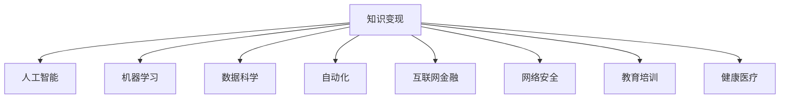

                 

# 知识变现的100种方法

> 关键词：知识变现,知识付费,人工智能,机器学习,数据科学,自动化,互联网金融,网络安全,教育培训,健康医疗

## 1. 背景介绍

### 1.1 问题由来
随着互联网的普及和技术的进步，人们获取知识的途径日益多样，知识的变现方式也随之发生了深刻变革。从传统的出版物、学术讲座、教育培训到网络课程、知识问答、技术博客，知识和技能开始以更多元化的形式和渠道呈现。特别是在人工智能、数据科学、机器学习等领域，知识和技术的传播和应用已经成为了一种重要的产业形态。然而，如何在激烈的市场竞争中，将知识转化为可变现的资产，实现真正的知识变现，成为了当前社会和产业界关注的焦点。

### 1.2 问题核心关键点
实现知识变现的核心在于如何将知识与市场需求有效对接，创造出新的价值。这不仅需要深厚的专业知识储备，更需要敏锐的市场洞察力和创新的商业模式。以下将从多个角度探讨知识变现的100种方法，为各行各业的从业者提供有益的参考和启示。

## 2. 核心概念与联系

### 2.1 核心概念概述

知识变现是一种将专业知识、技能和经验转化为经济价值的过程。其核心概念包括：

- **知识变现**：通过各种形式将知识转化为经济收益，如出版、课程、咨询、技术服务等。
- **人工智能**：利用机器学习和深度学习等技术，自动处理大量数据，提高知识变现的效率和准确性。
- **机器学习**：一种让计算机从数据中学习规律，并基于学习结果进行预测和决策的技术。
- **数据科学**：涉及数据收集、处理、分析和可视化的科学，旨在从数据中挖掘知识和洞察。
- **自动化**：通过编程和算法，实现任务自动化，降低人力成本，提高工作效率。
- **互联网金融**：利用互联网技术，如区块链、大数据分析等，在金融领域实现知识和技能的应用。
- **网络安全**：通过保护网络系统免受攻击、泄露和破坏，提供知识和技能的商业价值。
- **教育培训**：通过线上线下结合的教学方式，传播知识和技能，帮助个人和组织提升能力。
- **健康医疗**：将医学知识和医疗技能应用于疾病预防、诊断和治疗等场景，提高健康管理的效率和质量。

这些核心概念之间的逻辑关系可以通过以下Mermaid流程图来展示：



这个流程图展示了知识变现与多个相关领域的关系：人工智能、机器学习、数据科学等技术为知识变现提供了工具和方法，自动化和互联网金融等应用拓展了变现渠道，网络安全、教育培训、健康医疗等领域的知识变现需求催生了更多的创新模式。

## 3. 核心算法原理 & 具体操作步骤
### 3.1 算法原理概述

实现知识变现的基本原理是通过技术手段，将知识与市场需求有效对接，创造出新的价值。核心算法包括：

- **数据采集与处理**：从多渠道采集知识相关的数据，如学术论文、技术博客、在线课程等，并对其进行清洗和预处理。
- **特征提取与建模**：从处理后的数据中提取关键特征，构建机器学习模型，预测知识的市场价值和变现潜力。
- **优化与调参**：通过交叉验证等方法，优化模型参数，提高模型准确性和泛化能力。
- **知识匹配与推荐**：将处理后的知识与市场需求进行匹配，推荐最相关的知识内容给潜在用户或客户。

### 3.2 算法步骤详解

以下以机器学习算法为例，详细讲解知识变现的关键步骤：

**Step 1: 数据采集与处理**

1. **数据源选择**：从学术论文、技术博客、在线课程等多个数据源中选取相关的知识数据。
2. **数据清洗**：去除重复、错误和无关的数据，确保数据的准确性和完整性。
3. **数据预处理**：将数据转换为机器学习算法所需的格式，如文本向量化、时间序列归一化等。

**Step 2: 特征提取与建模**

1. **特征选择**：从清洗后的数据中提取关键特征，如关键词频率、引用次数、课程评分等。
2. **模型选择**：根据知识变现的不同应用场景，选择合适的机器学习模型，如分类、回归、聚类等。
3. **模型训练**：使用处理后的数据训练机器学习模型，如决策树、随机森林、神经网络等。
4. **模型评估**：通过交叉验证等方法评估模型的性能，选择最优模型。

**Step 3: 优化与调参**

1. **参数调优**：调整模型的超参数，如学习率、正则化系数等，优化模型性能。
2. **模型集成**：通过集成多个模型，提高知识变现的鲁棒性和准确性。
3. **持续学习**：定期更新数据和模型，保持知识变现的持续性。

**Step 4: 知识匹配与推荐**

1. **用户画像**：根据用户的兴趣和需求，构建用户画像。
2. **知识推荐**：使用优化后的模型对知识进行评分，推荐最相关的知识内容给用户。
3. **个性化调整**：根据用户反馈，动态调整推荐算法，提升用户体验。

### 3.3 算法优缺点

**优点**：

- 数据驱动：通过大量的数据分析和机器学习，提高了知识变现的科学性和客观性。
- 高效性：自动化处理和推荐系统，提高了知识变现的效率和准确性。
- 多样性：适应多种知识变现形式，如出版、课程、咨询等，具有较强的灵活性。

**缺点**：

- 数据依赖：知识变现的效果高度依赖于数据的质量和数量，获取高质量数据的成本较高。
- 模型复杂性：构建高效的机器学习模型需要较强的专业知识和计算资源。
- 用户隐私：推荐算法可能涉及用户隐私数据的收集和使用，需要严格的隐私保护措施。

### 3.4 算法应用领域

知识变现的算法已经在多个领域得到了广泛应用，例如：

- **互联网教育**：通过数据分析和推荐系统，为学习者提供个性化的课程推荐。
- **在线医疗**：利用机器学习模型分析病历数据，提供个性化的健康管理建议。
- **金融风控**：通过数据分析和机器学习，评估信用风险，优化贷款审批流程。
- **智能客服**：利用自然语言处理和推荐算法，提供智能化的客户服务。
- **市场预测**：利用机器学习模型预测市场趋势，帮助企业和投资者做出决策。
- **个性化营销**：通过数据分析和推荐系统，实现精准的个性化营销。

这些应用场景展示了机器学习算法在知识变现中的巨大潜力，为不同行业提供了新的商业模式和技术支持。

## 4. 数学模型和公式 & 详细讲解 & 举例说明

### 4.1 数学模型构建

知识变现的数学模型可以通过以下形式来构建：

**目标函数**：
$$
\min_{\theta} \mathcal{L}(\theta)
$$

其中，$\theta$ 为机器学习模型的参数，$\mathcal{L}$ 为目标函数，即知识变现的损失函数。

**损失函数**：
$$
\mathcal{L}(\theta) = \frac{1}{N} \sum_{i=1}^N \ell(y_i, f(x_i; \theta))
$$

其中，$\ell$ 为单个样本的损失函数，$f(x_i; \theta)$ 为模型在输入 $x_i$ 下的输出，$y_i$ 为实际标签。

### 4.2 公式推导过程

以分类任务为例，使用逻辑回归模型作为知识变现的预测模型：

**输入特征**：$x_i \in \mathbb{R}^n$，表示知识相关的特征向量。
**输出标签**：$y_i \in \{0, 1\}$，表示知识变现的预测结果。

**逻辑回归模型**：
$$
f(x_i; \theta) = \frac{1}{1 + e^{-\theta^T x_i}}
$$

其中，$\theta$ 为模型参数，$x_i$ 为输入特征向量。

**交叉熵损失函数**：
$$
\ell(y_i, f(x_i; \theta)) = -(y_i \log f(x_i; \theta) + (1 - y_i) \log (1 - f(x_i; \theta)))
$$

**目标函数**：
$$
\mathcal{L}(\theta) = \frac{1}{N} \sum_{i=1}^N \ell(y_i, f(x_i; \theta))
$$

通过求解目标函数的最小值，优化模型参数 $\theta$，从而实现知识变现的预测和推荐。

### 4.3 案例分析与讲解

**案例1: 在线教育推荐系统**

在线教育平台可以收集学生的学习数据，如课程评分、学习时长、答题情况等，构建用户画像。利用逻辑回归模型和交叉熵损失函数，对不同课程进行评分和排序，推荐最符合学生兴趣和需求的学习资源。

**案例2: 健康医疗知识推荐**

医院可以收集病人的病历数据，如诊断结果、治疗方案、药品使用情况等，构建疾病和治疗方法的知识图谱。利用知识图谱和深度学习模型，对病人进行病情诊断和治疗方案推荐，提高医疗服务的个性化和效率。

## 5. 项目实践：代码实例和详细解释说明

### 5.1 开发环境搭建

要实现知识变现的算法，首先需要搭建好开发环境。以下是使用Python进行机器学习的开发环境配置流程：

1. **安装Python**：从官网下载并安装Python 3.x版本。
2. **安装Anaconda**：从官网下载并安装Anaconda，用于创建独立的Python环境。
3. **创建虚拟环境**：
```bash
conda create -n knowledgevariation python=3.8
conda activate knowledgevariation
```

4. **安装必要的库**：
```bash
pip install numpy pandas scikit-learn tensorflow keras transformers pytorch
```

5. **安装机器学习框架**：
```bash
pip install scikit-learn keras tensorflow
```

完成上述步骤后，即可在虚拟环境中进行知识变现的算法实现。

### 5.2 源代码详细实现

以下是一个简单的推荐系统代码实现示例：

**数据采集与处理**：

```python
import pandas as pd
from sklearn.model_selection import train_test_split

# 数据采集
data = pd.read_csv('data.csv')

# 数据清洗
data = data.dropna()

# 数据预处理
X = data[['feature1', 'feature2', 'feature3']]
y = data['label']

# 划分训练集和测试集
X_train, X_test, y_train, y_test = train_test_split(X, y, test_size=0.2, random_state=42)
```

**特征提取与建模**：

```python
from sklearn.preprocessing import StandardScaler
from sklearn.linear_model import LogisticRegression
from sklearn.metrics import accuracy_score

# 特征标准化
scaler = StandardScaler()
X_train = scaler.fit_transform(X_train)
X_test = scaler.transform(X_test)

# 构建逻辑回归模型
model = LogisticRegression()

# 模型训练
model.fit(X_train, y_train)

# 模型评估
y_pred = model.predict(X_test)
accuracy = accuracy_score(y_test, y_pred)
print(f'Accuracy: {accuracy:.2f}')
```

**优化与调参**：

```python
from sklearn.model_selection import GridSearchCV

# 参数调优
param_grid = {'C': [0.001, 0.01, 0.1, 1, 10, 100]}
grid_search = GridSearchCV(model, param_grid, cv=5, scoring='accuracy')
grid_search.fit(X_train, y_train)

# 输出最优参数
best_params = grid_search.best_params_
print(f'Best parameters: {best_params}')
```

**知识匹配与推荐**：

```python
# 构建推荐模型
from sklearn.metrics.pairwise import cosine_similarity

# 计算相似度
similarity = cosine_similarity(X_train, X_train)

# 获取推荐结果
def get_recommendations(user_id, n_recommendations):
    user_row = similarity[user_id]
    sorted_indices = np.argsort(user_row)[-n_recommendations:]
    recommendations = sorted_indices[1:]
    return X_train.iloc[recommendations].to_dict(orient='records')

# 测试推荐系统
recommendations = get_recommendations(1, 5)
print(recommendations)
```

### 5.3 代码解读与分析

上述代码实现了简单的知识推荐系统，包括以下关键步骤：

1. **数据采集与处理**：从CSV文件中读取数据，进行清洗和预处理，构建特征矩阵 $X$ 和标签向量 $y$。
2. **特征提取与建模**：使用逻辑回归模型进行分类任务建模，利用交叉熵损失函数进行模型训练和评估。
3. **优化与调参**：使用网格搜索方法调整模型参数，选择最优参数。
4. **知识匹配与推荐**：计算用户与所有物品的相似度，推荐与用户最相关的物品。

## 6. 实际应用场景

### 6.1 互联网教育

在线教育平台可以借助知识变现的算法，为学习者提供个性化的课程推荐。通过分析学习者的行为数据，如课程评分、学习时长、答题情况等，推荐最符合其兴趣和需求的学习资源。

### 6.2 健康医疗

医院可以通过知识变现的算法，构建疾病和治疗方法的知识图谱，对病人进行病情诊断和治疗方案推荐，提高医疗服务的个性化和效率。

### 6.3 金融风控

金融机构可以收集用户的交易数据，如消费行为、信用记录等，构建用户画像。利用知识变现的算法，评估信用风险，优化贷款审批流程。

### 6.4 智能客服

智能客服系统可以通过知识变现的算法，利用自然语言处理和推荐算法，提供智能化的客户服务。根据用户的历史对话记录，推荐最相关的回复模板。

### 6.5 市场预测

企业可以收集市场数据，如销售数据、消费者行为等，利用知识变现的算法，预测市场趋势，帮助企业和投资者做出决策。

### 6.6 个性化营销

电商平台可以通过知识变现的算法，利用数据分析和推荐系统，实现精准的个性化营销。根据用户的浏览、购买历史，推荐最相关的商品。

## 7. 工具和资源推荐

### 7.1 学习资源推荐

为了帮助开发者系统掌握知识变现的理论基础和实践技巧，这里推荐一些优质的学习资源：

1. **《机器学习实战》**：由Peter Harrington所著，详细介绍了机器学习的基本概念和常用算法，是学习机器学习的入门佳作。
2. **《深度学习》**：由Ian Goodfellow、Yoshua Bengio和Aaron Courville共同编写，全面介绍了深度学习的基本理论和实践方法。
3. **《Python数据科学手册》**：由Jake VanderPlas所著，介绍了Python在数据科学中的应用，涵盖数据处理、机器学习、可视化等内容。
4. **Coursera和edX在线课程**：提供了大量优质的在线课程，涵盖机器学习、数据科学、人工智能等领域的最新知识。
5. **Kaggle竞赛**：通过参加机器学习和数据科学竞赛，实践和提升技能，积累实际项目经验。

通过对这些资源的学习实践，相信你一定能够快速掌握知识变现的精髓，并用于解决实际的业务问题。

### 7.2 开发工具推荐

高效的开发离不开优秀的工具支持。以下是几款用于知识变现开发的常用工具：

1. **Jupyter Notebook**：免费的交互式笔记本，支持Python、R等语言，适合编写和运行机器学习代码。
2. **PyTorch和TensorFlow**：开源深度学习框架，提供了丰富的机器学习算法和模型，支持GPU加速。
3. **Pandas和NumPy**：Python数据处理库，提供了强大的数据处理和分析功能。
4. **Scikit-learn**：Python机器学习库，提供了多种常用的机器学习算法和工具函数。
5. **Matplotlib和Seaborn**：Python可视化库，用于绘制图表和数据可视化。

合理利用这些工具，可以显著提升知识变现任务的开发效率，加快创新迭代的步伐。

### 7.3 相关论文推荐

知识变现的研究源于学界的持续探索和实践。以下是几篇奠基性的相关论文，推荐阅读：

1. **《机器学习》**：由Tom Mitchell所著，系统介绍了机器学习的基本概念、算法和应用。
2. **《深度学习入门》**：由斋藤康毅所著，介绍了深度学习的基本概念、算法和实现方法。
3. **《统计学习方法》**：由李航所著，详细介绍了统计学习的基本理论和算法，是机器学习领域的经典教材。
4. **《Python编程：从入门到实践》**：由Eric Matthes所著，介绍了Python编程的基本概念和实践方法。

这些论文代表了大规模数据处理和知识变现方法的发展脉络。通过学习这些前沿成果，可以帮助研究者把握学科前进方向，激发更多的创新灵感。

## 8. 总结：未来发展趋势与挑战

### 8.1 总结

本文对知识变现的基本原理和实践方法进行了全面系统的介绍。首先阐述了知识变现的重要性和核心概念，明确了机器学习算法在知识变现中的关键作用。其次，从数据采集与处理、特征提取与建模、优化与调参、知识匹配与推荐等多个角度，详细讲解了知识变现的实现步骤和关键算法。最后，展示了知识变现在互联网教育、健康医疗、金融风控等多个领域的实际应用，为不同行业的从业者提供了有益的参考和启示。

通过本文的系统梳理，可以看到，知识变现的算法和方法已经在多个领域得到了广泛应用，为不同行业提供了新的商业模式和技术支持。未来，随着大数据、人工智能等技术的发展，知识变现的算法和应用将进一步拓展，为更多行业带来新的机遇和挑战。

### 8.2 未来发展趋势

展望未来，知识变现的算法将呈现以下几个发展趋势：

1. **自动化程度提高**：随着自动化技术的发展，知识变现的算法将更加自动化和智能化，能够快速处理和分析大规模数据。
2. **个性化推荐系统优化**：通过引入更多用户行为数据和智能算法，实现更加精准和个性化的推荐。
3. **跨领域知识整合**：利用知识图谱和跨领域知识库，实现不同领域的知识整合和协同，提升知识变现的深度和广度。
4. **实时性增强**：通过实时数据处理和算法优化，实现知识变现的快速响应和即时反馈。
5. **隐私保护技术进步**：随着隐私保护技术的发展，知识变现的算法将更加注重用户隐私保护，提升数据安全和用户信任。

### 8.3 面临的挑战

尽管知识变现的算法已经在多个领域得到了广泛应用，但在迈向更加智能化、普适化应用的过程中，它仍面临着诸多挑战：

1. **数据质量问题**：知识变现的效果高度依赖于数据的质量和数量，获取高质量数据的成本较高，数据缺失和噪声也是主要挑战。
2. **模型复杂度**：构建高效的机器学习模型需要较强的专业知识和计算资源，模型的解释性和可理解性也是难点。
3. **用户隐私问题**：推荐算法可能涉及用户隐私数据的收集和使用，需要严格的隐私保护措施，用户隐私和数据安全成为主要挑战。
4. **算法偏见问题**：机器学习模型可能会学习到数据中的偏见，导致推荐结果的不公平和歧视，算法偏见和公平性成为重要问题。
5. **技术壁垒问题**：知识变现的算法和应用需要跨领域的技术和知识，技术和人才的壁垒较高，技术普及和应用推广成为挑战。

### 8.4 研究展望

面对知识变现面临的种种挑战，未来的研究需要在以下几个方面寻求新的突破：

1. **数据采集和处理**：探索更加高效、自动化的数据采集和处理技术，降低数据获取和处理的成本。
2. **模型优化和调参**：研究更加高效、稳健的机器学习算法和参数调优方法，提高知识变现的效率和效果。
3. **用户隐私保护**：研究隐私保护技术和机制，确保用户隐私和数据安全，提升用户信任和满意度。
4. **算法公平性**：研究公平性算法和机制，确保推荐结果的公平性和无偏见性，提升算法公正性。
5. **跨领域知识整合**：研究跨领域知识整合和协同的技术和方法，提升知识变现的深度和广度。

这些研究方向的探索，必将引领知识变现技术迈向更高的台阶，为知识变现带来更多的机遇和挑战。面向未来，知识变现技术还需要与其他人工智能技术进行更深入的融合，共同推动知识的广泛传播和应用。只有勇于创新、敢于突破，才能不断拓展知识变现的边界，实现知识变现的可持续发展。

## 9. 附录：常见问题与解答

**Q1：知识变现的核心是什么？**

A: 知识变现的核心是将知识与市场需求有效对接，创造出新的价值。这不仅需要深厚的专业知识储备，更需要敏锐的市场洞察力和创新的商业模式。

**Q2：如何构建高效的知识推荐系统？**

A: 构建高效的知识推荐系统需要以下关键步骤：
1. 数据采集与处理：从多渠道采集知识相关的数据，并进行清洗和预处理。
2. 特征提取与建模：从处理后的数据中提取关键特征，构建机器学习模型。
3. 优化与调参：通过交叉验证等方法优化模型参数，提高模型性能。
4. 知识匹配与推荐：利用优化后的模型对知识进行评分，推荐最相关的知识内容给用户。

**Q3：知识变现的算法依赖于哪些关键技术？**

A: 知识变现的算法依赖于以下关键技术：
1. 数据采集与处理：需要高效的数据采集和预处理技术。
2. 特征提取与建模：需要选择合适的特征和建模算法。
3. 优化与调参：需要高效的参数调优和模型优化技术。
4. 知识匹配与推荐：需要高效的推荐算法和机制。

**Q4：知识变现在实际应用中面临哪些挑战？**

A: 知识变现在实际应用中面临以下挑战：
1. 数据质量问题：需要高质量、多样化的数据来源。
2. 模型复杂度：构建高效的机器学习模型需要较强的专业知识和计算资源。
3. 用户隐私问题：推荐算法涉及用户隐私数据的收集和使用，需要严格的隐私保护措施。
4. 算法偏见问题：机器学习模型可能会学习到数据中的偏见，导致推荐结果的不公平和歧视。
5. 技术壁垒问题：知识变现的算法和应用需要跨领域的技术和知识，技术和人才的壁垒较高。

这些挑战需要各方共同努力，通过技术创新和合作，才能克服。

**Q5：如何实现知识变现的可持续发展？**

A: 实现知识变现的可持续发展需要以下关键措施：
1. 数据治理：建立高质量、安全和合规的数据治理体系。
2. 算法优化：不断优化和改进推荐算法，提升其效率和效果。
3. 隐私保护：引入隐私保护技术和机制，确保用户隐私和数据安全。
4. 公平性保障：研究公平性算法和机制，确保推荐结果的公平性和无偏见性。
5. 跨领域合作：促进跨领域技术合作和知识整合，提升知识变现的深度和广度。

只有通过多方合作和持续创新，才能实现知识变现的可持续发展，造福全社会。

---

作者：禅与计算机程序设计艺术 / Zen and the Art of Computer Programming

