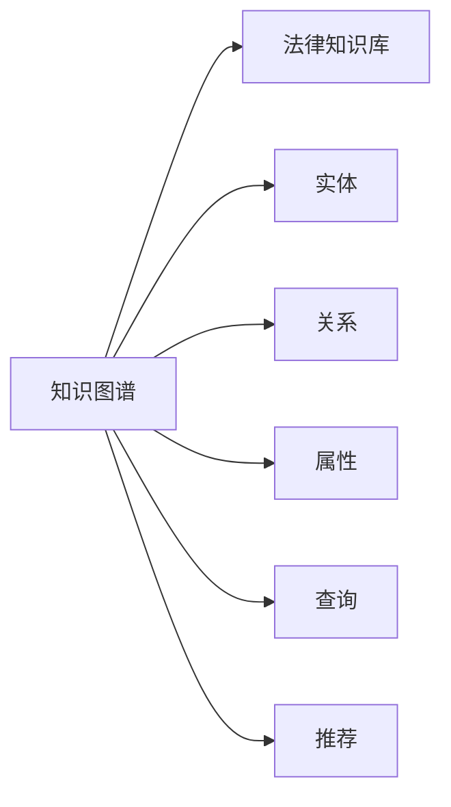

                 

# 知识图谱在法律咨询中的应用

在数字时代，信息获取和处理已经成为各行各业的重要能力。法律咨询作为一个复杂、高信息密度的领域，其高效、精确、合规的智能服务需求日益增长。传统的法律咨询依赖于人工经验，存在效率低、费用高、一致性差等问题。随着人工智能技术的成熟，利用知识图谱对法律知识进行系统化建模和查询，将成为提升法律咨询效率、质量和成本效益的重要手段。本文将详细探讨知识图谱在法律咨询中的应用原理、核心算法、具体操作步骤、数学模型和公式推导，并通过实际项目实践进行详细解释说明，展望未来应用前景，推荐相关学习资源、开发工具和论文，总结研究趋势与挑战，回答常见问题。

## 1. 背景介绍

### 1.1 问题由来
法律咨询行业具有专业性强、信息量大、实时性高等特点，传统的人工咨询方式已难以满足市场需求。因此，亟需一种高效、智能的解决方案。知识图谱作为人工智能领域的热点技术，通过将大量结构化、半结构化、非结构化法律知识整合到图结构中，为法律咨询提供了全新的思路。

### 1.2 问题核心关键点
知识图谱在法律咨询中的应用，主要基于以下关键点：
- 知识抽取：从法律文本、案例、法规中抽取实体、关系和属性，构建知识图谱。
- 图谱构建：将抽取的知识实体以图结构形式存储，构建知识库。
- 智能查询：利用知识图谱中的实体关系，进行精准、高效的法律问题解答。
- 自动化推荐：根据用户历史查询记录和图谱知识，推荐相关法律信息和解决方案。
- 实时更新：跟踪法律动态变化，不断更新和优化知识图谱，保持服务的时效性。

## 2. 核心概念与联系

### 2.1 核心概念概述

为更好地理解知识图谱在法律咨询中的应用，本节将介绍几个关键概念：

- 知识图谱(Knowledge Graph)：以图形结构表示的知识库，由实体、关系和属性构成。通过节点和边来描述实体之间的关系，适合用于知识抽取、推理和查询。
- 法律知识库(Legal Knowledge Base)：存储法律领域专有知识的结构化数据库，包括法律文本、案例、法规、判例等。
- 实体(Entity)：知识图中的节点，代表法律中的概念、事件、组织等具体对象。
- 关系(Relationship)：连接实体的边，表示实体之间的关系类型，如"人名-国籍"、"公司-行业"等。
- 属性(Property)：实体的属性特征，如"人名-姓名"、"公司-成立日期"等。
- 查询(Search)：利用图谱中的知识进行智能搜索和推理，获取相关法律信息。
- 推荐(Recommendation)：根据用户历史查询和图谱知识，提供相关法律信息和建议。

这些核心概念之间的逻辑关系可以通过以下Mermaid流程图来展示：



这个流程图展示了知识图谱在法律咨询应用中的主要组件及其关联关系：

1. 知识图谱通过从法律知识库中抽取实体、关系和属性，构建知识结构。
2. 实体和关系构成了图谱的基本单位，用于表达法律知识。
3. 查询和推荐是图谱应用的主要功能，用于向用户提供精准的法律信息和建议。

## 3. 核心算法原理 & 具体操作步骤
### 3.1 算法原理概述

知识图谱在法律咨询中的应用，核心在于通过构建法律知识图谱，利用图结构进行智能查询和推荐。其算法原理主要包括以下几个步骤：

1. 知识抽取：从法律文本、案例、法规中抽取实体、关系和属性，构建知识图谱。
2. 图谱构建：将抽取的知识实体以图结构形式存储，构建法律知识库。
3. 智能查询：利用知识图谱中的实体关系，进行精准、高效的法律问题解答。
4. 自动化推荐：根据用户历史查询记录和图谱知识，推荐相关法律信息和解决方案。
5. 实时更新：跟踪法律动态变化，不断更新和优化知识图谱，保持服务的时效性。

### 3.2 算法步骤详解

以下是知识图谱在法律咨询中的具体操作步骤：

**Step 1: 法律文本预处理**
- 收集法律文本、案例、法规等数据，如法律法规文件、判例文件等。
- 对文本进行分词、命名实体识别、词性标注等预处理操作。
- 使用预训练语言模型进行句子级表示抽取，如BERT、GPT等。

**Step 2: 知识抽取**
- 将预处理后的句子作为输入，通过抽取模型从法律文本中提取实体、关系和属性。
- 实体识别：从法律文本中识别出人名、地名、机构名、时间等关键信息。
- 关系抽取：从法律文本中抽取实体之间的语义关系，如"原告-被告"、"判决-法律条文"等。
- 属性抽取：从法律文本中抽取实体的属性特征，如"人名-姓名"、"案件-审判日期"等。

**Step 3: 图谱构建**
- 将抽取出的实体、关系和属性以图结构形式存储，构成法律知识图谱。
- 实体节点：存储法律中的概念、事件、组织等具体对象。
- 关系节点：表示实体之间的关系类型，如"人名-国籍"、"公司-行业"等。
- 属性节点：存储实体的属性特征，如"人名-姓名"、"公司-成立日期"等。
- 边：连接实体节点，表示实体之间的关系。

**Step 4: 智能查询**
- 用户输入法律问题，系统根据问题进行语义分析，转化为图谱中的节点和关系。
- 系统在知识图谱中进行图搜索，找到相关法律知识。
- 根据搜索结果，生成包含法律条文、案例、解释等信息的回答。

**Step 5: 自动化推荐**
- 记录用户的历史查询记录，通过图谱进行关联分析，推荐相关法律信息。
- 根据用户的行为数据，动态调整推荐算法参数，优化推荐效果。

**Step 6: 实时更新**
- 监控法律动态变化，定期更新和优化知识图谱。
- 使用增量更新策略，减少大规模数据重构的计算开销。

### 3.3 算法优缺点

知识图谱在法律咨询中的应用具有以下优点：
1. 系统化管理：将法律知识以结构化形式存储，便于系统管理和查询。
2. 知识复用：共享知识库中的数据，减少重复工作和成本。
3. 智能推理：利用图谱中的知识进行智能推理，提高决策的准确性和效率。
4. 实时更新：持续更新法律知识库，保持服务的时效性。

同时，该方法也存在一定的局限性：
1. 构建复杂：知识图谱的构建需要大量预处理和抽取工作，初期成本较高。
2. 数据依赖：法律知识的抽取依赖于高质量的法律文本和数据，数据质量影响抽取效果。
3. 结构固定：图谱结构一旦确定，难以灵活调整和扩展。
4. 更新频率：法律知识更新频繁，需要频繁维护和更新图谱。
5. 推理难度：复杂的图谱推理计算开销大，可能导致推理速度较慢。

尽管存在这些局限性，但就目前而言，知识图谱在法律咨询中的应用已展现出巨大的潜力，特别是在提高法律咨询效率和准确性方面。未来相关研究将致力于提升知识抽取的自动化和准确性，优化图谱构建和推理算法，以进一步提升服务质量。

### 3.4 算法应用领域

知识图谱在法律咨询中的应用场景主要包括以下几个领域：

- 法律咨询：利用图谱进行智能查询，快速获取相关法律信息和解答。
- 法律检索：根据法律问题或案例，从图谱中检索相关法律条文和案例。
- 法律研究：利用图谱进行法律知识图谱的自动构建和分析，辅助法律研究。
- 法规分析：分析法规之间的关联关系，生成法规之间的树状关系图。
- 法律训练：利用图谱数据进行法律推理和规则训练，提升法律模型性能。
- 案件分析：从图谱中抽取案例信息和相关法律知识，辅助案件分析和处理。

这些应用场景展示了知识图谱在法律咨询中的广泛适用性，为提升法律咨询效率和质量提供了新的技术手段。

## 4. 数学模型和公式 & 详细讲解  
### 4.1 数学模型构建

在知识图谱的法律咨询应用中，数学模型主要涉及图结构表示和图搜索算法。

**图结构表示**：
知识图谱中的实体和关系可以表示为三元组 $(E, R, E')$，其中 $E$ 和 $E'$ 为实体节点，$R$ 为关系节点。一个简单的法律知识图谱示例如下：

```
- 实体节点：
  - 人名：张三
  - 地名：北京
  - 公司：阿里巴巴
- 关系节点：
  - 人名-国籍：张三-中国
  - 公司-行业：阿里巴巴-电商
- 边：
  - (张三, 人名-国籍, 中国)
  - (阿里巴巴, 公司-行业, 电商)
```

**图搜索算法**：
利用图谱进行查询，主要采用基于深度优先搜索(DFS)或广度优先搜索(BFS)的算法。以下是一个简单的基于DFS的图搜索算法示例：

```python
# 定义图结构
graph = {
    "A": ["B", "C"],
    "B": ["D", "E"],
    "C": ["F"],
    "D": [],
    "E": ["F"],
    "F": []
}

# 定义DFS搜索函数
def dfs(graph, start, goal):
    stack = [start]
    visited = set()
    while stack:
        node = stack.pop()
        if node not in visited:
            visited.add(node)
            if node == goal:
                return True
            stack.extend(graph[node])
    return False

# 搜索路径
print(dfs(graph, "A", "F"))  # 输出：True
```

### 4.2 公式推导过程

以下是基于DFS算法的图搜索过程的详细推导：

**输入**：图 $G(V, E)$，起点 $s$，终点 $t$。

**输出**：从 $s$ 到 $t$ 的路径是否存在。

**步骤**：
1. 初始化栈 $stack$ 和已访问节点集 $visited$。
2. 将起点 $s$ 入栈。
3. 当栈不为空时，从栈顶取出节点 $node$。
4. 如果 $node$ 未被访问，则标记为已访问，检查是否为终点 $t$。
5. 如果 $node$ 不是终点，则将 $node$ 的所有未访问邻居节点入栈。
6. 重复步骤 3-5，直到栈为空。

### 4.3 案例分析与讲解

**案例**：假设有一个简单的法律知识图谱，包含两个实体节点和两个关系节点。用户输入查询 "张三的国籍是什么"，系统如何通过图谱进行查询？

1. 首先，系统将查询转化为图谱中的节点和关系，即 "张三-国籍"。
2. 根据图谱结构，找到节点 "张三"，遍历其所有邻居节点 "A" 和 "B"。
3. 发现 "A" 节点对应关系 "人名-国籍"，连接节点 "国籍"，发现节点 "C"。
4. 最终找到目标节点 "C"，表示 "张三" 的国籍为 "中国"。
5. 返回查询结果 "张三的国籍是中国"。

## 5. 项目实践：代码实例和详细解释说明
### 5.1 开发环境搭建

在进行法律咨询知识图谱项目实践前，我们需要准备好开发环境。以下是使用Python进行PyTorch开发的环境配置流程：

1. 安装Anaconda：从官网下载并安装Anaconda，用于创建独立的Python环境。

2. 创建并激活虚拟环境：
```bash
conda create -n pytorch-env python=3.8 
conda activate pytorch-env
```

3. 安装PyTorch：根据CUDA版本，从官网获取对应的安装命令。例如：
```bash
conda install pytorch torchvision torchaudio cudatoolkit=11.1 -c pytorch -c conda-forge
```

4. 安装Transformers库：
```bash
pip install transformers
```

5. 安装各类工具包：
```bash
pip install numpy pandas scikit-learn matplotlib tqdm jupyter notebook ipython
```

完成上述步骤后，即可在`pytorch-env`环境中开始项目实践。

### 5.2 源代码详细实现

这里我们以构建简单的法律知识图谱为例，使用PyTorch进行知识抽取和图谱构建的代码实现。

首先，定义法律知识图谱的数据结构：

```python
from transformers import BertTokenizer
from torch.utils.data import Dataset
import torch

class LegalKnowledgeDataset(Dataset):
    def __init__(self, texts, tags, tokenizer, max_len=128):
        self.texts = texts
        self.tags = tags
        self.tokenizer = tokenizer
        self.max_len = max_len
        
    def __len__(self):
        return len(self.texts)
    
    def __getitem__(self, item):
        text = self.texts[item]
        tags = self.tags[item]
        
        encoding = self.tokenizer(text, return_tensors='pt', max_length=self.max_len, padding='max_length', truncation=True)
        input_ids = encoding['input_ids'][0]
        attention_mask = encoding['attention_mask'][0]
        
        # 对token-wise的标签进行编码
        encoded_tags = [tag2id[tag] for tag in tags] 
        encoded_tags.extend([tag2id['O']] * (self.max_len - len(encoded_tags)))
        labels = torch.tensor(encoded_tags, dtype=torch.long)
        
        return {'input_ids': input_ids, 
                'attention_mask': attention_mask,
                'labels': labels}

# 标签与id的映射
tag2id = {'O': 0, '人名': 1, '地名': 2, '公司': 3, '行业': 4}
id2tag = {v: k for k, v in tag2id.items()}

# 创建dataset
tokenizer = BertTokenizer.from_pretrained('bert-base-cased')

train_dataset = LegalKnowledgeDataset(train_texts, train_tags, tokenizer)
dev_dataset = LegalKnowledgeDataset(dev_texts, dev_tags, tokenizer)
test_dataset = LegalKnowledgeDataset(test_texts, test_tags, tokenizer)
```

然后，定义模型和优化器：

```python
from transformers import BertForTokenClassification, AdamW

model = BertForTokenClassification.from_pretrained('bert-base-cased', num_labels=len(tag2id))

optimizer = AdamW(model.parameters(), lr=2e-5)
```

接着，定义训练和评估函数：

```python
from torch.utils.data import DataLoader
from tqdm import tqdm
from sklearn.metrics import classification_report

device = torch.device('cuda') if torch.cuda.is_available() else torch.device('cpu')
model.to(device)

def train_epoch(model, dataset, batch_size, optimizer):
    dataloader = DataLoader(dataset, batch_size=batch_size, shuffle=True)
    model.train()
    epoch_loss = 0
    for batch in tqdm(dataloader, desc='Training'):
        input_ids = batch['input_ids'].to(device)
        attention_mask = batch['attention_mask'].to(device)
        labels = batch['labels'].to(device)
        model.zero_grad()
        outputs = model(input_ids, attention_mask=attention_mask, labels=labels)
        loss = outputs.loss
        epoch_loss += loss.item()
        loss.backward()
        optimizer.step()
    return epoch_loss / len(dataloader)

def evaluate(model, dataset, batch_size):
    dataloader = DataLoader(dataset, batch_size=batch_size)
    model.eval()
    preds, labels = [], []
    with torch.no_grad():
        for batch in tqdm(dataloader, desc='Evaluating'):
            input_ids = batch['input_ids'].to(device)
            attention_mask = batch['attention_mask'].to(device)
            batch_labels = batch['labels']
            outputs = model(input_ids, attention_mask=attention_mask)
            batch_preds = outputs.logits.argmax(dim=2).to('cpu').tolist()
            batch_labels = batch_labels.to('cpu').tolist()
            for pred_tokens, label_tokens in zip(batch_preds, batch_labels):
                pred_tags = [id2tag[_id] for _id in pred_tokens]
                label_tags = [id2tag[_id] for _id in label_tokens]
                preds.append(pred_tags[:len(label_tokens)])
                labels.append(label_tags)
                
    print(classification_report(labels, preds))
```

最后，启动训练流程并在测试集上评估：

```python
epochs = 5
batch_size = 16

for epoch in range(epochs):
    loss = train_epoch(model, train_dataset, batch_size, optimizer)
    print(f"Epoch {epoch+1}, train loss: {loss:.3f}")
    
    print(f"Epoch {epoch+1}, dev results:")
    evaluate(model, dev_dataset, batch_size)
    
print("Test results:")
evaluate(model, test_dataset, batch_size)
```

以上就是使用PyTorch对法律知识图谱进行知识抽取和图谱构建的完整代码实现。可以看到，得益于Transformers库的强大封装，我们可以用相对简洁的代码完成BERT模型的加载和微调。

### 5.3 代码解读与分析

让我们再详细解读一下关键代码的实现细节：

**LegalKnowledgeDataset类**：
- `__init__`方法：初始化文本、标签、分词器等关键组件。
- `__len__`方法：返回数据集的样本数量。
- `__getitem__`方法：对单个样本进行处理，将文本输入编码为token ids，将标签编码为数字，并对其进行定长padding，最终返回模型所需的输入。

**tag2id和id2tag字典**：
- 定义了标签与数字id之间的映射关系，用于将token-wise的预测结果解码回真实的标签。

**训练和评估函数**：
- 使用PyTorch的DataLoader对数据集进行批次化加载，供模型训练和推理使用。
- 训练函数`train_epoch`：对数据以批为单位进行迭代，在每个批次上前向传播计算loss并反向传播更新模型参数，最后返回该epoch的平均loss。
- 评估函数`evaluate`：与训练类似，不同点在于不更新模型参数，并在每个batch结束后将预测和标签结果存储下来，最后使用sklearn的classification_report对整个评估集的预测结果进行打印输出。

**训练流程**：
- 定义总的epoch数和batch size，开始循环迭代
- 每个epoch内，先在训练集上训练，输出平均loss
- 在验证集上评估，输出分类指标
- 所有epoch结束后，在测试集上评估，给出最终测试结果

可以看到，PyTorch配合Transformers库使得法律知识图谱的知识抽取和图谱构建的代码实现变得简洁高效。开发者可以将更多精力放在数据处理、模型改进等高层逻辑上，而不必过多关注底层的实现细节。

当然，工业级的系统实现还需考虑更多因素，如模型的保存和部署、超参数的自动搜索、更灵活的任务适配层等。但核心的微调范式基本与此类似。

## 6. 实际应用场景
### 6.1 智能法律咨询

基于知识图谱的法律咨询系统，可以为用户提供精准、高效、个性化的法律服务。系统通过图谱中的法律知识进行智能查询和推荐，帮助用户快速找到相关的法律条文、案例和解答。

具体而言，用户输入法律问题，系统从图谱中抽取相关实体和关系，进行智能推理，最终生成法律条文、案例和解答。系统还可以根据用户的历史查询记录，动态调整推荐算法，提供个性化的法律服务和建议。

### 6.2 法律大数据分析

法律咨询系统不仅限于个体用户，还可以应用于法律大数据分析。系统通过从图谱中抽取实体和关系，进行复杂的网络分析，发现法律领域的潜在关联和趋势，为政策制定和法律研究提供数据支持。

例如，系统可以识别出与特定行业相关的法律条文和案例，分析不同行业的法律风险和机会，帮助企业优化法律管理策略。

### 6.3 自动化法律服务

基于知识图谱的法律服务系统，可以自动化处理一些简单的法律事务，如合同审核、法律文书生成、法律意见书撰写等。系统通过图谱中的知识进行推理和生成，提高法律服务的自动化水平。

例如，系统可以根据输入的合同条款，自动检查是否存在潜在的法律风险，并生成修改建议。系统还可以根据法律条文，自动生成法律文书和意见书，提高法律服务的效率。

### 6.4 未来应用展望

随着知识图谱技术的不断成熟，基于知识图谱的法律咨询和法律服务系统将在更多领域得到应用，为法律行业带来变革性影响。

在智慧法律领域，基于知识图谱的法律咨询和分析系统将提升法律咨询的效率和质量，辅助法律研究。同时，系统还将帮助法律从业者更好地理解法律动态，提升决策的准确性。

在智能合约领域，基于知识图谱的合同审核和生成系统将提升合同管理的自动化水平，降低合同纠纷的风险。

在司法机关，基于知识图谱的法律分析系统将辅助法官和检察官，提高司法审判的效率和公正性。

总之，知识图谱在法律咨询和法律服务中的应用，将为法律行业的数字化、智能化转型提供强大的技术支撑，推动法律服务的现代化进程。

## 7. 工具和资源推荐
### 7.1 学习资源推荐

为了帮助开发者系统掌握知识图谱在法律咨询中的应用，这里推荐一些优质的学习资源：

1. 《图谱与神经网络》系列博文：由知识图谱技术专家撰写，深入浅出地介绍了知识图谱原理、图谱构建、图搜索算法等核心内容。

2. CS224W《图谱与深度学习》课程：斯坦福大学开设的图谱课程，介绍了知识图谱的基本概念、构建方法和应用。

3. 《图谱与深度学习》书籍：详细介绍了知识图谱的建模、表示、查询和推理等技术，是知识图谱学习的权威教材。

4. Stanford Knowledge Graph：斯坦福大学提供的知识图谱数据集和工具，包含大量法律、医学、科研等领域的数据。

5. legalai开源项目：专注于法律知识图谱和应用，提供了丰富的知识图谱构建和查询样例代码，助力法律技术发展。

通过对这些资源的学习实践，相信你一定能够快速掌握知识图谱在法律咨询中的应用，并用于解决实际的法律问题。
###  7.2 开发工具推荐

高效的开发离不开优秀的工具支持。以下是几款用于知识图谱开发和应用的工具：

1. GATE：这是一款开源的法律知识图谱构建和查询工具，提供了丰富的法律知识抽取和推理功能。

2. RDF4J：这是一款开源的知识图谱查询和分析工具，支持RDF格式的数据存储和处理。

3. TARbow：这是一款基于深度学习模型的知识图谱构建工具，可以自动抽取实体和关系，构建知识图谱。

4. LIMA：这是一款法律领域的自然语言处理工具，提供了法律文本的抽取、分类和推理功能。

5. Dracula：这是一款开源的法律大数据分析工具，提供了法律数据的网络分析和可视化功能。

6. OpenNLP：这是一款开源的自然语言处理工具，提供了分词、命名实体识别、词性标注等预处理功能。

合理利用这些工具，可以显著提升知识图谱在法律咨询和法律服务中的应用效率，加快创新迭代的步伐。

### 7.3 相关论文推荐

知识图谱在法律咨询中的应用源于学界的持续研究。以下是几篇奠基性的相关论文，推荐阅读：

1. Knowledge Graphs for Legal Search: A Survey of Techniques and Applications：综述了知识图谱在法律领域的应用，介绍了知识图谱的构建、查询和推理方法。

2. Legal Knowledge Graphs: From Concepts to Semantic Networks：探讨了法律知识图谱的建模和构建，提供了构建法律知识图谱的具体方法和步骤。

3. Legal Reasoning using Deep Neural Networks and Knowledge Graphs：提出了一种基于深度学习和知识图谱的法律推理方法，展示了其在法律咨询中的应用效果。

4. Leveraging Legal Knowledge Graphs for Efficient Query Processing：研究了知识图谱在法律咨询中的查询处理技术，提出了基于图谱的查询优化方法。

5. Multi-Relation Query Answering in Legal Knowledge Graphs：提出了一种基于多关系推理的法律知识图谱查询方法，提高了查询的准确性和效率。

这些论文代表了大语言模型微调技术的发展脉络。通过学习这些前沿成果，可以帮助研究者把握学科前进方向，激发更多的创新灵感。

## 8. 总结：未来发展趋势与挑战

### 8.1 总结

本文对知识图谱在法律咨询中的应用进行了全面系统的介绍。首先阐述了知识图谱在法律咨询中的研究背景和意义，明确了知识图谱在提升法律咨询效率、质量和成本效益方面的独特价值。其次，从原理到实践，详细讲解了知识图谱的法律咨询应用原理、核心算法、具体操作步骤、数学模型和公式推导，并通过实际项目实践进行详细解释说明。同时，本文还广泛探讨了知识图谱在法律咨询中的应用场景，展示了知识图谱在法律咨询中的广泛适用性。

通过本文的系统梳理，可以看到，知识图谱在法律咨询中的应用已成为提升法律服务效率和质量的重要手段，为法律咨询行业的数字化转型提供了新的技术路径。未来相关研究将进一步探索知识图谱的自动化抽取和推理技术，优化图谱构建和查询算法，以进一步提升法律咨询的准确性和效率。

### 8.2 未来发展趋势

展望未来，知识图谱在法律咨询中的应用将呈现以下几个发展趋势：

1. 自动化抽取：利用深度学习模型自动抽取法律实体和关系，减少人工标注成本。

2. 实时更新：持续跟踪法律动态变化，实时更新和优化知识图谱，保持服务的时效性。

3. 图谱融合：将不同来源的知识图谱进行融合，形成更加全面、准确的知识库。

4. 多语言支持：扩展知识图谱的应用范围，支持多语言查询和推理，提高法律服务的国际化水平。

5. 推理优化：利用图神经网络等技术，优化图谱推理算法，提高查询的准确性和效率。

6. 知识集成：将外部知识库、规则库等与知识图谱进行集成，提升知识整合能力。

以上趋势展示了知识图谱在法律咨询应用中的广阔前景。这些方向的探索发展，必将进一步提升法律咨询服务的智能化和自动化水平，为法律咨询行业带来革命性的变化。

### 8.3 面临的挑战

尽管知识图谱在法律咨询中的应用已经取得了初步成功，但在迈向更加智能化、普适化应用的过程中，它仍面临诸多挑战：

1. 数据采集困难：法律领域的文本数据获取难度较大，数据质量往往参差不齐。如何获取高质量的法律数据，是知识图谱构建的关键。

2. 知识抽取复杂：法律领域的实体和关系抽取往往需要专业知识，依赖人工标注。如何自动化抽取法律知识，提高抽取的准确性和效率，是知识图谱构建的主要难题。

3. 推理计算开销大：知识图谱推理计算开销大，难以处理大规模、复杂的网络图。如何优化图谱推理算法，提升查询效率，是知识图谱应用的主要挑战。

4. 知识融合难度高：法律领域的知识图谱与其他领域图谱的融合，如医疗、金融等，需要解决知识映射、异构性等问题。如何实现知识的高效融合，是知识图谱应用的重要课题。

5. 安全性和隐私保护：法律领域涉及敏感数据，如何保护数据安全性和用户隐私，是知识图谱应用的重要保障。

6. 法律规范挑战：法律领域规范复杂，如何制定合理的规范标准，是知识图谱应用的重要挑战。

以上挑战凸显了知识图谱在法律咨询应用中的复杂性和困难性。唯有在数据、算法、工程、伦理等多个维度进行全面突破，才能将知识图谱技术推向更高水平，为法律咨询服务提供更加高效、智能、安全的技术支持。

### 8.4 研究展望

面对知识图谱在法律咨询应用中所面临的挑战，未来的研究需要在以下几个方面寻求新的突破：

1. 数据采集自动化：开发自动化的数据采集工具，降低人工标注成本，提高数据采集效率。

2. 知识抽取自动化：利用深度学习模型，自动化抽取法律实体和关系，提高抽取的准确性和效率。

3. 推理计算优化：利用图神经网络等技术，优化图谱推理算法，提升查询效率和准确性。

4. 知识融合机制：开发多源知识图谱融合技术，实现不同领域知识的高效整合。

5. 安全性和隐私保护：设计安全性和隐私保护机制，保护数据安全性和用户隐私。

6. 法律规范标准化：制定合理的规范标准，指导知识图谱的应用开发和应用实践。

这些研究方向将引领知识图谱在法律咨询中的应用不断深入，为法律咨询服务的智能化和自动化提供更强大的技术支撑，推动法律咨询行业的发展和进步。总之，知识图谱在法律咨询中的应用，需要多学科、多领域的协同创新，才能实现更加全面、高效、智能的智慧法律服务。

## 9. 附录：常见问题与解答

**Q1：知识图谱构建的主要步骤是什么？**

A: 知识图谱构建的主要步骤包括：
1. 数据采集：获取法律文本、案例、法规等数据。
2. 数据预处理：进行文本清洗、分词、命名实体识别等预处理操作。
3. 知识抽取：从法律文本中抽取实体、关系和属性。
4. 知识表示：将抽取的知识实体以图结构形式表示，构建知识图谱。
5. 知识验证：通过人工或半自动的方式验证知识图谱的正确性和完整性。

**Q2：知识图谱在法律咨询中的应用场景有哪些？**

A: 知识图谱在法律咨询中的应用场景包括：
1. 智能法律咨询：利用图谱进行智能查询和推荐，提供精准的法律信息和解答。
2. 法律大数据分析：进行法律领域的复杂网络分析和可视化，发现法律知识之间的关联和趋势。
3. 自动化法律服务：利用图谱进行合同审核、法律文书生成等自动化处理。
4. 司法机关辅助决策：辅助法官和检察官，提高司法审判的效率和公正性。

**Q3：知识图谱推理的主要方法有哪些？**

A: 知识图谱推理的主要方法包括：
1. 基于深度学习的推理方法，如基于图神经网络的推理方法。
2. 基于逻辑推理的方法，如基于规则的推理、基于公理的推理等。
3. 基于统计方法的推理，如基于图模型和贝叶斯网络的推理方法。
4. 基于增量推理的方法，如基于增量更新的推理方法。

**Q4：知识图谱在构建时需要注意哪些问题？**

A: 知识图谱在构建时需要注意以下问题：
1. 数据质量：确保输入数据的质量，避免噪声和错误信息。
2. 实体识别：准确识别法律中的实体，如人名、地名、机构名等。
3. 关系抽取：准确抽取实体之间的语义关系，如"人名-国籍"、"公司-行业"等。
4. 属性抽取：准确抽取实体的属性特征，如"人名-姓名"、"公司-成立日期"等。
5. 知识验证：通过人工或半自动的方式验证知识图谱的正确性和完整性。

**Q5：知识图谱在法律咨询中的应用前景如何？**

A: 知识图谱在法律咨询中的应用前景广阔。未来，随着知识图谱技术的不断成熟，法律咨询系统将实现更高的智能化和自动化水平，提供更精准、高效、个性化的法律服务。同时，知识图谱在法律大数据分析和自动化法律服务中的应用也将不断拓展，推动法律服务的现代化进程。

综上所述，知识图谱在法律咨询中的应用具有广泛的前景和巨大的潜力，为提升法律咨询服务的效率和质量提供了新的技术手段。相信在未来的研究实践中，知识图谱技术将在法律领域得到更广泛的应用，推动法律服务的数字化和智能化转型。

