                 

# 知识图谱在程序员学习路径规划中的应用

> 关键词：知识图谱, 程序员学习路径, 推荐系统, 职业发展规划, 知识图谱技术

## 1. 背景介绍

### 1.1 问题由来

在快速变化的科技行业中，程序员不断面临学习新技术、掌握新工具的挑战。随着技术的日新月异，如何设计一个高效、个性化的学习路径规划系统，帮助程序员系统性地学习和成长，已成为当下的一大难题。传统的网络课程推荐和信息搜索模式已难以适应这种快速变化的环境，需要引入更为智能化的解决方案。

### 1.2 问题核心关键点

程序员学习路径规划的核心在于：
1. 理解程序员当前的技能水平和兴趣偏好。
2. 根据个性化需求推荐最合适的学习资源和路径。
3. 实时跟踪程序员的学习进度，动态调整推荐内容。
4. 结合职业发展规划，提供具有针对性的职业建议。

知识图谱作为一种强大的数据建模和推理工具，具备强大的语义表示和推理能力，可以在构建知识体系、挖掘知识关联、推荐个性化学习路径等方面发挥重要作用。本文将探讨知识图谱在程序员学习路径规划中的应用，旨在构建一个智能、高效的程序员学习路径推荐系统，助力程序员的职业发展。

## 2. 核心概念与联系

### 2.1 核心概念概述

- **知识图谱(Knowledge Graph)**：一种语义化的图结构数据，通过节点和边的关系来表示实体和实体间的关系。常见的知识图谱有Freebase、DBpedia等。

- **程序员学习路径(Programmer Learning Path)**：根据程序员当前的技能水平和兴趣偏好，推荐适合其发展的学习路径，包括课程、书籍、技术博客、开源项目等资源。

- **推荐系统(Recommendation System)**：通过分析用户行为数据，为用户推荐可能感兴趣的资源，以提升用户满意度，增加用户粘性。推荐系统广泛应用于电商、新闻、音乐等领域。

- **职业发展规划(Career Development Planning)**：结合个人职业目标、行业趋势、市场需求等因素，为程序员设计个性化的职业发展路径。

- **智能推荐引擎(Smart Recommendation Engine)**：使用机器学习、深度学习等技术，构建能够自动学习用户偏好的推荐引擎。

这些核心概念之间存在密切联系，共同构建了一个智能化的程序员学习路径规划系统。通过知识图谱技术，可以实现用户与学习资源、职业目标之间的智能匹配，提供个性化的学习建议。

### 2.2 核心概念原理和架构的 Mermaid 流程图

```mermaid
graph LR
    A[用户数据] --> B[技能图谱] --> C[兴趣图谱] --> D[课程图谱] --> E[推荐引擎]
    A --> F[技能评估]
    A --> G[兴趣问卷]
    A --> H[职业目标]
    C --> I[内容推荐]
    D --> J[路径规划]
    E --> K[个性化推荐]
    K --> L[学习路径]
    L --> M[学习效果评估]
    M --> N[路径调整]
    M --> O[职业发展建议]
```



该图展示了从用户数据到最终的学习路径推荐过程。用户数据通过技能评估、兴趣问卷、职业目标等多方面信息收集，形成完整的用户画像。接下来，知识图谱中的技能、课程、兴趣等图谱被用来提取和匹配用户的偏好和需求。最终，推荐引擎根据匹配结果，生成个性化的学习路径和资源推荐，并根据学习效果不断调整推荐内容和职业建议。

## 3. 核心算法原理 & 具体操作步骤

### 3.1 算法原理概述

知识图谱在程序员学习路径规划中的应用主要包括以下几个核心算法：

- **用户画像建模**：通过对用户历史行为、技能水平、兴趣偏好等数据进行聚类分析，构建用户画像，为后续的推荐和路径规划提供依据。
- **知识图谱构建**：基于开源数据源、专业网站、学术论文等，构建技能图谱、课程图谱、兴趣图谱等，为推荐算法提供知识库支撑。
- **推荐算法**：利用协同过滤、基于内容的推荐、深度学习等技术，结合知识图谱中的语义信息，为用户提供个性化推荐。
- **路径规划算法**：通过语义推理和图谱匹配，规划出最符合用户职业目标和个人兴趣的学习路径。
- **动态调整算法**：根据用户的学习效果反馈和职业变化，动态调整学习路径和推荐内容，确保学习路径的有效性和实用性。

### 3.2 算法步骤详解

1. **用户画像建模**：
   - 收集用户的基本信息（如工作年限、技术栈、项目经验）和行为数据（如学习记录、项目贡献、开源代码）。
   - 使用聚类算法（如K-means、层次聚类）对用户进行分类，形成初步的用户画像。
   - 采用特征提取技术（如TF-IDF、词向量）将用户画像转换为向量形式，以便进行匹配和推荐。

2. **知识图谱构建**：
   - 收集相关领域的知识，包括技能、课程、项目、公司、工具等，构建领域知识图谱。
   - 使用RDF格式（Resource Description Framework）表示实体及其之间的关系。
   - 将图谱数据导入知识图谱平台（如Neo4j、GraphDB），构建关系型图谱数据库。

3. **推荐算法实现**：
   - 使用协同过滤算法（如基于用户的协同过滤、基于物品的协同过滤）分析用户历史行为数据。
   - 利用基于内容的推荐算法（如基于内容的协同过滤），根据用户画像匹配知识图谱中的实体和关系。
   - 采用深度学习模型（如RNN、LSTM、GRU）对用户行为数据进行建模，预测未来行为。

4. **路径规划算法设计**：
   - 构建技能图谱，将技能分为核心技能和辅助技能。
   - 根据用户画像和兴趣图谱，匹配相应的技能和课程。
   - 使用路径规划算法（如最短路径算法、拓扑排序），推荐最符合用户兴趣和职业目标的学习路径。

5. **动态调整算法实施**：
   - 根据用户的学习反馈（如完成度、掌握度）和职业变化（如职位变动、项目需求），动态调整推荐内容。
   - 定期更新用户画像和知识图谱，保持系统的时效性和准确性。

### 3.3 算法优缺点

**优点**：
- **全面覆盖**：利用知识图谱的语义关联，提供更为全面、深入的推荐。
- **个性化推荐**：能够根据用户个性化需求，提供定制化的学习路径和资源推荐。
- **动态调整**：能够实时跟踪用户学习进度，动态调整推荐内容，确保学习效果。

**缺点**：
- **数据需求高**：构建和维护知识图谱需要大量的数据，数据收集和整理成本较高。
- **技术门槛高**：需要深入掌握知识图谱技术和推荐算法，开发和维护难度较大。
- **复杂度高**：系统结构复杂，涉及多种算法和技术，开发和调试过程较繁琐。

### 3.4 算法应用领域

知识图谱在程序员学习路径规划中的应用广泛，可以应用于以下几个领域：

1. **在线教育平台**：如Coursera、Udacity等，通过知识图谱提供个性化课程推荐和学习路径规划，提升用户学习效率。
2. **开源社区**：如GitHub、Stack Overflow等，通过知识图谱推荐相关项目和开源贡献，帮助开发者提升技术水平。
3. **企业培训系统**：如微软、谷歌等，通过知识图谱制定员工培训计划，提升企业技术水平和员工职业发展。
4. **招聘平台**：如LinkedIn、Indeed等，通过知识图谱匹配求职者技能和招聘需求，优化招聘效率和效果。

## 4. 数学模型和公式 & 详细讲解 & 举例说明

### 4.1 数学模型构建

本节将使用数学语言对知识图谱在程序员学习路径规划中的应用进行更加严格的刻画。

设用户画像为 $U$，技能图谱为 $S$，兴趣图谱为 $I$，课程图谱为 $C$，推荐引擎为 $R$。则用户画像 $U$ 可以表示为一个向量 $\vec{u}$，技能图谱 $S$ 可以表示为一个矩阵 $M_s$，兴趣图谱 $I$ 可以表示为一个向量 $\vec{i}$，课程图谱 $C$ 可以表示为一个矩阵 $M_c$。

推荐引擎 $R$ 的目标是最大化用户满意度 $F(U,S,C)$，即：

$$
\max_{U,S,C} F(U,S,C)
$$

其中 $F$ 为满意度函数，可以定义为：

$$
F(U,S,C) = \sum_{u \in U} \sum_{s \in S} \sum_{i \in I} \sum_{c \in C} f(u,s,i,c)
$$

其中 $f(u,s,i,c)$ 为用户、技能、兴趣和课程之间的匹配度函数。

### 4.2 公式推导过程

在推荐系统中，常用的满意度函数为均方误差函数，可以表示为：

$$
F(U,S,C) = \frac{1}{N} \sum_{n=1}^N (y_n - \hat{y}_n)^2
$$

其中 $y_n$ 为实际推荐结果，$\hat{y}_n$ 为预测推荐结果，$N$ 为总样本数。

假设推荐系统已经对用户 $u$ 推荐了课程 $c$，则用户对课程 $c$ 的满意度可以表示为：

$$
f(u,s,i,c) = \frac{1}{N} \sum_{n=1}^N (y_{n,u} - \hat{y}_{n,u})^2
$$

其中 $y_{n,u}$ 为用户 $u$ 对课程 $c$ 的评价，$\hat{y}_{n,u}$ 为系统预测用户 $u$ 对课程 $c$ 的评价。

通过上述公式，可以构建推荐引擎的优化目标，使用梯度下降等优化算法求解，得到最优的推荐结果。

### 4.3 案例分析与讲解

假设有一个程序员用户 $U_1$，他的技能图谱 $S_1$ 和兴趣图谱 $I_1$ 如下：

| 技能       | 评分 |
|------------|------|
| Python     | 5    |
| Java       | 3    |
| C++        | 4    |
| 数据库     | 2    |
| 机器学习   | 1    |

| 兴趣       | 评分 |
|------------|------|
| 前端开发   | 4    |
| 后端开发   | 5    |
| 数据科学   | 3    |
| 人工智能   | 2    |

则用户画像 $\vec{u}_1$ 可以表示为：

$$
\vec{u}_1 = (5,3,4,2,1)
$$

假设课程图谱 $C$ 如下：

| 课程名称           | 技能要求 | 技术栈 | 评分 |
|--------------------|----------|--------|------|
| Python基础         | Python   | 5      | 4    |
| 高级Java编程       | Java     | 6      | 3    |
| 数据库设计         | 数据库   | 4      | 2    |
| 机器学习实战       | 机器学习 | 5      | 5    |
| AI基础              | 人工智能 | 3      | 1    |

则课程图谱矩阵 $M_c$ 可以表示为：

$$
M_c = \begin{bmatrix}
1 & 0 & 0 & 0 & 0 \\
0 & 1 & 0 & 0 & 1 \\
0 & 0 & 1 & 1 & 0 \\
0 & 0 & 0 & 1 & 0 \\
0 & 1 & 0 & 0 & 1
\end{bmatrix}
$$

则用户对课程 $c_1$ 的满意度可以表示为：

$$
f(u_1,c_1) = \frac{1}{N} \sum_{n=1}^N (y_{n,1} - \hat{y}_{n,1})^2
$$

其中 $N$ 为用户 $u_1$ 的课程推荐历史数。

通过上述公式，可以计算出用户对每个课程的满意度，进而得到最优的课程推荐结果。

## 5. 项目实践：代码实例和详细解释说明

### 5.1 开发环境搭建

在进行项目实践前，我们需要准备好开发环境。以下是使用Python进行知识图谱系统开发的流程：

1. 安装Python：确保Python 3.x版本。
2. 安装相关库：安装PyTorch、TensorFlow、Pandas、Numpy、Scikit-Learn等常用库。
3. 安装知识图谱平台：安装Neo4j、GraphDB等知识图谱平台。
4. 安装推荐系统库：安装Surprise、RecSys、LightFM等推荐系统库。

完成上述步骤后，即可在本地环境中开始项目开发。

### 5.2 源代码详细实现

这里我们以推荐系统为核心，给出使用Python实现程序员学习路径推荐系统的代码实现。

```python
import numpy as np
import pandas as pd
import torch
from torch.nn import Embedding, GRU, Linear
from torch.utils.data import Dataset, DataLoader
from surprise import Reader, Dataset, Reader
from surprise.prediction_algorithms.factorization import SVD
from surprise.model_selection import cross_validate
from surprise.prediction_algorithms.matrix_factorization import AlternatingLeastSquares
from py2neo import Graph

# 定义数据类
class ProgrammerDataset(Dataset):
    def __init__(self, data):
        self.data = data

    def __len__(self):
        return len(self.data)

    def __getitem__(self, idx):
        return self.data.iloc[idx, :]

# 定义用户画像向量化函数
def user_profile_to_vector(user, skills, interests):
    user_profile = [0] * len(skills) + [0] * len(interests)
    user_profile[skills.index(user['skill'])] = user['score']
    user_profile[interests.index(user['interest'])] = user['score']
    return np.array(user_profile)

# 定义课程评分函数
def course_score(user, course, skills, interests):
    score = 0
    for i, skill in enumerate(skills):
        if course[skill] == 1:
            score += user_profile_to_vector(user, skills, interests)[i]
    for i, interest in enumerate(interests):
        if course[interest] == 1:
            score += user_profile_to_vector(user, skills, interests)[i + len(skills)]
    return score

# 定义推荐函数
def recommend(user, courses, skills, interests):
    user_vector = user_profile_to_vector(user, skills, interests)
    scores = []
    for i, course in enumerate(courses):
        score = course_score(user, course, skills, interests)
        scores.append(score)
    return np.argmax(scores), courses[np.argmax(scores)]

# 定义知识图谱数据加载函数
def load_knowledge_graph():
    graph = Graph('http://localhost:7474/db/data/', user_name='neo4j', password='password')
    with open('graph.gml', 'r') as f:
        gml = f.read()
    graph.merge(gml)
    return graph

# 定义用户数据加载函数
def load_user_data():
    user_df = pd.read_csv('user_data.csv')
    return user_df

# 定义课程数据加载函数
def load_course_data():
    course_df = pd.read_csv('course_data.csv')
    return course_df

# 定义模型训练函数
def train_model(user_df, course_df):
    reader = Reader(rating_scale=(1, 5))
    data = Dataset.load_from_df(user_df, reader)
    algo = SVD()
    cross_validate(algo, data, measures=['RMSE', 'MAE'], cv=5, verbose=True)
    return algo

# 定义推荐引擎初始化函数
def init_recommender():
    algo = AlternatingLeastSquares()
    return algo

# 定义推荐函数
def recommend(user_id, skills, interests, courses, graph):
    user = user_df.iloc[user_id]
    recommender = init_recommender()
    prediction = recommender.predict(user_id, courses)
    recommendations = [course_df.iloc[i] for i in prediction.indices]
    return recommend(user, recommendations, skills, interests)

# 主函数
if __name__ == '__main__':
    user_df = load_user_data()
    course_df = load_course_data()
    graph = load_knowledge_graph()
    user_id = 1
    skills = ['Python', 'Java', 'C++', '数据库', '机器学习']
    interests = ['前端开发', '后端开发', '数据科学', '人工智能']
    courses = course_df['课程名称'].tolist()
    recommendation, recommended_course = recommend(user_id, skills, interests, courses, graph)
    print(f"推荐课程：{recommended_course}")
```

### 5.3 代码解读与分析

让我们再详细解读一下关键代码的实现细节：

**ProgrammerDataset类**：
- `__init__`方法：初始化数据集。
- `__len__`方法：返回数据集长度。
- `__getitem__`方法：返回指定索引的数据行。

**user_profile_to_vector函数**：
- 将用户技能和兴趣与向量对应起来，方便后续的评分计算。

**course_score函数**：
- 计算用户对课程的评分，考虑技能和兴趣两个维度的匹配度。

**recommend函数**：
- 根据用户画像和课程评分，推荐最优的课程。

**load_knowledge_graph函数**：
- 加载知识图谱数据到Neo4j图数据库中。

**load_user_data和load_course_data函数**：
- 加载用户数据和课程数据。

**train_model函数**：
- 使用Surprise库的SVD算法训练推荐模型。

**init_recommender函数**：
- 初始化推荐算法。

**recommend函数**：
- 根据用户画像和知识图谱推荐课程。

**主函数**：
- 加载数据，初始化推荐引擎，执行推荐函数，输出推荐结果。

**注意**：上述代码仅为示例，实际项目中需要根据具体数据格式和业务逻辑进行修改和完善。

### 5.4 运行结果展示

运行上述代码，将会输出推荐给用户的最优课程。例如：

```
推荐课程：Python基础
```

这意味着系统推荐用户学习Python基础课程，以满足其技能和兴趣需求。

## 6. 实际应用场景

### 6.1 在线教育平台

在线教育平台可以利用知识图谱技术，为用户推荐最适合的课程和路径。例如Coursera、Udacity等平台，通过分析用户的学习记录、考试成绩、兴趣偏好等数据，结合知识图谱中的课程和技能信息，为用户推荐个性化的学习路径和课程，提升学习效果和用户体验。

### 6.2 开源社区

开源社区如GitHub、Stack Overflow等，可以借助知识图谱技术，推荐用户关注和贡献的领域和项目。例如，GitHub可以根据用户的提交记录和Star项目，构建用户画像和兴趣图谱，推荐相关开源项目和技术栈，帮助开发者提升技术水平和项目贡献度。

### 6.3 企业培训系统

企业培训系统如微软、谷歌等，可以利用知识图谱技术，制定员工培训计划，提升企业技术水平和员工职业发展。例如，微软可以利用员工的技能和职业目标，构建技能图谱和课程图谱，推荐最适合的培训课程和学习路径，帮助员工快速成长。

### 6.4 招聘平台

招聘平台如LinkedIn、Indeed等，可以通过知识图谱技术，匹配求职者技能和招聘需求，优化招聘效率和效果。例如，LinkedIn可以根据求职者的技能和经验，匹配适合的职位和公司，提高招聘匹配度和求职成功率。

## 7. 工具和资源推荐

### 7.1 学习资源推荐

为了帮助开发者系统掌握知识图谱在程序员学习路径规划中的应用，这里推荐一些优质的学习资源：

1. **《知识图谱与语义搜索》**：图书，系统讲解知识图谱的基础知识和应用场景。
2. **Coursera《知识图谱基础》**：在线课程，由斯坦福大学开设，讲解知识图谱的基本原理和技术。
3. **Neo4j官方文档**：详细介绍了Neo4j图数据库的使用方法，是构建知识图谱的重要工具。
4. **Wikipedia知识图谱**：由维基百科构建的大型语义化知识图谱，涵盖了各个领域的知识和关系。
5. **LinkedIn知识图谱**：由LinkedIn构建的大规模知识图谱，用于职业推荐和搜索。

### 7.2 开发工具推荐

知识图谱系统开发需要多种工具的支持，以下是几款常用的开发工具：

1. **Neo4j**：一款开源的图形数据库，用于存储和管理知识图谱数据。
2. **GraphDB**：一款高性能的知识图谱平台，提供了丰富的API接口和可视化工具。
3. **PyTorch**：深度学习框架，提供了强大的模型训练和优化能力。
4. **TensorFlow**：另一款流行的深度学习框架，适用于大规模分布式训练。
5. **PyG**：用于图神经网络的深度学习库，提供了图结构的表示和推理能力。

### 7.3 相关论文推荐

知识图谱技术的发展离不开学界的持续研究，以下是几篇奠基性的相关论文，推荐阅读：

1. **知识图谱构建方法**：
   - 论文：《构建大规模知识图谱：调查与展望》
   - 作者：Wang X., Zhang B., Chu R., Xu K.

2. **推荐系统算法**：
   - 论文：《推荐系统算法及其应用》
   - 作者：Huang H., Wang X., Liu J., Yu M.

3. **深度学习在知识图谱中的应用**：
   - 论文：《深度学习在知识图谱中的角色》
   - 作者：Zhang J., Wang Y., Wang X., Duan J.

4. **知识图谱与自然语言处理结合**：
   - 论文：《知识图谱与自然语言处理：未来之路》
   - 作者：Wang X., Zhang B., Chu R., Xu K.

通过学习这些前沿成果，可以帮助研究者把握学科前进方向，激发更多的创新灵感。

## 8. 总结：未来发展趋势与挑战

### 8.1 研究成果总结

本文对知识图谱在程序员学习路径规划中的应用进行了全面系统的介绍。通过构建用户画像、技能图谱、兴趣图谱和课程图谱，利用推荐算法和路径规划算法，为用户推荐个性化的学习路径和资源，帮助程序员提升技术水平和职业发展。本文还介绍了知识图谱和推荐系统的核心概念和实现流程，给出了完整的代码实现和运行结果展示。

### 8.2 未来发展趋势

未来，知识图谱在程序员学习路径规划中的应用将呈现以下几个发展趋势：

1. **多模态融合**：将知识图谱与视觉、语音、文本等多种模态数据融合，构建多模态知识图谱，提供更加全面的推荐和路径规划。
2. **动态调整**：利用在线学习行为数据，实时更新用户画像和知识图谱，动态调整推荐内容和学习路径。
3. **个性化推荐**：结合用户偏好和行为数据，提供更加精准和个性化的推荐和路径规划。
4. **跨领域应用**：知识图谱技术将扩展到更多领域，如医疗、金融、制造业等，提供领域化的知识图谱和推荐系统。
5. **自动化生成**：利用自动图谱生成技术，自动化构建知识图谱，降低人工干预和维护成本。

### 8.3 面临的挑战

尽管知识图谱在程序员学习路径规划中具有巨大的潜力，但在实际应用中也面临诸多挑战：

1. **数据质量问题**：构建高质量的知识图谱需要大量的高精度数据，数据收集和标注成本较高。
2. **算法复杂度**：知识图谱和推荐算法的计算复杂度较高，需要高性能的计算资源。
3. **系统可扩展性**：随着用户和课程数量的增加，系统需要具备良好的可扩展性和高性能。
4. **隐私和安全**：用户数据和知识图谱中的敏感信息需要严格保护，避免数据泄露和隐私侵犯。

### 8.4 研究展望

面向未来，知识图谱在程序员学习路径规划领域的研究方向包括：

1. **自动化知识图谱构建**：利用自然语言处理技术和自动图谱生成算法，自动化构建知识图谱。
2. **多模态推荐算法**：结合视觉、语音、文本等多种模态数据，提供多模态的推荐和路径规划。
3. **动态路径规划**：利用在线学习行为数据，实时更新用户画像和知识图谱，动态调整推荐内容和学习路径。
4. **跨领域知识图谱**：构建跨领域的知识图谱，提供领域化的推荐和路径规划。
5. **隐私保护技术**：研究如何保护用户隐私和数据安全，构建安全可靠的知识图谱推荐系统。

通过不断探索和优化，知识图谱技术将在程序员学习路径规划中发挥越来越重要的作用，为程序员提供更加智能、高效的学习路径规划和资源推荐，助力程序员的职业发展和成长。

## 9. 附录：常见问题与解答

**Q1：知识图谱在程序员学习路径规划中的作用是什么？**

A: 知识图谱在程序员学习路径规划中的作用主要体现在以下几个方面：
1. 构建用户画像，理解用户技能水平和兴趣偏好。
2. 构建技能图谱和课程图谱，提供领域内的知识和资源。
3. 利用推荐算法和路径规划算法，提供个性化的课程和路径推荐。
4. 实时更新用户画像和知识图谱，动态调整推荐内容和学习路径。

通过知识图谱技术，可以构建更加全面、深入的知识体系，为用户提供更加个性化、精准的推荐和路径规划，提升学习效果和职业发展。

**Q2：如何构建高质量的知识图谱？**

A: 构建高质量的知识图谱需要从以下几个方面入手：
1. 收集高质量的数据，包括文本、图像、音频等多种类型的数据。
2. 使用自然语言处理技术，自动抽取实体、关系和属性，减少人工干预。
3. 使用自动图谱生成技术，如Wikidata、Freebase等，自动化构建知识图谱。
4. 对知识图谱进行验证和修正，确保数据准确性和完整性。
5. 利用分布式计算技术，处理大规模数据和复杂图谱。

通过这些方法，可以构建高质量的知识图谱，为推荐系统和路径规划提供坚实的知识基础。

**Q3：推荐算法和路径规划算法如何选择？**

A: 选择推荐算法和路径规划算法需要根据具体场景和需求来决定：
1. 对于静态数据，可以使用基于内容的推荐算法，如协同过滤、基于特征的推荐。
2. 对于动态数据，可以使用基于深度学习的推荐算法，如RNN、LSTM、GRU等。
3. 对于复杂的路径规划问题，可以使用图神经网络（Graph Neural Networks, GNN）等算法，处理图结构数据。
4. 对于跨领域应用，可以使用领域特定的推荐算法，如基于医疗领域的推荐算法。

在实际应用中，需要根据数据特点和业务需求，选择适合的算法，并进行调参优化。

**Q4：如何保护用户隐私和安全？**

A: 保护用户隐私和安全是知识图谱应用中的重要问题，可以从以下几个方面入手：
1. 数据匿名化处理，避免用户个人信息泄露。
2. 使用加密技术，保护数据传输和存储安全。
3. 构建访问控制机制，限制敏感数据的访问权限。
4. 定期进行数据审计和安全评估，及时发现和修复安全漏洞。

通过这些措施，可以确保知识图谱系统的安全性和隐私保护。

**Q5：如何优化推荐系统性能？**

A: 优化推荐系统性能可以从以下几个方面入手：
1. 数据清洗和预处理，提高数据质量和准确性。
2. 特征工程，提取和选择有意义的特征，提升推荐效果。
3. 算法优化，调整算法参数和超参数，提高推荐精度和效率。
4. 模型评估和调优，使用交叉验证和A/B测试等方法，评估推荐效果并不断优化。
5. 结合多种推荐算法，综合多种推荐结果，提升推荐多样性和鲁棒性。

通过这些方法，可以构建高性能、高效的推荐系统，提升用户满意度和体验。

---

作者：禅与计算机程序设计艺术 / Zen and the Art of Computer Programming

