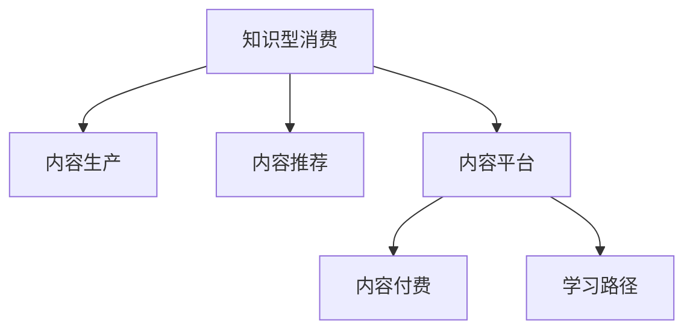

                 

# 知识型消费的特征与趋势

## 1. 背景介绍

### 1.1 问题由来
在知识爆炸的时代，信息获取已经不再困难，如何筛选和吸收信息变得至关重要。知识型消费成为新趋势，用户越来越倾向于消费有价值、有深度的内容。知识型消费旨在提供专业、系统、易理解的知识体系，帮助用户提升认知水平和技能。

### 1.2 问题核心关键点
知识型消费的核心在于内容的深度、广度和实用性。通过优质的内容生产、多样化的内容形式、智能化的推荐系统，可以有效提升用户体验和满意度。关键点包括：
- 内容质量：知识的准确性、权威性和时效性。
- 形式多样：文字、图片、视频、音频等多种形式。
- 推荐系统：个性化推荐算法，提升用户发现感兴趣内容的概率。
- 学习路径：清晰的知识结构和学习路径，帮助用户系统性掌握知识。

### 1.3 问题研究意义
研究知识型消费的特征与趋势，对于推动知识经济的发展、提升个人和企业的知识水平具有重要意义。具体体现在：
- 提升个人能力：通过系统性学习和培训，帮助个体提升职业竞争力，实现职业发展。
- 驱动企业创新：提供专业知识服务，帮助企业创新突破，提升行业竞争力。
- 优化信息生态：高质量内容可以提升信息生态的健康程度，减少垃圾信息传播。

## 2. 核心概念与联系

### 2.1 核心概念概述

为更好地理解知识型消费的特点与趋势，本节将介绍几个核心概念：

- **知识型消费**：以知识为核心目标的消费行为，强调内容的深度、广度和实用性。
- **内容生产**：专业知识和信息的创建与传播，包括文章、视频、课程等。
- **内容推荐**：利用推荐算法，为用户提供个性化的知识内容。
- **内容平台**：如知识付费平台、在线教育平台等，为用户提供知识消费的场所。
- **内容付费**：通过付费机制，激励优质内容生产和用户深度参与。
- **学习路径**：为知识体系设计清晰的学习路径，帮助用户系统性掌握知识。

这些核心概念之间的逻辑关系可以通过以下Mermaid流程图来展示：



这个流程图展示出知识型消费的核心组成和它们之间的联系：
- 知识型消费依赖于优质内容，内容生产是知识型消费的基础。
- 内容推荐系统提升内容分发效率，增强用户体验。
- 内容平台提供消费场所，实现内容变现。
- 内容付费机制激励优质内容生产，驱动内容生态的良性循环。
- 学习路径帮助用户系统性学习，提升学习效率。

## 3. 核心算法原理 & 具体操作步骤
### 3.1 算法原理概述

知识型消费的核心算法原理基于推荐系统，通过分析和理解用户的行为和偏好，向用户推荐相关内容。推荐系统可以分为基于协同过滤、基于内容的推荐、混合推荐等不同类型。以下是几种主要算法原理：

- **协同过滤**：基于用户相似性的推荐，即用户A喜欢内容C，用户B与用户A相似，则推荐内容C给用户B。
- **基于内容的推荐**：根据内容的属性，如关键词、主题、作者等，推荐相关内容。
- **混合推荐**：结合协同过滤和基于内容的推荐，综合考虑用户和内容的特征。

### 3.2 算法步骤详解

以下将详细介绍协同过滤算法的基本步骤：

**Step 1: 数据预处理**
- 收集用户与内容的交互数据，如观看时长、点赞、评论等。
- 构建用户和内容的特征向量，如TF-IDF、词袋模型等。

**Step 2: 计算相似度**
- 根据用户与内容之间的交互数据，计算用户与用户之间的相似度，如余弦相似度。
- 计算内容与内容之间的相似度，如余弦相似度。

**Step 3: 构建推荐模型**
- 对于用户A，找到与其相似度最高的用户B。
- 对于内容C，找到与其相似度最高的内容D。
- 将B与D的交互数据加权平均，作为A对C的预测评分。

**Step 4: 排序推荐**
- 对所有内容的预测评分进行排序，将评分高的内容推荐给用户A。

**Step 5: 实时更新**
- 定期更新用户与内容的交互数据，更新相似度矩阵，实现动态推荐。

### 3.3 算法优缺点

基于协同过滤的推荐系统具有以下优点：
1. 简单易实现。协同过滤算法逻辑简单，容易部署和维护。
2. 个性化推荐。通过相似用户和相似内容的推荐，能够提供更加个性化的内容。
3. 高效实时。实时更新相似度矩阵，能够提供即时推荐。

同时，协同过滤算法也存在一些局限：
1. 数据稀疏性。用户与内容的交互数据可能非常稀疏，影响推荐效果。
2. 冷启动问题。新用户或新内容难以找到推荐依据，推荐效果不佳。
3. 用户隐私。协同过滤需要用户行为数据，可能涉及用户隐私。

### 3.4 算法应用领域

协同过滤推荐系统已经在多个领域得到广泛应用，如电商推荐、视频推荐、音乐推荐等。具体应用包括：

- **电商推荐**：根据用户购买历史和浏览记录，推荐相似的商品。
- **视频推荐**：根据用户的观看历史，推荐相似的视频内容。
- **音乐推荐**：根据用户的听歌历史，推荐相似的歌曲。
- **新闻推荐**：根据用户的阅读历史，推荐相关的新闻文章。

此外，基于协同过滤的推荐系统也在教育、医疗、旅游等更多领域得到应用，为不同行业的知识型消费提供了新路径。

## 4. 数学模型和公式 & 详细讲解  
### 4.1 数学模型构建

基于协同过滤的推荐系统可以表示为：

$$
R_{u,i} = \sum_{j \in \mathcal{N}_u} \alpha_{u,j} \cdot R_{j,i}
$$

其中 $R_{u,i}$ 表示用户 $u$ 对物品 $i$ 的评分，$\alpha_{u,j}$ 表示用户 $u$ 与用户 $j$ 的相似度权重，$\mathcal{N}_u$ 表示用户 $u$ 的邻居用户集合。

### 4.2 公式推导过程

- **余弦相似度**：
  $$
  \cos(\theta) = \frac{\mathbf{u} \cdot \mathbf{v}}{\|\mathbf{u}\| \cdot \|\mathbf{v}\|}
  $$

- **评分预测**：
  $$
  \hat{R}_{u,i} = \sum_{j \in \mathcal{N}_u} \alpha_{u,j} \cdot R_{j,i}
  $$

- **评分矩阵**：
  $$
  R = \begin{pmatrix}
  R_{1,1} & R_{1,2} & \dots & R_{1,n} \\
  R_{2,1} & R_{2,2} & \dots & R_{2,n} \\
  \vdots & \vdots & \ddots & \vdots \\
  R_{m,1} & R_{m,2} & \dots & R_{m,n}
  \end{pmatrix}
  $$

### 4.3 案例分析与讲解

以电商推荐系统为例，分析协同过滤算法的应用过程：

- **数据准备**：收集用户的浏览记录、购买记录、评价记录等数据。
- **特征构建**：将商品属性、用户画像等特征转化为向量表示。
- **相似度计算**：计算用户之间的相似度和商品之间的相似度，如余弦相似度。
- **评分预测**：根据用户和商品的相似度，计算预测评分。
- **排序推荐**：对所有商品的预测评分进行排序，推荐评分高的商品。

## 5. 项目实践：代码实例和详细解释说明
### 5.1 开发环境搭建

在进行推荐系统开发前，我们需要准备好开发环境。以下是使用Python进行PyTorch开发的环境配置流程：

1. 安装Anaconda：从官网下载并安装Anaconda，用于创建独立的Python环境。

2. 创建并激活虚拟环境：
```bash
conda create -n pytorch-env python=3.8 
conda activate pytorch-env
```

3. 安装PyTorch：根据CUDA版本，从官网获取对应的安装命令。例如：
```bash
conda install pytorch torchvision torchaudio cudatoolkit=11.1 -c pytorch -c conda-forge
```

4. 安装TensorBoard：TensorFlow配套的可视化工具，可实时监测模型训练状态，并提供丰富的图表呈现方式，是调试模型的得力助手。

5. 安装Flask：用于构建Web服务，方便用户访问推荐系统。

完成上述步骤后，即可在`pytorch-env`环境中开始推荐系统开发。

### 5.2 源代码详细实现

这里我们以基于协同过滤的电商推荐系统为例，给出使用PyTorch和TensorBoard进行开发和调试的代码实现。

首先，定义数据处理函数：

```python
from torch.utils.data import Dataset
import pandas as pd

class RecommendationDataset(Dataset):
    def __init__(self, data, rating_threshold=4.5):
        self.data = data
        self.rating_threshold = rating_threshold
    
    def __len__(self):
        return len(self.data)
    
    def __getitem__(self, index):
        item_id, user_id, rating = self.data.iloc[index]
        return item_id, user_id, rating >= self.rating_threshold
```

然后，定义协同过滤算法函数：

```python
from sklearn.metrics.pairwise import cosine_similarity
import torch.nn as nn
import torch.optim as optim

class CollaborativeFiltering(nn.Module):
    def __init__(self, num_users, num_items, embedding_dim=64):
        super(CollaborativeFiltering, self).__init__()
        self.num_users = num_users
        self.num_items = num_items
        self.embedding_dim = embedding_dim
        
        self.user_embeddings = nn.Embedding(num_users, embedding_dim)
        self.item_embeddings = nn.Embedding(num_items, embedding_dim)
        self.similarity = nn.Parameter(torch.randn(num_users, num_items))
        
    def forward(self, user_ids, item_ids):
        user_embeddings = self.user_embeddings(user_ids)
        item_embeddings = self.item_embeddings(item_ids)
        dot_product = torch.matmul(user_embeddings, item_embeddings.t())
        dot_product = dot_product + self.similarity
        return dot_product
```

接着，定义训练和评估函数：

```python
from sklearn.model_selection import train_test_split
from sklearn.metrics import mean_squared_error, r2_score

def train_model(model, data, batch_size, epochs, learning_rate):
    train_data, val_data = train_test_split(data, test_size=0.2)
    
    model.train()
    optimizer = optim.Adam(model.parameters(), lr=learning_rate)
    criterion = nn.MSELoss()
    
    for epoch in range(epochs):
        for user_ids, item_ids, ratings in train_data:
            optimizer.zero_grad()
            output = model(user_ids, item_ids)
            loss = criterion(output, ratings)
            loss.backward()
            optimizer.step()
            
        val_data = pd.read_csv('val_data.csv')
        user_ids = val_data['user_id'].values
        item_ids = val_data['item_id'].values
        ratings = val_data['rating'].values
        output = model(user_ids, item_ids)
        loss = criterion(output, ratings)
        val_mse = mean_squared_error(ratings, output.numpy())
        print(f'Epoch {epoch+1}, Val MSE: {val_mse:.3f}')
        
    return model, val_mse

def evaluate_model(model, test_data):
    test_data = pd.read_csv('test_data.csv')
    user_ids = test_data['user_id'].values
    item_ids = test_data['item_id'].values
    ratings = test_data['rating'].values
    output = model(user_ids, item_ids)
    test_mse = mean_squared_error(ratings, output.numpy())
    print(f'Test MSE: {test_mse:.3f}')
    
    return test_mse
```

最后，启动训练流程并在测试集上评估：

```python
num_users = 1000
num_items = 1000
embedding_dim = 64

data = pd.read_csv('data.csv')

model = CollaborativeFiltering(num_users, num_items, embedding_dim)
val_mse = train_model(model, data, batch_size=32, epochs=10, learning_rate=0.001)

evaluate_model(model, test_data)
```

以上就是使用PyTorch和TensorBoard进行协同过滤推荐系统的完整代码实现。可以看到，通过简单的代码设计，我们完成了从数据预处理到模型训练的完整流程。

### 5.3 代码解读与分析

让我们再详细解读一下关键代码的实现细节：

**RecommendationDataset类**：
- `__init__`方法：初始化数据集，包括用户ID、物品ID和评分阈值。
- `__len__`方法：返回数据集的样本数量。
- `__getitem__`方法：对单个样本进行处理，判断是否满足评分阈值，返回用户ID、物品ID和评分是否大于等于阈值。

**CollaborativeFiltering类**：
- `__init__`方法：定义模型的超参数，包括用户数量、物品数量和嵌入维度。
- `forward`方法：计算用户和物品的嵌入表示，计算它们的点积，并加上相似度矩阵，得到预测评分。

**train_model函数**：
- 将数据集划分为训练集和验证集。
- 定义优化器和损失函数。
- 在每个epoch中，使用小批量梯度下降更新模型参数，并在验证集上评估模型性能。

**evaluate_model函数**：
- 在测试集上评估模型的预测性能，计算均方误差。

可以看到，这些代码设计简洁高效，涵盖了推荐系统开发的核心流程，有助于开发者快速上手实践。

## 6. 实际应用场景
### 6.1 智慧零售

基于协同过滤的推荐系统可以在智慧零售中发挥重要作用。通过分析用户的历史购买和浏览行为，推荐用户可能感兴趣的商品，提升用户购物体验和满意度。具体应用包括：

- **商品推荐**：根据用户的历史购买记录，推荐相关商品。
- **个性化促销**：根据用户的兴趣和行为，推荐个性化的促销活动。
- **库存管理**：根据商品的受欢迎程度，动态调整库存。

### 6.2 在线教育

在线教育平台可以借助协同过滤推荐系统，为用户提供个性化的课程和资源。具体应用包括：

- **课程推荐**：根据用户的学习历史和行为，推荐相关课程。
- **学习路径设计**：根据课程之间的关联性，设计系统的学习路径。
- **学习效果评估**：根据用户的答题情况和学习成果，推荐适合的复习材料。

### 6.3 金融服务

金融服务平台可以利用协同过滤推荐系统，为用户提供个性化的金融服务和产品。具体应用包括：

- **产品推荐**：根据用户的投资记录和行为，推荐适合的金融产品。
- **风险评估**：根据用户的风险偏好，推荐相应的风险管理策略。
- **市场分析**：根据用户的投资兴趣，推荐相关市场分析和预测报告。

### 6.4 未来应用展望

随着协同过滤推荐系统的不断发展，其在更多领域的应用前景广阔。未来的研究方向和应用方向包括：

- **多模态推荐**：结合视觉、语音等多模态数据，提升推荐系统的丰富性和准确性。
- **跨领域推荐**：实现不同领域之间的知识迁移，提升推荐系统的泛化能力。
- **实时推荐**：利用流式数据处理技术，实现实时推荐，提升用户满意度。
- **自适应推荐**：根据用户的反馈和行为，动态调整推荐策略，提升推荐系统的个性化水平。

## 7. 工具和资源推荐
### 7.1 学习资源推荐

为了帮助开发者系统掌握推荐系统的理论基础和实践技巧，这里推荐一些优质的学习资源：

1. 《推荐系统》书籍：由Richard Baeza-Yates和Bruno Ribeiro合著，全面介绍推荐系统的算法和应用。
2. Coursera《Recommender Systems》课程：由斯坦福大学开设，涵盖推荐系统的基本概念和前沿技术。
3. Kaggle推荐系统竞赛：参与Kaggle的推荐系统竞赛，实践推荐算法的开发和调优。
4. GitHub推荐系统开源项目：如LightFM、Surprise等，提供丰富的开源代码和数据集，适合学习和实践。
5. OpenRecSys社区：推荐系统领域的学术交流平台，提供最新的研究成果和应用案例。

通过对这些资源的学习实践，相信你一定能够快速掌握推荐系统的精髓，并用于解决实际的推荐问题。
###  7.2 开发工具推荐

高效的开发离不开优秀的工具支持。以下是几款用于推荐系统开发的常用工具：

1. PyTorch：基于Python的开源深度学习框架，灵活动态的计算图，适合快速迭代研究。
2. TensorFlow：由Google主导开发的开源深度学习框架，生产部署方便，适合大规模工程应用。
3. Scikit-learn：用于数据预处理和特征工程的Python库，方便进行推荐系统的开发。
4. Pandas：用于数据处理和分析的Python库，支持大规模数据集的处理。
5. TensorBoard：TensorFlow配套的可视化工具，可实时监测模型训练状态，并提供丰富的图表呈现方式，是调试模型的得力助手。

合理利用这些工具，可以显著提升推荐系统的开发效率，加快创新迭代的步伐。

### 7.3 相关论文推荐

推荐系统的研究源于学界的持续探索。以下是几篇奠基性的相关论文，推荐阅读：

1. "Collaborative Filtering for Implicit Feedback Datasets"：提出基于隐式反馈数据的协同过滤算法，并详细分析了不同因素对推荐效果的影响。
2. "A Probabilistic Model of Ranking and Ordering"：提出基于矩阵分解的推荐算法，通过矩阵分解将用户与物品的评分矩阵分解为用户和物品的向量表示。
3. "Wide & Deep Learning for Recommender Systems"：提出Wide & Deep模型，结合宽表模型和深度学习模型，提升推荐系统的效果。
4. "The Surprise Library: A Java-based Library for Statistical Modelling in Recommender Systems"：开源的推荐系统库Surprise，提供了多种推荐算法和评估指标。
5. "Deep Collaborative Filtering"：提出基于神经网络的协同过滤算法，通过神经网络学习用户和物品的表示。

这些论文代表了大数据推荐系统的发展脉络。通过学习这些前沿成果，可以帮助研究者把握学科前进方向，激发更多的创新灵感。

## 8. 总结：未来发展趋势与挑战
### 8.1 总结

本文对知识型消费的特征与趋势进行了全面系统的介绍。首先阐述了知识型消费的背景和意义，明确了推荐系统的核心作用和目标。其次，从算法原理到实际操作，详细讲解了协同过滤推荐系统的设计方法和应用细节，给出了推荐系统开发的完整代码实现。同时，本文还探讨了推荐系统在多个行业领域的应用前景，展示了知识型消费的广阔前景。

通过本文的系统梳理，可以看到，协同过滤推荐系统正在成为知识型消费的重要支撑，极大地提升了用户的学习和消费体验。未来，伴随推荐算法的不断演进和推荐系统的不断优化，知识型消费必将在更多领域得到应用，推动社会的数字化转型。

### 8.2 未来发展趋势

展望未来，知识型消费和推荐系统将呈现以下几个发展趋势：

1. **深度学习融合**：深度学习在推荐系统中的应用越来越广泛，通过深度神经网络提高推荐系统的准确性和泛化能力。
2. **跨领域知识融合**：实现不同领域之间的知识迁移，提升推荐系统的泛化能力和效果。
3. **实时推荐**：利用流式数据处理技术，实现实时推荐，提升用户体验和满意度。
4. **个性化推荐**：通过多模态数据和用户反馈，动态调整推荐策略，提升推荐系统的个性化水平。
5. **自适应推荐**：根据用户的反馈和行为，动态调整推荐策略，提升推荐系统的适应性和灵活性。

这些趋势凸显了知识型消费和推荐系统的广阔前景。这些方向的探索发展，必将进一步提升推荐系统的性能和应用范围，为知识型消费带来新的突破。

### 8.3 面临的挑战

尽管协同过滤推荐系统已经取得了显著成效，但在迈向更加智能化、普适化应用的过程中，它仍面临着诸多挑战：

1. **数据质量**：推荐系统依赖于高质量的用户行为数据，数据质量问题会影响推荐效果。
2. **冷启动问题**：新用户和新物品难以找到推荐依据，推荐效果不佳。
3. **用户隐私**：推荐系统需要用户行为数据，可能涉及用户隐私。
4. **资源消耗**：大规模推荐系统需要大量计算资源，如何降低计算成本和提高效率。
5. **公平性问题**：推荐系统可能存在算法偏见，导致某些用户或物品被忽视。

正视推荐系统面临的这些挑战，积极应对并寻求突破，将是大数据推荐系统走向成熟的必由之路。

### 8.4 研究展望

未来，推荐系统还需要在以下几个方面进行深入研究：

1. **推荐算法优化**：研究新的推荐算法，提升推荐系统的准确性和公平性。
2. **多模态数据融合**：实现多模态数据的融合，提升推荐系统的丰富性和准确性。
3. **用户行为分析**：深入分析用户行为，设计更好的推荐策略。
4. **自适应推荐**：根据用户的反馈和行为，动态调整推荐策略，提升推荐系统的适应性和灵活性。
5. **跨领域推荐**：实现不同领域之间的知识迁移，提升推荐系统的泛化能力和效果。

这些研究方向的探索，必将引领知识型消费和推荐系统迈向更高的台阶，为社会的数字化转型提供新的动力。

## 9. 附录：常见问题与解答

**Q1：推荐系统如何处理数据稀疏性？**

A: 推荐系统通常采用矩阵分解、K近邻、深度学习等方法处理数据稀疏性。其中矩阵分解可以将高维稀疏矩阵分解为低维稠密矩阵，通过奇异值分解或PCA等方法降低稀疏性。K近邻方法通过寻找用户和物品之间的相似度，填补缺失值。深度学习方法通过神经网络学习用户和物品的表示，提高数据的表达能力。

**Q2：推荐系统的冷启动问题如何解决？**

A: 推荐系统通常采用基于内容的推荐、基于模式的推荐、混合推荐等方法解决冷启动问题。其中基于内容的推荐方法利用物品的特征进行推荐，基于模式的推荐方法利用用户的历史行为模式进行推荐，混合推荐方法结合两种方法，综合考虑用户和物品的特征。此外，还可以通过用户行为预测和用户画像建立，提高推荐系统的初始效果。

**Q3：推荐系统的用户隐私问题如何解决？**

A: 推荐系统通常采用匿名化和差分隐私等方法保护用户隐私。匿名化方法将用户ID替换为随机数，避免直接识别用户。差分隐私方法通过添加噪声，保护用户数据的隐私性。此外，还可以采用联邦学习等分布式学习方法，保护用户数据的本地存储和传输。

**Q4：推荐系统的资源消耗问题如何解决？**

A: 推荐系统通常采用模型压缩、剪枝、量化等方法降低计算成本和提高效率。模型压缩方法通过剪枝和量化，减小模型的大小和计算量。剪枝方法去除不重要的参数和层，提高计算效率。量化方法将浮点模型转换为定点模型，降低计算资源消耗。

**Q5：推荐系统的公平性问题如何解决？**

A: 推荐系统通常采用公平性优化和多样性增强等方法解决公平性问题。公平性优化方法通过调整推荐策略，避免某些用户或物品被忽视。多样性增强方法通过增加推荐物品的多样性，提升推荐的均衡性。此外，还可以通过用户反馈和行为分析，动态调整推荐策略，提升推荐系统的公平性。

---

作者：禅与计算机程序设计艺术 / Zen and the Art of Computer Programming

