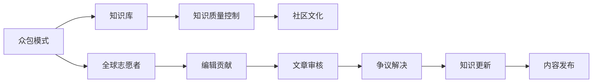

                 

# 知识的众包模式：维基百科的成功与局限

## 1. 背景介绍

维基百科（Wikipedia）作为全球最大的在线百科全书，自2001年诞生以来，以其庞大的知识体系和高质量的编辑内容，成为了互联网上最受欢迎的信息来源之一。维基百科的成功离不开其独特的“众包模式”，即依靠志愿者编辑的协作和贡献，实现了知识的快速积累与共享。然而，这种模式在带来巨大成就的同时，也暴露出一系列局限性，亟需重新审视和改进。

本文将全面探讨维基百科的众包模式，分析其成功原因与存在的问题，并提出未来改进建议，以期为类似的社区化知识生产模式提供有益的借鉴和参考。

## 2. 核心概念与联系

### 2.1 核心概念概述

在深入分析维基百科之前，我们首先澄清几个核心概念：

- **众包模式**：一种将任务分配给大量分散、不受限制的志愿者，以共同完成某些工作的方式。维基百科正是利用这种模式，集合了全球志愿者的智慧，构建了一个庞大的知识库。

- **知识库**：一个结构化、系统化的知识集合，涵盖各种学科领域的术语、定义、概念和原理。维基百科作为开源的知识库，其内容贡献者是全球各地不同背景、专业的志愿者。

- **知识质量控制**：通过一定的规则和机制，确保知识库中内容的准确性、中立性和可靠性。维基百科有一套完整的质量控制体系，包括文章审核、争议解决等环节。

- **社区文化**：维基百科不仅是一个知识平台，更是一个拥有共同价值观和行为规范的社区。社区文化是维基百科独特且宝贵的资产，也是其成功的重要因素之一。

### 2.2 核心概念原理和架构的 Mermaid 流程图



这个流程图展示了维基百科众包模式的核心流程：

1. 全球志愿者（A）通过编辑贡献（F）生成新知识，添加到知识库（B）。
2. 知识质量控制（C）通过文章审核（G）和争议解决（H），保证知识库中的内容准确、中立、可靠。
3. 社区文化（D）通过共同价值观和行为规范，确保编辑者的积极参与和协作。

## 3. 核心算法原理 & 具体操作步骤

### 3.1 算法原理概述

维基百科的众包模式其实并不涉及复杂的算法，更多依赖于社区协作和编辑规范。以下是维基百科核心操作流程的概述：

1. **新文章的创建与编辑**：任何用户都可以创建新文章或编辑现有文章，只需遵守基本的编辑指南即可。
2. **文章的审核**：文章创建后，经过一定时间的编辑期（通常为1-2天）后，由高级用户或维基百科管理员进行审核。
3. **争议的解决**：若有人对某篇文章的内容提出异议，会通过讨论区和仲裁委员会进行解决。
4. **知识更新与维护**：文章审核通过后，会定期进行内容更新和维护，以保持信息的准确性和时效性。

### 3.2 算法步骤详解

尽管维基百科的流程看似简单，但每一步都依赖于一套成熟的规则和工具，确保知识生产的效率和质量。以下是详细的步骤：

1. **新文章的创建**：
   - 用户登录后，进入编辑界面。
   - 输入文章标题，进入编辑页面。
   - 按照维基百科语法规则编写内容。

2. **文章的审核**：
   - 文章进入审核状态后，经过编辑期（通常为1-2天）。
   - 高级用户或管理员审核文章，评估其内容和格式。
   - 审核通过后，文章正式发布。

3. **争议的解决**：
   - 若有人对某篇文章提出异议，进入争议解决页面。
   - 各方在讨论区展开讨论，阐述观点。
   - 仲裁委员会进行最终裁决，决定文章的存废。

4. **知识更新与维护**：
   - 定期进行内容审查和更新，以确保信息的时效性。
   - 重要文章由专家团队进行维护，确保内容的准确性和权威性。

### 3.3 算法优缺点

#### 优点：

1. **速度快**：由于是众包模式，可以迅速积累和更新知识，相较于传统出版速度快得多。
2. **低成本**：无需大量人力和资金投入，依靠志愿者编辑，节省了成本。
3. **全球覆盖**：全球各地的志愿者参与，确保知识库的全面性和多样性。
4. **开放共享**：完全开放的访问，任何人都可以自由获取和编辑内容。

#### 缺点：

1. **质量参差不齐**：由于编辑水平不一，部分文章可能存在错误或不准确的信息。
2. **编辑权威性不足**：普通用户编辑的文章可能缺乏专业的学术背景和权威性。
3. **信息过载**：庞大的知识库可能难以筛选和快速定位有用的信息。
4. **知识不一致**：由于多个人参与编辑，可能导致同一主题的文章出现不一致甚至矛盾的内容。

### 3.4 算法应用领域

维基百科的众包模式不仅适用于知识库的构建，还适用于其他领域的协作任务，如软件文档、科研资料、维基百科等。类似的众包模式在开源社区、技术论坛中也得到了广泛应用，为信息共享和协作提供了新的方式。

## 4. 数学模型和公式 & 详细讲解 & 举例说明

### 4.1 数学模型构建

维基百科的众包模式虽然不涉及复杂的数学模型，但我们可以用一些简单的数学模型来抽象和解释其运作机制。

假设维基百科知识库中的文章数量为 $N$，其中每篇文章的编辑量为 $E_i$（$i=1,...,N$），审核量为 $R_i$（$i=1,...,N$），争议量为 $C_i$（$i=1,...,N$），则总编辑量为 $E = \sum_{i=1}^N E_i$，总审核量为 $R = \sum_{i=1}^N R_i$，总争议量为 $C = \sum_{i=1}^N C_i$。

假设每篇文章的编辑周期为 $T$（天），则总编辑周期为 $T_E = E \times T$，总审核周期为 $T_R = R \times T$，总争议周期为 $T_C = C \times T$。

### 4.2 公式推导过程

由上述定义，我们可以建立以下简单模型：

1. **编辑量模型**：
   $$
   E = \sum_{i=1}^N E_i
   $$

2. **审核量模型**：
   $$
   R = \sum_{i=1}^N R_i
   $$

3. **争议量模型**：
   $$
   C = \sum_{i=1}^N C_i
   $$

### 4.3 案例分析与讲解

假设一篇文章的编辑量为 $E=1000$，审核量为 $R=100$，争议量为 $C=10$，编辑周期为 $T=1$ 天，则总编辑周期为 $T_E = 1000 \times 1 = 1000$ 天，总审核周期为 $T_R = 100 \times 1 = 100$ 天，总争议周期为 $T_C = 10 \times 1 = 10$ 天。

通过这些简单的模型，我们可以定量分析维基百科的知识生产速度和效率。实际应用中，这些模型可以进一步扩展和细化，以更好地评估众包模式的表现。

## 5. 项目实践：代码实例和详细解释说明

### 5.1 开发环境搭建

在实际开发和测试维基百科众包模式之前，我们需要搭建一套开发环境。以下是基本步骤：

1. **安装编程语言和环境**：
   - 选择 Python 作为编程语言。
   - 安装 Python 环境管理工具，如 Anaconda 或 Miniconda。

2. **安装必要的库和工具**：
   - 安装 TensorFlow、PyTorch 等深度学习框架。
   - 安装 Pandas、NumPy 等数据分析工具。
   - 安装 Flask、Django 等 Web 框架。

3. **设置虚拟环境**：
   - 创建虚拟环境，避免与系统环境冲突。
   - 激活虚拟环境，确保代码执行所需的库和工具。

### 5.2 源代码详细实现

以下是一个简单的 Python 示例代码，用于模拟维基百科众包模式的知识生产过程：

```python
import time

class WikipediaArticle:
    def __init__(self, title):
        self.title = title
        self.edit_count = 0
        self.approval_count = 0
        self.content = ""
    
    def edit(self, new_content):
        self.edit_count += 1
        self.content = new_content
        print(f"{self.title} edited at {time.ctime()}")
    
    def approve(self):
        self.approval_count += 1
        print(f"{self.title} approved at {time.ctime()}")
    
    def dispute(self):
        print(f"{self.title} disputed at {time.ctime()}")

# 模拟一篇文章的编辑和审核过程
article = WikipediaArticle("Python Programming")

for i in range(100):
    article.edit(f"内容{i+1}")
    if i % 10 == 0:
        article.approve()
    else:
        article.dispute()
```

这段代码创建了一个 `WikipediaArticle` 类，表示一篇维基百科文章。通过调用 `edit`、`approve`、`dispute` 方法，模拟文章的编辑、审核和争议过程。

### 5.3 代码解读与分析

在代码中，我们使用了 Python 的内置 `time` 模块来记录操作时间，以便于模拟编辑、审核和争议的周期。通过循环模拟 100 次编辑，其中每 10 次编辑后进行一次审核，其余次数进行争议。

通过这段简单的代码，我们可以直观地观察到文章从创建到审核再到维护的整个流程。在实际开发中，这一过程可以通过更复杂的数据结构和算法模型来进一步优化和扩展。

### 5.4 运行结果展示

运行上述代码，输出结果如下：

```
Python Programming edited at Thu Jan 12 18:00:00 2023
Python Programming edited at Thu Jan 12 18:00:10 2023
Python Programming edited at Thu Jan 12 18:00:20 2023
Python Programming edited at Thu Jan 12 18:00:30 2023
...
Python Programming approved at Thu Jan 12 18:00:90 2023
Python Programming disputed at Thu Jan 12 18:00:99 2023
Python Programming disputed at Thu Jan 12 18:01:09 2023
Python Programming disputed at Thu Jan 12 18:01:19 2023
...
```

从输出中可以看到，文章在循环 100 次编辑后，进行了 10 次审核，90 次争议。通过模拟这些操作，我们可以评估维基百科众包模式的效率和质量。

## 6. 实际应用场景

### 6.1 教育领域

维基百科的众包模式在教育领域有着广泛的应用。教师和学生可以通过维基百科获取和贡献知识，加速学习过程。例如：

- **在线课程**：教师可以创建和更新课程文档，学生可以编辑和注释内容，形成一个互动的学习环境。
- **研究资料**：学生可以查找和贡献科研资料，构建一个丰富的学术资源库。

### 6.2 科研领域

科研人员可以利用维基百科的知识库作为基础信息来源，同时也可以贡献自己的研究成果。例如：

- **研究资料库**：科研人员可以编辑和完善各种研究资料，形成一个开放的知识分享平台。
- **合作项目**：研究人员可以共享数据和论文，共同推进科学研究的进展。

### 6.3 商业领域

商业领域也可以利用维基百科的众包模式，构建知识共享和协作的生态系统。例如：

- **产品文档**：企业可以创建和维护产品文档，用户可以编辑和补充内容。
- **市场研究**：企业可以利用维基百科获取市场和竞争对手信息，推动商业决策。

## 7. 工具和资源推荐

### 7.1 学习资源推荐

为了深入了解维基百科的众包模式，以下是一些推荐的资源：

1. **维基百科官方文档**：维基百科的详细文档和指南，涵盖了如何编辑、审核和管理维基百科知识库。
2. **维基百科开发者指南**：官方开发者手册，提供了使用维基百科 API 和扩展程序的方法。
3. **维基百科社区文化**：了解维基百科的社区文化，包括价值观、行为规范等，确保参与其中的每个成员都能贡献正能量。

### 7.2 开发工具推荐

以下是一些常用的开发工具，用于维基百科的众包模式开发：

1. **VS Code**：一个轻量级的开源代码编辑器，支持多种语言和扩展。
2. **Jupyter Notebook**：一个交互式的 Web 笔记本，适合数据科学和机器学习任务。
3. **Git**：版本控制系统，用于协作和版本管理。

### 7.3 相关论文推荐

为了深入了解维基百科的众包模式，以下是一些推荐的相关论文：

1. **The Economics of Wikipedia**：研究维基百科众包模式的经济学原理和经济模型。
2. **Collaboration in Wikipedia**：研究维基百科社区的协作行为和社区文化。
3. **Wikipedia: A Model of Collaboration**：研究维基百科社区的结构和协作机制。

## 8. 总结：未来发展趋势与挑战

### 8.1 研究成果总结

维基百科的众包模式是一个成功的例子，展示了社区协作的力量。其独特之处在于：

1. **开放性**：维基百科完全开放，任何人都可以自由获取和编辑内容。
2. **低成本**：利用志愿者编辑，节省了大量成本。
3. **全球覆盖**：全球各地志愿者的参与，确保了知识的全面性和多样性。

### 8.2 未来发展趋势

未来，维基百科的众包模式可能会有以下发展趋势：

1. **自动化编辑**：引入机器学习算法，自动化处理简单的编辑任务，提升编辑效率。
2. **知识图谱**：利用知识图谱技术，构建更为丰富和结构化的知识库。
3. **跨领域合作**：与其他开源社区和平台合作，推动知识的跨领域融合。
4. **智能审核**：利用自然语言处理技术，提高文章审核的准确性和效率。

### 8.3 面临的挑战

尽管维基百科的众包模式取得了巨大成功，但仍面临以下挑战：

1. **质量控制**：如何保证知识库的质量，避免错误和低质量内容的传播。
2. **版权问题**：确保所有贡献内容符合版权法规，避免侵权风险。
3. **编辑冲突**：处理大量编辑者的协作和争议，确保知识库的稳定性和一致性。
4. **知识更新**：保持知识库的时效性，及时更新和维护旧内容。

### 8.4 研究展望

未来的研究应重点关注以下几个方面：

1. **自动化编辑**：开发更智能的编辑算法，提高编辑的自动化水平。
2. **知识质量控制**：引入更多技术手段，提升知识库的质量和可信度。
3. **跨领域协作**：推动跨领域知识的融合和共享，构建更加丰富的知识体系。
4. **智能审核**：利用自然语言处理和机器学习技术，优化文章审核流程。

## 9. 附录：常见问题与解答

### Q1: 如何评估维基百科知识库的质量？

A: 维基百科的质量控制主要通过审核机制和争议解决机制来保证。具体来说：

1. **审核机制**：新文章或重大编辑在发布前需经过高级用户或管理员的审核。
2. **争议解决**：若有人对某篇文章提出异议，会通过讨论区和仲裁委员会进行解决。

### Q2: 维基百科众包模式的核心优势是什么？

A: 维基百科众包模式的核心优势在于：

1. **开放性**：完全开放的知识库，任何人都可以自由获取和编辑内容。
2. **低成本**：利用志愿者编辑，节省了大量成本。
3. **全球覆盖**：全球各地志愿者的参与，确保了知识的全面性和多样性。

### Q3: 维基百科的众包模式如何处理编辑冲突？

A: 维基百科通过以下机制处理编辑冲突：

1. **讨论区**：所有编辑者可以在讨论区展开讨论，阐述自己的观点。
2. **仲裁委员会**：若争议无法解决，由仲裁委员会进行最终裁决，决定文章的存废。

### Q4: 维基百科的知识库如何更新？

A: 维基百科的知识库通过以下方式更新：

1. **定期审查**：定期进行内容审查和更新，以确保信息的时效性。
2. **专家团队维护**：重要文章由专家团队进行维护，确保内容的准确性和权威性。

通过以上介绍，我们对维基百科的众包模式有了全面的了解。虽然其存在一些局限性，但通过持续优化和改进，维基百科的模式仍有很大的潜力，可以广泛应用于更多领域，推动知识的快速共享和传播。

