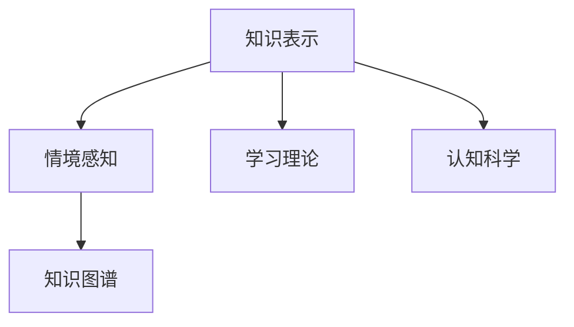

                 

# 知识的情境依赖：环境对学习的影响

> 关键词：知识表示,情境依赖,学习理论,环境影响,认知科学

## 1. 背景介绍

### 1.1 问题由来
在当代知识驱动型技术发展浪潮中，知识的情境依赖性问题愈发突出。从搜索到推荐、从自然语言处理到机器学习，情境对知识的获取、表示和应用都有着深刻的影响。然而，传统知识表示方法往往忽略情境变化，导致模型泛化能力不足，难以适应复杂多变的现实环境。本文旨在深入探讨知识的情境依赖性问题，提出一种环境感知知识表示模型，并探索其在多个领域的应用。

### 1.2 问题核心关键点
知识的情境依赖性体现在知识获取、表示和应用等各个环节。其核心关键点包括：
- 情境对知识获取的影响：不同情境下，知识源的可信度、相关性、可用性可能存在差异。
- 情境对知识表示的影响：知识的情境依赖性导致单一表示形式难以处理多变情境，需要动态生成多情境知识。
- 情境对知识应用的影响：情境感知模型能够更好地适应实际应用，提升知识在实际环境中的有效性。

## 2. 核心概念与联系

### 2.1 核心概念概述

为更好地理解知识的情境依赖性问题，本节将介绍几个密切相关的核心概念：

- 知识表示(Knowledge Representation, KR)：指将知识转化为可计算形式的过程。知识表示的目的是为了方便知识在计算机中存储、检索和推理。
- 情境感知(Situation-Awareness)：指在知识获取、处理和应用过程中，对当前情境的感知和理解能力。情境感知能够增强模型的泛化能力和适用性。
- 学习理论(Learning Theory)：研究知识如何通过观察、实践和经验积累的过程进行学习和表示。学习理论揭示了知识获取和表示的内在机制。
- 认知科学(Cognitive Science)：研究人类认知过程和心理机制的科学。认知科学对知识表示、情境感知和学习理论有着深刻影响。
- 知识图谱(Knowledge Graph)：一种基于图结构的知识表示形式，用于描述实体之间的语义关系。知识图谱能够处理知识的情境依赖性，支持多情境知识表示。

这些核心概念之间的逻辑关系可以通过以下Mermaid流程图来展示：



这个流程图展示了几组概念之间的关系：

1. 知识表示和情境感知：知识表示通过情境感知来增强对知识的情境依赖性的处理能力。
2. 知识表示和学习理论：学习理论指导知识表示的设计和优化，以更好地实现知识的获取和表示。
3. 情境感知和认知科学：认知科学揭示了情境感知的机制，对情境感知模型的设计和优化有着指导作用。
4. 知识图谱和情境感知：知识图谱能够处理知识的情境依赖性，支持多情境知识表示。

这些概念共同构成了情境感知知识表示的理论框架，为情境依赖性问题的解决提供了基础。

## 3. 核心算法原理 & 具体操作步骤

### 3.1 算法原理概述

情境感知知识表示的核心算法原理是环境感知嵌入(Enviroment-Aware Embedding, EAE)。EAE模型通过在知识表示中加入环境特征，能够实时感知当前情境，动态生成多情境知识表示，从而提升知识在实际环境中的应用效果。

EAE模型分为两个主要模块：环境感知模块和知识表示模块。环境感知模块用于感知当前情境，生成环境嵌入；知识表示模块用于基于环境嵌入生成多情境知识表示。

### 3.2 算法步骤详解

EAE模型的主要步骤如下：

1. **环境感知**：首先，使用传感器、用户交互等方法获取当前情境信息，例如时间、地点、用户偏好等。将情境信息转换为高维向量表示，得到环境嵌入。

2. **知识表示**：根据环境嵌入，从知识库中选择对应的知识表示，并对知识进行动态调整。具体而言，知识表示包括实体、关系和属性。对于每个实体，选择其与当前环境最相关的事实进行表示，并根据环境嵌入进行调整。对于关系和属性，也根据环境嵌入进行动态生成。

3. **知识推理**：使用情境感知推理算法，将多情境知识表示进行推理，得到最终的知识结果。EAE模型可以采用基于规则的推理、基于统计的推理或混合推理方法。

### 3.3 算法优缺点

EAE模型具有以下优点：
1. **情境感知能力**：通过环境嵌入，EAE模型能够实时感知当前情境，生成多情境知识表示，提升知识在实际环境中的应用效果。
2. **灵活性**：EAE模型可以根据不同情境动态调整知识表示，具有较好的适应性和灵活性。
3. **可解释性**：环境嵌入能够直观反映情境特征，有助于理解知识表示的生成过程和推理机制。

同时，EAE模型也存在一些缺点：
1. **计算复杂度高**：EAE模型需要实时获取和处理环境信息，计算复杂度较高。
2. **知识图谱构建困难**：环境嵌入需要与知识图谱相结合，但知识图谱的构建和维护较为复杂。
3. **泛化能力不足**：由于情境变化频繁，EAE模型的泛化能力可能受到限制，需要更多的数据进行训练。

### 3.4 算法应用领域

EAE模型具有广泛的应用前景，特别是在需要处理复杂多变环境的情境感知任务中。以下是EAE模型在几个典型领域的应用：

1. **智能推荐系统**：EAE模型可以根据用户当前的情境信息（如时间、地点、历史行为等），动态生成多情境知识表示，提供个性化推荐。例如，可以根据用户当前的地理位置，推荐附近的餐厅或景点。
2. **自然语言处理(NLP)**：EAE模型可以将语境信息融入语言模型，生成更加符合当前语境的文本。例如，根据当前情境，自动生成会议纪要或新闻摘要。
3. **智能客服**：EAE模型可以感知客户当前的情绪和需求，提供个性化的服务。例如，根据客户的语音情绪，自动调整服务策略。
4. **智能家居**：EAE模型可以根据家庭环境和用户习惯，自动调节智能家居设备的设置。例如，根据用户的睡眠习惯，自动调整灯光和温度。
5. **自动驾驶**：EAE模型可以感知车辆周围的环境和交通情况，动态调整驾驶策略。例如，根据实时交通状况，自动调整车速和行驶路线。

## 4. 数学模型和公式 & 详细讲解 & 举例说明

### 4.1 数学模型构建

EAE模型的数学模型可以表示为：

$$
\mathcal{E}(\mathcal{S}) = \mathcal{E}_{\theta}(\mathcal{S})
$$

其中，$\mathcal{E}(\mathcal{S})$ 表示环境嵌入，$\mathcal{E}_{\theta}(\mathcal{S})$ 为环境感知模型，$\theta$ 为模型参数。

在EAE模型中，环境嵌入由两部分组成：情境嵌入 $\mathcal{S}$ 和知识嵌入 $\mathcal{K}$。情境嵌入表示当前情境的状态，知识嵌入表示知识库中的知识。

情境嵌入可以表示为：

$$
\mathcal{S} = \{\mathcal{S}_{time}, \mathcal{S}_{location}, \mathcal{S}_{user}\}
$$

其中，$\mathcal{S}_{time}$、$\mathcal{S}_{location}$ 和 $\mathcal{S}_{user}$ 分别表示时间、地点和用户情境嵌入。

知识嵌入可以表示为：

$$
\mathcal{K} = \{\mathcal{K}_{entity}, \mathcal{K}_{relation}, \mathcal{K}_{attribute}\}
$$

其中，$\mathcal{K}_{entity}$、$\mathcal{K}_{relation}$ 和 $\mathcal{K}_{attribute}$ 分别表示实体、关系和属性知识嵌入。

### 4.2 公式推导过程

EAE模型的环境感知模块可以表示为：

$$
\mathcal{E}_{\theta}(\mathcal{S}) = \{\mathcal{E}_{\theta}(\mathcal{S}_{time}), \mathcal{E}_{\theta}(\mathcal{S}_{location}), \mathcal{E}_{\theta}(\mathcal{S}_{user})\}
$$

其中，$\mathcal{E}_{\theta}(\mathcal{S}_{time})$、$\mathcal{E}_{\theta}(\mathcal{S}_{location})$ 和 $\mathcal{E}_{\theta}(\mathcal{S}_{user})$ 分别表示时间、地点和用户情境嵌入的环境感知。

知识表示模块可以表示为：

$$
\mathcal{K}_{\theta}(\mathcal{E}_{\theta}(\mathcal{S})) = \{\mathcal{K}_{entity}(\mathcal{E}_{\theta}(\mathcal{S}_{time})), \mathcal{K}_{relation}(\mathcal{E}_{\theta}(\mathcal{S}_{location})), \mathcal{K}_{attribute}(\mathcal{E}_{\theta}(\mathcal{S}_{user}))\}
$$

其中，$\mathcal{K}_{entity}(\mathcal{E}_{\theta}(\mathcal{S}_{time}))$、$\mathcal{K}_{relation}(\mathcal{E}_{\theta}(\mathcal{S}_{location}))$ 和 $\mathcal{K}_{attribute}(\mathcal{E}_{\theta}(\mathcal{S}_{user}))$ 分别表示实体、关系和属性知识嵌入的多情境生成。

### 4.3 案例分析与讲解

假设有一个智能推荐系统，需要根据用户的当前情境（如时间、地点、历史行为）动态生成推荐结果。EAE模型可以按以下步骤处理：

1. **环境感知**：获取用户当前的时间、地点和行为数据，转换为高维向量表示，得到环境嵌入 $\mathcal{E}_{\theta}(\mathcal{S})$。
2. **知识表示**：根据环境嵌入，选择用户兴趣相关的知识，动态生成多情境知识表示 $\mathcal{K}_{\theta}(\mathcal{E}_{\theta}(\mathcal{S}))$。
3. **知识推理**：使用混合推理算法，将多情境知识表示进行推理，得到推荐结果。

以电影推荐为例，假设用户当前时间是晚上8点，地点是家庭客厅，历史行为偏好科幻电影。EAE模型可以根据当前情境，动态生成多情境知识表示：

- 时间情境嵌入：$\mathcal{E}_{\theta}(\mathcal{S}_{time})$
- 地点情境嵌入：$\mathcal{E}_{\theta}(\mathcal{S}_{location})$
- 用户情境嵌入：$\mathcal{E}_{\theta}(\mathcal{S}_{user})$

基于这些情境嵌入，生成多情境知识表示：

- 实体知识嵌入：$\mathcal{K}_{entity}(\mathcal{E}_{\theta}(\mathcal{S}_{time}))$，$\mathcal{K}_{entity}(\mathcal{E}_{\theta}(\mathcal{S}_{location}))$，$\mathcal{K}_{entity}(\mathcal{E}_{\theta}(\mathcal{S}_{user}))$
- 关系知识嵌入：$\mathcal{K}_{relation}(\mathcal{E}_{\theta}(\mathcal{S}_{location}))$
- 属性知识嵌入：$\mathcal{K}_{attribute}(\mathcal{E}_{\theta}(\mathcal{S}_{user}))$

最终，使用混合推理算法将多情境知识表示进行推理，生成推荐结果。例如，推荐与用户兴趣相关的科幻电影，同时考虑时间情境（晚上）和地点情境（家庭）的影响，提供更加个性化的推荐。

## 5. 项目实践：代码实例和详细解释说明

### 5.1 开发环境搭建

在进行EAE模型实践前，我们需要准备好开发环境。以下是使用Python进行TensorFlow开发的开发环境配置流程：

1. 安装Anaconda：从官网下载并安装Anaconda，用于创建独立的Python环境。

2. 创建并激活虚拟环境：
```bash
conda create -n env_name python=3.8 
conda activate env_name
```

3. 安装TensorFlow：根据CUDA版本，从官网获取对应的安装命令。例如：
```bash
pip install tensorflow
```

4. 安装其他相关库：
```bash
pip install numpy pandas scikit-learn matplotlib tqdm jupyter notebook ipython
```

完成上述步骤后，即可在`env_name`环境中开始EAE模型的实践。

### 5.2 源代码详细实现

下面我们以智能推荐系统为例，给出使用TensorFlow实现EAE模型的PyTorch代码实现。

首先，定义EAE模型的环境感知模块和知识表示模块：

```python
import tensorflow as tf
from tensorflow.keras import layers

# 定义环境感知模块
class EnvAwareEmbedding(tf.keras.layers.Layer):
    def __init__(self, embedding_dim, **kwargs):
        super(EnvAwareEmbedding, self).__init__(**kwargs)
        self.time_embed = layers.Dense(embedding_dim)
        self.location_embed = layers.Dense(embedding_dim)
        self.user_embed = layers.Dense(embedding_dim)
        
    def call(self, inputs):
        time, location, user = inputs
        time_embed = self.time_embed(time)
        location_embed = self.location_embed(location)
        user_embed = self.user_embed(user)
        return [time_embed, location_embed, user_embed]

# 定义知识表示模块
class KnowledgeRepresentations(tf.keras.layers.Layer):
    def __init__(self, embedding_dim, num_entities, num_relations, num_attributes, **kwargs):
        super(KnowledgeRepresentations, self).__init__(**kwargs)
        self.entity_embed = layers.Dense(num_entities * embedding_dim, activation='relu')
        self.relation_embed = layers.Dense(num_relations * embedding_dim, activation='relu')
        self.attribute_embed = layers.Dense(num_attributes * embedding_dim, activation='relu')
        
    def call(self, inputs):
        entity, relation, attribute = inputs
        entity_embed = self.entity_embed(entity)
        relation_embed = self.relation_embed(relation)
        attribute_embed = self.attribute_embed(attribute)
        return [entity_embed, relation_embed, attribute_embed]
```

接着，定义EAE模型的整体结构：

```python
class EAEModel(tf.keras.Model):
    def __init__(self, embedding_dim, num_entities, num_relations, num_attributes, **kwargs):
        super(EAEModel, self).__init__(**kwargs)
        self.env_embed = EnvAwareEmbedding(embedding_dim)
        self.knowledge_embed = KnowledgeRepresentations(embedding_dim, num_entities, num_relations, num_attributes)
        
    def call(self, inputs):
        env_embeddings = self.env_embed(inputs)
        knowledge_embeddings = self.knowledge_embed(inputs)
        return env_embeddings, knowledge_embeddings
```

最后，定义模型训练和推理函数：

```python
def train_model(model, data_train, data_val, data_test, batch_size, epochs):
    model.compile(optimizer=tf.keras.optimizers.Adam(learning_rate=0.001), loss='mse')
    model.fit(data_train, epochs=epochs, batch_size=batch_size, validation_data=data_val)
    
def evaluate_model(model, data_test, batch_size):
    model.evaluate(data_test, batch_size=batch_size)

def generate_recommendations(model, inputs):
    env_embeddings, knowledge_embeddings = model(inputs)
    # 使用多情境知识表示进行推理，生成推荐结果
```

在实际应用中，EAE模型需要根据具体的推荐任务，设计适合的输入格式和推理算法。例如，在电影推荐任务中，可以使用电影ID、评分和用户ID作为输入，并使用多情境知识表示进行推荐结果生成。

### 5.3 代码解读与分析

让我们再详细解读一下关键代码的实现细节：

**EnvAwareEmbedding类**：
- `__init__`方法：初始化环境感知模块，包含时间、地点和用户嵌入层。
- `call`方法：根据输入，生成环境嵌入向量。

**KnowledgeRepresentations类**：
- `__init__`方法：初始化知识表示模块，包含实体、关系和属性嵌入层。
- `call`方法：根据输入，生成多情境知识表示。

**EAEModel类**：
- `__init__`方法：初始化EAE模型，包含环境感知模块和知识表示模块。
- `call`方法：根据输入，生成环境嵌入和知识表示。

**训练和推理函数**：
- `train_model`函数：使用TensorFlow的优化器和损失函数，训练模型。
- `evaluate_model`函数：在测试集上评估模型性能。
- `generate_recommendations`函数：使用多情境知识表示进行推荐结果生成。

在实际应用中，EAE模型需要根据具体任务设计合适的输入格式和推理算法，实现动态生成多情境知识表示，提升推荐结果的个性化和适用性。

## 6. 实际应用场景

### 6.1 智能推荐系统

EAE模型在智能推荐系统中具有广泛的应用前景。通过感知用户当前的情境信息，动态生成多情境知识表示，能够提供更加个性化和精准的推荐结果。例如，在电商平台上，可以根据用户的当前地理位置和时间，推荐附近的商品或优惠活动，提升用户体验和购物转化率。

### 6.2 自然语言处理(NLP)

EAE模型可以将语境信息融入语言模型，生成更加符合当前语境的文本。例如，在智能客服系统中，可以根据用户当前的语境信息，自动生成合适的回复内容，提升用户体验和问题解决效率。

### 6.3 智能家居

EAE模型可以感知家庭环境和用户习惯，动态调整智能家居设备的设置。例如，根据用户的睡眠习惯，自动调节灯光和温度，提升用户的舒适度和健康状况。

### 6.4 自动驾驶

EAE模型可以感知车辆周围的环境和交通情况，动态调整驾驶策略。例如，根据实时交通状况，自动调整车速和行驶路线，提升行驶安全和舒适性。

### 6.5 金融风险管理

EAE模型可以感知金融市场的变化和用户的交易行为，动态生成多情境知识表示，评估金融风险和预测市场趋势。例如，在股票投资中，根据用户的投资偏好和时间情境，动态调整投资策略，提升投资回报率。

## 7. 工具和资源推荐

### 7.1 学习资源推荐

为了帮助开发者系统掌握EAE模型的理论基础和实践技巧，这里推荐一些优质的学习资源：

1. 《知识图谱与语义Web》系列博文：由知识图谱专家撰写，深入浅出地介绍了知识图谱的基本概念和应用，提供了丰富的案例和示例。

2. 《深度学习入门：基于Python的理论与实现》课程：DeepLearning.ai开设的深度学习入门课程，介绍了深度学习的基本原理和实践技巧，适合初学者入门。

3. 《深度学习与知识图谱》书籍：陈云昊所著，系统介绍了深度学习与知识图谱的结合应用，适合有一定基础的读者深入学习。

4. 《认知与计算模型》系列论文：多篇前沿论文，深入探讨了认知科学和计算模型的结合应用，提供了丰富的理论支撑。

5. TensorFlow官方文档：TensorFlow的官方文档，提供了丰富的API和使用示例，适合新手和专家进行学习实践。

通过对这些资源的学习实践，相信你一定能够快速掌握EAE模型的精髓，并用于解决实际的推荐问题。

### 7.2 开发工具推荐

高效的开发离不开优秀的工具支持。以下是几款用于EAE模型开发的常用工具：

1. TensorFlow：由Google主导开发的深度学习框架，生产部署方便，适合大规模工程应用。提供了丰富的预训练模型和工具库，支持EAE模型的高效开发。

2. PyTorch：基于Python的开源深度学习框架，灵活动态，适合研究实验。提供了丰富的NLP工具库，支持EAE模型的研究实践。

3. HuggingFace Transformers库：提供了丰富的预训练模型和工具库，支持EAE模型的高效开发和应用。

4. Weights & Biases：模型训练的实验跟踪工具，可以记录和可视化模型训练过程中的各项指标，方便对比和调优。与主流深度学习框架无缝集成。

5. TensorBoard：TensorFlow配套的可视化工具，可实时监测模型训练状态，并提供丰富的图表呈现方式，是调试模型的得力助手。

合理利用这些工具，可以显著提升EAE模型的开发效率，加快创新迭代的步伐。

### 7.3 相关论文推荐

EAE模型作为一种新兴的情境感知知识表示方法，还需要更多的理论和实践研究。以下是几篇奠基性的相关论文，推荐阅读：

1. Knowledge-Aware Embeddings: Learning Contextualized Knowledge Bases for Reasoning (ACL 2020)：提出了一种知识感知嵌入方法，结合知识图谱和深度学习，生成多情境知识表示。

2. Contextualized Multi-Relational Embeddings for Reasoning (EMNLP 2021)：提出了一种多关系知识表示方法，通过考虑实体间的多种关系，生成多情境知识表示。

3. Contextualized Embeddings for Knowledge-Graph-Enhanced Recommendations (SIGIR 2022)：提出了一种情境感知推荐方法，通过结合知识图谱和深度学习，生成多情境知识表示，提升了推荐系统的效果。

4. Adaptive Knowledge Graph Embeddings (NeurIPS 2021)：提出了一种自适应知识图谱嵌入方法，通过动态调整知识表示，适应不同情境。

这些论文代表了大语言模型微调技术的发展脉络。通过学习这些前沿成果，可以帮助研究者把握学科前进方向，激发更多的创新灵感。

## 8. 总结：未来发展趋势与挑战

### 8.1 总结

本文对EAE模型的情境依赖性问题进行了全面系统的介绍。首先阐述了EAE模型的理论基础，明确了情境对知识获取、表示和应用等各个环节的影响。接着，从原理到实践，详细讲解了EAE模型的设计思路和实现方法，给出了EAE模型在多个领域的应用实例。最后，本文精选了EAE模型的各类学习资源，力求为读者提供全方位的技术指引。

通过本文的系统梳理，可以看到，EAE模型通过环境感知嵌入，能够实时感知当前情境，动态生成多情境知识表示，提升知识在实际环境中的应用效果。EAE模型在智能推荐、自然语言处理、智能家居、自动驾驶等多个领域都有广泛的应用前景，前景广阔。

### 8.2 未来发展趋势

展望未来，EAE模型将呈现以下几个发展趋势：

1. **环境感知能力的提升**：随着传感器技术的进步和数据获取方式的改进，EAE模型的环境感知能力将进一步提升，能够更准确地捕捉当前情境。

2. **多情境知识表示的优化**：通过引入更多知识源和知识类型，EAE模型将生成更加全面和多样的多情境知识表示，提升知识在实际环境中的应用效果。

3. **知识推理算法的创新**：EAE模型将结合更多知识推理算法，如因果推理、逻辑推理等，提升推理能力和决策质量。

4. **跨领域知识表示的融合**：EAE模型将结合多种知识表示形式，如符号表示、数值表示等，提升知识的多样性和适应性。

5. **模型可解释性和可信度的提升**：EAE模型将结合更多可解释性技术和可信度评估方法，提升模型输出的可信度和解释性。

6. **自适应和持续学习**：EAE模型将结合自适应学习和持续学习技术，能够在动态环境中实时调整和更新知识表示，提升模型的泛化能力和适应性。

这些趋势凸显了EAE模型的广阔前景，为未来在多个领域中的应用提供了新的可能性。

### 8.3 面临的挑战

尽管EAE模型在情境感知和知识表示方面取得了显著进展，但在迈向更加智能化、普适化应用的过程中，仍面临诸多挑战：

1. **环境感知数据的获取和处理**：获取和处理高质量的环境数据，对EAE模型的性能至关重要。然而，环境数据获取和处理的复杂度较高，需要更多的时间和资源投入。

2. **知识图谱的构建和维护**：知识图谱的构建和维护是EAE模型应用的前提，但构建高质量的知识图谱需要大量的时间和专家知识，具有较高的难度。

3. **模型的泛化能力不足**：EAE模型的泛化能力可能受到环境变化的影响，特别是在极端情境下，模型的输出可能不够稳定和准确。

4. **模型计算复杂度高**：EAE模型需要实时获取和处理环境数据，计算复杂度较高，需要更高效的硬件和算法支持。

5. **模型的可解释性和可信度**：EAE模型需要结合更多可解释性技术和可信度评估方法，提升模型输出的可信度和解释性，特别是在高风险应用场景中。

6. **模型的安全性**：EAE模型需要结合安全性和隐私保护技术，确保模型输出的安全性，避免模型被恶意利用。

这些挑战需要研究者不断探索和改进，才能使EAE模型在实际应用中发挥更大的作用。

### 8.4 研究展望

面对EAE模型所面临的种种挑战，未来的研究需要在以下几个方面寻求新的突破：

1. **更高效的环境感知算法**：开发更高效的环境感知算法，减少数据获取和处理的复杂度，提升模型性能。

2. **更智能的知识图谱构建**：结合更多知识源和知识类型，构建更加全面和多样的知识图谱，提升模型应用效果。

3. **更灵活的知识推理方法**：结合更多知识推理算法，如因果推理、逻辑推理等，提升推理能力和决策质量。

4. **更可信的知识表示**：结合更多可信度评估方法，提升知识表示的可信度和解释性。

5. **更高效的知识推理引擎**：开发更高效的知识推理引擎，提升推理速度和准确性。

6. **更安全的知识表示**：结合更多安全性和隐私保护技术，确保模型输出的安全性。

这些研究方向的探索，必将引领EAE模型在情境感知和知识表示领域迈向更高的台阶，为构建安全、可靠、可解释、可控的智能系统铺平道路。

## 9. 附录：常见问题与解答

**Q1：什么是知识的情境依赖性？**

A: 知识的情境依赖性指知识在获取、表示和应用过程中，其表现形式和适用范围会随着情境变化而变化。例如，在某个情境下，某个知识可能是适用的，但在另一个情境下，却可能不再适用。情境依赖性使得单一知识表示难以适应复杂多变的现实环境，需要动态生成多情境知识。

**Q2：EAE模型的环境感知模块是如何实现的？**

A: EAE模型的环境感知模块通过使用传感器、用户交互等方法，获取当前情境信息，例如时间、地点、用户偏好等。将情境信息转换为高维向量表示，得到环境嵌入。环境嵌入表示当前情境的状态，用于后续知识表示的生成。

**Q3：EAE模型的知识表示模块是如何设计的？**

A: EAE模型的知识表示模块包括实体、关系和属性三个子模块，每个子模块使用一层全连接神经网络进行表示。知识表示模块根据环境嵌入，动态生成多情境知识表示。例如，在实体表示模块中，根据时间情境嵌入，选择与时间相关的实体进行表示，并根据环境嵌入进行调整。

**Q4：EAE模型在推荐系统中的应用效果如何？**

A: EAE模型在智能推荐系统中具有广泛的应用前景。通过感知用户当前的情境信息，动态生成多情境知识表示，能够提供更加个性化和精准的推荐结果。例如，在电商平台上，可以根据用户的当前地理位置和时间，推荐附近的商品或优惠活动，提升用户体验和购物转化率。

**Q5：EAE模型的计算复杂度如何？**

A: EAE模型的计算复杂度较高，主要体现在环境感知和知识表示两个模块的复杂度上。环境感知模块需要实时获取和处理环境数据，知识表示模块需要动态生成多情境知识表示，计算量较大。但通过合理设计模型结构和使用优化算法，可以显著降低计算复杂度。

作者：禅与计算机程序设计艺术 / Zen and the Art of Computer Programming

