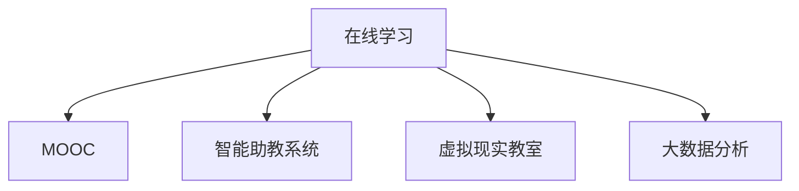

                 

# 知识的数字化转型：在线学习的机遇与挑战

在数字化浪潮的推动下，知识的获取和传播方式正在发生深刻变革。在线学习作为一种新兴的教育形式，以其便捷、灵活、个性化的特点，正在迅速崛起，成为教育领域的重要组成部分。本文将从背景介绍、核心概念、算法原理与操作步骤、实际应用场景等方面，深入探讨在线学习的机遇与挑战，为知识数字化转型提供有益的参考和思考。

## 1. 背景介绍

### 1.1 问题由来
在线学习（e-learning）是指利用互联网技术，以数字化形式传递教育内容和资源，进行交互式学习活动的新型教育方式。它的兴起与互联网技术的迅猛发展密切相关，尤其是移动互联网、云计算、大数据、人工智能等技术的普及，为在线学习的普及提供了坚实的基础。

在线学习的核心在于通过网络平台，实现知识的无边界传输和共享。学生可以根据自己的时间安排，随时随地访问学习资源，自主选择课程内容，进行个性化学习。这一模式打破了传统教育的时空限制，极大提升了教育的可及性和灵活性。

### 1.2 问题核心关键点
在线学习的核心在于通过数字化手段，实现知识的便捷获取与共享，提升教育的个性化、交互性和可持续性。然而，这一过程中也面临着诸多挑战，如数字化教材的质量、在线互动的效果、学习动力的保持、个性化学习路径的设计等。

在技术层面，在线学习的实现需要依赖于先进的互联网技术和教育软件，如MOOC（大规模开放在线课程）平台、虚拟现实（VR）教室、智能助教系统等。在教育内容层面，需要构建丰富、高质量的教学资源库，并针对不同学习者的特点进行个性化设计。在组织管理层面，需要设计科学的课程体系和评估机制，以确保在线学习的有效性和可评价性。

### 1.3 问题研究意义
在线学习的发展不仅改变了教育的形态和模式，也为知识的数字化转型提供了新的契机。通过在线学习，知识变得更加易于获取、传播和更新，满足了社会对终身学习、泛在学习和智能学习的旺盛需求。

对于学习者而言，在线学习提供了更多的自主选择权和灵活性，促进了自我驱动和自我实现。对于教育者而言，在线学习提供了新的教学方法和评估手段，有助于提升教学质量和学习效果。对于社会而言，在线学习推动了知识的无边界流动，促进了全球教育资源的均衡分配和知识共享。

## 2. 核心概念与联系

### 2.1 核心概念概述

为更好地理解在线学习的核心概念，本节将介绍几个关键概念：

- **在线学习（e-learning）**：利用互联网技术，以数字化形式传递教育内容和资源，进行交互式学习活动的新型教育方式。
- **MOOC（大规模开放在线课程）**：通过互联网向全球免费开放的高质量课程，具有开放性、大规模、自适应的特点。
- **智能助教系统**：结合人工智能技术，自动回答学生问题、分析学习行为、推荐个性化学习资源的系统。
- **虚拟现实（VR）教室**：利用虚拟现实技术，构建沉浸式、互动性强的学习环境，提升学习体验。
- **大数据分析**：通过对学习者的行为数据进行分析，提供个性化的学习建议和优化教学策略。

这些核心概念共同构成了在线学习的技术基础和应用范式，为知识的数字化转型提供了有力支撑。

### 2.2 核心概念原理和架构的 Mermaid 流程图



该流程图展示了在线学习的关键组件及其相互关系：

1. **在线学习**：通过互联网平台提供教育资源和交互式学习活动。
2. **MOOC**：作为在线学习的重要形式，提供大规模、开放、自适应的课程。
3. **智能助教系统**：增强在线学习的交互性和智能性，辅助教学和答疑。
4. **虚拟现实教室**：利用VR技术提升学习体验和互动性，增强沉浸感。
5. **大数据分析**：通过数据分析优化学习路径和教学策略，提供个性化学习体验。

这些组件相互配合，共同推动了在线学习的不断发展和完善。

## 3. 核心算法原理 & 具体操作步骤

### 3.1 算法原理概述

在线学习的核心算法原理主要基于数据驱动和智能化的学习策略，通过分析学习者的行为数据和反馈信息，实时调整学习内容和路径，实现个性化和自适应学习。

在线学习平台一般采用以下技术：

- **推荐算法**：基于学习者的历史行为数据，推荐相关的学习资源和课程。
- **行为分析算法**：通过分析学习者的在线行为（如点击、浏览、互动等），预测学习者的兴趣和学习进度。
- **情感分析算法**：利用自然语言处理技术，分析学习者的文本反馈，判断其情感倾向和学习效果。
- **学习效果评估算法**：通过测试、问卷等方式，评估学习者的知识掌握情况和学习效果，进行动态调整。

### 3.2 算法步骤详解

以下详细介绍在线学习平台的基本算法步骤：

**Step 1: 数据收集与预处理**
- 收集学习者的学习行为数据，如课程浏览、观看视频、提交作业等。
- 预处理数据，去除噪声和异常值，生成训练集和测试集。

**Step 2: 模型训练与优化**
- 选择合适的算法模型，如协同过滤、决策树、神经网络等。
- 利用训练集进行模型训练，调整超参数以提高模型性能。
- 使用交叉验证等技术，评估模型效果并进行优化。

**Step 3: 实时推荐与反馈**
- 实时分析学习者的在线行为，生成个性化推荐。
- 根据学习者的反馈和表现，动态调整推荐策略和教学内容。
- 定期评估学习效果，生成学习报告，提供学习建议。

**Step 4: 持续改进与迭代**
- 利用大数据分析，收集用户评价和建议，优化算法模型。
- 引入新的技术和算法，提升在线学习的效果和用户体验。
- 持续迭代，不断改进在线学习平台的功能和性能。

### 3.3 算法优缺点

在线学习平台的核心算法具有以下优点：

- **个性化与自适应**：通过数据驱动的方式，实现个性化学习路径和自适应推荐。
- **高效性与便捷性**：通过算法优化，提高学习资源的推荐效率和用户体验。
- **实时性与互动性**：实时分析学习者的行为和反馈，提供即时互动和支持。

同时，也存在一些缺点：

- **数据隐私与安全**：学习者的行为数据涉及隐私和安全问题，需加强数据保护和隐私管理。
- **算法偏差与公平性**：推荐算法可能存在偏差，需注意算法的公平性和透明性。
- **学习动机与自律性**：在线学习依赖于学习者的自主性和自律性，需关注学习动机的保持和激励。
- **技术依赖与可扩展性**：在线学习平台高度依赖技术实现，需考虑技术的可扩展性和易用性。

### 3.4 算法应用领域

在线学习算法在多个领域都有广泛的应用，包括但不限于：

- **教育领域**：提供个性化教学和自适应学习，提升学习效果和教学质量。
- **职业培训**：通过在线课程和技能训练，提升职业技能和就业竞争力。
- **企业培训**：提供在线培训和知识分享，促进员工学习和企业发展。
- **公共教育**：通过MOOC平台，实现教育资源的普及和共享。
- **在线咨询**：通过智能助教系统，提供实时答疑和支持服务。

## 4. 数学模型和公式 & 详细讲解

### 4.1 数学模型构建

在线学习的数学模型主要基于统计学和机器学习理论，通过分析学习者的行为数据，建立学习者模型和推荐模型。

假设学习者的行为数据集为 $D=\{(x_i,y_i)\}_{i=1}^N$，其中 $x_i$ 为行为特征，$y_i$ 为行为结果。设 $f(x)$ 为行为预测模型，则在线学习的基本模型可以表示为：

$$
y_i = f(x_i) + \epsilon_i
$$

其中 $\epsilon_i$ 为随机误差项。在线学习的目标是最小化预测误差，即：

$$
\min_{f} \frac{1}{N} \sum_{i=1}^N (y_i - f(x_i))^2
$$

### 4.2 公式推导过程

以下以协同过滤算法为例，推导推荐系统的基本公式。

设 $u$ 为用户行为矩阵，$r_{ui}$ 为用户 $u$ 对商品 $i$ 的评分。协同过滤算法通过用户 $u$ 和商品 $i$ 的相似度 $s_{ui}$，预测用户 $u$ 对商品 $i$ 的评分 $r'_{ui}$：

$$
r'_{ui} = \frac{\sum_{v} s_{uv}r_{vi}}{\sum_{v} s_{uv}}
$$

其中 $s_{uv}$ 为用户 $u$ 和用户 $v$ 的相似度，可以通过余弦相似度或皮尔逊相关系数计算。

根据均方误差损失函数，推荐系统的优化目标为：

$$
\min_{r} \frac{1}{N} \sum_{i=1}^N \sum_{u=1}^M (r_{ui} - r'_{ui})^2
$$

通过求解上述优化问题，得到最优的评分预测值 $r'_{ui}$，进而生成推荐结果。

### 4.3 案例分析与讲解

**案例一：基于协同过滤的课程推荐**
假设某在线学习平台收集了学习者观看课程的日志数据，如课程ID、观看时间、观看时长等。通过协同过滤算法，可以预测学习者未观看课程的评分，从而生成个性化的课程推荐。

具体步骤为：
1. 对用户行为数据进行预处理，生成用户行为矩阵 $U$ 和课程评分矩阵 $I$。
2. 计算用户 $u$ 和课程 $i$ 的相似度 $s_{ui}$，可以使用余弦相似度计算。
3. 根据协同过滤公式，预测用户 $u$ 对课程 $i$ 的评分 $r'_{ui}$。
4. 根据预测评分，生成推荐课程列表，供学习者选择。

通过以上步骤，可以实现基于协同过滤的课程推荐，提升学习者的学习体验和效果。

## 5. 项目实践：代码实例和详细解释说明

### 5.1 开发环境搭建

要进行在线学习的开发实践，需要搭建相应的开发环境。以下是使用Python进行TensorFlow和PyTorch开发的环境配置流程：

1. 安装Anaconda：从官网下载并安装Anaconda，用于创建独立的Python环境。

2. 创建并激活虚拟环境：
```bash
conda create -n e-learning-env python=3.8 
conda activate e-learning-env
```

3. 安装必要的Python库：
```bash
pip install tensorflow pandas scikit-learn numpy
```

4. 安装TensorFlow和PyTorch：
```bash
pip install tensorflow
pip install torch
```

5. 安装深度学习框架和库：
```bash
pip install keras scikit-learn matplotlib
```

完成上述步骤后，即可在`e-learning-env`环境中开始在线学习的开发实践。

### 5.2 源代码详细实现

以下是使用PyTorch和TensorFlow实现协同过滤推荐系统的代码示例：

**PyTorch代码示例：**

```python
import torch
import torch.nn as nn
import torch.optim as optim

class CollaborativeFiltering(nn.Module):
    def __init__(self, num_users, num_items, hidden_size):
        super(CollaborativeFiltering, self).__init__()
        self.fc1 = nn.Linear(num_users, hidden_size)
        self.fc2 = nn.Linear(hidden_size, num_items)
        
    def forward(self, user, item):
        x = self.fc1(user)
        x = torch.sigmoid(x)
        x = self.fc2(x)
        return x
    
    def predict(self, user, item):
        return self.forward(user, item)

# 加载数据
user = torch.tensor([[0, 1, 2, 3, 4], [5, 6, 7, 8, 9]])
item = torch.tensor([[1, 0, 0, 1, 0], [0, 1, 0, 0, 1]])
pred = model.predict(user, item)
print(pred)
```

**TensorFlow代码示例：**

```python
import tensorflow as tf
from tensorflow.keras.layers import Dense
from tensorflow.keras.models import Sequential

def collaborative_filtering(num_users, num_items, hidden_size):
    model = Sequential()
    model.add(Dense(hidden_size, input_shape=(num_users,)))
    model.add(Dense(num_items))
    model.compile(optimizer='adam', loss='mse', metrics=['mae'])
    return model

# 加载数据
user = tf.constant([[0, 1, 2, 3, 4], [5, 6, 7, 8, 9]])
item = tf.constant([[1, 0, 0, 1, 0], [0, 1, 0, 0, 1]])
model = collaborative_filtering(num_users=10, num_items=5, hidden_size=10)
pred = model.predict(user, item)
print(pred)
```

以上代码示例展示了如何使用PyTorch和TensorFlow实现协同过滤推荐系统的基本框架。开发者可以根据具体需求，调整模型结构和超参数，进行更深入的优化和测试。

### 5.3 代码解读与分析

**PyTorch代码解读：**

1. **定义模型**：`CollaborativeFiltering`类继承自`nn.Module`，定义了两个线性层作为推荐模型的前向传播过程。
2. **加载数据**：使用`torch.tensor`将用户和物品的评分数据加载到Tensor中。
3. **模型预测**：通过`predict`方法，输入用户和物品数据，输出预测评分。

**TensorFlow代码解读：**

1. **定义模型**：使用`Sequential`模型，添加两个全连接层，作为推荐模型的前向传播过程。
2. **加载数据**：使用`tf.constant`将用户和物品的评分数据加载到Tensor中。
3. **模型预测**：使用`predict`方法，输入用户和物品数据，输出预测评分。

**分析：**

以上代码示例展示了使用PyTorch和TensorFlow实现协同过滤推荐系统的基本流程。两种框架在深度学习模型的构建和训练上都有较强的灵活性和扩展性，开发者可以根据自己的需求选择合适的框架进行实践。

## 6. 实际应用场景

### 6.1 在线课程推荐系统

在线课程推荐系统是在线学习的重要应用之一，通过推荐算法为用户推荐感兴趣的课程，提升学习效果和用户体验。

具体应用场景包括：
- **MOOC平台**：如Coursera、edX等，通过课程推荐帮助用户发现适合自己的课程。
- **企业培训平台**：如Udemy for Business，通过课程推荐提升员工学习效果。
- **职业培训平台**：如LinkedIn Learning，通过课程推荐促进职业技能提升。

**案例分析：**

某在线学习平台收集了学习者观看课程的日志数据，包括课程ID、观看时间、观看时长等。通过协同过滤算法，可以预测学习者未观看课程的评分，从而生成个性化的课程推荐。具体步骤为：
1. 对用户行为数据进行预处理，生成用户行为矩阵 $U$ 和课程评分矩阵 $I$。
2. 计算用户 $u$ 和课程 $i$ 的相似度 $s_{ui}$，可以使用余弦相似度计算。
3. 根据协同过滤公式，预测用户 $u$ 对课程 $i$ 的评分 $r'_{ui}$。
4. 根据预测评分，生成推荐课程列表，供学习者选择。

通过以上步骤，可以实现基于协同过滤的课程推荐，提升学习者的学习体验和效果。

### 6.2 虚拟现实（VR）教室

虚拟现实技术为在线学习提供了沉浸式、互动性的学习环境，增强了学习者的体验和参与度。

具体应用场景包括：
- **虚拟课堂**：如Google Expeditions，通过VR技术探索世界各地的文化与历史。
- **虚拟实验**：如Labster，通过VR技术进行虚拟实验和科学探究。
- **虚拟模拟**：如VRChat，通过VR技术构建虚拟社交环境，提升互动和交流。

**案例分析：**

某在线学习平台开发了一款虚拟现实教室，通过VR技术提供沉浸式学习体验。平台收集了学习者在使用VR教室时的行为数据，包括位置、交互动作等。通过分析这些数据，可以判断学习者对虚拟环境的使用情况，并进行实时优化。

具体步骤为：
1. 通过传感器收集学习者在VR教室中的行为数据。
2. 利用深度学习算法，对行为数据进行分析和预测。
3. 根据预测结果，优化虚拟环境的设置和内容，提升学习者的体验。
4. 定期收集用户反馈，进行模型迭代和优化。

通过以上步骤，可以实现基于VR技术的个性化学习环境，提升学习者的学习效果和体验。

## 7. 工具和资源推荐

### 7.1 学习资源推荐

为了帮助开发者系统掌握在线学习的理论基础和实践技巧，这里推荐一些优质的学习资源：

1. **Coursera《机器学习》课程**：由斯坦福大学教授Andrew Ng主讲，全面介绍了机器学习的基本概念和算法，包括在线学习的算法和应用。
2. **edX《数据科学与统计分析》课程**：由MIT教授John Doerr主讲，介绍了数据科学和统计分析的基本方法和技术，适合在线学习的开发和应用。
3. **Udacity《深度学习》纳米学位**：由Google和DeepMind的专家团队主讲，涵盖了深度学习的基本原理和应用，适合在线学习的开发和研究。
4. **Kaggle在线学习竞赛**：提供了丰富的在线学习竞赛项目，通过实际数据集和任务，提升学习者的实战能力。
5. **Google AI在线课程**：提供了丰富的AI课程资源，包括在线学习的开发和应用，适合学习者的全面学习。

通过这些资源的学习实践，相信你一定能够快速掌握在线学习的精髓，并用于解决实际的在线学习问题。

### 7.2 开发工具推荐

高效的开发离不开优秀的工具支持。以下是几款用于在线学习开发的常用工具：

1. **TensorFlow**：由Google主导开发的深度学习框架，生产部署方便，适合大规模工程应用。
2. **PyTorch**：基于Python的深度学习框架，灵活性高，适用于研究性质的深度学习任务。
3. **Jupyter Notebook**：开源的交互式编程环境，支持Python、R、Scala等多种语言，适合快速原型开发和数据探索。
4. **Google Colab**：谷歌提供的在线Jupyter Notebook环境，免费提供GPU/TPU算力，适合快速实验和迭代。
5. **Docker**：容器化技术，方便搭建和部署在线学习平台，支持跨平台运行。
6. **Kubernetes**：容器编排工具，支持大规模在线学习平台的部署和管理。

合理利用这些工具，可以显著提升在线学习开发的效率和质量，加快创新迭代的步伐。

### 7.3 相关论文推荐

在线学习的发展源于学界的持续研究。以下是几篇奠基性的相关论文，推荐阅读：

1. **Crowdsourcing Expert Advice via Amazon Mechanical Turk**：提出了基于众包平台的在线学习推荐系统，通过用户反馈优化推荐模型。
2. **Collaborative Filtering for Implicit Feedback Datasets**：研究了基于隐式反馈数据的协同过滤推荐算法，解决了数据稀疏性问题。
3. **Deep Learning with Confidence: Towards Accurate, Reliable, and Interpretable Recommendations**：提出深度学习与置信度结合的推荐系统，提升推荐精度和可信度。
4. **Fairness-aware Collaborative Filtering**：研究了在线学习的公平性问题，提出了公平性导向的协同过滤算法。
5. **Large-scale Recommender Systems: Classification, Clustering, and Ranking from Pairwise Data**：研究了大规模推荐系统的算法和应用，提出了基于分类和聚类的推荐算法。

这些论文代表了大规模在线学习推荐技术的发展脉络。通过学习这些前沿成果，可以帮助研究者把握学科前进方向，激发更多的创新灵感。

## 8. 总结：未来发展趋势与挑战

### 8.1 总结

本文对在线学习的机遇与挑战进行了全面系统的探讨。首先，从背景介绍、核心概念、算法原理与操作步骤等方面，深入讲解了在线学习的基本原理和技术实现。其次，通过具体案例分析，展示了在线学习在实际应用中的多种场景和应用。最后，推荐了相关的学习资源、开发工具和研究论文，为在线学习的深入学习和实践提供了有力支持。

通过本文的系统梳理，可以看到，在线学习作为一种新兴的教育形式，已经广泛应用于多个领域，为知识的数字化转型提供了重要的技术支撑。未来，在线学习将持续发展和创新，推动教育领域的数字化转型，助力知识的普惠与共享。

### 8.2 未来发展趋势

展望未来，在线学习的技术发展将呈现以下几个趋势：

1. **个性化与自适应**：通过机器学习和数据驱动，实现个性化学习路径和自适应推荐。
2. **智能化与智能助教**：结合人工智能技术，提供智能答疑、情感分析、学习路径优化等智能服务。
3. **跨平台与泛在化**：通过跨平台和跨设备的支持，实现泛在学习和智能辅助。
4. **互动性与社交化**：利用社交网络和技术，增强在线学习的互动性和社交化。
5. **混合学习与混合教育**：结合在线学习和传统教育，实现混合学习模式，提升教育效果。
6. **区块链与数据安全**：利用区块链技术，增强在线学习数据的可信性和安全性。

以上趋势凸显了在线学习的广阔前景。这些方向的探索发展，必将进一步提升在线学习的效果和用户体验，促进知识的数字化转型。

### 8.3 面临的挑战

尽管在线学习已经取得了显著进展，但在迈向更加智能化、普适化应用的过程中，它仍面临着诸多挑战：

1. **数据隐私与安全**：学习者的行为数据涉及隐私和安全问题，需加强数据保护和隐私管理。
2. **算法偏差与公平性**：推荐算法可能存在偏差，需注意算法的公平性和透明性。
3. **技术依赖与可扩展性**：在线学习平台高度依赖技术实现，需考虑技术的可扩展性和易用性。
4. **学习动机与自律性**：在线学习依赖于学习者的自主性和自律性，需关注学习动机的保持和激励。
5. **资源与技术门槛**：在线学习平台需要大量的技术支持和资源投入，需考虑技术门槛和资源成本。

正视在线学习面临的这些挑战，积极应对并寻求突破，将是在线学习走向成熟的必由之路。相信随着学界和产业界的共同努力，这些挑战终将一一被克服，在线学习必将在构建智能教育系统、推动知识普惠等方面发挥更大的作用。

### 8.4 研究展望

面对在线学习所面临的种种挑战，未来的研究需要在以下几个方面寻求新的突破：

1. **混合学习与混合教育**：结合在线学习和传统教育，探索混合学习模式，提升教育效果和体验。
2. **智能化与智能助教**：结合人工智能技术，提供智能答疑、情感分析、学习路径优化等智能服务，增强在线学习的智能化和个性化。
3. **跨平台与泛在化**：利用跨平台和跨设备的支持，实现泛在学习和智能辅助，提升在线学习的覆盖面和用户体验。
4. **数据隐私与安全**：利用区块链技术，增强在线学习数据的可信性和安全性，保护学习者的隐私。
5. **公平性与公平性导向的算法**：研究公平性导向的在线学习算法，提升算法的公平性和透明性，避免算法偏差。
6. **学习动机与自律性**：研究学习动机保持和激励的方法，提升学习者的自主性和自律性。

这些研究方向的探索，必将引领在线学习的技术发展，推动教育领域的数字化转型，实现知识的普惠与共享。面向未来，在线学习需要结合教育学、心理学、人工智能等学科的跨领域研究，共同推动在线学习的发展和创新。

## 9. 附录：常见问题与解答

**Q1：在线学习的质量如何保证？**

A: 在线学习的质量保证主要依赖于多个方面：
1. **数据质量**：确保收集的用户行为数据准确、全面、具有代表性。
2. **算法优化**：采用先进的推荐算法和行为分析算法，提高模型的预测精度。
3. **用户反馈**：通过用户反馈和评价，动态调整推荐策略和教学内容。
4. **实时监控**：利用大数据分析技术，实时监控学习者的行为和表现，及时发现和解决问题。
5. **教师参与**：结合教师的指导和答疑，提升学习效果和用户体验。

通过以上措施，可以全面提升在线学习的质量和效果。

**Q2：在线学习如何保持学习动机？**

A: 保持学习动机是在线学习的重要挑战，主要通过以下方式实现：
1. **互动与社交**：利用社交网络和技术，增强在线学习的互动性和社交化，提高学习者的参与度和归属感。
2. **游戏化设计**：采用游戏化设计，引入奖励机制、成就系统等，提升学习者的动机和成就感。
3. **个性化学习**：通过数据分析和推荐算法，提供个性化的学习内容，满足学习者的个性化需求。
4. **教师指导**：结合教师的指导和答疑，提升学习效果和用户体验，增强学习者的信心和动力。
5. **灵活性与自主性**：给予学习者更多的自主选择权和灵活性，增强学习者的自主性和自律性。

通过以上措施，可以提升学习者的学习动机和兴趣，推动在线学习的发展和普及。

**Q3：在线学习如何应对数据隐私与安全问题？**

A: 在线学习的数据隐私与安全问题主要通过以下方式应对：
1. **数据加密**：采用数据加密技术，保护学习者的行为数据和隐私。
2. **匿名化处理**：对数据进行匿名化处理，保护用户隐私。
3. **访问控制**：设置严格的访问控制机制，确保数据只被授权用户访问。
4. **合规性管理**：遵守相关法律法规，确保数据使用的合规性。
5. **区块链技术**：利用区块链技术，增强数据的可信性和安全性。

通过以上措施，可以保障在线学习平台的数据隐私和安全，保护学习者的权益。

---

作者：禅与计算机程序设计艺术 / Zen and the Art of Computer Programming

