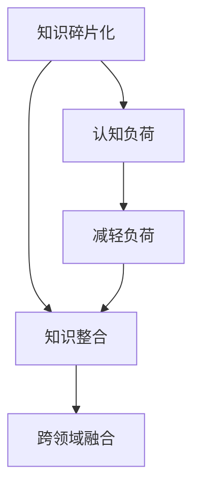

                 

# 知识的碎片化与整合：信息时代的认知挑战

## 1. 背景介绍

### 1.1 问题由来

在信息爆炸的时代，知识以指数级的速度增长，呈现出碎片化的趋势。传统的学科体系正被打破，单一领域的知识边界逐渐模糊，跨学科的交叉融合日益增多。这种知识碎片化的现象，不仅改变了知识的获取方式和传播途径，更对人类的认知能力提出了新的挑战。

现代科技的发展，特别是信息技术的进步，使得知识的获取更加便捷。搜索引擎、在线课程、知识图谱等工具，使得每个人都能够随时获取各类信息。但与此同时，知识的复杂性和多样性也带来了认知上的挑战。如何从海量知识中筛选、整合、提取有效信息，成为当下研究的一个重要课题。

### 1.2 问题核心关键点

1. **知识碎片化**：在互联网时代，信息无处不在，每个领域都产生了大量的知识点。如何从这些知识点中识别出有价值的知识，进行系统化的整合，是当前知识管理的核心问题。
2. **认知负荷**：人类大脑在处理碎片化知识时，面临极大的认知负荷。如何在保持高效认知的同时，有效整合新知识，避免信息过载，是信息时代认知研究的重点。
3. **知识应用**：碎片化知识如何转化为实际应用能力，是知识整合研究的终极目标。如何通过结构化的方法，将知识应用于复杂问题解决，是知识管理的挑战所在。
4. **跨领域融合**：知识整合不仅仅局限于单一领域，更需要在不同领域间进行跨学科的融合，形成新的知识体系。

### 1.3 问题研究意义

研究知识的碎片化与整合，对于提升人类的认知能力、促进知识管理、推动科技发展具有重要意义：

1. **提升认知效率**：通过科学的知识整合方法，能够显著提升人类的认知效率，减少信息过载带来的认知负担，使知识更易于获取和应用。
2. **优化知识管理**：合理的知识整合机制，能够帮助企业和机构更有效地管理和利用知识资源，提升创新能力和竞争力。
3. **促进科技发展**：跨领域的知识融合，能够催生新的知识体系和创新技术，推动科学技术进步和社会经济发展。

## 2. 核心概念与联系

### 2.1 核心概念概述

为更好地理解知识的碎片化与整合，本节将介绍几个密切相关的核心概念：

- **知识碎片化**：在信息时代，随着互联网的普及，知识以碎片化的形式广泛分布。单个知识点通常规模较小，相互关联性不强，需要通过一定的方式进行整合。
- **知识整合**：通过将零散的知识点进行系统化处理，建立知识之间的关联和结构，形成完整的知识体系。
- **认知负荷**：人类在处理大量信息时，大脑需要消耗大量资源，形成认知负荷。有效的知识整合能够减轻这种负担，提高认知效率。
- **跨领域融合**：知识整合不仅仅是将不同领域的知识点进行拼接，更重要的是通过跨领域融合，形成新的知识体系。

这些核心概念之间的逻辑关系可以通过以下Mermaid流程图来展示：



这个流程图展示了几大核心概念之间的内在联系：

1. 知识碎片化是信息时代的普遍现象。
2. 知识整合能够将零散的知识点系统化，减轻认知负荷。
3. 跨领域融合是知识整合的重要目标，通过不同领域的融合，形成新的知识体系。

## 3. 核心算法原理 & 具体操作步骤
### 3.1 算法原理概述

知识的碎片化与整合，本质上是一个信息处理的优化问题。其核心思想是通过算法将分散的知识点进行系统化处理，建立知识点之间的联系，形成完整、系统的知识体系。

在知识整合过程中，通常需要考虑以下几个方面：

- **知识表示**：将知识点转化为计算机可以处理的格式，如语义网络、知识图谱等。
- **知识关联**：通过算法建立知识点之间的关联，形成知识图谱等结构化数据。
- **知识融合**：将不同来源的知识点进行融合，形成新的、更有价值的知识。
- **认知负荷减轻**：通过算法减轻人类在处理大量信息时的认知负荷，提高学习效率。

### 3.2 算法步骤详解

知识整合的算法一般包括以下几个关键步骤：

**Step 1: 知识获取**

- 通过搜索引擎、在线课程、文献库等途径，获取各类知识点。
- 对这些知识点进行清洗、筛选，去除冗余和不相关的信息，保留有价值的知识点。

**Step 2: 知识表示**

- 将知识点转化为计算机可处理的格式。常用的知识表示方法包括语义网络、知识图谱等。
- 使用RDF（资源描述框架）等标准语言，描述知识点之间的关联关系。

**Step 3: 知识关联**

- 通过算法建立知识点之间的关联，形成知识图谱。
- 常见的知识关联算法包括共现分析、共引分析、语义相似度计算等。

**Step 4: 知识融合**

- 将不同来源的知识点进行融合，形成新的、更有价值的知识。
- 常见的知识融合算法包括聚类、集成学习、深度学习等。

**Step 5: 认知负荷减轻**

- 通过算法减轻人类在处理大量信息时的认知负荷，提高学习效率。
- 常见的认知负荷减轻算法包括信息压缩、多维度信息显示等。

**Step 6: 知识应用**

- 将整合后的知识应用于实际问题解决。
- 常见的知识应用方法包括问题求解、知识推理、决策支持等。

### 3.3 算法优缺点

知识的碎片化与整合算法具有以下优点：

1. **高效性**：通过算法将知识点系统化处理，能够显著提升知识获取和整合的效率。
2. **系统性**：知识整合能够建立知识点之间的关联，形成完整、系统的知识体系。
3. **适用性广**：知识整合算法适用于各类领域和应用场景，能够帮助不同领域进行知识管理。
4. **可扩展性**：知识整合算法具有较好的可扩展性，能够随着知识量的增加而不断完善。

同时，该算法也存在一定的局限性：

1. **复杂度**：知识整合过程涉及大量计算和处理，算法复杂度较高。
2. **数据质量依赖**：知识整合的效果很大程度上依赖于数据质量，低质量的数据会严重影响整合结果。
3. **人机交互**：知识整合过程需要大量人工干预，费时费力，影响效率。
4. **应用难度**：将整合后的知识应用于实际问题解决，需要根据具体问题进行适配，应用难度较大。

尽管存在这些局限性，但就目前而言，知识的碎片化与整合算法仍然是大规模知识管理的重要手段。未来相关研究的重点在于如何进一步提高算法的效率和可扩展性，降低对人工干预的依赖，提高知识整合的效果和适用性。

### 3.4 算法应用领域

知识的碎片化与整合算法在多个领域中得到了广泛应用，涵盖以下应用：

- **知识管理**：帮助企业和机构有效管理和利用知识资源，提升创新能力和竞争力。
- **信息检索**：通过知识整合，提升信息检索的精度和召回率，满足用户的信息需求。
- **智能问答系统**：将整合后的知识应用于智能问答系统，提供更精准、全面的答案。
- **推荐系统**：通过知识整合，提升推荐系统的准确性和个性化程度。
- **决策支持**：将整合后的知识应用于决策支持系统，辅助决策者进行决策分析。
- **知识图谱构建**：利用知识整合算法，构建各类知识图谱，辅助知识管理和应用。

## 4. 数学模型和公式 & 详细讲解  
### 4.1 数学模型构建

本节将使用数学语言对知识整合的过程进行更加严格的刻画。

记知识点集合为 $K$，每个知识点 $k$ 表示为一个三元组 $(u, r, v)$，其中 $u$ 和 $v$ 分别表示主实体和客实体，$r$ 表示实体之间的关系。

定义知识点 $k_1$ 和 $k_2$ 之间的相似度为 $s(k_1, k_2)$，用于衡量两者之间的关联强度。常见的相似度计算方法包括余弦相似度、Jaccard相似度、Path Similarity 等。

定义知识图谱 $G=(K,E)$，其中 $E$ 表示实体之间的关系集。知识图谱可以通过 RDF 等标准语言描述，如：

```RDF
<http://example.org/people> <http://www.w3.org/2000/01/rdf-schema#subClassOf> <http://example.org/Person>
<http://example.org/people> <http://www.w3.org/2000/01/rdf-schema#subClassOf> <http://example.org/Citizen>
<http://example.org/people> <http://www.w3.org/2000/01/rdf-schema#subClassOf> <http://example.org/GovernmentEmployee>
```

### 4.2 公式推导过程

以下我们以知识图谱构建为例，推导知识整合的数学公式。

设知识图谱 $G=(K,E)$，其中 $K=\{k_1, k_2, ..., k_n\}$，$E=\{(k_1, r_1, k_2), (k_1, r_2, k_3), ..., (k_n, r_m, k_{n+1})\}$。

定义知识点 $k_1$ 和 $k_2$ 之间的相似度为 $s(k_1, k_2)$，则知识图谱的完整度 $C$ 可以表示为：

$$
C = \frac{\sum_{k_1 \in K} \sum_{k_2 \in K} s(k_1, k_2)}{|K|^2}
$$

其中 $|K|$ 为知识点的总数。

知识图谱的凝聚性 $S$ 可以表示为：

$$
S = \frac{\sum_{(k_1, r, k_2) \in E} s(k_1, k_2)}{|E|}
$$

其中 $|E|$ 为关系数的总数。

知识图谱的稠密度 $D$ 可以表示为：

$$
D = \frac{\sum_{(k_1, r, k_2) \in E} s(k_1, k_2)}{2|K|(|K|-1)}
$$

通过这些指标，可以衡量知识图谱的结构完整性和凝聚性。

### 4.3 案例分析与讲解

假设有一个关于食物的知识点图谱，包含了食物类别、营养价值、来源等信息。我们可以使用知识整合算法，构建一个关于食物的知识图谱，用于信息检索和推荐系统。

**Step 1: 知识获取**

- 从互联网上抓取各类食物信息，包括食物名称、营养成分、产地等。
- 对抓取的信息进行清洗、筛选，去除冗余和不相关的信息，保留有价值的知识点。

**Step 2: 知识表示**

- 将每个食物的信息转化为三元组形式，如 $(食物名称, 营养成分, 营养价值)$。
- 使用 RDF 等标准语言描述知识点之间的关联关系，如：

```RDF
<http://example.org/apple> <http://example.org/hasNutrient> <http://example.org/vitaminC>
<http://example.org/apple> <http://example.org/hasNutrient> <http://example.org/calories>
```

**Step 3: 知识关联**

- 通过共现分析、共引分析等算法，建立知识点之间的关联。
- 使用 Path Similarity 等方法，计算知识点之间的相似度，构建知识图谱。

**Step 4: 知识融合**

- 将不同来源的知识点进行融合，形成新的、更有价值的知识。
- 使用深度学习等方法，对知识图谱进行迭代优化，提高知识融合的精度和准确性。

**Step 5: 认知负荷减轻**

- 通过信息压缩、多维度信息显示等方法，减轻人类在处理大量信息时的认知负荷。
- 将知识图谱应用到推荐系统和信息检索中，提高系统效率和用户体验。

## 5. 项目实践：代码实例和详细解释说明
### 5.1 开发环境搭建

在进行知识整合实践前，我们需要准备好开发环境。以下是使用Python进行RDF框架进行知识图谱构建的环境配置流程：

1. 安装Anaconda：从官网下载并安装Anaconda，用于创建独立的Python环境。

2. 创建并激活虚拟环境：
```bash
conda create -n rdf-env python=3.8 
conda activate rdf-env
```

3. 安装PyRDF2Vec：
```bash
pip install pyrdf2vec
```

4. 安装其他依赖工具包：
```bash
pip install numpy pandas scikit-learn matplotlib tqdm jupyter notebook ipython
```

完成上述步骤后，即可在`rdf-env`环境中开始知识图谱构建实践。

### 5.2 源代码详细实现

这里我们以知识图谱构建为例，给出使用PyRDF2Vec构建知识图谱的Python代码实现。

首先，定义RDF图谱的节点和关系：

```python
from pyrdf2vec import RDF2Vec

g = RDF2Vec()
g.add_triple(("<http://example.org/apple>", "<http://www.w3.org/2000/01/rdf-schema#subClassOf>", "<http://example.org/fruit>")
g.add_triple(("<http://example.org/apple>", "<http://www.w3.org/2000/01/rdf-schema#subClassOf>", "<http://example.org/treeFruit>")
g.add_triple(("<http://example.org/apple>", "<http://www.w3.org/2000/01/rdf-schema#subClassOf>", "<http://example.org/pomaceProduct>")
```

然后，训练模型并进行预测：

```python
from pyrdf2vec import RDF2Vec

g = RDF2Vec()
g.add_triple(("<http://example.org/apple>", "<http://www.w3.org/2000/01/rdf-schema#subClassOf>", "<http://example.org/fruit>")
g.add_triple(("<http://example.org/apple>", "<http://www.w3.org/2000/01/rdf-schema#subClassOf>", "<http://example.org/treeFruit>")
g.add_triple(("<http://example.org/apple>", "<http://www.w3.org/2000/01/rdf-schema#subClassOf>", "<http://example.org/pomaceProduct>")

g.fit()
similarities = g.predict_similarities("<http://example.org/apple>", ["<http://example.org/treeFruit>"])
print(similarities)
```

以上就是使用PyRDF2Vec构建知识图谱的完整代码实现。可以看到，PyRDF2Vec提供了简单易用的接口，能够快速构建并训练知识图谱，进行相似性预测。

### 5.3 代码解读与分析

让我们再详细解读一下关键代码的实现细节：

**RDF2Vec类**：
- `RDF2Vec`类是PyRDF2Vec的核心组件，用于构建和训练知识图谱。
- `add_triple`方法用于添加RDF三元组。
- `fit`方法用于训练模型，计算知识点之间的相似度。
- `predict_similarities`方法用于预测知识点之间的相似度。

**代码实现**：
- 首先定义了一个RDF2Vec对象 `g`，表示知识图谱。
- 使用 `add_triple` 方法添加多个RDF三元组，构建知识图谱。
- 调用 `fit` 方法训练模型，计算知识点之间的相似度。
- 使用 `predict_similarities` 方法进行相似性预测，输出结果。

可以看出，PyRDF2Vec提供了简单易用的接口，能够快速构建并训练知识图谱，进行相似性预测。开发者可以根据具体需求，调整模型参数和训练策略，以优化知识图谱的质量和效果。

## 6. 实际应用场景
### 6.1 智能问答系统

知识图谱在智能问答系统中具有广泛的应用。通过构建关于各类知识点的图谱，智能问答系统可以更加精准地理解用户的问题，提供更全面、更准确的答案。

例如，一个智能医疗问答系统，可以通过构建医疗知识图谱，将医疗术语、疾病、治疗方法等知识点进行关联，从而能够准确回答用户的医疗咨询。用户输入“发烧如何处理？”，系统可以准确理解用户意图，并从知识图谱中提取相关信息，提供精准的诊疗建议。

### 6.2 推荐系统

知识图谱在推荐系统中也有重要应用。通过构建用户画像和商品信息的知识图谱，推荐系统可以更加精准地匹配用户和商品，提升推荐效果。

例如，一个电商推荐系统，可以通过构建用户行为和商品属性图谱，了解用户的购物习惯和偏好，从而推荐更符合用户需求的商品。用户输入“我想买一本技术书籍”，系统可以从知识图谱中提取相关书籍信息，提供高质量的推荐结果。

### 6.3 信息检索

知识图谱在信息检索中也有广泛应用。通过构建各类知识点的图谱，信息检索系统可以更加精准地匹配查询词和文档，提升检索效果。

例如，一个图书检索系统，可以通过构建图书信息和作者信息的知识图谱，了解图书内容、作者背景等信息，从而精准匹配用户查询。用户输入“关于人工智能的书籍”，系统可以从知识图谱中提取相关书籍信息，提供精准的检索结果。

### 6.4 未来应用展望

随着知识图谱和知识整合技术的不断进步，未来知识图谱在更多领域的应用将成为可能。

在智慧医疗领域，知识图谱可以帮助医生快速诊断疾病，提供精准的诊疗方案，辅助医生进行决策。

在智能教育领域，知识图谱可以用于个性化推荐，为学生提供最适合的学习内容和路径，提升学习效果。

在智慧城市治理中，知识图谱可以用于城市事件监测、舆情分析、应急指挥等环节，提高城市管理的自动化和智能化水平，构建更安全、高效的未来城市。

此外，在企业生产、社会治理、文娱传媒等众多领域，知识图谱也将带来新的变革。相信随着技术的日益成熟，知识图谱必将在构建人机协同的智能时代中扮演越来越重要的角色。

## 7. 工具和资源推荐
### 7.1 学习资源推荐

为了帮助开发者系统掌握知识整合的理论基础和实践技巧，这里推荐一些优质的学习资源：

1. 《RDF基础与高级应用》系列博文：由知识图谱技术专家撰写，深入浅出地介绍了RDF基础、知识图谱构建和应用等相关话题。

2. CS228N《深度学习在结构化数据上的应用》课程：斯坦福大学开设的深度学习课程，涵盖知识图谱、RDF等结构化数据的应用，适合深入学习知识图谱技术。

3. 《知识图谱构建与应用》书籍：全面介绍了知识图谱的构建方法和应用场景，是知识图谱开发的必备资料。

4. 《PyRDF2Vec用户手册》：PyRDF2Vec官方文档，提供了详细的知识图谱构建和训练方法，适合动手实践。

5. 《Knowledge Graphs: Foundations and Applications》书籍：介绍了知识图谱的基本概念和应用案例，适合系统学习知识图谱理论。

通过对这些资源的学习实践，相信你一定能够快速掌握知识整合的精髓，并用于解决实际的NLP问题。
###  7.2 开发工具推荐

高效的开发离不开优秀的工具支持。以下是几款用于知识图谱构建和应用开发的常用工具：

1. PyRDF2Vec：用于知识图谱构建和训练的开源工具，支持RDF数据格式，易于上手。

2. Greta：一个基于Java的知识图谱编辑器，支持可视化、编辑、查询等操作，方便知识图谱构建和应用。

3. GraphDB：一个基于图形数据库的知识图谱管理系统，支持复杂查询和大规模知识存储。

4. Neo4j：一个流行的图形数据库，支持知识图谱的存储和查询，适合大尺度应用。

5. VisualGraph：一个基于Web的知识图谱可视化工具，方便知识图谱的展示和理解。

合理利用这些工具，可以显著提升知识图谱构建和应用开发的效率，加快创新迭代的步伐。

### 7.3 相关论文推荐

知识图谱和知识整合技术的发展源于学界的持续研究。以下是几篇奠基性的相关论文，推荐阅读：

1. Knowledge Graphs: A General Framework for Intelligent Knowledge Integration（知识图谱：智能知识整合的通用框架）：提出了知识图谱的基本概念和构建方法，奠定了知识图谱理论的基础。

2. Scalable Semantic Knowledge Base Construction and Query Answering（可扩展的语义知识库构建与查询回答）：介绍了知识图谱构建和查询回答的方法，展示了知识图谱在信息检索中的应用效果。

3. The Web of Trusts: An Introduction to the World Wide Web（信任网：万维网介绍）：介绍了Web上的信任关系，展示了知识图谱在社交网络中的应用。

4. Aspect-Oriented Knowledge Base Construction（面向属性的知识库构建）：提出了面向属性的知识图谱构建方法，提高了知识图谱的构建效率和质量。

5. Ontology Matching: Towards the Future（本体匹配：走向未来）：介绍了本体匹配技术，展示了知识图谱在跨领域融合中的应用。

这些论文代表了大规模知识管理技术的发展脉络。通过学习这些前沿成果，可以帮助研究者把握学科前进方向，激发更多的创新灵感。

## 8. 总结：未来发展趋势与挑战

### 8.1 总结

本文对知识的碎片化与整合进行了全面系统的介绍。首先阐述了知识碎片化的现象及其对认知的影响，明确了知识整合在信息时代的重要意义。其次，从原理到实践，详细讲解了知识整合的数学原理和关键步骤，给出了知识整合任务开发的完整代码实例。同时，本文还广泛探讨了知识图谱在智能问答、推荐系统、信息检索等多个领域的应用前景，展示了知识整合技术的巨大潜力。此外，本文精选了知识图谱相关的学习资源，力求为读者提供全方位的技术指引。

通过本文的系统梳理，可以看到，知识的碎片化与整合技术正在成为知识管理的重要手段，极大地提升了知识的获取和应用效率，推动了信息时代的认知变革。未来，伴随知识图谱和知识整合技术的持续演进，相信知识管理将更加智能化、普适化，为人类认知智能的进化带来深远影响。

### 8.2 未来发展趋势

展望未来，知识图谱和知识整合技术将呈现以下几个发展趋势：

1. **自动化构建**：随着自动化学习技术的发展，知识图谱的构建将逐渐自动化，减少人工干预，提高效率。
2. **实时更新**：知识图谱需要不断更新，以反映知识的时效性。实时更新的技术将使得知识图谱更加动态化。
3. **跨领域融合**：知识图谱不仅局限于单一领域，将更多地应用于跨领域融合，形成新的知识体系。
4. **多模态融合**：知识图谱将更多地融合多模态数据，如图像、语音、文本等，提升知识图谱的完整性和应用效果。
5. **人工智能辅助**：知识图谱构建和应用将更多地借助人工智能技术，如深度学习、自然语言处理等，提高知识图谱的智能水平。
6. **知识推理**：知识图谱的推理能力将得到进一步提升，帮助用户更精准地获取知识。

这些趋势将推动知识图谱技术在更多领域的应用，为人类认知智能的进化带来深远影响。

### 8.3 面临的挑战

尽管知识图谱和知识整合技术已经取得了显著进展，但在迈向更加智能化、普适化应用的过程中，仍然面临诸多挑战：

1. **数据质量问题**：知识图谱的构建和应用依赖于高质量的数据，但数据获取和清洗过程复杂且耗时。
2. **计算资源需求**：知识图谱的构建和更新需要大量计算资源，对硬件设备要求较高。
3. **知识图谱复杂度**：知识图谱的构建和应用过程复杂，需要专业知识和技术积累。
4. **知识图谱应用场景限制**：知识图谱的应用场景有一定的限制，主要集中在结构化数据领域。
5. **用户隐私问题**：知识图谱的应用涉及大量用户隐私数据，需要建立完善的隐私保护机制。

这些挑战需要研究者和技术开发者共同努力，寻找有效的解决方案。只有解决了这些问题，知识图谱和知识整合技术才能更好地服务于人类社会。

### 8.4 研究展望

面向未来，知识图谱和知识整合技术需要在以下几个方面寻求新的突破：

1. **自动化构建技术**：发展自动化学习技术，减少人工干预，提高知识图谱构建的效率和质量。
2. **实时更新机制**：开发实时更新技术，使知识图谱能够动态反映知识的时效性，提高知识图谱的实时性。
3. **多模态融合**：研究多模态知识图谱的构建和应用方法，提升知识图谱的完整性和应用效果。
4. **知识推理技术**：提升知识图谱的推理能力，帮助用户更精准地获取知识。
5. **隐私保护机制**：建立完善的隐私保护机制，确保知识图谱的应用不会侵犯用户隐私。

这些研究方向将引领知识图谱技术迈向更高的台阶，为构建安全、可靠、可解释、可控的知识图谱系统铺平道路。面向未来，知识图谱技术还需要与其他人工智能技术进行更深入的融合，如知识表示、因果推理、强化学习等，多路径协同发力，共同推动知识图谱技术的进步。只有勇于创新、敢于突破，才能不断拓展知识图谱技术的边界，让智能技术更好地服务于人类社会。

## 9. 附录：常见问题与解答

**Q1：知识图谱的构建过程中，如何处理噪音数据？**

A: 在知识图谱的构建过程中，噪音数据是不可避免的。为了处理噪音数据，可以采用以下方法：

1. 数据清洗：通过规则或算法，过滤掉不符合规则的噪音数据，保留有效信息。
2. 人工审核：在数据清洗的基础上，进行人工审核，进一步确保数据的准确性。
3. 多重验证：通过多种方式验证数据的真实性，如通过交叉验证、异构数据比对等，避免噪音数据的引入。

**Q2：知识图谱如何应用于智能问答系统？**

A: 知识图谱在智能问答系统中具有重要应用。知识图谱可以为问答系统提供丰富的语义信息，提升系统理解和回答问题的能力。

具体实现步骤如下：

1. 构建知识图谱：收集各类领域的知识点，构建知识图谱。
2. 查询图谱：根据用户的问题，查询知识图谱中的相关知识。
3. 答案生成：将查询结果组织成结构化的回答，提供给用户。

**Q3：知识图谱的构建和应用是否需要大量的计算资源？**

A: 知识图谱的构建和应用确实需要大量的计算资源，尤其是大尺度知识图谱的构建和实时更新。目前，主流的方法如RDF2Vec等，需要占用GPU或TPU等高性能计算设备。

但是，随着技术的发展，知识图谱的构建和应用正在逐渐向自动化和实时化方向发展。未来，知识的自动化构建和实时更新将成为可能，将大大降低计算资源的消耗。

**Q4：知识图谱的应用场景有哪些？**

A: 知识图谱在多个领域中具有广泛的应用，涵盖以下场景：

1. 智能问答系统：通过构建知识图谱，提升问答系统的理解和回答能力。
2. 推荐系统：通过构建用户画像和商品信息的知识图谱，提升推荐效果。
3. 信息检索：通过构建各类知识点的图谱，提升信息检索的精度和召回率。
4. 决策支持：通过构建知识图谱，辅助决策者进行决策分析。
5. 社会治理：通过知识图谱构建和应用，提升社会治理的智能化水平。
6. 智慧医疗：通过构建医疗知识图谱，提升医疗诊断和治疗效果。

以上场景展示了知识图谱在不同领域的应用潜力，相信未来知识图谱将在更多场景中发挥重要作用。

---

作者：禅与计算机程序设计艺术 / Zen and the Art of Computer Programming

