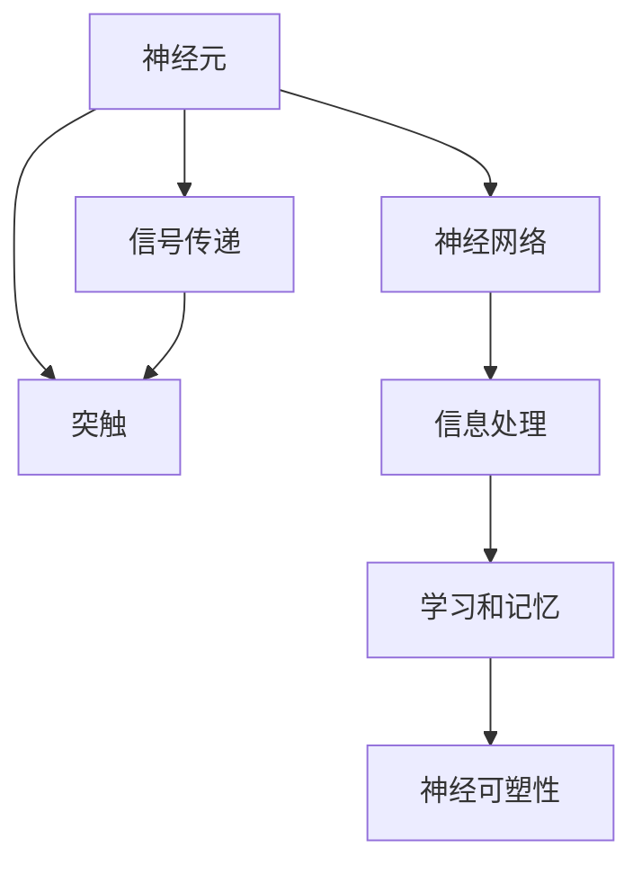

                 

# 知识的神经科学基础：大脑如何学习

> 关键词：神经科学,大脑学习,认知科学,人工智能,深度学习,神经网络,认知模型,知识表示,知识获取

## 1. 背景介绍

### 1.1 问题由来
现代科技的快速发展，尤其是人工智能和深度学习技术的突飞猛进，使得我们对大脑如何学习的理解变得更加迫切。深度学习模型已经成为解决复杂问题的重要工具，但它们的设计和训练依然受到我们对人类大脑学习的理解所限。理解大脑如何学习知识，将有助于设计更加高效、可解释的深度学习模型。

### 1.2 问题核心关键点
神经科学对大脑学习的研究主要集中在以下几个关键点：
- **神经元的活动**：神经元如何通过电信号传递信息，哪些神经元被激活，如何形成神经网络。
- **突触的改变**：突触的强度如何变化，这种变化如何适应环境。
- **学习和记忆**：如何在短时间内形成短期记忆，如何将短期记忆转化为长期记忆。
- **神经可塑性**：神经元如何适应环境和经验的变化，即神经可塑性的机制。

### 1.3 问题研究意义
研究大脑如何学习知识的神经科学基础，对于人工智能和深度学习领域的发展具有重要意义：
- 提供灵感：理解大脑的学习机制可以启发新的深度学习模型设计。
- 提升效率：优化深度学习模型的训练过程，使其更高效。
- 增强可解释性：使深度学习模型更可解释，更符合人类的认知模型。
- 应用广泛：在教育、医疗、机器人等领域提供新的解决方案。

## 2. 核心概念与联系

### 2.1 核心概念概述

为了更好地理解大脑如何学习知识，我们将介绍几个关键概念：

- **神经元**：构成神经系统的基本单位，通过电信号传递信息。
- **突触**：神经元之间的连接点，信号在此处传递。
- **神经网络**：由大量神经元连接而成的复杂结构，用于信息处理。
- **学习**：神经网络通过调整突触强度，逐渐适应外部环境的过程。
- **记忆**：将短期记忆转化为长期记忆，使学习的信息得以持久存储。
- **神经可塑性**：神经元适应环境和经验变化的能力。

这些概念之间的联系可以通过以下Mermaid流程图来展示：



这个流程图展示了神经元如何通过信号传递形成神经网络，并在此基础上进行学习和记忆，最终使神经网络具有神经可塑性。

## 3. 核心算法原理 & 具体操作步骤

### 3.1 算法原理概述

大脑学习的本质是通过调整神经元之间的突触强度，逐渐适应外部环境的过程。这个过程可以通过生物神经网络模型来模拟，其中最基本的模型是Hebbian模型（也称为突触可塑性模型），该模型提出突触强度的变化取决于两个神经元之间的活动。

### 3.2 算法步骤详解

基于Hebbian模型的神经网络学习过程包括以下步骤：

1. **输入信号**：将外部信息转换为神经网络中的电信号。
2. **信号传递**：神经元之间通过突触传递信号，突触强度随着信号传递次数的增加而增强。
3. **神经网络激活**：多个神经元组成的网络根据输入信号进行激活，产生输出信号。
4. **输出信号处理**：将输出信号转换为可理解的信息。

在数学上，Hebbian模型可以通过以下公式表示：

$$
w_i = w_i + \alpha (x_j - w_j x_i)
$$

其中，$w_i$ 是突触强度，$x_i$ 和 $x_j$ 是神经元的活动水平，$\alpha$ 是学习率。

### 3.3 算法优缺点

Hebbian模型的优点包括：
- 简单直观：模型易于理解，且不需要复杂的参数。
- 解释性强：突触强度直接与神经元的活动相关联，易于解释。

缺点包括：
- 过于简化：忽略了神经元之间复杂的交互和突触形态的变化。
- 无法处理复杂问题：难以处理需要长期记忆和复杂交互的问题。

### 3.4 算法应用领域

Hebbian模型在理解大脑如何学习方面具有重要应用，但它的局限性使其在其他领域的应用受到限制。然而，它为其他复杂模型提供了基础，如Hopfield网络和BP神经网络。

## 4. 数学模型和公式 & 详细讲解 & 举例说明

### 4.1 数学模型构建

在Hebbian模型的基础上，我们可以构建一个更加复杂的神经网络模型，用于模拟学习和记忆过程。

定义神经网络模型如下：
- 输入层：$x_1, x_2, \ldots, x_n$
- 隐藏层：$h_1, h_2, \ldots, h_m$
- 输出层：$y_1, y_2, \ldots, y_k$

每个神经元的活动由以下公式表示：

$$
x_i(t+1) = f(w_i x(t) + b_i)
$$

$$
h_j(t+1) = f(\sum_{i=1}^n w_{ij} x_i(t) + b_j)
$$

$$
y_k(t+1) = f(\sum_{j=1}^m w_{kj} h_j(t) + b_k)
$$

其中，$f$ 是激活函数，$w$ 和 $b$ 是权重和偏置。

### 4.2 公式推导过程

在上述模型中，学习和记忆过程可以表示为：

$$
\Delta w_{ij} = \alpha (x_j - w_j x_i) h_j
$$

$$
\Delta b_j = \alpha (x_j - w_j x_i)
$$

$$
\Delta w_{kj} = \alpha (h_j - w_j h_j) y_k
$$

$$
\Delta b_k = \alpha (h_j - w_j h_j) y_k
$$

其中，$\Delta$ 表示变化量，$\alpha$ 是学习率。

### 4.3 案例分析与讲解

以手写数字识别为例，我们可以构建一个简单的神经网络，使用MNIST数据集进行训练和测试。首先，将手写数字图像转换为像素值，然后将这些像素值作为输入层输入。通过隐藏层和输出层进行计算，最终得到手写数字的识别结果。

## 5. 项目实践：代码实例和详细解释说明

### 5.1 开发环境搭建

为了实现上述神经网络模型，我们需要以下开发环境：
- Python
- NumPy
- TensorFlow
- MNIST数据集

### 5.2 源代码详细实现

以下是使用TensorFlow实现手写数字识别的代码：

```python
import tensorflow as tf
from tensorflow import keras

# 加载MNIST数据集
mnist = keras.datasets.mnist
(train_images, train_labels), (test_images, test_labels) = mnist.load_data()

# 数据预处理
train_images = train_images / 255.0
test_images = test_images / 255.0

# 构建神经网络模型
model = keras.Sequential([
    keras.layers.Flatten(input_shape=(28, 28)),
    keras.layers.Dense(128, activation='relu'),
    keras.layers.Dense(10)
])

# 编译模型
model.compile(optimizer='adam', loss=tf.keras.losses.SparseCategoricalCrossentropy(from_logits=True), metrics=['accuracy'])

# 训练模型
model.fit(train_images, train_labels, epochs=10, validation_data=(test_images, test_labels))

# 评估模型
test_loss, test_acc = model.evaluate(test_images,  test_labels, verbose=2)
print('\nTest accuracy:', test_acc)
```

### 5.3 代码解读与分析

上述代码展示了如何使用TensorFlow实现一个简单的手写数字识别神经网络。首先，加载并预处理MNIST数据集。然后，构建一个包含两个全连接层的神经网络模型，并使用Adam优化器进行训练。最后，评估模型的性能。

## 6. 实际应用场景

### 6.1 教育领域

在教育领域，神经网络模型可以用于个性化学习，根据学生的学习行为和成绩，提供个性化的学习建议和课程安排。例如，使用神经网络分析学生的学习数据，预测其未来的学习表现，从而调整教学策略。

### 6.2 医疗领域

在医疗领域，神经网络模型可以用于疾病诊断和治疗方案推荐。例如，使用神经网络分析患者的症状和病历数据，预测其患病的概率和严重程度，从而提供个性化的治疗方案。

### 6.3 机器人领域

在机器人领域，神经网络模型可以用于路径规划和行为控制。例如，使用神经网络分析环境信息，规划机器人的运动路径，使其避开障碍物，到达目标地点。

### 6.4 未来应用展望

随着神经网络模型的不断发展和优化，其在更多领域的应用前景将更加广阔。未来，神经网络模型将进一步提高学习效率，增强可解释性，更好地适应环境和经验的变化。

## 7. 工具和资源推荐

### 7.1 学习资源推荐

为了深入理解神经网络和大脑学习的知识，我们推荐以下学习资源：
- 《深度学习》（Ian Goodfellow 著）
- 《神经网络与深度学习》（Michael Nielsen 著）
- 《神经网络课程》（Andrew Ng 授课）

### 7.2 开发工具推荐

以下是几个常用的神经网络开发工具：
- TensorFlow
- PyTorch
- Keras
- Scikit-learn

### 7.3 相关论文推荐

以下是几篇有代表性的相关论文：
- Hebbian模型：《A theory of the cell physiology of memory storage》（Hebb 1949）
- BP神经网络：《Backpropagation: Application to Handwritten Zeros and Ones Recognition》（Rumelhart et al. 1986）
- 神经可塑性：《Long-term Potentiation》（Bliss 和 Luján 1973）

## 8. 总结：未来发展趋势与挑战

### 8.1 研究成果总结

通过对神经网络模型的研究，我们深入了解了大脑学习的基本机制，推动了深度学习模型的发展。

### 8.2 未来发展趋势

未来的神经网络模型将更加高效、可解释，且具备更强的适应性和泛化能力。具体趋势包括：
- 自适应神经网络：根据环境变化自动调整网络结构。
- 可解释神经网络：增强模型的可解释性，使其更符合人类的认知模型。
- 混合智能：结合神经网络和符号计算的优势，构建更加强大的智能系统。

### 8.3 面临的挑战

尽管神经网络模型已经取得了显著进展，但在以下方面仍面临挑战：
- 数据瓶颈：大量标注数据的需求限制了模型的应用范围。
- 模型复杂性：复杂的模型难以解释，且难以调试。
- 鲁棒性问题：模型在面对复杂环境和噪声数据时，容易产生错误。
- 计算资源：大规模神经网络需要大量的计算资源，难以在大规模设备上部署。

### 8.4 研究展望

未来的研究需要解决上述挑战，进一步推动神经网络模型的发展和应用。以下是一些可能的突破方向：
- 无监督学习：在缺乏标注数据的情况下，利用未标注数据进行学习和推理。
- 知识增强：将符号计算和知识图谱与神经网络结合，构建更加强大和灵活的智能系统。
- 跨领域应用：将神经网络应用于更多领域，如自动驾驶、金融分析等。

## 9. 附录：常见问题与解答

**Q1：神经网络如何学习？**

A: 神经网络通过调整突触强度来学习，即在每次前向传播中计算误差，并反向传播更新权重和偏置。

**Q2：神经网络如何进行知识表示？**

A: 神经网络通过调整权重和偏置，逐渐适应外部环境，最终形成对输入数据的编码表示。

**Q3：神经网络如何处理复杂问题？**

A: 使用更加复杂的模型结构和更强的计算资源，同时结合领域知识，优化网络结构，提升模型的复杂性和适应性。

**Q4：神经网络有哪些局限性？**

A: 神经网络需要大量标注数据，模型难以解释，鲁棒性不足，计算资源需求高。

**Q5：未来神经网络的发展方向是什么？**

A: 更加高效、可解释、自适应、跨领域应用，结合符号计算和知识图谱。

---

作者：禅与计算机程序设计艺术 / Zen and the Art of Computer Programming

