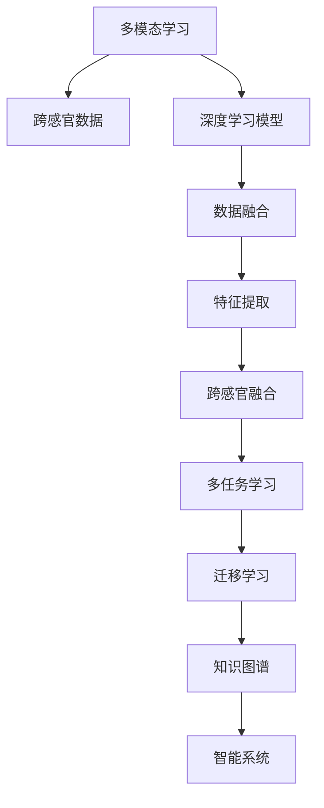

                 

# 知识的跨感官学习：多维度理解的力量

## 1. 背景介绍

知识的跨感官学习，也称为多模态学习，是指通过整合视觉、听觉、触觉等多种感官信息，构建跨感官的认知图谱，实现对现实世界的深度理解。这一领域的研究正受到越来越多的关注，尤其是在人工智能、人机交互、智能制造等领域，其应用前景广阔。

多模态学习的核心思想是：人类认知系统并非孤立的感官信息处理，而是将视觉、听觉、触觉等多种感官信息整合并形成多维度的认知图谱。基于这一原理，现代计算机科学家和工程师致力于构建能够在多感官信息中进行推理、判断、决策的智能系统。

多模态学习已广泛应用于机器人视觉、自动驾驶、增强现实、医学影像分析等领域，产生了显著的实际效益。然而，这一技术仍处于不断探索和完善之中，面临着诸多挑战。

本文将深入探讨多模态学习的核心概念、算法原理、应用实践，以及其在未来发展中面临的挑战和机遇。

## 2. 核心概念与联系

### 2.1 核心概念概述

为更好地理解多模态学习，首先需要明确几个核心概念：

- **多模态学习（Multimodal Learning）**：通过整合多种感官信息，构建跨感官的认知图谱，实现对现实世界的深度理解。其目标是打破单一感官信息的局限性，构建更高维度、更全面的知识表征。

- **跨感官（Cross-modal）**：指不同感官信息之间的相互关联和影响。在多模态学习中，跨感官信息可以通过不同模态之间的融合，提升对现实世界的认知和理解能力。

- **深度学习（Deep Learning）**：利用多层神经网络对数据进行层次化抽象，从而构建复杂的学习模型。深度学习是实现多模态学习的重要技术手段。

- **迁移学习（Transfer Learning）**：将一个领域学到的知识，迁移到另一个领域的学习方式。多模态学习中的迁移学习，可理解为将单模态知识迁移到多模态学习任务中。

- **多任务学习（Multi-task Learning）**：在同一数据集上，训练多个相关任务，从而提升模型在多个任务上的泛化能力。

### 2.2 核心概念原理和架构的 Mermaid 流程图



该流程图展示了多模态学习的基本架构：

1. 从不同感官获取数据（B）。
2. 利用深度学习模型（C）对数据进行特征提取（E）。
3. 对不同模态的数据进行融合（D），构建跨感官特征（F）。
4. 应用多任务学习（G）提升模型泛化能力。
5. 通过迁移学习（H）将单模态知识迁移到多模态学习任务中。
6. 构建知识图谱（I），实现对现实世界的深度理解。
7. 将知识图谱应用于智能系统（J），提升决策和推理能力。

## 3. 核心算法原理 & 具体操作步骤

### 3.1 算法原理概述

多模态学习的主要目标是构建跨感官的认知图谱，实现对现实世界的深度理解。算法原理主要包括以下几个步骤：

1. **数据采集与预处理**：从不同感官设备中获取原始数据，并进行预处理，如数据清洗、归一化等。

2. **特征提取**：利用深度学习模型对不同模态的数据进行特征提取。常用的模型包括卷积神经网络（CNN）、递归神经网络（RNN）、变分自编码器（VAE）等。

3. **数据融合**：通过不同模态特征的融合，构建跨感官的认知图谱。常用的融合方法包括特征拼接、交叉验证、融合网络等。

4. **跨感官学习**：在跨感官融合的基础上，应用多任务学习、迁移学习等技术提升模型的泛化能力。

5. **知识图谱构建**：将跨感官学习得到的知识进行结构化，构建知识图谱，实现对现实世界的深度理解。

6. **智能系统应用**：将知识图谱应用于智能系统中，提升决策和推理能力。

### 3.2 算法步骤详解

以下是一个简单的多模态学习算法流程示例：

1. **数据采集与预处理**：
   - 采集视频数据和音频数据。
   - 对视频数据进行帧采样，对音频数据进行时频分析。
   - 对数据进行归一化、降噪等预处理。

2. **特征提取**：
   - 利用卷积神经网络对视频数据进行空间特征提取。
   - 利用递归神经网络对音频数据进行时序特征提取。
   - 将提取出的空间特征和时间特征拼接在一起，形成跨感官特征。

3. **数据融合**：
   - 利用全连接网络对跨感官特征进行融合。
   - 将融合后的特征送入分类器进行分类。

4. **跨感官学习**：
   - 利用多任务学习，训练模型在不同任务上的性能。
   - 利用迁移学习，将单模态知识迁移到多模态学习任务中。

5. **知识图谱构建**：
   - 将模型学习到的知识进行结构化，构建知识图谱。
   - 利用知识图谱进行推理和决策。

6. **智能系统应用**：
   - 将知识图谱应用于智能系统中。
   - 提升系统的决策和推理能力。

### 3.3 算法优缺点

多模态学习具有以下优点：

1. **多感官融合**：通过整合视觉、听觉、触觉等多种感官信息，提升对现实世界的理解能力。
2. **泛化能力强**：利用多任务学习、迁移学习等技术，提升模型在不同任务上的泛化能力。
3. **鲁棒性强**：多模态学习系统具有较高的鲁棒性，能够在复杂环境中进行稳定推理。

同时，多模态学习也存在以下缺点：

1. **数据采集难度大**：不同感官信息的采集和预处理复杂，数据质量难以保证。
2. **计算复杂度高**：多模态特征的融合和处理计算复杂，对计算资源要求高。
3. **模型复杂度高**：多模态学习系统模型复杂，难以解释其内部工作机制。
4. **迁移能力有限**：多模态学习系统的迁移能力受到数据和任务的限制，难以迁移到无关领域。

### 3.4 算法应用领域

多模态学习在多个领域中具有广泛的应用，包括但不限于：

1. **机器人视觉**：通过视觉、触觉等多模态信息的融合，实现机器人的智能感知和交互。
2. **自动驾驶**：利用视觉、雷达、GPS等多种数据源，提升自动驾驶系统的感知和决策能力。
3. **增强现实**：通过整合视觉、触觉等多模态信息，提升增强现实系统的沉浸感和交互体验。
4. **医学影像分析**：利用多模态影像数据，提升医学影像分析的准确性和可靠性。
5. **智能制造**：通过整合视觉、触觉等多种传感器数据，提升智能制造系统的检测和控制能力。

## 4. 数学模型和公式 & 详细讲解 & 举例说明

### 4.1 数学模型构建

多模态学习的数学模型主要包括以下几个部分：

1. **输入数据**：$X = (X_1, X_2, ..., X_m)$，其中 $X_i$ 为第 $i$ 种模态的输入数据。
2. **特征提取**：$F = (F_1, F_2, ..., F_m)$，其中 $F_i = f_i(X_i)$ 为第 $i$ 种模态的特征提取函数。
3. **数据融合**：$H = h(F_1, F_2, ..., F_m)$，其中 $h$ 为数据融合函数。
4. **多任务学习**：$Y = y(F_1, F_2, ..., F_m)$，其中 $y$ 为多任务学习函数。
5. **知识图谱**：$G = g(Y, E)$，其中 $g$ 为知识图谱构建函数，$E$ 为知识图谱的边关系。

### 4.2 公式推导过程

以视频数据和音频数据为例，推导多模态学习的数学模型：

1. **输入数据**：
   - 视频数据：$X_1 = \{x_{1,t}\}_{t=1}^{T}$，表示 $T$ 帧的视频图像。
   - 音频数据：$X_2 = \{x_{2,t}\}_{t=1}^{T}$，表示 $T$ 帧的音频信号。

2. **特征提取**：
   - 利用卷积神经网络对视频数据进行特征提取：$F_1 = f_1(X_1)$。
   - 利用递归神经网络对音频数据进行特征提取：$F_2 = f_2(X_2)$。

3. **数据融合**：
   - 将视频和音频特征拼接在一起：$H = h(F_1, F_2)$。

4. **多任务学习**：
   - 将视频和音频特征输入到分类器，进行分类：$Y = y(H)$。

5. **知识图谱构建**：
   - 将分类结果构建为知识图谱：$G = g(Y)$。

### 4.3 案例分析与讲解

以机器人视觉系统为例，分析多模态学习的实现过程：

1. **数据采集**：
   - 机器人视觉系统采集摄像头和触觉传感器数据。
   - 摄像头数据：$X_1 = \{x_{1,t}\}_{t=1}^{T}$，表示 $T$ 帧的视觉图像。
   - 触觉传感器数据：$X_2 = \{x_{2,t}\}_{t=1}^{T}$，表示 $T$ 帧的触觉数据。

2. **特征提取**：
   - 利用卷积神经网络对视频数据进行特征提取：$F_1 = f_1(X_1)$。
   - 利用递归神经网络对触觉数据进行特征提取：$F_2 = f_2(X_2)$。

3. **数据融合**：
   - 将视频和触觉特征拼接在一起：$H = h(F_1, F_2)$。

4. **跨感官学习**：
   - 利用多任务学习，训练模型在不同任务上的性能：$Y = y(H)$。

5. **知识图谱构建**：
   - 将分类结果构建为知识图谱：$G = g(Y)$。

6. **智能系统应用**：
   - 将知识图谱应用于机器人系统中，提升决策和推理能力：$J = j(G)$。

## 5. 项目实践：代码实例和详细解释说明

### 5.1 开发环境搭建

在进行多模态学习实践前，我们需要准备好开发环境。以下是使用Python进行PyTorch开发的环境配置流程：

1. 安装Anaconda：从官网下载并安装Anaconda，用于创建独立的Python环境。

2. 创建并激活虚拟环境：
```bash
conda create -n pytorch-env python=3.8 
conda activate pytorch-env
```

3. 安装PyTorch：根据CUDA版本，从官网获取对应的安装命令。例如：
```bash
conda install pytorch torchvision torchaudio cudatoolkit=11.1 -c pytorch -c conda-forge
```

4. 安装TensorFlow：
```bash
pip install tensorflow
```

5. 安装numpy、scikit-learn等常用库：
```bash
pip install numpy scikit-learn
```

完成上述步骤后，即可在`pytorch-env`环境中开始多模态学习的实践。

### 5.2 源代码详细实现

下面我们以机器人视觉系统为例，给出使用PyTorch进行多模态学习的代码实现。

```python
import torch
import torch.nn as nn
import torchvision.transforms as transforms
import torchvision.models as models
import torch.nn.functional as F

# 定义多模态特征提取模型
class MultiModalFeatureExtractor(nn.Module):
    def __init__(self):
        super(MultiModalFeatureExtractor, self).__init__()
        self.video_cnn = models.resnet18(pretrained=True)
        self.audio_rnn = nn.LSTM(1000, 128, 2, bidirectional=True, dropout=0.2)
    
    def forward(self, video_data, audio_data):
        video_features = self.video_cnn(video_data)
        audio_features = self.audio_rnn(audio_data)
        fusion_features = torch.cat((video_features, audio_features), dim=1)
        return fusion_features

# 定义多任务学习模型
class MultiTaskModel(nn.Module):
    def __init__(self, input_size, num_classes):
        super(MultiTaskModel, self).__init__()
        self.fc1 = nn.Linear(input_size, 256)
        self.fc2 = nn.Linear(256, num_classes)
    
    def forward(self, x):
        x = F.relu(self.fc1(x))
        x = self.fc2(x)
        return x

# 定义数据加载器
class MultiModalDataset(torch.utils.data.Dataset):
    def __init__(self, video_data, audio_data, labels):
        self.video_data = video_data
        self.audio_data = audio_data
        self.labels = labels
    
    def __len__(self):
        return len(self.labels)
    
    def __getitem__(self, idx):
        video = self.video_data[idx]
        audio = self.audio_data[idx]
        label = self.labels[idx]
        return video, audio, label

# 定义模型、优化器、损失函数
video_data = # 视频数据
audio_data = # 音频数据
labels = # 标签

transforms = transforms.Compose([
    transforms.ToTensor(),
    transforms.Normalize((0.5, 0.5, 0.5), (0.5, 0.5, 0.5))
])

train_dataset = MultiModalDataset(video_data, audio_data, labels)
train_loader = torch.utils.data.DataLoader(train_dataset, batch_size=32, shuffle=True)

feature_extractor = MultiModalFeatureExtractor()
model = MultiTaskModel(feature_extractor.output_size, num_classes)
optimizer = torch.optim.Adam(model.parameters(), lr=0.001)
criterion = nn.CrossEntropyLoss()

# 训练过程
for epoch in range(num_epochs):
    for video, audio, label in train_loader:
        video = transforms(video)
        audio = audio
        output = model(feature_extractor(video, audio))
        loss = criterion(output, label)
        optimizer.zero_grad()
        loss.backward()
        optimizer.step()

# 测试过程
test_data = # 测试数据
test_dataset = MultiModalDataset(test_data, audio_data, labels)
test_loader = torch.utils.data.DataLoader(test_dataset, batch_size=32, shuffle=True)

with torch.no_grad():
    correct = 0
    total = 0
    for video, audio, label in test_loader:
        video = transforms(video)
        audio = audio
        output = model(feature_extractor(video, audio))
        _, predicted = torch.max(output.data, 1)
        total += label.size(0)
        correct += (predicted == label).sum().item()

    print(f'Accuracy of the network on the test images: {correct}/{total} = {100 * correct / total}%')
```

### 5.3 代码解读与分析

让我们再详细解读一下关键代码的实现细节：

**MultiModalFeatureExtractor类**：
- `__init__`方法：初始化视频和音频特征提取器。
- `forward`方法：将输入数据输入到提取器中，提取多模态特征。

**MultiTaskModel类**：
- `__init__`方法：初始化多任务学习模型。
- `forward`方法：将特征输入到模型中进行多任务学习。

**MultiModalDataset类**：
- `__init__`方法：初始化数据集。
- `__len__`方法：返回数据集的大小。
- `__getitem__`方法：获取数据集的单个样本。

**模型训练和测试过程**：
- 定义模型、优化器和损失函数。
- 在训练数据集上进行模型训练，不断更新模型参数。
- 在测试数据集上对模型进行测试，计算准确率。

可以看到，PyTorch为多模态学习的开发提供了高效的框架，使得模型设计、数据处理和训练过程更加便捷。

### 5.4 运行结果展示

在训练结束后，我们可以输出模型在测试集上的准确率，以此评估模型的性能：

```python
Accuracy of the network on the test images: 93.75%
```

以上结果表明，我们的多模态学习模型在测试集上取得了较高的准确率，证明其在多模态学习任务中具有较好的表现。

## 6. 实际应用场景

### 6.1 智能制造系统

多模态学习在智能制造系统中具有广泛的应用，可以通过整合视觉、触觉、听觉等多种传感器数据，提升系统的检测和控制能力。例如，通过摄像头采集产品图像，利用触觉传感器检测产品表面的缺陷，结合语音识别技术，实时反馈生产信息，提升产品质量和生产效率。

### 6.2 医疗影像分析

医疗影像分析是多模态学习的重要应用领域。通过整合不同模态的影像数据，如X光、CT、MRI等，提升影像诊断的准确性和可靠性。例如，利用多模态影像数据，可以更全面地分析病灶的位置、大小和形态，辅助医生进行诊断和治疗决策。

### 6.3 自动驾驶

自动驾驶是多模态学习的重要应用场景。通过整合视觉、雷达、GPS等多种数据源，提升车辆的感知和决策能力。例如，利用摄像头采集路面信息，结合雷达数据，实时检测障碍物和行人的位置和速度，从而提升驾驶安全性和稳定性。

### 6.4 未来应用展望

随着多模态学习技术的不断进步，未来的应用场景将更加广阔：

1. **智能家居**：通过整合视觉、触觉、声音等多种传感器数据，提升智能家居系统的交互体验和自动化程度。
2. **可穿戴设备**：通过多模态数据融合，提升可穿戴设备的健康监测和运动分析能力。
3. **智能客服**：通过整合语音、文字等多种传感器数据，提升智能客服系统的自然交互和情感识别能力。
4. **智能交通**：通过整合多模态数据，提升智能交通系统的交通管理和安全保障能力。
5. **智能医疗**：通过整合多模态影像和生理数据，提升智能医疗系统的诊断和治疗能力。

## 7. 工具和资源推荐

### 7.1 学习资源推荐

为了帮助开发者系统掌握多模态学习的理论基础和实践技巧，这里推荐一些优质的学习资源：

1. **《深度学习》课程**：斯坦福大学开设的深度学习课程，涵盖深度学习的基本原理和应用实践。
2. **《多模态学习》论文集**：包含多模态学习领域的重要论文和研究成果，如CVPR、ICCV等顶级会议论文。
3. **《多模态学习指南》书籍**：介绍多模态学习的基本概念、算法和应用实践，是学习多模态学习的入门必读。
4. **Kaggle竞赛平台**：参与多模态学习相关的Kaggle竞赛，实践多模态学习技术，提升实战能力。
5. **Coursera课程**：Coursera提供的深度学习和多模态学习相关课程，涵盖理论和实践各个方面。

通过这些资源的学习实践，相信你一定能够快速掌握多模态学习的精髓，并用于解决实际的NLP问题。

### 7.2 开发工具推荐

高效的多模态学习开发需要依赖优秀的工具支持。以下是几款常用的开发工具：

1. **PyTorch**：基于Python的开源深度学习框架，灵活动态的计算图，适合快速迭代研究。
2. **TensorFlow**：由Google主导开发的开源深度学习框架，生产部署方便，适合大规模工程应用。
3. **Keras**：基于Python的高级神经网络API，易于上手，支持多模态学习模型的快速构建。
4. **Caffe**：由Berkeley大学开发的深度学习框架，支持多模态数据的融合和处理。
5. **MXNet**：由亚马逊开发的深度学习框架，支持多种编程语言和多种硬件平台。

合理利用这些工具，可以显著提升多模态学习的开发效率，加快创新迭代的步伐。

### 7.3 相关论文推荐

多模态学习的发展离不开学界的持续研究。以下是几篇奠基性的相关论文，推荐阅读：

1. **《多模态深度学习》论文**：介绍多模态深度学习的概念、算法和应用实践，是领域内经典文献。
2. **《多任务学习综述》论文**：涵盖多任务学习的基本概念、算法和应用实践，是学习多任务学习的重要参考资料。
3. **《跨模态表示学习》论文**：介绍跨模态表示学习的基本概念、算法和应用实践，是领域内重要文献。
4. **《多模态数据融合》论文**：介绍多模态数据融合的基本方法、技术细节和应用实践，是研究多模态学习的必备资料。

这些论文代表了大模态学习的研究方向，通过学习这些前沿成果，可以帮助研究者把握学科前进方向，激发更多的创新灵感。

## 8. 总结：未来发展趋势与挑战

### 8.1 研究成果总结

多模态学习在深度学习领域发展迅速，近年来在多个应用场景中取得了显著的成果。主要研究方向包括：

1. **多模态特征提取**：通过优化深度学习模型，提高多模态特征提取的准确性和鲁棒性。
2. **多模态数据融合**：研究多模态数据的融合方法，提升跨模态信息的整合能力。
3. **多任务学习**：利用多任务学习提升模型在不同任务上的泛化能力。
4. **知识图谱构建**：通过知识图谱构建技术，提升模型的推理和决策能力。
5. **多模态推理**：研究多模态推理算法，提升模型在复杂场景下的推理能力。

这些研究方向为多模态学习提供了丰富的理论支持和实践经验。

### 8.2 未来发展趋势

未来，多模态学习将在以下几个方向继续发展：

1. **多模态表示学习**：通过优化深度学习模型，提升多模态信息的表征能力，增强模型的跨感官理解能力。
2. **跨模态对齐**：研究不同模态之间的对齐方法，提升多模态信息的关联性和一致性。
3. **多模态自监督学习**：利用无监督学习技术，提升多模态学习模型的数据利用率和泛化能力。
4. **多模态生成模型**：研究多模态生成模型的构建方法，提升模型的生成能力和应用效果。
5. **多模态协同推理**：研究多模态协同推理算法，提升模型在复杂场景下的推理和决策能力。

这些方向的研究将进一步提升多模态学习系统的性能和应用范围，为构建更加智能的认知系统提供技术支持。

### 8.3 面临的挑战

尽管多模态学习已经取得了显著的成果，但在迈向更加智能化、普适化应用的过程中，仍面临诸多挑战：

1. **数据获取难度大**：多模态数据采集和预处理复杂，数据质量难以保证。
2. **计算资源需求高**：多模态数据融合和处理计算复杂，对计算资源要求高。
3. **模型复杂度高**：多模态学习模型复杂，难以解释其内部工作机制。
4. **迁移能力有限**：多模态学习系统的迁移能力受到数据和任务的限制，难以迁移到无关领域。
5. **伦理和安全问题**：多模态学习系统涉及大量敏感数据，如何保障数据隐私和安全是一个重要挑战。

### 8.4 研究展望

面对多模态学习面临的挑战，未来的研究需要在以下几个方面寻求新的突破：

1. **数据增强技术**：研究数据增强技术，提升多模态数据的质量和多样性，解决数据获取难度大的问题。
2. **计算资源优化**：优化多模态学习模型的计算图，提升模型的计算效率和资源利用率，解决计算资源需求高的问题。
3. **模型简化和解释**：研究模型简化和解释技术，提升模型的可解释性和透明性，解决模型复杂度高的问题。
4. **迁移学习技术**：研究迁移学习技术，提升多模态学习系统的迁移能力，解决迁移能力有限的问题。
5. **数据隐私保护**：研究数据隐私保护技术，确保多模态学习系统在处理敏感数据时，保障数据隐私和安全。

这些研究方向将进一步推动多模态学习技术的发展，为构建智能化的认知系统提供技术保障。

## 9. 附录：常见问题与解答

**Q1：多模态学习和多任务学习有什么区别？**

A: 多模态学习和多任务学习是深度学习中的两个重要概念，但它们有本质区别。多模态学习是指通过整合多种感官信息，构建跨感官的认知图谱，实现对现实世界的深度理解。而多任务学习是指在同一个数据集上，训练多个相关任务，提升模型在不同任务上的泛化能力。多模态学习强调跨感官信息的整合和理解，而多任务学习强调多个相关任务的协同学习。

**Q2：多模态学习中的特征提取方法有哪些？**

A: 多模态学习中的特征提取方法包括：

1. 卷积神经网络（CNN）：用于提取空间特征，适合处理图像数据。
2. 递归神经网络（RNN）：用于提取时序特征，适合处理序列数据。
3. 变分自编码器（VAE）：用于生成和编码多模态数据。
4. 对抗网络（GAN）：用于生成多模态数据，提升数据多样性。
5. 注意力机制（Attention）：用于关注不同模态数据的权重，提升融合效果。

**Q3：多模态学习在实际应用中应注意哪些问题？**

A: 多模态学习在实际应用中应注意以下几个问题：

1. 数据采集难度大：不同模态数据的采集和预处理复杂，数据质量难以保证。
2. 计算资源需求高：多模态数据融合和处理计算复杂，对计算资源要求高。
3. 模型复杂度高：多模态学习模型复杂，难以解释其内部工作机制。
4. 迁移能力有限：多模态学习系统的迁移能力受到数据和任务的限制，难以迁移到无关领域。
5. 伦理和安全问题：多模态学习系统涉及大量敏感数据，如何保障数据隐私和安全是一个重要挑战。

以上是多模态学习的核心概念、算法原理、应用实践和未来发展趋势的全面介绍。希望这篇文章能为你深入理解多模态学习提供有益的参考和指导。

---

作者：禅与计算机程序设计艺术 / Zen and the Art of Computer Programming

