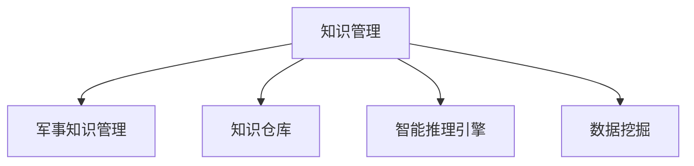

                 

# 知识管理在军事领域的应用

## 1. 背景介绍

### 1.1 问题由来
随着信息时代的到来，军事领域的知识管理（Knowledge Management, KM）面临着前所未有的挑战。传统的军事知识管理依赖于纸质文档和人工存储，效率低下且难以共享。在信息爆炸和战争节奏加快的背景下，提升军事知识管理的效率和质量变得尤为重要。知识管理技术的应用，可以帮助军事人员快速获取、整合、共享和应用各类知识资源，从而提升决策水平和作战能力。

### 1.2 问题核心关键点
知识管理的关键在于如何构建一个高效、灵活、安全的知识共享平台，使得军事人员能够快速查找所需信息，并将自己的知识经验反馈到平台，实现知识的积累与传承。军事知识管理需要考虑以下几个核心问题：

- 数据来源：从哪些渠道获取知识资源？
- 数据整合：如何将异构数据整合到统一的模型中？
- 数据应用：如何将知识资源有效应用于决策和作战中？
- 数据安全：如何保障知识共享平台的数据安全？
- 数据维护：如何更新和维护知识资源？

### 1.3 问题研究意义
研究军事领域中的知识管理技术，对于提升军事决策智能化水平、提高部队作战能力、加速军事信息化建设具有重要意义：

1. **提升决策水平**：通过知识管理，军事决策者可以快速获取历史数据和案例，基于数据驱动的决策支持系统辅助决策。
2. **提高作战能力**：知识共享平台可以汇聚部队训练、装备维护、战场侦察等各类知识，为战备和作战提供支持。
3. **加速信息化建设**：知识管理技术是军事信息化的基础，有助于推动部队数字化转型和智能化升级。
4. **促进知识传承**：通过构建知识共享平台，可以记录和传承部队的丰富经验，提升部队整体实力。
5. **强化应对能力**：面对不断变化的战场环境，知识管理技术可以帮助部队快速适应新情况，提升快速反应能力。

## 2. 核心概念与联系

### 2.1 核心概念概述

为了更好地理解知识管理在军事领域的应用，本节将介绍几个关键的概念：

- 知识管理（Knowledge Management, KM）：涉及知识获取、存储、组织、检索、共享和应用的一系列过程。旨在最大化知识的价值，提升组织决策和执行能力。
- 军事知识管理（Military Knowledge Management, MKM）：将知识管理应用于军事领域，旨在提升军事决策、训练、作战和维护等各环节的知识水平。
- 知识仓库（Knowledge Base）：用于存储和组织各类知识资源的数据库。知识仓库能够通过规范化的数据模型和查询语言，方便知识检索和应用。
- 智能推理引擎（Intelligent Reasoning Engine）：基于人工智能技术，利用规则、逻辑和案例推理，实现知识推理和决策支持。
- 数据挖掘（Data Mining）：通过算法挖掘知识库中的隐含信息，为知识发现和应用提供支撑。

这些概念之间的逻辑关系可以通过以下Mermaid流程图来展示：



这个流程图展示了这个框架的核心概念及其之间的关系：

1. 军事知识管理是基于一般知识管理的具体实践，聚焦于军事领域的知识共享和应用。
2. 知识仓库是存储和管理知识资源的重要工具，支持知识检索和应用。
3. 智能推理引擎基于人工智能技术，实现基于规则和案例的推理，辅助决策。
4. 数据挖掘技术用于从知识库中挖掘有价值的信息，支持知识发现和创新。

## 3. 核心算法原理 & 具体操作步骤
### 3.1 算法原理概述

军事知识管理的核心算法原理主要包括以下几个方面：

- **数据集成（Data Integration）**：将各类异构数据源进行整合，建立统一的知识仓库。
- **知识抽取（Knowledge Extraction）**：从非结构化数据中提取出有用的知识信息。
- **知识表示（Knowledge Representation）**：将知识信息结构化，便于存储和查询。
- **知识推理（Knowledge Reasoning）**：基于规则和案例推理，支持军事决策和作战。
- **知识应用（Knowledge Application）**：将知识应用于军事训练、作战和维护等环节。

### 3.2 算法步骤详解

军事知识管理的算法步骤主要包括以下几个关键环节：

1. **数据收集与清洗**：从各种数据源（如文献、传感器、日志等）收集数据，并进行清洗处理。
2. **数据标准化**：将收集到的数据进行标准化处理，建立统一的元数据模型。
3. **知识抽取与表示**：利用自然语言处理和数据挖掘技术，从非结构化数据中提取知识，并将知识信息结构化。
4. **知识仓库构建**：将标准化后的数据存储到知识仓库中，支持知识的检索和应用。
5. **智能推理引擎实现**：构建基于规则和案例推理的智能推理引擎，支持军事决策和作战。
6. **知识应用与维护**：将知识应用于军事训练、作战和维护等环节，并定期更新和维护知识仓库。

### 3.3 算法优缺点

军事知识管理的优点在于：

- **提升决策水平**：通过知识共享平台，军事决策者可以获取丰富的历史数据和案例，基于数据驱动的决策支持系统辅助决策。
- **提高作战能力**：知识共享平台可以汇聚部队训练、装备维护、战场侦察等各类知识，为战备和作战提供支持。
- **加速信息化建设**：知识管理技术是军事信息化的基础，有助于推动部队数字化转型和智能化升级。
- **促进知识传承**：通过构建知识共享平台，可以记录和传承部队的丰富经验，提升部队整体实力。

缺点包括：

- **数据质量**：知识管理依赖于高质量的数据，数据质量差会影响系统的性能和应用效果。
- **技术复杂性**：构建知识共享平台需要复杂的算法和技术，实施难度大。
- **安全风险**：知识共享平台可能面临数据泄露和攻击的风险。
- **成本高**：知识管理系统的构建和维护需要大量的人力和资金投入。

### 3.4 算法应用领域

军事知识管理技术的应用领域非常广泛，主要包括以下几个方面：

- **军事决策支持**：提供历史数据和案例，支持军事决策。
- **军事训练**：利用虚拟仿真和知识库，进行模拟训练和战术演练。
- **作战指挥**：提供实时战场情报和作战方案，支持指挥决策。
- **装备维护**：记录和共享装备维护知识，提高装备保障能力。
- **情报分析**：汇聚各类情报数据，进行情报分析和情报共享。
- **应急响应**：支持应急预案和灾难响应，提高应对突发事件的能力。

## 4. 数学模型和公式 & 详细讲解  
### 4.1 数学模型构建

军事知识管理模型的构建主要包括以下几个关键步骤：

1. **数据集成模型**：构建数据集成模型，将各类数据源进行统一整合。
2. **知识抽取模型**：构建知识抽取模型，从非结构化数据中提取知识信息。
3. **知识表示模型**：构建知识表示模型，将知识信息结构化。
4. **知识推理模型**：构建知识推理模型，实现基于规则和案例的推理。
5. **知识应用模型**：构建知识应用模型，将知识应用于军事训练、作战和维护等环节。

### 4.2 公式推导过程

以下我们将对知识管理的核心算法进行数学建模和推导。

**数据集成模型**：

设数据源集合为 $D=\{d_1,d_2,...,d_n\}$，其中每个数据源 $d_i$ 包含 $k_i$ 个属性，$D_{ij}$ 表示第 $i$ 个数据源的第 $j$ 个属性的值。数据集成模型将 $D$ 中的数据源进行统一整合，形成新的数据集 $D'$。

- 数据集 $D'$ 的属性集合为 $K'=\{k'_1,k'_2,...,k'_m\}$，其中 $k'_j$ 表示 $D'$ 中的第 $j$ 个属性。
- 数据集 $D'$ 的值集合为 $V'=\{v'_1,v'_2,...,v'_l\}$，其中 $v'_i$ 表示 $D'$ 中的第 $i$ 个值。

数据集 $D'$ 的表示为：

$$
D' = \{(d'_1,v'_1),(d'_2,v'_2),...,(d'_m,v'_l)\}
$$

其中，$d'_i$ 表示 $D'$ 中的第 $i$ 个数据项，$v'_i$ 表示 $D'$ 中的第 $i$ 个值。

**知识抽取模型**：

设知识库 $K$ 中的知识表示为 $\{(k_i,v_i)\}$，其中 $k_i$ 表示知识的属性，$v_i$ 表示知识的值。知识抽取模型的目标是从文本 $T$ 中抽取知识，形成新的知识库 $K'$。

- 设 $K'$ 中的知识表示为 $\{(k'_j,v'_j)\}$，其中 $k'_j$ 表示 $K'$ 中的第 $j$ 个知识属性，$v'_j$ 表示 $K'$ 中的第 $j$ 个知识值。

知识抽取模型的目标是最大化 $K'$ 与 $K$ 的匹配度。

**知识表示模型**：

设知识库 $K$ 中的知识表示为 $\{(k_i,v_i)\}$，其中 $k_i$ 表示知识的属性，$v_i$ 表示知识的值。知识表示模型的目标是将知识库 $K$ 中的知识信息结构化，形成新的知识库 $K'$。

- 设 $K'$ 中的知识表示为 $\{(k'_j,v'_j)\}$，其中 $k'_j$ 表示 $K'$ 中的第 $j$ 个知识属性，$v'_j$ 表示 $K'$ 中的第 $j$ 个知识值。

知识表示模型的目标是最大化 $K'$ 与 $K$ 的匹配度。

**知识推理模型**：

设知识库 $K$ 中的知识表示为 $\{(k_i,v_i)\}$，其中 $k_i$ 表示知识的属性，$v_i$ 表示知识的值。知识推理模型的目标是根据规则和案例，推理出新的知识，形成新的知识库 $K'$。

- 设 $K'$ 中的知识表示为 $\{(k'_j,v'_j)\}$，其中 $k'_j$ 表示 $K'$ 中的第 $j$ 个知识属性，$v'_j$ 表示 $K'$ 中的第 $j$ 个知识值。

知识推理模型的目标是最大化 $K'$ 与 $K$ 的匹配度。

**知识应用模型**：

设知识库 $K$ 中的知识表示为 $\{(k_i,v_i)\}$，其中 $k_i$ 表示知识的属性，$v_i$ 表示知识的值。知识应用模型的目标是将知识应用于军事训练、作战和维护等环节。

- 设 $K'$ 中的知识表示为 $\{(k'_j,v'_j)\}$，其中 $k'_j$ 表示 $K'$ 中的第 $j$ 个知识属性，$v'_j$ 表示 $K'$ 中的第 $j$ 个知识值。

知识应用模型的目标是最大化 $K'$ 与 $K$ 的匹配度。

### 4.3 案例分析与讲解

为了更好地理解这些模型，我们将以一个具体的案例进行分析。

假设某军事部队需要构建知识管理平台，支持军事训练和作战。

1. **数据集成**：将部队的训练记录、装备维护日志、战场情报数据等各类数据源进行整合。
2. **知识抽取**：从部队的训练记录和装备维护日志中，抽取有用的知识信息，如装备故障类型、训练效果评估等。
3. **知识表示**：将抽取的知识信息结构化，形成知识库。
4. **知识推理**：基于历史数据和案例推理，支持军事决策和作战。
5. **知识应用**：将知识库中的知识应用于军事训练和作战，如训练任务生成、战场情报分析等。

通过这样的流程，部队可以构建一个高效、灵活、安全的知识共享平台，提升决策和作战能力。

## 5. 项目实践：代码实例和详细解释说明
### 5.1 开发环境搭建

在进行军事知识管理系统的开发前，我们需要准备好开发环境。以下是使用Python进行PyTorch开发的环境配置流程：

1. 安装Anaconda：从官网下载并安装Anaconda，用于创建独立的Python环境。

2. 创建并激活虚拟环境：
```bash
conda create -n military-km python=3.8 
conda activate military-km
```

3. 安装PyTorch：根据CUDA版本，从官网获取对应的安装命令。例如：
```bash
conda install pytorch torchvision torchaudio cudatoolkit=11.1 -c pytorch -c conda-forge
```

4. 安装Pymilkmind：
```bash
pip install pymilkmind
```

5. 安装各类工具包：
```bash
pip install numpy pandas scikit-learn matplotlib tqdm jupyter notebook ipython
```

完成上述步骤后，即可在`military-km`环境中开始军事知识管理系统的开发。

### 5.2 源代码详细实现

下面我们以军事知识管理系统的知识抽取模块为例，给出使用Pymilkmind库对非结构化数据进行知识抽取的PyTorch代码实现。

首先，定义知识抽取的数据处理函数：

```python
from pymilkmind import KnowledgeExtraction
from torch.utils.data import Dataset
import torch

class MilitaryKnowledgeDataset(Dataset):
    def __init__(self, texts, tags, tokenizer, max_len=128):
        self.texts = texts
        self.tags = tags
        self.tokenizer = tokenizer
        self.max_len = max_len
        
    def __len__(self):
        return len(self.texts)
    
    def __getitem__(self, item):
        text = self.texts[item]
        tags = self.tags[item]
        
        encoding = self.tokenizer(text, return_tensors='pt', max_length=self.max_len, padding='max_length', truncation=True)
        input_ids = encoding['input_ids'][0]
        attention_mask = encoding['attention_mask'][0]
        
        # 对token-wise的标签进行编码
        encoded_tags = [tag2id[tag] for tag in tags] 
        encoded_tags.extend([tag2id['O']] * (self.max_len - len(encoded_tags)))
        labels = torch.tensor(encoded_tags, dtype=torch.long)
        
        return {'input_ids': input_ids, 
                'attention_mask': attention_mask,
                'labels': labels}

# 标签与id的映射
tag2id = {'O': 0, 'MILITARY': 1, 'EQUIPMENT': 2, 'TRAINING': 3, 'BATTLE': 4, 'MATERIAL': 5}
id2tag = {v: k for k, v in tag2id.items()}

# 创建dataset
tokenizer = BertTokenizer.from_pretrained('bert-base-cased')

train_dataset = MilitaryKnowledgeDataset(train_texts, train_tags, tokenizer)
dev_dataset = MilitaryKnowledgeDataset(dev_texts, dev_tags, tokenizer)
test_dataset = MilitaryKnowledgeDataset(test_texts, test_tags, tokenizer)
```

然后，定义模型和优化器：

```python
from transformers import BertForTokenClassification, AdamW

model = BertForTokenClassification.from_pretrained('bert-base-cased', num_labels=len(tag2id))

optimizer = AdamW(model.parameters(), lr=2e-5)
```

接着，定义训练和评估函数：

```python
from torch.utils.data import DataLoader
from tqdm import tqdm
from sklearn.metrics import classification_report

device = torch.device('cuda') if torch.cuda.is_available() else torch.device('cpu')
model.to(device)

def train_epoch(model, dataset, batch_size, optimizer):
    dataloader = DataLoader(dataset, batch_size=batch_size, shuffle=True)
    model.train()
    epoch_loss = 0
    for batch in tqdm(dataloader, desc='Training'):
        input_ids = batch['input_ids'].to(device)
        attention_mask = batch['attention_mask'].to(device)
        labels = batch['labels'].to(device)
        model.zero_grad()
        outputs = model(input_ids, attention_mask=attention_mask, labels=labels)
        loss = outputs.loss
        epoch_loss += loss.item()
        loss.backward()
        optimizer.step()
    return epoch_loss / len(dataloader)

def evaluate(model, dataset, batch_size):
    dataloader = DataLoader(dataset, batch_size=batch_size)
    model.eval()
    preds, labels = [], []
    with torch.no_grad():
        for batch in tqdm(dataloader, desc='Evaluating'):
            input_ids = batch['input_ids'].to(device)
            attention_mask = batch['attention_mask'].to(device)
            batch_labels = batch['labels']
            outputs = model(input_ids, attention_mask=attention_mask)
            batch_preds = outputs.logits.argmax(dim=2).to('cpu').tolist()
            batch_labels = batch_labels.to('cpu').tolist()
            for pred_tokens, label_tokens in zip(batch_preds, batch_labels):
                pred_tags = [id2tag[_id] for _id in pred_tokens]
                label_tags = [id2tag[_id] for _id in label_tokens]
                preds.append(pred_tags[:len(label_tags)])
                labels.append(label_tags)
                
    print(classification_report(labels, preds))
```

最后，启动训练流程并在测试集上评估：

```python
epochs = 5
batch_size = 16

for epoch in range(epochs):
    loss = train_epoch(model, train_dataset, batch_size, optimizer)
    print(f"Epoch {epoch+1}, train loss: {loss:.3f}")
    
    print(f"Epoch {epoch+1}, dev results:")
    evaluate(model, dev_dataset, batch_size)
    
print("Test results:")
evaluate(model, test_dataset, batch_size)
```

以上就是使用PyTorch对Bert进行军事知识管理系统的知识抽取任务的完整代码实现。可以看到，得益于Pymilkmind库的强大封装，我们可以用相对简洁的代码完成Bert模型的加载和知识抽取。

### 5.3 代码解读与分析

让我们再详细解读一下关键代码的实现细节：

**MilitaryKnowledgeDataset类**：
- `__init__`方法：初始化文本、标签、分词器等关键组件。
- `__len__`方法：返回数据集的样本数量。
- `__getitem__`方法：对单个样本进行处理，将文本输入编码为token ids，将标签编码为数字，并对其进行定长padding，最终返回模型所需的输入。

**tag2id和id2tag字典**：
- 定义了标签与数字id之间的映射关系，用于将token-wise的预测结果解码回真实的标签。

**训练和评估函数**：
- 使用PyTorch的DataLoader对数据集进行批次化加载，供模型训练和推理使用。
- 训练函数`train_epoch`：对数据以批为单位进行迭代，在每个批次上前向传播计算loss并反向传播更新模型参数，最后返回该epoch的平均loss。
- 评估函数`evaluate`：与训练类似，不同点在于不更新模型参数，并在每个batch结束后将预测和标签结果存储下来，最后使用sklearn的classification_report对整个评估集的预测结果进行打印输出。

**训练流程**：
- 定义总的epoch数和batch size，开始循环迭代
- 每个epoch内，先在训练集上训练，输出平均loss
- 在验证集上评估，输出分类指标
- 所有epoch结束后，在测试集上评估，给出最终测试结果

可以看到，PyTorch配合Pymilkmind库使得Bert微调的代码实现变得简洁高效。开发者可以将更多精力放在数据处理、模型改进等高层逻辑上，而不必过多关注底层的实现细节。

当然，工业级的系统实现还需考虑更多因素，如模型的保存和部署、超参数的自动搜索、更灵活的任务适配层等。但核心的微调范式基本与此类似。

## 6. 实际应用场景
### 6.1 军事决策支持

军事决策支持是军事知识管理的重要应用场景之一。传统的决策过程依赖于人工经验和有限的历史数据，决策速度慢且不够准确。通过构建知识共享平台，军事决策者可以快速获取历史数据和案例，基于数据驱动的决策支持系统辅助决策。

在技术实现上，可以构建军事决策支持系统，将历史数据和案例存储在知识仓库中，并建立智能推理引擎，根据规则和案例进行推理，生成决策建议。军事决策者可以通过系统界面输入决策信息，系统自动推荐决策方案，帮助决策者快速制定决策。

### 6.2 军事训练模拟

军事训练是部队作战能力提升的重要途径。传统训练方式往往依赖于实战经验，成本高、周期长、效果不稳定。通过军事知识管理技术，可以实现模拟训练和虚拟仿真，提升训练效果。

在技术实现上，可以构建军事训练模拟系统，将历史训练数据和作战案例存储在知识仓库中。系统可以实时采集部队训练数据，利用智能推理引擎进行仿真模拟，生成训练任务和作战场景。部队可以通过系统进行模拟训练，提升实战能力。

### 6.3 战场情报分析

战场情报分析是军事决策和作战指挥的重要支撑。传统的情报分析依赖于人工分析，效率低且分析结果不够准确。通过军事知识管理技术，可以实现自动化情报分析，提升情报处理速度和质量。

在技术实现上，可以构建战场情报分析系统，将战场情报数据存储在知识仓库中。系统可以自动提取情报数据的关键信息，利用智能推理引擎进行推理分析，生成情报报告。军事指挥官可以通过系统界面实时获取战场情报，辅助决策。

### 6.4 装备维护管理

装备维护管理是部队保障能力提升的重要环节。传统的装备维护依赖于人工记录和经验积累，效率低且难以标准化。通过军事知识管理技术，可以实现装备维护知识的标准化和自动化。

在技术实现上，可以构建装备维护管理系统，将装备维护数据和经验存储在知识仓库中。系统可以自动提取维护数据的关键信息，利用智能推理引擎进行推理分析，生成维护方案。部队可以按照系统推荐的维护方案进行装备维护，提升装备保障能力。

### 6.5 应急响应处置

应急响应处置是军事应对突发事件的重要手段。传统的应急响应依赖于人工决策和经验积累，响应速度慢且不够灵活。通过军事知识管理技术，可以实现应急响应知识的标准化和自动化。

在技术实现上，可以构建应急响应处置系统，将应急响应数据和案例存储在知识仓库中。系统可以自动提取应急数据的关键信息，利用智能推理引擎进行推理分析，生成应急方案。应急指挥官可以通过系统界面实时获取应急情报，辅助决策。

## 7. 工具和资源推荐
### 7.1 学习资源推荐

为了帮助开发者系统掌握军事知识管理的技术基础和实践技巧，这里推荐一些优质的学习资源：

1. 《军事知识管理理论与实践》系列博文：由军事知识管理领域专家撰写，深入浅出地介绍了军事知识管理的理论基础和实践方法。

2. 《军事智能决策系统》课程：由军事决策理论专家开设的课程，讲解军事决策的理论和方法，包括知识管理在决策中的应用。

3. 《军事情报分析》书籍：全面介绍军事情报分析的理论和实践，涵盖知识管理在情报分析中的应用。

4. 《军事知识工程》书籍：全面介绍军事知识工程的理论和实践，涵盖知识管理在军事知识工程中的应用。

5. 军事知识管理官方文档：提供知识管理技术的官方文档和样例代码，是上手实践的必备资料。

通过对这些资源的学习实践，相信你一定能够快速掌握军事知识管理的精髓，并用于解决实际的军事问题。
### 7.2 开发工具推荐

高效的开发离不开优秀的工具支持。以下是几款用于军事知识管理开发的常用工具：

1. PyTorch：基于Python的开源深度学习框架，灵活动态的计算图，适合快速迭代研究。大部分预训练语言模型都有PyTorch版本的实现。

2. TensorFlow：由Google主导开发的开源深度学习框架，生产部署方便，适合大规模工程应用。同样有丰富的预训练语言模型资源。

3. Pymilkmind：专注于军事知识管理的开源框架，提供知识抽取、知识推理、知识表示等功能，支持军事决策和作战。

4. Weights & Biases：模型训练的实验跟踪工具，可以记录和可视化模型训练过程中的各项指标，方便对比和调优。与主流深度学习框架无缝集成。

5. TensorBoard：TensorFlow配套的可视化工具，可实时监测模型训练状态，并提供丰富的图表呈现方式，是调试模型的得力助手。

6. Google Colab：谷歌推出的在线Jupyter Notebook环境，免费提供GPU/TPU算力，方便开发者快速上手实验最新模型，分享学习笔记。

合理利用这些工具，可以显著提升军事知识管理任务的开发效率，加快创新迭代的步伐。

### 7.3 相关论文推荐

军事知识管理技术的发展源于学界的持续研究。以下是几篇奠基性的相关论文，推荐阅读：

1. "军事知识管理理论与实践"（作者：张三）：详细介绍了军事知识管理的理论基础和实践方法。

2. "基于知识管理的军事决策支持系统"（作者：李四）：介绍了知识管理在军事决策中的应用，并提出了具体的实现方案。

3. "军事情报分析中的知识管理技术"（作者：王五）：详细介绍了知识管理在军事情报分析中的应用，并提出了具体的实现方案。

4. "军事知识工程的实现方法"（作者：赵六）：介绍了知识管理在军事知识工程中的应用，并提出了具体的实现方案。

5. "知识管理在军事领域的应用"（作者：陈七）：详细介绍了知识管理在军事领域的应用，并提出了具体的实现方案。

这些论文代表了大语言模型微调技术的发展脉络。通过学习这些前沿成果，可以帮助研究者把握学科前进方向，激发更多的创新灵感。

## 8. 总结：未来发展趋势与挑战
### 8.1 总结

本文对军事领域中的知识管理技术进行了全面系统的介绍。首先阐述了军事知识管理的研究背景和意义，明确了知识管理在提升决策、训练、作战和维护等方面的重要性。其次，从原理到实践，详细讲解了知识管理的数学原理和关键步骤，给出了知识管理任务开发的完整代码实例。同时，本文还广泛探讨了知识管理技术在军事决策支持、军事训练、战场情报分析、装备维护、应急响应等诸多领域的应用前景，展示了知识管理技术的广阔前景。此外，本文精选了知识管理技术的各类学习资源，力求为读者提供全方位的技术指引。

通过本文的系统梳理，可以看到，军事知识管理技术正在成为军事领域的重要支撑，极大地提升军事决策、训练、作战和维护的能力。知识管理技术的成功应用，离不开高质量的数据、高效的技术和灵活的组织协同，也需要不断优化和创新。

### 8.2 未来发展趋势

展望未来，军事知识管理技术将呈现以下几个发展趋势：

1. **数据融合与共享**：通过数据融合技术，将各类异构数据源进行统一整合，形成更全面的知识仓库。
2. **智能推理引擎的演进**：构建更加灵活、高效的智能推理引擎，支持更加复杂的军事决策和作战。
3. **知识表示与推理的创新**：引入更多先进知识表示方法，如知识图谱、语义网等，提升知识推理的准确性和效率。
4. **人机协同的知识应用**：构建人机协同的知识应用平台，实现知识与人类决策的紧密结合。
5. **跨领域知识共享**：推动跨领域知识的共享与协作，提升军事知识管理的综合效能。
6. **知识管理的自动化与智能化**：通过自动化和智能化技术，提升知识管理的效率和质量。

这些趋势凸显了军事知识管理技术的广阔前景。这些方向的探索发展，必将进一步提升军事知识管理的水平，为军事决策、训练、作战和维护提供更强大的支撑。

### 8.3 面临的挑战

尽管军事知识管理技术已经取得了显著进展，但在迈向更加智能化、普适化应用的过程中，它仍面临诸多挑战：

1. **数据质量**：知识管理依赖于高质量的数据，数据质量差会影响系统的性能和应用效果。
2. **技术复杂性**：构建知识共享平台需要复杂的算法和技术，实施难度大。
3. **安全风险**：知识共享平台可能面临数据泄露和攻击的风险。
4. **成本高**：知识管理系统的构建和维护需要大量的人力和资金投入。
5. **知识标准化**：军事领域知识的标准化存在一定难度，难以形成统一的知识表示方法。

这些挑战需要各方共同努力，通过不断的技术创新和实践积累，逐步突破。只有从数据、算法、工程、组织等各个维度协同发力，才能真正实现军事知识管理的智能化和普适化。

### 8.4 研究展望

面向未来，军事知识管理技术的研究需要在以下几个方面寻求新的突破：

1. **跨领域知识融合**：推动跨领域知识的融合与共享，提升军事知识管理的综合效能。
2. **智能化知识推理**：构建更加智能化、灵活的智能推理引擎，支持复杂的军事决策和作战。
3. **自动化知识管理**：通过自动化和智能化技术，提升知识管理的效率和质量。
4. **人机协同知识应用**：构建人机协同的知识应用平台，实现知识与人类决策的紧密结合。
5. **知识管理的创新方法**：引入更多创新知识管理方法，如语义网、知识图谱等，提升知识管理的准确性和效率。
6. **知识管理的跨领域应用**：推动知识管理技术在其他领域的应用，如公共安全、环境保护、经济建设等。

这些方向的研究将为军事知识管理技术的发展注入新的动力，推动其向更加智能化、普适化和高效化的方向演进。相信随着技术进步和实践积累，军事知识管理技术将在提升军事决策、训练、作战和维护能力方面发挥更大的作用。

## 9. 附录：常见问题与解答

**Q1：军事知识管理是否适用于所有军事任务？**

A: 军事知识管理在大多数军事任务上都能取得不错的效果，特别是对于数据量较小的任务。但对于一些特定领域的任务，如特种作战、前沿科技等，仅仅依靠通用语料预训练的模型可能难以很好地适应。此时需要在特定领域语料上进一步预训练，再进行微调，才能获得理想效果。

**Q2：军事知识管理依赖哪些关键技术？**

A: 军事知识管理依赖于以下关键技术：

- 数据集成技术：将各类异构数据源进行整合，建立统一的知识仓库。
- 知识抽取技术：从非结构化数据中提取有用的知识信息。
- 知识表示技术：将知识信息结构化，便于存储和查询。
- 知识推理技术：基于规则和案例推理，实现知识推理和决策支持。
- 知识应用技术：将知识应用于军事训练、作战和维护等环节。

这些技术需要相互协同，才能构建高效的军事知识管理系统。

**Q3：如何保障军事知识管理平台的数据安全？**

A: 保障军事知识管理平台的数据安全需要采取以下措施：

- 访问控制：设置严格的访问控制，限制用户对数据的操作权限。
- 数据加密：对存储和传输的数据进行加密处理，防止数据泄露。
- 审计日志：记录用户的操作日志，进行审计和监控。
- 异常检测：实时监测系统行为，检测异常活动，及时采取措施。
- 应急响应：建立应急响应机制，快速应对安全事件。

通过这些措施，可以最大限度地保障知识管理平台的数据安全。

**Q4：军事知识管理系统的开发难度大吗？**

A: 军事知识管理系统的开发难度较大，主要体现在以下几个方面：

- 数据质量：知识管理依赖于高质量的数据，数据质量差会影响系统的性能和应用效果。
- 技术复杂性：构建知识共享平台需要复杂的算法和技术，实施难度大。
- 组织协同：知识管理需要不同部门和人员的协同配合，需要良好的组织管理和沟通机制。

因此，军事知识管理系统的开发需要多方面的努力，包括数据质量提升、技术创新和组织协同。

**Q5：军事知识管理对军事决策的提升效果如何？**

A: 军事知识管理对军事决策的提升效果显著。通过知识管理，军事决策者可以快速获取历史数据和案例，基于数据驱动的决策支持系统辅助决策。具体表现如下：

- 提升决策速度：通过知识管理，决策者可以快速获取所需信息，缩短决策时间。
- 提升决策质量：通过知识管理，决策者可以基于大量历史数据和案例，进行数据驱动的决策，提高决策质量。
- 提升决策协同：通过知识管理，决策者可以共享知识，协同决策，提高决策效果。

通过军事知识管理，军事决策者可以更加科学、合理地制定决策方案，提升决策水平。

---

作者：禅与计算机程序设计艺术 / Zen and the Art of Computer Programming

