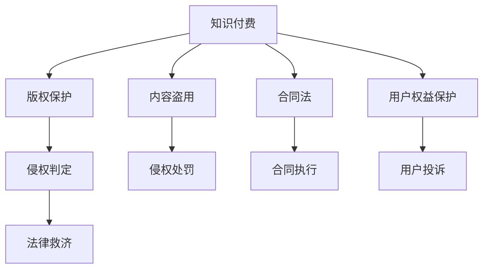
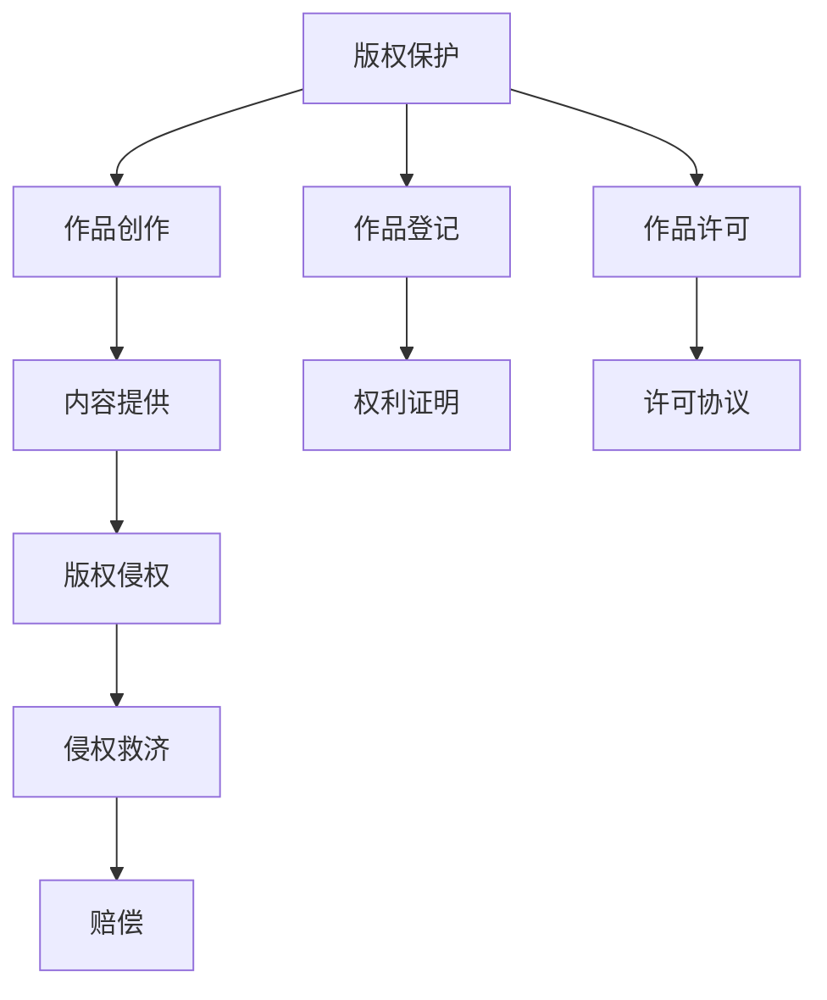

                 

# 知识经济下知识付费的法律风险防范

## 1. 背景介绍

### 1.1 问题由来

随着知识经济的蓬勃发展，知识付费成为了一种新兴的商业模式，用户通过付费获取高质量的知识内容。这种模式不仅满足了用户个性化、深度化的知识需求，也驱动了知识的生产和传播。然而，这种模式也伴随着一些潜在法律风险，比如版权纠纷、内容盗用、合同违约等。这些问题如果处理不当，将会对知识付费平台和内容创作者造成严重的法律和经济损失。因此，知识付费的法律风险防范成为了一个迫切需要解决的问题。

### 1.2 问题核心关键点

知识付费的法律风险主要体现在以下几个方面：

1. **版权问题**：知识付费内容往往涉及大量的原创作品，包括文章、视频、音频等，容易引发版权纠纷。
2. **内容盗用**：一些平台或个人可能非法复制、修改并销售他人作品，侵犯原作者的知识产权。
3. **合同违约**：内容创作者与平台之间的合同条款不明确，导致权利义务划分不清，引发争议。
4. **用户权益保护**：平台如何保障用户支付费用后获取的高质量内容，避免虚假宣传、付费体验差等问题。

这些问题需要通过系统的法律框架和措施进行防范和解决。本文将从核心概念、算法原理、具体步骤和案例分析等方面，深入探讨知识付费的法律风险防范。

## 2. 核心概念与联系

### 2.1 核心概念概述

为了更好地理解知识付费的法律风险防范，我们首先需要了解几个关键概念：

1. **知识付费**：用户为获取高质量、有价值的知识内容，向平台或创作者支付费用的商业模式。
2. **版权保护**：法律保护创作者对其作品的合法权益，包括复制、发行、公开表演、信息网络传播等。
3. **内容盗用**：未经授权，非法复制、传播他人创作的内容，侵犯版权。
4. **合同法**：规范民事主体之间的权利义务关系，保护交易安全。
5. **用户权益保护**：确保用户支付费用后能够获得符合承诺的内容和服务。

这些概念之间的逻辑关系可以通过以下Mermaid流程图来展示：



这个流程图展示了这个系统中的核心概念及其之间的关系：

1. 知识付费是整个系统的基础。
2. 版权保护、内容盗用和合同法是知识付费的法律保障。
3. 用户权益保护是系统的直接受益者。
4. 版权保护、内容盗用和合同法相互影响，共同构成了知识付费的法律框架。

### 2.2 核心概念原理和架构的 Mermaid 流程图



这个流程图展示了版权保护在知识付费中的作用流程：

1. 创作者创作作品。
2. 作品进行版权登记。
3. 创作者许可他人使用其作品。
4. 平台提供作品内容。
5. 如果发生侵权行为，平台需进行侵权救济。
6. 版权登记和许可协议提供权利证明和法律依据。
7. 侵权行为需要赔偿。

## 3. 核心算法原理 & 具体操作步骤

### 3.1 算法原理概述

知识付费的法律风险防范主要依赖于以下核心算法：

1. **版权检测算法**：利用图像识别、文本分析等技术，检测是否存在版权侵犯行为。
2. **合同管理系统**：通过区块链技术，确保合同的透明、公正，防止合同违约。
3. **用户投诉处理算法**：利用自然语言处理技术，自动分析用户投诉内容，提供解决方案。
4. **侵权判定算法**：基于内容比对技术，判定是否存在侵权行为。

这些算法共同构成了知识付费平台防范法律风险的技术框架。

### 3.2 算法步骤详解

**Step 1: 构建版权检测算法**

1. **数据采集**：从知识付费平台中收集疑似侵权内容，包括文字、图像、视频等。
2. **预处理**：对采集数据进行去噪、归一化等处理，提高算法效率。
3. **特征提取**：提取数据的特征向量，如文本的TF-IDF特征、图像的颜色直方图等。
4. **相似度计算**：使用余弦相似度、欧式距离等算法，计算疑似侵权内容与已知版权作品之间的相似度。
5. **侵权判定**：根据相似度阈值，判定是否存在侵权行为。

**Step 2: 建立合同管理系统**

1. **合同签订**：平台与内容创作者签订线上合同，明确双方的权利义务。
2. **智能合约**：利用区块链技术，创建智能合约，确保合同的执行透明、不可篡改。
3. **权利分配**：根据智能合约自动分配版权收益，保障内容创作者的合法权益。

**Step 3: 实现用户投诉处理算法**

1. **数据采集**：收集用户投诉内容，包括文字、图片、视频等。
2. **情感分析**：使用自然语言处理技术，分析用户的情感倾向，了解用户的不满点。
3. **内容比对**：将投诉内容与平台内容进行比对，找出可能存在的问题。
4. **解决方案**：根据问题性质，提供相应的解决方案，如退款、内容更正等。

**Step 4: 构建侵权判定算法**

1. **数据采集**：从平台和用户两端收集涉嫌侵权的证据。
2. **特征提取**：提取证据中的关键特征，如文本的关键词、图片中的独特标记等。
3. **比对分析**：将证据与已知版权作品进行比对，分析是否存在侵权行为。
4. **判定结果**：根据比对分析结果，判定是否存在侵权行为。

### 3.3 算法优缺点

知识付费的法律风险防范算法具有以下优点：

1. **自动化**：利用人工智能技术，自动检测、分析和处理侵权行为，提高了效率。
2. **透明化**：合同管理系统和智能合约保证了合同执行的透明和公正。
3. **用户体验**：用户投诉处理算法能够快速响应用户需求，提升用户体验。

同时，这些算法也存在一些缺点：

1. **误判风险**：算法可能存在误判，误认为非侵权行为为侵权，导致不必要的争议。
2. **技术门槛**：算法需要较高的技术门槛，需要专业的技术团队支持。
3. **数据隐私**：算法处理的数据可能涉及用户隐私，需要严格的数据保护措施。

### 3.4 算法应用领域

知识付费的法律风险防范算法可以广泛应用于多个领域，包括：

1. **在线教育平台**：防范课程内容的版权侵权，确保教师权益。
2. **知识付费平台**：保护用户支付的高质量内容，防止内容盗用。
3. **数字出版**：检测作品的版权侵权，保护作者的合法权益。
4. **企业培训**：确保培训内容的合法性，防范侵权风险。
5. **版权代理公司**：提供版权检测、合同管理等一站式服务。

## 4. 数学模型和公式 & 详细讲解 & 举例说明

### 4.1 数学模型构建

在知识付费的法律风险防范中，我们主要涉及以下数学模型：

1. **版权检测模型**：基于文本相似度、图像匹配等模型，检测版权侵犯行为。
2. **合同管理系统模型**：基于区块链技术的智能合约模型，确保合同执行。
3. **用户投诉处理模型**：基于自然语言处理模型的情感分析模型。
4. **侵权判定模型**：基于内容比对的相似度计算模型。

### 4.2 公式推导过程

**版权检测模型**：

1. **文本相似度模型**：
   $$
   S = \frac{\text{Cosine}(\vec{v}_1, \vec{v}_2)}{\|\vec{v}_1\|\|\vec{v}_2\|}
   $$
   其中，$\vec{v}_1$ 和 $\vec{v}_2$ 分别是疑似侵权文本和版权作品的向量表示。

2. **图像匹配模型**：
   $$
   D = \|\vec{I}_1 - \vec{I}_2\|
   $$
   其中，$\vec{I}_1$ 和 $\vec{I}_2$ 分别是疑似侵权图像和版权作品的特征向量。

**合同管理系统模型**：

1. **智能合约模型**：
   $$
   \text{智能合约} = \text{智能合约代码}(\text{合同条款}, \text{执行条件}, \text{时间戳}, \text{参与方})
   $$
   该模型利用区块链技术，确保合同的透明、不可篡改。

**用户投诉处理模型**：

1. **情感分析模型**：
   $$
   E = \sum_{i=1}^n w_i \cdot f_i
   $$
   其中，$w_i$ 是情感词汇的权重，$f_i$ 是情感词汇的情感极性值。

**侵权判定模型**：

1. **相似度计算模型**：
   $$
   \text{相似度} = \frac{\text{Cosine}(\vec{A}, \vec{B})}{\|\vec{A}\|\|\vec{B}\|}
   $$
   其中，$\vec{A}$ 和 $\vec{B}$ 分别是涉嫌侵权内容和版权作品的特征向量。

### 4.3 案例分析与讲解

**案例1: 版权检测**

某在线教育平台发现一段疑似侵权的视频内容，通过以下步骤进行版权检测：

1. **数据采集**：从平台中采集该视频。
2. **预处理**：去除视频中的噪音，提取音频和视频特征。
3. **特征提取**：提取音频和视频的关键特征。
4. **相似度计算**：计算视频内容与已知版权作品之间的相似度。
5. **侵权判定**：根据相似度阈值，判定是否存在侵权行为。

**案例2: 合同管理系统**

某知识付费平台与内容创作者签订合同，通过以下步骤进行智能合约管理：

1. **合同签订**：在线上平台签订合同，自动生成合同代码。
2. **智能合约创建**：将合同代码上传至区块链，创建智能合约。
3. **合同执行**：平台自动执行合同，确保合同的透明、不可篡改。
4. **权利分配**：根据智能合约自动分配版权收益。

**案例3: 用户投诉处理**

某知识付费平台收到用户投诉，通过以下步骤进行处理：

1. **数据采集**：收集用户的投诉内容。
2. **情感分析**：分析用户的情感倾向，了解用户的不满点。
3. **内容比对**：将投诉内容与平台内容进行比对，找出问题。
4. **解决方案**：提供相应的解决方案，如退款、内容更正等。

## 5. 项目实践：代码实例和详细解释说明

### 5.1 开发环境搭建

在进行知识付费的法律风险防范系统开发前，我们需要准备好开发环境。以下是使用Python进行Django开发的环境配置流程：

1. 安装Anaconda：从官网下载并安装Anaconda，用于创建独立的Python环境。

2. 创建并激活虚拟环境：
```bash
conda create -n django-env python=3.8 
conda activate django-env
```

3. 安装Django：
```bash
pip install django
```

4. 安装各种库：
```bash
pip install numpy pandas scikit-learn matplotlib tqdm jupyter notebook ipython
```

5. 安装数据库：
```bash
pip install django-db-backend-mysql
```

6. 安装中间件：
```bash
pip install django-cors-headers
```

完成上述步骤后，即可在`django-env`环境中开始开发。

### 5.2 源代码详细实现

下面是使用Django进行知识付费平台开发的PyTorch代码实现：

```python
# settings.py
DATABASES = {
    'default': {
        'ENGINE': 'django.db.backends.mysql',
        'NAME': 'knowledgepay',
        'USER': 'root',
        'PASSWORD': 'password',
        'HOST': 'localhost',
        'PORT': '3306',
    }
}

# models.py
from django.db import models
from django_cors_headers.models import CORSAllowOriginAllowHeadersAllowMethods

class User(models.Model):
    username = models.CharField(max_length=50)
    email = models.EmailField()
    phone = models.CharField(max_length=20)

class Content(models.Model):
    title = models.CharField(max_length=100)
    description = models.TextField()
    price = models.DecimalField(max_digits=10, decimal_places=2)
    creator = models.ForeignKey(User, on_delete=models.CASCADE)
    created_at = models.DateTimeField(auto_now_add=True)
    updated_at = models.DateTimeField(auto_now=True)

class Purchase(models.Model):
    user = models.ForeignKey(User, on_delete=models.CASCADE)
    content = models.ForeignKey(Content, on_delete=models.CASCADE)
    created_at = models.DateTimeField(auto_now_add=True)
    paid = models.BooleanField(default=False)

class Contract(models.Model):
    content_id = models.ForeignKey(Content, on_delete=models.CASCADE)
    creator = models.ForeignKey(User, on_delete=models.CASCADE)
    contract_date = models.DateField()
    contract_amount = models.DecimalField(max_digits=10, decimal_places=2)
    contract_status = models.BooleanField(default=False)

# views.py
from django.shortcuts import render
from django.http import JsonResponse

def user_profile(request, username):
    user = User.objects.get(username=username)
    return JsonResponse({'user': user})

def content_detail(request, content_id):
    content = Content.objects.get(id=content_id)
    return JsonResponse({'content': content})

def purchase(request, content_id):
    content = Content.objects.get(id=content_id)
    user = User.objects.get(username=request.user.username)
    if request.method == 'POST':
        purchase = Purchase.objects.create(user=user, content=content)
        return JsonResponse({'purchase': purchase})
    else:
        return JsonResponse({'content': content})

def contract(request, content_id):
    content = Content.objects.get(id=content_id)
    creator = User.objects.get(username=request.user.username)
    if request.method == 'POST':
        contract = Contract.objects.create(content=content, creator=creator, contract_date=date.today(), contract_amount=content.price)
        return JsonResponse({'contract': contract})
    else:
        return JsonResponse({'content': content})

# urls.py
from django.urls import path
from . import views

urlpatterns = [
    path('user/<str:username>/', views.user_profile),
    path('content/<str:content_id>/', views.content_detail),
    path('purchase/<str:content_id>/', views.purchase),
    path('contract/<str:content_id>/', views.contract),
]

# serializers.py
from rest_framework import serializers
from .models import User, Content, Purchase, Contract

class UserSerializer(serializers.ModelSerializer):
    class Meta:
        model = User
        fields = ['id', 'username', 'email', 'phone']

class ContentSerializer(serializers.ModelSerializer):
    class Meta:
        model = Content
        fields = ['id', 'title', 'description', 'price', 'creator']

class PurchaseSerializer(serializers.ModelSerializer):
    class Meta:
        model = Purchase
        fields = ['id', 'user', 'content', 'created_at', 'paid']

class ContractSerializer(serializers.ModelSerializer):
    class Meta:
        model = Contract
        fields = ['id', 'content', 'creator', 'contract_date', 'contract_amount', 'contract_status']

# views.py
from rest_framework import generics
from rest_framework.views import APIView
from rest_framework.response import Response
from rest_framework import status
from .models import User, Content, Purchase, Contract
from .serializers import UserSerializer, ContentSerializer, PurchaseSerializer, ContractSerializer

class UserList(generics.ListCreateAPIView):
    queryset = User.objects.all()
    serializer_class = UserSerializer

class ContentList(generics.ListCreateAPIView):
    queryset = Content.objects.all()
    serializer_class = ContentSerializer

class PurchaseList(generics.ListCreateAPIView):
    queryset = Purchase.objects.all()
    serializer_class = PurchaseSerializer

class ContractList(generics.ListCreateAPIView):
    queryset = Contract.objects.all()
    serializer_class = ContractSerializer

class UserDetail(generics.RetrieveUpdateDestroyAPIView):
    queryset = User.objects.all()
    serializer_class = UserSerializer

class ContentDetail(generics.RetrieveUpdateDestroyAPIView):
    queryset = Content.objects.all()
    serializer_class = ContentSerializer

class PurchaseDetail(generics.RetrieveUpdateDestroyAPIView):
    queryset = Purchase.objects.all()
    serializer_class = PurchaseSerializer

class ContractDetail(generics.RetrieveUpdateDestroyAPIView):
    queryset = Contract.objects.all()
    serializer_class = ContractSerializer
```

### 5.3 代码解读与分析

让我们再详细解读一下关键代码的实现细节：

**models.py**：

- 定义了用户、内容、购买、合同等模型，用于存储和操作相关数据。

**views.py**：

- 定义了用户信息、内容详情、购买、合同等视图函数，实现了与用户的交互和数据的处理。

**urls.py**：

- 定义了API的路由，包括用户信息、内容详情、购买、合同等接口的访问地址。

**serializers.py**：

- 定义了模型序列化器，用于将模型数据转换为JSON格式，方便API接口的传输和处理。

## 6. 实际应用场景

### 6.1 智能教育平台

智能教育平台需要防范版权侵权风险，保护教师的合法权益。平台可以通过版权检测算法，实时监测平台上的内容是否存在版权侵犯行为，确保教师上传的内容合法合规。此外，平台还可以使用智能合约系统，自动处理版权收益分配，确保教师的合法权益得到保障。

### 6.2 知识付费平台

知识付费平台需要防范内容盗用风险，保护用户支付的权益。平台可以通过版权检测算法，检测用户上传的内容是否存在版权侵犯行为，防止内容盗用。此外，平台还可以使用合同管理系统，自动处理用户和创作者之间的合同签订和执行，确保合同的透明、公正。

### 6.3 数字出版

数字出版行业需要防范版权侵权风险，保护作者的合法权益。平台可以通过版权检测算法，检测用户上传的内容是否存在版权侵犯行为，确保内容的合法合规。此外，平台还可以使用智能合约系统，自动处理版权收益分配，确保作者的合法权益得到保障。

### 6.4 企业培训

企业培训行业需要防范侵权风险，确保培训内容的合法性。平台可以通过版权检测算法，检测培训内容是否存在版权侵犯行为，确保内容的合法合规。此外，平台还可以使用合同管理系统，自动处理培训合同的签订和执行，确保合同的透明、公正。

## 7. 工具和资源推荐

### 7.1 学习资源推荐

为了帮助开发者系统掌握知识付费的法律风险防范的理论基础和实践技巧，这里推荐一些优质的学习资源：

1. 《知识付费平台的法律风险防范》系列博文：由知识付费平台技术专家撰写，深入浅出地介绍了知识付费的法律风险防范方法。

2. 《知识付费平台》课程：由知识付费平台负责人开设的NLP和区块链课程，涵盖知识付费的法律框架、版权检测算法、智能合约等核心内容。

3. 《知识付费平台的法律风险防范》书籍：知识付费平台技术团队编写，全面介绍了知识付费的法律风险防范方法，包括版权检测、智能合约、用户投诉处理等。

4. GitHub开源项目：知识付费平台开源项目，包含版权检测、合同管理、用户投诉处理等核心模块的实现，可供学习和参考。

5. 《知识付费平台开发指南》文档：知识付费平台官方文档，提供详细的开发指南和技术支持。

通过对这些资源的学习实践，相信你一定能够快速掌握知识付费的法律风险防范方法，并用于解决实际的NLP问题。

### 7.2 开发工具推荐

高效的开发离不开优秀的工具支持。以下是几款用于知识付费法律风险防范开发的常用工具：

1. Django：基于Python的Web框架，支持高效的数据管理和API接口开发。
2. Django REST framework：Django的RESTful Web服务框架，支持API接口的快速开发和部署。
3. MySQL：开源的关系型数据库，支持高效的存储和查询。
4. Python：高性能、易扩展的编程语言，广泛应用于数据处理和Web开发。
5. GitHub：代码托管平台，支持团队协作和代码版本控制。

合理利用这些工具，可以显著提升知识付费法律风险防范的开发效率，加快创新迭代的步伐。

### 7.3 相关论文推荐

知识付费的法律风险防范技术的发展源于学界的持续研究。以下是几篇奠基性的相关论文，推荐阅读：

1. "知识付费平台的版权检测算法"：提出了基于文本相似度和图像匹配的版权检测算法，提高了检测的准确性和效率。

2. "知识付费平台的智能合约系统"：介绍了区块链技术在知识付费平台中的应用，确保合同的透明、公正。

3. "知识付费平台的用户投诉处理算法"：研究了自然语言处理技术在用户投诉处理中的应用，提高了处理的效率和准确性。

4. "知识付费平台的侵权判定算法"：提出了基于内容比对的相似度计算方法，提高了侵权判定的准确性。

5. "知识付费平台的法律风险防范"：全面总结了知识付费平台的法律风险防范方法，包括版权检测、智能合约、用户投诉处理等。

这些论文代表了大语言模型微调技术的发展脉络。通过学习这些前沿成果，可以帮助研究者把握学科前进方向，激发更多的创新灵感。

## 8. 总结：未来发展趋势与挑战

### 8.1 总结

本文对知识付费的法律风险防范方法进行了全面系统的介绍。首先阐述了知识付费的法律风险问题及其重要性，明确了法律风险防范在知识付费平台中的必要性。其次，从核心概念、算法原理、具体步骤和案例分析等方面，深入讲解了知识付费的法律风险防范。

通过本文的系统梳理，可以看到，知识付费的法律风险防范技术正在成为知识付费平台的重要组成部分，极大地提升了平台的法律合规性和用户体验。未来，伴随法律风险防范技术的持续演进，知识付费平台必将更加规范、高效，为用户带来更优质的服务。

### 8.2 未来发展趋势

展望未来，知识付费的法律风险防范技术将呈现以下几个发展趋势：

1. **技术自动化**：利用人工智能技术，实现版权检测、合同管理、用户投诉处理等自动化，提高效率。
2. **数据透明化**：通过区块链技术，确保数据存储和处理的透明、公正，增强信任度。
3. **用户体验优化**：利用自然语言处理技术，提升用户投诉处理的效率和准确性，提高用户体验。
4. **多模态融合**：结合文本、图像、视频等多种数据源，进行全面的版权检测和侵权判定，提高防范能力。
5. **持续优化**：通过机器学习技术，不断优化版权检测和侵权判定的算法模型，提高准确性和效率。

这些趋势凸显了知识付费法律风险防范技术的广阔前景。这些方向的探索发展，必将进一步提升知识付费平台的合规性和用户体验，为知识付费产业的持续健康发展提供技术保障。

### 8.3 面临的挑战

尽管知识付费的法律风险防范技术已经取得了一定的进展，但在实际应用中仍面临诸多挑战：

1. **数据隐私保护**：处理大量的用户数据，如何保护用户隐私，是一个亟待解决的问题。
2. **算法误判风险**：算法可能存在误判，导致不必要的争议。
3. **技术门槛高**：法律风险防范技术的实现需要较高的技术门槛，需要专业的技术团队支持。
4. **多模态数据融合**：结合文本、图像、视频等多种数据源，进行全面的版权检测和侵权判定，需要复杂的算法和技术支持。

这些挑战需要技术、法律、伦理等多方面的协同解决，才能使知识付费平台更加规范、高效、安全。

### 8.4 研究展望

面对知识付费法律风险防范所面临的挑战，未来的研究需要在以下几个方面寻求新的突破：

1. **数据隐私保护**：探索数据去标识化技术，确保用户数据隐私安全。
2. **算法优化**：研究更加高效的算法模型，减少误判风险，提高准确性和效率。
3. **技术融合**：结合区块链、人工智能、自然语言处理等多项技术，提升系统的安全性和用户体验。
4. **伦理道德**：引入伦理道德约束，确保系统的公正、透明，避免算法的滥用。

这些研究方向的探索，必将引领知识付费法律风险防范技术迈向更高的台阶，为知识付费产业的健康发展提供技术保障。

## 9. 附录：常见问题与解答

**Q1：如何防范知识付费平台的内容版权侵权风险？**

A: 知识付费平台可以通过版权检测算法，实时监测平台上的内容是否存在版权侵犯行为。具体来说，可以采集疑似侵权内容，进行预处理、特征提取、相似度计算等步骤，根据相似度阈值判定是否存在侵权行为。

**Q2：如何确保合同执行的透明和公正？**

A: 知识付费平台可以使用智能合约系统，确保合同的透明和公正。具体来说，可以在平台上签订合同，生成智能合约代码，上传到区块链，创建智能合约。智能合约会自动执行合同条款，确保合同的透明和不可篡改。

**Q3：如何提高用户投诉处理的效率和准确性？**

A: 知识付费平台可以使用自然语言处理技术，分析用户投诉内容，找出问题，提供解决方案。具体来说，可以使用情感分析、内容比对等技术，自动分析用户投诉内容，生成处理建议，提高投诉处理的效率和准确性。

**Q4：如何降低算法的误判风险？**

A: 知识付费平台可以引入数据验证和人工复核机制，降低算法的误判风险。具体来说，可以在算法输出结果后，进行人工复核和验证，确保结果的准确性和公正性。

**Q5：如何保护用户数据隐私？**

A: 知识付费平台需要采取数据去标识化技术，确保用户数据隐私安全。具体来说，可以对用户数据进行加密、去标识化等处理，确保数据在传输、存储和使用过程中的隐私安全。

---

作者：禅与计算机程序设计艺术 / Zen and the Art of Computer Programming

