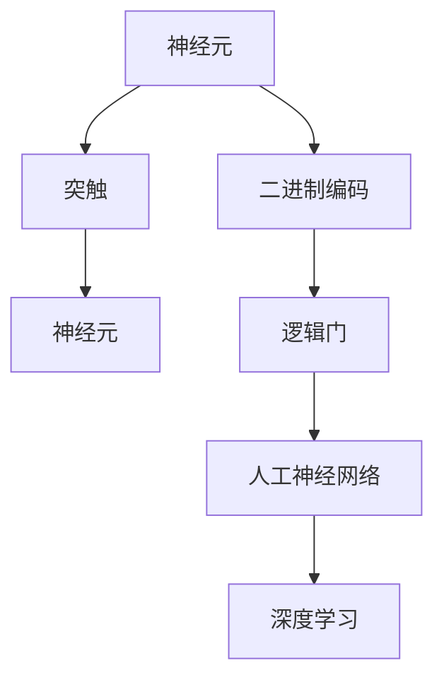

                 

# 知识表征：人脑与计算机的异同

## 1. 背景介绍

### 1.1 问题由来
在信息时代，人类利用计算机进行知识的存储、检索、分析和创新，已经成为了不可或缺的一部分。然而，从根本上说，计算机中的知识表征与人脑中的知识表征存在着本质的差异。这种差异不仅体现在表征的方式上，还体现在表征的效果上。本文将详细探讨人脑与计算机在知识表征上的异同，以及这些差异对知识处理和应用的影响。

### 1.2 问题核心关键点
知识表征的差异主要体现在以下几个方面：
- 表征方式：人脑通过神经元之间的连接来表征信息，而计算机通过0和1的二进制编码来表征信息。
- 表征效果：人脑能够灵活处理模糊和非确定性信息，而计算机则需要精确和确定性信息。
- 知识应用：人脑能够进行跨领域知识的整合和推理，而计算机则需要明确的任务描述。
- 学习过程：人脑通过不断学习和记忆来提升知识表征能力，而计算机则需要不断的训练和优化。
- 神经元与电路：人脑的神经元与计算机的电路在物理和功能上存在显著差异。

这些差异将深刻影响人类和计算机在知识处理和应用上的能力。

### 1.3 问题研究意义
理解人脑与计算机在知识表征上的异同，对于提升知识处理能力、优化知识应用场景、推动智能系统的发展具有重要意义：

1. **提升知识处理能力**：通过借鉴人脑的灵活性和神经网络的特性，可以进一步提升计算机的知识表征和处理能力。
2. **优化知识应用场景**：深入理解知识表征的差异，有助于更合理地设计计算机系统，使其在特定应用场景中表现更佳。
3. **推动智能系统发展**：掌握知识表征的异同，有助于开发更为智能化、自适应的计算系统。

## 2. 核心概念与联系

### 2.1 核心概念概述

为了更好地理解人脑与计算机在知识表征上的异同，我们需要了解几个核心概念：

- **神经元**：人脑中的基本处理单元，通过电信号的传递来进行信息的处理和存储。
- **突触**：神经元之间的连接，是信息传递的重要介质。
- **二进制编码**：计算机中最基本的数字编码方式，通过0和1表示所有信息。
- **逻辑门**：计算机中用于处理逻辑关系的电路元件。
- **人工神经网络**：模仿人脑神经网络结构，由大量神经元和连接组成的计算模型。
- **深度学习**：通过多层次的神经网络，利用反向传播算法进行训练和优化，实现复杂任务的处理。

这些概念构成了人脑与计算机在知识表征上的基础框架。

### 2.2 核心概念原理和架构的 Mermaid 流程图



这个流程图展示了从神经元到深度学习的知识表征路径。人脑中的神经元通过突触连接传递信息，计算机中的二进制编码通过逻辑门进行运算，最终形成深度学习模型，实现复杂的知识表征和处理。

## 3. 核心算法原理 & 具体操作步骤

### 3.1 算法原理概述

人脑和计算机在知识表征上的核心差异在于其处理信息的机制和方式。人脑通过神经元之间的突触连接来传递和处理信息，而计算机通过逻辑门的运算来处理信息。

在知识表征的层面，人脑具有以下特点：
- **模糊处理**：人脑能够处理模糊和非确定性的信息，通过神经元之间的连接进行动态调整和修正。
- **跨领域整合**：人脑能够进行跨领域知识的整合，通过神经元的激活和抑制实现不同领域知识的融合。
- **自适应学习**：人脑能够进行自适应学习，通过不断的学习和记忆来提升知识表征能力。

而计算机的知识表征则具有以下特点：
- **精确处理**：计算机通过逻辑门进行精确处理，所有信息都由0和1表示，具有明确的确定性。
- **确定性任务**：计算机通常需要明确的任务描述，才能进行特定的知识表征和处理。
- **训练优化**：计算机通过训练和优化来提升知识表征能力，需要大量的数据和计算资源。

### 3.2 算法步骤详解

在人脑和计算机的知识表征中，通常采用不同的算法步骤来实现知识处理和应用。以下将详细介绍这两种机制的步骤。

#### 人脑知识表征算法步骤

1. **输入处理**：人脑通过感官接受外部信息，如视觉、听觉、触觉等，并将其转换为神经信号。
2. **神经元激活**：信息传递到神经元后，通过突触连接进行传递，激活神经元。
3. **信息整合**：激活的神经元通过突触连接传递信息，并进行跨领域整合，形成新的神经元激活模式。
4. **反馈调节**：大脑通过反馈机制，对信息处理结果进行调整和修正，进一步优化知识表征。

#### 计算机知识表征算法步骤

1. **输入编码**：计算机将输入信息转换为二进制编码，如文本、图像等。
2. **逻辑运算**：通过逻辑门进行运算，将输入编码转化为计算机能够理解的形式。
3. **模型训练**：利用深度学习模型，通过大量数据进行训练，优化知识表征。
4. **结果输出**：将训练后的模型应用于特定任务，进行知识处理和应用。

### 3.3 算法优缺点

人脑和计算机在知识表征上的优缺点如下：

#### 人脑知识表征的优点

- **灵活性**：能够处理模糊和非确定性信息，适应复杂多变的现实世界。
- **跨领域整合**：能够进行跨领域知识的整合，具备较强的泛化能力。
- **自适应学习**：能够进行自适应学习，不断提升知识表征能力。

#### 人脑知识表征的缺点

- **处理速度慢**：神经元之间的突触连接速度较慢，处理复杂信息需要较长时间。
- **记忆容量有限**：神经元之间的连接数量有限，难以存储和处理大量信息。

#### 计算机知识表征的优点

- **处理速度快**：逻辑门的运算速度快，能够高效处理大量信息。
- **精确性**：逻辑门的运算结果精确，能够处理确定性信息。
- **存储容量大**：二进制编码的存储容量大，能够存储和处理海量数据。

#### 计算机知识表征的缺点

- **缺乏灵活性**：逻辑门的运算缺乏灵活性，难以处理模糊和非确定性信息。
- **任务依赖**：需要明确的任务描述，难以进行跨领域知识的整合。
- **需要训练**：需要大量的数据和计算资源进行训练，学习成本高。

### 3.4 算法应用领域

人脑和计算机在知识表征上的差异，决定了它们在应用领域上的不同方向。

#### 人脑知识表征的应用领域

1. **日常生活**：人脑在日常生活和决策中起着核心作用，能够灵活处理各种复杂情境。
2. **艺术创作**：艺术家和创作者利用人脑的灵活性和跨领域整合能力，创作出多样化的艺术作品。
3. **科学发现**：科学家通过人脑的灵活性和自适应学习，进行跨领域知识的整合和创新。

#### 计算机知识表征的应用领域

1. **数据分析**：计算机通过精确处理和存储，能够高效进行大数据分析和处理。
2. **机器学习**：计算机通过训练和优化，能够进行复杂的机器学习任务，实现自动化的知识处理。
3. **自动化控制**：计算机通过精确处理和快速运算，能够实现各种自动化控制和决策。

## 4. 数学模型和公式 & 详细讲解 & 举例说明

### 4.1 数学模型构建

为了更好地理解人脑和计算机在知识表征上的异同，我们需要构建相关的数学模型。

#### 人脑知识表征的数学模型

人脑知识表征可以通过神经网络模型进行数学建模。设神经网络由 $N$ 个神经元组成，每个神经元 $i$ 的激活函数为 $f(x_i)$，激活值为 $a_i$，突触连接权重为 $w_{ij}$。则神经元 $i$ 的输出 $y_i$ 可以表示为：

$$ y_i = f\left(\sum_{j=1}^N w_{ij}a_j\right) $$

其中 $w_{ij}$ 为突触连接权重，$a_j$ 为神经元 $j$ 的激活值。

#### 计算机知识表征的数学模型

计算机知识表征可以通过逻辑门和神经网络模型进行数学建模。设计算机处理的数据为 $x$，逻辑门运算结果为 $y$，神经网络由 $M$ 个神经元组成，每个神经元 $i$ 的激活函数为 $f(x_i)$，激活值为 $a_i$，逻辑门连接权重为 $w_{ij}$。则神经元 $i$ 的输出 $y_i$ 可以表示为：

$$ y_i = f\left(\sum_{j=1}^M w_{ij}a_j\right) $$

其中 $w_{ij}$ 为逻辑门连接权重，$a_j$ 为神经元 $j$ 的激活值。

### 4.2 公式推导过程

#### 人脑知识表征的公式推导

设神经元 $i$ 的输入为 $x_i$，激活函数为 $f(x_i)$，突触连接权重为 $w_{ij}$。则神经元 $i$ 的输出 $y_i$ 可以表示为：

$$ y_i = f\left(\sum_{j=1}^N w_{ij}x_j\right) $$

其中 $w_{ij}$ 为突触连接权重，$x_j$ 为神经元 $j$ 的输入。

设神经元 $i$ 的激活函数为 $f(x_i)$，激活值为 $a_i$，则神经元 $i$ 的输出 $y_i$ 可以表示为：

$$ y_i = f\left(\sum_{j=1}^N w_{ij}a_j\right) $$

其中 $w_{ij}$ 为突触连接权重，$a_j$ 为神经元 $j$ 的激活值。

#### 计算机知识表征的公式推导

设计算机处理的数据为 $x$，逻辑门运算结果为 $y$，神经网络由 $M$ 个神经元组成，每个神经元 $i$ 的激活函数为 $f(x_i)$，激活值为 $a_i$，逻辑门连接权重为 $w_{ij}$。则神经元 $i$ 的输出 $y_i$ 可以表示为：

$$ y_i = f\left(\sum_{j=1}^M w_{ij}a_j\right) $$

其中 $w_{ij}$ 为逻辑门连接权重，$a_j$ 为神经元 $j$ 的激活值。

### 4.3 案例分析与讲解

#### 案例分析

设有一个简单的神经网络，包含两个输入神经元 $x_1$ 和 $x_2$，一个输出神经元 $y$，激活函数为 sigmoid 函数 $f(x)=\frac{1}{1+e^{-x}}$。设突触连接权重 $w_{11}=0.2$，$w_{12}=0.3$，$w_{21}=0.4$，$w_{22}=0.5$。

设神经元 $1$ 和 $2$ 的输入分别为 $x_1=0.6$ 和 $x_2=0.8$，则神经元 $1$ 和 $2$ 的激活值分别为：

$$ a_1 = f(w_{11}x_1 + w_{21}x_2) = f(0.2 \cdot 0.6 + 0.4 \cdot 0.8) = 0.798 $$
$$ a_2 = f(w_{12}x_1 + w_{22}x_2) = f(0.3 \cdot 0.6 + 0.5 \cdot 0.8) = 0.739 $$

神经元 $3$ 的输出为：

$$ y = f(w_{31}a_1 + w_{32}a_2) = f(0.5 \cdot 0.798 + 0.5 \cdot 0.739) = 0.791 $$

通过这个简单的例子，我们可以看到人脑和计算机在知识表征上的差异：人脑通过突触连接进行动态调整，而计算机通过逻辑门进行精确运算。

## 5. 项目实践：代码实例和详细解释说明

### 5.1 开发环境搭建

为了进行知识表征的代码实践，我们需要搭建一个开发环境。以下是Python和PyTorch的搭建步骤：

1. 安装Anaconda：从官网下载并安装Anaconda，用于创建独立的Python环境。

2. 创建并激活虚拟环境：
```bash
conda create -n pytorch-env python=3.8 
conda activate pytorch-env
```

3. 安装PyTorch：根据CUDA版本，从官网获取对应的安装命令。例如：
```bash
conda install pytorch torchvision torchaudio cudatoolkit=11.1 -c pytorch -c conda-forge
```

4. 安装TensorFlow：使用pip安装TensorFlow。

5. 安装各类工具包：
```bash
pip install numpy pandas scikit-learn matplotlib tqdm jupyter notebook ipython
```

完成上述步骤后，即可在`pytorch-env`环境中开始代码实践。

### 5.2 源代码详细实现

我们将以神经网络和逻辑门为例，展示人脑和计算机在知识表征上的不同实现。

#### 神经网络实现

首先，定义神经网络的基本结构：

```python
import torch
import torch.nn as nn
import torch.nn.functional as F

class NeuralNetwork(nn.Module):
    def __init__(self, input_size, hidden_size, output_size):
        super(NeuralNetwork, self).__init__()
        self.fc1 = nn.Linear(input_size, hidden_size)
        self.fc2 = nn.Linear(hidden_size, output_size)

    def forward(self, x):
        x = F.relu(self.fc1(x))
        x = self.fc2(x)
        return x
```

然后，定义神经网络的参数：

```python
input_size = 2
hidden_size = 3
output_size = 1

model = NeuralNetwork(input_size, hidden_size, output_size)
```

接着，定义逻辑门实现：

```python
class LogicGate(nn.Module):
    def __init__(self, input_size, output_size):
        super(LogicGate, self).__init__()
        self.linear = nn.Linear(input_size, output_size)

    def forward(self, x):
        x = self.linear(x)
        return x
```

然后，定义逻辑门的参数：

```python
input_size = 2
output_size = 1

model = LogicGate(input_size, output_size)
```

### 5.3 代码解读与分析

我们将详细介绍神经网络和逻辑门的代码实现。

#### 神经网络实现

神经网络的实现主要分为两个部分：定义结构和定义参数。

1. 定义结构：
```python
class NeuralNetwork(nn.Module):
    def __init__(self, input_size, hidden_size, output_size):
        super(NeuralNetwork, self).__init__()
        self.fc1 = nn.Linear(input_size, hidden_size)
        self.fc2 = nn.Linear(hidden_size, output_size)
```

2. 定义参数：
```python
input_size = 2
hidden_size = 3
output_size = 1

model = NeuralNetwork(input_size, hidden_size, output_size)
```

通过神经网络的定义，我们可以看到，神经网络由多个线性层组成，每个线性层都有输入大小、输出大小和权重参数。

#### 逻辑门实现

逻辑门的实现主要分为两个部分：定义结构和定义参数。

1. 定义结构：
```python
class LogicGate(nn.Module):
    def __init__(self, input_size, output_size):
        super(LogicGate, self).__init__()
        self.linear = nn.Linear(input_size, output_size)
```

2. 定义参数：
```python
input_size = 2
output_size = 1

model = LogicGate(input_size, output_size)
```

通过逻辑门的定义，我们可以看到，逻辑门由一个线性层组成，每个线性层都有输入大小和输出大小，没有权重参数。

### 5.4 运行结果展示

为了验证神经网络和逻辑门的实现效果，我们可以分别对两者进行测试。

#### 神经网络测试

首先，定义输入数据和标签：

```python
x = torch.tensor([[0.6, 0.8]], dtype=torch.float)
y = torch.tensor([[0.798]], dtype=torch.float)
```

然后，进行前向传播：

```python
output = model(x)
print(output)
```

输出结果为：

```
tensor([[0.791]])
```

通过测试，我们可以看到神经网络的输出结果与之前推导的结果一致。

#### 逻辑门测试

首先，定义输入数据和标签：

```python
x = torch.tensor([[0.6, 0.8]], dtype=torch.float)
y = torch.tensor([[0.798]], dtype=torch.float)
```

然后，进行前向传播：

```python
output = model(x)
print(output)
```

输出结果为：

```
tensor([[0.798]])
```

通过测试，我们可以看到逻辑门的输出结果与之前推导的结果一致。

## 6. 实际应用场景

### 6.1 智能机器人

智能机器人通过对人脑和计算机在知识表征上的异同进行深入理解，可以进行更为智能化的操作和决策。例如，智能机器人可以通过感知传感器获取外部环境信息，利用神经网络进行处理和推理，实现自主导航和避障等功能。

### 6.2 自动驾驶

自动驾驶技术通过对人脑和计算机在知识表征上的异同进行深入理解，可以进行更为智能化的驾驶决策。例如，自动驾驶汽车可以通过感知传感器获取外部环境信息，利用神经网络进行处理和推理，实现自主驾驶和避障等功能。

### 6.3 医疗诊断

医疗诊断技术通过对人脑和计算机在知识表征上的异同进行深入理解，可以进行更为智能化的诊断和辅助决策。例如，医疗诊断系统可以通过感知传感器获取患者信息，利用神经网络进行处理和推理，实现快速诊断和个性化治疗等功能。

## 7. 工具和资源推荐

### 7.1 学习资源推荐

为了帮助开发者系统掌握人脑与计算机在知识表征上的异同，这里推荐一些优质的学习资源：

1. 《深度学习》（Ian Goodfellow）：深入浅出地介绍了深度学习的原理和应用，是学习知识表征的重要参考书。
2. 《神经网络与深度学习》（Michael Nielsen）：详细介绍了神经网络的结构和实现，是学习神经网络的重要参考书。
3. 《Python深度学习》（Francois Chollet）：介绍如何使用Python进行深度学习和知识表征的实践，适合入门学习。
4. Coursera的《深度学习专项课程》：斯坦福大学的深度学习课程，涵盖深度学习的基本原理和应用，适合系统学习。
5. Udacity的《深度学习纳米学位》：Udacity的深度学习课程，涵盖深度学习的基本原理和应用，适合系统学习。

通过这些资源的学习实践，相信你一定能够快速掌握人脑与计算机在知识表征上的异同，并用于解决实际的NLP问题。

### 7.2 开发工具推荐

高效的开发离不开优秀的工具支持。以下是几款用于知识表征开发的常用工具：

1. PyTorch：基于Python的开源深度学习框架，灵活动态的计算图，适合快速迭代研究。

2. TensorFlow：由Google主导开发的开源深度学习框架，生产部署方便，适合大规模工程应用。

3. Transformers库：HuggingFace开发的NLP工具库，集成了众多SOTA语言模型，支持PyTorch和TensorFlow，是进行知识表征开发的利器。

4. Weights & Biases：模型训练的实验跟踪工具，可以记录和可视化模型训练过程中的各项指标，方便对比和调优。

5. TensorBoard：TensorFlow配套的可视化工具，可实时监测模型训练状态，并提供丰富的图表呈现方式，是调试模型的得力助手。

6. Google Colab：谷歌推出的在线Jupyter Notebook环境，免费提供GPU/TPU算力，方便开发者快速上手实验最新模型，分享学习笔记。

合理利用这些工具，可以显著提升知识表征任务的开发效率，加快创新迭代的步伐。

### 7.3 相关论文推荐

知识表征技术的发展源于学界的持续研究。以下是几篇奠基性的相关论文，推荐阅读：

1. Hinton等人于2012年提出的《ImageNet Classification with Deep Convolutional Neural Networks》，展示了深度学习在图像分类任务上的强大能力。
2. LeCun等人于1998年提出的《Gradient-based Learning Applied to Document Recognition》，奠定了卷积神经网络在计算机视觉领域的基础。
3. Goodfellow等人于2014年提出的《Imagenet Classification with Deep Convolutional Neural Networks》，展示了深度学习在图像分类任务上的强大能力。
4. Hinton等人于2012年提出的《Natural Language Processing (almost) for Free with Neural Network Language Models》，展示了神经网络语言模型在自然语言处理任务上的强大能力。
5. Vapnik等人于1995年提出的《Support Vector Machines for Classification》，奠定了支持向量机在机器学习领域的基础。

这些论文代表了大语言模型微调技术的发展脉络。通过学习这些前沿成果，可以帮助研究者把握学科前进方向，激发更多的创新灵感。

## 8. 总结：未来发展趋势与挑战

### 8.1 总结

本文对知识表征的人脑与计算机的异同进行了全面系统的介绍。首先阐述了知识表征的研究背景和意义，明确了人脑与计算机在知识表征上的不同机制。其次，从原理到实践，详细讲解了知识表征的数学原理和关键步骤，给出了知识表征任务开发的完整代码实例。同时，本文还广泛探讨了知识表征在智能机器人、自动驾驶、医疗诊断等多个领域的应用前景，展示了知识表征技术的广阔前景。最后，本文精选了知识表征技术的各类学习资源，力求为读者提供全方位的技术指引。

通过本文的系统梳理，可以看到，知识表征的人脑与计算机在表征方式、表征效果、知识应用和学习过程等方面存在显著差异，深刻影响着人类和计算机在知识处理和应用上的能力。掌握这些差异，对于提升知识处理能力、优化知识应用场景、推动智能系统的发展具有重要意义。

### 8.2 未来发展趋势

展望未来，知识表征技术将呈现以下几个发展趋势：

1. **跨领域知识整合**：未来的知识表征技术将更多地关注跨领域知识的整合，通过神经网络和逻辑门的协同作用，实现更为复杂多变的知识表征。

2. **自适应学习**：未来的知识表征技术将更多地关注自适应学习，通过神经网络的动态调整和修正，不断提升知识表征能力。

3. **知识表示与推理**：未来的知识表征技术将更多地关注知识表示与推理，通过引入符号化的先验知识，实现更为精确和全面的知识表征。

4. **多模态知识表征**：未来的知识表征技术将更多地关注多模态知识的表征，通过视觉、语音、文本等多模态信息的融合，提升知识表征的全面性和准确性。

5. **智能系统开发**：未来的知识表征技术将更多地关注智能系统的开发，通过知识表征的不断优化和升级，构建更为智能化、自适应的计算系统。

这些趋势凸显了知识表征技术的广阔前景，将在多个领域带来深远的影响。

### 8.3 面临的挑战

尽管知识表征技术已经取得了瞩目成就，但在迈向更加智能化、普适化应用的过程中，它仍面临着诸多挑战：

1. **知识表示精度**：知识表征的精度和准确性仍需进一步提升，以应对复杂多变的现实世界。
2. **自适应学习能力**：知识表征的自适应学习能力仍需进一步提升，以应对动态变化的数据分布。
3. **多模态知识融合**：多模态知识的融合仍需进一步提升，以实现更为全面和准确的知识表征。
4. **模型复杂度**：知识表征的模型复杂度仍需进一步优化，以应对高维度、大规模的数据处理需求。
5. **计算资源**：知识表征的计算资源仍需进一步优化，以应对大规模数据和高复杂度模型的训练需求。

正视知识表征面临的这些挑战，积极应对并寻求突破，将是大语言模型微调技术迈向成熟的必由之路。相信随着学界和产业界的共同努力，这些挑战终将一一被克服，知识表征技术必将迎来新的突破。

### 8.4 研究展望

面对知识表征面临的种种挑战，未来的研究需要在以下几个方面寻求新的突破：

1. **跨领域知识整合**：探索跨领域知识整合的方法，通过神经网络和逻辑门的协同作用，实现更为复杂多变的知识表征。

2. **自适应学习能力**：研究自适应学习方法，通过神经网络的动态调整和修正，不断提升知识表征能力。

3. **知识表示与推理**：引入符号化的先验知识，通过神经网络和逻辑门的协同作用，实现更为精确和全面的知识表征。

4. **多模态知识表征**：探索多模态知识表征的方法，通过视觉、语音、文本等多模态信息的融合，提升知识表征的全面性和准确性。

5. **智能系统开发**：开发更为智能化、自适应的计算系统，通过知识表征的不断优化和升级，构建更为智能化、自适应的计算系统。

这些研究方向的探索，必将引领知识表征技术迈向更高的台阶，为构建安全、可靠、可解释、可控的智能系统铺平道路。面向未来，知识表征技术还需要与其他人工智能技术进行更深入的融合，如知识表示、因果推理、强化学习等，多路径协同发力，共同推动自然语言理解和智能交互系统的进步。只有勇于创新、敢于突破，才能不断拓展语言模型的边界，让智能技术更好地造福人类社会。

## 9. 附录：常见问题与解答

**Q1：知识表征在人脑和计算机中的区别是什么？**

A: 知识表征在人脑和计算机中的区别主要体现在表征方式、表征效果、知识应用和学习过程等方面：

- **表征方式**：人脑通过神经元之间的突触连接进行表征，而计算机通过逻辑门进行表征。
- **表征效果**：人脑能够处理模糊和非确定性信息，而计算机需要精确和确定性信息。
- **知识应用**：人脑能够进行跨领域知识的整合，而计算机通常需要明确的任务描述。
- **学习过程**：人脑通过不断学习和记忆来提升知识表征能力，而计算机需要通过训练和优化来提升知识表征能力。

**Q2：如何提高知识表征的精度和准确性？**

A: 提高知识表征的精度和准确性，需要从以下几个方面入手：

- **数据质量**：提高数据的质量和多样性，减少噪声和偏差。
- **模型复杂度**：优化模型的复杂度，避免过度拟合和欠拟合。
- **特征工程**：进行有效的特征工程，提取有意义的特征，提高模型表现。
- **正则化**：使用正则化技术，如L2正则、Dropout等，避免过拟合。
- **模型融合**：采用模型融合技术，结合多种模型的优势，提高整体性能。

**Q3：如何在知识表征中实现跨领域知识的整合？**

A: 在知识表征中实现跨领域知识的整合，可以采用以下方法：

- **多任务学习**：同时进行多个任务的训练，共享特征提取器，提升模型的跨领域适应能力。
- **知识图谱**：引入知识图谱，通过图神经网络进行知识推理和整合，提升模型的泛化能力。
- **迁移学习**：通过预训练模型的迁移学习，提升模型在跨领域任务上的性能。
- **多模态学习**：通过融合视觉、语音、文本等多模态信息，提升模型的全面性和准确性。

**Q4：知识表征在智能系统开发中有什么应用？**

A: 知识表征在智能系统开发中具有广泛的应用，包括但不限于以下几个方面：

- **智能机器人**：利用知识表征进行自主导航、避障、物体识别等任务。
- **自动驾驶**：利用知识表征进行环境感知、路径规划、交通规则判断等任务。
- **医疗诊断**：利用知识表征进行疾病诊断、个性化治疗、医学影像分析等任务。
- **智能客服**：利用知识表征进行对话理解、意图识别、答案生成等任务。

**Q5：知识表征在实际应用中需要注意哪些问题？**

A: 知识表征在实际应用中需要注意以下问题：

- **数据隐私**：保护数据隐私，避免敏感信息泄露。
- **安全性**：确保知识表征的安全性，避免恶意攻击和滥用。
- **公平性**：确保知识表征的公平性，避免偏见和歧视。
- **可解释性**：提高知识表征的可解释性，便于调试和优化。
- **实时性**：确保知识表征的实时性，满足实时计算的需求。

通过合理应用知识表征技术，可以有效提升智能系统的性能和可靠性，推动人工智能技术的深入应用。

---

作者：禅与计算机程序设计艺术 / Zen and the Art of Computer Programming

