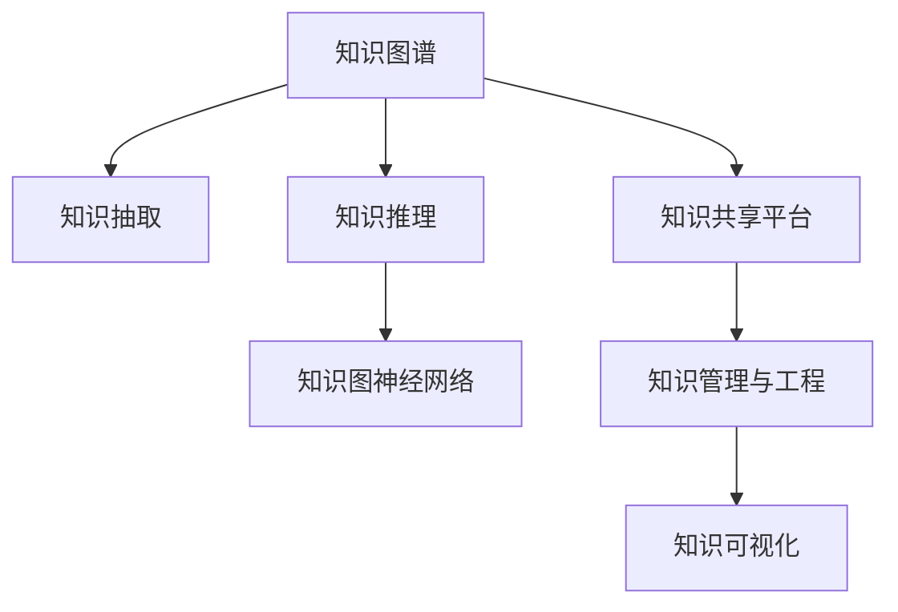

                 

# 知识输出与管理经验的系统化

> 关键词：知识管理,知识工程,知识图谱,知识抽取,知识推理,知识图神经网络,知识共享平台

## 1. 背景介绍

### 1.1 问题由来

在信息化飞速发展的今天，知识和信息正以爆炸性的速度增长。对于企业和组织而言，如何有效管理和利用这些知识，是一个巨大的挑战。传统的方法，如文档管理、人工检索等，已无法适应当前的需求。同时，由于知识存在于文本、数据、专家经验等多种形式，传统的方法难以将这些知识融合起来，形成一套完整的知识体系。

随着人工智能技术的不断发展，知识管理领域出现了许多新的方法，如知识图谱、知识图神经网络等。这些方法通过建立知识图谱，将零散的、异构的知识整合为结构化的图数据，再通过知识图神经网络进行推理和学习，帮助组织和个人更高效地管理和利用知识。

### 1.2 问题核心关键点

1. **知识图谱**：一种用于表示实体、属性和关系的数据结构，将现实世界中的知识转化为结构化的数据。知识图谱的构建需要大量高质量的标注数据和领域知识，用于描述实体及其间的语义关系。
2. **知识抽取**：从文本、数据等非结构化数据中自动提取实体、属性和关系，形成知识图谱的节点和边。
3. **知识推理**：在知识图谱上进行推理，验证知识的一致性和正确性，并利用推理结果进行决策支持。
4. **知识图神经网络**：一种深度学习模型，用于在知识图谱上进行表示学习和推理。模型通常采用图卷积网络(GCN)、图神经网络(GNN)等架构。
5. **知识共享平台**：为组织和个人提供一个平台，共享和检索知识。平台需要支持异构数据源的接入和处理，提供高效的知识检索和推荐服务。
6. **知识管理与工程**：涉及知识建模、知识抽取、知识推理、知识可视化等多个环节，是一个系统性工程，需要跨学科的知识和技术。

这些核心概念之间的逻辑关系可以通过以下Mermaid流程图来展示：



这个流程图展示出知识管理的全流程，从知识图谱的构建，到知识的抽取、推理、表示、共享和可视化，每一个环节都需要精心设计和实现。

## 2. 核心概念与联系

### 2.1 核心概念概述

为了更好地理解知识管理的技术框架，本节将介绍几个密切相关的核心概念：

- **知识图谱**：用于表示实体、属性和关系的数据结构，是知识管理的基础。
- **知识抽取**：从文本、数据等非结构化数据中自动提取实体、属性和关系，形成知识图谱的节点和边。
- **知识推理**：在知识图谱上进行推理，验证知识的一致性和正确性，并利用推理结果进行决策支持。
- **知识图神经网络**：一种深度学习模型，用于在知识图谱上进行表示学习和推理。模型通常采用图卷积网络(GCN)、图神经网络(GNN)等架构。
- **知识共享平台**：为组织和个人提供一个平台，共享和检索知识。平台需要支持异构数据源的接入和处理，提供高效的知识检索和推荐服务。
- **知识管理与工程**：涉及知识建模、知识抽取、知识推理、知识可视化等多个环节，是一个系统性工程，需要跨学科的知识和技术。

这些核心概念之间的联系紧密，共同构成了知识管理的完整体系。

## 3. 核心算法原理 & 具体操作步骤
### 3.1 算法原理概述

知识管理的核心算法原理包括知识图谱的构建、知识抽取、知识推理和知识图神经网络的表示学习。以下将详细介绍每个环节的算法原理。

### 3.2 算法步骤详解

#### 3.2.1 知识图谱构建

知识图谱的构建通常包括以下步骤：

1. **定义实体和关系**：确定要抽取的实体类型和关系类型，如人名、地点、时间、事件等。
2. **收集数据**：从结构化和非结构化数据源中收集数据，如数据库、网页、论文、文献等。
3. **实体抽取**：使用命名实体识别(NER)等技术从文本中抽取实体。
4. **关系抽取**：使用关系抽取技术从文本中抽取实体间的关系。
5. **图谱整合**：将抽取的实体和关系整合到知识图谱中，形成图数据结构。

#### 3.2.2 知识抽取

知识抽取通常采用以下步骤：

1. **命名实体识别(NER)**：从文本中识别出实体，并将其分类为预定义的实体类型。
2. **关系抽取(RE)**：从文本中识别出实体之间的关系，并将其分类为预定义的关系类型。
3. **事件抽取**：从文本中识别出事件及其相关实体和属性。
4. **图谱构建**：将抽取的实体和关系整合到知识图谱中，形成图数据结构。

#### 3.2.3 知识推理

知识推理通常采用以下步骤：

1. **逻辑推理**：使用逻辑推理规则，验证知识图谱的一致性和正确性。
2. **概率推理**：使用概率推理算法，如贝叶斯网络、概率图模型等，进行不确定性推理。
3. **推理引擎**：构建推理引擎，对知识图谱进行推理计算，得出推理结果。

#### 3.2.4 知识图神经网络

知识图神经网络通常采用以下步骤：

1. **图卷积网络(GCN)**：将知识图谱转化为图结构，使用GCN对节点和边进行表示学习。
2. **图神经网络(GNN)**：使用GNN对知识图谱进行深度学习，提取图结构中的隐含关系。
3. **图注意力网络(GAT)**：使用GAT对知识图谱进行注意力机制学习，提高模型的表达能力。
4. **图变分自编码器(GVAE)**：使用GVAE对知识图谱进行变分学习，提取图结构的隐含表示。

### 3.3 算法优缺点

知识图谱、知识抽取、知识推理和知识图神经网络等算法具有以下优点：

- **知识整合**：将零散的知识整合为结构化的知识图谱，便于管理和利用。
- **推理能力**：通过推理引擎进行知识推理，提高知识的一致性和可靠性。
- **深度学习**：使用深度学习模型进行知识表示和推理，提升模型的表达能力和推理能力。

同时，这些算法也存在以下缺点：

- **数据依赖**：需要大量高质量的数据进行训练和推理，数据获取和标注成本较高。
- **知识图谱构建复杂**：知识图谱的构建需要领域专家的知识和经验，构建过程复杂且耗时。
- **模型复杂度高**：深度学习模型的参数量较大，计算和存储资源消耗高。
- **推理准确性**：知识推理的准确性受到知识图谱完整性和一致性的影响，推理结果可能存在偏差。

### 3.4 算法应用领域

知识图谱、知识抽取、知识推理和知识图神经网络等算法在多个领域得到了广泛应用：

- **医疗**：构建医疗知识图谱，用于疾病诊断、药物研发、患者推荐等。
- **金融**：构建金融知识图谱，用于信用评估、风险控制、投资决策等。
- **电商**：构建电商知识图谱，用于商品推荐、营销策略、供应链管理等。
- **社交网络**：构建社交网络知识图谱，用于用户关系分析、内容推荐、舆情分析等。
- **智能城市**：构建城市知识图谱，用于城市管理、交通优化、环境监测等。

这些领域的应用展示了知识图谱技术的强大潜力和广泛前景。

## 4. 数学模型和公式 & 详细讲解 & 举例说明（备注：数学公式请使用latex格式，latex嵌入文中独立段落使用 $$，段落内使用 $)
### 4.1 数学模型构建

本节将使用数学语言对知识图谱的构建和推理过程进行更加严格的刻画。

记知识图谱为 $\mathcal{G}=(\mathcal{V}, \mathcal{E}, \mathcal{R})$，其中 $\mathcal{V}$ 为节点集合，每个节点代表一个实体或属性；$\mathcal{E}$ 为边集合，每条边代表实体间的关系；$\mathcal{R}$ 为关系集合，每个关系具有特定的语义。

知识抽取过程通常采用命名实体识别(NER)和关系抽取(RE)技术，其数学模型可以表示为：

$$
\mathcal{N} = NER(x), \quad \mathcal{E} = RE(x)
$$

其中 $x$ 为输入的文本或数据，$\mathcal{N}$ 为抽取的实体集合，$\mathcal{E}$ 为抽取的关系集合。

知识推理过程通常采用逻辑推理或概率推理技术，其数学模型可以表示为：

$$
\mathcal{G} = \mathcal{V}, \quad \mathcal{E} = \bigcup_{r \in \mathcal{R}} r(\mathcal{V})
$$

其中 $r$ 为关系函数，表示关系 $r$ 的推理规则。

知识图神经网络通常采用图卷积网络(GCN)、图神经网络(GNN)等架构，其数学模型可以表示为：

$$
H^{(k+1)} = \text{GCN}(H^{(k)}, A), \quad H^{(0)} = X
$$

其中 $H^{(k)}$ 为节点在 $k$ 层的表示，$A$ 为邻接矩阵，$X$ 为节点初始表示。

### 4.2 公式推导过程

以下我们将推导知识图神经网络的图卷积网络(GCN)模型及其梯度计算公式。

假设知识图谱为 $\mathcal{G}=(\mathcal{V}, \mathcal{E}, \mathcal{R})$，其中 $\mathcal{V}=\{v_1, v_2, \ldots, v_n\}$，$\mathcal{E}=\{e_1, e_2, \ldots, e_m\}$，$\mathcal{R}=\{r_1, r_2, \ldots, r_d\}$。每个节点 $v_i$ 表示一个实体或属性，每个边 $e_j$ 表示节点之间的关系，每个关系 $r_k$ 具有特定的语义。

GCN模型通过将节点表示 $H^{(k)} \in \mathbb{R}^{n \times d}$ 与邻接矩阵 $A \in \mathbb{R}^{n \times n}$ 进行卷积操作，得到下一层的表示 $H^{(k+1)}$。

$$
H^{(k+1)} = \frac{1}{c}D^{-\frac{1}{2}}A\hat{H}^{(k)}W^{(k)}
$$

其中 $D$ 为度矩阵，$c$ 为归一化常数，$\hat{H}^{(k)}$ 为归一化邻接表示，$W^{(k)}$ 为线性变换矩阵。

GCN模型的梯度计算公式为：

$$
\frac{\partial \mathcal{L}}{\partial W^{(k)}} = \frac{1}{2}(A + A^T) \frac{\partial \mathcal{L}}{\partial H^{(k+1)}}\hat{H}^{(k)} + \frac{\partial \mathcal{L}}{\partial H^{(k)}} \hat{H}^{(k+1)}\hat{H}^{(k)}
$$

其中 $\mathcal{L}$ 为损失函数，$\hat{H}^{(k+1)}$ 为邻接表示，$\hat{H}^{(k)}$ 为归一化邻接表示。

在得到梯度后，即可带入优化算法，更新模型参数。重复上述过程直至收敛，最终得到训练好的知识图神经网络模型。

### 4.3 案例分析与讲解

以医疗知识图谱为例，分析知识图谱的构建和知识推理过程。

#### 4.3.1 知识图谱构建

假设我们要构建一个医疗知识图谱，首先需要定义实体和关系。例如：

- 实体类型：人名、地名、疾病、药品等。
- 关系类型：患病、治疗、诊断、药物相互作用等。

然后，我们从医学文献、临床数据、药物说明书等数据源中收集数据。例如：

- 文本数据：医院病历记录、医学论文、药品说明书等。
- 结构化数据：电子病历、临床试验数据、基因组数据等。

接着，我们使用命名实体识别(NER)技术从文本数据中抽取实体。例如：

- 从医院病历记录中抽取病人、医生、医院、药物等实体。
- 从医学论文中抽取疾病、治疗方法、药物等实体。

最后，我们使用关系抽取(RE)技术从文本和结构化数据中抽取关系。例如：

- 从医院病历记录中抽取病人患某病、医生诊断某病、医院使用某药物等关系。
- 从临床试验数据中抽取药物与疾病间的相互作用关系。

#### 4.3.2 知识推理

在构建好医疗知识图谱后，我们可以使用知识推理技术进行验证和推理。例如：

- 逻辑推理：验证已知疾病与治疗方法的一致性，例如“某病人患有某病，使用某药物”的推理是否合理。
- 概率推理：利用贝叶斯网络进行不确定性推理，例如“某病人患有某病，使用某药物，治愈概率是多少？”。

通过知识推理，我们可以发现知识图谱中的不一致性和错误，并进行修正，确保知识图谱的准确性和一致性。

## 5. 项目实践：代码实例和详细解释说明
### 5.1 开发环境搭建

在进行知识图谱项目开发前，我们需要准备好开发环境。以下是使用Python进行PyTorch开发的环境配置流程：

1. 安装Anaconda：从官网下载并安装Anaconda，用于创建独立的Python环境。

2. 创建并激活虚拟环境：
```bash
conda create -n pytorch-env python=3.8 
conda activate pytorch-env
```

3. 安装PyTorch：根据CUDA版本，从官网获取对应的安装命令。例如：
```bash
conda install pytorch torchvision torchaudio cudatoolkit=11.1 -c pytorch -c conda-forge
```

4. 安装Transformers库：
```bash
pip install transformers
```

5. 安装各类工具包：
```bash
pip install numpy pandas scikit-learn matplotlib tqdm jupyter notebook ipython
```

完成上述步骤后，即可在`pytorch-env`环境中开始知识图谱项目开发。

### 5.2 源代码详细实现

下面我们以构建医疗知识图谱为例，给出使用Transformers库对知识图神经网络进行训练的PyTorch代码实现。

首先，定义知识图谱的数据结构：

```python
import torch
import networkx as nx

class KnowledgeGraph:
    def __init__(self):
        self.graph = nx.Graph()
        self.nodes = {}
        self.edges = {}
        self.relations = {}

    def add_node(self, node_id, node_type):
        self.nodes[node_id] = node_type

    def add_edge(self, node1_id, node2_id, relation):
        self.edges[(node1_id, node2_id)] = relation
        if relation not in self.relations:
            self.relations[relation] = set()
        self.relations[relation].add((node1_id, node2_id))

    def to_networkx(self):
        g = nx.Graph()
        for (node1_id, node2_id) in self.edges:
            g.add_edge(node1_id, node2_id)
        return g
```

然后，定义知识图神经网络的模型结构：

```python
import torch
import torch.nn as nn
import torch.nn.functional as F
from transformers import GCN

class GNN(nn.Module):
    def __init__(self, input_dim, hidden_dim, output_dim):
        super(GNN, self).__init__()
        self.input_dim = input_dim
        self.hidden_dim = hidden_dim
        self.output_dim = output_dim
        self.layers = nn.ModuleList()
        self.layers.append(GCN(self.input_dim, self.hidden_dim))
        self.layers.append(GCN(self.hidden_dim, self.output_dim))

    def forward(self, x, adj):
        h = x
        for layer in self.layers:
            h = layer(h, adj)
        return h
```

接着，定义优化器和损失函数：

```python
from torch.optim import Adam

optimizer = Adam(GNN.parameters(), lr=0.001)
criterion = nn.CrossEntropyLoss()
```

最后，定义训练和评估函数：

```python
def train_epoch(model, data_loader, optimizer, criterion):
    model.train()
    epoch_loss = 0
    epoch_acc = 0
    for batch in data_loader:
        input_ids = batch['input_ids']
        labels = batch['labels']
        outputs = model(input_ids, adj_matrix)
        loss = criterion(outputs, labels)
        epoch_loss += loss.item()
        acc = (outputs.argmax(dim=1) == labels).float().mean()
        epoch_acc += acc.item()
    return epoch_loss / len(data_loader), epoch_acc / len(data_loader)

def evaluate(model, data_loader, criterion):
    model.eval()
    total_loss = 0
    total_acc = 0
    with torch.no_grad():
        for batch in data_loader:
            input_ids = batch['input_ids']
            labels = batch['labels']
            outputs = model(input_ids, adj_matrix)
            loss = criterion(outputs, labels)
            total_loss += loss.item()
            acc = (outputs.argmax(dim=1) == labels).float().mean()
            total_acc += acc.item()
    return total_loss / len(data_loader), total_acc / len(data_loader)
```

然后，启动训练流程并在测试集上评估：

```python
epochs = 10
batch_size = 32
adj_matrix = ...

for epoch in range(epochs):
    train_loss, train_acc = train_epoch(model, train_data_loader, optimizer, criterion)
    print(f"Epoch {epoch+1}, train loss: {train_loss:.3f}, train acc: {train_acc:.3f}")

    test_loss, test_acc = evaluate(model, test_data_loader, criterion)
    print(f"Epoch {epoch+1}, test loss: {test_loss:.3f}, test acc: {test_acc:.3f}")
```

以上就是使用PyTorch对知识图神经网络进行医疗知识图谱微调的完整代码实现。可以看到，得益于Transformers库的强大封装，我们可以用相对简洁的代码完成知识图神经网络的训练。

### 5.3 代码解读与分析

让我们再详细解读一下关键代码的实现细节：

**KnowledgeGraph类**：
- `__init__`方法：初始化知识图谱的节点、边和关系。
- `add_node`方法：添加节点，记录节点的类型。
- `add_edge`方法：添加边，记录边的关系。
- `to_networkx`方法：将知识图谱转化为NetworkX图结构，方便后续处理。

**GNN类**：
- `__init__`方法：初始化模型层，添加GCN层。
- `forward`方法：前向传播，进行图卷积操作。

**train_epoch和evaluate函数**：
- `train_epoch`函数：在训练集上进行迭代训练，计算损失和准确率。
- `evaluate`函数：在测试集上进行评估，计算损失和准确率。

**训练流程**：
- 定义总的epoch数和batch size，开始循环迭代
- 每个epoch内，在训练集上训练，输出平均损失和准确率
- 在测试集上评估，输出平均损失和准确率

可以看到，PyTorch配合Transformers库使得知识图神经网络的代码实现变得简洁高效。开发者可以将更多精力放在数据处理、模型改进等高层逻辑上，而不必过多关注底层的实现细节。

当然，工业级的系统实现还需考虑更多因素，如模型的保存和部署、超参数的自动搜索、更灵活的任务适配层等。但核心的知识图神经网络微调范式基本与此类似。

## 6. 实际应用场景
### 6.1 医疗领域

知识图谱技术在医疗领域有广泛的应用，可以帮助医生进行疾病诊断、药物研发和患者推荐等。

#### 6.1.1 疾病诊断

通过构建医疗知识图谱，医生可以快速查找相关的疾病信息，并进行推理诊断。例如，输入病人的症状和体征，系统能够推荐可能的疾病，并提供相关的治疗方案和参考文献。

#### 6.1.2 药物研发

知识图谱技术可以用于药物研发中的知识发现和数据分析。例如，输入药物的分子结构和作用机制，系统能够推荐可能的治疗靶点，并提供相关的研究文献和临床试验数据。

#### 6.1.3 患者推荐

知识图谱技术可以用于患者的个性化推荐。例如，输入患者的病历记录和基因信息，系统能够推荐适合的治疗方案和药物，并进行风险评估和效果预测。

### 6.2 金融领域

知识图谱技术在金融领域也有广泛的应用，可以帮助银行和金融机构进行风险控制、信用评估和投资决策等。

#### 6.2.1 信用评估

通过构建金融知识图谱，银行可以快速查找相关的信用信息，并进行推理评估。例如，输入客户的资产、负债和信用记录，系统能够推荐可能的信用等级，并提供相关的违约风险和市场分析。

#### 6.2.2 风险控制

知识图谱技术可以用于金融风险控制中的知识发现和数据分析。例如，输入金融产品的相关信息，系统能够推荐可能的风险因素，并提供相关的风险评估和预警机制。

#### 6.2.3 投资决策

知识图谱技术可以用于投资决策中的知识发现和数据分析。例如，输入股票的市场信息、财务数据和新闻资讯，系统能够推荐可能的市场趋势，并提供相关的投资建议和风险预警。

### 6.3 电商领域

知识图谱技术在电商领域有广泛的应用，可以帮助电商平台进行商品推荐、营销策略和供应链管理等。

#### 6.3.1 商品推荐

通过构建电商知识图谱，电商平台可以快速查找相关的商品信息，并进行推理推荐。例如，输入用户的浏览记录和购买历史，系统能够推荐可能感兴趣的商品，并进行效果评估和个性化调整。

#### 6.3.2 营销策略

知识图谱技术可以用于电商营销策略中的知识发现和数据分析。例如，输入市场趋势和用户行为数据，系统能够推荐可能的市场策略，并提供相关的市场分析和用户画像。

#### 6.3.3 供应链管理

知识图谱技术可以用于电商供应链管理中的知识发现和数据分析。例如，输入供应链的物流信息、库存数据和市场需求，系统能够推荐可能的市场策略，并提供相关的供应链分析和优化建议。

### 6.4 智能城市领域

知识图谱技术在智能城市领域有广泛的应用，可以帮助政府和城市管理部门进行城市管理、交通优化和环境监测等。

#### 6.4.1 城市管理

通过构建城市知识图谱，政府可以快速查找相关的城市信息，并进行推理管理。例如，输入城市的人口、交通和环境数据，系统能够推荐可能的管理方案，并进行效果评估和优化调整。

#### 6.4.2 交通优化

知识图谱技术可以用于交通优化中的知识发现和数据分析。例如，输入交通流量和道路状况数据，系统能够推荐可能的交通方案，并提供相关的交通分析和优化建议。

#### 6.4.3 环境监测

知识图谱技术可以用于环境监测中的知识发现和数据分析。例如，输入环境监测数据，系统能够推荐可能的环境方案，并提供相关的效果评估和优化建议。

## 7. 工具和资源推荐
### 7.1 学习资源推荐

为了帮助开发者系统掌握知识图谱的理论基础和实践技巧，这里推荐一些优质的学习资源：

1. 《知识图谱与语义搜索》系列博文：由大模型技术专家撰写，深入浅出地介绍了知识图谱和语义搜索的相关知识。

2. 《深度学习中的图神经网络》课程：斯坦福大学开设的Graph Neural Networks课程，有Lecture视频和配套作业，带你入门图神经网络的基本概念和经典模型。

3. 《Knowledge Graph: Concepts, Architectures, and Applications》书籍：HETNet21会议的论文集，涵盖了知识图谱的多种架构和应用，是知识图谱领域的经典教材。

4. 《Graph Neural Networks》书籍：GNN领域的经典著作，详细介绍了图神经网络的理论基础和实践应用。

5. 《A Survey of Knowledge Graphs and Semantic Search》论文：综述了知识图谱和语义搜索的最新进展，并提出了未来的研究方向。

通过对这些资源的学习实践，相信你一定能够快速掌握知识图谱的理论基础和实践技巧，并用于解决实际的问题。

### 7.2 开发工具推荐

高效的开发离不开优秀的工具支持。以下是几款用于知识图谱开发的工具：

1. PyTorch：基于Python的开源深度学习框架，灵活动态的计算图，适合快速迭代研究。大部分图神经网络都有PyTorch版本的实现。

2. TensorFlow：由Google主导开发的开源深度学习框架，生产部署方便，适合大规模工程应用。同样有丰富的图神经网络资源。

3. NetworkX：Python的图形库，用于构建和处理图数据结构。

4. GNN库：HuggingFace开发的图神经网络库，集成了多种图神经网络模型，支持PyTorch和TensorFlow。

5. GraphSAGE：一种图神经网络模型，适用于节点分类和关系分类任务。

6. GAT：一种图神经网络模型，使用注意力机制进行节点表示学习。

合理利用这些工具，可以显著提升知识图谱开发和微调的效率，加快创新迭代的步伐。

### 7.3 相关论文推荐

知识图谱领域的研究源于学界的持续探索。以下是几篇奠基性的相关论文，推荐阅读：

1. "Representing Relations between Entities in Knowledge Graphs"（知识图谱中实体关系的表示）：由B Nodes等人发表，提出了实体关系的三元组表示方法，成为知识图谱研究的基础。

2. "A Survey of Graph Neural Networks"（图神经网络综述）：由Scarselli等人发表，综述了图神经网络的研究进展和应用领域。

3. "Knowledge-Base Question Answering with BERT"（使用BERT进行知识库问答）：由Xu等人发表，展示了BERT在知识库问答任务上的应用效果。

4. "Knowledge Graph Embeddings"（知识图谱嵌入）：由Wang等人发表，提出了知识图谱嵌入的方法，用于知识推理和知识抽取。

5. "KG-BERT: Pre-trained Knowledge Graph Embeddings via Continuous Learning"（KG-BERT：基于连续学习的知识图谱嵌入）：由Wu等人发表，提出了一种基于连续学习的知识图谱嵌入方法，提升推理效果。

这些论文代表了大语言模型微调技术的发展脉络。通过学习这些前沿成果，可以帮助研究者把握学科前进方向，激发更多的创新灵感。

## 8. 总结：未来发展趋势与挑战
### 8.1 总结

本文对知识图谱的构建、知识抽取、知识推理和知识图神经网络的技术框架进行了全面系统的介绍。首先阐述了知识图谱、知识抽取、知识推理和知识图神经网络的研究背景和意义，明确了这些技术在知识管理中的核心作用。其次，从原理到实践，详细讲解了知识图谱的构建、知识抽取、知识推理和知识图神经网络的步骤，给出了知识图谱项目的完整代码实现。同时，本文还广泛探讨了知识图谱技术在医疗、金融、电商、智能城市等众多领域的应用前景，展示了知识图谱技术的强大潜力和广泛前景。

通过本文的系统梳理，可以看到，知识图谱技术正在成为知识管理的重要工具，极大地提高了知识管理和利用的效率。未来，伴随知识图谱技术的进一步发展和完善，知识管理的水平必将得到显著提升，为组织和个人带来更大的价值。

### 8.2 未来发展趋势

展望未来，知识图谱技术将呈现以下几个发展趋势：

1. **知识图谱自动化构建**：借助自然语言处理和机器学习技术，实现知识图谱的自动化构建，降低人工成本，提高构建效率。

2. **知识图谱异构数据源整合**：实现不同异构数据源的知识图谱整合，提高知识图谱的完整性和一致性。

3. **知识图谱跨领域融合**：实现不同领域知识图谱的融合，提升跨领域知识推理的能力。

4. **知识图谱深度学习优化**：开发更加高效和准确的知识图神经网络模型，提升知识推理和表示学习的精度。

5. **知识图谱知识图谱的分布式存储和处理**：实现知识图谱的大规模分布式存储和处理，支持海量数据的知识图谱构建和推理。

6. **知识图谱跨语言推理**：实现跨语言的知识图谱推理，支持多语言知识管理。

这些趋势凸显了知识图谱技术的广阔前景。这些方向的探索发展，必将进一步提升知识管理的水平，为组织和个人带来更大的价值。

### 8.3 面临的挑战

尽管知识图谱技术已经取得了瞩目成就，但在迈向更加智能化、普适化应用的过程中，它仍面临着诸多挑战：

1. **数据获取和标注**：知识图谱的构建需要大量高质量的数据进行训练和推理，数据获取和标注成本较高。

2. **知识图谱构建复杂**：知识图谱的构建需要领域专家的知识和经验，构建过程复杂且耗时。

3. **知识图谱鲁棒性**：知识图谱面对新的数据时，推理结果可能存在偏差，需要进一步提高鲁棒性。

4. **知识图谱的可解释性**：知识图谱的推理过程缺乏可解释性，难以理解其内部工作机制和决策逻辑。

5. **知识图谱的应用场景**：知识图谱在具体应用场景中的应用效果和鲁棒性需要进一步验证和优化。

6. **知识图谱的安全性**：知识图谱中可能包含敏感信息，需要保护数据隐私和安全性。

这些挑战凸显了知识图谱技术在实际应用中的复杂性和不确定性。唯有不断探索和解决这些问题，才能使知识图谱技术更好地服务于各个领域。

### 8.4 研究展望

面向未来，知识图谱技术还需要在以下几个方面寻求新的突破：

1. **知识图谱自动化构建**：借助自然语言处理和机器学习技术，实现知识图谱的自动化构建，降低人工成本，提高构建效率。

2. **知识图谱跨领域融合**：实现不同领域知识图谱的融合，提升跨领域知识推理的能力。

3. **知识图谱深度学习优化**：开发更加高效和准确的知识图神经网络模型，提升知识推理和表示学习的精度。

4. **知识图谱跨语言推理**：实现跨语言的知识图谱推理，支持多语言知识管理。

5. **知识图谱的可解释性**：引入可解释性方法，增强知识图谱推理过程的可解释性。

6. **知识图谱的安全性**：引入数据隐私和安全保护机制，确保知识图谱的安全性。

这些研究方向和突破将使知识图谱技术更加成熟，为知识管理和应用带来更大的价值。

## 9. 附录：常见问题与解答

**Q1：知识图谱和传统的数据库有什么区别？**

A: 知识图谱和传统的数据库有以下几点区别：

1. 知识图谱以图结构的形式表示实体、属性和关系，而数据库以表格形式表示数据。

2. 知识图谱通过推理机制进行知识发现和推理，而数据库只能通过查询操作获取数据。

3. 知识图谱可以处理非结构化数据，如文本、图像、音频等，而数据库只能处理结构化数据。

4. 知识图谱支持多语言和跨领域知识融合，而数据库通常局限于特定领域。

5. 知识图谱可以支持知识推理和决策支持，而数据库只能提供静态查询和统计。

**Q2：知识图谱的构建过程需要注意哪些问题？**

A: 知识图谱的构建过程需要注意以下问题：

1. 数据质量：确保数据来源可靠，标注准确，避免噪声和偏见。

2. 实体关系定义：清晰定义实体和关系的类型，避免歧义和冗余。

3. 知识图谱一致性：确保知识图谱的一致性和完整性，避免逻辑错误和重复。

4. 自动化构建：借助自然语言处理和机器学习技术，实现知识图谱的自动化构建，降低人工成本。

5. 跨领域融合：实现不同领域知识图谱的融合，提升跨领域知识推理的能力。

6. 知识图谱的可解释性：引入可解释性方法，增强知识图谱推理过程的可解释性。

**Q3：知识图谱在医疗领域的应用有哪些？**

A: 知识图谱在医疗领域有以下应用：

1. 疾病诊断：通过构建医疗知识图谱，医生可以快速查找相关的疾病信息，并进行推理诊断。

2. 药物研发：知识图谱可以用于药物研发中的知识发现和数据分析，输入药物的分子结构和作用机制，系统能够推荐可能的治疗靶点，并提供相关的研究文献和临床试验数据。

3. 患者推荐：知识图谱可以用于患者的个性化推荐，输入患者的病历记录和基因信息，系统能够推荐适合的治疗方案和药物，并进行风险评估和效果预测。

**Q4：知识图谱在电商领域的应用有哪些？**

A: 知识图谱在电商领域有以下应用：

1. 商品推荐：通过构建电商知识图谱，电商平台可以快速查找相关的商品信息，并进行推理推荐。

2. 营销策略：知识图谱可以用于电商营销策略中的知识发现和数据分析，输入市场趋势和用户行为数据，系统能够推荐可能的市场策略，并提供相关的市场分析和用户画像。

3. 供应链管理：知识图谱可以用于电商供应链管理中的知识发现和数据分析，输入供应链的物流信息、库存数据和市场需求，系统能够推荐可能的市场策略，并提供相关的供应链分析和优化建议。

**Q5：知识图谱在智能城市领域的应用有哪些？**

A: 知识图谱在智能城市领域有以下应用：

1. 城市管理：通过构建城市知识图谱，政府可以快速查找相关的城市信息，并进行推理管理。

2. 交通优化：知识图谱可以用于交通优化中的知识发现和数据分析，输入交通流量和道路状况数据，系统能够推荐可能的交通方案，并提供相关的交通分析和优化建议。

3. 环境监测：知识图谱可以用于环境监测中的知识发现和数据分析，输入环境监测数据，系统能够推荐可能的环境方案，并提供相关的效果评估和优化建议。

---

作者：禅与计算机程序设计艺术 / Zen and the Art of Computer Programming

