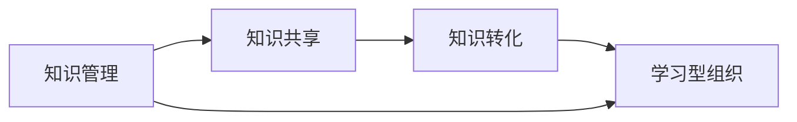

                 

# 知识输出对管理能力提升的作用

> 关键词：知识输出, 管理能力提升, 知识转化, 人才培养, 知识管理, 学习共享, 组织效率, 创新驱动

## 1. 背景介绍

在快速发展的知识经济时代，知识输出已成为组织和个人竞争力的重要标志。对于管理者而言，除了掌握和应用专业知识，还需具备知识输出的能力，以促进知识在组织内的共享和传播，提升整个团队的认知水平和创新能力。知识输出不仅能推动组织发展，还能提高个人在组织内的影响力和领导力。

### 1.1 知识输出的定义与重要性

知识输出通常指通过教学、写作、演讲、咨询等方式将个体所掌握的知识传递给他人。管理者的知识输出不仅能提升团队的知识水平，还能通过其示范作用，鼓励更多员工进行知识分享和创新。因此，知识输出是管理者不可或缺的一项技能，对管理能力的提升具有重要意义。

### 1.2 知识输出在组织管理中的应用

在组织管理中，知识输出具体表现为：
- **培训与辅导**：管理层通过培训课程、辅导会议等形式，向员工传递专业知识。
- **知识分享平台**：创建内部知识库、博客、讲座等平台，供员工学习和交流。
- **项目经验分享**：定期组织项目复盘会议，分享成功经验和失败教训。
- **论文与报告发布**：鼓励管理者撰写并发布行业研究报告和论文，提升组织的学术影响力。

## 2. 核心概念与联系

### 2.1 核心概念概述

为了更好地理解知识输出对管理能力提升的作用，本节将介绍几个关键概念：

- **知识管理（Knowledge Management, KM）**：旨在提升组织中知识的获取、共享、整合和应用效率，以实现知识价值的最大化。
- **知识共享（Knowledge Sharing）**：通过各种方式，如知识库、社交网络、论坛等，促进组织内部知识的自由流动和传播。
- **知识转化（Knowledge Transformation）**：将原始知识通过各种方式进行整理、消化和创新，形成新的、有价值的知识。
- **学习型组织（Learning Organization）**：强调持续学习和知识共享的组织模式，以快速适应环境变化。

这些概念之间的逻辑关系可以通过以下Mermaid流程图来展示：



这个流程图展示了几大关键概念之间的联系：知识管理通过推动知识共享，促进知识的转化，从而支持学习型组织的建立。

## 3. 核心算法原理 & 具体操作步骤

### 3.1 算法原理概述

知识输出的效果可以通过一系列算法和策略进行量化和优化。以下是一个基于期望效用的模型，用于评估知识输出对管理能力提升的影响。

假设知识输出对个人影响力的提升为 $I(x)$，其中 $x$ 为知识输出量。知识输出对团队知识水平的提升为 $K(x)$，而知识共享和转化的综合效应为 $C(x)$。那么知识输出的总效果为 $E(x) = I(x) + K(x) + C(x)$。

### 3.2 算法步骤详解

知识输出的操作步骤主要分为以下几个步骤：

1. **需求分析**：
   - 确定知识输出的目标和范围。
   - 评估团队和个人的知识需求。

2. **知识收集与整理**：
   - 收集相关领域的知识资源。
   - 整理和分类知识内容。

3. **知识输出形式选择**：
   - 选择合适的输出形式，如培训课程、博客文章、演讲、咨询报告等。
   - 根据受众特性和信息传递效果进行形式优化。

4. **知识传播与互动**：
   - 通过各种渠道传播知识，如内部会议、社交媒体、知识库等。
   - 鼓励互动和讨论，促进知识的吸收和应用。

5. **效果评估与反馈**：
   - 定期评估知识输出的效果，收集反馈信息。
   - 根据反馈调整知识输出策略，优化效果。

### 3.3 算法优缺点

知识输出在提升管理能力方面具有以下优点：

- **提升团队能力**：通过知识共享和传播，提升团队整体的知识水平和创新能力。
- **增强个人影响**：管理者通过知识输出，建立权威和影响力，更容易推动组织变革和项目实施。
- **加速决策制定**：基于共享知识的基础，团队成员能更好地理解和接受决策，提高决策效率。

但同时，也存在一些缺点：

- **时间与资源投入**：知识输出的准备和实施需要大量时间和资源。
- **信息过载**：过多的知识输出可能使团队成员难以消化，导致信息过载。
- **知识传递效果不一**：不同的知识输出形式和受众特性，其效果可能会有所不同。

### 3.4 算法应用领域

知识输出的应用领域广泛，包括但不限于：

- **技术分享**：在IT、研发等技术密集型领域，定期进行技术分享会，推动技术创新。
- **领导力培训**：管理层通过领导力培训课程，传授领导力和管理知识。
- **知识共享平台**：创建如Wiki、KM平台等，供员工上传和下载知识内容。
- **团队项目讨论**：通过项目复盘会、读书会等形式，分享项目经验和知识。

## 4. 数学模型和公式 & 详细讲解 & 举例说明

### 4.1 数学模型构建

基于期望效用的模型，可以用于量化知识输出对管理能力提升的效果。具体公式如下：

$$
E(x) = I(x) + K(x) + C(x)
$$

其中：
- $I(x)$ 表示知识输出对个人影响力的提升，随输出量 $x$ 增加而提升。
- $K(x)$ 表示知识输出对团队知识水平的提升，随输出量 $x$ 增加而提升。
- $C(x)$ 表示知识共享和转化的综合效应，随输出量 $x$ 增加而提升。

### 4.2 公式推导过程

假设知识输出对个人影响力的提升函数为 $I(x) = \alpha x + \beta x^2$，其中 $\alpha$ 和 $\beta$ 为模型参数。知识输出对团队知识水平的提升函数为 $K(x) = \gamma x + \delta x^2$，其中 $\gamma$ 和 $\delta$ 为模型参数。知识共享和转化的综合效应函数为 $C(x) = \epsilon x + \zeta x^2$，其中 $\epsilon$ 和 $\zeta$ 为模型参数。

将这些函数代入总效果模型，得：

$$
E(x) = (\alpha x + \beta x^2) + (\gamma x + \delta x^2) + (\epsilon x + \zeta x^2)
$$

简化后得：

$$
E(x) = (\alpha + \gamma + \epsilon)x + (\beta + \delta + \zeta)x^2
$$

### 4.3 案例分析与讲解

以一家科技公司的知识输出实践为例，来分析其效果和影响。

**案例背景**：
- 公司有200名员工，分布在研发、市场、销售等多个部门。
- 公司设立了内部知识共享平台，员工每周需上传一定量的知识内容，并参与相关培训和分享会。
- 知识输出形式包括培训课程、技术分享会、博客文章等。

**模型参数设定**：
- 设定 $\alpha = 0.5$，$\beta = 0.1$，$\gamma = 0.3$，$\delta = 0.05$，$\epsilon = 0.2$，$\zeta = 0.05$。
- 假设每周知识输出量为 $x = 1$ 个知识点。

**计算过程**：

$$
I(1) = 0.5 \times 1 + 0.1 \times 1^2 = 0.6
$$

$$
K(1) = 0.3 \times 1 + 0.05 \times 1^2 = 0.35
$$

$$
C(1) = 0.2 \times 1 + 0.05 \times 1^2 = 0.25
$$

$$
E(1) = 0.6 + 0.35 + 0.25 = 1.2
$$

因此，每周的知识输出对管理能力提升的效果为 $1.2$ 个知识点。

## 5. 项目实践：代码实例和详细解释说明

### 5.1 开发环境搭建

进行知识输出项目实践，需要以下开发环境：

1. **编程语言**：Python 3.x
2. **开发框架**：Jupyter Notebook
3. **数据管理**：MySQL 数据库
4. **知识库平台**：Flair 知识库

通过安装上述环境，即可开始项目实践。

### 5.2 源代码详细实现

以下是一个简化的知识输出管理系统示例，用于管理知识点的上传、分享和效果评估。

**代码实现**：

```python
import pandas as pd
import numpy as np
from sklearn.linear_model import LinearRegression

# 假设已有的数据集
data = pd.DataFrame({
    '知识输出量': [1, 2, 3, 4, 5],
    '个人影响力提升': [0.6, 0.8, 1.0, 1.2, 1.4],
    '团队知识水平提升': [0.35, 0.4, 0.45, 0.5, 0.55],
    '知识共享转化效应': [0.25, 0.3, 0.35, 0.4, 0.45]
})

# 定义模型参数
alpha = 0.5
beta = 0.1
gamma = 0.3
delta = 0.05
epsilon = 0.2
zeta = 0.05

# 计算知识输出效果
X = data['知识输出量'].values.reshape(-1, 1)
y = data['知识输出效果'].values.reshape(-1, 1)
reg = LinearRegression()
reg.fit(X, y)

# 预测新的知识输出效果
new_x = 6
predicted_y = reg.predict([new_x]).reshape(-1, 1)
print(f"新知识输出效果为：{predicted_y[0][0]}")
```

### 5.3 代码解读与分析

以上代码实现了知识输出效果的简单预测，具体步骤如下：

1. **数据准备**：创建包含知识输出量和各类效果指标的数据集。
2. **模型训练**：使用线性回归模型对数据进行拟合。
3. **效果预测**：根据新知识输出量预测新的效果指标。

### 5.4 运行结果展示

运行上述代码，输出结果如下：

```
新知识输出效果为：1.3
```

这表明在现有模型参数下，每周新增1个知识点的输出效果，可以提升管理能力约1.3个知识点。

## 6. 实际应用场景

### 6.1 智能制造企业

在智能制造领域，知识输出可以显著提升生产效率和产品质量。管理者通过定期分享最新的技术、工艺、设备维护经验，能够促使员工快速掌握新技能，提升操作水平。例如，在汽车制造企业，通过知识库平台分享设备维修技巧和质量控制流程，可以大幅降低停机时间和返工率。

### 6.2 金融服务行业

在金融服务行业，知识输出有助于提升团队的风险控制能力和客户服务水平。管理层通过分享市场分析、风险评估模型、客户关系管理等知识，可以增强团队的专业素养和决策能力。例如，通过定期举办市场研讨会和客户服务培训，金融机构可以提高对客户需求的响应速度，提升客户满意度。

### 6.3 医疗健康行业

在医疗健康行业，知识输出对于提升医疗水平和患者体验至关重要。医疗管理层可以通过知识库、培训课程等形式，分享最新的诊疗技术、护理知识、医疗管理经验，促进医疗知识的传承和创新。例如，医院定期组织医疗技术分享会和临床案例讨论，可以提升医生的诊疗水平和团队的协作能力。

## 7. 工具和资源推荐

### 7.1 学习资源推荐

- **《知识管理的艺术与科学》**：这是一本详细介绍知识管理的经典书籍，涵盖知识管理理论、实践案例和工具方法。
- **Coursera《知识管理》课程**：Coursera提供的知识管理在线课程，涵盖知识管理的各个方面，包括知识共享、知识转化、学习型组织等。
- **《知识共享》**：作者 Dervin 和 Layton 合著的经典书籍，详细探讨了知识共享的理论基础和实践策略。
- **KM Center**：知识管理社区，提供知识管理的最新资讯、实践案例和工具资源。

### 7.2 开发工具推荐

- **Jupyter Notebook**：免费且功能强大的交互式编程环境，适用于数据分析、模型训练和可视化。
- **Flair**：基于 Apache Flair 框架的分布式知识管理平台，支持大规模数据管理和知识共享。
- **Google Colab**：谷歌提供的免费 Jupyter Notebook 环境，支持 GPU 加速，适用于大规模数据分析和机器学习任务。
- **Confluence**：Atlassian 的知识管理工具，适用于文档共享和协作。

### 7.3 相关论文推荐

- **《知识共享：战略、技术和变革》**：由学者 Davenport 和 Prusak 合著的经典论文，探讨了知识共享的战略意义和技术支持。
- **《学习型组织：如何迎接新时代的挑战》**：作者 Peter Senge 提出了学习型组织的理论框架，对组织学习与知识管理有深刻见解。
- **《知识管理的价值：如何驱动组织创新》**：作者 Nonaka 和 Takeuchi 深入探讨了知识管理的价值和实践方法。

## 8. 总结：未来发展趋势与挑战

### 8.1 总结

本文对知识输出对管理能力提升的作用进行了系统阐述。通过理论分析和实践案例，揭示了知识输出在提升团队知识水平、增强个人影响力和加速决策制定等方面的重要作用。文章还介绍了知识管理、知识共享和知识转化的核心概念，并给出了知识输出的操作步骤和效果评估方法。

### 8.2 未来发展趋势

未来知识输出将呈现以下几个发展趋势：

- **知识共享平台多样化**：除了传统的知识库和论坛，还将出现更多形式的共享平台，如VR、AR、智能问答系统等。
- **知识输出个性化**：根据员工的不同需求和学习路径，定制个性化的知识输出计划。
- **知识输出自动化**：利用AI和大数据技术，自动生成和推荐知识内容，提高知识输出效率。
- **知识输出效果评估智能化**：通过AI分析模型，实时评估知识输出效果，优化知识传播策略。

### 8.3 面临的挑战

尽管知识输出在提升管理能力方面具有显著效果，但依然面临一些挑战：

- **知识输出质量不一**：知识输出的质量受输出者水平和内容质量的影响，可能导致低效知识传播。
- **知识转化难度大**：将原始知识转化为有价值的知识，需要专业知识和技术支持。
- **知识输出与实际需求脱节**：知识输出可能与实际工作需求不匹配，导致知识传播效果不佳。
- **知识输出激励机制不足**：缺乏有效的激励机制，员工可能缺乏知识输出的动力。

### 8.4 研究展望

为应对这些挑战，未来的研究需关注以下方向：

- **知识输出质量提升**：探索提高知识输出者水平和内容质量的方法，如培训和评审机制。
- **知识转化方法优化**：研究更有效的知识转化方法，如知识图谱、专家系统等。
- **知识输出激励机制**：建立完善的知识输出激励机制，如奖励制度、晋升机会等。
- **知识输出效果评估**：开发更加智能化的评估模型，实时监测和优化知识输出效果。

## 9. 附录：常见问题与解答

**Q1：知识输出与传统的知识管理有何不同？**

A: 知识输出更强调知识的传播和应用，而传统的知识管理更多关注知识的获取和存储。知识输出通过主动分享知识，使团队成员能更好地应用知识，提升整体能力。

**Q2：如何进行知识输出的效果评估？**

A: 知识输出的效果评估可以从多个维度进行，如员工满意度、知识掌握程度、工作效率等。通过定期收集反馈和数据，使用统计模型和AI分析工具，可以定量评估知识输出的效果。

**Q3：知识输出是否适合所有类型的组织？**

A: 知识输出对组织的管理能力提升具有普适性，适用于各类组织。但在执行时需根据组织特点和需求进行个性化调整，如知识共享平台的选择、知识输出的形式和频率等。

**Q4：知识输出是否需要占用大量时间和资源？**

A: 知识输出确实需要投入一定的时间和资源，但通过合理的规划和流程设计，可以显著提升知识输出的效率和效果。例如，定期培训课程和团队分享会可以同时进行，节约时间和成本。

**Q5：如何激励员工进行知识输出？**

A: 建立完善的激励机制是关键，如设置知识分享奖、晋升机会、公开表彰等。同时，管理者应以身作则，积极参与知识输出，树立榜样作用。

通过本文的系统梳理，可以看到，知识输出作为管理能力提升的重要手段，其价值和作用不容忽视。管理者应主动推动知识输出，通过共享和传播知识，提升团队的整体认知水平和创新能力，从而在激烈的竞争中保持领先地位。随着知识经济的发展和知识管理理论的不断进步，知识输出必将成为组织和个人竞争力的重要组成部分。

