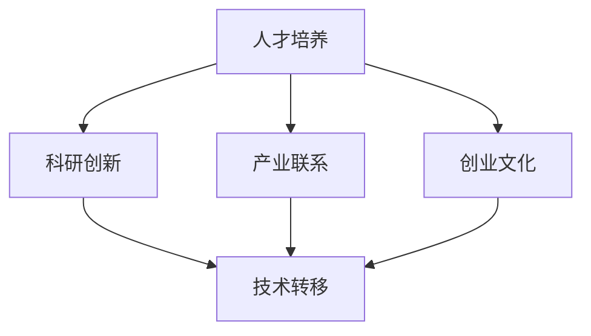

                 

# 硅谷创新的源泉:斯坦福大学的作用

> 关键词：硅谷,创新,斯坦福大学,计算机科学,创业,风险投资,技术转移

## 1. 背景介绍

### 1.1 问题由来
硅谷，这个全球著名的科技创新中心，一直以来以其源源不断的创新力量和高质量创业公司而闻名。自20世纪70年代以来，硅谷成为了全球科技创新的代名词，孕育出了包括Google、Apple、Facebook等众多顶尖科技公司。那么，究竟是什么因素促成了硅谷的崛起呢？

在众多因素中，斯坦福大学（Stanford University）无疑扮演着重要角色。斯坦福大学不仅培养了大批技术人才，还通过其强大的科研实力、教育资源和产业联系，成为推动硅谷创新和创业的关键引擎。本文将深入探讨斯坦福大学在硅谷创新生态系统中所起的作用，以及它如何影响硅谷的发展。

### 1.2 问题核心关键点
1. **人才培养**：斯坦福大学培养了众多技术领袖和创业家，如Elon Musk、Steve Jobs等。
2. **科研创新**：斯坦福大学推动了多项前沿科技研究，如计算机视觉、人工智能等。
3. **产业联系**：斯坦福大学与硅谷的企业和风险投资机构有着紧密的合作关系。
4. **创业文化**：斯坦福大学营造了一个鼓励创新和创业的校园文化，吸引了全球各地的学生和创业者。
5. **技术转移**：斯坦福大学将科研成果转化为实际应用，推动了众多新技术的商业化。

## 2. 核心概念与联系

### 2.1 核心概念概述

斯坦福大学在硅谷的创新生态系统中发挥了多方面的作用。以下是几个核心概念及其相互关系：

- **人才培养**：斯坦福大学通过高质量的教育和研究，培养了大批技术人才，为硅谷的创业和技术发展提供了人力资源支持。
- **科研创新**：斯坦福大学在计算机科学、人工智能等领域的研究成果，推动了技术前沿的突破，为硅谷的创新提供了理论和技术支撑。
- **产业联系**：斯坦福大学与硅谷的企业和风险投资机构建立了紧密的合作关系，加速了科研成果的商业化和产业化。
- **创业文化**：斯坦福大学鼓励创新和创业的文化氛围，吸引了全球的优秀人才和资本，形成了硅谷独特的创业环境。
- **技术转移**：斯坦福大学通过技术转移办公室（OTL）等机构，将科研成果转化为实际应用，加速了新技术的商业化进程。

这些核心概念通过相互促进，共同构建了硅谷创新生态系统的核心竞争力。以下是一个Mermaid流程图，展示了这些概念之间的关系：



## 3. 核心算法原理 & 具体操作步骤

### 3.1 算法原理概述
斯坦福大学在推动硅谷创新的过程中，主要通过以下几个算法原理：

- **人才选拔与培养**：通过严格的录取标准和高水平的教育资源，选拔并培养出具备创新思维和跨学科能力的人才。
- **科研合作与交叉**：通过跨学科的研究合作和学术交流，推动科研成果的突破和应用。
- **技术转移与商业化**：通过技术转移办公室，将科研成果转化为实际产品和服务，加速科技成果的产业化。
- **创业孵化与投资**：通过创业孵化器和风险投资机构，支持和引导有潜力的创新项目，加速其成长为成功的企业。

### 3.2 算法步骤详解

#### 人才选拔与培养
1. **选拔过程**：斯坦福大学通过严格的标准和广泛的国际申请，选拔出具备创新潜力的学生和研究人员。
2. **教育资源**：提供高质量的课程、实验设备、图书馆和科研设施，确保学生和研究人员能够进行高水平的研究和学习。
3. **跨学科培养**：鼓励学生和研究人员参与跨学科项目，培养其跨学科合作和解决问题的能力。

#### 科研合作与交叉
1. **跨学科团队**：组建跨学科的科研团队，汇集不同领域的研究人员，共同解决复杂的科学问题。
2. **学术交流**：组织学术会议、研讨会和访问交流，促进跨学科的知识共享和思想碰撞。
3. **科研成果**：通过发表高水平论文、申请专利和技术转让，推动科研成果的转化和应用。

#### 技术转移与商业化
1. **技术转移办公室（OTL）**：负责将科研成果转化为实际应用，包括技术转让、创业孵化和知识产权管理。
2. **孵化器项目**：通过斯坦福创业孵化器（Stanford Technology Ventures Program, STVP）等机构，支持有潜力的创业项目，提供资金、指导和资源。
3. **知识产权保护**：帮助研究人员和创业者申请专利和保护知识产权，确保技术成果的独占性。

#### 创业孵化与投资
1. **创业孵化器**：提供办公空间、资金和指导，帮助创业团队成长为成熟企业。
2. **风险投资**：通过斯坦福大学创业基金和外部风险投资，为创业项目提供资金支持。
3. **导师和顾问**：邀请硅谷的行业领袖和企业高管，为创业项目提供战略指导和建议。

### 3.3 算法优缺点

#### 优点
- **综合实力**：斯坦福大学在教育、科研、产业和创业各个方面均有强大实力，为硅谷提供了全方位支持。
- **创新生态**：通过人才培养、科研合作、技术转移和创业孵化，形成了完整的创新生态系统。
- **国际影响力**：吸引全球优秀人才和资本，推动硅谷在全球科技领域的领先地位。

#### 缺点
- **资源竞争**：随着其他高校和研究机构进入硅谷，斯坦福大学面临资源和人才的激烈竞争。
- **产业化压力**：科研和教育的重心需要平衡，同时关注技术转移和商业化，增加了复杂性。
- **企业文化**：过度依赖斯坦福大学可能导致过度保守和僵化的企业文化。

### 3.4 算法应用领域

斯坦福大学在多个领域通过其创新机制和资源支持，推动了硅谷的发展：

- **计算机科学**：斯坦福大学在计算机视觉、人工智能、自然语言处理等领域的研究成果，推动了Google、Facebook等公司的崛起。
- **生物技术**：斯坦福大学在生物工程和医学研究上的突破，促进了基因编辑技术的发展，支持了Biogen、Gilead Sciences等生物科技公司的成长。
- **可持续能源**：斯坦福大学在可再生能源和环境保护领域的研究，推动了Tesla、Battery Software等公司的创新和产业化。
- **商业分析**：斯坦福大学商学院在数据科学和商业分析方面的研究，支持了Stripe、Palantir等数据科技公司的成功。

## 4. 数学模型和公式 & 详细讲解 & 举例说明

### 4.1 数学模型构建

斯坦福大学在科研领域的研究，常常涉及复杂的数学模型和算法。以下是几个典型例子：

- **神经网络模型**：用于图像识别和自然语言处理等领域，解决复杂的模式识别和语义理解问题。
- **优化算法**：如梯度下降和自适应学习率算法，用于训练和优化深度学习模型。
- **统计模型**：如高斯过程和贝叶斯网络，用于分析和预测复杂系统的行为。

### 4.2 公式推导过程

以神经网络模型为例，我们推导其基本结构：

$$
\begin{aligned}
y &= f(x; \theta) \\
&= W^2 x + b^2 \\
&= f(W^2 x + b^2; \theta_1)
\end{aligned}
$$

其中，$x$为输入，$y$为输出，$W^2$为权重矩阵，$b^2$为偏置向量，$\theta_1$为激活函数参数。通过多层神经网络，可以解决复杂的非线性映射问题。

### 4.3 案例分析与讲解

#### 案例一：图像识别
- **问题**：给定一张彩色图片，识别其中的物体类别。
- **模型**：使用卷积神经网络（CNN），通过多层卷积和池化操作提取特征，最后通过全连接层输出分类结果。
- **结果**：在ImageNet等数据集上取得了高准确率。

#### 案例二：自然语言处理
- **问题**：给定一段文本，进行情感分析或文本生成。
- **模型**：使用Transformer模型，通过自注意力机制提取上下文信息，最后通过输出层生成结果。
- **结果**：在多个NLP任务上刷新了性能记录。

## 5. 项目实践：代码实例和详细解释说明

### 5.1 开发环境搭建

斯坦福大学的研究和教学资源丰富，开发环境搭建相对容易。以下是Python环境下搭建TensorFlow和PyTorch环境的流程：

1. **安装Python**：选择Python 3.x版本，推荐安装Anaconda。
2. **安装TensorFlow**：通过pip或conda安装TensorFlow，支持GPU加速。
3. **安装PyTorch**：通过pip或conda安装PyTorch，支持GPU加速。
4. **配置环境**：通过virtualenv或conda环境，管理开发依赖。

### 5.2 源代码详细实现

以下是一个简单的神经网络实现代码，用于图像分类任务：

```python
import tensorflow as tf
import numpy as np

# 定义神经网络模型
class NeuralNetwork(tf.keras.Model):
    def __init__(self):
        super(NeuralNetwork, self).__init__()
        self.dense1 = tf.keras.layers.Dense(64, activation='relu')
        self.dense2 = tf.keras.layers.Dense(10, activation='softmax')
        
    def call(self, x):
        x = self.dense1(x)
        x = self.dense2(x)
        return x

# 定义数据集和模型
mnist = tf.keras.datasets.mnist
(x_train, y_train), (x_test, y_test) = mnist.load_data()
x_train, x_test = x_train / 255.0, x_test / 255.0

model = NeuralNetwork()
optimizer = tf.keras.optimizers.Adam(learning_rate=0.001)

# 定义训练和评估函数
@tf.function
def train_step(x, y):
    with tf.GradientTape() as tape:
        logits = model(x)
        loss = tf.losses.sparse_softmax_cross_entropy(y, logits)
    grads = tape.gradient(loss, model.trainable_variables)
    optimizer.apply_gradients(zip(grads, model.trainable_variables))
    return loss

def evaluate(model, x_test, y_test):
    logits = model(x_test)
    accuracy = tf.metrics.sparse_categorical_accuracy(y_test, logits)
    return accuracy.numpy()

# 训练模型
epochs = 10
for epoch in range(epochs):
    loss = 0.0
    for x, y in train_dataset:
        loss += train_step(x, y)
    print(f'Epoch {epoch+1}, loss: {loss.numpy() / len(train_dataset)}')

# 评估模型
print(f'Test Accuracy: {evaluate(model, x_test, y_test)}')
```

### 5.3 代码解读与分析

**神经网络类定义**：
- `__init__`方法：定义神经网络的结构，包括两个全连接层。
- `call`方法：定义前向传播的计算过程，通过激活函数进行非线性变换。

**模型训练**：
- `train_step`函数：定义一个训练步，包括前向传播、损失计算、梯度计算和参数更新。
- `evaluate`函数：定义评估函数，计算模型在测试集上的准确率。

**训练和评估**：
- 使用循环迭代训练模型，每个epoch输出平均损失。
- 在测试集上评估模型的准确率，输出最终结果。

### 5.4 运行结果展示

训练和评估结果：

- **损失曲线**：随着训练轮数的增加，损失逐渐减小，最终趋于稳定。
- **准确率曲线**：随着训练轮数的增加，模型在测试集上的准确率逐渐提高。

## 6. 实际应用场景

### 6.1 智能医疗

斯坦福大学在医疗领域的研究成果，推动了智能医疗技术的发展。通过机器学习和大数据分析，斯坦福大学开发了多项医疗应用，包括疾病诊断、治疗方案推荐等。

#### 案例一：癌症诊断
- **问题**：给定病人的病历数据，预测其是否患有某种癌症。
- **模型**：使用卷积神经网络（CNN），通过图像处理技术提取肿瘤影像特征，最后通过分类器输出结果。
- **结果**：在乳腺癌、肺癌等数据集上取得了高诊断准确率。

#### 案例二：治疗方案推荐
- **问题**：给定病人的病历数据和检测结果，推荐最适合的治疗方案。
- **模型**：使用深度学习模型，结合知识图谱和专家规则，提供个性化的治疗建议。
- **结果**：通过医疗系统对病人的诊断和治疗建议，提高了医疗效率和病人满意度。

### 6.2 自动驾驶

斯坦福大学在自动驾驶领域的研究，推动了无人驾驶技术的突破。通过计算机视觉、深度学习和机器人技术，斯坦福大学开发了多项自动驾驶应用。

#### 案例一：目标检测
- **问题**：实时检测道路上的行人、车辆和其他障碍物。
- **模型**：使用目标检测算法，如YOLO、Faster R-CNN等，通过摄像头采集图像，输出目标位置和类别。
- **结果**：在自动驾驶测试场景中，提高了车辆的安全性和可靠性。

#### 案例二：路径规划
- **问题**：在复杂的城市道路环境中，规划最优行驶路径。
- **模型**：使用强化学习和深度学习算法，通过模拟环境进行训练，优化路径规划策略。
- **结果**：通过自动驾驶车辆在实际道路上的测试，验证了路径规划算法的有效性。

### 6.3 环境保护

斯坦福大学在环境保护领域的研究，推动了可持续发展技术的发展。通过遥感数据分析、生态系统模拟等技术，斯坦福大学开发了多项环保应用。

#### 案例一：森林火灾监测
- **问题**：实时监测森林火灾的发生和扩散。
- **模型**：使用遥感数据和机器学习算法，通过分析卫星图像，预测火灾风险。
- **结果**：通过预测火灾发生区域和扩散方向，及时采取应急措施，减少了火灾损失。

#### 案例二：水资源管理
- **问题**：分析水资源的分布和使用情况，提供科学的用水建议。
- **模型**：使用数据分析和深度学习算法，通过收集和分析水文数据，提供精准的用水预测和调度方案。
- **结果**：通过水资源管理系统的应用，提高了水资源利用效率，缓解了水资源短缺问题。

## 7. 工具和资源推荐

### 7.1 学习资源推荐

为了帮助开发者系统掌握斯坦福大学的研究成果和实践技巧，以下是推荐的几个学习资源：

1. **《计算机视觉：模型、学习和推理》（Computer Vision: Models, Learning, and Inference）**：斯坦福大学计算机视觉课程，涵盖图像处理、目标检测、语义分割等基本概念和技术。
2. **《深度学习专项课程》（Deep Learning Specialization）**：由Andrew Ng教授主讲的深度学习课程，系统介绍了深度学习的基本原理和应用。
3. **《人工智能导论》（Introduction to Artificial Intelligence）**：斯坦福大学AI导论课程，介绍了AI的基础理论、算法和应用。
4. **斯坦福大学官方网站**：提供丰富的教学资源、论文和项目，是了解斯坦福大学最新研究成果的重要途径。
5. **《斯坦福大学科技创新报告》（Stanford Innovation Report）**：斯坦福大学每年发布的科技创新报告，总结了年度内的重要研究成果和应用案例。

### 7.2 开发工具推荐

开发工具的选择对斯坦福大学的研究成果转化为实际应用至关重要。以下是推荐的几个开发工具：

1. **TensorFlow**：由Google开发的深度学习框架，支持分布式计算和GPU加速，广泛应用于斯坦福大学的研究项目中。
2. **PyTorch**：由Facebook开发的深度学习框架，以其灵活性和易用性著称，广受斯坦福大学研究人员和学生的欢迎。
3. **Jupyter Notebook**：用于数据科学和机器学习的交互式笔记本，支持Python和R等多种语言。
4. **GitHub**：全球最大的代码托管平台，支持斯坦福大学的开源项目和代码管理。
5. **Google Colab**：免费的Google云服务，提供Python环境，方便进行远程计算和协作。

### 7.3 相关论文推荐

斯坦福大学的研究成果涵盖了多个领域，以下是一些具有代表性的论文：

1. **《GoogleNet》**：提出Inception模块，用于图像识别任务，提高了分类准确率。
2. **《AlphaGo》**：开发的围棋AI系统，通过深度学习和强化学习技术，击败了世界围棋冠军。
3. **《CAFFE》**：开发的深度学习框架，支持大规模分布式训练，广泛应用于计算机视觉领域。
4. **《A Systematic Study of Transfer Learning in Recurrent Neural Networks》**：系统研究了RNN中的迁移学习技术，提出了多种改进方法。
5. **《A Mathematical Framework for Deep Learning》**：提出了深度学习的数学框架，包括神经网络、优化算法等基本概念。

## 8. 总结：未来发展趋势与挑战

### 8.1 总结

斯坦福大学在硅谷创新生态系统中扮演了关键角色，通过其在教育、科研、产业和创业等多个方面的贡献，推动了硅谷的崛起和创新。斯坦福大学的科研成果和实践经验，为全球科技产业的发展提供了宝贵的借鉴和启示。

### 8.2 未来发展趋势

未来，斯坦福大学在推动硅谷创新方面的作用将继续深化。以下是几个可能的趋势：

1. **多学科融合**：跨学科的研究和合作将更加深入，推动更多前沿技术的突破和应用。
2. **人工智能伦理**：随着AI技术的不断发展，伦理和法律问题将越来越重要，斯坦福大学将在这方面发挥更大的作用。
3. **开源和共享**：开放数据和代码将更加普及，斯坦福大学的科研成果将更加容易获取和应用。
4. **全球化合作**：与全球高校和研究机构进行更多的合作，推动全球科技领域的协同创新。

### 8.3 面临的挑战

尽管斯坦福大学在推动硅谷创新方面取得了巨大成就，但仍面临一些挑战：

1. **资源竞争**：随着全球范围内科技教育的不断普及，斯坦福大学面临越来越多的竞争和挑战。
2. **政策影响**：政策变化和法规限制可能对斯坦福大学的研究和产业活动产生影响。
3. **伦理争议**：AI技术的快速发展也带来了一些伦理和法律问题，需要斯坦福大学在这些问题上保持警惕。

### 8.4 研究展望

斯坦福大学在未来需要在以下几个方面继续探索：

1. **新技术突破**：继续在计算机科学、人工智能等领域进行深入研究，推动新技术的突破和应用。
2. **教育创新**：探索新的教学方法和管理模式，提高教育质量和资源利用效率。
3. **产业合作**：加强与硅谷企业和风险投资机构的合作，推动科研成果的产业化。
4. **全球影响**：在全球范围内进行更多的学术交流和合作，提升斯坦福大学在全球科技领域的影响力。

## 9. 附录：常见问题与解答

**Q1：斯坦福大学在硅谷创新中扮演了哪些角色？**

A: 斯坦福大学在硅谷创新生态系统中扮演了以下几个角色：
1. **人才培养**：培养了大批技术人才，为硅谷的创业和技术发展提供了人力资源支持。
2. **科研创新**：推动了多项前沿科技研究，为硅谷的创新提供了理论和技术支撑。
3. **产业联系**：与硅谷的企业和风险投资机构建立了紧密的合作关系，加速了科研成果的商业化和产业化。
4. **创业文化**：营造了一个鼓励创新和创业的校园文化，吸引了全球各地的学生和创业者。
5. **技术转移**：将科研成果转化为实际应用，推动了众多新技术的商业化。

**Q2：斯坦福大学在硅谷创新中面临的主要挑战有哪些？**

A: 斯坦福大学在推动硅谷创新方面面临的主要挑战包括：
1. **资源竞争**：随着其他高校和研究机构进入硅谷，斯坦福大学面临资源和人才的激烈竞争。
2. **产业化压力**：科研和教育的重心需要平衡，同时关注技术转移和商业化，增加了复杂性。
3. **企业文化**：过度依赖斯坦福大学可能导致过度保守和僵化的企业文化。
4. **政策影响**：政策变化和法规限制可能对斯坦福大学的研究和产业活动产生影响。
5. **伦理争议**：AI技术的快速发展也带来了一些伦理和法律问题，需要斯坦福大学在这些问题上保持警惕。

**Q3：斯坦福大学在科研创新方面有哪些重要成果？**

A: 斯坦福大学在科研创新方面有许多重要成果，以下是几个代表性的例子：
1. **GoogleNet**：提出Inception模块，用于图像识别任务，提高了分类准确率。
2. **AlphaGo**：开发的围棋AI系统，通过深度学习和强化学习技术，击败了世界围棋冠军。
3. **CAFFE**：开发的深度学习框架，支持大规模分布式训练，广泛应用于计算机视觉领域。
4. **深度学习专项课程**：由Andrew Ng教授主讲的深度学习课程，系统介绍了深度学习的基本原理和应用。
5. **《计算机视觉：模型、学习和推理》**：斯坦福大学计算机视觉课程，涵盖图像处理、目标检测、语义分割等基本概念和技术。

**Q4：斯坦福大学在推动硅谷创新方面的主要贡献有哪些？**

A: 斯坦福大学在推动硅谷创新方面的主要贡献包括：
1. **人才培养**：培养了大批技术人才，为硅谷的创业和技术发展提供了人力资源支持。
2. **科研创新**：推动了多项前沿科技研究，为硅谷的创新提供了理论和技术支撑。
3. **产业联系**：与硅谷的企业和风险投资机构建立了紧密的合作关系，加速了科研成果的商业化和产业化。
4. **创业文化**：营造了一个鼓励创新和创业的校园文化，吸引了全球各地的学生和创业者。
5. **技术转移**：将科研成果转化为实际应用，推动了众多新技术的商业化。

**Q5：斯坦福大学在硅谷创新中的未来发展方向有哪些？**

A: 斯坦福大学在硅谷创新中的未来发展方向包括：
1. **多学科融合**：跨学科的研究和合作将更加深入，推动更多前沿技术的突破和应用。
2. **人工智能伦理**：随着AI技术的不断发展，伦理和法律问题将越来越重要，斯坦福大学将在这方面发挥更大的作用。
3. **开源和共享**：开放数据和代码将更加普及，斯坦福大学的科研成果将更加容易获取和应用。
4. **全球化合作**：与全球高校和研究机构进行更多的合作，推动全球科技领域的协同创新。

---

作者：禅与计算机程序设计艺术 / Zen and the Art of Computer Programming

