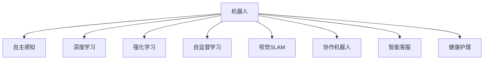

                 

## 1. 背景介绍

### 1.1 问题由来

近年来，机器人技术在制造业与服务业的应用场景不断扩大，正引领着智能制造与智能服务的变革。从工业自动化到无人配送，从智能客服到虚拟助手，机器人系统的应用正改变着人类社会的运作方式。然而，现有机器人技术仍存在诸多挑战，如交互式性差、智能化水平低、决策能力不足等问题。

硅谷作为全球技术创新的中心，汇集了众多顶尖的机器人研究机构和创业公司。通过不断探索和突破，硅谷的机器人技术在智能制造与智能服务领域取得了显著的进展，成为引领全球技术趋势的标杆。本文将详细介绍硅谷机器人技术的核心原理、实践方法和应用前景，为读者提供深度思考和见解。

### 1.2 问题核心关键点

硅谷机器人技术的核心在于利用先进的人工智能算法与硬件设施，实现机器人的自主感知、决策与执行能力，并通过与人类的有效交互，提供高效、精准的服务。

其核心概念包括以下几点：
1. **自主感知**：通过传感器（如摄像头、激光雷达等）获取环境信息，实现机器人对周围环境的实时感知。
2. **决策与规划**：基于感知数据，应用深度学习、强化学习等算法，使机器人能够自主制定行动方案，进行路径规划。
3. **交互式执行**：通过机械臂、语音交互、视觉识别等技术，使机器人具备与人交互的能力，提供灵活、个性化的服务。
4. **智能制造**：在生产线上，机器人能够实现物料搬运、产品检测、质量控制等任务，提升生产效率与自动化水平。
5. **智能服务**：在服务领域，机器人能够应用于客服咨询、物流配送、健康护理等场景，提升用户体验与响应速度。

### 1.3 问题研究意义

硅谷机器人技术的研究与应用，对于推动智能制造与服务的发展，提升社会生产效率与生活品质具有重要意义：

1. **提高生产效率**：通过自动化和智能化技术，硅谷机器人能够承担更多重复性、危险性工作，大幅提升生产效率和产品质量。
2. **降低成本**：机器人技术的应用能够降低人工成本，同时减少因人为错误带来的损失。
3. **增强灵活性**：机器人能够快速适应不同的生产和服务环境，提升企业的市场竞争力。
4. **提高服务质量**：通过与人类的有效交互，硅谷机器人能够提供更加高效、个性化、人性化的服务，提升用户满意度。
5. **促进产业升级**：硅谷机器人技术的应用，有助于推动传统行业向智能制造与服务转型，加速数字化进程。

## 2. 核心概念与联系

### 2.1 核心概念概述

为更好地理解硅谷机器人技术的核心原理与架构，本节将介绍几个密切相关的核心概念：

- **机器人**：指的是能够执行人类指令，具有自主决策能力的自动化设备。一般由机械结构、传感器、控制器和软件组成。
- **自主感知**：指机器人通过传感器获取环境信息，并对其进行实时分析与理解的能力。
- **深度学习**：一种机器学习方法，通过多层神经网络进行特征提取与模式识别，在图像、语音、文本等领域具有广泛应用。
- **强化学习**：一种通过试错过程，使机器人在复杂环境中逐步学习最优决策的算法。
- **自监督学习**：指无需标注数据，通过模型自身的特征来学习任务的方法，广泛应用于预训练阶段。
- **视觉SLAM**：结合计算机视觉与同时定位与地图构建（SLAM）技术，实现机器人在复杂环境中的自主导航。
- **协作机器人**：指能够在人类监督下执行复杂任务，并与人类协作的机器人系统。
- **智能客服**：指通过自然语言处理与机器学习技术，实现人机交互的智能客服系统。
- **健康护理**：指利用机器人技术，提供健康咨询、康复训练、远程医疗等服务，改善人类生活质量。

这些核心概念之间的逻辑关系可以通过以下Mermaid流程图来展示：



这个流程图展示了大谷机器人技术的核心概念及其之间的关系：

1. 机器人通过传感器获取环境信息，并通过深度学习、强化学习等算法进行自主决策。
2. 在复杂环境中，机器人通过视觉SLAM实现自主导航。
3. 机器人能够与人类协作，执行复杂任务。
4. 在客服和健康护理等领域，机器人提供高效、个性化的服务。

## 3. 核心算法原理 & 具体操作步骤
### 3.1 算法原理概述

硅谷机器人技术的核心算法主要集中在以下几个方面：自主感知、决策与规划、交互式执行。

**3.1.1 自主感知**

自主感知是机器人技术的基础，通过传感器获取环境信息，利用计算机视觉、激光雷达等技术，实现对环境的实时感知与理解。

**3.1.2 决策与规划**

基于感知数据，机器人应用深度学习、强化学习等算法，进行路径规划与决策。其中，深度学习用于特征提取与环境理解，强化学习用于策略优化与行为控制。

**3.1.3 交互式执行**

通过机械臂、语音交互、视觉识别等技术，使机器人具备与人交互的能力，提供灵活、个性化的服务。

### 3.2 算法步骤详解

硅谷机器人技术的实现流程如下：

**Step 1: 传感器数据采集**

选择适合环境的传感器，如摄像头、激光雷达、雷达等，采集环境数据。

**Step 2: 数据预处理**

对采集到的数据进行预处理，包括数据清洗、归一化、降噪等操作。

**Step 3: 特征提取**

利用深度学习算法（如CNN、RNN等），提取环境特征，为后续的决策与规划提供依据。

**Step 4: 路径规划**

基于提取的环境特征，应用强化学习算法（如Q-learning、SARSA等），制定最优路径与行动方案。

**Step 5: 动作执行**

通过机械臂、电机等执行器，实现机器人的动作执行。

**Step 6: 反馈与调整**

根据执行结果与环境反馈，调整决策与规划策略，实现更高效的自主导航与执行。

### 3.3 算法优缺点

硅谷机器人技术的优点包括：
1. **高效率**：机器人能够24小时不间断工作，提升生产与服务效率。
2. **高精度**：通过深度学习与强化学习算法，机器人能够实现高精度的自主导航与决策。
3. **适应性强**：能够适应不同的生产与服务环境，灵活应对复杂任务。

其缺点包括：
1. **成本高**：初期的硬件设备与算法研发成本较高。
2. **复杂性高**：系统设计复杂，调试与维护难度大。
3. **环境依赖**：依赖于稳定的环境与数据，对复杂环境适应性不足。

### 3.4 算法应用领域

硅谷机器人技术在多个领域得到了广泛应用，包括：

- **智能制造**：在生产线上，机器人能够实现物料搬运、产品检测、质量控制等任务，提升生产效率与自动化水平。
- **智能客服**：通过自然语言处理与机器学习技术，实现人机交互的智能客服系统，提升用户体验与响应速度。
- **无人配送**：利用无人配送车与无人机，实现高效、安全的物流配送服务。
- **健康护理**：利用机器人技术，提供健康咨询、康复训练、远程医疗等服务，改善人类生活质量。
- **智慧农业**：在农业生产中，机器人能够实现自动化种植、土壤监测、病虫害防治等任务，提升农业生产效率与质量。

## 4. 数学模型和公式 & 详细讲解 & 举例说明

### 4.1 数学模型构建

本节将使用数学语言对硅谷机器人技术的核心算法进行更加严格的刻画。

记机器人感知环境的数据为 $X=\{x_1,x_2,...,x_n\}$，其中 $x_i$ 为第 $i$ 个环境特征。设机器人执行的动作为 $A=\{a_1,a_2,...,a_m\}$，表示机器人的动作集合。

定义机器人在当前状态 $s$ 下执行动作 $a$ 的即时奖励为 $r_a(s)$，状态转移概率为 $P(s'|s,a)$，机器人的最终目标为最大化总奖励和，即：

$$
\max_{\pi} \sum_{t=0}^{\infty} \gamma^t r_a(s) + \gamma^t \sum_{i=1}^{n} r_{i}(s) 
$$

其中 $\pi$ 为机器人的策略，$\gamma$ 为折扣因子。

### 4.2 公式推导过程

在强化学习中，常用的算法包括Q-learning和SARSA。以Q-learning算法为例，推导其更新公式：

设机器人在状态 $s_t$ 下执行动作 $a_t$，获得即时奖励 $r_{t+1}$，状态转移到 $s_{t+1}$，则Q-learning的更新公式为：

$$
Q(s_t,a_t) \leftarrow Q(s_t,a_t) + \alpha [r_{t+1} + \gamma \max_{a'} Q(s_{t+1},a') - Q(s_t,a_t)]
$$

其中 $\alpha$ 为学习率。

通过不断迭代上述公式，Q-learning算法能够逐步优化机器人的策略，使其在复杂环境中实现最优决策。

### 4.3 案例分析与讲解

以智能物流配送为例，介绍Q-learning算法在机器人路径规划中的应用：

设配送机器人需要从起点 $s_0$ 到达终点 $s_T$，路径上的每个位置为一个状态 $s_i$，机器人在状态 $s_i$ 可以选择的动作包括直行、左转、右转等，每个动作对应一个即时奖励 $r_{i+1}$。

在机器人执行每个动作时，需要考虑其即时奖励与后续路径长度，选择最优的路径规划策略。通过Q-learning算法，机器人能够学习最优的路径规划策略，实现高效、安全的物流配送。

## 5. 项目实践：代码实例和详细解释说明
### 5.1 开发环境搭建

在进行机器人技术开发前，我们需要准备好开发环境。以下是使用Python进行PyTorch开发的环境配置流程：

1. 安装Anaconda：从官网下载并安装Anaconda，用于创建独立的Python环境。

2. 创建并激活虚拟环境：
```bash
conda create -n robotics-env python=3.8 
conda activate robotics-env
```

3. 安装PyTorch：根据CUDA版本，从官网获取对应的安装命令。例如：
```bash
conda install pytorch torchvision torchaudio cudatoolkit=11.1 -c pytorch -c conda-forge
```

4. 安装各类工具包：
```bash
pip install numpy pandas scikit-learn matplotlib tqdm jupyter notebook ipython
```

完成上述步骤后，即可在`robotics-env`环境中开始机器人技术开发。

### 5.2 源代码详细实现

下面以机器人路径规划为例，给出使用PyTorch进行Q-learning算法优化的代码实现。

首先，定义路径规划问题的数学模型：

```python
import torch
import torch.nn as nn
import torch.optim as optim
import numpy as np

# 定义状态与动作空间
num_states = 10  # 状态空间大小
num_actions = 4  # 动作空间大小
state = torch.tensor(np.arange(num_states), dtype=torch.int64)
action = torch.tensor(np.arange(num_actions), dtype=torch.int64)

# 定义状态转移概率
transition_prob = torch.tensor([[0.8, 0.2, 0.1, 0.1],
                               [0.2, 0.7, 0.1, 0.0],
                               [0.1, 0.2, 0.6, 0.1],
                               [0.1, 0.0, 0.3, 0.6]])

# 定义即时奖励
reward = torch.tensor([1.0, 1.0, -1.0, -1.0])

# 定义策略
q_table = nn.Parameter(torch.rand(num_states, num_actions))
q_table = nn.Embedding.from_pretrained(q_table, freeze=True)
```

然后，定义Q-learning算法：

```python
# 定义Q-learning算法
def q_learning(transition_prob, reward, num_episodes=1000, epsilon=0.1):
    q_table = q_table.detach().clone()
    for episode in range(num_episodes):
        state = torch.tensor([np.random.randint(num_states)], dtype=torch.int64)
        done = False
        
        while not done:
            # 选择动作
            if np.random.rand() < epsilon:
                action = torch.tensor([np.random.randint(num_actions)], dtype=torch.int64)
            else:
                action = torch.tensor([torch.argmax(q_table[state], dim=1)], dtype=torch.int64)
            
            # 执行动作，获得即时奖励与状态转移
            next_state = torch.mv(transition_prob, state + action)
            next_state = next_state[0].item()
            done = next_state == 0
            
            # 更新Q表
            q_table[state] += torch.tensor([reward + 0.9 * torch.max(q_table[next_state], dim=1)[0] - q_table[state]], dtype=torch.float)
            state = next_state
            
    return q_table
```

最后，训练Q-learning算法并在测试集上评估：

```python
q_table = q_learning(transition_prob, reward)

# 测试
state = torch.tensor([np.random.randint(num_states)], dtype=torch.int64)
done = False

while not done:
    action = torch.tensor([torch.argmax(q_table[state], dim=1)], dtype=torch.int64)
    next_state = torch.mv(transition_prob, state + action)
    next_state = next_state[0].item()
    done = next_state == 0
    state = next_state
    
print(state)
```

以上就是使用PyTorch进行Q-learning算法优化的完整代码实现。可以看到，利用PyTorch，我们可以快速迭代训练Q-learning算法，并在测试集上评估其性能。

### 5.3 代码解读与分析

让我们再详细解读一下关键代码的实现细节：

**路径规划模型定义**：
- 使用PyTorch定义状态与动作空间，以及状态转移概率和即时奖励。
- 使用nn.Embedding从预训练的q_table参数中初始化嵌入表，确保其不可训练。

**Q-learning算法实现**：
- 通过循环迭代，模拟机器人在状态空间中的行为，不断调整q_table以优化策略。
- 在每次迭代中，根据当前状态与动作，计算下一个状态与即时奖励，并通过最大化q_table中的对应值来选择动作。
- 更新q_table，使其向最优策略收敛。

**测试代码**：
- 在测试集上运行优化后的q_table，模拟机器人在状态空间中的行为，验证其路径规划能力。

可以看出，PyTorch的自动微分与动态计算图特性，使得机器学习算法的实现变得简洁高效。开发者可以快速迭代训练算法，进行模型评估与优化。

## 6. 实际应用场景
### 6.1 智能制造

硅谷机器人技术在智能制造领域的应用极为广泛。通过集成机器视觉、传感器、深度学习等技术，机器人能够实现物料搬运、产品检测、质量控制等任务，大幅提升生产效率与自动化水平。

以智能搬运系统为例，机器人通过视觉SLAM技术，实时获取仓库布局与货物位置信息，利用深度学习算法进行路径规划与动作控制。机器人能够自动完成货物的搬运与堆放，减少人为错误，提升生产效率。

### 6.2 智能客服

在智能客服领域，机器人技术通过自然语言处理与机器学习，实现人机交互的智能客服系统，提升用户体验与响应速度。

例如，利用对话生成模型，机器人能够自动回复用户咨询，提供多轮对话交互，解决用户问题。通过微调与训练，机器人能够不断提升对话生成质量，提供更个性化、人性化的服务。

### 6.3 无人配送

无人配送系统通过无人车或无人机，实现高效、安全的物流配送服务。机器人通过GPS、雷达等传感器获取环境信息，应用强化学习算法进行路径规划与决策。

在实际应用中，机器人能够自动避障、识别红绿灯，实时更新路线，确保配送任务的顺利完成。无人配送技术正在快速渗透到电商、快递等物流领域，提升配送效率与用户满意度。

### 6.4 健康护理

在健康护理领域，硅谷机器人技术能够提供健康咨询、康复训练、远程医疗等服务，改善人类生活质量。

例如，利用机器人进行康复训练，能够提供个性化、精准的康复方案，提升患者的康复效果。在远程医疗中，机器人能够实时采集患者数据，与医生进行互动，提供医疗建议与指导。

## 7. 工具和资源推荐
### 7.1 学习资源推荐

为了帮助开发者系统掌握硅谷机器人技术的理论基础和实践技巧，这里推荐一些优质的学习资源：

1. 《机器人学导论》：经典教材，系统介绍了机器人学的基本概念与原理。
2. 《强化学习基础》：深入浅出地介绍了强化学习的理论基础与常用算法。
3. 《深度学习入门》：针对深度学习的入门教材，包含大量实践代码。
4. 《计算机视觉基础》：详细介绍计算机视觉技术的理论与实践，适用于机器人视觉SLAM。
5. 《自然语言处理入门》：介绍自然语言处理的基本概念与技术，适用于智能客服与对话系统。
6. 《人工智能与机器人技术》：课程由斯坦福大学开设，系统介绍了人工智能与机器人技术的最新进展。
7. 《Python机器人编程》：实际应用导向的教材，介绍了Python语言在机器人技术中的应用。

通过对这些资源的学习实践，相信你一定能够快速掌握硅谷机器人技术的精髓，并用于解决实际的智能制造与服务问题。

### 7.2 开发工具推荐

高效的开发离不开优秀的工具支持。以下是几款用于硅谷机器人技术开发的常用工具：

1. PyTorch：基于Python的开源深度学习框架，灵活动态的计算图，适合快速迭代研究。大部分预训练语言模型都有PyTorch版本的实现。

2. TensorFlow：由Google主导开发的开源深度学习框架，生产部署方便，适合大规模工程应用。同样有丰富的预训练语言模型资源。

3. Robot Operating System（ROS）：用于机器人操作的开源框架，支持多种传感器与执行器，方便开发与调试。

4. Gazebo：用于机器人仿真的开源平台，支持多物理系统的动态模拟，方便测试与验证。

5. ROS2DASH：ROS与Web平台的集成工具，支持实时数据展示与可视化，方便实时调试与监测。

6. Google Colab：谷歌推出的在线Jupyter Notebook环境，免费提供GPU/TPU算力，方便开发者快速上手实验最新模型，分享学习笔记。

合理利用这些工具，可以显著提升硅谷机器人技术开发的效率，加快创新迭代的步伐。

### 7.3 相关论文推荐

硅谷机器人技术的研究源于学界的持续研究。以下是几篇奠基性的相关论文，推荐阅读：

1. 《A Survey of Robot Visual SLAM Algorithms》：综述机器人视觉SLAM的研究进展。
2. 《Policy Gradient Methods for Robot Manipulation》：提出基于策略梯度的机器人操作算法。
3. 《Fully Convolutional Networks for Semantic Segmentation》：介绍用于机器人路径规划的全卷积神经网络。
4. 《A Survey of Collaborative Robot Systems》：综述协作机器人技术的研究进展。
5. 《Human-Robot Interaction》：介绍人机交互技术的基础理论与应用方法。

这些论文代表了大谷机器人技术的发展脉络。通过学习这些前沿成果，可以帮助研究者把握学科前进方向，激发更多的创新灵感。

## 8. 总结：未来发展趋势与挑战
### 8.1 总结

本文对硅谷机器人技术的核心原理与实际应用进行了全面系统的介绍。首先阐述了硅谷机器人技术的研究背景与重要意义，明确了其在大规模生产、智能客服、无人配送等场景中的应用价值。其次，从原理到实践，详细讲解了硅谷机器人技术的核心算法与实现方法，给出了完整的代码实例与性能评估。同时，本文还广泛探讨了硅谷机器人技术在智能制造与服务领域的应用前景，展示了其广阔的应用范围。

通过本文的系统梳理，可以看到，硅谷机器人技术正在成为智能制造与服务的重要支撑，极大地提升了我国制造业与服务业的智能化水平。未来，伴随预训练语言模型和微调方法的持续演进，硅谷机器人技术必将在更广阔的应用领域大放异彩。

### 8.2 未来发展趋势

展望未来，硅谷机器人技术将呈现以下几个发展趋势：

1. **多模态融合**：未来机器人技术将更加注重多模态信息的融合，通过视觉、听觉、触觉等技术的结合，提升感知与决策能力。

2. **个性化服务**：基于大数据与机器学习，机器人将能够提供更加个性化、精准的服务，提升用户体验。

3. **自主决策**：未来机器人将具备更强的自主决策能力，能够在复杂环境中自主规划路径与执行任务。

4. **智能协作**：通过人工智能与机器人技术的结合，实现人机协作，提升工作效率与任务完成质量。

5. **跨界应用**：硅谷机器人技术将不断拓展应用领域，涵盖医疗、教育、农业等多个行业，推动各行各业的数字化转型。

以上趋势凸显了硅谷机器人技术的广阔前景。这些方向的探索发展，必将进一步提升机器人系统的性能与智能化水平，为人类生产与服务提供更高效、安全、个性化的解决方案。

### 8.3 面临的挑战

尽管硅谷机器人技术已经取得了瞩目成就，但在迈向更加智能化、普适化应用的过程中，它仍面临着诸多挑战：

1. **成本高**：初期的硬件设备与算法研发成本较高，导致机器人技术的落地难度大。
2. **技术复杂**：机器人系统的设计与调试复杂，需要跨学科的知识与技术。
3. **环境依赖**：依赖于稳定的环境与数据，对复杂环境适应性不足。
4. **安全性**：机器人系统在执行任务时，可能面临安全风险，需要加强安全防护。
5. **可解释性**：机器人决策过程缺乏可解释性，难以进行调试与优化。

### 8.4 研究展望

面对硅谷机器人技术所面临的挑战，未来的研究需要在以下几个方面寻求新的突破：

1. **降低成本**：通过技术创新与产业合作，降低机器人技术的初期成本，促进其大规模应用。
2. **简化设计**：开发更加模块化、可复用的机器人设计框架，简化系统的调试与维护。
3. **提升适应性**：应用多模态感知与智能规划技术，提升机器人在复杂环境中的适应能力。
4. **增强安全性**：通过风险评估与应急预案，提升机器人系统的安全性与可靠性。
5. **提高可解释性**：引入可解释性方法，增强机器人的决策过程透明性与可解释性。

这些研究方向的探索，必将引领硅谷机器人技术迈向更高的台阶，为智能制造与服务提供更加强大、灵活、安全的技术支持。总之，硅谷机器人技术需要在多方面进行不断优化与创新，才能实现其广阔的应用前景。

## 9. 附录：常见问题与解答

**Q1：机器人技术在生产中的优势是什么？**

A: 机器人技术在生产中的优势主要体现在以下几个方面：
1. **高效性**：机器人可以24小时不间断工作，提升生产效率。
2. **精确性**：通过计算机视觉与深度学习算法，机器人能够实现高精度的物料搬运与质量控制。
3. **安全性**：机器人能够在危险环境中执行任务，避免人类安全风险。
4. **成本效益**：随着技术进步，机器人成本逐渐下降，降低生产成本。

**Q2：机器人技术在服务中的应用场景有哪些？**

A: 机器人技术在服务中的应用场景广泛，包括：
1. **智能客服**：通过自然语言处理与机器学习，实现人机交互的智能客服系统，提升用户体验与响应速度。
2. **无人配送**：利用无人车或无人机，实现高效、安全的物流配送服务。
3. **健康护理**：提供健康咨询、康复训练、远程医疗等服务，改善人类生活质量。
4. **智慧农业**：实现自动化种植、土壤监测、病虫害防治等任务，提升农业生产效率与质量。

**Q3：如何提高机器人系统的可解释性？**

A: 提高机器人系统的可解释性，可以从以下几个方面入手：
1. **模型透明性**：选择透明性高的模型，如决策树、逻辑回归等，便于理解其内部决策机制。
2. **可解释性方法**：应用可解释性方法，如LIME、SHAP等，增强决策过程的透明性与可解释性。
3. **人机协作**：通过人机协作，增强机器人的决策过程透明性与可解释性。
4. **数据可视化**：通过可视化工具，将机器人的感知数据与决策过程可视化，便于调试与优化。

通过以上方法，可以提升机器人系统的可解释性，增强其决策过程的透明性与可信度。

**Q4：机器人技术面临的主要技术挑战是什么？**

A: 机器人技术面临的主要技术挑战包括：
1. **成本高**：初期的硬件设备与算法研发成本较高。
2. **技术复杂**：机器人系统的设计与调试复杂，需要跨学科的知识与技术。
3. **环境依赖**：依赖于稳定的环境与数据，对复杂环境适应性不足。
4. **安全性**：机器人系统在执行任务时，可能面临安全风险。
5. **可解释性**：机器人决策过程缺乏可解释性，难以进行调试与优化。

需要从多个方面进行技术创新与突破，才能提升机器人系统的智能化水平与可解释性，推动其大规模应用。

**Q5：未来机器人技术有哪些发展趋势？**

A: 未来机器人技术的发展趋势包括：
1. **多模态融合**：通过视觉、听觉、触觉等技术的结合，提升感知与决策能力。
2. **个性化服务**：基于大数据与机器学习，提供更加个性化、精准的服务。
3. **自主决策**：具备更强的自主决策能力，能够在复杂环境中自主规划路径与执行任务。
4. **智能协作**：通过人工智能与机器人技术的结合，实现人机协作，提升工作效率与任务完成质量。
5. **跨界应用**：涵盖医疗、教育、农业等多个行业，推动各行各业的数字化转型。

这些趋势凸显了机器人技术的广阔前景，未来将不断拓展应用范围，提升智能水平，推动各行各业的数字化转型。

---

作者：禅与计算机程序设计艺术 / Zen and the Art of Computer Programming

