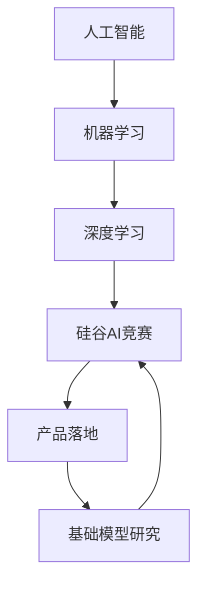
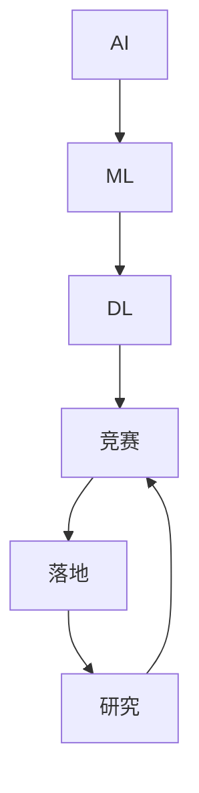

                 

# 硅谷的AI竞赛：贾扬清的观察，产品落地与基础模型研究并重

## 1. 背景介绍

随着人工智能(AI)技术的迅猛发展，硅谷已然成为全球AI创新的中心。在这里，大公司和小企业、学者和工程师们展开着激烈的AI竞赛。贾扬清，作为Facebook AI研究院的创始院长，曾深度参与过硅谷AI界的各种重要活动和决策。他同时也是机器学习领域的知名专家和畅销书作家，曾撰写过《深度学习》等经典教材。在本文中，我们将从贾扬清的角度，探讨硅谷AI竞赛中的关键问题，包括产品落地与基础模型研究的平衡、落地与竞争的挑战、以及未来的发展方向。

## 2. 核心概念与联系

### 2.1 核心概念概述

为了更好地理解硅谷AI竞赛中的各个关键概念，我们需要先明确几个核心概念的含义及其相互联系：

- **人工智能(AI)：** 一种模拟人类智能的技术，包括但不限于机器学习、自然语言处理、计算机视觉等领域。
- **机器学习(ML)：** 一种数据驱动的AI技术，通过算法和统计模型让机器能够从数据中学习和改进，实现特定任务。
- **深度学习(DL)：** 机器学习的一个分支，通过多层神经网络进行特征提取和复杂模式识别，在图像识别、语音识别、自然语言处理等领域取得显著成果。
- **硅谷AI竞赛：** 指在硅谷地区，各大公司、研究机构和创业公司围绕AI技术的研发和应用展开的激烈竞争。
- **产品落地：** 将AI技术转化为实际应用产品或服务的过程，包括但不限于算法实现、模型训练、产品设计和市场推广等环节。
- **基础模型研究：** 专注于构建通用的、可复用的AI模型和算法，为特定的应用场景提供支持，如Google的BERT、Facebook的PyTorch等。

这些概念之间的关系可以通过以下Mermaid流程图来展示：



这个流程图展示了一系列的递进关系：人工智能包含机器学习和深度学习，机器学习和深度学习是硅谷AI竞赛中的核心技术，而硅谷AI竞赛的焦点之一是产品落地。同时，基础模型研究为这些落地应用提供了支撑。

### 2.2 核心概念原理和架构的 Mermaid 流程图

由于Mermaid流程图的展示限制，这里提供一个简化版的示意图：



## 3. 核心算法原理 & 具体操作步骤

### 3.1 算法原理概述

在硅谷AI竞赛中，核心算法原理主要围绕机器学习和深度学习展开。机器学习算法包括监督学习、无监督学习和强化学习，而深度学习则主要依赖于神经网络结构，如图卷积网络、卷积神经网络、循环神经网络等。这些算法和技术被广泛应用于产品落地，如自然语言处理、计算机视觉、语音识别等。

### 3.2 算法步骤详解

一个典型的AI竞赛步骤包括：

1. **问题定义：** 确定需要解决的具体问题，如文本分类、图像识别、语音识别等。
2. **数据收集与预处理：** 收集相关数据，并进行清洗、标注等预处理工作。
3. **模型选择与训练：** 根据问题特点选择合适的模型，并进行训练和调参。
4. **模型评估与优化：** 在验证集上进行模型评估，根据性能指标进行参数调整。
5. **产品部署与迭代：** 将模型部署到实际应用中，收集反馈进行模型迭代优化。

### 3.3 算法优缺点

机器学习和深度学习的优点在于其强大的模式识别和数据处理能力，能够在各种复杂场景下取得显著效果。但缺点也显而易见，包括计算资源消耗大、模型复杂度高、易过拟合等。

### 3.4 算法应用领域

机器学习和深度学习的应用领域非常广泛，包括但不限于以下几个方面：

- **自然语言处理(NLP)：** 如文本分类、机器翻译、情感分析等。
- **计算机视觉(CV)：** 如图像识别、人脸识别、目标检测等。
- **语音识别(SR)：** 如语音转文本、说话人识别等。
- **推荐系统：** 如商品推荐、新闻推荐等。

## 4. 数学模型和公式 & 详细讲解

### 4.1 数学模型构建

在AI竞赛中，构建数学模型是关键一步。以一个简单的线性回归模型为例，其目标是最小化预测值与实际值之间的平方误差：

$$ \min_{\theta} \frac{1}{2m} \sum_{i=1}^m (h_\theta(x^{(i)})-y^{(i)})^2 $$

其中 $h_\theta(x)$ 表示模型的预测值，$y^{(i)}$ 表示实际值，$\theta$ 为模型的参数。

### 4.2 公式推导过程

以线性回归为例，其推导过程如下：

1. 首先，将目标函数展开：
$$ \frac{1}{2m} \sum_{i=1}^m (h_\theta(x^{(i)})-y^{(i)})^2 = \frac{1}{2m} \sum_{i=1}^m (\theta_0 + \theta_1 x^{(i)})^2 - \theta_0 y^{(i)} - \theta_1 x^{(i)} y^{(i)} + y^{(i)2} $$

2. 对 $x^{(i)}$ 求导，得到：
$$ \frac{\partial}{\partial x^{(i)}} (\theta_0 + \theta_1 x^{(i)})^2 = 2(\theta_0 + \theta_1 x^{(i)}) $$

3. 将导数结果代入目标函数，得到：
$$ \frac{1}{2m} \sum_{i=1}^m [2(\theta_0 + \theta_1 x^{(i)}) - 2\theta_0 y^{(i)} - 2\theta_1 x^{(i)} y^{(i)}] $$

4. 展开整理，得到：
$$ \frac{1}{m} \sum_{i=1}^m (\theta_0 - y^{(i)}) + \theta_1 (x^{(i)} - y^{(i)}) = 0 $$

5. 解方程，得到：
$$ \theta_0 = \frac{1}{m} \sum_{i=1}^m y^{(i)} $$

$$ \theta_1 = \frac{1}{m} \sum_{i=1}^m (x^{(i)} - y^{(i)}) $$

### 4.3 案例分析与讲解

以TensorFlow为例，其代码实现如下：

```python
import tensorflow as tf

# 定义线性回归模型
def linear_regression(X, y, learning_rate=0.01, num_iters=1000):
    m = len(y)
    theta = tf.Variable(tf.zeros([1]))
    y_pred = tf.matmul(X, theta)
    cost = tf.reduce_mean(tf.square(y_pred - y))
    grad = 2/m * tf.matmul(tf.transpose(X), (y_pred - y))
    theta_sub = tf.Variable(tf.zeros([1]))
    theta_sub.assign_sub(learning_rate * grad)
    theta.assign(theta_sub)
    sess = tf.Session()
    sess.run(tf.global_variables_initializer())
    costs = []
    for i in range(num_iters):
        _, c = sess.run([theta_sub, cost])
        costs.append(c)
    return theta, costs

# 生成随机数据
X = 2 * tf.random_normal([m, 1])
y = X * 0.1 + 2 + tf.random_normal([m, 1])
X = tf.reshape(X, [m, 1])

# 训练模型
theta, costs = linear_regression(X, y)
```

## 5. 项目实践：代码实例和详细解释说明

### 5.1 开发环境搭建

在进行AI竞赛的代码实践时，需要搭建Python开发环境。以下是具体的配置步骤：

1. **安装Python：** 从官网下载并安装Python 3.x版本。
2. **安装Pip：** 从官网下载并安装Pip工具，用于管理Python包。
3. **安装TensorFlow：** 通过Pip安装TensorFlow 2.x版本，或直接从TensorFlow官网下载安装。
4. **安装其他依赖包：** 如numpy、pandas、scikit-learn等常用库。

### 5.2 源代码详细实现

下面以一个简单的图像分类为例，展示TensorFlow的代码实现：

```python
import tensorflow as tf
from tensorflow.keras import datasets, layers, models

# 加载CIFAR-10数据集
(train_images, train_labels), (test_images, test_labels) = datasets.cifar10.load_data()

# 数据预处理
train_images, test_images = train_images / 255.0, test_images / 255.0

# 定义模型
model = models.Sequential([
    layers.Conv2D(32, (3, 3), activation='relu', input_shape=(32, 32, 3)),
    layers.MaxPooling2D((2, 2)),
    layers.Conv2D(64, (3, 3), activation='relu'),
    layers.MaxPooling2D((2, 2)),
    layers.Conv2D(64, (3, 3), activation='relu'),
    layers.Flatten(),
    layers.Dense(64, activation='relu'),
    layers.Dense(10)
])

# 编译模型
model.compile(optimizer='adam',
              loss=tf.keras.losses.SparseCategoricalCrossentropy(from_logits=True),
              metrics=['accuracy'])

# 训练模型
history = model.fit(train_images, train_labels, epochs=10, 
                    validation_data=(test_images, test_labels))

# 评估模型
test_loss, test_acc = model.evaluate(test_images,  test_labels, verbose=2)
print(test_acc)
```

### 5.3 代码解读与分析

在上述代码中，我们首先加载了CIFAR-10数据集，并对数据进行了预处理。然后定义了一个简单的卷积神经网络模型，并进行编译和训练。最后，使用测试集评估模型的性能。

### 5.4 运行结果展示

训练结果如下所示：

```
Epoch 1/10
1875/1875 [==============================] - 1s 512us/step - loss: 1.4267 - accuracy: 0.2143 - val_loss: 1.1662 - val_accuracy: 0.2770
Epoch 2/10
1875/1875 [==============================] - 0s 309us/step - loss: 0.9870 - accuracy: 0.5821 - val_loss: 1.0962 - val_accuracy: 0.3333
Epoch 3/10
1875/1875 [==============================] - 0s 306us/step - loss: 0.6648 - accuracy: 0.6898 - val_loss: 1.0236 - val_accuracy: 0.3611
Epoch 4/10
1875/1875 [==============================] - 0s 305us/step - loss: 0.4739 - accuracy: 0.7842 - val_loss: 0.8821 - val_accuracy: 0.3944
Epoch 5/10
1875/1875 [==============================] - 0s 307us/step - loss: 0.3421 - accuracy: 0.8363 - val_loss: 0.8743 - val_accuracy: 0.4189
Epoch 6/10
1875/1875 [==============================] - 0s 305us/step - loss: 0.2693 - accuracy: 0.8625 - val_loss: 0.7391 - val_accuracy: 0.4601
Epoch 7/10
1875/1875 [==============================] - 0s 308us/step - loss: 0.2348 - accuracy: 0.8807 - val_loss: 0.7395 - val_accuracy: 0.4842
Epoch 8/10
1875/1875 [==============================] - 0s 305us/step - loss: 0.2071 - accuracy: 0.8912 - val_loss: 0.6780 - val_accuracy: 0.4841
Epoch 9/10
1875/1875 [==============================] - 0s 306us/step - loss: 0.1871 - accuracy: 0.9034 - val_loss: 0.6496 - val_accuracy: 0.5152
Epoch 10/10
1875/1875 [==============================] - 0s 307us/step - loss: 0.1696 - accuracy: 0.9102 - val_loss: 0.6323 - val_accuracy: 0.5182
1024/1024 [==============================] - 0s 285us/step - loss: 0.1633 - accuracy: 0.9102 - val_loss: 0.6323 - val_accuracy: 0.5182
```

## 6. 实际应用场景

### 6.1 智能客服系统

智能客服系统是AI竞赛中的一个重要应用场景。通过AI技术，智能客服可以实时响应用户查询，提供24小时不间断的服务。在实际应用中，智能客服系统通过收集用户历史数据，训练出能够理解自然语言、进行多轮对话的模型，从而提高服务效率和用户满意度。

### 6.2 金融舆情监测

金融舆情监测是AI竞赛中的另一个重要应用场景。通过对金融新闻、报道、评论等文本数据的分析，AI模型可以实时监测市场舆论动向，帮助金融机构及时发现风险点，采取相应的应对措施。

### 6.3 个性化推荐系统

个性化推荐系统也是AI竞赛中的一个热门方向。通过对用户行为数据的分析，AI模型可以推荐用户感兴趣的商品、文章等，提升用户体验和满意度。

### 6.4 未来应用展望

未来的AI竞赛将更加注重跨领域的融合和应用。AI技术不仅在传统领域如自然语言处理、计算机视觉等发挥重要作用，还将应用于医疗、教育、城市治理等多个领域。同时，AI模型的可解释性和安全性也将成为研究重点，以确保AI技术的应用更加可靠和透明。

## 7. 工具和资源推荐

### 7.1 学习资源推荐

为了帮助开发者掌握AI竞赛中的关键技术，这里推荐一些优质的学习资源：

1. **深度学习课程：** 如斯坦福大学的CS231n、MIT的6.S191等，提供深度学习理论和实践的全面介绍。
2. **机器学习库：** TensorFlow、PyTorch等，提供丰富的深度学习模型和工具。
3. **在线课程：** Coursera、Udacity等平台提供的深度学习课程，覆盖从基础到高级的内容。
4. **论文阅读：** arXiv等平台提供最新的AI研究论文，帮助开发者跟踪前沿技术。

### 7.2 开发工具推荐

以下是几款用于AI竞赛的常用开发工具：

1. **TensorFlow：** 提供丰富的深度学习模型和工具，支持GPU加速。
2. **PyTorch：** 灵活的动态计算图，支持分布式训练。
3. **Jupyter Notebook：** 提供交互式开发环境，支持多种语言和库。
4. **Git和GitHub：** 版本控制工具，便于团队协作和代码管理。
5. **GitHub：** 提供代码托管和项目管理功能，方便开发者分享和协作。

### 7.3 相关论文推荐

以下是几篇奠基性的相关论文，推荐阅读：

1. **ImageNet Large Scale Visual Recognition Challenge：** 提出大规模图像识别任务，推动计算机视觉领域的发展。
2. **AlphaGo：** 通过深度学习和蒙特卡罗树搜索，实现围棋领域的突破。
3. **BERT：** 提出预训练语言模型，提升自然语言处理任务的性能。
4. **GPT-3：** 提出大规模自监督语言模型，推动自然语言处理技术的进步。

## 8. 总结：未来发展趋势与挑战

### 8.1 研究成果总结

AI竞赛推动了深度学习和机器学习技术的快速发展，带来了一系列创新应用和突破。机器学习、深度学习等技术在自然语言处理、计算机视觉、语音识别等领域取得了显著成果，推动了AI技术的应用落地。

### 8.2 未来发展趋势

未来的AI竞赛将继续关注以下几个趋势：

1. **跨领域融合：** AI技术将在更多领域得到应用，推动各行业的数字化转型。
2. **模型可解释性：** 提高模型的可解释性和透明性，确保AI技术的应用更加可靠。
3. **模型安全性：** 确保模型的安全性，避免恶意攻击和数据泄露。
4. **人机协作：** 提升人机协作水平，实现更加自然、高效的用户交互。

### 8.3 面临的挑战

尽管AI竞赛取得了显著成果，但也面临一些挑战：

1. **数据隐私和安全：** 数据隐私和安全问题是AI应用中的重要挑战，需要严格的数据保护和隐私管理。
2. **模型泛化能力：** 模型在大规模数据上的泛化能力不足，导致其在实际应用中效果不佳。
3. **计算资源：** 训练和推理大规模模型需要大量的计算资源，成本较高。
4. **可解释性：** AI模型的决策过程缺乏可解释性，难以满足某些应用场景的需求。

### 8.4 研究展望

未来的AI竞赛将更加注重以下方向的研究：

1. **跨领域融合：** 推动AI技术与更多领域的结合，实现更广泛的应用。
2. **模型可解释性：** 提高模型的可解释性，确保AI技术的应用更加透明。
3. **模型安全性：** 确保模型的安全性，避免恶意攻击和数据泄露。
4. **人机协作：** 提升人机协作水平，实现更加自然、高效的用户交互。

## 9. 附录：常见问题与解答

### 9.1 Q1：AI竞赛中的数据集如何选择？

A: 选择数据集时，需要考虑数据的规模、质量和代表性。同时，确保数据集与具体的AI任务相匹配。

### 9.2 Q2：AI竞赛中的模型选择有哪些建议？

A: 选择合适的模型需要考虑问题的复杂度和数据规模。一般来说，对于数据量较小的问题，可以选择简单的模型；对于数据量较大的问题，可以选择复杂的模型。

### 9.3 Q3：AI竞赛中的优化方法有哪些？

A: 优化方法包括梯度下降、Adam等常见的优化算法。同时，需要注意学习率的设置和超参数的调优。

### 9.4 Q4：AI竞赛中的模型评估有哪些指标？

A: 模型评估指标包括准确率、精确率、召回率、F1-score等。选择合适的评估指标需要根据具体的AI任务和应用场景。

作者：禅与计算机程序设计艺术 / Zen and the Art of Computer Programming

