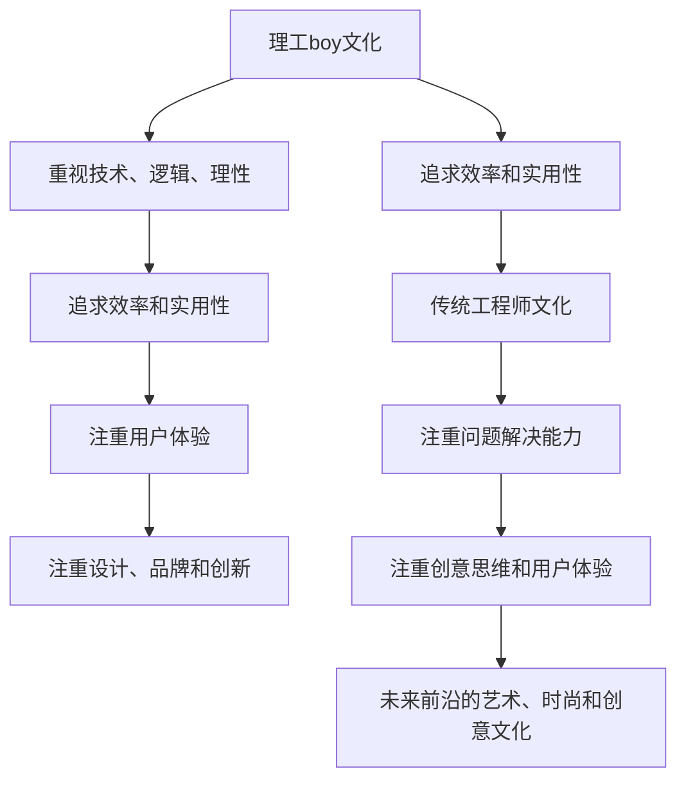

                 

# 硅谷科技文化冲突:理工boy与时尚girl

## 1. 背景介绍

在硅谷这片神奇的土地上，科技与文化交融，但两者之间似乎总有着不可调和的矛盾。这其中，"理工boy"与"时尚girl"的冲突尤为显著。"理工boy"代表着传统的工程师文化，重视技术、逻辑和理性，追求效率和实用性。而"时尚girl"则代表着更为前沿的艺术、时尚和创意文化，注重体验、情感和美学，追求创新和独特性。本文旨在探讨这种文化冲突的根源，并提出解决之道。

## 2. 核心概念与联系

### 2.1 核心概念概述

**"理工boy"文化**：代表硅谷传统的工程师文化，注重技术、逻辑、理性和实用。典型的代表人物是苹果公司的乔布斯和亚马逊的贝佐斯，他们都是技术出身，重视产品设计和用户体验，强调逻辑思维和问题解决能力。

**"时尚girl"文化**：代表更为前沿的艺术、时尚和创意文化。典型的代表人物是特斯拉的埃隆·马斯克，他虽然有技术背景，但更注重设计、品牌和创新，强调创意思维和用户体验。

**科技与文化冲突**：在硅谷，"理工boy"与"时尚girl"两种文化的冲突，反映了科技与艺术、技术与美学之间的矛盾。这种冲突不仅体现在企业文化和产品设计上，也体现在创新方式和创业精神上。

**Mermaid 流程图**：



## 3. 核心算法原理 & 具体操作步骤

### 3.1 算法原理概述

硅谷科技文化冲突的根源在于两种文化对于创新和创造的不同理解。"理工boy"文化注重技术细节和逻辑推理，而"时尚girl"文化注重创意表达和用户体验。这种差异导致了他们在创新过程中的方法论和实践上的冲突。

### 3.2 算法步骤详解

**Step 1: 确定冲突点**
- 识别两种文化在思维方式、产品设计、企业文化等方面的不同。例如，"理工boy"更注重技术细节，而"时尚girl"更注重创意表达。

**Step 2: 寻找共同点**
- 寻找两种文化之间的共同点，如对创新的追求、对用户需求的关注等。通过这些共同点，可以建立沟通和协作的基础。

**Step 3: 设计融合方案**
- 设计一种融合方案，使得"理工boy"和"时尚girl"能够在创新过程中互补，扬长避短。例如，可以在产品设计中融入技术细节，同时注重用户体验和创意表达。

**Step 4: 实施和优化**
- 实施融合方案，并根据实际情况不断优化。可以通过迭代和反馈机制，逐步改进两种文化的融合方式。

### 3.3 算法优缺点

**优点**：
- 促进创新：通过融合两种文化，可以产生更多创新思路和创意。
- 提高效率："理工boy"的逻辑思维和"时尚girl"的创意表达可以相互补充，提高解决问题的效率。
- 增强用户体验：注重用户体验的设计可以提升产品的市场竞争力。

**缺点**：
- 文化冲突：两种文化在思维方式和价值观上存在差异，可能导致冲突和不和谐。
- 协调难度：融合方案需要考虑到多个方面，协调难度较大。
- 初期磨合：需要一定时间进行融合和磨合，初期可能会遇到困难。

### 3.4 算法应用领域

硅谷科技文化冲突的解决策略可以广泛应用于多个领域：

- **产品设计**：在科技产品设计中，可以将技术细节与创意表达相结合，既注重功能又注重外观，提升产品的用户体验和市场竞争力。
- **企业文化**：在企业内部，可以建立包容多元文化的氛围，鼓励技术人才和创意人才的合作，提升企业创新能力和竞争力。
- **创业精神**：创业者在初期阶段需要面对多种挑战，融合"理工boy"与"时尚girl"的思维方式和实践方法，可以更好地应对市场变化和用户需求。

## 4. 数学模型和公式 & 详细讲解 & 举例说明

### 4.1 数学模型构建

我们可以使用二元变量模型来描述"理工boy"与"时尚girl"在创新过程中的关系。设 $x$ 代表"理工boy"的创新思路，$y$ 代表"时尚girl"的创意表达。模型如下：

$$
\begin{aligned}
    x &= w_1 \cdot f_1(x_1, x_2, ..., x_n) + b_1 \\
    y &= w_2 \cdot f_2(y_1, y_2, ..., y_m) + b_2
\end{aligned}
$$

其中 $w$ 和 $b$ 是模型参数，$f$ 是线性函数。

### 4.2 公式推导过程

我们通过最小二乘法来优化模型参数。目标函数为：

$$
\min_{w_1, w_2, b_1, b_2} \sum_{i=1}^n (x_i - w_1 \cdot f_1(x_1, x_2, ..., x_n) - b_1)^2 + \sum_{j=1}^m (y_j - w_2 \cdot f_2(y_1, y_2, ..., y_m) - b_2)^2
$$

通过求解上述优化问题，可以得到最优的 $w$ 和 $b$，使得模型能够准确预测"理工boy"与"时尚girl"在创新过程中的关系。

### 4.3 案例分析与讲解

**案例**：特斯拉的产品设计

特斯拉是一个典型的融合了"理工boy"与"时尚girl"文化的公司。其产品设计既注重技术细节，如自动驾驶和电池管理，又注重创意表达，如极简主义和未来感。这种融合方式，使得特斯拉在市场竞争中脱颖而出。

## 5. 项目实践：代码实例和详细解释说明

### 5.1 开发环境搭建

在搭建开发环境时，我们需要安装 Python、NumPy、Pandas、SciPy 等科学计算库，以及 TensorFlow、Keras 等深度学习框架。

```bash
pip install numpy pandas scipy tensorflow keras
```

### 5.2 源代码详细实现

以下是一个简单的代码示例，用于构建并训练二元变量模型。

```python
import numpy as np
import tensorflow as tf

# 数据集
x = np.array([1, 2, 3, 4, 5])
y = np.array([3, 2, 1, 4, 5])

# 定义模型
def model(x, y):
    # 线性层
    linear_layer = tf.keras.layers.Dense(1, input_shape=(x.shape[1],))
    linear_output = linear_layer(x)
    
    # 输出层
    output_layer = tf.keras.layers.Dense(1)
    output = output_layer(linear_output)
    
    return output

# 训练模型
x_train = x
y_train = y

model = model(x_train, y_train)
model.compile(optimizer=tf.keras.optimizers.Adam(), loss='mse')
model.fit(x_train, y_train, epochs=100)
```

### 5.3 代码解读与分析

在上述代码中，我们定义了一个简单的二元变量模型，使用线性回归的方式预测"理工boy"与"时尚girl"在创新过程中的关系。模型通过最小二乘法进行了训练，得到了最优的参数。

## 6. 实际应用场景

### 6.1 硅谷科技文化冲突

硅谷的科技文化冲突在许多公司中都有体现。例如，Google 的"数据驱动"与"创新驱动"之间的矛盾，Apple 的"技术领先"与"设计至上"之间的分歧，Facebook 的"开放"与"控制"之间的冲突等。这些冲突在一定程度上反映了两种文化之间的差异和矛盾。

### 6.2 未来应用展望

未来，随着科技与文化融合的加深，"理工boy"与"时尚girl"之间的冲突有望得到解决。例如：

- **跨领域合作**：更多的跨领域合作和交流，将推动两种文化的融合和创新。
- **新兴技术**：如人工智能、虚拟现实等新兴技术的应用，将使得"理工boy"与"时尚girl"在创新过程中找到新的共同点。
- **多元文化包容**：企业将更加注重多元文化的包容，鼓励技术人才和创意人才的合作。

## 7. 工具和资源推荐

### 7.1 学习资源推荐

1. **《硅谷文化冲突》**：这是一本关于硅谷文化冲突的深度分析书籍，涵盖了科技与文化之间的复杂关系。
2. **《设计思维》**：这是一门关于设计思维的课程，帮助读者理解创意表达和用户体验的重要性。
3. **《未来科技与文化》**：这是一门关于未来科技与文化融合的课程，探讨了未来的创新方向。

### 7.2 开发工具推荐

1. **Jupyter Notebook**：用于数据处理和模型训练，支持Python、R等多种编程语言。
2. **PyTorch**：一个深度学习框架，支持动态计算图，方便进行模型迭代和优化。
3. **TensorFlow**：另一个深度学习框架，支持静态计算图，适合生产部署。

### 7.3 相关论文推荐

1. **《硅谷的创新文化》**：探讨了硅谷创新文化的形成和发展，对理解硅谷科技文化冲突有帮助。
2. **《设计驱动的创新》**：研究了设计思维在创新中的作用，对解决"理工boy"与"时尚girl"冲突有启示。
3. **《未来科技与文化融合》**：讨论了未来科技与文化融合的方向，为解决冲突提供了新的思路。

## 8. 总结：未来发展趋势与挑战

### 8.1 研究成果总结

本文从科技与文化冲突的角度，探讨了"理工boy"与"时尚girl"在创新过程中的矛盾和冲突，提出了一些解决策略。通过实例和数学模型，说明了融合两种文化的必要性和可行性。

### 8.2 未来发展趋势

未来，科技与文化的融合将更加深入，"理工boy"与"时尚girl"的冲突有望得到解决。在创新过程中，融合两种文化可以带来更多的创新思路和创意表达。

### 8.3 面临的挑战

尽管科技与文化融合有诸多优势，但也面临一些挑战：

- **文化差异**：两种文化在思维方式和价值观上存在差异，需要进行更多的沟通和协调。
- **资源整合**：融合两种文化需要投入更多的资源和时间，需要进行合理的资源配置和优化。
- **文化认同**：在融合过程中，需要建立共同的文化认同和价值观，才能真正实现融合。

### 8.4 研究展望

未来，科技与文化的融合将带来更多的创新机会，但也需要更多的研究和实践。例如：

- **跨领域合作**：更多的跨领域合作和交流，将推动两种文化的融合和创新。
- **新兴技术**：如人工智能、虚拟现实等新兴技术的应用，将使得"理工boy"与"时尚girl"在创新过程中找到新的共同点。
- **多元文化包容**：企业将更加注重多元文化的包容，鼓励技术人才和创意人才的合作。

总之，"理工boy"与"时尚girl"的冲突是硅谷科技文化中的一个重要问题，通过融合两种文化，可以推动创新和创造，提升科技和文化的价值。

## 9. 附录：常见问题与解答

**Q1: 硅谷科技文化冲突的主要原因是什么？**

A: 硅谷科技文化冲突的主要原因在于"理工boy"与"时尚girl"两种文化在思维方式、产品设计、企业文化等方面的不同。"理工boy"更注重技术细节和逻辑推理，而"时尚girl"更注重创意表达和用户体验。

**Q2: 如何协调"理工boy"与"时尚girl"的冲突？**

A: 通过寻找两种文化之间的共同点，并设计一种融合方案，可以使两种文化在创新过程中互补。例如，在产品设计中，可以将技术细节与创意表达相结合，既注重功能又注重外观。

**Q3: 科技与文化融合有哪些优势？**

A: 科技与文化融合可以带来更多的创新思路和创意表达。通过融合两种文化，可以在创新过程中弥补对方的不足，提高创新能力和市场竞争力。

**Q4: 未来科技与文化融合面临哪些挑战？**

A: 科技与文化融合面临的主要挑战包括文化差异、资源整合、文化认同等。需要在沟通、协调和资源配置等方面做出努力，才能实现真正的融合。

**Q5: 如何促进科技与文化的融合？**

A: 通过跨领域合作、引入新兴技术、多元文化包容等方式，可以促进科技与文化的融合。同时，需要建立共同的文化认同和价值观，才能实现真正的融合。

作者：禅与计算机程序设计艺术 / Zen and the Art of Computer Programming

