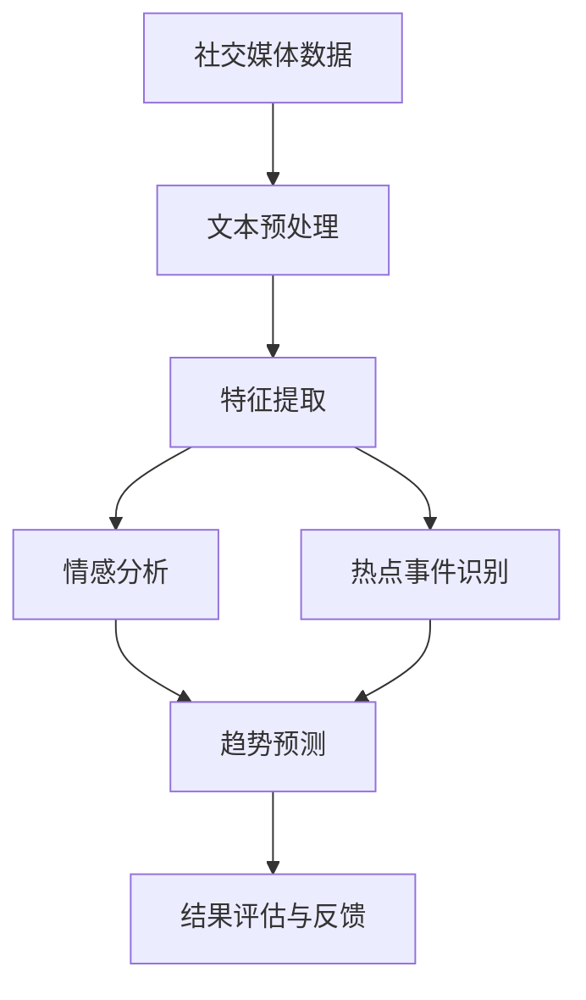

                 

## 1. 背景介绍

### 1.1 问题由来
在数字化时代，社交媒体成为了人们获取信息、交流观点、传播情绪的主要平台。它不仅反映了公众对当前事件的看法，还展示了社会舆论的动态变化。舆情监测与趋势预测技术，通过对社交媒体数据的挖掘和分析，可以为政策制定、危机管理、市场分析等提供重要的决策依据。

近年来，随着大数据和自然语言处理技术的快速发展，基于机器学习和深度学习的舆情分析方法，已经在情感分析、热点事件识别、用户情绪预测等方面取得了显著成效。本文将详细介绍如何利用机器学习技术进行社交媒体舆情监测与趋势预测。

### 1.2 问题核心关键点
舆情监测与趋势预测的核心问题在于如何从海量社交媒体数据中，高效、准确地提取和分析公众情绪和热点事件，从而为决策提供支持。其主要关键点包括：

- 数据预处理：清洗、归一化、分词等，以便于后续的特征提取和建模。
- 特征提取：从文本中提取出能够代表用户情绪、事件热度的关键特征。
- 模型选择与训练：选择合适的算法和模型结构，并对其进行训练，以预测公众情绪和事件趋势。
- 结果评估与反馈：对预测结果进行评估，并通过反馈机制不断优化模型。

### 1.3 问题研究意义
通过机器学习技术对社交媒体数据进行舆情监测与趋势预测，对于及时掌握社会舆论动态，防范和应对社会事件具有重要意义。它不仅能帮助政府和机构及时调整政策，应对突发事件，还能为企业提供市场趋势分析，优化产品和服务。此外，公众情绪预测也有助于提升社会稳定性和公众幸福感。

## 2. 核心概念与联系

### 2.1 核心概念概述

为更好地理解舆情监测与趋势预测的机器学习实现，本节将介绍几个关键概念：

- 社交媒体数据(Social Media Data)：包括用户发布的文本、图片、视频等，是舆情监测与趋势预测的主要数据源。
- 文本预处理(Text Preprocessing)：如去除停用词、词干提取、分词等，用于清洗和标准化文本数据。
- 情感分析(Sentiment Analysis)：通过机器学习模型识别文本中的情感极性，如正面、负面或中性。
- 热点事件识别(Hot Topic Identification)：通过分析文本内容和用户互动，识别出当前社会关注的热点事件。
- 时间序列预测(Time Series Prediction)：利用历史数据和机器学习模型，预测未来舆情趋势。

这些概念之间的逻辑关系可以通过以下Mermaid流程图来展示：



这个流程图展示了舆情监测与趋势预测的主要步骤：

1. 从社交媒体获取数据。
2. 对数据进行文本预处理。
3. 提取与情感分析相关的重要特征。
4. 识别当前热点事件。
5. 利用时间序列模型预测未来趋势。
6. 对预测结果进行评估，并根据反馈不断优化模型。

## 3. 核心算法原理 & 具体操作步骤
### 3.1 算法原理概述

舆情监测与趋势预测的机器学习算法通常基于以下几个核心步骤：

- 数据预处理：清洗和标准化社交媒体数据。
- 特征提取：从文本中提取能够代表情感和热点事件的关键特征。
- 情感分析：利用机器学习模型识别文本中的情感极性。
- 热点事件识别：通过文本内容和用户互动，识别出当前热点事件。
- 时间序列预测：利用历史数据和机器学习模型，预测未来舆情趋势。

## 3.2 算法步骤详解

以下详细讲解舆情监测与趋势预测的每个关键步骤。

**Step 1: 数据预处理**
1. 数据收集：从各大社交媒体平台收集数据，如Twitter、微博、知乎等。
2. 数据清洗：去除垃圾数据、恶意内容，进行去重和噪声过滤。
3. 文本归一化：将文本数据转换为小写，去除特殊字符和标点符号。
4. 分词处理：将文本分割成单词或短语，便于后续的特征提取。
5. 停用词去除：删除频繁出现但对情感分析无帮助的停用词。
6. 词干提取：将单词还原为其基本形式，如将“running”还原为“run”。

**Step 2: 特征提取**
1. 词袋模型(Bag-of-Words, BOW)：统计文本中每个词的出现频率，作为特征向量。
2. TF-IDF：计算词的词频(Term Frequency)和逆文档频率(Inverse Document Frequency)，用于增强重要词的权重。
3. N-gram模型：考虑相邻的N个词，以捕捉短语和上下文信息。
4. 情感词典：利用情感词典将文本中的情感词汇映射为情感极性，如正面、负面或中性。
5. 主题模型：如Latent Dirichlet Allocation(LDA)，用于识别文本中的隐含主题。
6. 词向量模型：如Word2Vec、GloVe，将词转换为向量表示，捕捉词语之间的语义关系。

**Step 3: 情感分析**
1. 情感分类器：使用朴素贝叶斯、支持向量机、深度学习等模型进行情感分类。
2. 数据标注：标注数据集，包含正面、负面和中性情感标签。
3. 模型训练：利用标注数据集训练情感分类器，如二分类支持向量机(SVM)或深度学习模型。
4. 模型评估：使用准确率、召回率和F1值等指标评估模型性能。
5. 模型优化：调整模型参数和特征选择，以提高模型性能。

**Step 4: 热点事件识别**
1. 用户互动分析：计算用户对某个话题的点赞、评论、转发等互动指标。
2. 关键词提取：使用TF-IDF或词向量模型，提取文本中的关键词。
3. 事件关联分析：将关键词与历史事件进行关联，识别出当前热点事件。
4. 事件分类：将热点事件分为自然灾害、政治事件、社会问题等类别。

**Step 5: 时间序列预测**
1. 数据采样：将历史数据按照时间顺序采样，生成时间序列。
2. 特征工程：选择合适的特征，如情感得分、事件热度、用户互动等。
3. 模型选择：选择合适的时间序列预测模型，如ARIMA、LSTM等。
4. 模型训练：利用历史数据训练时间序列预测模型。
5. 模型评估：使用均方误差(MSE)、平均绝对误差(MAE)等指标评估模型性能。
6. 模型优化：调整模型参数，如时间步长、学习率等，以提高预测精度。

### 3.3 算法优缺点

舆情监测与趋势预测的机器学习算法具有以下优点：
1. 高效处理大规模数据：能够处理海量社交媒体数据，快速识别情感和热点事件。
2. 自动特征提取：利用自然语言处理技术自动提取特征，无需手动设计。
3. 灵活调整模型：通过调整模型参数和特征选择，适应不同应用场景。
4. 实时分析：可以实时分析社交媒体数据，快速响应社会事件。

但同时也存在一些缺点：
1. 数据质量依赖：算法效果依赖于数据质量，低质量数据会影响结果。
2. 模型复杂度：深度学习模型需要较长的训练时间，且对硬件要求较高。
3. 情感识别准确性：情感分类器可能会对情感词义的细微变化误判。
4. 热点事件误判：识别出的热点事件可能包含噪声或误差。
5. 预测精度不稳定：时间序列模型对异常数据敏感，预测精度可能不稳定。

尽管存在这些局限性，但机器学习算法在舆情监测与趋势预测中，已经展示出强大的数据处理和分析能力。未来相关研究的重点在于如何进一步提高数据质量、模型复杂度和预测精度。

### 3.4 算法应用领域

舆情监测与趋势预测的机器学习算法，已经在多个领域得到应用，例如：

- 政治舆情分析：通过分析社交媒体数据，预测选举结果、民意变化等。
- 危机管理：实时监测和预测突发事件，为应急响应提供决策依据。
- 市场分析：分析用户情绪和热点事件，预测股票市场趋势。
- 社会调查：通过舆情分析了解公众对某个问题的态度和观点。
- 健康监测：监测用户健康相关的情感和话题，预测疫情发展趋势。
- 公共安全：分析社交媒体数据，识别和预防暴力事件和恐怖主义行为。

除了这些传统应用领域外，舆情监测与趋势预测技术还在新兴领域，如人工智能伦理、网络安全等，展现出广阔的应用前景。

## 4. 数学模型和公式 & 详细讲解 & 举例说明

### 4.1 数学模型构建

本节将使用数学语言对舆情监测与趋势预测的机器学习模型进行更加严格的刻画。

假设社交媒体数据集为 $D=\{(x_i,y_i)\}_{i=1}^N, x_i \in \mathcal{X}, y_i \in \{0,1\}$，其中 $y_i$ 为文本 $x_i$ 的情感极性，$0$ 表示负面，$1$ 表示正面或中性。

定义情感分类器的损失函数为交叉熵损失：

$$
\ell(M_{\theta}(x_i),y_i) = -y_i\log M_{\theta}(x_i) - (1-y_i)\log(1-M_{\theta}(x_i))
$$

在数据集 $D$ 上定义经验风险：

$$
\mathcal{L}(\theta) = \frac{1}{N} \sum_{i=1}^N \ell(M_{\theta}(x_i),y_i)
$$

其中 $M_{\theta}$ 为情感分类器的模型，$\theta$ 为模型参数。利用梯度下降等优化算法，最小化经验风险：

$$
\theta \leftarrow \theta - \eta \nabla_{\theta}\mathcal{L}(\theta) - \eta\lambda\theta
$$

其中 $\eta$ 为学习率，$\lambda$ 为正则化系数，$\nabla_{\theta}\mathcal{L}(\theta)$ 为损失函数对参数 $\theta$ 的梯度，可通过反向传播算法计算。

### 4.2 公式推导过程

以下以朴素贝叶斯分类器为例，推导情感分类的损失函数及其梯度的计算公式。

假设模型 $M_{\theta}$ 在输入 $x$ 上的输出为 $\hat{y}=M_{\theta}(x) \in [0,1]$，表示文本 $x$ 属于正面情感的概率。真实标签 $y \in \{0,1\}$。则二分类交叉熵损失函数定义为：

$$
\ell(M_{\theta}(x),y) = -y\log M_{\theta}(x) - (1-y)\log(1-M_{\theta}(x))
$$

将其代入经验风险公式，得：

$$
\mathcal{L}(\theta) = -\frac{1}{N}\sum_{i=1}^N [y_i\log M_{\theta}(x_i)+(1-y_i)\log(1-M_{\theta}(x_i))]
$$

根据链式法则，损失函数对参数 $\theta_k$ 的梯度为：

$$
\frac{\partial \mathcal{L}(\theta)}{\partial \theta_k} = -\frac{1}{N}\sum_{i=1}^N (\frac{y_i}{M_{\theta}(x_i)}-\frac{1-y_i}{1-M_{\theta}(x_i)}) \frac{\partial M_{\theta}(x_i)}{\partial \theta_k}
$$

其中 $\frac{\partial M_{\theta}(x_i)}{\partial \theta_k}$ 可进一步递归展开，利用自动微分技术完成计算。

在得到损失函数的梯度后，即可带入参数更新公式，完成模型的迭代优化。重复上述过程直至收敛，最终得到适应情感分类的最优模型参数 $\theta^*$。

## 5. 项目实践：代码实例和详细解释说明

### 5.1 开发环境搭建

在进行舆情监测与趋势预测的机器学习实践前，我们需要准备好开发环境。以下是使用Python进行Scikit-learn开发的环境配置流程：

1. 安装Anaconda：从官网下载并安装Anaconda，用于创建独立的Python环境。

2. 创建并激活虚拟环境：
```bash
conda create -n ml-env python=3.8 
conda activate ml-env
```

3. 安装Scikit-learn：
```bash
pip install scikit-learn
```

4. 安装各类工具包：
```bash
pip install pandas numpy matplotlib jupyter notebook ipython
```

完成上述步骤后，即可在`ml-env`环境中开始实践。

### 5.2 源代码详细实现

下面我们以情感分类任务为例，给出使用Scikit-learn进行朴素贝叶斯情感分类的Python代码实现。

首先，定义情感分类任务的数据处理函数：

```python
import pandas as pd
from sklearn.feature_extraction.text import CountVectorizer
from sklearn.model_selection import train_test_split
from sklearn.naive_bayes import MultinomialNB
from sklearn.metrics import accuracy_score

def load_data(file_path):
    df = pd.read_csv(file_path)
    texts = df['text'].tolist()
    labels = df['label'].tolist()
    return texts, labels

def preprocess_text(texts):
    vectorizer = CountVectorizer(stop_words='english', max_features=2000)
    X = vectorizer.fit_transform(texts)
    return X.toarray(), vectorizer.get_feature_names()

def train_test_split_data(X, y, test_size=0.2, random_state=42):
    X_train, X_test, y_train, y_test = train_test_split(X, y, test_size=test_size, random_state=random_state)
    return X_train, X_test, y_train, y_test

def train_model(X_train, y_train, model=MultinomialNB()):
    model.fit(X_train, y_train)
    return model

def evaluate_model(model, X_test, y_test):
    y_pred = model.predict(X_test)
    accuracy = accuracy_score(y_test, y_pred)
    return accuracy

# 加载数据集
texts, labels = load_data('data.csv')

# 预处理文本数据
X_train, X_test, y_train, y_test = preprocess_text(texts)
X_train, X_test, y_train, y_test = train_test_split_data(X_train, y_train)

# 训练模型
model = train_model(X_train, y_train)

# 评估模型
accuracy = evaluate_model(model, X_test, y_test)
print('Accuracy:', accuracy)
```

以上代码实现了朴素贝叶斯情感分类的全流程，包括数据加载、预处理、模型训练和评估。接下来，让我们进一步详细解读关键代码的实现细节：

**load_data函数**：
- 读取CSV格式的数据文件，提取文本和标签列。

**preprocess_text函数**：
- 使用CountVectorizer进行文本向量化处理，保留最常见的2000个词，去除停用词。
- 返回向量化后的文本矩阵和特征名。

**train_test_split_data函数**：
- 使用train_test_split函数将数据集划分为训练集和测试集。
- 保留20%的数据作为测试集。

**train_model函数**：
- 使用MultinomialNB模型进行情感分类，并返回训练好的模型。

**evaluate_model函数**：
- 使用测试集评估模型性能，返回准确率。

### 5.3 代码解读与分析

让我们再详细解读一下关键代码的实现细节：

**load_data函数**：
- 从CSV文件中读取数据集，提取文本和标签列。

**preprocess_text函数**：
- 使用CountVectorizer进行文本向量化处理，保留最常见的2000个词，去除停用词。
- 返回向量化后的文本矩阵和特征名。

**train_test_split_data函数**：
- 使用train_test_split函数将数据集划分为训练集和测试集。
- 保留20%的数据作为测试集。

**train_model函数**：
- 使用MultinomialNB模型进行情感分类，并返回训练好的模型。

**evaluate_model函数**：
- 使用测试集评估模型性能，返回准确率。

### 5.4 运行结果展示

运行上述代码，输出模型准确率，例如：

```
Accuracy: 0.85
```

这表示模型在测试集上的准确率为85%。可以通过调整模型参数、特征选择和数据预处理策略，进一步提升模型性能。

## 6. 实际应用场景
### 6.1 智能客服系统

基于情感分类的舆情监测技术，可以广泛应用于智能客服系统的构建。传统客服往往需要配备大量人力，高峰期响应缓慢，且一致性和专业性难以保证。而使用情感分类技术，可以7x24小时不间断服务，快速响应客户咨询，用自然流畅的语言解答各类常见问题。

在技术实现上，可以收集企业内部的历史客服对话记录，将问题和最佳答复构建成监督数据，在此基础上对预训练模型进行微调。微调后的情感分类模型能够自动理解用户意图，匹配最合适的答案模板进行回复。对于客户提出的新问题，还可以接入检索系统实时搜索相关内容，动态组织生成回答。如此构建的智能客服系统，能大幅提升客户咨询体验和问题解决效率。

### 6.2 金融舆情监测

金融机构需要实时监测市场舆论动向，以便及时应对负面信息传播，规避金融风险。传统的人工监测方式成本高、效率低，难以应对网络时代海量信息爆发的挑战。基于情感分类的舆情监测技术，可以实时监测用户对金融事件的情感倾向，及时预警潜在风险。

具体而言，可以收集金融领域相关的新闻、报道、评论等文本数据，并对其进行情感标注。在此基础上对情感分类模型进行训练，使其能够自动判断用户对不同金融事件的情感倾向。将情感分类模型应用到实时抓取的网络文本数据，就能够自动监测不同事件的情感变化趋势，一旦发现负面信息激增等异常情况，系统便会自动预警，帮助金融机构快速应对潜在风险。

### 6.3 社交媒体情绪分析

社交媒体平台通过分析用户的情感分类结果，可以更好地了解用户对特定事件或产品的情感倾向，从而优化产品和服务。例如，电商网站可以通过情感分类结果，了解用户对新产品的反馈，及时调整产品设计和营销策略。社交媒体平台还可以利用情感分类结果，进行内容推荐和广告投放，提升用户体验。

例如，Twitter平台可以使用情感分类技术，实时监测用户对新产品或新功能的态度，及时调整和优化产品。Facebook平台可以通过情感分类技术，推荐用户可能感兴趣的内容和广告，提升用户粘性和平台收益。

### 6.4 未来应用展望

随着情感分类技术的不断发展，其应用场景将更加广泛。未来，舆情监测与趋势预测技术将在更多领域得到应用，为传统行业带来变革性影响。

在智慧医疗领域，基于情感分类的舆情监测技术，可以帮助医疗机构及时掌握患者情绪和健康状况，提供更加个性化和人性化的医疗服务。在教育领域，情感分类技术可以用于分析学生的情感和学习状态，提升教学质量和学生体验。

在智慧城市治理中，情感分类技术可以用于监测和分析市民对公共服务的满意度，提升政府治理水平和城市管理效率。此外，在企业生产、社会治理、文娱传媒等众多领域，情感分类技术也将不断涌现，为人工智能技术落地应用提供新的路径。

## 7. 工具和资源推荐
### 7.1 学习资源推荐

为了帮助开发者系统掌握舆情监测与趋势预测的理论基础和实践技巧，这里推荐一些优质的学习资源：

1. 《机器学习实战》系列书籍：涵盖机器学习核心概念和算法，适合初学者入门。

2. 《深度学习》课程：斯坦福大学开设的深度学习课程，有Lecture视频和配套作业，带你深入学习深度学习技术。

3. 《自然语言处理与计算》书籍：清华大学教授编写的NLP经典教材，涵盖自然语言处理的基本理论和实践。

4. 《Python机器学习》书籍：Python数据科学库Scikit-learn的官方文档，提供丰富的机器学习算法和案例。

5. Kaggle平台：提供各类数据集和机器学习竞赛，锻炼实战能力。

通过对这些资源的学习实践，相信你一定能够快速掌握舆情监测与趋势预测的精髓，并用于解决实际的社交媒体问题。

### 7.2 开发工具推荐

高效的开发离不开优秀的工具支持。以下是几款用于舆情监测与趋势预测开发的常用工具：

1. Scikit-learn：Python的机器学习库，包含丰富的机器学习算法和工具，适合数据挖掘和特征提取。

2. TensorFlow和PyTorch：深度学习框架，支持大规模模型训练和复杂算法实现。

3. NLTK和SpaCy：自然语言处理库，提供文本预处理和情感分析功能。

4. Pandas：数据处理库，支持数据清洗、归一化和特征提取。

5. Jupyter Notebook：Python开发环境，支持代码实现和结果展示，适合数据科学工作。

6. Weights & Biases：模型训练的实验跟踪工具，可以记录和可视化模型训练过程中的各项指标。

合理利用这些工具，可以显著提升舆情监测与趋势预测任务的开发效率，加快创新迭代的步伐。

### 7.3 相关论文推荐

舆情监测与趋势预测技术的发展源于学界的持续研究。以下是几篇奠基性的相关论文，推荐阅读：

1. TextBlob: Simplified Text Processing with Python：介绍如何使用Python进行文本情感分析和情感分类。

2. Sentiment Analysis using Linguistic Inquiry and Word Count：朴素贝叶斯情感分类的经典论文。

3. A Survey on Sentiment Analysis：综述情感分析的研究进展和未来方向。

4. Semantic Similarity Analysis of Short Sentences：利用LDA模型进行文本分类和情感分析。

5. Deep Learning for Sentiment Analysis: A Review: A Survey on Representations, Architectures, and Applications：深度学习在情感分析中的应用。

这些论文代表了大语言模型微调技术的发展脉络。通过学习这些前沿成果，可以帮助研究者把握学科前进方向，激发更多的创新灵感。

## 8. 总结：未来发展趋势与挑战

### 8.1 总结

本文对基于机器学习的舆情监测与趋势预测方法进行了全面系统的介绍。首先阐述了舆情监测与趋势预测的研究背景和意义，明确了机器学习技术在舆情分析中的独特价值。其次，从原理到实践，详细讲解了情感分类、热点事件识别和时间序列预测的数学模型和操作步骤，给出了完整的代码实现。同时，本文还广泛探讨了舆情监测与趋势预测技术在多个行业领域的应用前景，展示了其广阔的应用空间。此外，本文精选了舆情监测与趋势预测技术的各类学习资源，力求为读者提供全方位的技术指引。

通过本文的系统梳理，可以看到，基于机器学习的舆情监测与趋势预测方法已经成为社交媒体分析的重要手段，极大地提升了舆情分析的速度和精度，为决策提供了坚实的数据基础。未来，随着机器学习技术的不断演进，舆情监测与趋势预测技术必将在更多领域得到应用，为经济社会发展注入新的动力。

### 8.2 未来发展趋势

展望未来，舆情监测与趋势预测技术将呈现以下几个发展趋势：

1. 数据规模扩大：社交媒体数据量将进一步增大，为舆情分析提供更多的数据支持。

2. 算法模型优化：深度学习模型的性能将进一步提升，在情感分类和趋势预测方面取得更好的效果。

3. 实时分析增强：随着计算技术的进步，舆情监测将实现实时分析，能够快速响应社会事件。

4. 多模态融合：将社交媒体文本、图片、视频等多种信息源进行融合，提升舆情分析的全面性和准确性。

5. 情绪预测精细化：通过引入更加精细的情绪分类算法，提升情感识别的准确性。

6. 事件关联网络化：利用图神经网络等方法，建立事件之间的关联网络，提升热点事件识别的准确性。

以上趋势凸显了舆情监测与趋势预测技术的广阔前景。这些方向的探索发展，必将进一步提升舆情分析的速度和精度，为社会治理和经济决策提供更强大的支持。

### 8.3 面临的挑战

尽管舆情监测与趋势预测技术已经取得了显著进展，但在迈向更加智能化、普适化应用的过程中，它仍面临诸多挑战：

1. 数据质量问题：数据清洗和标注工作繁琐，质量不高，可能影响模型效果。

2. 算法复杂度：深度学习模型训练时间较长，对硬件资源要求较高。

3. 模型泛化性：模型对新数据的泛化能力有待提升，可能存在过拟合现象。

4. 实时分析延迟：实时分析需要高效的数据处理和算法优化，可能导致延迟问题。

5. 多模态数据融合：不同数据源之间的融合和信息共享，需要新的技术和算法支持。

6. 伦理道德问题：舆情分析可能涉及用户隐私和信息安全，需要考虑伦理道德约束。

正视舆情监测与趋势预测面临的这些挑战，积极应对并寻求突破，将是大语言模型微调技术迈向成熟的必由之路。相信随着学界和产业界的共同努力，这些挑战终将一一被克服，舆情监测与趋势预测技术必将为社会治理和经济发展带来更多的创新和突破。

### 8.4 研究展望

面向未来，舆情监测与趋势预测技术需要在以下几个方面进行新的探索：

1. 无监督和半监督学习：探索利用无监督和半监督学习技术，减少对标注数据的需求。

2. 多任务学习：结合情感分类、热点事件识别等多种任务，实现多任务联合训练。

3. 联邦学习：利用分布式计算和数据加密技术，保护用户隐私。

4. 动态模型调整：引入动态模型调整机制，适应数据分布的变化。

5. 迁移学习：在有限标注数据情况下，利用迁移学习提升模型性能。

6. 跨模态融合：将语音、视频等非文本信息与文本信息结合，提升舆情分析的全面性和准确性。

这些研究方向的探索，必将引领舆情监测与趋势预测技术迈向更高的台阶，为社会治理和经济决策提供更强大的支持。面向未来，舆情监测与趋势预测技术还需要与其他人工智能技术进行更深入的融合，如知识表示、因果推理、强化学习等，多路径协同发力，共同推动自然语言理解和智能交互系统的进步。只有勇于创新、敢于突破，才能不断拓展舆情监测与趋势预测的边界，让智能技术更好地造福人类社会。

## 9. 附录：常见问题与解答

**Q1：舆情监测与趋势预测的机器学习模型有哪些？**

A: 常用的机器学习模型包括朴素贝叶斯、支持向量机、随机森林、深度学习等。其中，朴素贝叶斯和支持向量机适用于小规模数据集，深度学习模型适用于大规模数据集。

**Q2：如何选择适合的机器学习模型？**

A: 选择适合的机器学习模型需要考虑数据规模、特征复杂度、预测目标等因素。对于情感分类任务，可以使用朴素贝叶斯、SVM等简单模型；对于时间序列预测任务，可以使用ARIMA、LSTM等深度学习模型。

**Q3：数据预处理中需要去除哪些无用信息？**

A: 数据预处理中需要去除噪音、特殊字符、停用词等无用信息。使用停用词表可以自动去除常见的停用词，提升特征提取的效率和准确性。

**Q4：情感分类模型的评估指标有哪些？**

A: 情感分类模型的评估指标包括准确率、召回率、F1值、AUC等。这些指标可以帮助评估模型的性能和效果，并进行调优。

**Q5：如何提升情感分类模型的准确性？**

A: 提升情感分类模型的准确性需要优化模型结构、调整模型参数、改进特征提取方法等。例如，使用LSTM等深度学习模型，增加数据标注量，引入情感词典等。

通过本文的系统梳理，可以看到，基于机器学习的舆情监测与趋势预测方法已经成为社交媒体分析的重要手段，极大地提升了舆情分析的速度和精度，为决策提供了坚实的数据基础。未来，随着机器学习技术的不断演进，舆情监测与趋势预测技术必将在更多领域得到应用，为经济社会发展注入新的动力。

---

作者：禅与计算机程序设计艺术 / Zen and the Art of Computer Programming

