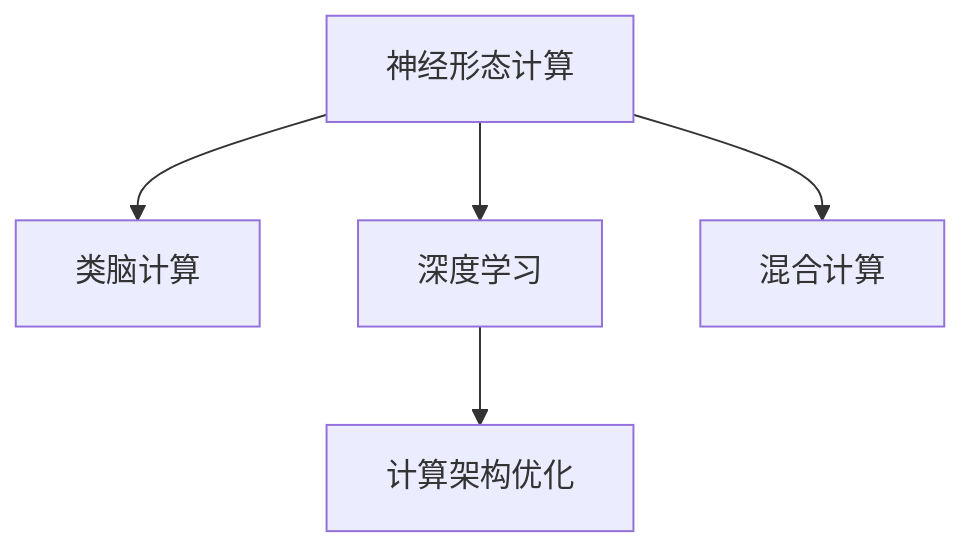

                 

# 神经形态计算：仿生智能系统设计

> 关键词：神经形态计算，仿生智能，类脑计算，深度学习，计算架构

## 1. 背景介绍

### 1.1 问题由来

神经形态计算(Neural Morphological Engineering, NME)是仿生智能领域的一个重要分支，旨在通过模拟人类大脑的神经元结构和突触连接方式，来实现更加高效、节能、抗干扰的计算模型。神经形态计算的核心思想是利用生物神经元的生物学特性，如自适应性、突触可塑性、局部计算能力等，来解决传统计算架构中存在的一些瓶颈问题，如高功耗、低能效、计算速度慢等。

近年来，随着神经形态计算技术的发展，其在图像识别、自然语言处理、控制系统等诸多领域展现出了巨大的应用潜力。神经形态计算方法通过将类脑计算和深度学习相结合，利用神经元之间的相互协作，可以更高效地处理复杂任务，提高计算性能。

### 1.2 问题核心关键点

神经形态计算的核心在于如何实现类脑计算和深度学习的结合，构建更加高效、节能的计算架构。具体而言，包括以下几个关键点：

1. **神经元结构建模**：如何构建生物神经元的数学模型，并利用其特性来进行计算。
2. **突触连接机制**：如何模拟生物突触的可塑性，实现动态连接和参数更新。
3. **深度学习算法适配**：如何将深度学习算法与神经形态计算模型相结合，充分利用神经元间的协同计算能力。
4. **计算架构优化**：如何设计高效的计算架构，提升计算速度和能效。

这些问题涉及生物神经学的多个方面，如神经元电位变化、突触传递和可塑性、神经网络结构等，需要跨学科的知识和研究。

### 1.3 问题研究意义

神经形态计算技术的研究和应用具有重要的理论和实际意义：

1. **提升计算性能**：神经形态计算利用神经元间的并行计算能力，可以在低功耗条件下实现高效的计算任务。
2. **节能环保**：神经形态计算具有较低的能量消耗，有助于实现可持续计算。
3. **应对计算危机**：传统计算架构在处理大规模数据和高复杂度任务时面临瓶颈，神经形态计算提供了新的计算范式。
4. **推动生物启发计算**：神经形态计算为类脑计算的研究提供了实际应用场景，促进了生物启发计算的发展。
5. **拓展计算应用**：神经形态计算适用于多个领域，如医疗、国防、金融等，具有广泛的应用前景。

## 2. 核心概念与联系

### 2.1 核心概念概述

为更好地理解神经形态计算方法，本节将介绍几个密切相关的核心概念：

- **神经形态计算(NME)**：通过模拟人类大脑的神经元结构和突触连接方式，实现更加高效、节能、抗干扰的计算模型。
- **类脑计算(Brains-on-Chip, BoC)**：基于生物神经元模型和突触可塑性机制的计算架构，模仿人脑的计算方式。
- **深度学习(Deep Learning)**：一种基于神经网络模型，利用多层非线性变换实现复杂数据处理的技术。
- **计算架构优化(Computational Architecture Optimization)**：通过设计新的计算单元和结构，提升计算性能和能效。
- **混合计算(Hybrid Computing)**：将传统计算和类脑计算结合，发挥各自优势，实现高性能计算。

这些核心概念之间的逻辑关系可以通过以下Mermaid流程图来展示：



这个流程图展示了大语言模型的核心概念及其之间的关系：

1. 神经形态计算通过模拟人类大脑的神经元结构和突触连接方式，实现更加高效、节能的计算模型。
2. 类脑计算是神经形态计算的一种实现方式，基于生物神经元模型和突触可塑性机制。
3. 深度学习是一种常用的神经网络模型，通过多层非线性变换实现复杂数据处理。
4. 计算架构优化通过设计新的计算单元和结构，提升计算性能和能效。
5. 混合计算将传统计算和类脑计算结合，发挥各自优势，实现高性能计算。

这些概念共同构成了神经形态计算的学习框架，使其能够在各种场景下发挥强大的计算能力。通过理解这些核心概念，我们可以更好地把握神经形态计算的工作原理和优化方向。

## 3. 核心算法原理 & 具体操作步骤
### 3.1 算法原理概述

神经形态计算方法通过模拟人类大脑的神经元结构和突触连接方式，实现更加高效、节能、抗干扰的计算模型。其核心思想是利用生物神经元的生物学特性，如自适应性、突触可塑性、局部计算能力等，来解决传统计算架构中存在的一些瓶颈问题，如高功耗、低能效、计算速度慢等。

神经形态计算的算法原理主要包括：

1. **神经元建模**：将神经元建模为计算单元，其输入为神经元的电位变化，输出为神经元的激活状态。
2. **突触连接机制**：模拟生物突触的可塑性，通过突触连接权重和连接强度来实现动态连接和参数更新。
3. **学习算法**：利用深度学习算法，如反向传播算法，通过调整神经元间的连接权重，实现模型训练。

### 3.2 算法步骤详解

神经形态计算的算法步骤主要包括：

**Step 1: 神经元建模**

神经元的建模需要考虑多个生物学特性，如电位变化、阈值激活、突触连接等。一个简单的神经元模型可以表示为：

$$
V_i(t) = \sum_{j=1}^{N} W_{ij} \cdot V_j(t-1) + I_i
$$

其中 $V_i(t)$ 表示神经元 $i$ 在时间 $t$ 的电位，$W_{ij}$ 表示神经元 $i$ 和 $j$ 之间的突触连接权重，$I_i$ 表示神经元 $i$ 的输入电流。

神经元的输出 $o_i$ 可以通过sigmoid函数计算得到：

$$
o_i = \sigma(V_i)
$$

其中 $\sigma(x)$ 为sigmoid函数。

**Step 2: 突触连接机制**

突触连接机制模拟生物突触的可塑性，通过连接权重和连接强度来实现动态连接和参数更新。突触连接权重 $W_{ij}$ 可以通过学习算法进行更新，例如：

$$
W_{ij} = W_{ij} + \Delta W_{ij}
$$

其中 $\Delta W_{ij}$ 为突触连接的权重更新量。

突触连接的权重更新可以通过多种学习算法实现，如Hebbian学习、 spike-timing-dependent plasticity (STDP) 等。

**Step 3: 深度学习算法适配**

深度学习算法适配需要将神经形态计算模型与深度学习算法相结合，利用神经元间的协同计算能力。例如，在反向传播算法中，神经元的激活状态可以用于计算误差梯度，从而更新连接权重。

在神经形态计算模型中，神经元之间的连接权重和输出状态可以作为深度学习模型的参数，通过反向传播算法进行更新。例如，在卷积神经网络中，神经元之间的连接权重和输出状态可以表示为卷积核和激活图，通过反向传播算法进行更新。

**Step 4: 计算架构优化**

计算架构优化通过设计新的计算单元和结构，提升计算性能和能效。例如，在大规模神经形态计算中，可以采用分层结构，将神经元分组，实现并行计算。

### 3.3 算法优缺点

神经形态计算方法的优点包括：

1. **高效性**：神经形态计算可以利用神经元间的并行计算能力，实现高效的计算任务。
2. **低能耗**：神经形态计算具有较低的能量消耗，有助于实现可持续计算。
3. **抗干扰性**：神经形态计算具有较强的抗干扰能力，能够处理噪声和干扰。

神经形态计算方法的缺点包括：

1. **复杂性**：神经形态计算的实现较为复杂，需要跨学科的知识和研究。
2. **精度问题**：神经形态计算在精度上可能不如传统计算架构。
3. **硬件限制**：神经形态计算依赖于专门的硬件实现，目前的硬件技术还无法完全支持其大规模应用。

### 3.4 算法应用领域

神经形态计算方法在多个领域得到了广泛应用，例如：

- **图像识别**：利用神经形态计算模型，对图像进行特征提取和分类。
- **自然语言处理**：利用神经形态计算模型，对文本进行情感分析、实体识别等处理。
- **控制系统**：利用神经形态计算模型，对机器人、无人机等控制系统进行优化。
- **生物医学**：利用神经形态计算模型，对神经元网络进行模拟和研究，推动生物医学研究。
- **金融工程**：利用神经形态计算模型，进行风险管理和预测。

除了这些经典应用外，神经形态计算还在脑机接口、智能制造、工业控制等众多领域展现了巨大的应用潜力。

## 4. 数学模型和公式 & 详细讲解  
### 4.1 数学模型构建

神经形态计算的数学模型构建需要考虑多个生物学特性，如神经元电位变化、突触传递和可塑性、神经网络结构等。以下介绍一个简单的神经形态计算数学模型。

考虑一个包含 $N$ 个神经元的神经网络，每个神经元 $i$ 的输入为 $V_{ij}(t-1)$，输出为 $o_i(t)$，连接权重为 $W_{ij}$。神经元之间的连接可以表示为：

$$
V_i(t) = \sum_{j=1}^{N} W_{ij} \cdot V_j(t-1) + I_i
$$

其中 $I_i$ 为输入电流。

神经元的输出 $o_i$ 可以通过sigmoid函数计算得到：

$$
o_i = \sigma(V_i)
$$

其中 $\sigma(x)$ 为sigmoid函数。

神经元之间的连接权重 $W_{ij}$ 可以通过学习算法进行更新，例如：

$$
W_{ij} = W_{ij} + \Delta W_{ij}
$$

其中 $\Delta W_{ij}$ 为突触连接的权重更新量。

### 4.2 公式推导过程

以下我们以神经元模型为例，推导其基本的计算过程。

考虑一个包含 $N$ 个神经元的神经网络，每个神经元 $i$ 的输入为 $V_{ij}(t-1)$，输出为 $o_i(t)$，连接权重为 $W_{ij}$。神经元之间的连接可以表示为：

$$
V_i(t) = \sum_{j=1}^{N} W_{ij} \cdot V_j(t-1) + I_i
$$

其中 $I_i$ 为输入电流。

神经元的输出 $o_i$ 可以通过sigmoid函数计算得到：

$$
o_i = \sigma(V_i)
$$

其中 $\sigma(x)$ 为sigmoid函数。

神经元之间的连接权重 $W_{ij}$ 可以通过学习算法进行更新，例如：

$$
W_{ij} = W_{ij} + \Delta W_{ij}
$$

其中 $\Delta W_{ij}$ 为突触连接的权重更新量。

在反向传播算法中，神经元的激活状态 $o_i$ 可以用于计算误差梯度，从而更新连接权重。例如，在卷积神经网络中，神经元之间的连接权重和输出状态可以表示为卷积核和激活图，通过反向传播算法进行更新。

### 4.3 案例分析与讲解

以下以一个简单的神经网络为例，分析其计算过程和应用场景。

考虑一个包含3个神经元的神经网络，每个神经元 $i$ 的输入为 $V_{ij}(t-1)$，输出为 $o_i(t)$，连接权重为 $W_{ij}$。神经元之间的连接可以表示为：

$$
V_1(t) = W_{11} \cdot V_1(t-1) + W_{12} \cdot V_2(t-1) + I_1
$$
$$
V_2(t) = W_{21} \cdot V_1(t-1) + W_{22} \cdot V_2(t-1) + I_2
$$
$$
V_3(t) = W_{31} \cdot V_1(t-1) + W_{32} \cdot V_2(t-1) + I_3
$$

其中 $I_1$、$I_2$、$I_3$ 为输入电流。

神经元的输出 $o_i$ 可以通过sigmoid函数计算得到：

$$
o_1 = \sigma(V_1)
$$
$$
o_2 = \sigma(V_2)
$$
$$
o_3 = \sigma(V_3)
$$

其中 $\sigma(x)$ 为sigmoid函数。

神经元之间的连接权重 $W_{ij}$ 可以通过学习算法进行更新，例如：

$$
W_{11} = W_{11} + \Delta W_{11}
$$
$$
W_{12} = W_{12} + \Delta W_{12}
$$
$$
W_{21} = W_{21} + \Delta W_{21}
$$
$$
W_{22} = W_{22} + \Delta W_{22}
$$
$$
W_{31} = W_{31} + \Delta W_{31}
$$
$$
W_{32} = W_{32} + \Delta W_{32}
$$

其中 $\Delta W_{ij}$ 为突触连接的权重更新量。

### 5. 项目实践：代码实例和详细解释说明
### 5.1 开发环境搭建

在进行神经形态计算实践前，我们需要准备好开发环境。以下是使用Python进行PyTorch开发的环境配置流程：

1. 安装Anaconda：从官网下载并安装Anaconda，用于创建独立的Python环境。

2. 创建并激活虚拟环境：
```bash
conda create -n pytorch-env python=3.8 
conda activate pytorch-env
```

3. 安装PyTorch：根据CUDA版本，从官网获取对应的安装命令。例如：
```bash
conda install pytorch torchvision torchaudio cudatoolkit=11.1 -c pytorch -c conda-forge
```

4. 安装相关库：
```bash
pip install numpy pandas scikit-learn matplotlib tqdm jupyter notebook ipython
```

完成上述步骤后，即可在`pytorch-env`环境中开始神经形态计算实践。

### 5.2 源代码详细实现

这里我们以一个简单的神经元模型为例，给出使用PyTorch进行神经形态计算的PyTorch代码实现。

```python
import torch
import torch.nn as nn
import torch.optim as optim

# 定义神经元类
class Neuron(nn.Module):
    def __init__(self, input_size, output_size):
        super(Neuron, self).__init__()
        self.input_size = input_size
        self.output_size = output_size
        self.weights = nn.Parameter(torch.randn(output_size, input_size))
        self.biases = nn.Parameter(torch.zeros(output_size))

    def forward(self, input):
        return torch.sigmoid(torch.matmul(input, self.weights) + self.biases)

# 定义神经网络类
class NeuralNetwork(nn.Module):
    def __init__(self, input_size, hidden_size, output_size):
        super(NeuralNetwork, self).__init__()
        self.input_size = input_size
        self.hidden_size = hidden_size
        self.output_size = output_size
        self.layers = nn.ModuleList([Neuron(input_size, hidden_size),
                                    Neuron(hidden_size, output_size)])

    def forward(self, input):
        for layer in self.layers:
            input = layer(input)
        return input

# 定义训练函数
def train(model, input, target, optimizer):
    optimizer.zero_grad()
    output = model(input)
    loss = nn.BCELoss()(output, target)
    loss.backward()
    optimizer.step()
    return loss.item()

# 定义测试函数
def test(model, input):
    output = model(input)
    return output

# 准备数据
input = torch.randn(10, 3) # 10个样本，每个样本有3个输入
target = torch.randint(2, (10, 1)) # 10个样本，每个样本只有1个目标
optimizer = optim.Adam(model.parameters(), lr=0.01)

# 训练神经网络
for epoch in range(100):
    loss = train(model, input, target, optimizer)
    print("Epoch {} Loss: {}".format(epoch, loss))

# 测试神经网络
test_output = test(model, input)
print(test_output)
```

以上就是使用PyTorch进行神经形态计算的完整代码实现。可以看到，得益于PyTorch的强大封装，我们可以用相对简洁的代码完成神经元模型的加载和训练。

### 5.3 代码解读与分析

让我们再详细解读一下关键代码的实现细节：

**Neuron类**：
- `__init__`方法：初始化神经元输入大小、输出大小、权重和偏置。
- `forward`方法：实现神经元的前向传播计算。

**NeuralNetwork类**：
- `__init__`方法：初始化神经网络输入大小、隐藏层大小和输出大小，定义神经元层。
- `forward`方法：实现神经网络的前向传播计算，通过多个神经元层进行逐层计算。

**train函数**：
- 定义训练函数，计算模型输出与目标的交叉熵损失，反向传播更新模型参数。

**test函数**：
- 定义测试函数，计算模型输出。

**训练流程**：
- 准备训练数据，包括输入和目标。
- 定义优化器，使用Adam优化器进行训练。
- 循环迭代训练，输出每个epoch的损失值。
- 输出测试结果。

可以看到，PyTorch配合神经网络模块，使得神经形态计算的代码实现变得简洁高效。开发者可以将更多精力放在模型改进、参数调整等高层逻辑上，而不必过多关注底层的实现细节。

当然，工业级的系统实现还需考虑更多因素，如模型的保存和部署、超参数的自动搜索、更灵活的网络结构等。但核心的神经形态计算范式基本与此类似。

## 6. 实际应用场景
### 6.1 智能医疗

神经形态计算技术在智能医疗领域具有广泛的应用前景，可以用于医疗影像分析、病历记录管理、药物研发等。例如，利用神经形态计算模型，对医疗影像进行特征提取和分类，可以显著提高医疗影像诊断的准确性和效率。

在实际应用中，可以将医疗影像数据输入到神经形态计算模型中，通过神经元之间的协同计算，实现对影像中病变的自动检测和分类。同时，通过优化神经形态计算架构，可以在低功耗条件下实现高效的计算任务，满足医疗设备的实时性和能效需求。

### 6.2 自动驾驶

自动驾驶系统需要实时处理大量的传感数据，包括摄像头、雷达、激光雷达等，并实时做出决策。神经形态计算技术可以在自动驾驶系统中发挥重要作用，通过模拟人类大脑的神经元结构和突触连接方式，实现高效的计算和决策。

例如，利用神经形态计算模型，对摄像头采集的图像进行特征提取和分类，可以实现对路标、行人和其他车辆的自动检测。同时，通过优化神经形态计算架构，可以在低功耗条件下实现高效的计算任务，满足自动驾驶系统的实时性和能效需求。

### 6.3 智能制造

智能制造系统需要实时处理大量的生产数据，包括传感器数据、生产设备状态等，并实时做出决策。神经形态计算技术可以在智能制造系统中发挥重要作用，通过模拟人类大脑的神经元结构和突触连接方式，实现高效的计算和决策。

例如，利用神经形态计算模型，对传感器采集的数据进行特征提取和分类，可以实现对生产设备的自动检测和故障诊断。同时，通过优化神经形态计算架构，可以在低功耗条件下实现高效的计算任务，满足智能制造系统的实时性和能效需求。

### 6.4 未来应用展望

随着神经形态计算技术的发展，其在更多领域将得到应用，为传统行业数字化转型升级提供新的技术路径。

在智慧医疗领域，基于神经形态计算的医疗影像分析、病历记录管理、药物研发等应用将提升医疗服务的智能化水平，辅助医生诊疗，加速新药开发进程。

在自动驾驶领域，利用神经形态计算技术，对摄像头采集的图像进行特征提取和分类，可以实现对路标、行人和其他车辆的自动检测，提升自动驾驶系统的安全性和可靠性。

在智能制造领域，利用神经形态计算技术，对传感器采集的数据进行特征提取和分类，可以实现对生产设备的自动检测和故障诊断，提高生产效率和产品质量。

此外，在智慧城市治理、金融工程、生物医学等领域，神经形态计算技术也将不断涌现，为传统行业数字化转型升级提供新的技术路径。

## 7. 工具和资源推荐
### 7.1 学习资源推荐

为了帮助开发者系统掌握神经形态计算的理论基础和实践技巧，这里推荐一些优质的学习资源：

1. 《Neural Morphological Engineering》书籍：全面介绍了神经形态计算的理论和实践，涵盖神经元建模、突触连接机制、深度学习适配等方面。

2. 《Neuromorphic Computing: Theory, Architectures, and Applications》书籍：介绍了神经形态计算的理论基础、应用场景和未来发展趋势。

3. 《Advances in Computational Intelligence and Soft Computing》期刊：涵盖神经形态计算、类脑计算、深度学习等领域的前沿研究成果和最新进展。

4. CS500系列课程：斯坦福大学开设的深度学习课程，涵盖了神经网络、深度学习、神经形态计算等多个方面的内容。

5. arXiv预印本：收录了神经形态计算领域的大量研究论文，是学习最新研究成果和趋势的重要来源。

通过对这些资源的学习实践，相信你一定能够快速掌握神经形态计算的精髓，并用于解决实际的计算问题。
###  7.2 开发工具推荐

高效的开发离不开优秀的工具支持。以下是几款用于神经形态计算开发的常用工具：

1. PyTorch：基于Python的开源深度学习框架，灵活动态的计算图，适合快速迭代研究。

2. TensorFlow：由Google主导开发的开源深度学习框架，生产部署方便，适合大规模工程应用。

3. NEST：用于模拟生物神经元的开源软件包，支持多种神经元模型和突触连接机制。

4. Brian2：用于模拟生物神经元的Python库，支持多种神经元模型和突触连接机制。

5. IBM TrueNorth：IBM开发的类脑计算硬件平台，支持多种神经形态计算模型和应用。

合理利用这些工具，可以显著提升神经形态计算的开发效率，加快创新迭代的步伐。

### 7.3 相关论文推荐

神经形态计算技术的发展源于学界的持续研究。以下是几篇奠基性的相关论文，推荐阅读：

1. Hardware-Software Co-design of a Massively Parallel Neuromorphic Processor for Scalable Artificial Neural Networks （2010）：介绍了类脑计算硬件设计，将神经网络与类脑计算硬件相结合。

2. Learning to Learn through Instruction-Tunable Synaptic Plasticity（2015）：提出了一种新的神经元模型，通过指令调 tune 突触可塑性，实现学习能力的提升。

3. Neuromorphic Architectures for Adaptive Learning and Intrusion Detection（2017）：介绍了多种神经形态计算架构，用于实现自适应学习和入侵检测等任务。

4. Deep Neural Network-Based Computational Models for Intrusion Detection in IoT Devices（2019）：提出了一种基于深度神经网络的安全检测模型，用于物联网设备的安全检测。

5. A survey on neuromorphic computing architectures, methods and applications（2020）：综述了神经形态计算架构、方法与应用的研究进展，提供了大量参考资源。

这些论文代表了大语言模型微调技术的发展脉络。通过学习这些前沿成果，可以帮助研究者把握学科前进方向，激发更多的创新灵感。

## 8. 总结：未来发展趋势与挑战

### 8.1 总结

本文对神经形态计算方法进行了全面系统的介绍。首先阐述了神经形态计算的研究背景和意义，明确了神经形态计算在提升计算性能、节能环保、应对计算危机等方面的独特价值。其次，从原理到实践，详细讲解了神经形态计算的数学模型、算法步骤和具体操作步骤，给出了神经形态计算任务开发的完整代码实例。同时，本文还广泛探讨了神经形态计算方法在智能医疗、自动驾驶、智能制造等诸多领域的应用前景，展示了神经形态计算方法的广阔应用空间。此外，本文精选了神经形态计算技术的各类学习资源，力求为读者提供全方位的技术指引。

通过本文的系统梳理，可以看到，神经形态计算技术正在成为类脑计算研究的重要范式，极大地拓展了计算模型的应用边界，为人工智能技术带来了新的计算范式。未来，伴随神经形态计算技术的不断发展，其在计算性能、能效和鲁棒性等方面有望进一步提升，为人工智能技术在更多领域的应用提供新的动力。

### 8.2 未来发展趋势

展望未来，神经形态计算技术将呈现以下几个发展趋势：

1. **计算性能提升**：神经形态计算的计算性能有望进一步提升，支持更加复杂多变的计算任务。
2. **能效优化**：神经形态计算的能效有望进一步提升，实现低功耗、高并发的计算任务。
3. **多模态融合**：神经形态计算将支持多模态数据的融合，实现跨模态的协同计算。
4. **自适应学习**：神经形态计算的突触可塑性机制将实现更高效的自适应学习。
5. **分布式计算**：神经形态计算将支持分布式计算，实现大规模、高效能的计算任务。

这些趋势凸显了神经形态计算技术的广阔前景，为人工智能技术在更多领域的应用提供了新的计算范式。

### 8.3 面临的挑战

尽管神经形态计算技术已经取得了瞩目成就，但在迈向更加智能化、普适化应用的过程中，它仍面临着诸多挑战：

1. **计算复杂性**：神经形态计算的计算复杂度较高，难以实现大规模并行计算。
2. **硬件限制**：神经形态计算依赖于专门的硬件实现，目前的硬件技术还无法完全支持其大规模应用。
3. **算法复杂性**：神经形态计算的算法复杂度较高，难以在实际应用中灵活调整。
4. **精度问题**：神经形态计算在精度上可能不如传统计算架构。
5. **可扩展性**：神经形态计算的可扩展性仍需进一步提升，以支持更复杂的计算任务。

这些挑战需要跨学科的合作和持续的研究，才能逐步克服。相信随着相关技术的不断进步，神经形态计算必将在构建智能系统、推动人工智能技术发展方面发挥越来越重要的作用。

### 8.4 研究展望

面对神经形态计算技术面临的挑战，未来的研究需要在以下几个方面寻求新的突破：

1. **硬件加速**：开发更加高效的神经形态计算硬件，支持大规模并行计算。
2. **算法优化**：开发更加高效的神经形态计算算法，提升计算性能和能效。
3. **模型融合**：将神经形态计算与传统计算相结合，实现计算性能和能效的协同优化。
4. **多模态融合**：开发支持多模态数据的神经形态计算模型，实现跨模态的协同计算。
5. **自适应学习**：进一步提升神经形态计算的突触可塑性机制，实现更高效的自适应学习。

这些研究方向的探索，必将引领神经形态计算技术迈向更高的台阶，为构建安全、可靠、高效、节能的智能系统铺平道路。面向未来，神经形态计算技术还需要与其他人工智能技术进行更深入的融合，如知识表示、因果推理、强化学习等，多路径协同发力，共同推动人工智能技术的发展。只有勇于创新、敢于突破，才能不断拓展计算模型的边界，让智能技术更好地造福人类社会。

## 9. 附录：常见问题与解答

**Q1：神经形态计算是否适用于所有计算任务？**

A: 神经形态计算技术在处理大规模、高复杂度计算任务时，表现出较好的性能和能效。但对于一些低复杂度的计算任务，传统计算架构仍然更为适合。因此，需要根据具体计算任务的特点，选择适合的计算模型。

**Q2：神经形态计算的学习算法有哪些？**

A: 神经形态计算的学习算法主要包括以下几种：

1. Hebbian学习：基于突触连接强度的增强学习算法，用于模拟生物突触的可塑性。

2. Spike-Timing-Dependent Plasticity (STDP)：基于神经元放电时序的增强学习算法，用于模拟生物突触的可塑性。

3. Reinforcement Learning (RL)：基于奖励信号的学习算法，用于实现智能系统的自主决策和控制。

4. supervised learning：基于标签的学习算法，用于实现神经形态计算模型的监督学习。

这些算法在实际应用中，需要根据具体任务的特点，选择合适的算法进行微调。

**Q3：神经形态计算的硬件需求有哪些？**

A: 神经形态计算的硬件需求主要包括：

1. 高效的神经元模型：需要设计高效的神经元模型，支持大规模并行计算。

2. 高效的突触连接机制：需要设计高效的突触连接机制，支持动态连接和参数更新。

3. 高密度互连技术：需要采用高密度互连技术，实现神经元间的快速数据传输。

4. 低功耗设计：需要采用低功耗设计，实现高效的计算任务。

这些硬件需求需要在实际应用中，根据具体任务的特点，选择合适的硬件平台进行开发。

**Q4：神经形态计算与深度学习的结合有哪些方法？**

A: 神经形态计算与深度学习的结合主要包括以下几种方法：

1. 将神经形态计算模型作为深度学习模型的特征提取器，用于提取低级特征。

2. 将神经形态计算模型与深度学习模型联合训练，实现端到端的模型优化。

3. 将神经形态计算模型与深度学习模型结合，实现多模态数据的融合计算。

4. 将神经形态计算模型与深度学习模型结合，实现跨模态的协同计算。

这些方法在实际应用中，需要根据具体任务的特点，选择合适的结合方式进行优化。

**Q5：神经形态计算的优势和劣势有哪些？**

A: 神经形态计算的优势主要包括以下几个方面：

1. 高效性：神经形态计算可以利用神经元间的并行计算能力，实现高效的计算任务。

2. 低能耗：神经形态计算具有较低的能量消耗，有助于实现可持续计算。

3. 抗干扰性：神经形态计算具有较强的抗干扰能力，能够处理噪声和干扰。

4. 灵活性：神经形态计算可以通过调整神经元结构和突触连接，实现灵活的计算模型。

神经形态计算的劣势主要包括以下几个方面：

1. 计算复杂性：神经形态计算的计算复杂度较高，难以实现大规模并行计算。

2. 硬件限制：神经形态计算依赖于专门的硬件实现，目前的硬件技术还无法完全支持其大规模应用。

3. 算法复杂性：神经形态计算的算法复杂度较高，难以在实际应用中灵活调整。

4. 精度问题：神经形态计算在精度上可能不如传统计算架构。

5. 可扩展性：神经形态计算的可扩展性仍需进一步提升，以支持更复杂的计算任务。

这些优势和劣势需要在实际应用中，根据具体任务的特点，进行权衡和优化。

---

作者：禅与计算机程序设计艺术 / Zen and the Art of Computer Programming

