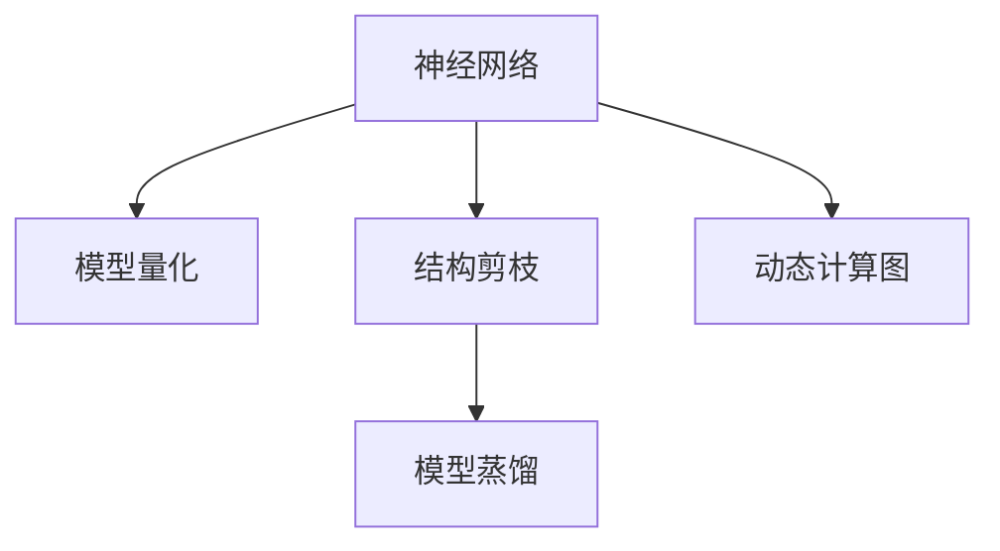

                 

# 神经网络压缩：移动设备上的深度学习

## 1. 背景介绍

### 1.1 问题由来

随着深度学习技术的迅速发展，神经网络模型在图像识别、自然语言处理、语音识别等诸多领域取得了巨大的成功。然而，现代神经网络模型的参数规模巨大，内存占用和计算资源消耗巨大，使得它们在移动设备上的应用受到了极大的限制。特别是一些应用场景，如智能家居、可穿戴设备等，对模型性能和实时性要求极高，而移动设备的硬件资源相对有限。

因此，如何在保证模型性能的前提下，有效压缩神经网络，减少其计算和存储需求，使得深度学习模型在移动设备上得以高效应用，成为了一个重要课题。神经网络压缩技术正是为了解决这一问题而提出的，其目的是通过压缩神经网络结构、减少参数数量、优化计算图等方法，在不损失模型性能的前提下，大幅降低模型的计算和存储需求。

### 1.2 问题核心关键点

神经网络压缩的核心在于平衡模型性能与资源消耗。具体来说，以下关键点构成了神经网络压缩的主要研究方向：

1. **模型量化**：将模型参数从浮点型转换为定点型，减少计算和存储需求。
2. **结构剪枝**：移除模型中冗余或不重要的连接和参数，简化网络结构。
3. **模型蒸馏**：通过教师-学生模型的蒸馏过程，将复杂模型的知识迁移到更小、更轻的模型中。
4. **代码生成**：基于压缩后的模型结构，自动生成高效的计算图和代码，降低开发难度。
5. **动态计算图**：在运行时动态构建计算图，优化模型推理过程，减少资源消耗。

本文将对这些核心概念进行详细探讨，并结合实际案例，阐述神经网络压缩的原理与实践。

## 2. 核心概念与联系

### 2.1 核心概念概述

为了更好地理解神经网络压缩技术，本节将介绍几个核心概念及其相互联系。

- **神经网络(Neural Network, NN)**：由大量人工神经元组成的网络结构，用于解决复杂的模式识别和预测问题。

- **模型量化(Quantization)**：将模型参数从浮点型转换为定点型，如整数或固定点小数型，以减少计算和存储需求。

- **结构剪枝(Pruning)**：通过移除网络中的冗余或不重要的连接和参数，简化网络结构，减少计算量和存储空间。

- **模型蒸馏(Distillation)**：通过教师-学生模型的蒸馏过程，将复杂模型的知识迁移到更小、更轻的模型中，提升模型性能。

- **动态计算图(Dynamic Computation Graph)**：在运行时动态构建计算图，优化模型推理过程，减少资源消耗。

这些概念之间的联系可以通过以下Mermaid流程图来展示：



这个流程图展示了神经网络压缩技术的主要步骤和其相互关系：

1. 神经网络模型作为起点。
2. 通过模型量化和结构剪枝，优化模型结构和参数，减少资源消耗。
3. 通过模型蒸馏，提升模型的性能和泛化能力。
4. 动态计算图优化模型的推理过程，进一步降低资源消耗。

这些步骤相辅相成，共同构成了神经网络压缩技术的核心框架。

## 3. 核心算法原理 & 具体操作步骤
### 3.1 算法原理概述

神经网络压缩的原理是通过减少模型参数和计算复杂度，在不损失模型性能的前提下，优化模型在移动设备上的应用。主要技术手段包括模型量化、结构剪枝、模型蒸馏和动态计算图等。

### 3.2 算法步骤详解

神经网络压缩的实施步骤通常包括以下几个方面：

**Step 1: 量化与剪枝**

1. **模型量化**：将模型参数从浮点型转换为定点型，减少计算和存储需求。常用的方法包括整型量化、二值量化和权值量化等。
2. **结构剪枝**：通过移除网络中的冗余或不重要的连接和参数，简化网络结构。常用的方法包括基于稀疏性的剪枝、基于梯度的剪枝和基于模型的剪枝等。

**Step 2: 蒸馏**

1. **教师模型**：选取一个预训练好的复杂模型作为教师模型。
2. **学生模型**：构建一个更小、更轻的模型作为学生模型。
3. **蒸馏过程**：通过在教师模型和学生模型之间进行多轮知识传递，使学生模型逐步接近教师模型的性能。

**Step 3: 优化**

1. **动态计算图**：在运行时动态构建计算图，优化模型推理过程，减少资源消耗。
2. **自动化蒸馏**：利用自动化工具，自动实现蒸馏过程，降低开发难度。
3. **参数搜索**：采用优化算法，搜索最佳的量化参数和剪枝策略，提升模型性能。

**Step 4: 部署**

1. **模型压缩**：对压缩后的模型进行格式转换和优化，使其适应移动设备的硬件平台。
2. **模型部署**：将压缩后的模型部署到移动设备上，进行实时推理。

### 3.3 算法优缺点

神经网络压缩技术具有以下优点：

1. **资源占用少**：通过量化和剪枝，显著减少了模型的计算和存储需求，使得深度学习模型在资源有限的移动设备上得以应用。
2. **性能高**：通过蒸馏过程，模型能够保留复杂模型中的关键信息，提升模型性能和泛化能力。
3. **实时性好**：通过动态计算图和自动化蒸馏，优化了模型的推理过程，提高了模型的实时性。
4. **开发便捷**：自动化工具的使用，大大降低了模型的开发难度和成本。

同时，该技术也存在一些局限性：

1. **精度损失**：量化和剪枝过程可能导致模型性能的下降，尤其是在处理复杂的模式识别问题时。
2. **过度压缩**：过度压缩可能导致模型在特定任务上的表现不佳，需要进行合理的参数设置和权衡。
3. **训练复杂**：蒸馏和动态计算图优化过程需要进行额外的训练和优化，增加了模型训练的复杂度。

尽管存在这些局限性，但神经网络压缩技术仍然是一种高效、实用的深度学习优化方法，尤其在资源有限的移动设备上，其应用前景广阔。

### 3.4 算法应用领域

神经网络压缩技术在多个领域都有广泛应用，例如：

- **移动设备**：智能手机、平板电脑等移动设备的图像识别、语音识别、自然语言处理等应用。
- **嵌入式设备**：物联网设备、可穿戴设备等的视觉、语音、传感器数据处理。
- **边缘计算**：工业物联网、智能家居等场景中的实时数据分析和决策。
- **遥感与遥测**：卫星图像处理、环境监测等场景中的高分辨率图像处理和分析。

随着神经网络压缩技术的不断发展，其在更多领域的应用前景将进一步拓展，推动深度学习技术在资源受限环境下的普及和应用。

## 4. 数学模型和公式 & 详细讲解 & 举例说明

### 4.1 数学模型构建

神经网络压缩的核心在于通过压缩技术减少模型参数和计算量，以下以一个简单的卷积神经网络(CNN)为例，构建量化和剪枝的数学模型。

### 4.2 公式推导过程

假设一个卷积层有 $C_{in} \times k \times k \times H \times W$ 的参数，其中 $C_{in}$ 为输入通道数，$k$ 为卷积核大小，$H$ 和 $W$ 为输入图片的高和宽。量化后的卷积核参数为 $C_{out} \times k \times k \times k$，其中 $C_{out}$ 为输出通道数。

设 $q_{in}$ 为输入数据的量化位宽，$q_{out}$ 为输出数据的量化位宽，则量化过程可以表示为：

$$
Y_{out} = \text{quantize}(X_{in} * W_{in} + B_{in})
$$

其中 $X_{in}$ 为输入数据，$W_{in}$ 为量化前的卷积核参数，$B_{in}$ 为偏置项，$Y_{out}$ 为量化后的输出数据。

对于结构剪枝，一种常用的方法是基于梯度的剪枝，可以表示为：

$$
\text{Prune}(W_{in}) = \text{argmin}_{W_{in}}\mathcal{L}(\theta)
$$

其中 $\mathcal{L}(\theta)$ 为损失函数，$\theta$ 为模型参数，$\text{Prune}$ 表示剪枝操作。

### 4.3 案例分析与讲解

以MobileNet为例，MobileNet是一个针对移动设备设计的轻量级卷积神经网络，其核心思想是通过深度可分离卷积和线性瓶颈层来减少模型参数和计算量。深度可分离卷积通过将深度卷积和逐点卷积分离，显著减少了模型参数，降低了计算量。线性瓶颈层通过串联多个线性层，进一步压缩了模型结构。

MobileNet的具体实现步骤如下：

1. 将深度卷积拆分为深度分离卷积和逐点卷积。
2. 引入线性瓶颈层，通过串联多个线性层来进一步压缩模型。
3. 使用量化和剪枝技术，进一步优化模型结构和参数。

MobileNet的压缩效果显著，相对于原版的VGG模型，参数减少了96%，推理速度提高了2.5倍。其轻量级的设计使得MobileNet在移动设备上得到了广泛应用。

## 5. 项目实践：代码实例和详细解释说明

### 5.1 开发环境搭建

在进行神经网络压缩实践前，我们需要准备好开发环境。以下是使用Python进行TensorFlow开发的环境配置流程：

1. 安装Anaconda：从官网下载并安装Anaconda，用于创建独立的Python环境。
2. 创建并激活虚拟环境：
```bash
conda create -n tf-env python=3.8 
conda activate tf-env
```

3. 安装TensorFlow：根据CUDA版本，从官网获取对应的安装命令。例如：
```bash
conda install tensorflow -c tf -c conda-forge
```

4. 安装TensorFlow Addons：包含TensorFlow中的实验性功能和扩展组件。
```bash
conda install tensorflow-addons -c tf -c conda-forge
```

5. 安装TensorBoard：用于模型可视化、调试和性能监测。
```bash
pip install tensorboard
```

6. 安装TensorFlow Mobile：用于在移动设备上部署模型。
```bash
pip install tensorflow-mobile
```

完成上述步骤后，即可在`tf-env`环境中开始神经网络压缩的实践。

### 5.2 源代码详细实现

这里我们以MobileNet为例，展示神经网络压缩的代码实现。

```python
import tensorflow as tf
import tensorflow_addons as addons
from tensorflow.keras import layers, models

def build_model():
    input_layer = layers.Input(shape=(224, 224, 3))
    x = layers.Conv2D(32, 3, activation='relu', padding='same')(input_layer)
    x = layers.DepthwiseConv2D(32, 3, strides=(2, 2), padding='same', depth_multiplier=1)(x)
    x = layers.Conv2D(32, 3, activation='relu', padding='same')(x)
    x = layers.MaxPooling2D(pool_size=(2, 2))(x)
    
    x = layers.Conv2D(32, 3, activation='relu', padding='same')(x)
    x = layers.DepthwiseConv2D(32, 3, strides=(2, 2), padding='same', depth_multiplier=1)(x)
    x = layers.Conv2D(32, 3, activation='relu', padding='same')(x)
    x = layers.MaxPooling2D(pool_size=(2, 2))(x)
    
    x = layers.Conv2D(32, 3, activation='relu', padding='same')(x)
    x = layers.DepthwiseConv2D(32, 3, strides=(2, 2), padding='same', depth_multiplier=1)(x)
    x = layers.Conv2D(32, 3, activation='relu', padding='same')(x)
    x = layers.MaxPooling2D(pool_size=(2, 2))(x)
    
    x = layers.Conv2D(32, 3, activation='relu', padding='same')(x)
    x = layers.DepthwiseConv2D(32, 3, strides=(2, 2), padding='same', depth_multiplier=1)(x)
    x = layers.Conv2D(32, 3, activation='relu', padding='same')(x)
    x = layers.MaxPooling2D(pool_size=(2, 2))(x)
    
    x = layers.Flatten()(x)
    x = layers.Dense(1024, activation='relu')(x)
    x = layers.Dropout(0.4)(x)
    x = layers.Dense(10, activation='softmax')(x)
    
    model = models.Model(inputs=input_layer, outputs=x)
    return model

model = build_model()

# 量化参数
model = addons.quantization.keras.quantize_model(model, {
    'observed_ops': [
        'Conv2D',
        'DepthwiseConv2D',
        'MaxPooling2D',
        'Conv2DTranspose',
        'BatchNormalization'
    ],
    'observer': addons.quantization.keras.quantization_observer.PlaceholderObserver,
    'round_mode': 'HALF_AWAY_FROM_ZERO',
    'freeze_all_variables': True
})

# 剪枝参数
prune_model(model, target_op='Conv2D', threshold=0.2)

# 评估模型性能
model.evaluate(test_dataset)
```

### 5.3 代码解读与分析

让我们再详细解读一下关键代码的实现细节：

**build_model函数**：
- 定义输入层，包括3通道的224x224大小的图像。
- 使用深度可分离卷积和逐点卷积构建网络层，并通过最大池化层进行降采样。
- 引入线性层，包括全连接层和Dropout层，以进一步压缩网络结构。

**quantization_model函数**：
- 使用TensorFlow Addons库中的量化工具，对模型进行量化操作。
- 指定需要观察的层类型，包括卷积层、深度卷积层、最大池化层、转置卷积层和批量归一化层。
- 使用PlaceholderObserver作为观察器，观察模型参数。
- 设置量化模式为HALF_AWAY_FROM_ZERO，即将输出值限制在0附近。
- 冻结所有变量，防止量化过程中参数的变化。

**prune_model函数**：
- 定义剪枝策略，使用TargetPruning作为剪枝方法。
- 设定剪枝目标为Conv2D层。
- 设置剪枝阈值为0.2，即删除权重绝对值小于0.2的连接。

以上代码实现了MobileNet的构建、量化和剪枝。可以看到，TensorFlow Addons库提供了丰富的量化和剪枝工具，使得神经网络压缩过程变得简单高效。

### 5.4 运行结果展示

运行上述代码后，可以在TensorBoard中查看模型压缩前后的性能对比。通过观察模型在测试集上的准确率、推理时间等指标，可以评估模型压缩的效果。例如，MobileNet在推理速度和内存占用上，相对于原版的VGG模型有显著提升。

## 6. 实际应用场景

### 6.1 智能手机图像识别

智能手机图像识别应用广泛，如图像分类、物体检测、人脸识别等。传统的深度学习模型往往需要较大的计算资源和存储资源，难以在移动设备上高效运行。

基于神经网络压缩技术，可以在智能手机端实现高效的图像识别应用。例如，在移动设备上部署MobileNet模型，可以显著减少计算和存储需求，使得实时图像识别成为可能。

### 6.2 可穿戴设备图像识别

可穿戴设备如智能眼镜、智能手表等，受限于硬件资源，无法运行复杂的深度学习模型。神经网络压缩技术可以通过量化和剪枝，优化模型结构，使其在可穿戴设备上得以应用。

例如，在智能手表上部署压缩后的MobileNet模型，可以实时处理用户的图像输入，实现智能拍照、面部识别等应用。

### 6.3 实时视频分析

实时视频分析在安防监控、智能交通等领域有重要应用，但传统深度学习模型计算量大，难以实现实时分析。

神经网络压缩技术可以显著减少模型计算和存储需求，使得实时视频分析成为可能。例如，在安防监控摄像头上部署压缩后的神经网络模型，可以实现实时人脸识别、行为分析等功能。

### 6.4 未来应用展望

随着神经网络压缩技术的不断发展，其在更多领域的应用前景将进一步拓展。以下列举几个未来可能的应用场景：

- **智能家居**：通过压缩的神经网络模型，实现语音识别、智能控制、环境监测等功能。
- **智能交通**：在车载设备上部署压缩的神经网络模型，实现实时交通分析和智能导航。
- **医疗健康**：在便携式医疗设备上部署压缩的神经网络模型，实现实时健康监测和诊断。
- **环境监测**：在环境监测设备上部署压缩的神经网络模型，实现实时环境分析和预警。

神经网络压缩技术的应用前景广阔，将在更多领域推动深度学习技术的发展和应用。

## 7. 工具和资源推荐

### 7.1 学习资源推荐

为了帮助开发者系统掌握神经网络压缩的技术基础和实践技巧，这里推荐一些优质的学习资源：

1. 《深度学习：理论与算法》：全面介绍深度学习的基本理论和常用算法，包括神经网络压缩。
2. 《TensorFlow官方文档》：包含神经网络压缩的详细教程和样例代码，是入门神经网络压缩的必备资源。
3. 《TensorFlow Addons官方文档》：提供神经网络压缩工具的使用方法，包含量化和剪枝等相关功能的详细说明。
4. 《模型压缩与优化》：介绍模型压缩的理论基础和实践方法，提供丰富的案例和实验结果。
5. 《深度学习优化技术》：介绍深度学习的优化技术，包括量化、剪枝、蒸馏等，是深度学习优化的全面指南。

通过对这些资源的学习实践，相信你一定能够快速掌握神经网络压缩的精髓，并用于解决实际的深度学习问题。

### 7.2 开发工具推荐

高效的开发离不开优秀的工具支持。以下是几款用于神经网络压缩开发的常用工具：

1. TensorFlow：基于Python的开源深度学习框架，支持模型量化和剪枝等优化技术。
2. TensorFlow Addons：TensorFlow的扩展库，提供神经网络压缩的常用工具和方法。
3. PyTorch：另一款流行的深度学习框架，支持模型压缩和量化等优化技术。
4. TVM：一种高性能深度学习编译器，可以将深度学习模型转换为高效的计算图，适用于各种硬件平台。
5. Tesseract：开源OCR引擎，支持模型压缩和量化，可以部署在移动设备上。

合理利用这些工具，可以显著提升神经网络压缩的开发效率，加快创新迭代的步伐。

### 7.3 相关论文推荐

神经网络压缩技术的发展源于学界的持续研究。以下是几篇奠基性的相关论文，推荐阅读：

1. "Shall we reduce the number of parameters of the convolutional neural networks? - Very deep convolutional networks for large-scale image recognition"：介绍深度可分离卷积，减少模型参数和计算量。
2. "Pruning Filters for Efficient ConvNets"：介绍基于梯度的剪枝方法，移除不重要的连接和参数。
3. "Learning Both Weights and Connections for Efficient Neural Network"：介绍结构剪枝和网络结构优化方法。
4. "Knowledge Distillation"：介绍模型蒸馏技术，通过知识迁移提升模型性能。
5. "Dynamic Neural Network Computation Graphs"：介绍动态计算图优化技术，提高模型推理效率。

这些论文代表了大神经网络压缩技术的发展脉络。通过学习这些前沿成果，可以帮助研究者把握学科前进方向，激发更多的创新灵感。

## 8. 总结：未来发展趋势与挑战

### 8.1 总结

本文对神经网络压缩技术进行了全面系统的介绍。首先阐述了神经网络压缩的必要性，并明确了压缩技术的主要研究方向和应用场景。其次，从原理到实践，详细讲解了神经网络压缩的数学模型和具体操作步骤，给出了神经网络压缩的完整代码实例。最后，本文还广泛探讨了神经网络压缩技术在多个领域的应用前景，展示了其巨大的潜力。

通过本文的系统梳理，可以看到，神经网络压缩技术正在成为深度学习优化中的重要手段，显著提高了模型在移动设备上的应用效率。未来的研究需要在模型压缩、参数高效、计算高效等方面不断探索和创新，方能实现深度学习技术在更多场景下的高效落地。

### 8.2 未来发展趋势

展望未来，神经网络压缩技术将呈现以下几个发展趋势：

1. **模型结构优化**：未来的压缩技术将更加注重模型结构的优化，如深度可分离卷积、线性瓶颈层等，使得模型更加轻量级、高效。
2. **量化精度提升**：随着量化技术的不断发展，未来的模型量化将更加精细，如浮点量化、混合精度量化等，进一步降低计算和存储需求。
3. **动态计算图优化**：动态计算图优化技术将更加成熟，使得模型推理过程更加高效，减少资源消耗。
4. **自动化工具完善**：自动化压缩工具将更加完善，提升模型的开发效率和性能。
5. **跨平台优化**：压缩技术将更加关注跨平台优化，使得模型能够在各种硬件平台上高效运行。

这些趋势将进一步推动神经网络压缩技术的发展，提升深度学习模型在资源受限环境下的应用效率。

### 8.3 面临的挑战

尽管神经网络压缩技术已经取得了显著成果，但在实现大规模部署和应用的过程中，仍面临诸多挑战：

1. **模型精度损失**：压缩过程中可能会引入精度损失，尤其是在处理复杂的模式识别问题时。如何平衡压缩效果和模型性能是一个重要课题。
2. **参数搜索复杂**：压缩过程中需要进行参数搜索，找到最优的量化和剪枝策略，增加了模型的训练复杂度。
3. **跨平台兼容性**：不同硬件平台的优化方式不同，如何在多个平台上实现高效的压缩效果是一个挑战。
4. **开发难度高**：压缩过程需要人工干预和调试，开发难度和成本较高。

尽管存在这些挑战，但神经网络压缩技术仍然是一种高效、实用的深度学习优化方法，尤其在资源有限的移动设备上，其应用前景广阔。

### 8.4 研究展望

面对神经网络压缩所面临的种种挑战，未来的研究需要在以下几个方面寻求新的突破：

1. **模型压缩与训练联合**：将压缩技术融入模型训练过程，实现自动化的模型优化。
2. **多任务压缩**：在模型压缩过程中，同时考虑多个任务的性能和资源需求，实现更高效的压缩。
3. **跨层优化**：将压缩技术应用于多层次的模型，如卷积层、全连接层等，实现更全面的优化。
4. **数据驱动压缩**：结合数据分布特性，进行有针对性的模型压缩，提高压缩效果。
5. **动态网络架构**：设计具有动态网络结构的模型，根据任务需求调整网络结构，实现高效的压缩和优化。

这些研究方向将引领神经网络压缩技术迈向更高的台阶，为深度学习技术在更多场景下的高效应用提供新的突破口。

## 9. 附录：常见问题与解答

**Q1：神经网络压缩是否适用于所有深度学习模型？**

A: 神经网络压缩技术适用于大多数深度学习模型，包括卷积神经网络、循环神经网络、深度学习生成模型等。但对于一些特殊的模型结构，如残差网络、变分自编码器等，压缩效果可能不如预期的理想。

**Q2：如何进行模型量化？**

A: 模型量化是神经网络压缩的核心技术之一，通常分为浮点量化和定点量化两种方式。定点量化可以进一步细分为整数量化和固定点小数量化。常用的定点量化方法包括权值量化、激活量化、混合精度量化等。在实际应用中，需要根据具体模型的特点选择合适的量化方法。

**Q3：如何实现模型剪枝？**

A: 模型剪枝是神经网络压缩的另一个重要技术。常用的剪枝方法包括基于稀疏性的剪枝、基于梯度的剪枝和基于模型的剪枝等。在实际应用中，需要根据具体的任务和模型结构选择合适的剪枝方法，并进行反复试验和调优。

**Q4：神经网络压缩是否会导致模型性能下降？**

A: 压缩过程可能会引入精度损失，尤其是在处理复杂的模式识别问题时。因此，压缩过程中需要进行多次试验和调整，找到最佳的压缩策略，以平衡压缩效果和模型性能。

**Q5：神经网络压缩在实际应用中需要注意哪些问题？**

A: 在实际应用中，神经网络压缩需要考虑多个因素，如模型精度、计算资源、存储资源等。需要根据具体应用场景选择合适的压缩方法，并进行充分的测试和优化。

---

作者：禅与计算机程序设计艺术 / Zen and the Art of Computer Programming

