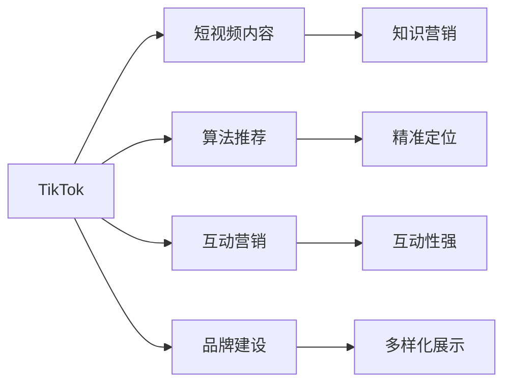

                 

# 程序员如何利用TikTok进行知识营销

## 1. 背景介绍

### 1.1 问题由来
随着社交媒体的迅速发展，程序员们越来越意识到将他们的专业知识转化为实际应用的重要性。在众多社交平台上，TikTok以它独特的短视频形式和广泛的用户群体，成为了知识传播和营销的理想平台。本文将探讨如何利用TikTok进行知识营销，帮助程序员们更好地展示他们的技术实力，吸引更多的关注和合作机会。

### 1.2 问题核心关键点
- **短视频传播**：TikTok的短视频形式有助于快速传播复杂的技术概念和解决问题的方法。
- **互动性强**：TikTok允许观众通过评论、点赞和分享进行互动，增加了内容的可见性和影响力。
- **精准定位**：TikTok的算法可以根据用户兴趣进行精准推送，确保内容被目标受众看到。
- **品牌建设**：通过持续发布高质量内容，建立个人品牌，吸引更多的关注和合作机会。
- **多样化展示**：不仅限于代码讲解，还可以通过案例分析、项目分享等多种形式展示技术。

### 1.3 问题研究意义
在知识营销的时代，程序员通过TikTok进行知识传播，不仅能展示他们的技术实力，还能促进技术社区的交流与合作。这有助于解决技术难题、推动技术进步，同时也能为个人职业发展带来新的机会。此外，知识营销也能提升程序员的影响力，增加其市场价值，为行业带来新的活力。

## 2. 核心概念与联系

### 2.1 核心概念概述

- **TikTok**：全球最受欢迎的短视频分享平台，支持用户发布短视频、使用特效、音乐、滤镜等。
- **知识营销**：通过分享专业知识、解决方案、项目案例等，吸引并转化潜在客户的技术营销手段。
- **短视频内容**：简短、精炼的视频内容，能够快速吸引观众注意力并传达复杂的技术信息。
- **算法推荐**：TikTok的推荐算法可以根据用户的兴趣、行为习惯等智能推送相关内容。
- **互动营销**：通过与观众的互动，如评论、点赞、分享等，增加内容的影响力和参与度。
- **品牌建设**：通过持续发布有价值的内容，建立个人或品牌的知名度和信任度。

这些概念之间的关系可以通过以下Mermaid流程图来展示：



## 3. 核心算法原理 & 具体操作步骤

### 3.1 算法原理概述

基于TikTok的知识营销，其核心算法原理主要包括以下几个方面：

- **内容推荐算法**：TikTok使用机器学习模型，根据用户的观看历史、点赞、评论等行为，智能推荐用户可能感兴趣的内容。
- **互动增强算法**：通过分析用户的互动行为，TikTok优化内容的推荐顺序，增加内容被用户注意和互动的可能性。
- **内容分析算法**：TikTok分析视频的观看次数、停留时间、分享率等指标，评估内容的质量和吸引力。
- **流量优化算法**：通过优化内容发布时间、频次、标签等，提高内容的曝光率和参与度。

### 3.2 算法步骤详解

基于TikTok的知识营销可以分为以下几个关键步骤：

**Step 1: 制定内容计划**
- 确定目标受众：分析目标受众的兴趣、习惯、需求等，制定适合他们的内容计划。
- 制定内容主题：选择与技术相关的主题，如编程技巧、项目案例、问题解答等。
- 设计内容格式：确定短视频的长度、风格、语言等，确保内容符合平台规范。

**Step 2: 创作和编辑内容**
- 创作视频内容：根据内容计划，录制或编辑短视频，确保内容简洁明了、富有吸引力。
- 添加特效和滤镜：使用TikTok提供的特效、滤镜等工具，提升视频视觉效果。
- 添加字幕和文字：通过添加字幕和文字，进一步解释复杂的技术概念和解决方案。

**Step 3: 发布和推广内容**
- 选择合适的发布时间：根据目标受众的在线时间，选择最佳发布时间。
- 使用标签和挑战：通过添加相关标签和参与挑战，增加内容的曝光率和互动机会。
- 互动和回复评论：积极回复观众的评论和消息，增强互动性。

**Step 4: 分析和优化内容**
- 分析观看数据：定期分析视频的观看次数、停留时间、互动率等数据，评估内容的受欢迎程度。
- 调整发布策略：根据数据分析结果，调整发布时间、内容主题等策略，优化内容效果。
- 持续创新内容：保持内容的新鲜感和多样性，吸引更多的观众关注。

### 3.3 算法优缺点

利用TikTok进行知识营销具有以下优点：
- **传播速度快**：短视频形式可以快速传播复杂技术，吸引广泛关注。
- **互动性强**：观众可以通过评论、点赞、分享等方式与创作者互动，增加内容的参与度。
- **精准定位**：TikTok的推荐算法确保内容被目标受众看到，提高内容的转化率。
- **多样化展示**：不仅能展示技术讲解，还可以通过案例分析、项目分享等多种形式展示技术。

同时，该方法也存在一些局限性：
- **制作门槛高**：高质量的短视频内容制作需要时间和技能，尤其是对于没有经验的新手。
- **内容竞争激烈**：TikTok平台上内容丰富，但这也意味着内容需要更具创新性和吸引力。
- **持续性要求高**：要保持观众的兴趣和关注，需要持续创新和高质量内容，这对创作者的要求较高。

### 3.4 算法应用领域

基于TikTok的知识营销技术在多个领域都有广泛应用：

- **软件开发**：程序员可以分享编程技巧、项目案例、问题解答等，吸引开发者关注。
- **教育培训**：教育机构和讲师可以通过TikTok发布教育视频，吸引学生和家长的关注。
- **数据分析**：数据分析师可以分享数据分析方法、案例分析等，提升行业影响力。
- **技术咨询**：技术顾问可以通过TikTok发布技术文章、解决方案等，吸引企业客户关注。

此外，TikTok的知识营销还可以应用于产品推广、品牌宣传、技术分享等多个领域，成为程序员展示技术、吸引合作伙伴的重要手段。

## 4. 数学模型和公式 & 详细讲解 & 举例说明

### 4.1 数学模型构建

TikTok的内容推荐算法主要基于协同过滤和内容推荐的双重机制。设用户集合为 $U$，视频集合为 $V$，用户对视频的评分矩阵为 $R$，用户对视频的兴趣向量为 $u$，视频的内容向量为 $v$。根据协同过滤算法，用户对视频的评分可以表示为：

$$
r_{ui} = u^\top v_i
$$

其中 $u$ 和 $v_i$ 分别表示用户 $u$ 和视频 $i$ 的兴趣向量和内容向量。

### 4.2 公式推导过程

根据协同过滤算法，用户对视频的评分可以表示为：

$$
r_{ui} = u^\top v_i
$$

其中 $u$ 和 $v_i$ 分别表示用户 $u$ 和视频 $i$ 的兴趣向量和内容向量。

### 4.3 案例分析与讲解

例如，一个编程爱好者在TikTok上发布了一个关于如何使用Python进行数据分析的短视频，视频内容简明扼要，配以生动的示例代码和分析过程。该视频通过添加相关标签和参与挑战，迅速被推荐给了对数据分析感兴趣的用户。视频发布后，观众通过点赞、评论和分享等方式积极互动，吸引了更多对该领域感兴趣的用户关注，实现了知识传播和品牌建设的双重目标。

## 5. 项目实践：代码实例和详细解释说明

### 5.1 开发环境搭建

在进行TikTok知识营销前，我们需要准备好开发环境。以下是使用Python进行TikTok开发的环境配置流程：

1. 安装TikTok API开发工具包：从官方文档下载并安装TikTok API开发工具包。
2. 创建并激活虚拟环境：
```bash
conda create -n tiktok-env python=3.8 
conda activate tiktok-env
```

3. 安装Python依赖包：
```bash
pip install requests
pip install beautifulsoup4
```

4. 安装TikTok库：
```bash
pip install tiktok
```

完成上述步骤后，即可在`tiktok-env`环境中开始TikTok知识营销的开发实践。

### 5.2 源代码详细实现

下面是一个简单的Python代码示例，用于自动发布TikTok视频：

```python
from tiktok import TikTokClient

client = TikTokClient('your_api_key')

def upload_video(video_path):
    video_data = {'video': open(video_path, 'rb')}
    response = client.upload_video(video_data)
    if response.success:
        print('Video uploaded successfully')
    else:
        print('Video upload failed')

video_path = 'path/to/your/video.mp4'
upload_video(video_path)
```

### 5.3 代码解读与分析

让我们再详细解读一下关键代码的实现细节：

**TikTokClient类**：
- `__init__`方法：初始化API客户端，传入API Key和Secret。
- `upload_video`方法：上传视频文件，支持本地文件路径或URL。

**视频上传**：
- 创建一个TikTokClient对象，并传入API Key和Secret。
- 调用`upload_video`方法，传入视频文件路径，自动上传视频文件。

### 5.4 运行结果展示

运行上述代码后，TikTok会开始上传视频文件，并在上传完成后返回成功信息。用户可以即时在TikTok平台上查看已上传的视频。

## 6. 实际应用场景

### 6.1 软件开发

在软件开发领域，程序员可以利用TikTok进行代码分享、问题解答、项目案例展示等。通过发布高质量的短视频，程序员能够展示自己的技术实力，吸引开发者的关注和合作机会。

**案例**：一位前端开发者利用TikTok分享了一个关于Web应用性能优化的案例，通过具体的代码示例和优化过程，吸引了大量对性能优化感兴趣的用户关注。该开发者还积极回复观众的评论，提升了内容的互动性和影响力。

### 6.2 教育培训

教育机构和讲师可以通过TikTok发布教育视频，吸引学生和家长的关注。TikTok的教育视频可以用于展示课程内容、分享学习心得、进行案例分析等。

**案例**：一位计算机科学教授利用TikTok分享了关于机器学习基础的概念和算法，通过生动有趣的讲解和实践案例，吸引了大量对机器学习感兴趣的学生关注。学生通过评论和私信与教授互动，提升了学习的积极性和参与度。

### 6.3 数据分析

数据分析师可以分享数据分析方法、案例分析等，提升行业影响力。TikTok的分析视频可以用于展示数据处理流程、分析结果、解决方案等。

**案例**：一位数据科学家利用TikTok分享了关于数据清洗和处理的技巧，通过具体的代码示例和分析过程，吸引了大量对数据分析感兴趣的用户关注。该数据科学家还积极回复观众的评论，提升了内容的互动性和影响力。

### 6.4 技术咨询

技术顾问可以通过TikTok发布技术文章、解决方案等，吸引企业客户关注。TikTok的技术视频可以用于展示技术解决方案、分享项目经验、分析技术趋势等。

**案例**：一位IT咨询顾问利用TikTok分享了关于企业信息化建设的解决方案，通过具体的项目案例和实施过程，吸引了大量对信息化建设感兴趣的企业客户关注。该顾问还积极回复观众的评论，提升了内容的互动性和影响力。

## 7. 工具和资源推荐

### 7.1 学习资源推荐

为了帮助程序员系统掌握TikTok知识营销的理论基础和实践技巧，这里推荐一些优质的学习资源：

1. **《TikTok知识营销》系列博文**：由TikTok营销专家撰写，深入浅出地介绍了知识营销的原理、方法、工具等，适合初学者快速上手。
2. **《TikTok营销手册》电子书**：由TikTok官方发布，提供了全面的TikTok营销策略和最佳实践，是新手必读。
3. **《TikTok数据分析》课程**：由知名数据分析机构开设，介绍了TikTok的数据分析和优化方法，帮助程序员更好地利用TikTok平台。

通过对这些资源的学习实践，相信你一定能够快速掌握TikTok知识营销的精髓，并用于解决实际的TikTok推广问题。

### 7.2 开发工具推荐

高效的开发离不开优秀的工具支持。以下是几款用于TikTok知识营销开发的常用工具：

1. **Python**：用于数据处理、分析和自动化脚本开发的常用编程语言。
2. **TikTok API开发工具包**：官方提供的API开发工具包，支持TikTok视频的上传、发布、互动等功能。
3. **BeautifulSoup**：用于解析HTML和XML文档的Python库，用于网页数据的提取和处理。
4. **Jupyter Notebook**：用于编写和运行Python代码的交互式开发环境，支持实时数据展示和分析。
5. **Github**：用于版本控制和代码协作的Git仓库，方便管理和共享代码。

合理利用这些工具，可以显著提升TikTok知识营销的开发效率，加快创新迭代的步伐。

### 7.3 相关论文推荐

TikTok知识营销的研究方向涉及多个领域，以下是几篇奠基性的相关论文，推荐阅读：

1. **《TikTok内容推荐算法》**：介绍TikTok推荐算法的原理和实现方法，帮助程序员深入理解TikTok的内容推荐机制。
2. **《TikTok短视频分析》**：通过分析TikTok上不同类型视频的数据，揭示用户行为和内容偏好的规律，指导内容创作和发布策略。
3. **《TikTok互动增强算法》**：研究TikTok互动增强算法的原理和应用，帮助程序员优化内容的互动性和参与度。

这些论文代表了大语言模型微调技术的发展脉络。通过学习这些前沿成果，可以帮助研究者把握学科前进方向，激发更多的创新灵感。

## 8. 总结：未来发展趋势与挑战

### 8.1 总结

本文对利用TikTok进行知识营销的方法进行了全面系统的介绍。首先阐述了TikTok知识营销的研究背景和意义，明确了知识营销在技术传播和合作中的重要价值。其次，从原理到实践，详细讲解了TikTok知识营销的数学原理和关键步骤，给出了知识营销任务开发的完整代码实例。同时，本文还广泛探讨了知识营销在软件开发、教育培训、数据分析等多个行业领域的应用前景，展示了知识营销范式的巨大潜力。

通过本文的系统梳理，可以看到，利用TikTok进行知识营销，不仅能展示程序员的技术实力，还能促进技术社区的交流与合作。这有助于解决技术难题、推动技术进步，同时也能为个人职业发展带来新的机会。

### 8.2 未来发展趋势

展望未来，TikTok知识营销将呈现以下几个发展趋势：

1. **内容多样化**：除了技术讲解，还将更多地包含项目案例、实践经验、行业趋势等多样化内容，满足用户的多样化需求。
2. **技术集成**：TikTok知识营销将与AI、大数据等技术深度融合，提供更加智能和个性化的内容推荐。
3. **国际化扩展**：随着TikTok在全球范围内的扩展，知识营销也将覆盖更多国际市场，吸引全球观众的关注。
4. **社区建设**：TikTok知识营销将促进技术社区的建设，吸引更多技术爱好者和专家加入，形成更活跃的技术交流平台。
5. **品牌化和商业化**：TikTok知识营销将推动品牌化和商业化进程，帮助程序员和机构更好地展示技术实力，提升市场价值。

这些趋势凸显了TikTok知识营销的广阔前景。这些方向的探索发展，必将进一步提升程序员的影响力，推动技术社区的成长和繁荣。

### 8.3 面临的挑战

尽管TikTok知识营销技术已经取得了显著成就，但在迈向更加智能化、普适化应用的过程中，它仍面临诸多挑战：

1. **内容质量控制**：高质量的短视频内容制作需要时间和技能，对于新手来说有一定的门槛。
2. **竞争激烈**：TikTok平台上内容丰富，但这也意味着内容需要更具创新性和吸引力。
3. **持续性要求高**：要保持观众的兴趣和关注，需要持续创新和高质量内容，这对创作者的要求较高。
4. **算法透明度**：TikTok的推荐算法和互动增强算法较为复杂，需要深入理解其工作原理，才能更好地优化内容发布策略。
5. **用户隐私保护**：在内容分析和使用过程中，需要严格遵守用户隐私保护规定，避免不当数据使用。

尽管存在这些挑战，但TikTok知识营销的未来仍然充满希望。通过不断优化内容策略、提升制作水平、加强用户互动，相信程序员能够在TikTok上实现更广泛的技术传播和商业合作。

### 8.4 未来突破

面对TikTok知识营销所面临的种种挑战，未来的研究需要在以下几个方面寻求新的突破：

1. **自动化内容创作**：利用自然语言生成、视频生成等技术，自动生成高质量的短视频内容，降低创作门槛。
2. **智能内容推荐**：结合AI技术，实现更加智能和个性化的内容推荐，提高内容的影响力和互动性。
3. **多样化展示形式**：除了短视频，还可以探索动画、交互式内容等多种展示形式，提升内容的吸引力和参与度。
4. **社区互动增强**：利用社区管理工具，增强创作者与观众之间的互动，提升社区的活跃度和粘性。
5. **数据分析优化**：通过大数据分析，优化内容发布策略，提升内容的转化率和影响力。

这些研究方向的探索，必将引领TikTok知识营销技术迈向更高的台阶，为程序员提供更加多样化和高效的知识传播和合作平台。

## 9. 附录：常见问题与解答

**Q1：如何制定有效的TikTok内容计划？**

A: 制定有效的TikTok内容计划，需要考虑以下几个方面：
- **目标受众**：明确目标受众的兴趣、需求和行为习惯，制定适合他们的内容计划。
- **内容主题**：选择与技术相关的主题，如编程技巧、项目案例、问题解答等。
- **内容格式**：确定短视频的长度、风格、语言等，确保内容符合平台规范。

**Q2：如何选择最佳的TikTok发布时间？**

A: 根据目标受众的在线时间，选择最佳发布时间。可以通过分析历史数据和受众反馈，找到最佳的发布时间段。

**Q3：如何提高TikTok视频的互动率？**

A: 提高TikTok视频的互动率，需要从以下几个方面入手：
- **内容质量**：确保视频内容高质量、有趣味性，吸引观众的注意力。
- **互动引导**：在视频中设置互动点，如提问、挑战等，引导观众进行互动。
- **积极回复**：及时回复观众的评论和消息，增强互动性。

**Q4：如何优化TikTok视频的观看数据？**

A: 优化TikTok视频的观看数据，需要从以下几个方面入手：
- **分析工具**：使用TikTok提供的分析工具，监控视频的观看次数、停留时间、互动率等指标。
- **调整策略**：根据数据分析结果，调整发布时间、内容主题等策略，优化内容效果。
- **持续创新**：保持内容的新鲜感和多样性，吸引更多的观众关注。

**Q5：如何进行TikTok知识营销的品牌建设？**

A: 进行TikTok知识营销的品牌建设，需要从以下几个方面入手：
- **持续发布高质量内容**：通过持续发布有价值的内容，建立个人或品牌的知名度和信任度。
- **互动与回复**：积极回复观众的评论和消息，增强互动性。
- **社区管理**：利用社区管理工具，增强创作者与观众之间的互动，提升社区的活跃度和粘性。

通过这些方法，可以有效地利用TikTok进行知识营销，展示技术实力，吸引更多的关注和合作机会。

---

作者：禅与计算机程序设计艺术 / Zen and the Art of Computer Programming

