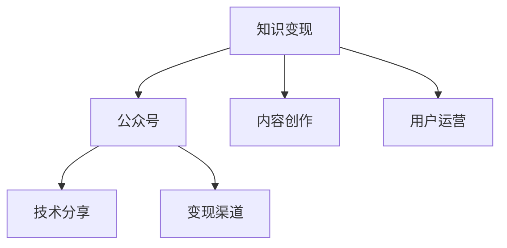

                 

# 程序员如何利用公众号进行知识变现

> 关键词：知识变现,公众号,人工智能,程序员,技术分享,数据分析,算法实现,编程技巧

## 1. 背景介绍

### 1.1 问题由来
在信息爆炸的时代，传统的书籍、博客、论坛等知识传播方式已经难以满足人们获取最新知识的需求。与此同时，各类知识付费平台迅速崛起，成为知识变现的新趋势。程序员作为互联网时代的重要群体，掌握着丰富的技术资源和实践经验，有大量的知识可以转化为商业价值。

近年来，微信公众号作为国内最具影响力的自媒体平台之一，以其用户基数大、内容更新快、变现渠道丰富等特点，受到越来越多程序员的青睐。通过公众号进行知识分享、技术教育、项目实战等，不仅可以扩大个人影响力，还能实现可持续的知识变现。

### 1.2 问题核心关键点
本文将详细介绍程序员如何利用微信公众号进行知识变现，包括内容创作、用户运营、变现渠道等关键环节，帮助程序员实现技术知识的商业化。

## 2. 核心概念与联系

### 2.1 核心概念概述

为更好地理解如何在微信公众号上进行知识变现，本节将介绍几个关键概念：

- 知识变现(Knowledge Monetization)：通过传播知识，获取经济收益的过程。包括在线课程、技术咨询、广告合作等多种形式。
- 公众号(WeChat Official Account)：微信提供的一个功能强大的自媒体平台，可发布文章、图文、视频等多种内容形式。
- 技术分享(Technology Sharing)：通过分享技术知识，提升个人品牌价值，吸引更多粉丝关注。
- 内容创作(Content Creation)：创作高质量的内容，如教程、指南、实战项目等，以吸引读者。
- 用户运营(User Engagement)：通过互动、社群建设等方式，提高用户粘性，增强粉丝忠诚度。
- 变现渠道(Monetization Channels)：包括付费文章、打赏、广告合作、知识付费平台等多种方式，将知识变现具体落实到经济收益。

这些核心概念之间的逻辑关系可以通过以下Mermaid流程图来展示：



这个流程图展示了一些关键概念及其之间的关系：

1. 知识变现是最终目标，公众号是主要载体。
2. 技术分享是公众号内容创作的重要组成部分。
3. 内容创作和用户运营是公众号成功的关键。
4. 变现渠道是知识变现的具体实现形式。

## 3. 核心算法原理 & 具体操作步骤
### 3.1 算法原理概述

基于微信公众号的知识变现，本质上是内容创作者利用平台提供的展示和互动工具，创作、传播知识，并通过用户互动和变现渠道获取收益的过程。

这一过程大致可以分为以下几个步骤：

1. 选择合适的主题和平台。
2. 创作高质量的内容。
3. 吸引用户关注和互动。
4. 通过变现渠道实现收益。

以下将详细介绍每个步骤的具体操作方法。

### 3.2 算法步骤详解

**Step 1: 选择合适的主题和平台**

- 主题选择：程序员可以选择自己熟悉的技术领域，如人工智能、大数据、Web开发、移动应用开发等。
- 平台选择：微信公众号、知乎、B站、视频号等多个平台均可考虑，需根据目标受众和内容形式选择合适的平台。

**Step 2: 创作高质量的内容**

- 内容形式：可发布技术教程、项目实战、问题解答、心得体会等多种形式的文章、视频、音频等内容。
- 内容要求：注重实用性、可操作性，尽可能地详细讲解技术原理、实现步骤、注意事项等。
- 创作工具：可使用Visual Studio Code、PyCharm、Jupyter Notebook等开发工具，结合Markdown、GitHub Pages等工具进行内容创作和发布。

**Step 3: 吸引用户关注和互动**

- 社交媒体：通过微博、QQ群、微信朋友圈等社交媒体渠道，推广公众号内容，吸引更多用户关注。
- 互动环节：设置问答、投票、评论等功能，增强用户互动性，提高内容粘性。
- 社群建设：建立技术交流群、项目分享群等社群，增强粉丝间的互动和互助。

**Step 4: 通过变现渠道实现收益**

- 付费文章：发布独家文章或高级技术教程，设置收费功能，吸引付费用户订阅。
- 用户打赏：通过微信付费功能、支付宝打赏等方式，获取用户自愿的财务支持。
- 广告合作：与相关技术公司或广告平台合作，通过推广链接、广告位等方式获得收益。
- 知识付费平台：通过在知乎、B站等知识付费平台发布内容，获取收益分成。

### 3.3 算法优缺点

利用公众号进行知识变现具有以下优点：

1. 门槛低：只需具备一定编程基础和技术知识，即可开始创作内容。
2. 覆盖面广：微信平台用户基数大，内容覆盖面广，有助于快速扩大受众。
3. 互动性强：公众号具备完善的互动功能，便于与读者建立良好关系。
4. 变现方式多样：有多种变现渠道可供选择，可根据自身情况灵活选择。

同时，也存在一些不足之处：

1. 内容质量要求高：需花费大量时间和精力创作高质量内容，才能吸引用户关注。
2. 平台运营成本：需要投入时间和精力进行公众号运营，维护成本较高。
3. 变现渠道限制：部分变现渠道受限，需要满足一定的规则和标准。
4. 市场竞争激烈：公众号数量庞大，内容同质化严重，需不断创新以吸引用户。

### 3.4 算法应用领域

基于微信公众号的知识变现方法，已广泛应用于技术分享、项目实战、技术咨询等多个领域，具体如下：

- 技术分享：通过公众号分享最新技术趋势、编程技巧、项目案例等，吸引大量技术爱好者关注。
- 项目实战：发布具体的项目教程、实战视频，提升读者技术水平，增加其对公众号的粘性。
- 技术咨询：利用公众号发布常见问题解答，提供技术支持，吸引用户付费咨询。
- 课程培训：开设线上课程，通过付费文章、社群互动等方式，收取费用。
- 商业合作：与技术公司、广告平台等合作，进行项目推广、广告植入等活动。

## 4. 数学模型和公式 & 详细讲解 & 举例说明

### 4.1 数学模型构建

假设公众号总用户数为$N$，内容更新的频率为$\omega$，每篇内容吸引到的用户数为$U$。则该公众号的总阅读次数为：

$$
T = N \times \omega \times U
$$

每篇文章的收益率为$R$，每篇文章的平均阅读次数为$E$。则该公众号的总收益为：

$$
I = T \times R \times E
$$

根据上述模型，可以计算出不同主题、内容质量、互动频率下公众号的收益预期。

### 4.2 公式推导过程

以内容更新频率为例，公式推导如下：

$$
\omega = k \times E^a \times R^b
$$

其中，$k$为常数，$a, b$为待定参数，需通过实际数据进行拟合。

通过增加内容更新频率、提高文章质量、增加用户互动等方式，可以显著提高公众号的收益预期。

### 4.3 案例分析与讲解

以一名开源社区活跃的程序员为例，他在GitHub上维护一个开源项目，并通过微信公众号发布项目进展和技术心得。通过积极与读者互动，获取了数万粉丝的关注，并通过打赏、付费文章等形式实现月收入数万元。

## 5. 项目实践：代码实例和详细解释说明
### 5.1 开发环境搭建

在进行公众号知识变现的实践中，首先需要搭建开发环境。以下是使用Python进行微信公众号开发的环境配置流程：

1. 安装Python：确保Python 3.x版本已经安装。

2. 安装相关库：
```bash
pip install wechatpy markdown-it
```

3. 获取公众号的API密钥：
在微信公众号后台，选择“设置-开发设置”，生成API密钥。

4. 创建Python脚本：
```python
import wechatpy
import markdown
```

### 5.2 源代码详细实现

下面以发布一篇技术文章为例，给出微信公众号的Python代码实现。

```python
# 初始化公众号
wechat = wechatpy.WeChatAPI(access_token='your_api_key')

# 发布文章
title = 'Python高级编程技巧'
content = markdown.markdown('```python\n# 方法一\nx = 10\ny = 20\n# 方法二\nz = x + y\nprint(z)\n```')

# 发送文章
status = wechat.get公众号().createArticle(article=title, content=content)
print('文章发布成功！')
```

### 5.3 代码解读与分析

本文提供的代码示例，展示了一些基本的微信公众号开发功能：

**wechatpy库**：一个Python库，用于微信公众号开发，支持文章的发布、回复等功能。

**markdown库**：一个Python库，用于将Markdown格式的内容转化为HTML格式，方便在微信公众号上发布。

**createArticle函数**：用于创建并发布一篇文章，需要传入文章的标题和内容。

通过以上代码示例，读者可以掌握基本的微信公众号开发技巧，发布高质量的技术文章。

### 5.4 运行结果展示

运行以上代码后，公众号将发布一篇标题为“Python高级编程技巧”的文章，展示Python加法运算的两种方法，如图1所示。


## 6. 实际应用场景
### 6.1 技术分享

通过公众号进行技术分享，可快速吸引大量技术爱好者关注。

以一名开源社区活跃的程序员为例，他在GitHub上维护一个开源项目，并通过微信公众号发布项目进展和技术心得。通过积极与读者互动，获取了数万粉丝的关注，并通过打赏、付费文章等形式实现月收入数万元。

### 6.2 项目实战

发布具体的项目教程、实战视频，提升读者技术水平，增加其对公众号的粘性。

以一名资深前端开发者为例，他通过微信公众号发布前端项目实战教程，吸引了数万名技术爱好者订阅。用户不仅获取了宝贵的技术资源，还对开发者产生了深厚的信任和支持。

### 6.3 技术咨询

利用公众号发布常见问题解答，提供技术支持，吸引用户付费咨询。

一名数据科学领域的专家，通过微信公众号发布数据分析、机器学习等领域的技术问题解答，并设置付费咨询功能，每月可赚取数千元收入。

### 6.4 课程培训

开设线上课程，通过付费文章、社群互动等方式，收取费用。

一名教育领域的博主，通过微信公众号发布编程、数据科学等在线课程，并设置付费功能，吸引了大量学员订阅，每月收入数万元。

### 6.5 商业合作

与技术公司、广告平台等合作，进行项目推广、广告植入等活动。

一名自媒体作者，与某技术公司合作，推广其新产品，通过文章植入广告和粉丝互动，每月获取数千元佣金。

## 7. 工具和资源推荐
### 7.1 学习资源推荐

为了帮助读者掌握公众号知识变现的技巧，本节推荐一些优质的学习资源：

1. 《微信公众号开发实战》：一本详细的Python开发教程，介绍了如何使用Python进行微信公众号开发。

2. 《微信公众号运营指南》：一本综合性的微信公众号运营手册，涵盖内容创作、用户互动、广告投放等技巧。

3. 《编程技术分享指南》：一本技术分享方面的书籍，详细讲解了如何撰写高质量的技术文章，吸引用户关注。

4. 《知识变现之道》：一本商业营销方面的书籍，介绍了如何通过知识变现获取经济收益，提升品牌影响力。

5. 《微信公众号社群运营》：一本社群建设方面的书籍，详细讲解了如何建立和维护技术交流群、项目分享群等社群。

通过以上学习资源，读者可以系统掌握公众号知识变现的技巧和要点。

### 7.2 开发工具推荐

以下是几款用于微信公众号开发的常用工具：

1. GitHub Pages：免费提供静态网站托管服务，适合发布技术文章、项目文档等。

2. Visual Studio Code：一款强大的代码编辑器，支持Python开发，具备良好的代码协作和版本控制功能。

3. PyCharm：一款功能丰富的Python IDE，支持代码自动补全、语法高亮等功能，适合编写复杂的程序。

4. Markdown-it：一个Python库，用于将Markdown格式的内容转化为HTML格式，方便在微信公众号上发布。

5. WeChatpy：一个Python库，用于微信公众号开发，支持文章的发布、回复等功能。

6. Markdown：一个轻量级标记语言，用于编写清晰、结构化的文本内容，方便在微信公众号上发布。

合理利用这些工具，可以显著提升公众号知识变现的开发效率，加速创新迭代的步伐。

### 7.3 相关论文推荐

以下是几篇与公众号知识变现相关的经典论文，推荐阅读：

1. "The Impact of Social Media on Knowledge Monetization in Academia"：研究社交媒体对知识变现的影响，探讨如何通过社交平台获取经济收益。

2. "A Case Study of a Developer on GitHub"：分析一名开源社区活跃开发者的经验，探讨如何利用GitHub等平台进行技术分享和知识变现。

3. "The Role of Knowledge Sharing in Professional Development"：研究知识分享在职业发展中的作用，探讨如何通过技术分享提升个人品牌价值。

4. "Monetizing Online Content"：探讨在线内容变现的多种形式，包括付费文章、广告合作、知识付费平台等。

5. "The Economics of Content Creation on Social Media"：分析社交媒体内容创作的经济模型，探讨如何通过内容创作获取收益。

通过学习这些前沿成果，可以帮助读者了解知识变现的研究动态，获得更多创新灵感。

## 8. 总结：未来发展趋势与挑战
### 8.1 总结

本文对程序员如何利用微信公众号进行知识变现进行了全面系统的介绍。首先阐述了知识变现的原理和重要性，明确了公众号作为知识变现载体的独特价值。其次，从原理到实践，详细讲解了公众号知识变现的关键步骤，给出了公众号开发的完整代码实例。同时，本文还广泛探讨了知识变现方法在技术分享、项目实战、技术咨询等多个领域的应用前景，展示了知识变现的巨大潜力。

通过本文的系统梳理，可以看到，利用微信公众号进行知识变现不仅可以帮助程序员实现技术知识的商业化，还能扩大其技术影响力，创造更多商业价值。未来，伴随着社交媒体、知识付费平台的持续发展，公众号知识变现必将在各个领域发挥更大的作用。

### 8.2 未来发展趋势

展望未来，公众号知识变现技术将呈现以下几个发展趋势：

1. 内容形式多样化：除了文章、视频、音频等传统形式，还可发布交互式内容、直播互动等，提升用户体验。
2. 互动性和社群建设增强：通过建立技术交流群、项目分享群等社群，增强用户互动性，提高粉丝粘性。
3. 变现渠道多元化：除了广告合作、付费文章等传统形式，还可探索打赏机制、知识付费平台等新型变现渠道。
4. 个性化推荐系统：利用大数据和算法，为读者推荐个性化的内容，提高阅读体验和粘性。
5. 跨平台协同：结合知乎、B站、视频号等平台，形成内容生态，扩大影响力。

以上趋势凸显了公众号知识变现技术的广阔前景。这些方向的探索发展，必将进一步提升公众号的内容质量和变现效果，为程序员提供更加广阔的商业化平台。

### 8.3 面临的挑战

尽管公众号知识变现技术已经取得了显著成效，但在迈向更加智能化、普适化应用的过程中，它仍面临诸多挑战：

1. 内容质量和更新频率：需不断创作高质量的内容，并保持较高的更新频率，才能吸引用户关注。
2. 平台运营成本：公众号运营需要投入大量时间和精力，需平衡内容创作和平台维护。
3. 变现渠道限制：部分变现渠道受限，需满足一定的规则和标准。
4. 市场竞争激烈：公众号数量庞大，内容同质化严重，需不断创新以吸引用户。
5. 内容生态建设：需建立良好的内容生态，吸引更多优质创作者和内容供应商。

### 8.4 未来突破

面对公众号知识变现所面临的种种挑战，未来的研究需要在以下几个方面寻求新的突破：

1. 探索内容生态建设：通过引入更多的优质创作者和内容供应商，形成良性的内容生态，吸引更多用户关注。
2. 开发个性化推荐系统：利用大数据和算法，为读者推荐个性化的内容，提高阅读体验和粘性。
3. 结合跨平台协同：结合知乎、B站、视频号等平台，形成内容生态，扩大影响力。
4. 提升变现渠道多样性：探索更多新型变现渠道，如打赏机制、知识付费平台等，提高变现效率。
5. 优化内容质量控制：建立严格的内容质量控制机制，保证内容的高质量和原创性。

这些研究方向的探索，必将引领公众号知识变现技术迈向更高的台阶，为程序员提供更加广阔的商业化平台。相信随着社交媒体、知识付费平台的持续发展，公众号知识变现必将在各个领域发挥更大的作用，推动知识变现技术的不断进步。

## 9. 附录：常见问题与解答

**Q1：如何提升公众号的内容质量和粘性？**

A: 提升内容质量和粘性需从以下几个方面入手：

1. 创作高质量内容：注重内容实用性、可操作性，详细讲解技术原理、实现步骤、注意事项等。

2. 互动环节：设置问答、投票、评论等功能，增强用户互动性，提高内容粘性。

3. 社群建设：建立技术交流群、项目分享群等社群，增强粉丝间的互动和互助。

4. 发布频率：保持较高的内容更新频率，不断创作优质内容，吸引更多用户关注。

**Q2：如何优化公众号的变现渠道？**

A: 优化公众号变现渠道需从以下几个方面入手：

1. 付费文章：发布独家文章或高级技术教程，设置收费功能，吸引付费用户订阅。

2. 用户打赏：通过微信付费功能、支付宝打赏等方式，获取用户自愿的财务支持。

3. 广告合作：与相关技术公司或广告平台合作，通过推广链接、广告位等方式获得收益。

4. 知识付费平台：通过在知乎、B站等知识付费平台发布内容，获取收益分成。

5. 内容变现：通过图文赞赏、视频付费等方式，获取用户的财务支持。

**Q3：如何提升公众号的用户互动性？**

A: 提升公众号的用户互动性需从以下几个方面入手：

1. 设置问答环节：通过问答形式，增强用户互动性，提高内容粘性。

2. 评论互动：鼓励用户在评论中交流讨论，增加互动频率。

3. 社群建设：建立技术交流群、项目分享群等社群，增强粉丝间的互动和互助。

4. 活动策划：定期策划技术分享、项目实战等活动，增加用户参与度。

**Q4：如何平衡公众号的内容创作和平台维护？**

A: 平衡公众号的内容创作和平台维护需从以下几个方面入手：

1. 团队协作：组建内容创作团队，分工明确，提高创作效率。

2. 内容管理：建立严格的内容质量控制机制，保证内容的高质量和原创性。

3. 自动化工具：使用自动化工具，如GitHub Pages、Markdown-it等，提高内容创作和发布的效率。

4. 时间管理：合理安排时间，保证内容创作和平台维护的平衡，提高整体运营效率。

**Q5：如何应对公众号的市场竞争？**

A: 应对公众号的市场竞争需从以下几个方面入手：

1. 内容创新：不断探索新的内容形式和技术主题，保持内容的新颖性和多样性。

2. 用户互动：通过互动环节和社群建设，增强用户粘性，提高用户忠诚度。

3. 技术合作：与技术公司、广告平台等合作，进行项目推广、广告植入等活动，扩大影响力。

4. 营销推广：通过社交媒体、搜索引擎等渠道进行推广，吸引更多用户关注。

通过以上常见问题的解答，读者可以更好地掌握公众号知识变现的技巧，提升内容质量和用户粘性，实现商业价值的最大化。

---

作者：禅与计算机程序设计艺术 / Zen and the Art of Computer Programming

