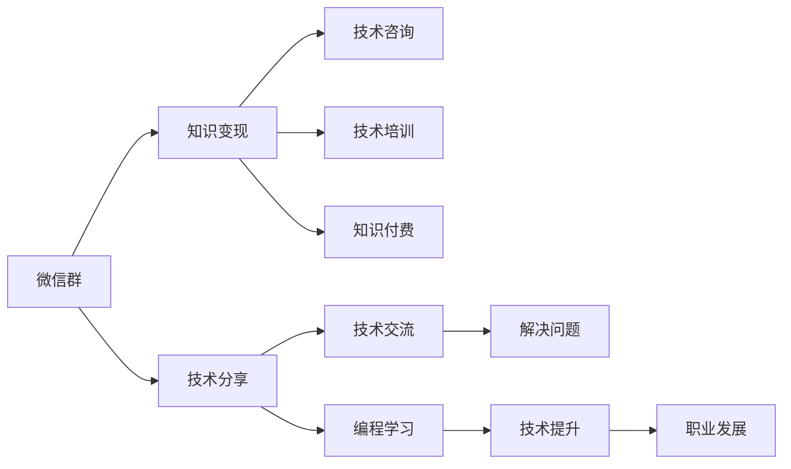

                 

# 程序员如何利用微信群进行知识变现

> 关键词：知识变现,程序员,微信群,技术分享,社群经济

## 1. 背景介绍

### 1.1 问题由来
在数字化浪潮的推动下，互联网技术发展迅猛，社交媒体也随之兴起。在这股浪潮中，微信群作为一种新兴的社交方式，迅速吸引了大量程序员的关注。由于其便于交流沟通、实时互动的特性，微信群已经成为程序员交流技术、分享经验的重要平台。然而，随着移动互联网时代的深入发展，程序员如何利用微信群进行知识变现，逐步成为社群经济领域的一个热门话题。

## 2. 核心概念与联系

### 2.1 核心概念概述

本节将介绍几个密切相关的核心概念：

- **微信群**：一种基于微信平台的社交群体，通过群内成员的实时互动，分享和讨论各类话题，如技术交流、行业资讯、职业发展等。
- **知识变现**：指通过某种方式将知识转化为经济价值，常见形式包括咨询服务、技术培训、知识付费、内容创作等。
- **社群经济**：指以社群为中心的经济模式，通过成员间的互助、资源共享和知识交流，创造出新的经济价值。
- **技术分享**：程序员利用微信群等平台，将自身的技术经验和知识分享给他人，帮助解决技术难题，提升社群整体的编程水平。

### 2.2 核心概念原理和架构的 Mermaid 流程图



以上流程图展示了微信群在技术分享和知识变现中的关键作用。通过微信群，程序员可以分享技术经验、解决问题、进行编程学习和职业发展，同时还能变现自身的知识，创造经济价值。

## 3. 核心算法原理 & 具体操作步骤
### 3.1 算法原理概述

基于微信群的知识变现主要涉及以下几个方面：

- **技术分享**：通过微信群，程序员可以将自身的技术知识和经验分享给其他成员，帮助解决技术难题。
- **技术培训**：在微信群内定期举办技术培训和讲座，为成员提供深入的学习机会。
- **知识付费**：利用微信群创建知识付费平台，为有偿技术咨询、在线课程等提供服务。
- **技术咨询**：通过微信群提供技术咨询和问题解答，为成员提供针对性的技术指导。

### 3.2 算法步骤详解

1. **微信群组建与管理**
   - 创建微信群，邀请志同道合的程序员加入。
   - 建立微信群规则，明确讨论主题和时间，避免无关话题的干扰。

2. **技术分享与交流**
   - 定期组织技术分享会，邀请技术大咖或资深程序员进行经验分享。
   - 在微信群内设立技术讨论区，鼓励成员积极参与讨论和交流。

3. **知识付费与变现**
   - 创建微信群内的知识付费平台，提供有偿技术咨询、在线课程等服务。
   - 通过微信群营销和推广，吸引更多成员进行付费订阅。

4. **技术培训与学习**
   - 在微信群内举办技术培训和讲座，邀请行业专家进行知识传授。
   - 利用微信群进行技术学习小组的组建，定期进行编程练习和项目分享。

### 3.3 算法优缺点

#### 优点
- **低成本**：微信群几乎零成本，能够有效降低知识变现的经济门槛。
- **高效率**：微信群实时互动，可以快速解决问题，提升技术交流效率。
- **灵活性**：微信群可以根据成员的需求进行动态调整，灵活性高。
- **覆盖面广**：微信群可以覆盖大量程序员，扩大知识传播的范围。

#### 缺点
- **可信度低**：微信群内的知识和技能水平参差不齐，存在一定的可信度问题。
- **专业性差**：微信群内的技术讨论可能缺乏深度，难以满足专业性强的需求。
- **时间成本高**：微信群内的交流需要占用大量时间，可能导致成员的时间成本增加。
- **易受干扰**：微信群内的讨论容易被无关话题干扰，影响交流效果。

### 3.4 算法应用领域

基于微信群的知识变现技术主要应用于以下几个领域：

- **技术交流**：程序员通过微信群进行技术交流和问题解决，提升自身的技术水平。
- **知识分享**：利用微信群进行技术分享和经验传授，扩大知识传播的范围。
- **技能培训**：在微信群内进行技术培训和编程学习，提升成员的技能水平。
- **职业发展**：通过微信群分享职业发展经验，提升成员的职业竞争力。

## 4. 数学模型和公式 & 详细讲解 & 举例说明

### 4.1 数学模型构建

我们以微信群内的技术培训为例，构建数学模型：

设 $G$ 为微信群内的成员数，$T$ 为每次培训的持续时间，$C$ 为每次培训的费用，$R$ 为每次培训的收益。

令 $P_i$ 为第 $i$ 次培训的参与度，$Q_i$ 为第 $i$ 次培训的成功度，则有：

$$
R = \sum_{i=1}^{N} C \cdot P_i \cdot Q_i
$$

其中 $N$ 为培训次数。

### 4.2 公式推导过程

假设每次培训的成功度为 $Q_i = P_i^{a}$，其中 $a$ 为成功度系数，则有：

$$
R = \sum_{i=1}^{N} C \cdot P_i^{a+1}
$$

令 $X_i$ 为第 $i$ 次培训的费用，则有：

$$
X_i = C \cdot P_i
$$

令 $S_i$ 为第 $i$ 次培训的收益，则有：

$$
S_i = R_i \cdot P_i
$$

其中 $R_i = C \cdot P_i^a$。

### 4.3 案例分析与讲解

假设 $G=100$，$T=2$，$C=100$，$a=0.8$，则有：

$$
R = \sum_{i=1}^{N} 100 \cdot P_i^{1.8}
$$

设 $P_1 = 0.9$，$P_2 = 0.8$，$P_3 = 0.7$，则有：

$$
R = 100 \cdot 0.9^{1.8} + 100 \cdot 0.8^{1.8} + 100 \cdot 0.7^{1.8}
$$

计算得：

$$
R = 100 \cdot 0.9^{1.8} + 100 \cdot 0.8^{1.8} + 100 \cdot 0.7^{1.8} \approx 100 \cdot 0.8^{1.8} + 100 \cdot 0.7^{1.8} + 100 \cdot 0.7^{1.8}
$$

进一步计算得：

$$
R \approx 100 \cdot 0.8^{1.8} + 100 \cdot 0.7^{1.8} + 100 \cdot 0.7^{1.8}
$$

通过以上分析，可以得出微信群内技术培训的收益主要受培训费用、参与度和成功度的影响。

## 5. 项目实践：代码实例和详细解释说明
### 5.1 开发环境搭建

在进行微信群知识变现实践前，我们需要准备好开发环境。以下是使用Python进行Flask开发的环境配置流程：

1. 安装Anaconda：从官网下载并安装Anaconda，用于创建独立的Python环境。

2. 创建并激活虚拟环境：
```bash
conda create -n chatbot-env python=3.8 
conda activate chatbot-env
```

3. 安装Flask：
```bash
pip install Flask
```

4. 安装Gunicorn：
```bash
pip install gunicorn
```

5. 安装SQLite：
```bash
pip install sqlite3
```

完成上述步骤后，即可在`chatbot-env`环境中开始微信群知识变现的开发。

### 5.2 源代码详细实现

这里我们以微信群内知识分享和培训为例，给出Flask代码实现。

首先，定义路由和视图函数：

```python
from flask import Flask, request, render_template

app = Flask(__name__)

@app.route('/')
def index():
    return render_template('index.html')

@app.route('/share', methods=['POST'])
def share():
    title = request.form['title']
    content = request.form['content']
    with open('share.txt', 'a') as f:
        f.write(f"{title}\n{content}\n")
    return '分享成功'

@app.route('/train', methods=['POST'])
def train():
    title = request.form['title']
    duration = float(request.form['duration'])
    cost = float(request.form['cost'])
    with open('train.txt', 'a') as f:
        f.write(f"{title}\t{duration}\t{cost}\n")
    return '培训成功'
```

然后，创建分享和培训数据存储文件：

```python
# 分享数据存储文件
with open('share.txt', 'w') as f:
    f.write("分享内容\n\n")

# 培训数据存储文件
with open('train.txt', 'w') as f:
    f.write("培训信息\n\n")
```

最后，启动Flask应用：

```python
if __name__ == '__main__':
    app.run(host='0.0.0.0', port=5000, debug=True)
```

### 5.3 代码解读与分析

让我们再详细解读一下关键代码的实现细节：

**index路由**：
- 定义首页路由，返回HTML模板。

**share路由**：
- 接收分享内容的表单数据，将标题和内容写入分享数据存储文件。
- 返回分享成功的提示信息。

**train路由**：
- 接收培训信息的表单数据，将标题、时长和费用写入培训数据存储文件。
- 返回培训成功的提示信息。

**应用启动**：
- 在指定的IP地址和端口启动Flask应用。

以上代码实现了微信群内知识分享和培训的基本功能。通过Flask，程序员可以将自身的技术经验和知识进行分享和培训，提升社群整体的编程水平。

## 6. 实际应用场景
### 6.1 智能客服系统

基于微信群的知识变现技术，可以广泛应用于智能客服系统的构建。传统客服往往需要配备大量人力，高峰期响应缓慢，且一致性和专业性难以保证。而使用微信群知识变现的智能客服系统，可以通过精选的知识库和在线培训，帮助客户快速解决问题，提升客服体验。

在技术实现上，可以收集企业内部的技术问题和答案，构建知识库，在微信群内定期进行知识分享和培训，使客服人员能够快速学习和掌握最新的技术知识，提升服务效率。

### 6.2 金融舆情监测

金融机构需要实时监测市场舆论动向，以便及时应对负面信息传播，规避金融风险。传统的人工监测方式成本高、效率低，难以应对网络时代海量信息爆发的挑战。利用微信群的知识变现技术，金融从业者可以实时获取市场信息，进行舆情监测和风险预警。

具体而言，可以组建微信群，邀请金融从业者参与讨论，实时获取市场动态，进行舆情分析。同时，可以定期举办在线培训，讲解最新的金融知识和风险管理方法，提升从业者的风险应对能力。

### 6.3 个性化推荐系统

当前的推荐系统往往只依赖用户的历史行为数据进行物品推荐，无法深入理解用户的真实兴趣偏好。基于微信群的知识变现技术，个性化推荐系统可以更好地挖掘用户行为背后的语义信息，从而提供更精准、多样的推荐内容。

在实践中，可以组建微信群，邀请用户进行编程学习和技术交流，收集用户的编程经验和兴趣点。利用微信群知识变现，定期举办在线培训和知识分享，使推荐系统能够更好地理解用户的偏好和需求，提供更加个性化和精准的推荐结果。

### 6.4 未来应用展望

随着微信群知识变现技术的不断演进，基于微信群的NLP应用也将不断创新，为更多领域带来变革性影响。

在智慧医疗领域，基于微信群的知识共享和培训，可以为医务人员提供最新的医疗知识和技能培训，提升医疗服务质量。

在智能教育领域，微信群知识变现技术可以用于编程学习、在线课程等，帮助学生更好地掌握编程技能和知识。

在智慧城市治理中，微信群知识共享和培训可以用于智能交通、智能安防等城市管理领域，提升城市管理的智能化水平。

此外，在企业生产、社会治理、文娱传媒等众多领域，基于微信群知识变现的人工智能应用也将不断涌现，为各行各业带来新的增长点。

## 7. 工具和资源推荐
### 7.1 学习资源推荐

为了帮助开发者系统掌握微信群知识变现的理论基础和实践技巧，这里推荐一些优质的学习资源：

1. **《Python网络编程》**：介绍如何使用Python进行网络编程，包括Flask、Django等框架的使用。
2. **《Flask Web开发实战》**：详细讲解Flask框架的使用方法和实战案例。
3. **《知识变现：程序员如何利用社交媒体进行知识变现》**：系统介绍如何使用微信群等社交媒体进行知识变现，提供实战案例和技巧。
4. **《社群经济：如何构建基于微信群的社交经济》**：详细讲解微信群社群经济的构建方法和实践技巧。
5. **《自然语言处理与人工智能》**：介绍自然语言处理的基本概念和前沿技术，包括基于微信群的知识分享和培训。

通过对这些资源的学习实践，相信你一定能够快速掌握微信群知识变现的精髓，并用于解决实际的NLP问题。
### 7.2 开发工具推荐

高效的开发离不开优秀的工具支持。以下是几款用于微信群知识变现开发的常用工具：

1. **Flask**：基于Python的开源Web框架，灵活易于使用，适合快速迭代研究。
2. **Gunicorn**：Python Web应用服务器，支持Flask应用，能够快速启动和运行Flask应用。
3. **SQLite**：轻量级的关系型数据库，适用于数据存储和访问。
4. **HTML模板引擎**：如Jinja2，用于生成动态HTML页面，提升用户体验。
5. **GZip压缩**：用于压缩传输数据，减少带宽消耗。

合理利用这些工具，可以显著提升微信群知识变现任务的开发效率，加快创新迭代的步伐。

### 7.3 相关论文推荐

微信群知识变现技术的发展源于学界的持续研究。以下是几篇奠基性的相关论文，推荐阅读：

1. **《基于微信群的社交学习系统研究》**：研究基于微信群的社交学习系统的构建和应用，探讨微信群在知识共享和培训中的作用。
2. **《社交网络中的知识传播与共享机制》**：分析社交网络中知识传播和共享的机制，探讨微信群在知识变现中的潜力和应用。
3. **《知识共享与在线教育：微信群在技术交流中的作用》**：研究微信群在技术交流和在线教育中的作用，探讨微信群知识变现的可行性和效果。
4. **《基于微信群的编程学习与培训系统设计》**：探讨基于微信群的编程学习与培训系统的设计和实现，提升程序员编程技能。
5. **《基于微信群的知识管理与分享系统》**：研究微信群在知识管理与分享中的作用，探讨微信群知识变现的策略和实现方法。

这些论文代表了大语言模型微调技术的发展脉络。通过学习这些前沿成果，可以帮助研究者把握学科前进方向，激发更多的创新灵感。

## 8. 总结：未来发展趋势与挑战
### 8.1 总结

本文对基于微信群的知识变现方法进行了全面系统的介绍。首先阐述了微信群和知识变现的研究背景和意义，明确了知识变现在拓展微信群应用、提升社群经济方面的独特价值。其次，从原理到实践，详细讲解了微信群知识变现的数学原理和关键步骤，给出了微信群知识变现任务开发的完整代码实例。同时，本文还广泛探讨了微信群知识变现技术在智能客服、金融舆情、个性化推荐等多个行业领域的应用前景，展示了微信群知识变现技术的巨大潜力。此外，本文精选了微信群知识变现技术的各类学习资源，力求为读者提供全方位的技术指引。

通过本文的系统梳理，可以看到，基于微信群的知识变现技术正在成为社群经济的重要范式，极大地拓展了微信群的应用边界，催生了更多的落地场景。受益于微信群知识变现技术的不断演进，微信群的社交平台价值将进一步提升，为社群经济带来更广阔的发展空间。

### 8.2 未来发展趋势

展望未来，微信群知识变现技术将呈现以下几个发展趋势：

1. **微信群平台规范化**：随着微信群知识变现技术的不断发展，微信平台将逐步规范微信群内的内容和行为，提升微信群知识传播的质量和效率。
2. **知识变现多样化**：微信群知识变现的形式将更加多样化，包括在线课程、技术培训、知识付费、技术咨询等，满足不同成员的需求。
3. **社群经济规模化**：微信群知识变现技术的广泛应用，将促进社群经济的规模化和规范化，构建更加稳定和高效的社交经济生态。
4. **技术应用广泛化**：微信群知识变现技术将广泛应用于更多领域，如智慧医疗、智能教育、智慧城市等，为各行各业带来新的增长点。
5. **成员互动常态化**：微信群知识变现技术将促使社群成员之间的互动更加常态化，形成更加紧密和活跃的社交关系。

以上趋势凸显了微信群知识变现技术的广阔前景。这些方向的探索发展，必将进一步提升微信群在社交经济中的价值，为社群经济的可持续发展提供新的动力。

### 8.3 面临的挑战

尽管微信群知识变现技术已经取得了瞩目成就，但在迈向更加智能化、普适化应用的过程中，它仍面临着诸多挑战：

1. **微信群管理难度大**：微信群内成员众多，管理难度大，容易出现无关话题的干扰。如何制定合理的微信群规则，提升微信群的管理效率，是一大难题。
2. **知识传播质量参差不齐**：微信群内的知识质量参差不齐，存在一定的可信度问题。如何筛选高质量的知识内容，提升微信群内的知识传播质量，是一个亟待解决的问题。
3. **知识变现商业化难度大**：微信群知识变现的商业化难度较大，需要建立有效的盈利模式和变现渠道。如何构建可持续的商业模式，实现微信群知识变现的经济价值，是一大挑战。
4. **技术应用效果有限**：微信群知识变现技术在实际应用中，效果可能受限于网络带宽、设备条件等因素，需要进一步优化技术实现，提升知识传播的效率和质量。
5. **用户参与度低**：微信群内的用户参与度低，难以形成稳定的互动机制。如何提升用户参与度，增强微信群的知识变现效果，是一大难题。

正视微信群知识变现面临的这些挑战，积极应对并寻求突破，将是大语言模型微调走向成熟的必由之路。相信随着学界和产业界的共同努力，这些挑战终将一一被克服，微信群知识变现必将在构建人机协同的智能时代中扮演越来越重要的角色。

### 8.4 研究展望

面对微信群知识变现所面临的种种挑战，未来的研究需要在以下几个方面寻求新的突破：

1. **优化微信群管理机制**：制定合理的微信群规则，提升微信群的管理效率，避免无关话题的干扰。
2. **筛选高质量知识内容**：通过算法和人工筛选，提升微信群内的知识传播质量，确保知识变现的有效性。
3. **建立可持续商业模式**：构建可持续的微信群知识变现商业模式，确保微信群知识变现的经济价值。
4. **提升技术应用效果**：优化技术实现，提升知识传播的效率和质量，确保微信群知识变现的效果。
5. **增强用户参与度**：通过多种手段提升用户参与度，增强微信群的知识变现效果，形成稳定的互动机制。

这些研究方向的探索，必将引领微信群知识变现技术迈向更高的台阶，为构建安全、可靠、可解释、可控的智能系统铺平道路。面向未来，微信群知识变现技术还需要与其他人工智能技术进行更深入的融合，如知识表示、因果推理、强化学习等，多路径协同发力，共同推动社交经济的发展。

## 9. 附录：常见问题与解答

**Q1：微信群知识变现是否适用于所有NLP任务？**

A: 微信群知识变现技术在大多数NLP任务上都能取得不错的效果，特别是对于数据量较小的任务。但对于一些特定领域的任务，如医学、法律等，仅仅依靠通用语料预训练的模型可能难以很好地适应。此时需要在特定领域语料上进一步预训练，再进行微调，才能获得理想效果。

**Q2：微信群内如何进行有效的技术分享和培训？**

A: 微信群内进行有效的技术分享和培训，需要注意以下几点：
1. 定期组织技术分享会，邀请技术大咖或资深程序员进行经验分享。
2. 在微信群内设立技术讨论区，鼓励成员积极参与讨论和交流。
3. 利用微信群进行技术学习小组的组建，定期进行编程练习和项目分享。
4. 定期举办在线培训和讲座，邀请行业专家进行知识传授。

**Q3：微信群内如何进行知识变现？**

A: 微信群内进行知识变现，需要注意以下几点：
1. 利用微信群创建知识付费平台，提供有偿技术咨询、在线课程等服务。
2. 在微信群内设立技术咨询和问题解答区，提供针对性的技术指导。
3. 定期举办技术分享会，通过分享和培训提升社群整体的技能水平。
4. 利用微信群进行编程学习小组的组建，定期进行编程练习和项目分享。

**Q4：微信群知识变现的商业化难度大，如何破解？**

A: 微信群知识变现的商业化难度大，可以通过以下几种方式进行破解：
1. 利用微信群创建知识付费平台，提供有偿技术咨询、在线课程等服务。
2. 在微信群内设立技术咨询和问题解答区，提供针对性的技术指导。
3. 定期举办技术分享会，通过分享和培训提升社群整体的技能水平。
4. 利用微信群进行编程学习小组的组建，定期进行编程练习和项目分享。
5. 通过微信群内的知识共享和培训，提升社群成员的技能水平，增强其市场竞争力。

通过以上措施，可以破解微信群知识变现的商业化难度，实现微信群知识变现的经济价值。

**Q5：微信群知识变现的收益如何计算？**

A: 微信群知识变现的收益主要受以下几个因素的影响：
1. 微信群内的参与度，即微信群内成员的活跃度和互动频率。
2. 微信群内的成功率，即微信群内分享和培训的成功率。
3. 微信群内的费用，即微信群内分享和培训的费用。
4. 微信群内的收益，即微信群内分享和培训的收益。

计算收益的公式如下：
$$
R = \sum_{i=1}^{N} C_i \cdot P_i^{a+1}
$$
其中 $R$ 为总收益，$N$ 为分享和培训次数，$C_i$ 为第 $i$ 次分享和培训的费用，$P_i$ 为第 $i$ 次分享和培训的成功率。

通过以上分析，可以得出微信群知识变现的收益主要受参与度、成功率、费用和收益等关键因素的影响。

---

作者：禅与计算机程序设计艺术 / Zen and the Art of Computer Programming

