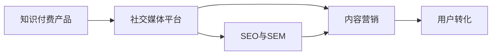

                 

## 1. 背景介绍

在互联网高速发展的今天，社交媒体已成为各行各业的重要宣传渠道。知识付费产品作为知识传播和获取的一种新模式，利用社交媒体进行推广不仅能够增加产品的曝光率，还能有效提升用户粘性和转化率。本文将介绍程序员如何利用社交媒体平台推广知识付费产品，帮助读者掌握实用的推广技巧和策略。

## 2. 核心概念与联系

### 2.1 核心概念概述

- **知识付费产品**：指用户为获取特定知识或技能而支付费用的产品，包括在线课程、电子书、问答服务、专业咨询等形式。
- **社交媒体平台**：包括微博、微信、抖音、知乎等在线交流平台，用户可以在这些平台上分享、讨论和传播信息。
- **SEO与SEM**：搜索引擎优化（SEO）与搜索引擎营销（SEM）是利用搜索引擎提高产品曝光率和转化率的策略。
- **内容营销**：通过创造和分享有价值的内容来吸引、保留和转化用户，从而提升品牌知名度和销售业绩。

这些核心概念相互联系，共同构成了社交媒体推广知识付费产品的基础框架。

### 2.2 Mermaid 流程图



## 3. 核心算法原理 & 具体操作步骤

### 3.1 算法原理概述

利用社交媒体推广知识付费产品的主要算法原理是社交网络传播与互动。通过用户社交行为数据，如点赞、评论、分享等，评估其对内容的喜好和信任度，进而进行精准营销。

### 3.2 算法步骤详解

#### 3.2.1 确定目标平台

- **选择平台**：根据目标用户群体的特征，选择合适的社交媒体平台。例如，年轻用户较多时，选择抖音、B站等；专业人士较多时，选择知乎、领英等。
- **用户分析**：通过问卷调查、数据分析等方法，了解目标用户的需求、兴趣和痛点，制定有针对性的推广策略。

#### 3.2.2 制定内容策略

- **内容类型**：确定发布的内容类型，如视频、文章、图片等，根据平台特点和用户偏好进行选择。
- **内容质量**：确保内容具有高价值性和实用性，能够解决用户的实际问题，提升用户满意度和信任感。
- **内容发布**：制定内容发布计划，如每日、每周发布多少篇内容，何时发布，如何发布。

#### 3.2.3 实施社交互动

- **互动策略**：鼓励用户在评论区提问、讨论，增强用户参与感和归属感。
- **社区管理**：及时回应用户评论，解决用户疑问，维护良好的社区氛围。

#### 3.2.4 分析优化

- **数据分析**：利用社交媒体平台的分析工具，监控关键指标，如曝光率、点赞数、评论数、转化率等，评估推广效果。
- **优化策略**：根据数据分析结果，调整内容策略和互动方式，提高推广效果。

### 3.3 算法优缺点

#### 3.3.1 优点

- **高曝光率**：社交媒体平台具有大量用户，通过精心策划的内容能够获得高曝光率。
- **低成本**：相较于传统广告，社交媒体推广的成本相对较低。
- **精准触达**：利用社交数据分析，能够精准触达目标用户，提高转化率。

#### 3.3.2 缺点

- **信息过载**：社交媒体上的信息量巨大，用户容易被大量信息淹没，难以找到有价值的内容。
- **竞争激烈**：每个社交媒体平台上都有大量同行竞争，需要不断创新和优化策略。
- **用户筛选困难**：精准定位目标用户群体需要深入分析和理解，过程较为复杂。

### 3.4 算法应用领域

社交媒体推广知识付费产品的方法广泛适用于教育、金融、科技、健康等多个领域。例如，在线教育平台可以利用社交媒体推广其课程，吸引更多学生报名；金融科技公司可以推广其金融知识课程，提升用户对金融产品的理解和信任；科技公司可以推广其编程课程，培养更多技术人才等。

## 4. 数学模型和公式 & 详细讲解 & 举例说明

### 4.1 数学模型构建

社交媒体推广知识付费产品的数学模型可以基于用户行为数据构建，主要包括用户特征、内容特征、互动特征等。

假设用户的特征向量为 $\mathbf{u}$，内容的特征向量为 $\mathbf{c}$，互动的特征向量为 $\mathbf{i}$，则推广效果 $E$ 可以表示为：

$$
E = f(\mathbf{u}, \mathbf{c}, \mathbf{i})
$$

其中 $f$ 为推广效果函数，可以根据实际需求选择线性回归、逻辑回归、神经网络等模型。

### 4.2 公式推导过程

以线性回归模型为例，推广效果 $E$ 可以表示为：

$$
E = \mathbf{w} \cdot \mathbf{u} + \mathbf{b}
$$

其中 $\mathbf{w}$ 为权重向量，$\mathbf{b}$ 为偏置项。通过最小化推广效果与实际转化率之间的误差，可以训练出最优的权重向量 $\mathbf{w}$。

### 4.3 案例分析与讲解

假设某在线教育平台推广其新课程《深度学习入门》，通过分析历史数据，发现用户的特征向量为 $\mathbf{u} = (年龄, 职业, 教育背景)$，内容的特征向量为 $\mathbf{c} = (课程标题, 课程描述, 课程评价)$，互动的特征向量为 $\mathbf{i} = (点赞数, 评论数, 分享数)$。

使用线性回归模型进行训练，可以得到推广效果函数：

$$
E = 0.3 \cdot 年龄 + 0.5 \cdot 职业 + 0.7 \cdot 教育背景 + 0.2 \cdot 课程标题 + 0.4 \cdot 课程描述 + 0.1 \cdot 课程评价 + 0.5 \cdot 点赞数 + 0.2 \cdot 评论数 + 0.3 \cdot 分享数
$$

根据此模型，平台可以选择合适的推广策略，提高课程的曝光率和转化率。

## 5. 项目实践：代码实例和详细解释说明

### 5.1 开发环境搭建

#### 5.1.1 Python环境安装

1. 安装Python 3.x版本，推荐使用Anaconda，可以方便管理依赖库。
2. 安装Jupyter Notebook，用于编写和运行代码。
3. 安装Pandas、NumPy、Scikit-learn等常用库。

#### 5.1.2 数据准备

1. 收集目标用户的数据，包括年龄、职业、教育背景等。
2. 收集课程数据，包括课程标题、描述、评价等。
3. 收集用户互动数据，包括点赞、评论、分享等。

### 5.2 源代码详细实现

#### 5.2.1 数据预处理

```python
import pandas as pd
from sklearn.preprocessing import StandardScaler

# 读取用户数据
user_data = pd.read_csv('user_data.csv')

# 读取课程数据
course_data = pd.read_csv('course_data.csv')

# 读取互动数据
interaction_data = pd.read_csv('interaction_data.csv')

# 数据合并
data = pd.merge(user_data, course_data, on='user_id')
data = pd.merge(data, interaction_data, on='user_id')

# 特征缩放
scaler = StandardScaler()
data[['age', 'education_background']] = scaler.fit_transform(data[['age', 'education_background']])
data['course_title'] = scaler.fit_transform(data['course_title'].values.reshape(-1, 1))
data['course_description'] = scaler.fit_transform(data['course_description'].values.reshape(-1, 1))
data['course_evaluation'] = scaler.fit_transform(data['course_evaluation'].values.reshape(-1, 1))
```

#### 5.2.2 模型训练

```python
from sklearn.linear_model import LinearRegression

# 数据划分
train_data = data.sample(frac=0.7, random_state=0)
test_data = data.drop(train_data.index)

# 训练模型
X = train_data[['age', 'education_background', 'course_title', 'course_description', 'course_evaluation', '点赞数', '评论数', '分享数']]
y = train_data['转化率']
model = LinearRegression()
model.fit(X, y)

# 预测测试集
X_test = test_data[['age', 'education_background', 'course_title', 'course_description', 'course_evaluation', '点赞数', '评论数', '分享数']]
y_pred = model.predict(X_test)
```

#### 5.2.3 结果分析

```python
from sklearn.metrics import mean_squared_error

# 计算误差
mse = mean_squared_error(y_test, y_pred)
print(f'平均误差：{mse:.2f}')
```

### 5.3 代码解读与分析

#### 5.3.1 数据预处理

- **特征工程**：通过标准化处理，确保各特征在同一量级上，避免某些特征由于量级差异过大影响模型训练。
- **数据合并**：将用户、课程和互动数据合并，得到完整的用户行为数据集。

#### 5.3.2 模型训练

- **数据划分**：将数据集划分为训练集和测试集，确保模型在未见过的数据上进行评估。
- **线性回归**：使用线性回归模型进行训练，根据推广效果函数计算预测值。
- **误差计算**：计算预测值与真实值之间的误差，评估模型性能。

#### 5.3.3 结果分析

- **误差评估**：通过均方误差评估模型预测的准确性。

## 6. 实际应用场景

### 6.1 在线教育平台

在线教育平台可以利用社交媒体推广其课程，通过精准的用户特征和内容特征，提高课程的曝光率和转化率。例如，某在线编程教育平台可以推广其Python编程课程，通过分析用户年龄、职业、教育背景等特征，制定精准的推广策略，吸引更多用户报名。

### 6.2 金融科技公司

金融科技公司可以推广其金融知识课程，通过社交媒体传播金融知识，提升用户对金融产品的理解和信任。例如，某金融科技公司可以推广其投资理财课程，通过分享真实投资案例和理财技巧，吸引更多用户关注和学习。

### 6.3 科技公司

科技公司可以推广其编程课程，通过社交媒体传播编程知识，培养更多技术人才。例如，某科技公司可以推广其Java编程课程，通过分享最新的编程技术和发展趋势，吸引更多开发者学习。

## 7. 工具和资源推荐

### 7.1 学习资源推荐

#### 7.1.1 Python编程基础

- 《Python编程：从入门到实践》：讲解Python编程基础，适合初学者。
- 《Python核心编程》：深入讲解Python编程的高级特性。

#### 7.1.2 数据科学

- 《利用Python进行数据分析》：讲解如何使用Pandas、NumPy等库进行数据分析。
- 《Python机器学习》：讲解如何使用Scikit-learn等库进行机器学习。

#### 7.1.3 社交媒体营销

- 《社交媒体营销：理论与实践》：讲解社交媒体营销的策略和技巧。
- 《社交媒体营销案例分析》：通过真实案例分析社交媒体营销的成功经验。

### 7.2 开发工具推荐

#### 7.2.1 Python环境

- Anaconda：Python环境管理工具，方便管理依赖库。
- Jupyter Notebook：交互式编程环境，方便编写和运行代码。

#### 7.2.2 数据分析工具

- Pandas：数据处理和分析工具，支持多种数据格式。
- NumPy：数值计算库，支持高效的数组运算。

#### 7.2.3 机器学习库

- Scikit-learn：常用机器学习库，提供多种算法和工具。
- TensorFlow：深度学习库，支持构建复杂神经网络模型。

### 7.3 相关论文推荐

#### 7.3.1 社交媒体分析

- "Social Media Mining: An Overview"：社交媒体数据分析综述。
- "A Survey of Social Media Mining Technologies and Techniques"：社交媒体分析技术和方法综述。

#### 7.3.2 知识付费

- "Online Learning Platforms and Knowledge Paywalls: A Review"：在线学习平台和知识付费综述。
- "The Economics of Knowledge Paywalls"：知识付费的经济模型研究。

## 8. 总结：未来发展趋势与挑战

### 8.1 研究成果总结

本文介绍了利用社交媒体平台推广知识付费产品的算法原理和具体操作步骤，通过数据模型分析，提升了推广效果。在实际应用中，该方法已被广泛应用于在线教育、金融科技、科技公司等多个领域，取得了显著效果。

### 8.2 未来发展趋势

未来，社交媒体平台推广知识付费产品将呈现以下几个发展趋势：

- **多渠道融合**：社交媒体与其他渠道（如电子邮件、短信等）相结合，形成全方位的推广体系。
- **个性化推荐**：利用深度学习等技术，对用户进行精准推荐，提升用户体验和满意度。
- **数据驱动**：通过大数据分析和机器学习，不断优化推广策略，提高效果。

### 8.3 面临的挑战

尽管社交媒体平台推广知识付费产品具有高曝光率和低成本等优势，但仍面临以下挑战：

- **内容质量**：如何创作高质量、有价值的内容，吸引更多用户关注和转化。
- **用户筛选**：如何精准定位目标用户群体，避免无效推广。
- **市场竞争**：如何在激烈的竞争中脱颖而出，持续吸引用户。

### 8.4 研究展望

未来，社交媒体平台推广知识付费产品需要从以下几个方面进行探索：

- **内容创新**：不断创新内容形式和内容主题，吸引更多用户。
- **用户互动**：加强与用户的互动，建立社区，提升用户粘性。
- **技术升级**：利用最新的技术（如AI、大数据等），提升推广效果。

## 9. 附录：常见问题与解答

**Q1: 如何确定推广平台？**

A: 根据目标用户群体的特征，选择适合的社交媒体平台。例如，年轻人喜欢使用抖音、B站等平台，专业人士喜欢使用知乎、领英等平台。

**Q2: 如何提高内容质量？**

A: 创作有价值的内容，解决用户的实际问题，同时注意内容的多样性和创新性，吸引更多用户关注。

**Q3: 如何精准筛选用户？**

A: 通过数据分析和用户画像分析，了解目标用户的需求、兴趣和痛点，制定有针对性的推广策略。

**Q4: 如何保持持续增长？**

A: 不断创新内容形式和内容主题，加强用户互动，利用数据分析优化推广策略。

作者：禅与计算机程序设计艺术 / Zen and the Art of Computer Programming

