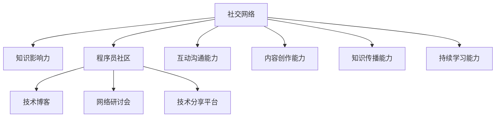

                 

# 程序员如何利用社交网络扩大知识影响力

> 关键词：社交网络, 知识影响力, 程序员, 开源社区, 技术博客, 网络研讨会, 技术分享

## 1. 背景介绍

### 1.1 问题由来
随着互联网的普及和技术的飞速发展，社交网络平台成为了人们获取信息、交流思想的重要渠道。程序员作为一个技术驱动的群体，也越来越意识到社交网络在扩展知识影响力方面的巨大潜力。通过利用社交网络，程序员不仅可以分享自己的技术见解和项目成果，还能及时获取最新的技术动态和行业趋势。然而，社交网络信息的繁杂性和碎片化，也使得程序员在知识传播和影响力提升上面临着诸多挑战。本文旨在探讨程序员如何利用社交网络，有效地扩大自己的知识影响力。

### 1.2 问题核心关键点
要利用社交网络扩大知识影响力，程序员需要具备以下核心能力：

- **内容创作能力**：在社交网络上定期发布高质量的技术文章、项目报告、代码示例等。
- **互动沟通能力**：与社区成员进行有效的互动，建立良好的社区关系，获取更多关注和反馈。
- **知识传播能力**：利用各种社交工具和平台，如Twitter、GitHub、Stack Overflow等，广泛传播自己的技术见解和项目成果。
- **持续学习能力**：通过社交网络不断获取新知识，参与技术讨论和项目合作，保持技术领先。

本文章将围绕这些核心能力，详细讲解如何利用社交网络，提升程序员的知识影响力。

## 2. 核心概念与联系

### 2.1 核心概念概述

为更好地理解程序员如何利用社交网络扩大知识影响力，本节将介绍几个密切相关的核心概念：

- **社交网络**：指的是通过互联网连接起来的个体和组织，个人可以通过社交网络获取信息、建立联系、分享知识。
- **知识影响力**：指的是个体或组织通过分享知识、技术见解等，对他人或组织产生的影响力和认同感。
- **程序员社区**：指的是由程序员组成的网络群体，通过技术交流、项目合作等方式，共同推进技术进步和发展。
- **技术博客**：程序员在博客平台上发布的技术文章，包括技术教程、项目实践、学习心得等。
- **网络研讨会**：通过视频会议等形式，程序员在社交网络上与其他开发者分享经验、交流技术、讨论问题。
- **技术分享平台**：如Stack Overflow、GitHub等，程序员在此类平台上展示自己的代码、项目，参与技术讨论。

这些核心概念之间的逻辑关系可以通过以下Mermaid流程图来展示：



这个流程图展示了一个程序员通过社交网络提升知识影响力的核心路径：

1. 利用社交网络建立联系。
2. 通过内容创作分享知识。
3. 在社区内进行互动和讨论。
4. 利用技术分享平台展示成果。
5. 通过多种渠道传播影响力。
6. 持续学习和获取新知识。

## 3. 核心算法原理 & 具体操作步骤
### 3.1 算法原理概述

利用社交网络扩大知识影响力，本质上是一个内容创作和传播的优化过程。其核心思想是：通过在社交网络平台上发布高质量、有价值的内容，与社区成员进行有效互动，并利用多种传播渠道，使知识影响力最大化。

具体来说，这一过程包括以下几个关键步骤：

- **内容创作**：在社交网络上发布技术文章、项目报告、代码示例等，展示自己的技术能力和项目成果。
- **互动沟通**：与社区成员进行评论、点赞、提问和回答，建立良好的社区关系。
- **知识传播**：利用Twitter、GitHub、Stack Overflow等平台，广泛传播自己的技术见解和项目成果。
- **持续学习**：通过社交网络不断获取新知识，参与技术讨论和项目合作，保持技术领先。

### 3.2 算法步骤详解

以下是利用社交网络提升知识影响力的具体操作步骤：

**Step 1: 选择社交平台**

- **GitHub**：代码托管和版本控制平台，展示项目成果和代码质量。
- **Stack Overflow**：技术问答平台，展示技术能力并参与问题解决。
- **Twitter**：分享技术见解、最新趋势、行业动态。
- **LinkedIn**：建立职业网络，展示技术背景和项目经验。
- **Medium**：技术博客平台，发布深度技术文章和项目案例。

**Step 2: 内容创作**

- **技术文章**：撰写深入浅出的技术文章，涵盖代码实现、项目经验、学习心得等。
- **代码示例**：编写简洁实用的代码示例，展示技术栈和最佳实践。
- **项目报告**：撰写项目报告，介绍项目背景、实现过程和成果展示。
- **技术分享**：录制技术分享视频，展示项目演示和讲解。

**Step 3: 互动沟通**

- **评论和点赞**：对社区内的其他文章、代码和项目进行评论和点赞，建立积极互动。
- **提问和回答**：在技术问答平台上提出问题并回答问题，展示自己的技术水平和乐于助人的精神。
- **参加讨论**：积极参加技术讨论和项目合作，分享自己的技术见解和经验。

**Step 4: 知识传播**

- **利用社交媒体**：通过Twitter、LinkedIn等平台，分享自己的技术文章、代码示例和项目成果。
- **开源项目**：将项目代码托管在GitHub上，获取更多关注和贡献。
- **技术博客**：在Medium等技术博客平台上发布深度文章，展示技术深度和创新性。
- **网络研讨会**：通过视频会议平台，分享技术经验和项目成果，扩大影响力。

**Step 5: 持续学习**

- **关注最新趋势**：通过社交网络关注最新的技术趋势和行业动态，保持技术领先。
- **参与项目合作**：参与开源项目和社区合作，学习新知识和提升技术能力。
- **阅读学习资料**：利用社交网络获取最新的学习资料和研究论文，提升技术水平。

### 3.3 算法优缺点

利用社交网络扩大知识影响力的方法具有以下优点：

1. **传播范围广**：通过社交网络平台，可以将知识传播到全球范围内，触达更多的开发者和技术爱好者。
2. **交流互动性强**：通过评论、点赞、提问和回答等互动方式，可以与社区成员建立良好的关系，提升知名度。
3. **展示平台多**：通过GitHub、Stack Overflow、Twitter等平台，可以在多个维度展示自己的技术能力和项目成果。
4. **持续学习**：通过社交网络不断获取新知识，保持技术领先和创新。

同时，该方法也存在一些缺点：

1. **内容质量要求高**：发布高质量、有价值的内容，才能获得更多关注和互动。
2. **时间成本高**：内容创作、互动沟通、知识传播都需要花费大量时间和精力。
3. **隐私和安全风险**：社交网络上的隐私和安全问题需要注意，避免敏感信息泄露。
4. **过度依赖社交平台**：过于依赖社交平台，可能导致知识传播渠道单一，影响效果。

尽管存在这些局限性，但就目前而言，利用社交网络扩大知识影响力的方法仍然是最有效的技术传播方式之一。未来相关研究的重点在于如何进一步降低时间成本，提高内容创作效率，同时兼顾隐私安全。

### 3.4 算法应用领域

利用社交网络扩大知识影响力的方法已经在软件开发、技术培训、项目合作等多个领域得到了广泛应用，具体如下：

- **软件开发**：利用GitHub和Stack Overflow展示代码和项目成果，获取更多关注和贡献。
- **技术培训**：通过Medium和YouTube等平台，发布技术教程和项目案例，帮助他人学习和提升。
- **项目合作**：参与开源项目和社区合作，学习新知识和提升技术能力。
- **技术分享**：利用Twitter和LinkedIn等平台，分享技术见解和行业动态，提升知名度和影响力。

## 4. 数学模型和公式 & 详细讲解 & 举例说明

### 4.1 数学模型构建

假设程序员在社交网络平台上的知识影响力为 $I$，其主要由以下几个因素决定：

- $C$：内容创作能力，表示发布高质量技术文章和代码示例的数量和质量。
- $I$：互动沟通能力，表示与社区成员互动的频率和质量。
- $S$：知识传播能力，表示通过各种平台传播知识的影响范围。
- $L$：持续学习能力，表示获取新知识和参与技术讨论的频率。

则知识影响力的数学模型可以表示为：

$$
I = f(C, I, S, L)
$$

其中 $f$ 为非线性函数，表示各因素对知识影响力的综合影响。

### 4.2 公式推导过程

为了简化问题，我们可以假设 $f$ 函数为线性函数，即：

$$
I = aC + bI + cS + dL
$$

其中 $a, b, c, d$ 为系数，表示各因素对知识影响力的贡献。

根据实际情况，我们可以进一步假设各系数的大小关系和具体值。例如，假设内容创作对知识影响力的贡献最大，互动沟通次之，知识传播和持续学习的作用较小，可以给出如下的公式：

$$
I = 0.6C + 0.3I + 0.1S + 0.1L
$$

### 4.3 案例分析与讲解

以一位名叫Alice的程序员为例，她利用社交网络扩大知识影响力。

假设Alice每周在GitHub上发布一篇技术文章，在Twitter上分享技术见解，在Stack Overflow上积极回答问题和参与讨论，在Medium上发布深度文章。根据公式，我们可以计算她的知识影响力：

- $C = 1$（每周发布一篇文章）
- $I = 2$（每周回答两次问题）
- $S = 1$（每周分享一次技术见解）
- $L = 1$（每周参与一次讨论）

代入公式得：

$$
I = 0.6 \times 1 + 0.3 \times 2 + 0.1 \times 1 + 0.1 \times 1 = 1.2
$$

这意味着Alice的知识影响力为1.2，相较于未参与社交网络的技术人员，她的影响力显著提升。

## 5. 项目实践：代码实例和详细解释说明

### 5.1 开发环境搭建

在进行社交网络知识影响力提升的实践前，我们需要准备好开发环境。以下是使用Python进行PyTorch开发的环境配置流程：

1. 安装Anaconda：从官网下载并安装Anaconda，用于创建独立的Python环境。

2. 创建并激活虚拟环境：
```bash
conda create -n pytorch-env python=3.8 
conda activate pytorch-env
```

3. 安装PyTorch：根据CUDA版本，从官网获取对应的安装命令。例如：
```bash
conda install pytorch torchvision torchaudio cudatoolkit=11.1 -c pytorch -c conda-forge
```

4. 安装各类工具包：
```bash
pip install numpy pandas scikit-learn matplotlib tqdm jupyter notebook ipython
```

完成上述步骤后，即可在`pytorch-env`环境中开始实践。

### 5.2 源代码详细实现

这里我们以GitHub为例，展示如何在社交网络平台上发布和展示代码。

首先，创建一个GitHub账号并创建新仓库，将项目代码上传至仓库。

然后，在GitHub上发布项目和代码的README文件，介绍项目背景、实现过程和使用方法。

接着，在GitHub页面上设置GitHub Pages，将README文件通过GitHub Pages展示在互联网上，方便他人访问。

最后，在GitHub上添加项目链接到个人博客或技术文章中，进一步扩大项目的影响力。

### 5.3 代码解读与分析

**README文件**：
- **项目介绍**：介绍项目背景、目标和意义。
- **实现过程**：描述项目的详细实现过程和关键技术点。
- **使用方法**：介绍如何使用项目，包括示例代码和运行结果。

**GitHub Pages**：
- **静态网页**：通过GitHub Pages生成的静态网页，可以直接访问，方便展示项目和代码。
- **定期更新**：定期更新README文件，保持项目文档的时效性和准确性。

**项目链接**：
- **博客文章**：在技术博客上发布项目介绍和技术实现，引用GitHub项目链接。
- **技术分享**：在视频会议和网络研讨会上介绍项目，分享代码和技术见解，进一步扩大影响力。

## 6. 实际应用场景

### 6.1 软件开发

利用社交网络平台展示代码和项目成果，可以吸引更多开发者关注和贡献。例如，GitHub上许多开源项目通过展示高质量的代码和文档，获得了大量开发者参与和贡献，迅速成长为行业标准。

### 6.2 技术培训

通过社交网络平台发布技术教程和项目案例，可以帮助他人学习和提升技术能力。例如，Medium上的技术博客可以分享深度学习、数据科学、Web开发等领域的最新技术和实战经验，吸引了大量技术爱好者关注和参与。

### 6.3 项目合作

参与开源项目和社区合作，可以学习新知识和提升技术能力。例如，通过参与Stack Overflow上的技术讨论和问题解决，程序员可以与其他开发者分享经验和知识，提升自己的技术水平。

### 6.4 技术分享

利用Twitter和LinkedIn等平台分享技术见解和行业动态，可以提升知名度和影响力。例如，Twitter上的技术大V通过分享最新的技术趋势和行业动态，建立了广泛的社区关系，影响力显著提升。

## 7. 工具和资源推荐

### 7.1 学习资源推荐

为了帮助开发者系统掌握如何利用社交网络扩大知识影响力，这里推荐一些优质的学习资源：

1. **GitHub官方文档**：GitHub使用指南，包括账号创建、仓库管理、Git操作等内容，是GitHub开发的必备资源。
2. **Stack Overflow官方文档**：Stack Overflow使用指南，包括问题提交、回答编辑、社区互动等内容，是技术问答平台的必备资源。
3. **Medium官方文档**：Medium博客平台的使用指南，包括博客创建、文章发布、阅读评论等内容，是技术分享平台的必备资源。
4. **《社交网络编程》书籍**：详细介绍了社交网络平台的技术原理和应用案例，是社交网络开发的经典著作。
5. **《程序员社交网络》视频课程**：讲解如何使用社交网络平台，提升程序员的知识影响力，是技术培训的重要资源。

通过对这些资源的学习实践，相信你一定能够快速掌握如何利用社交网络，提升知识影响力。

### 7.2 开发工具推荐

高效的开发离不开优秀的工具支持。以下是几款用于社交网络知识影响力提升开发的常用工具：

1. **GitHub**：代码托管和版本控制平台，展示项目成果和代码质量。
2. **Stack Overflow**：技术问答平台，展示技术能力并参与问题解决。
3. **Twitter**：分享技术见解、最新趋势、行业动态。
4. **LinkedIn**：建立职业网络，展示技术背景和项目经验。
5. **Medium**：技术博客平台，发布深度技术文章和项目案例。
6. **WeChat**：微信平台，通过公众号、小程序等形式，分享技术见解和项目成果。
7. **YouTube**：视频分享平台，录制技术分享视频，展示项目演示和讲解。

合理利用这些工具，可以显著提升社交网络知识影响力的提升效率，加快创新迭代的步伐。

### 7.3 相关论文推荐

社交网络知识影响力的提升涉及多个学科领域，以下是几篇相关论文，推荐阅读：

1. **《社交网络分析与数据挖掘》**：详细介绍了社交网络分析的基本方法和应用案例，是社交网络开发的经典著作。
2. **《知识传播模型研究》**：研究知识在社交网络中的传播规律和影响因素，为知识传播提供了理论基础。
3. **《技术社区发展研究》**：探讨技术社区的构建和管理，为技术分享提供了实际案例。
4. **《网络研讨会技术》**：讲解视频会议和网络研讨会的技术和应用，是技术分享的重要资源。

这些论文代表了大语言模型微调技术的发展脉络。通过学习这些前沿成果，可以帮助研究者把握学科前进方向，激发更多的创新灵感。

## 8. 总结：未来发展趋势与挑战

### 8.1 总结

本文对如何利用社交网络扩大知识影响力进行了全面系统的介绍。首先阐述了程序员如何通过社交网络获取信息、交流思想、分享成果等核心能力，明确了利用社交网络提升知识影响力的关键路径。其次，从原理到实践，详细讲解了如何发布高质量内容、进行有效互动、利用多种传播渠道，实现了知识影响力的最大化。最后，本文还探讨了如何通过社交网络不断获取新知识、保持技术领先，进一步提升了知识传播效果。

通过本文的系统梳理，可以看到，利用社交网络平台，程序员可以极大地提升知识影响力，扩大了技术传播的范围和效果。未来，随着社交网络的不断发展和创新，利用社交网络提升知识影响力的途径也将不断丰富和优化。

### 8.2 未来发展趋势

展望未来，利用社交网络扩大知识影响力的方法将呈现以下几个发展趋势：

1. **内容创作多样化**：除了技术文章和代码示例，还包括视频、播客、直播等多样化的内容形式，进一步丰富知识传播渠道。
2. **互动沟通高效化**：利用智能推荐和自动回复技术，提高互动沟通的效率和质量，增加社区成员的参与度。
3. **知识传播全球化**：社交网络平台不断扩大国际化的范围，全球开发者和技术爱好者可以更方便地获取知识和分享成果。
4. **技术分享动态化**：通过实时直播、即时互动等动态形式，实时分享最新技术和行业动态，提升知识传播的及时性和互动性。
5. **社区管理智能化**：利用人工智能技术进行社区内容推荐和质量控制，保持社区环境的健康和有序。

这些趋势将进一步提升利用社交网络扩大知识影响力的效果，使得技术传播更加高效、广泛、动态。

### 8.3 面临的挑战

尽管利用社交网络扩大知识影响力的方法已经取得了一定的成效，但在迈向更加智能化、普适化应用的过程中，它仍面临着诸多挑战：

1. **时间成本高**：发布高质量内容、互动沟通、传播知识都需要花费大量时间和精力，开发者的精力和时间有限。
2. **内容质量要求高**：高质量的内容是获得关注和互动的前提，内容创作难度较大。
3. **隐私和安全风险**：社交网络上的隐私和安全问题需要注意，避免敏感信息泄露。
4. **过度依赖社交平台**：过于依赖社交平台，可能导致知识传播渠道单一，影响效果。

尽管存在这些挑战，但通过不断优化内容创作流程、提高互动沟通效率、加强隐私保护，这些问题可以得到有效解决。

### 8.4 研究展望

未来的研究需要在以下几个方面寻求新的突破：

1. **自动化内容创作**：利用人工智能技术进行内容生成和推荐，降低内容创作的难度和成本。
2. **智能互动沟通**：利用智能推荐和自动回复技术，提高互动沟通的效率和质量。
3. **跨平台传播**：通过多个社交平台进行知识传播，扩大传播范围和效果。
4. **持续学习系统**：利用智能推荐系统，持续获取新知识，保持技术领先和创新。

这些研究方向将进一步提升利用社交网络扩大知识影响力的效果，使得技术传播更加高效、广泛、动态。

## 9. 附录：常见问题与解答

**Q1：利用社交网络扩大知识影响力需要哪些核心能力？**

A: 利用社交网络扩大知识影响力需要以下核心能力：

1. **内容创作能力**：在社交网络上发布高质量的技术文章、代码示例等。
2. **互动沟通能力**：与社区成员进行评论、点赞、提问和回答，建立良好的社区关系。
3. **知识传播能力**：利用Twitter、GitHub、Stack Overflow等平台，广泛传播自己的技术见解和项目成果。
4. **持续学习能力**：通过社交网络不断获取新知识，参与技术讨论和项目合作，保持技术领先。

**Q2：如何选择合适的社交平台？**

A: 选择合适的社交平台需要考虑以下几个因素：

1. **目标受众**：不同的社交平台针对不同的用户群体，选择与自己目标受众匹配的平台。
2. **平台特性**：不同的平台具有不同的特性，如GitHub适合代码托管，Stack Overflow适合技术问答，Twitter适合分享见解等。
3. **内容形式**：不同的平台支持的内容形式不同，如GitHub适合代码展示，Medium适合深度文章，YouTube适合视频分享等。

**Q3：如何高效利用社交网络提升知识影响力？**

A: 高效利用社交网络提升知识影响力需要以下几个步骤：

1. **发布高质量内容**：发布技术文章、代码示例、项目报告等高质量内容，展示自己的技术能力和项目成果。
2. **积极互动沟通**：与社区成员进行评论、点赞、提问和回答，建立良好的社区关系。
3. **利用多种传播渠道**：通过GitHub、Twitter、Stack Overflow等平台，广泛传播自己的技术见解和项目成果。
4. **持续学习和合作**：通过社交网络不断获取新知识，参与技术讨论和项目合作，保持技术领先和创新。

**Q4：如何降低利用社交网络的时间成本？**

A: 降低利用社交网络的时间成本需要以下几个步骤：

1. **自动化工具**：利用自动化工具进行内容创作和互动沟通，如自动回复、内容生成器等。
2. **批量发布**：将内容创作和发布批量处理，减少重复性工作。
3. **时间管理**：合理安排时间，将社交网络知识影响力提升融入日常工作和学习中。

**Q5：如何保护社交网络上的隐私和安全？**

A: 保护社交网络上的隐私和安全需要以下几个步骤：

1. **隐私设置**：设置合适的隐私设置，控制个人信息的公开程度。
2. **数据保护**：避免在社交网络上分享敏感信息，如身份证号码、银行账号等。
3. **安全措施**：使用强密码、多因素认证等安全措施，保护账户安全。

这些问题是程序员在利用社交网络扩大知识影响力过程中可能遇到的常见问题，通过理解和应对，可以更好地利用社交网络提升知识影响力。

---

作者：禅与计算机程序设计艺术 / Zen and the Art of Computer Programming

