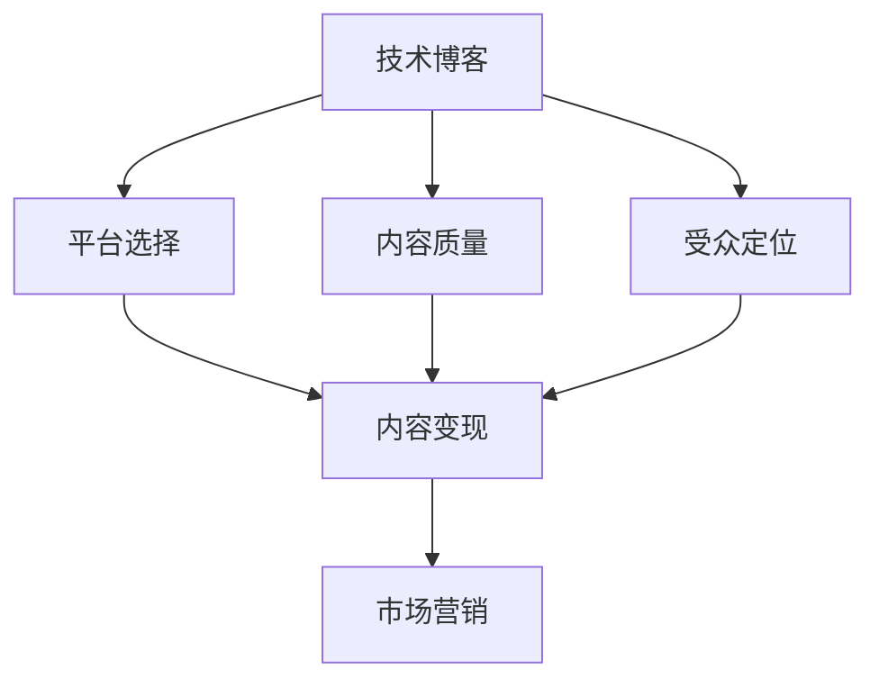

                 

# 程序员如何将技术博客转化为付费专栏

> 关键词：技术博客,内容变现,平台选择,内容质量,受众定位,市场营销

## 1. 背景介绍

随着互联网的发展，越来越多的程序员开始通过技术博客分享自己的技术心得和行业见解。这些博客不仅成为了个人品牌的展示窗口，也成为了吸引读者和增加收入的重要途径。然而，将博客转化为付费专栏并不是一件简单的事情。本文将系统梳理如何通过高质量的内容、精准的受众定位和有效的市场营销策略，将技术博客成功转化为付费专栏。

## 2. 核心概念与联系

### 2.1 核心概念概述

为了更好地理解如何将技术博客转化为付费专栏，本节将介绍几个核心概念：

- **技术博客**：指程序员或IT爱好者在互联网上分享技术心得、行业趋势、项目案例等内容的博客平台。
- **内容变现**：指通过博客内容吸引用户关注，并通过广告、会员订阅、付费专栏等方式实现收入的过程。
- **平台选择**：选择合适的博客平台和付费平台，是内容变现的重要基础。
- **内容质量**：高质量的内容是吸引用户和提高用户粘性的关键。
- **受众定位**：明确目标受众，提供符合其需求的内容。
- **市场营销**：通过各种渠道和策略，吸引目标受众关注和付费。

这些核心概念之间存在密切联系。只有通过选择合适的平台，提供高质量的内容，并精准定位受众和进行有效市场营销，才能实现从技术博客到付费专栏的顺利转化。

### 2.2 核心概念原理和架构的 Mermaid 流程图



这个流程图展示了大语言模型微调的核心概念及其之间的关系：

1. **技术博客**：通过内容产出吸引用户关注。
2. **平台选择**：选择合适的平台进行内容发布。
3. **内容质量**：保证内容的高质量以吸引用户订阅。
4. **受众定位**：精准定位目标受众，提供符合其需求的内容。
5. **内容变现**：通过平台提供的内容变现功能实现收入。
6. **市场营销**：通过各种渠道和策略吸引目标受众关注和付费。

这些概念共同构成了技术博客向付费专栏转化的整体框架，帮助理解各环节之间的相互作用。

## 3. 核心算法原理 & 具体操作步骤

### 3.1 算法原理概述

技术博客向付费专栏的转化过程，本质上是通过提高内容价值和受众粘性，从而实现内容的变现。这一过程涉及多个环节，包括内容创作、平台选择、受众定位和市场营销。

- **内容创作**：高质量的内容是吸引用户关注和付费的核心。
- **平台选择**：选择合适的平台，提供内容变现功能。
- **受众定位**：精准定位目标受众，提供符合其需求的内容。
- **市场营销**：通过各种渠道和策略，吸引目标受众关注和付费。

### 3.2 算法步骤详解

以下是技术博客向付费专栏转化的详细步骤：

**Step 1: 内容创作**

1. **选题**：选择合适的技术主题，确保内容有吸引力。
2. **调研**：深入了解目标受众的需求和兴趣点。
3. **编写**：撰写高质量、富有洞察力的文章。
4. **迭代**：根据用户反馈不断优化内容。

**Step 2: 平台选择**

1. **平台调研**：选择具备付费功能的博客平台，如Medium、CSDN、博客园等。
2. **功能评估**：评估平台的内容变现功能和用户粘性机制。
3. **平台注册**：注册并开通付费订阅功能。

**Step 3: 受众定位**

1. **目标受众分析**：通过问卷、评论等手段了解目标受众。
2. **内容适配**：根据受众需求调整内容创作方向。
3. **品牌打造**：通过一致的内容风格和品牌形象，吸引受众。

**Step 4: 市场营销**

1. **多渠道推广**：利用社交媒体、邮件列表等渠道推广内容。
2. **互动营销**：通过社群、问答等形式增加用户粘性。
3. **会员计划**：设计有吸引力的会员计划，提供专属内容。

### 3.3 算法优缺点

将技术博客转化为付费专栏的方法具有以下优点：

1. **提高收入**：通过内容变现，增加个人或团队的收入来源。
2. **提升品牌**：通过高质量内容展示专业形象，提升品牌知名度。
3. **增加用户粘性**：提供专属内容，吸引并保持忠实用户。

然而，该方法也存在一些局限性：

1. **时间成本高**：内容创作和市场营销需要大量时间和精力。
2. **市场需求变化快**：需要持续关注技术动态和市场需求，及时调整内容方向。
3. **内容质量要求高**：高质量的内容产出难度较大，需要不断提升内容创作能力。

### 3.4 算法应用领域

基于以上步骤和技术博客转化方法，该技术可以应用于以下领域：

- **技术培训**：通过高质量教程和实战案例，吸引程序员学习。
- **行业分析**：分享行业趋势和洞察，吸引专业人士关注。
- **产品推广**：通过技术博客推广自己的产品或服务。
- **社区建设**：吸引技术爱好者加入社区，共同探讨技术问题。

## 4. 数学模型和公式 & 详细讲解 & 举例说明

### 4.1 数学模型构建

设博客内容的质量为 $Q$，受众的粘性为 $S$，营销策略的有效性为 $M$，则总收入 $R$ 可以表示为：

$$
R = f(Q,S,M)
$$

其中 $f$ 为非线性函数，表示总收入与质量、粘性、策略之间的复杂关系。

### 4.2 公式推导过程

以博客内容的点击率为例，设点击率为 $C$，受众的付费率为 $P$，则总收入 $R$ 可以表示为：

$$
R = C \times P \times Q
$$

通过不断优化 $Q$、$C$ 和 $P$，可以最大化总收入 $R$。

### 4.3 案例分析与讲解

假设某技术博客在三个月内，每月吸引 1000 名新用户订阅，订阅费用为 5 美元/月，每次阅读点击率为 10%，点击到付费用户的转化率为 20%。则三个月内的总收入 $R$ 可以计算为：

$$
R = 1000 \times 0.1 \times 0.2 \times 3 \times 5 = 6000 \text{美元}
$$

如果博客质量得到进一步提升，受众粘性增加，则总收入 $R$ 将进一步增长。

## 5. 项目实践：代码实例和详细解释说明

### 5.1 开发环境搭建

在进行技术博客内容创作和平台选择时，首先需要搭建开发环境。以下是使用Python进行内容管理和平台选择的步骤：

1. **安装Python**：从官网下载并安装Python 3.8及以上版本。
2. **安装Django**：使用pip安装Django，作为博客平台的后端管理工具。
3. **配置数据库**：安装MySQL或PostgreSQL，并配置Django后端数据库。
4. **安装CMS**：选择适合的技术博客CMS（内容管理系统），如WordPress、BlogEngine等。
5. **集成广告平台**：选择适合的广告平台，如Google AdSense、CSDN广告等。

### 5.2 源代码详细实现

假设我们使用Django搭建博客平台，以下是主要内容实现的代码示例：

```python
# 导入相关库
from django.shortcuts import render
from django.http import HttpResponse

# 定义视图函数
def index(request):
    return render(request, 'index.html', {'context': {'title': 'My Tech Blog'}})

# 启动Django开发服务器
python manage.py runserver
```

通过以上代码，可以简单搭建一个Django博客平台，并进行内容管理和用户管理。

### 5.3 代码解读与分析

**Django**：Django是一个基于Python的Web框架，提供强大的内容管理和用户认证功能，适合快速搭建技术博客。

**CMS**：选择适合的CMS系统，可以简化内容管理的复杂度，提高开发效率。

**广告平台集成**：通过集成Google AdSense等广告平台，实现内容变现。

## 6. 实际应用场景

### 6.1 技术培训

某IT培训机构希望通过博客平台推广其技术培训课程，吸引更多的学员报名。

**操作步骤**：
1. **内容创作**：创建针对不同课程的技术文章，吸引用户关注。
2. **平台选择**：选择具备内容变现功能的博客平台，如CSDN、博客园等。
3. **受众定位**：通过数据分析了解目标受众，提供符合其需求的内容。
4. **市场营销**：利用社交媒体推广内容，吸引学员报名。

**效果评估**：
通过持续的内容更新和高质量的文章，吸引更多学员报名，增加培训课程的曝光率和用户粘性。

### 6.2 行业分析

某科技公司希望通过技术博客分享行业趋势和洞察，提升品牌知名度。

**操作步骤**：
1. **内容创作**：撰写高质量的行业分析文章，分享最新的技术趋势和案例。
2. **平台选择**：选择具备内容变现功能的博客平台，如Medium、博客园等。
3. **受众定位**：精准定位目标受众，如IT从业人员、创业者等。
4. **市场营销**：通过SEO优化和社交媒体推广，吸引目标受众关注。

**效果评估**：
通过高质量的行业分析文章，吸引行业内专业人士关注，提升品牌知名度和影响力。

### 6.3 产品推广

某科技公司希望通过技术博客推广其新产品，增加市场曝光率。

**操作步骤**：
1. **内容创作**：创建针对新产品的技术文章，展示产品的特点和优势。
2. **平台选择**：选择具备内容变现功能的博客平台，如CSDN、博客园等。
3. **受众定位**：精准定位目标受众，如技术爱好者、开发者等。
4. **市场营销**：通过SEO优化和社交媒体推广，吸引目标受众关注。

**效果评估**：
通过持续的产品推广文章，吸引更多用户关注和购买，增加市场曝光率和用户粘性。

### 6.4 未来应用展望

随着技术博客和付费专栏的普及，未来将有更多程序员和IT爱好者通过博客变现，形成新的商业生态。以下是对未来应用场景的展望：

- **技术培训平台**：通过博客平台分享技术培训课程，吸引更多学员报名，增加机构收入。
- **行业分析机构**：通过博客平台分享行业趋势和洞察，提升品牌知名度，吸引更多用户关注。
- **产品推广平台**：通过博客平台推广新产品，增加市场曝光率，吸引更多用户关注和购买。

## 7. 工具和资源推荐

### 7.1 学习资源推荐

为了帮助程序员系统掌握技术博客变现的理论基础和实践技巧，以下是推荐的几项资源：

1. **《博客变现指南》系列书籍**：系统讲解如何通过博客内容变现，涵盖内容创作、平台选择、市场营销等各个环节。
2. **博客变现课程**：在线平台如Coursera、Udemy等提供的博客变现课程，帮助程序员系统学习博客变现技巧。
3. **技术博客论坛**：如CSDN、博客园等技术博客平台，提供丰富的博客变现经验分享和社区交流。

通过以上学习资源，相信程序员可以更好地掌握技术博客变现的技巧和方法。

### 7.2 开发工具推荐

选择合适的开发工具是技术博客变现的重要基础。以下是推荐的几款工具：

1. **Django**：基于Python的Web框架，提供强大的内容管理和用户认证功能。
2. **WordPress**：开源的博客CMS，提供丰富的插件和主题，适合快速搭建技术博客平台。
3. **SEO优化工具**：如Google Analytics、百度统计等，帮助提升博客内容在搜索引擎中的排名。
4. **广告平台集成工具**：如Google AdSense、CSDN广告等，实现博客内容变现。

通过这些工具，程序员可以更加高效地创建和管理技术博客，实现内容变现。

### 7.3 相关论文推荐

技术博客变现需要综合考虑内容创作、平台选择、受众定位和市场营销等多个因素。以下是推荐的几篇相关论文：

1. **《内容营销的数字化转型》**：探讨如何通过内容营销实现数字化转型，提升品牌知名度和用户粘性。
2. **《博客变现的策略与技巧》**：分析博客变现的多种策略和技巧，提供实际案例和操作建议。
3. **《社交媒体营销的理论与实践》**：讲解社交媒体营销的原理和实践方法，帮助提升博客内容的影响力和传播效果。

通过以上论文，程序员可以更深入地了解技术博客变现的策略和技巧，提升内容变现的效果。

## 8. 总结：未来发展趋势与挑战

### 8.1 研究成果总结

本文系统梳理了如何将技术博客转化为付费专栏的方法和步骤，涵盖内容创作、平台选择、受众定位和市场营销等多个环节。通过高质量的内容创作、精准的受众定位和有效的市场营销策略，程序员可以成功将技术博客转化为付费专栏，增加收入来源。

### 8.2 未来发展趋势

展望未来，技术博客向付费专栏的转化将呈现以下几个发展趋势：

1. **内容质量提升**：随着创作者技术水平的提高，博客内容质量将不断提升，吸引更多用户关注。
2. **平台多样化**：新兴的博客平台和内容变现方式不断涌现，为创作者提供更多选择。
3. **市场营销创新**：通过社交媒体、视频等新兴渠道进行市场营销，吸引更多目标受众。
4. **受众细分**：精准定位不同受众，提供符合其需求的内容，增加用户粘性。

### 8.3 面临的挑战

尽管技术博客向付费专栏的转化方法已经取得了一定成果，但仍面临以下挑战：

1. **时间成本高**：内容创作和市场营销需要大量时间和精力，创作者需要不断提升自己的创作能力和营销技巧。
2. **市场需求变化快**：需要持续关注技术动态和市场需求，及时调整内容方向。
3. **内容质量要求高**：高质量的内容产出难度较大，创作者需要不断提升内容创作能力。

### 8.4 研究展望

未来，技术博客向付费专栏的转化将需要从以下几个方面进行深入研究：

1. **内容创作自动化**：通过AI工具辅助内容创作，提高创作效率和内容质量。
2. **数据驱动营销**：利用大数据分析工具，精准定位目标受众，提高市场营销效果。
3. **用户互动提升**：通过社交媒体、评论区等互动方式，增加用户粘性和参与度。
4. **内容多样化**：结合视频、音频等多种形式，丰富博客内容，吸引更多用户关注。

## 9. 附录：常见问题与解答

**Q1: 如何选择合适的博客平台？**

A: 选择合适的博客平台需要考虑多个因素，如平台的用户数量、广告分成率、内容管理功能等。建议选择具备内容变现功能和良好用户基础的平台。

**Q2: 如何提升博客内容的质量？**

A: 提升博客内容质量需要不断学习和积累，关注最新的技术动态和市场需求，提供有价值的、有洞察力的内容。

**Q3: 如何吸引更多的用户关注和付费？**

A: 通过多种渠道进行市场营销，如社交媒体、SEO优化、邮件列表等。同时，提供有吸引力的会员计划，增加用户粘性和付费意愿。

**Q4: 如何应对市场需求变化？**

A: 持续关注技术动态和市场需求，及时调整内容方向。可以通过数据分析工具，了解用户兴趣和反馈，优化内容创作策略。

**Q5: 如何提升博客内容的影响力？**

A: 利用社交媒体、视频等多种渠道进行内容传播，增加博客内容的曝光率和用户粘性。同时，通过SEO优化提升在搜索引擎中的排名。

---

作者：禅与计算机程序设计艺术 / Zen and the Art of Computer Programming

