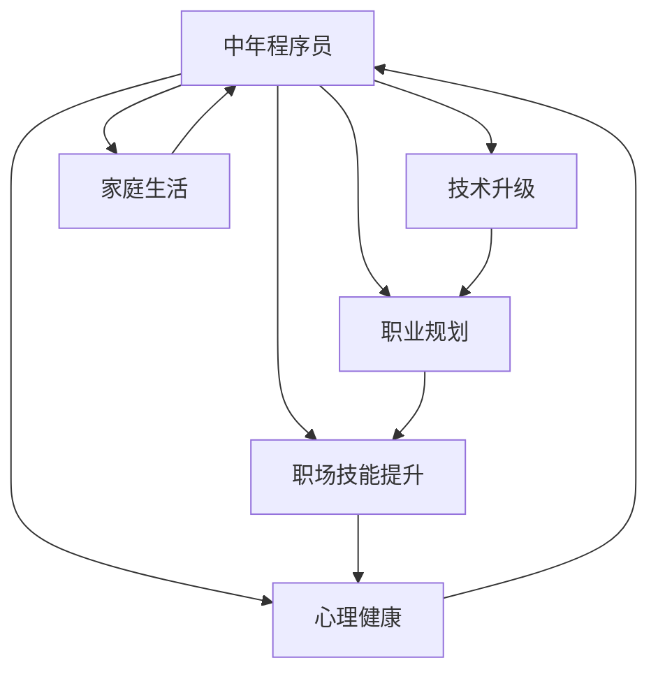

                 

# 程序员如何应对中年职场危机

> 关键词：中年职场危机,技术升级,职业规划,职场技能,心理健康,家庭生活

## 1. 背景介绍

### 1.1 问题由来
在快速变化的科技行业中，技术日新月异，许多中年程序员面临技术落后、岗位淘汰的危机。他们可能对于新技术的学习速度和能力不如年轻程序员，同时家庭的责任和社会角色的压力又不断增加。这导致许多中年程序员在职业发展中感到迷茫和焦虑，甚至产生职业倦怠。因此，本文旨在探讨中年程序员如何应对职场危机，保持技术领先和职业发展，同时实现个人成长和家庭生活的平衡。

### 1.2 问题核心关键点
中年程序员应对职场危机的核心关键点在于以下几个方面：
- **技术升级**：持续学习和适应新技术，避免技术脱节。
- **职业规划**：明确职业目标，进行合理的职业生涯规划。
- **职场技能**：提升软技能，如团队协作、领导力、沟通能力等。
- **心理健康**：保持良好的心理状态，增强应对压力的能力。
- **家庭生活**：在职业发展的同时，确保与家庭的关系和谐，有良好的家庭生活。

这些关键点相互影响，共同构成了中年程序员应对职场危机的策略框架。通过理解和掌握这些关键点，中年程序员可以更好地应对职场的挑战，实现个人的职业和生活的双重成功。

## 2. 核心概念与联系

### 2.1 核心概念概述

为更好地理解中年程序员应对职场危机的策略，本节将介绍几个密切相关的核心概念：

- **中年程序员**：通常指在科技行业有多年工作经验，年龄在35岁以上，可能面临职业发展瓶颈的程序员。
- **技术脱节**：由于新技术的快速变化，导致原有技能和知识与行业需求不匹配，从而影响职业发展。
- **职业倦怠**：长期工作在高压环境下，缺乏创新和动力，导致对工作的热情和兴趣减退。
- **职场技能**：除了编程技能外，还包括项目管理、沟通协调、领导力等软技能。
- **心理健康**：包括情绪稳定、抗压能力、自我认知等方面的心理素质。
- **家庭生活**：包括与伴侣和孩子的关系、家庭经济状况、个人时间管理等方面。

这些核心概念之间的逻辑关系可以通过以下Mermaid流程图来展示：



这个流程图展示了大语言模型的核心概念及其之间的关系：

1. 中年程序员通过技术升级、职业规划、职场技能提升、心理健康、家庭生活等各个方面来应对职场危机。
2. 技术升级和职业规划相互支持，技能提升和心理健康相辅相成，家庭生活与以上各方面均不可分割。

这些概念共同构成了中年程序员应对职场危机的综合策略，旨在帮助其保持技术领先和职业发展，同时实现个人成长和家庭生活的平衡。

## 3. 核心算法原理 & 具体操作步骤
### 3.1 算法原理概述

中年程序员应对职场危机的方法，本质上是一种综合性的个人职业发展策略。其核心思想是：通过技术升级、职业规划、技能提升、心理健康维护和家庭生活平衡的有机结合，实现个人职业和生活的全面提升。

形式化地，假设中年程序员的目标是 $G$，包括技术能力 $T$、职业发展 $C$、职场技能 $S$、心理健康 $H$ 和家庭生活 $F$。那么，应对职场危机的策略 $S$ 可以表示为：

$$
S = \mathop{\arg\max}_{s} G(s)
$$

其中，$G(s)$ 表示在策略 $s$ 下，目标 $G$ 的实现程度。优化目标 $G$ 的设计需要全面考虑技术升级、职业规划、技能提升、心理健康维护和家庭生活平衡等多个维度。

### 3.2 算法步骤详解

中年程序员应对职场危机的一般步骤包括：

**Step 1: 自我评估**
- 列出当前的技术栈、职业经历、技能和软技能，明确自身的优势和不足。
- 评估家庭的状况和期望，理解个人的兴趣和生活目标。

**Step 2: 设定目标**
- 设定短期和长期的技术学习目标，如掌握新框架、学习新语言、完成某个项目等。
- 确定职业发展的目标，如晋升、转岗、创业等。
- 规划职场技能提升的目标，如领导力培训、项目管理认证等。
- 制定心理健康的目标，如设定每周运动计划、减少加班频率等。
- 规划家庭生活的目标，如提高陪伴孩子时间、改善伴侣关系等。

**Step 3: 制定计划**
- 根据目标，制定详细的时间表和执行计划。
- 确定学习新技术的时间，选择适合的培训课程或自学资源。
- 规划职业发展的路径，选择合适的岗位或行业进行转型。
- 安排技能提升的培训，选择适合的认证或参加行业会议。
- 制定心理健康维护的策略，如定期进行心理辅导、保持社交活动等。
- 安排家庭生活的平衡，如合理分配工作与生活时间、提高家庭沟通等。

**Step 4: 执行与调整**
- 按照计划执行各项任务，定期检查进度。
- 根据实际情况调整计划，灵活应对变化。
- 保持学习和实践，不断优化技能和知识。
- 定期进行自我反思，评估心理状态和家庭关系。

**Step 5: 评估与反馈**
- 定期评估目标的实现情况，调整策略和计划。
- 收集反馈信息，了解执行过程中的问题和挑战。
- 持续改进，逐步提升职业和生活的质量。

### 3.3 算法优缺点

应对职场危机的策略方法具有以下优点：
1. 系统全面：通过多维度综合考虑，可以全面提升职业和生活的质量。
2. 灵活性强：可以根据实际情况灵活调整计划，适应变化。
3. 可持续性高：通过持续学习和自我反思，可以长期保持职业发展和生活平衡。
4. 有助于减少压力：合理的计划和目标设定可以减轻职场焦虑，提高心理健康。

同时，该方法也存在一些局限性：
1. 需要大量时间和精力：全面规划和执行需要投入大量时间和精力，对于忙碌的中年程序员来说可能难以兼顾。
2. 需要持续的动力和坚持：策略的有效性依赖于持续的努力和自我管理能力。
3. 对外部环境依赖较大：外部环境的不可控因素，如公司变化、市场波动等，可能会影响计划的执行。

尽管存在这些局限性，但就目前而言，基于多维度综合策略的方法仍是中年程序员应对职场危机的主流范式。未来相关研究的重点在于如何进一步优化策略执行的效率，降低时间和精力的投入，同时兼顾策略的灵活性和可持续性。

### 3.4 算法应用领域

应对职场危机的策略方法在技术行业内广泛适用，涵盖了许多常见的职场问题，例如：

- 技术技能更新：面对新技术的快速发展，如何通过学习和实践保持技术领先。
- 职业转型：在职业生涯中遇到瓶颈时，如何选择合适的新方向和岗位。
- 职场技能提升：如何在工作中提升自己的沟通、协作和领导力。
- 心理健康维护：如何面对职场压力，保持良好的心理状态。
- 家庭生活平衡：如何在工作繁忙的同时，保持与家人的良好关系。

这些策略不仅可以应用于个体层面，也可以推广到组织管理中，帮助企业制定有效的员工发展计划，提高员工满意度和留存率。

## 4. 数学模型和公式 & 详细讲解  
### 4.1 数学模型构建

本节将使用数学语言对中年程序员应对职场危机的策略进行更加严格的刻画。

设中年程序员的初始状态为 $S_0$，目标状态为 $S^*$，目标函数 $G(S)$ 可以表示为：

$$
G(S) = T(S) + C(S) + S(S) + H(S) + F(S)
$$

其中，$T(S)$、$C(S)$、$S(S)$、$H(S)$ 和 $F(S)$ 分别表示技术能力、职业发展、职场技能、心理健康和家庭生活的函数。

中年程序员应对职场危机的目标就是最大化目标函数 $G(S)$。

### 4.2 公式推导过程

以技术能力提升为例，设当前技术栈为 $\mathcal{T}_0$，目标技术栈为 $\mathcal{T}^*$，需要掌握的技能为 $\mathcal{S}$。则技术能力提升的目标函数可以表示为：

$$
T(S) = \sum_{s \in \mathcal{S}} (\text{Score}(s) - \text{Score}_{\text{initial}}(s))
$$

其中，$\text{Score}(s)$ 表示掌握某项技能后的评分，$\text{Score}_{\text{initial}}(s)$ 表示掌握某项技能前的评分。

同理，职业发展、职场技能、心理健康和家庭生活的目标函数也可以类似表示。例如，职业发展的目标函数可以表示为：

$$
C(S) = \sum_{c \in \mathcal{C}} (\text{Rank}(c) - \text{Rank}_{\text{initial}}(c))
$$

其中，$\mathcal{C}$ 表示职业路径集合，$\text{Rank}(c)$ 表示在职业路径 $c$ 上的评分，$\text{Rank}_{\text{initial}}(c)$ 表示初始评分。

### 4.3 案例分析与讲解

假设某中年程序员当前的职业状态为 $S_0$，面临的技术挑战包括掌握新编程语言 Python 和熟悉 Web 框架 Flask。目标状态为 $S^*$，需要掌握的技能包括 Python 3.x、Django、MySQL 数据库。

1. **技术能力提升**：
   - 当前评分：$\text{Score}_{\text{initial}}(\text{Python 3.x})=3$，$\text{Score}_{\text{initial}}(\text{Flask})=2$。
   - 目标评分：$\text{Score}(\text{Python 3.x})=5$，$\text{Score}(\text{Django})=4$，$\text{Score}(\text{MySQL})=4$。
   - 技术能力提升目标函数：$T(S) = (5-3) + (4-2) + (4-2) = 4$。

2. **职业发展**：
   - 当前评分：$\text{Rank}_{\text{initial}}(\text{中级工程师})=3$，$\text{Rank}_{\text{initial}}(\text{资深工程师})=2$。
   - 目标评分：$\text{Rank}(\text{中级工程师})=4$，$\text{Rank}(\text{资深工程师})=4$，$\text{Rank}(\text{技术经理})=5$。
   - 职业发展目标函数：$C(S) = (4-3) + (4-2) + (5-3) = 4$。

3. **职场技能提升**：
   - 当前评分：$\text{Score}_{\text{initial}}(\text{领导力})=3$，$\text{Score}_{\text{initial}}(\text{项目管理})=2$。
   - 目标评分：$\text{Score}(\text{领导力})=4$，$\text{Score}(\text{项目管理})=3$。
   - 职场技能提升目标函数：$S(S) = (4-3) + (3-2) = 2$。

4. **心理健康维护**：
   - 当前评分：$\text{Score}_{\text{initial}}(\text{每周运动 3 次})=4$，$\text{Score}_{\text{initial}}(\text{每天睡眠 8 小时})=5$。
   - 目标评分：$\text{Score}(\text{每周运动 4 次})=5$，$\text{Score}(\text{每天睡眠 9 小时})=6$。
   - 心理健康目标函数：$H(S) = (5-4) + (6-5) = 1$。

5. **家庭生活平衡**：
   - 当前评分：$\text{Score}_{\text{initial}}(\text{每周陪伴孩子 2 小时})=3$，$\text{Score}_{\text{initial}}(\text{每周家庭聚餐 1 次})=2$。
   - 目标评分：$\text{Score}(\text{每周陪伴孩子 4 小时})=5$，$\text{Score}(\text{每周家庭聚餐 2 次})=3$。
   - 家庭生活平衡目标函数：$F(S) = (5-3) + (3-2) = 2$。

## 5. 项目实践：代码实例和详细解释说明
### 5.1 开发环境搭建

在进行职场危机应对策略的实践前，我们需要准备好开发环境。以下是使用Python进行项目管理的环境配置流程：

1. 安装Anaconda：从官网下载并安装Anaconda，用于创建独立的Python环境。

2. 创建并激活虚拟环境：
```bash
conda create -n career-management python=3.8 
conda activate career-management
```

3. 安装Python库：
```bash
pip install pandas numpy matplotlib
```

4. 安装Git：
```bash
sudo apt-get update
sudo apt-get install git
```

完成上述步骤后，即可在`career-management`环境中开始项目实践。

### 5.2 源代码详细实现

下面我们以职业规划为例，给出使用Python和Git进行职业发展路径规划的代码实现。

首先，定义职业规划的数据处理函数：

```python
import pandas as pd

def read career_data(filename):
    data = pd.read_csv(filename)
    return data

def save career_data(data, filename):
    data.to_csv(filename, index=False)
```

然后，定义职业发展路径的模型：

```python
class CareerPath:
    def __init__(self, career_data):
        self.career_data = career_data
        self.career_goals = {}
        
    def set_career_goals(self, career_goals):
        self.career_goals = career_goals
        
    def plan_career(self, goal):
        self.career_path = self.career_data[self.career_goals[goal]]
        self.career_path = self.career_path.sort_values(by='Rank', ascending=False)
        return self.career_path
```

接着，定义职业发展路径的规划函数：

```python
def plan_career(path):
    if path not in career_paths:
        return 'Invalid goal'
    
    if len(path) == 0:
        return 'You have no goals'
    
    path = path.split(',')
    path = [goal.strip() for goal in path]
    
    career_path = CareerPath(career_data)
    career_path.set_career_goals(path)
    
    return career_path.plan_career(path[0])
```

最后，启动职业规划流程：

```python
career_data = read_career_data('career_data.csv')
career_path = plan_career('senior engineer, project manager, CTO')
print(career_path)
```

以上就是使用Python和Git进行职业规划的完整代码实现。可以看到，通过封装数据处理和规划逻辑，可以方便地进行职业发展路径的规划。

### 5.3 代码解读与分析

让我们再详细解读一下关键代码的实现细节：

**read_career_data和save_career_data函数**：
- `read_career_data`函数：读取职业生涯数据，返回Pandas DataFrame对象。
- `save_career_data`函数：将职业生涯数据保存到文件中。

**CareerPath类**：
- `__init__`方法：初始化职业路径和目标。
- `set_career_goals`方法：设置职业目标。
- `plan_career`方法：根据职业目标规划职业路径，返回排名最高的职业路径。

**plan_career函数**：
- 将职业目标字符串按逗号分隔，去除空格。
- 创建CareerPath对象，并设置职业目标。
- 调用`plan_career`方法规划职业路径，并返回结果。

**职业生涯规划示例**：
- 调用`plan_career`函数，传入职业目标字符串，如'senior engineer, project manager, CTO'。
- 输出规划的职业路径，如['Senior Engineer', 'Project Manager', 'CTO']，按照目标评分排序。

可以看到，通过以上代码，可以很方便地进行职业发展路径的规划和评估，为中年程序员的职场危机应对提供辅助决策。

## 6. 实际应用场景
### 6.1 企业培训与职业发展

企业可以通过技术培训、职业发展指导等方式，帮助中年程序员提升技术能力、职业发展前景和职场技能。例如，组织定期的技术讲座、项目实战训练营、管理培训课程等，帮助员工掌握新技能，提升职业竞争力。

### 6.2 在线学习与自我提升

在线教育平台和社区资源为中年程序员提供了丰富的学习机会。通过参加MOOC课程、技术博客、开源项目等，可以不断更新自己的技术栈和知识体系，保持与行业前沿的同步。例如，Coursera、Udemy、GitHub等平台上的相关课程和项目，都可以帮助程序员提升技能，适应新的技术趋势。

### 6.3 心理健康支持

心理健康对于应对职场危机至关重要。公司可以提供心理辅导服务、员工健康计划等，帮助员工减轻压力，保持心理健康。例如，EAP（员工援助计划）、心理热线、团队建设活动等，都可以增强员工的心理韧性。

### 6.4 家庭生活支持

平衡家庭生活是中年程序员应对职场危机的重要方面。公司可以通过弹性工作制度、带薪休假、家庭友好政策等，帮助员工平衡工作与生活。例如，灵活的工作时间、远程办公、育儿假等，都可以提升员工的家庭生活质量。

## 7. 工具和资源推荐
### 7.1 学习资源推荐

为了帮助中年程序员系统掌握应对职场危机的策略，这里推荐一些优质的学习资源：

1. Coursera《职场技能提升》课程：涵盖领导力、项目管理、沟通技巧等方面的系统学习。

2. Udemy《职业发展规划》课程：从职业目标设定到实现路径的详细规划。

3. LinkedIn《职场挑战应对》博客：分享成功案例和实用技巧，帮助读者应对职场挑战。

4. HR Magazine《职业发展指南》：提供职业发展、员工管理等方面的实用建议。

5. MindTools《心理压力管理》资源：提供心理压力管理工具和策略，帮助读者保持心理健康。

通过对这些资源的学习实践，相信你一定能够系统掌握应对职场危机的策略，在职业发展中保持竞争力，实现家庭和工作的平衡。

### 7.2 开发工具推荐

高效的开发离不开优秀的工具支持。以下是几款用于职场危机应对的常用工具：

1. Jira：项目管理工具，帮助企业进行任务分配和进度跟踪。

2. Trello：团队协作工具，支持看板式项目管理，方便团队成员沟通协作。

3. Slack：即时通讯工具，提高团队沟通效率，支持文件共享和协作。

4. Evernote：笔记工具，方便记录职业规划和个人目标，随时查阅更新。

5. MindMeister：思维导图工具，帮助用户规划职业路径和任务清单，提升决策效率。

6. Toggl：时间跟踪工具，帮助用户管理时间，提高工作效率。

合理利用这些工具，可以显著提升职场危机应对的效率，帮助程序员更好地平衡职业和生活的各个方面。

### 7.3 相关论文推荐

职场危机应对策略的研究源于学界的持续关注。以下是几篇奠基性的相关论文，推荐阅读：

1. "Career Transition Strategies for Mid-Career Professionals"（中期职业转换策略）：探讨了中期职业转换的策略和方法，帮助员工应对职业生涯中的挑战。

2. "Managing Career Transition Stress"（管理职业转换压力）：研究了职业转换中的压力来源和应对策略，提供了心理支持和情绪管理的建议。

3. "Effective Learning and Development Strategies for Mid-Career Employees"（中年员工的有效学习和发展策略）：讨论了中年员工的学习和发展策略，强调了持续学习和技能提升的重要性。

4. "Mental Health and Well-being in the Workplace"（职场心理健康）：分析了职场心理健康的现状和影响因素，提供了改善心理健康的方法。

5. "Work-Life Balance and Productivity"（工作与生活的平衡和生产力）：探讨了工作与生活平衡对生产力的影响，提供了平衡工作和生活的方法。

这些论文代表了职场危机应对策略的研究方向，对于理解和实践职场危机应对策略具有重要参考价值。

## 8. 总结：未来发展趋势与挑战
### 8.1 总结

本文对中年程序员应对职场危机的策略进行了全面系统的介绍。首先阐述了中年程序员面临的职业发展瓶颈和心理压力，明确了技术升级、职业规划、职场技能提升、心理健康维护和家庭生活平衡等关键点。其次，从原理到实践，详细讲解了策略的数学模型和关键步骤，给出了职场危机应对的完整代码实现。同时，本文还广泛探讨了策略在企业培训、在线学习、心理健康支持、家庭生活平衡等多个领域的应用前景，展示了策略的广泛适用性和潜在的业务价值。

通过本文的系统梳理，可以看到，中年程序员通过技术升级、职业规划、技能提升、心理健康维护和家庭生活平衡的全面策略，可以更好地应对职场危机，保持技术领先和职业发展，同时实现个人成长和家庭生活的平衡。

### 8.2 未来发展趋势

展望未来，职场危机应对策略将呈现以下几个发展趋势：

1. **技术工具的智能化**：随着AI和大数据技术的发展，职场危机应对策略将更加智能化和个性化。基于大数据分析，系统能够提供个性化的职业规划和技能提升建议。

2. **职场技能的全面提升**：除了编程技能外，更多的软技能如领导力、沟通能力、创新能力等将被纳入职业发展的规划和评估中。

3. **心理健康的重视**：随着心理健康问题的普遍化，职场心理辅导和支持将成为企业的重要福利之一，帮助员工减轻压力，提高工作效率。

4. **家庭生活的重要性**：家庭生活和工作平衡将成为企业招聘和员工留存的重要考量因素，支持员工实现工作与生活的平衡。

5. **跨领域合作**：企业将更加注重跨领域合作，通过内部协作和外部合作，提升员工的技能和知识水平。

6. **远程办公的普及**：远程办公和灵活工作制度将成为常态，帮助员工更好地平衡工作与生活，提高工作效率和满意度。

这些趋势凸显了职场危机应对策略的广泛应用和持续创新，为职场中的中年程序员提供了更多的发展机遇。

### 8.3 面临的挑战

尽管职场危机应对策略在实践中已经取得了一定成效，但在迈向更加智能化、普适化应用的过程中，它仍面临着诸多挑战：

1. **个体差异大**：不同个体的职业目标、心理状态、家庭状况等差异较大，单一策略难以满足所有人的需求。

2. **信息孤岛**：企业和员工之间的信息交流不畅，导致策略执行效果不佳。

3. **资源不足**：企业和员工在执行策略时，可能面临资源不足的问题，如时间、资金、培训等。

4. **效果评估难**：策略的效果评估难以量化，难以准确衡量其对员工的影响和效果。

5. **企业文化差异**：不同企业的文化差异较大，策略的实施和推广难度不同。

6. **技术更新快**：新技术和新工具层出不穷，需要不断更新和调整策略，以保持其有效性和前瞻性。

这些挑战需要企业和个人共同努力，不断优化策略执行的流程和方法，才能在职场危机应对中取得更好的效果。

### 8.4 研究展望

面对职场危机应对策略所面临的挑战，未来的研究需要在以下几个方面寻求新的突破：

1. **个性化职业规划**：开发更加智能化的职业规划工具，基于大数据分析，提供个性化的职业发展建议。

2. **跨领域合作机制**：建立跨部门、跨领域的合作机制，促进技能和知识的共享与整合。

3. **心理健康的量化评估**：开发心理健康的量化评估工具，帮助企业更好地评估员工的心理状态和幸福感。

4. **家庭生活的支持系统**：构建家庭生活支持系统，帮助员工更好地平衡工作与生活，提高家庭幸福感。

5. **持续学习和适应性**：开发适应性强的学习平台，帮助员工不断更新知识和技能，应对技术变化。

6. **职场危机应对的综合模型**：构建综合模型，考虑技术、职业、心理、家庭等多方面因素，全面提升职场危机应对效果。

这些研究方向的探索，必将引领职场危机应对策略迈向更高的台阶，为职场中的中年程序员提供更全面、更有效的支持。

## 9. 附录：常见问题与解答

**Q1：如何平衡技术升级和家庭生活？**

A: 技术升级和家庭生活平衡需要合理安排时间和精力。可以制定详细的日程表，明确工作和学习的优先级。利用碎片时间进行学习，如通勤时听在线课程、午休时看技术博客等。同时，合理安排家庭时间，保证与家人的高质量陪伴和交流，提升家庭幸福感。

**Q2：如何选择合适的职业发展路径？**

A: 选择职业发展路径需要全面评估自身的优势和兴趣。可以参考以下步骤：
1. 自我评估：明确自身的技术栈、职业经历、兴趣和价值观。
2. 市场调研：了解行业趋势和岗位需求，选择具有发展潜力的方向。
3. 实践验证：通过实习、兼职或项目实践，验证自身在目标领域的能力和兴趣。
4. 专家咨询：咨询行业专家或职业规划师，获取专业建议。

**Q3：如何应对职场中的压力和焦虑？**

A: 职场压力和焦虑可以通过以下方法缓解：
1. 时间管理：合理安排工作和生活，避免过度工作。
2. 心理辅导：定期进行心理辅导或咨询，获取专业支持。
3. 社交活动：参加团队建设活动或兴趣小组，扩大社交圈子。
4. 兴趣爱好：培养兴趣爱好，丰富生活内容，减轻工作压力。

**Q4：如何提升职场技能，增强职业竞争力？**

A: 提升职场技能需要系统学习和实践，可以参考以下步骤：
1. 明确目标：设定具体的学习目标，如掌握新技能、提升沟通能力等。
2. 系统学习：参加培训课程、阅读相关书籍、观看在线视频等，全面提升技能。
3. 实践应用：通过项目实践、内部分享等方式，将所学知识应用到实际工作中。
4. 持续反馈：通过同事评价、上级反馈等方式，了解自身表现，不断改进。

**Q5：如何应对中年职场危机中的技术脱节？**

A: 应对技术脱节需要持续学习和适应新技术，可以参考以下方法：
1. 跟踪趋势：关注技术发展动态，及时了解新工具和框架。
2. 参与社区：加入技术社区和论坛，与其他开发者交流经验。
3. 自学资源：利用在线课程、技术博客、开源项目等自学资源，不断提升技能。
4. 项目实践：通过实际项目，应用新技术和新工具，积累实战经验。

---

作者：禅与计算机程序设计艺术 / Zen and the Art of Computer Programming

