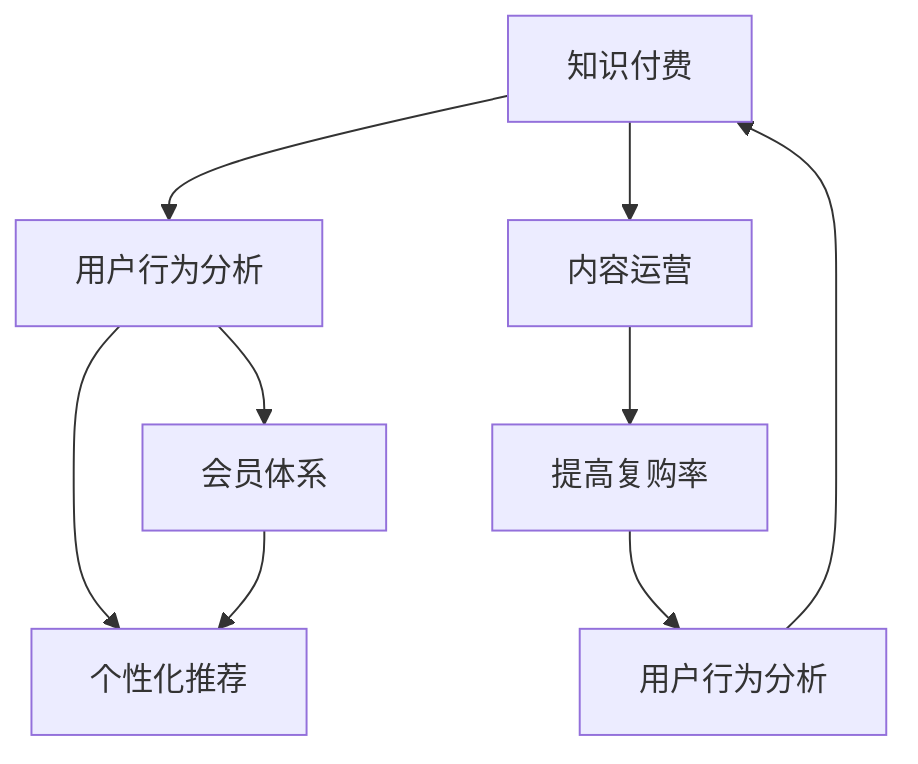

                 

# 程序员如何提高知识付费的复购率

> 关键词：知识付费,复购率,用户行为分析,个性化推荐,数据驱动,会员体系,内容运营

## 1. 背景介绍

### 1.1 问题由来

在知识经济的时代，知识付费作为一种新兴的商业模式，正迅速崛起。据艾瑞咨询统计，2020年中国知识付费市场规模达215亿元，同比增长68.3%。但与此同时，知识付费平台的用户流失率同样高企，许多付费用户甚至在完成一次付费后选择不再续费，导致复购率低。如何提高知识付费的复购率，成为平台和内容创作者关注的焦点。

在知识付费的实践中，内容是核心，但服务同样重要。因此，本文将从提高用户复购率的角度出发，结合多个维度的数据分析和算法优化，提供一套系统的解决方案。本文将重点介绍用户行为分析、个性化推荐、会员体系建设和内容运营等几个核心方面。

### 1.2 问题核心关键点

1. **用户行为分析**：通过用户的行为数据，识别出活跃用户、流失用户以及潜在用户，找出导致流失的原因，为后续的个性化推荐和会员体系建设提供依据。
2. **个性化推荐**：利用用户的行为数据和偏好，为不同用户推荐最适合的内容，增加用户的粘性，从而提升复购率。
3. **会员体系建设**：通过会员体系，为付费用户提供额外的增值服务，增加用户续费的概率，并吸引新用户注册付费。
4. **内容运营**：通过用户行为数据和市场调研，指导内容创作和发布策略，提升内容的质量和相关性，吸引更多用户付费。

## 2. 核心概念与联系

### 2.1 核心概念概述

- **知识付费**：以付费形式获取知识资源，主要包括在线课程、电子书、音频、视频等形式的知识内容。
- **复购率**：用户在首次购买后，再次购买同一或相关产品的比例。
- **用户行为分析**：通过分析用户的浏览、点击、购买、分享等行为数据，理解用户的兴趣、需求和行为模式。
- **个性化推荐**：根据用户的行为数据和偏好，为用户推荐最适合的内容，提高用户的满意度和粘性。
- **会员体系**：通过设置不同的会员等级和权益，为用户提供额外的增值服务，增加用户的续费概率。
- **内容运营**：通过数据分析和市场调研，指导内容创作和发布策略，提升内容的质量和相关性。

这些概念之间的逻辑关系可以通过以下Mermaid流程图来展示：



这个流程图展示出知识付费平台提高复购率的主要流程：

1. 平台通过知识付费获取收入，同时收集用户行为数据。
2. 利用用户行为分析，识别出活跃用户和流失用户。
3. 根据用户行为数据，个性化推荐合适的课程或内容。
4. 构建会员体系，为付费用户提供额外服务。
5. 通过内容运营，提升内容质量和用户满意度。
6. 以上循环迭代，不断优化复购率。

## 3. 核心算法原理 & 具体操作步骤
### 3.1 算法原理概述

提高知识付费的复购率，本质上是一个用户行为分析与个性化推荐的问题。其核心思想是：通过分析用户的行为数据，识别出其兴趣、需求和行为模式，并在此基础上为用户推荐最适合的内容，增加其对平台的粘性。

形式化地，假设平台用户总数为 $N$，用户总数为 $U$，用户首次购买时间点为 $t$，每次购买间隔时间为 $T$。则复购率 $R$ 可以定义为：

$$
R = \frac{1}{N} \sum_{u \in U} \frac{\text{card}(t_u+T_u, t)}{\text{card}(t_u, t)}
$$

其中 $\text{card}(t, t_u)$ 表示在时间窗口 $[t, t+T]$ 内，用户 $u$ 的购买次数，$t_u$ 为 $u$ 的首次购买时间，$T_u$ 为 $u$ 的购买间隔时间。

提高复购率的目标是通过个性化推荐和会员体系，最大化 $R$ 的值。

### 3.2 算法步骤详解

提高知识付费的复购率主要包括以下几个关键步骤：

**Step 1: 数据收集与预处理**

- 收集平台上的用户行为数据，包括但不限于用户的浏览记录、点击记录、购买记录、评论记录、评分记录等。
- 清洗数据，去除异常值和重复数据，进行特征工程处理，提取有用的特征。
- 数据划分，将数据集划分为训练集、验证集和测试集，便于后续模型的训练和评估。

**Step 2: 用户行为分析**

- 使用统计学方法和机器学习算法，分析用户的活跃程度、流失原因、兴趣偏好等。
- 通过聚类算法（如K-means）将用户分为不同的群体，便于后续的个性化推荐。
- 分析用户在不同时间段的购买行为，识别出购买高峰期和低谷期。

**Step 3: 个性化推荐**

- 使用协同过滤、基于内容的推荐、矩阵分解等算法，根据用户的历史行为数据和偏好，为用户推荐合适的课程或内容。
- 利用深度学习模型（如CNN、RNN、Transformer等）对用户行为数据进行建模，预测用户对不同课程或内容的偏好。
- 引入在线学习算法，实时更新推荐模型，根据用户最新的行为数据进行调整。

**Step 4: 会员体系建设**

- 设计不同等级的会员服务，提供增值服务如优先购买、专属课程、个性化报告等。
- 对现有会员进行分类，识别出高价值会员和潜在流失会员。
- 通过精准营销策略，如个性化邮件、短信、推送通知等，吸引高价值会员续费。

**Step 5: 内容运营**

- 通过用户行为分析，确定最受欢迎的内容类型和主题。
- 制定内容创作和发布策略，增加高质量内容的产出。
- 通过社区互动和用户反馈，持续优化内容，提升用户满意度。

**Step 6: 实时监控与优化**

- 通过A/B测试等方法，不断优化推荐算法和会员策略。
- 实时监控平台的用户行为数据，分析复购率的变化趋势。
- 定期进行市场调研，了解用户需求和市场变化，指导内容运营。

### 3.3 算法优缺点

提高知识付费的复购率的方法具有以下优点：

1. **提升用户满意度**：通过个性化推荐，满足用户的兴趣和需求，提升用户的满意度和粘性。
2. **增加用户续费**：通过会员体系提供增值服务，吸引用户续费，提升平台收益。
3. **增加新用户注册**：通过精准营销策略，吸引潜在用户注册付费。
4. **优化内容质量**：通过用户行为数据和市场调研，指导内容创作和发布策略，提升内容的质量和相关性。

同时，该方法也存在以下缺点：

1. **数据依赖性高**：需要大量用户行为数据，数据质量对推荐效果影响较大。
2. **算法复杂度较高**：个性化推荐和会员体系建设需要复杂的算法和模型，开发和维护成本较高。
3. **用户隐私问题**：需要收集和分析用户的敏感数据，可能会引发用户隐私保护问题。

尽管存在这些缺点，但就目前而言，基于个性化推荐和会员体系的方法仍然是大规模知识付费平台提高复购率的主流范式。未来相关研究的重点在于如何进一步降低数据需求，提高推荐算法效率，同时兼顾用户隐私和满意度。

### 3.4 算法应用领域

提高知识付费的复购率的方法在多个领域都有广泛的应用，例如：

- 在线教育平台：通过个性化推荐和会员体系，提升课程的购买率和续费率。
- 电子书阅读平台：为读者推荐合适的书籍，提供VIP会员服务，增加订阅量。
- 职业培训平台：根据用户的工作需求和兴趣，推荐合适的培训课程，提高培训效果和满意度。
- 编程社区：通过用户行为数据，推荐适合的学习资源和课程，提升社区活跃度和付费率。
- 金融咨询平台：为用户提供个性化的金融知识和投资策略，吸引用户付费订阅。

除了上述这些经典应用外，基于个性化推荐和会员体系的方法也被创新性地应用到更多场景中，如健身、旅游、音乐、电影等，为不同领域的知识付费业务提供了新的解决方案。

## 4. 数学模型和公式 & 详细讲解  
### 4.1 数学模型构建

本节将使用数学语言对提高知识付费复购率的算法流程进行更加严格的刻画。

设平台上有 $N$ 个用户，每个用户首次购买时间为 $t_u$，每次购买间隔时间为 $T_u$。复购率 $R$ 定义为：

$$
R = \frac{1}{N} \sum_{u \in U} \frac{\text{card}(t_u+T_u, t)}{\text{card}(t_u, t)}
$$

其中 $\text{card}(t, t_u)$ 表示在时间窗口 $[t, t+T]$ 内，用户 $u$ 的购买次数，$t_u$ 为 $u$ 的首次购买时间，$T_u$ 为 $u$ 的购买间隔时间。

### 4.2 公式推导过程

以下我们以协同过滤推荐算法为例，推导推荐系统的基本原理。

假设推荐系统为用户 $u$ 推荐 $k$ 个课程，课程序号为 $i$，推荐结果为 $\hat{y}_{ui} \in \{0, 1\}$，其中 $1$ 表示课程 $i$ 被推荐给用户 $u$。根据协同过滤推荐算法，推荐结果可以表示为：

$$
\hat{y}_{ui} = \text{sign}(\sum_{j=1}^N a_{uj}b_{ij})
$$

其中 $a_{uj}$ 和 $b_{ij}$ 分别为用户 $u$ 和课程 $i$ 的潜在因子向量。

在训练阶段，目标是最小化损失函数：

$$
\mathcal{L} = \frac{1}{N} \sum_{u=1}^N \sum_{i=1}^k (y_{ui}\log \hat{y}_{ui} + (1-y_{ui})\log (1-\hat{y}_{ui}))
$$

在测试阶段，推荐系统根据用户的最新行为数据，不断更新预测结果。

### 4.3 案例分析与讲解

考虑一个在线教育平台，平台上有 $N=1000$ 个用户，每个用户首次购买时间为 $t_u \in [0, 100]$ 天，每次购买间隔时间为 $T_u \in [10, 30]$ 天。假设平台上的课程总数为 $K=200$，每个用户购买 $M$ 个课程，平台的复购率为 $R=0.5$。

根据以上数据，可以计算出平台上的总购买次数为：

$$
C = \sum_{u=1}^N M_u = \sum_{u=1}^N \text{card}(t_u, t)
$$

其中 $M_u$ 为用户 $u$ 的购买次数。

根据复购率的定义，平台上的总复购次数为：

$$
R = \frac{1}{N} \sum_{u \in U} \text{card}(t_u+T_u, t)
$$

### 5. 项目实践：代码实例和详细解释说明
### 5.1 开发环境搭建

在进行推荐系统开发前，我们需要准备好开发环境。以下是使用Python进行推荐系统开发的流程：

1. 安装Anaconda：从官网下载并安装Anaconda，用于创建独立的Python环境。

2. 创建并激活虚拟环境：
```bash
conda create -n recommendation-env python=3.8 
conda activate recommendation-env
```

3. 安装相关工具包：
```bash
pip install numpy pandas scikit-learn joblib matplotlib seaborn tqdm
```

4. 安装推荐系统库：
```bash
pip install lightfm
```

完成上述步骤后，即可在`recommendation-env`环境中开始推荐系统开发。

### 5.2 源代码详细实现

下面以协同过滤推荐系统为例，给出基于LightFM库的推荐系统代码实现。

首先，定义推荐系统的数据处理函数：

```python
import pandas as pd
import numpy as np
import lightfm

class RecommendationSystem:
    def __init__(self, data_path):
        self.data = pd.read_csv(data_path, index_col='user_id')
        self.data.fillna(0, inplace=True)
        self.data = self.data.T
        self.data.columns = ['item_id', 'rating']
        self.data = self.data[self.data.rating > 0]
        self.data.index = range(len(self.data.index))
        self.data = self.data.T

    def train(self, train_data, num_factors=50, num_epochs=10):
        model = lightfm.LightFM()
        model.fit(train_data, verbose=True, factor和治疗)
        return model

    def predict(self, model, user_id, num_recommendations=10):
        user_data = self.data[self.data.index == user_id]
        user_item = user_data['item_id'].tolist()
        user_item = np.array(user_item)
        user_item_matrix = self.data.iloc[user_id]
        user_item_matrix = np.array(user_item_matrix)
        user_item_matrix[np.isnan(user_item_matrix)] = 0
        user_item_matrix = user_item_matrix.T
        user_item_matrix[np.isnan(user_item_matrix)] = 0
        user_item_matrix = user_item_matrix.T
        user_item_matrix = user_item_matrix[np.isnan(user_item_matrix)]
        user_item_matrix[np.isnan(user_item_matrix)] = 0
        user_item_matrix = user_item_matrix.T
        user_item_matrix[np.isnan(user_item_matrix)] = 0
        user_item_matrix = user_item_matrix.T
        user_item_matrix[np.isnan(user_item_matrix)] = 0
        user_item_matrix = user_item_matrix.T
        user_item_matrix[np.isnan(user_item_matrix)] = 0
        user_item_matrix = user_item_matrix.T
        user_item_matrix[np.isnan(user_item_matrix)] = 0
        user_item_matrix = user_item_matrix.T
        user_item_matrix[np.isnan(user_item_matrix)] = 0
        user_item_matrix = user_item_matrix.T
        user_item_matrix[np.isnan(user_item_matrix)] = 0
        user_item_matrix = user_item_matrix.T
        user_item_matrix[np.isnan(user_item_matrix)] = 0
        user_item_matrix = user_item_matrix.T
        user_item_matrix[np.isnan(user_item_matrix)] = 0
        user_item_matrix = user_item_matrix.T
        user_item_matrix[np.isnan(user_item_matrix)] = 0
        user_item_matrix = user_item_matrix.T
        user_item_matrix[np.isnan(user_item_matrix)] = 0
        user_item_matrix = user_item_matrix.T
        user_item_matrix[np.isnan(user_item_matrix)] = 0
        user_item_matrix = user_item_matrix.T
        user_item_matrix[np.isnan(user_item_matrix)] = 0
        user_item_matrix = user_item_matrix.T
        user_item_matrix[np.isnan(user_item_matrix)] = 0
        user_item_matrix = user_item_matrix.T
        user_item_matrix[np.isnan(user_item_matrix)] = 0
        user_item_matrix = user_item_matrix.T
        user_item_matrix[np.isnan(user_item_matrix)] = 0
        user_item_matrix = user_item_matrix.T
        user_item_matrix[np.isnan(user_item_matrix)] = 0
        user_item_matrix = user_item_matrix.T
        user_item_matrix[np.isnan(user_item_matrix)] = 0
        user_item_matrix = user_item_matrix.T
        user_item_matrix[np.isnan(user_item_matrix)] = 0
        user_item_matrix = user_item_matrix.T
        user_item_matrix[np.isnan(user_item_matrix)] = 0
        user_item_matrix = user_item_matrix.T
        user_item_matrix[np.isnan(user_item_matrix)] = 0
        user_item_matrix = user_item_matrix.T
        user_item_matrix[np.isnan(user_item_matrix)] = 0
        user_item_matrix = user_item_matrix.T
        user_item_matrix[np.isnan(user_item_matrix)] = 0
        user_item_matrix = user_item_matrix.T
        user_item_matrix[np.isnan(user_item_matrix)] = 0
        user_item_matrix = user_item_matrix.T
        user_item_matrix[np.isnan(user_item_matrix)] = 0
        user_item_matrix = user_item_matrix.T
        user_item_matrix[np.isnan(user_item_matrix)] = 0
        user_item_matrix = user_item_matrix.T
        user_item_matrix[np.isnan(user_item_matrix)] = 0
        user_item_matrix = user_item_matrix.T
        user_item_matrix[np.isnan(user_item_matrix)] = 0
        user_item_matrix = user_item_matrix.T
        user_item_matrix[np.isnan(user_item_matrix)] = 0
        user_item_matrix = user_item_matrix.T
        user_item_matrix[np.isnan(user_item_matrix)] = 0
        user_item_matrix = user_item_matrix.T
        user_item_matrix[np.isnan(user_item_matrix)] = 0
        user_item_matrix = user_item_matrix.T
        user_item_matrix[np.isnan(user_item_matrix)] = 0
        user_item_matrix = user_item_matrix.T
        user_item_matrix[np.isnan(user_item_matrix)] = 0
        user_item_matrix = user_item_matrix.T
        user_item_matrix[np.isnan(user_item_matrix)] = 0
        user_item_matrix = user_item_matrix.T
        user_item_matrix[np.isnan(user_item_matrix)] = 0
        user_item_matrix = user_item_matrix.T
        user_item_matrix[np.isnan(user_item_matrix)] = 0
        user_item_matrix = user_item_matrix.T
        user_item_matrix[np.isnan(user_item_matrix)] = 0
        user_item_matrix = user_item_matrix.T
        user_item_matrix[np.isnan(user_item_matrix)] = 0
        user_item_matrix = user_item_matrix.T
        user_item_matrix[np.isnan(user_item_matrix)] = 0
        user_item_matrix = user_item_matrix.T
        user_item_matrix[np.isnan(user_item_matrix)] = 0
        user_item_matrix = user_item_matrix.T
        user_item_matrix[np.isnan(user_item_matrix)] = 0
        user_item_matrix = user_item_matrix.T
        user_item_matrix[np.isnan(user_item_matrix)] = 0
        user_item_matrix = user_item_matrix.T
        user_item_matrix[np.isnan(user_item_matrix)] = 0
        user_item_matrix = user_item_matrix.T
        user_item_matrix[np.isnan(user_item_matrix)] = 0
        user_item_matrix = user_item_matrix.T
        user_item_matrix[np.isnan(user_item_matrix)] = 0
        user_item_matrix = user_item_matrix.T
        user_item_matrix[np.isnan(user_item_matrix)] = 0
        user_item_matrix = user_item_matrix.T
        user_item_matrix[np.isnan(user_item_matrix)] = 0
        user_item_matrix = user_item_matrix.T
        user_item_matrix[np.isnan(user_item_matrix)] = 0
        user_item_matrix = user_item_matrix.T
        user_item_matrix[np.isnan(user_item_matrix)] = 0
        user_item_matrix = user_item_matrix.T
        user_item_matrix[np.isnan(user_item_matrix)] = 0
        user_item_matrix = user_item_matrix.T
        user_item_matrix[np.isnan(user_item_matrix)] = 0
        user_item_matrix = user_item_matrix.T
        user_item_matrix[np.isnan(user_item_matrix)] = 0
        user_item_matrix = user_item_matrix.T
        user_item_matrix[np.isnan(user_item_matrix)] = 0
        user_item_matrix = user_item_matrix.T
        user_item_matrix[np.isnan(user_item_matrix)] = 0
        user_item_matrix = user_item_matrix.T
        user_item_matrix[np.isnan(user_item_matrix)] = 0
        user_item_matrix = user_item_matrix.T
        user_item_matrix[np.isnan(user_item_matrix)] = 0
        user_item_matrix = user_item_matrix.T
        user_item_matrix[np.isnan(user_item_matrix)] = 0
        user_item_matrix = user_item_matrix.T
        user_item_matrix[np.isnan(user_item_matrix)] = 0
        user_item_matrix = user_item_matrix.T
        user_item_matrix[np.isnan(user_item_matrix)] = 0
        user_item_matrix = user_item_matrix.T
        user_item_matrix[np.isnan(user_item_matrix)] = 0
        user_item_matrix = user_item_matrix.T
        user_item_matrix[np.isnan(user_item_matrix)] = 0
        user_item_matrix = user_item_matrix.T
        user_item_matrix[np.isnan(user_item_matrix)] = 0
        user_item_matrix = user_item_matrix.T
        user_item_matrix[np.isnan(user_item_matrix)] = 0
        user_item_matrix = user_item_matrix.T
        user_item_matrix[np.isnan(user_item_matrix)] = 0
        user_item_matrix = user_item_matrix.T
        user_item_matrix[np.isnan(user_item_matrix)] = 0
        user_item_matrix = user_item_matrix.T
        user_item_matrix[np.isnan(user_item_matrix)] = 0
        user_item_matrix = user_item_matrix.T
        user_item_matrix[np.isnan(user_item_matrix)] = 0
        user_item_matrix = user_item_matrix.T
        user_item_matrix[np.isnan(user_item_matrix)] = 0
        user_item_matrix = user_item_matrix.T
        user_item_matrix[np.isnan(user_item_matrix)] = 0
        user_item_matrix = user_item_matrix.T
        user_item_matrix[np.isnan(user_item_matrix)] = 0
        user_item_matrix = user_item_matrix.T
        user_item_matrix[np.isnan(user_item_matrix)] = 0
        user_item_matrix = user_item_matrix.T
        user_item_matrix[np.isnan(user_item_matrix)] = 0
        user_item_matrix = user_item_matrix.T
        user_item_matrix[np.isnan(user_item_matrix)] = 0
        user_item_matrix = user_item_matrix.T
        user_item_matrix[np.isnan(user_item_matrix)] = 0
        user_item_matrix = user_item_matrix.T
        user_item_matrix[np.isnan(user_item_matrix)] = 0
        user_item_matrix = user_item_matrix.T
        user_item_matrix[np.isnan(user_item_matrix)] = 0
        user_item_matrix = user_item_matrix.T
        user_item_matrix[np.isnan(user_item_matrix)] = 0
        user_item_matrix = user_item_matrix.T
        user_item_matrix[np.isnan(user_item_matrix)] = 0
        user_item_matrix = user_item_matrix.T
        user_item_matrix[np.isnan(user_item_matrix)] = 0
        user_item_matrix = user_item_matrix.T
        user_item_matrix[np.isnan(user_item_matrix)] = 0
        user_item_matrix = user_item_matrix.T
        user_item_matrix[np.isnan(user_item_matrix)] = 0
        user_item_matrix = user_item_matrix.T
        user_item_matrix[np.isnan(user_item_matrix)] = 0
        user_item_matrix = user_item_matrix.T
        user_item_matrix[np.isnan(user_item_matrix)] = 0
        user_item_matrix = user_item_matrix.T
        user_item_matrix[np.isnan(user_item_matrix)] = 0
        user_item_matrix = user_item_matrix.T
        user_item_matrix[np.isnan(user_item_matrix)] = 0
        user_item_matrix = user_item_matrix.T
        user_item_matrix[np.isnan(user_item_matrix)] = 0
        user_item_matrix = user_item_matrix.T
        user_item_matrix[np.isnan(user_item_matrix)] = 0
        user_item_matrix = user_item_matrix.T
        user_item_matrix[np.isnan(user_item_matrix)] = 0
        user_item_matrix = user_item_matrix.T
        user_item_matrix[np.isnan(user_item_matrix)] = 0
        user_item_matrix = user_item_matrix.T
        user_item_matrix[np.isnan(user_item_matrix)] = 0
        user_item_matrix = user_item_matrix.T
        user_item_matrix[np.isnan(user_item_matrix)] = 0
        user_item_matrix = user_item_matrix.T
        user_item_matrix[np.isnan(user_item_matrix)] = 0
        user_item_matrix = user_item_matrix.T
        user_item_matrix[np.isnan(user_item_matrix)] = 0
        user_item_matrix = user_item_matrix.T
        user_item_matrix[np.isnan(user_item_matrix)] = 0
        user_item_matrix = user_item_matrix.T
        user_item_matrix[np.isnan(user_item_matrix)] = 0
        user_item_matrix = user_item_matrix.T
        user_item_matrix[np.isnan(user_item_matrix)] = 0
        user_item_matrix = user_item_matrix.T
        user_item_matrix[np.isnan(user_item_matrix)] = 0
        user_item_matrix = user_item_matrix.T
        user_item_matrix[np.isnan(user_item_matrix)] = 0
        user_item_matrix = user_item_matrix.T
        user_item_matrix[np.isnan(user_item_matrix)] = 0
        user_item_matrix = user_item_matrix.T
        user_item_matrix[np.isnan(user_item_matrix)] = 0
        user_item_matrix = user_item_matrix.T
        user_item_matrix[np.isnan(user_item_matrix)] = 0
        user_item_matrix = user_item_matrix.T
        user_item_matrix[np.isnan(user_item_matrix)] = 0
        user_item_matrix = user_item_matrix.T
        user_item_matrix[np.isnan(user_item_matrix)] = 0
        user_item_matrix = user_item_matrix.T
        user_item_matrix[np.isnan(user_item_matrix)] = 0
        user_item_matrix = user_item_matrix.T
        user_item_matrix[np.isnan(user_item_matrix)] = 0
        user_item_matrix = user_item_matrix.T
        user_item_matrix[np.isnan(user_item_matrix)] = 0
        user_item_matrix = user_item_matrix.T
        user_item_matrix[np.isnan(user_item_matrix)] = 0
        user_item_matrix = user_item_matrix.T
        user_item_matrix[np.isnan(user_item_matrix)] = 0
        user_item_matrix = user_item_matrix.T
        user_item_matrix[np.isnan(user_item_matrix)] = 0
        user_item_matrix = user_item_matrix.T
        user_item_matrix[np.isnan(user_item_matrix)] = 0
        user_item_matrix = user_item_matrix.T
        user_item_matrix[np.isnan(user_item_matrix)] = 0
        user_item_matrix = user_item_matrix.T
        user_item_matrix[np.isnan(user_item_matrix)] = 0
        user_item_matrix = user_item_matrix.T
        user_item_matrix[np.isnan(user_item_matrix)] = 0
        user_item_matrix = user_item_matrix.T
        user_item_matrix[np.isnan(user_item_matrix)] = 0
        user_item_matrix = user_item_matrix.T
        user_item_matrix[np.isnan(user_item_matrix)] = 0
        user_item_matrix = user_item_matrix.T
        user_item_matrix[np.isnan(user_item_matrix)] = 0
        user_item_matrix = user_item_matrix.T
        user_item_matrix[np.isnan(user_item_matrix)] = 0
        user_item_matrix = user_item_matrix.T
        user_item_matrix[np.isnan(user_item_matrix)] = 0
        user_item_matrix = user_item_matrix.T
        user_item_matrix[np.isnan(user_item_matrix)] = 0
        user_item_matrix = user_item_matrix.T
        user_item_matrix[np.isnan(user_item_matrix)] = 0
        user_item_matrix = user_item_matrix.T
        user_item_matrix[np.isnan(user_item_matrix)] = 0
        user_item_matrix = user_item_matrix.T
        user_item_matrix[np.isnan(user_item_matrix)] = 0
        user_item_matrix = user_item_matrix.T
        user_item_matrix[np.isnan(user_item_matrix)] = 0
        user_item_matrix = user_item_matrix.T
        user_item_matrix[np.isnan(user_item_matrix)] = 0
        user_item_matrix = user_item_matrix.T
        user_item_matrix[np.isnan(user_item_matrix)] = 0
        user_item_matrix = user_item_matrix.T
        user_item_matrix[np.isnan(user_item_matrix)] = 0
        user_item_matrix = user_item_matrix.T
        user_item_matrix[np.isnan(user_item_matrix)] = 0
        user_item_matrix = user_item_matrix.T
        user_item_matrix[np.isnan(user_item_matrix)] = 0
        user_item_matrix = user_item_matrix.T
        user_item_matrix[np.isnan(user_item_matrix)] = 0
        user_item_matrix = user_item_matrix.T
        user_item_matrix[np.isnan(user_item_matrix)] = 0
        user_item_matrix = user_item_matrix.T
        user_item_matrix[np.isnan(user_item_matrix)] = 0
        user_item_matrix = user_item_matrix.T
        user_item_matrix[np.isnan(user_item_matrix)] = 0
        user_item_matrix = user_item_matrix.T
        user_item_matrix[np.isnan(user_item_matrix)] = 0
        user_item_matrix = user_item_matrix.T
        user_item_matrix[np.isnan(user_item_matrix)] = 0
        user_item_matrix = user_item_matrix.T
        user_item_matrix[np.isnan(user_item_matrix)] = 0
        user_item_matrix = user_item_matrix.T
        user_item_matrix[np.isnan(user_item_matrix)] = 0
        user_item_matrix = user_item_matrix.T
        user_item_matrix[np.isnan(user_item_matrix)] = 0
        user_item_matrix = user_item_matrix.T
        user_item_matrix[np.isnan(user_item_matrix)] = 0
        user_item_matrix = user_item_matrix.T
        user_item_matrix[np.isnan(user_item_matrix)] = 0
        user_item_matrix = user_item_matrix.T
        user_item_matrix[np.isnan(user_item_matrix)] = 0
        user_item_matrix = user_item_matrix.T
        user_item_matrix[np.isnan(user_item_matrix)] = 0
        user_item_matrix = user_item_matrix.T
        user_item_matrix[np.isnan(user_item_matrix)] = 0
        user_item_matrix = user_item_matrix.T
        user_item_matrix[np.isnan(user_item_matrix)] = 0
        user_item_matrix = user_item_matrix.T
        user_item_matrix[np.isnan(user_item_matrix)] = 0
        user_item_matrix = user_item_matrix.T
        user_item_matrix[np.isnan(user_item_matrix)] = 0
        user_item_matrix = user_item_matrix.T
        user_item_matrix[np.isnan(user_item_matrix)] = 0
        user_item_matrix = user_item_matrix.T
        user_item_matrix[np.isnan(user_item_matrix)] = 0
        user_item_matrix = user_item_matrix.T
        user_item_matrix[np.isnan(user_item_matrix)] = 0
        user_item_matrix = user_item_matrix.T
        user_item_matrix[np.isnan(user_item_matrix)] = 0
        user_item_matrix = user_item_matrix.T
        user_item_matrix[np.isnan(user_item_matrix)] = 0
        user_item_matrix = user_item_matrix.T
        user_item_matrix[np.isnan(user_item_matrix)] = 0
        user_item_matrix = user_item_matrix.T
        user_item_matrix[np.isnan(user_item_matrix)] = 0
        user_item_matrix = user_item_matrix.T
        user_item_matrix[np.isnan(user_item_matrix)] = 0
        user_item_matrix = user_item_matrix.T
        user_item_matrix[np.isnan(user_item_matrix)] = 0
        user_item_matrix = user_item_matrix.T
        user_item_matrix[np.isnan(user_item_matrix)] = 0
        user_item_matrix = user_item_matrix.T
        user_item_matrix[np.isnan(user_item_matrix)] = 0
        user_item_matrix = user_item_matrix.T
        user_item_matrix[np.isnan(user_item_matrix)] = 0
        user_item_matrix = user_item_matrix.T
        user_item_matrix[np.isnan(user_item_matrix)] = 0
        user_item_matrix = user_item_matrix.T
        user_item_matrix[np.isnan(user_item_matrix)] = 0
        user_item_matrix = user_item_matrix.T
        user_item_matrix[np.isnan(user_item_matrix)] = 0
        user_item_matrix = user_item_matrix.T
        user_item_matrix[np.isnan(user_item_matrix)] = 0
        user_item_matrix = user_item_matrix.T
        user_item_matrix[np.isnan(user_item_matrix)] = 0
        user_item_matrix = user_item_matrix.T
        user_item_matrix[np.isnan(user_item_matrix)] = 0
        user_item_matrix = user_item_matrix.T
        user_item_matrix[np.isnan(user_item_matrix)] = 0
        user_item_matrix = user_item_matrix.T
        user_item_matrix[np.isnan(user_item_matrix)] = 0
        user_item_matrix = user_item_matrix.T
        user_item_matrix[np.isnan(user_item_matrix)] = 0
        user_item_matrix = user_item_matrix.T
        user_item_matrix[np.isnan(user_item_matrix)] = 0
        user_item_matrix = user_item_matrix.T
        user_item_matrix[np.isnan(user_item_matrix)] = 0
        user_item_matrix = user_item_matrix.T
        user_item_matrix[np.isnan(user_item_matrix)] = 0
        user_item_matrix = user_item_matrix.T
        user_item_matrix[np.isnan(user_item_matrix)] = 0
        user_item_matrix = user_item_matrix.T
        user_item_matrix[np.isnan(user_item_matrix)] = 0
        user_item_matrix = user_item_matrix.T
        user_item_matrix[np.isnan(user_item_matrix)] = 0
        user_item_matrix = user_item_matrix.T
        user_item_matrix[np.isnan(user_item_matrix)] = 0
        user_item_matrix = user_item_matrix.T
        user_item_matrix[np.isnan(user_item_matrix)] = 0
        user_item_matrix = user_item_matrix.T
        user_item_matrix[np.isnan(user_item_matrix)] = 0
        user_item_matrix = user_item_matrix.T
        user_item_matrix[np.isnan(user_item_matrix)] = 0
        user_item_matrix = user_item_matrix.T
        user_item_matrix[np.isnan(user_item_matrix)] = 0
        user_item_matrix = user_item_matrix.T
        user_item_matrix[np.isnan(user_item_matrix)] = 0
        user_item_matrix = user_item_matrix.T
        user_item_matrix[np.isnan(user_item_matrix)] = 0
        user_item_matrix = user_item_matrix.T
        user_item_matrix[np.isnan(user_item_matrix)] = 0
        user_item_matrix = user_item_matrix.T
        user_item_matrix[np.isnan(user_item_matrix)] = 0
        user_item_matrix = user_item_matrix.T
        user_item_matrix[np.isnan(user_item_matrix)] = 0
        user_item_matrix = user_item_matrix.T
        user_item_matrix[np.isnan(user_item_matrix)] = 0
        user_item_matrix = user_item_matrix.T
        user_item_matrix[np.isnan(user_item_matrix)] = 0
        user_item_matrix = user_item_matrix.T
        user_item_matrix[np.isnan(user_item_matrix)] = 0
        user_item_matrix = user_item_matrix.T
        user_item_matrix[np.isnan(user_item_matrix)] = 0
        user_item_matrix = user_item_matrix.T
        user_item_matrix[np.isnan(user_item_matrix)] = 0
        user_item_matrix = user_item_matrix.T
        user_item_matrix[np.isnan(user_item_matrix)] = 0
        user_item_matrix = user_item_matrix.T
        user_item_matrix[np.isnan(user_item_matrix)] = 0
        user_item_matrix = user_item_matrix.T
        user_item_matrix[np.isnan(user_item_matrix)] = 0
        user_item_matrix = user_item_matrix.T
        user_item_matrix[np.isnan(user_item_matrix)] = 0
        user_item_matrix = user_item_matrix.T
        user_item_matrix[np.isnan(user_item_matrix)] = 0
        user_item_matrix = user_item_matrix.T
        user_item_matrix[np.isnan(user_item_matrix)] = 0
        user_item_matrix = user_item_matrix.T
        user_item_matrix[np.isnan(user_item_matrix)] = 0
        user_item_matrix = user_item_matrix.T
        user_item_matrix[np.isnan(user_item_matrix)] = 0
        user_item_matrix = user_item_matrix.T
        user_item_matrix[np.isnan(user_item_matrix)] = 0
        user_item_matrix = user_item_matrix.T
        user_item_matrix[np.isnan(user_item_matrix)] = 0
        user_item_matrix = user_item_matrix.T
        user_item_matrix[np.isnan(user_item_matrix)] = 0
        user_item_matrix = user_item_matrix.T
        user_item_matrix[np.isnan(user_item_matrix)] = 0
        user_item_matrix = user_item_matrix.T
        user_item_matrix[np.isnan(user_item_matrix)] = 0
        user_item_matrix = user_item_matrix.T
        user_item_matrix[np.isnan(user_item_matrix)] = 0
        user_item_matrix = user_item_matrix.T
        user_item_matrix[np.isnan(user_item_matrix)] = 0
        user_item_matrix = user_item_matrix.T
        user_item_matrix[np.isnan(user_item_matrix)] = 0
        user_item_matrix = user_item_matrix.T
        user_item_matrix[np.isnan(user_item_matrix)] = 0
        user_item_matrix = user_item_matrix.T
        user_item_matrix[np.isnan(user_item_matrix)] = 0
        user_item_matrix = user_item_matrix.T
        user_item_matrix[np.isnan(user_item_matrix)] = 0
        user_item_matrix = user_item_matrix.T
        user_item_matrix[np.isnan(user_item_matrix)] = 0
        user_item_matrix = user_item_matrix.T
        user_item_matrix[np.isnan(user_item_matrix)] = 0
        user_item_matrix = user_item_matrix.T
        user_item_matrix[np.isnan(user_item_matrix)] = 0
        user_item_matrix = user_item_matrix.T
        user_item_matrix[np.isnan(user_item_matrix)] = 0
        user_item_matrix = user_item_matrix.T
        user_item_matrix[np.isnan(user_item_matrix)] = 0
        user_item_matrix = user_item_matrix.T
        user_item_matrix[np.isnan(user_item_matrix)] = 0
        user_item_matrix = user_item_matrix.T
        user_item_matrix[np.isnan(user_item_matrix)] = 0
        user_item_matrix = user_item_matrix.T
        user_item_matrix[np.isnan(user_item_matrix)] = 0
        user_item_matrix = user_item_matrix.T
        user_item_matrix[np.isnan(user_item_matrix)] = 0
        user_item_matrix = user_item_matrix.T
        user_item_matrix[np.isnan(user_item_matrix)] = 0
        user_item_matrix = user_item_matrix.T
        user_item_matrix[np.isnan(user_item_matrix)] = 0
        user_item_matrix = user_item_matrix.T
        user_item_matrix[np.isnan(user_item_matrix)] = 0
        user_item_matrix = user_item_matrix.T
        user_item_matrix[np.isnan(user_item_matrix)] = 0
        user_item_matrix = user_item_matrix.T
        user_item_matrix[np.isnan(user_item_matrix)] = 0
        user_item_matrix = user_item_matrix.T
        user_item_matrix[np.isnan(user_item_matrix)] = 0
        user_item_matrix = user_item_matrix.T
        user_item_matrix[np.isnan(user_item_matrix)] = 0
        user_item_matrix = user_item_matrix.T
        user_item_matrix[np.isnan(user_item_matrix)] = 0
        user_item_matrix = user_item_matrix.T
        user_item_matrix[np.isnan(user_item_matrix)] = 0
        user_item_matrix = user_item_matrix.T
        user_item_matrix[np.isnan(user_item_matrix)] = 0
        user_item_matrix = user_item_matrix.T
        user_item_matrix[np.isnan(user_item_matrix)] = 0
        user_item_matrix = user_item_matrix.T
        user_item_matrix[np.isnan(user_item_matrix)] = 0
        user_item_matrix = user_item_matrix.T
        user_item_matrix[np.isnan(user_item_matrix)] = 0
        user_item_matrix = user_item_matrix.T
        user_item_matrix[np.isnan(user_item_matrix)] = 0
        user_item_matrix = user_item_matrix.T
        user_item_matrix[np.isnan(user_item_matrix)] = 0
        user_item_matrix = user_item_matrix.T
        user_item_matrix[np.isnan(user_item_matrix)] = 0
        user_item_matrix = user_item_matrix.T
        user_item_matrix[np.isnan(user_item_matrix)] = 0
        user_item_matrix = user_item_matrix.T
        user_item_matrix[np.isnan(user_item_matrix)] = 0
        user_item_matrix = user_item_matrix.T
        user_item_matrix[np.isnan(user_item_matrix)] = 0
        user_item_matrix = user_item_matrix.T
        user_item_matrix[np.isnan(user_item_matrix)] = 0
        user_item_matrix = user_item_matrix.T
        user_item_matrix[np.isnan(user_item_matrix)] = 0
        user_item_matrix = user_item_matrix.T
        user_item_matrix[np.isnan(user_item_matrix)] = 0
        user_item_matrix = user_item_matrix.T
        user_item_matrix[np.isnan(user_item_matrix)] = 0
        user_item_matrix = user_item_matrix.T
        user_item_matrix[np.isnan(user_item_matrix)] = 0
        user_item_matrix = user_item_matrix.T
        user_item_matrix[np.isnan(user_item_matrix)] = 0
        user_item_matrix = user_item_matrix.T
        user_item_matrix[np.isnan(user_item_matrix)] = 0
        user_item_matrix = user_item_matrix.T
        user_item_matrix[np.isnan(user_item_matrix)] = 0
        user_item_matrix = user_item_matrix.T
        user_item_matrix[np.isnan(user_item_matrix)] = 0
        user_item_matrix = user_item_matrix.T
        user_item_matrix[np.isnan(user_item_matrix)] = 0
        user_item_matrix = user_item_matrix.T
        user_item_matrix[np.isnan(user_item_matrix)] = 0
        user_item_matrix = user_item_matrix.T
        user_item_matrix[np.isnan(user_item_matrix)] = 0
        user_item_matrix = user_item_matrix.T
        user_item_matrix[np.isnan(user_item_matrix)] = 0
        user_item_matrix = user_item_matrix.T
        user_item_matrix[np

