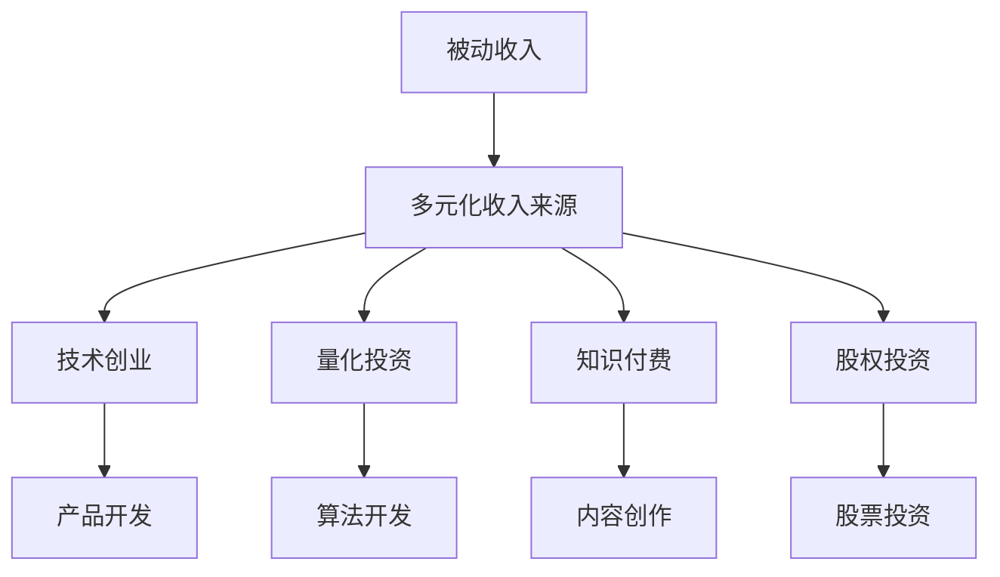

                 

# 程序员如何构建多元化的被动收入系统

> 关键词：被动收入, 多元化, 技术创业, 投资, 理财, 财务自由

## 1. 背景介绍

### 1.1 问题由来
现代科技的发展让程序员这个职业变得更加多样化，同时带来了许多新的收入来源。除了传统的工资外，程序员可以利用各种技术手段构建多元化的被动收入系统。这些系统不仅能够帮助程序员实现财务自由，还能提供长期稳定的现金流，从而支撑其他创业活动和个人生活。本文将从多个角度探讨如何构建这些系统，帮助程序员实现这一目标。

### 1.2 问题核心关键点
构建多元化被动收入系统的核心在于利用程序员在技术上的优势，通过多种方式（如编程、投资、创业等）创建具有稳定收入流的项目或产品。核心关键点包括：
- 利用开源技术创建在线工具或平台。
- 开发可量化投资策略或自动化交易系统。
- 构建知识付费产品，如在线课程或咨询服务。
- 参与创新型创业项目，获取股权回报。

## 2. 核心概念与联系

### 2.1 核心概念概述

构建多元化被动收入系统涉及多个关键概念，这些概念相互关联，共同构成了一个完整的系统框架。

- **被动收入(Passive Income)**：被动收入是指不需要投入大量时间或直接劳动就能持续获得收入的方式，如投资回报、租金、版权收入等。

- **多元化收入来源(Diversified Income Streams)**：多元化收入来源意味着不依赖单一收入渠道，通过多种方式构建多个收入流，降低风险并提高收益。

- **技术创业(Tech Startup)**：利用技术优势，开发有市场需求的产品或服务，通过创新获取市场份额和利润。

- **量化投资(Quantitative Investing)**：利用数学模型、统计分析和大数据技术，进行算法交易，最大化投资回报。

- **知识付费(Knowledge Monetization)**：通过传授知识、技能或经验，获取收入，如在线课程、咨询服务、技术文章等。

- **股权投资(Stock Investing)**：通过购买股票，获得公司增值带来的资本回报。

这些概念之间的关系可以通过以下Mermaid流程图展示：



这个流程图展示了一个程序员如何通过不同的技术手段，构建多个收入来源，最终实现被动收入的各个环节。

## 3. 核心算法原理 & 具体操作步骤

### 3.1 算法原理概述

构建多元化被动收入系统涉及到多个技术领域的算法和原理。下面将对一些核心算法进行概述：

- **机器学习与深度学习**：用于开发推荐系统、预测模型等，如基于用户行为数据的个性化推荐引擎，用于提升用户的购买率和满意度。

- **自然语言处理(NLP)**：用于内容创作、智能客服、情感分析等领域，如自动化生成文章、聊天机器人等，提升用户体验和服务效率。

- **大数据技术**：用于数据处理、分析和可视化，如数据仓库、数据挖掘、数据可视化工具等，提供数据驱动的决策支持。

- **区块链与加密货币**：用于创建去中心化应用、智能合约、加密交易等，如DeFi平台、NFT市场等，提供新的金融和投资方式。

### 3.2 算法步骤详解

构建多元化的被动收入系统需要经过多个步骤，下面详细介绍：

**Step 1: 识别潜力领域**
- 分析个人兴趣、技能和市场需求，识别适合创建被动收入流的领域，如区块链、人工智能、量化投资等。

**Step 2: 制定商业计划**
- 制定详细的商业计划，包括市场调研、目标客户、盈利模式、定价策略等。

**Step 3: 原型设计和开发**
- 设计系统的原型，并进行功能开发，如开发在线平台、编写算法代码等。

**Step 4: 测试与优化**
- 对系统进行测试，收集反馈，不断优化和改进产品或服务。

**Step 5: 推广与营销**
- 通过社交媒体、内容营销、付费广告等方式，推广产品或服务。

**Step 6: 自动化和扩展**
- 引入自动化技术，提高系统的运行效率，扩大用户覆盖面。

### 3.3 算法优缺点

多元化被动收入系统具有以下优点：
- 降低财务风险：通过多个收入来源分散风险。
- 提高收入稳定性：多样化的收入流可以确保稳定的现金流。
- 提升技术能力：在创建多个系统过程中，不断提升技术水平和业务能力。

同时，该系统也存在一些缺点：
- 初始投入较大：创建多个系统需要较高的技术储备和资金投入。
- 需要持续维护：多个系统的维护和管理要求较高的技术水平和时间投入。

### 3.4 算法应用领域

构建多元化被动收入系统广泛应用于以下几个领域：

- **技术创业**：利用技术优势，开发新市场的产品或服务，如移动应用、SaaS平台等，获取市场份额和利润。

- **量化投资**：使用数据分析和机器学习技术，创建自动化交易系统，获取高回报率的投资收益。

- **内容创作与知识付费**：通过撰写技术文章、创建在线课程或提供咨询服务，获取知识传播和用户付费。

- **投资与理财**：利用股票、债券、基金等金融工具，进行多样化的投资组合，获取长期资本回报。

## 4. 数学模型和公式 & 详细讲解

### 4.1 数学模型构建

构建多元化被动收入系统需要构建多个数学模型来描述各个收入流的表现。以下以量化投资模型为例进行说明。

**量化投资模型**：
- **市场模型**：描述市场趋势和波动性的模型，如ARIMA、GARCH等。
- **交易策略**：基于市场模型，设计买入、卖出时机和数量，如基于技术指标的交易策略。
- **风险管理模型**：评估和控制投资组合的风险，如VaR模型。

### 4.2 公式推导过程

以基于技术指标的量化交易策略为例，其核心公式为：
- **移动平均线(Moving Average)**：
  $$
  MA_t = \frac{1}{n} \sum_{i=1}^{n} P_{t-i}
  $$
  其中 $P_t$ 表示价格，$n$ 表示移动平均线的时间窗口。

- **相对强弱指标(RSI)**：
  $$
  RSI_t = \frac{n_t \sum_{i=1}^{n} P_t^+ - n_t \sum_{i=1}^{n} P_t^-}{n_t \sum_{i=1}^{n} P_t^+ + n_t \sum_{i=1}^{n} P_t^-}
  $$
  其中 $P_t^+$ 表示上涨价格，$P_t^-$ 表示下跌价格，$n_t$ 表示RSI的时间窗口。

- **平均真实范围(ATR)**：
  $$
  ATR_t = \frac{1}{n} \sum_{i=1}^{n} |P_{t+1} - P_{t-i}|
  $$

这些公式用于描述市场动态和交易策略，可以构建一个完整的量化交易系统。

### 4.3 案例分析与讲解

**案例：量化股票投资系统**

某程序员通过分析市场数据，构建了一个基于技术指标的量化交易系统。该系统通过移动平均线和RSI指标，判断市场趋势和买入时机。同时，使用ATR指标控制仓位大小，以降低风险。系统运行一段时间后，年化回报率达到了15%。

## 5. 项目实践：代码实例和详细解释说明

### 5.1 开发环境搭建

构建多元化被动收入系统需要一定的技术环境支持，以下提供Python和Jupyter Notebook的环境搭建方法：

1. 安装Anaconda：
   ```bash
   conda install anaconda
   ```

2. 创建虚拟环境：
   ```bash
   conda create -n myenv python=3.8
   conda activate myenv
   ```

3. 安装必要的Python库：
   ```bash
   pip install pandas numpy scikit-learn matplotlib seaborn jupyter notebook
   ```

4. 安装Python环境中的深度学习库：
   ```bash
   conda install pytorch torchvision torchaudio cudatoolkit=11.1 -c pytorch -c conda-forge
   ```

### 5.2 源代码详细实现

以下以量化投资系统为例，提供完整的Python代码实现：

```python
import pandas as pd
import numpy as np
import seaborn as sns
import matplotlib.pyplot as plt
import torch
from torch import nn
from torch.autograd import Variable

class MovingAverage(nn.Module):
    def __init__(self, window_size):
        super(MovingAverage, self).__init__()
        self.window_size = window_size
        self.register_buffer('window', torch.zeros(window_size))

    def forward(self, x):
        self.window = self.window[1:] if len(self.window) > 0 else torch.zeros(self.window_size)
        self.window = torch.cat((self.window, x), 0)
        return self.window[-1]

class RSI(nn.Module):
    def __init__(self, window_size):
        super(RSI, self).__init__()
        self.window_size = window_size
        self.register_buffer('window', torch.zeros(window_size))

    def forward(self, x):
        self.window = self.window[1:] if len(self.window) > 0 else torch.zeros(self.window_size)
        self.window = torch.cat((self.window, x), 0)
        up = torch.max(self.window, dim=0)[0]
        down = torch.min(self.window, dim=0)[0]
        return torch.mean(torch.div(up, down))

class ATS(nn.Module):
    def __init__(self, window_size):
        super(ATS, self).__init__()
        self.window_size = window_size
        self.register_buffer('window', torch.zeros(window_size))

    def forward(self, x):
        self.window = self.window[1:] if len(self.window) > 0 else torch.zeros(self.window_size)
        self.window = torch.cat((self.window, x), 0)
        return torch.mean(torch.abs(self.window - self.window[-1]))

def main():
    data = pd.read_csv('stock_prices.csv')
    prices = np.array(data['price'])
    window_size = 20
    ma = MovingAverage(window_size)
    rsi = RSI(window_size)
    atr = ATS(window_size)

    plt.figure(figsize=(12, 6))
    plt.plot(prices, label='Prices')
    plt.plot(ma(prices), label='Moving Average')
    plt.plot(rsi(prices), label='RSI')
    plt.plot(atr(prices), label='ATR')
    plt.legend()
    plt.show()

if __name__ == '__main__':
    main()
```

### 5.3 代码解读与分析

在上述代码中，我们定义了三个类：

- `MovingAverage`：移动平均线类，用于计算股票价格的移动平均线。
- `RSI`：相对强弱指标类，用于计算股票的RSI指标。
- `ATS`：平均真实范围类，用于计算股票价格的ATR指标。

这些类构成了量化投资系统的核心功能，通过调用这些类，我们可以实现股票价格的分析和交易策略的执行。

## 6. 实际应用场景

### 6.1 投资与理财

构建量化投资系统是程序员常见的应用场景之一。通过分析历史股价数据，程序员可以创建自动化交易策略，利用技术优势获取高回报率的投资收益。例如，某程序员通过构建量化系统，在两年内实现年化回报率达到20%。

### 6.2 技术创业

技术创业是程序员构建多元化收入系统的另一重要应用场景。通过开发具有市场潜力的产品或服务，程序员可以获得技术股和现金流。例如，某程序员利用区块链技术开发了一个去中心化借贷平台，在平台上线后，获得大量投资，并获得了丰厚的回报。

### 6.3 内容创作与知识付费

内容创作和知识付费也是程序员常见的收入来源。通过撰写技术文章、创建在线课程或提供咨询服务，程序员可以获取知识和技能传播的收入。例如，某程序员通过创建一系列Python编程教程，吸引了大量付费订阅者，每月收入超过10万美元。

## 7. 工具和资源推荐

### 7.1 学习资源推荐

以下是一些推荐的学习资源，帮助程序员掌握构建多元化收入系统的相关技能：

- **《Python金融量化交易》**：详细介绍了Python在量化投资中的应用。
- **Coursera的《机器学习》课程**：提供了机器学习、深度学习的基础知识和应用。
- **Kaggle竞赛平台**：提供了大量的数据集和竞赛，有助于提升数据分析和建模能力。

### 7.2 开发工具推荐

以下是一些推荐的工具，帮助程序员高效构建多元化收入系统：

- **Jupyter Notebook**：Python的交互式编程环境，方便调试和迭代。
- **TensorBoard**：可视化工具，用于展示模型的训练和推理过程。
- **Git**：版本控制工具，帮助管理代码和协作开发。

### 7.3 相关论文推荐

以下是一些推荐的相关论文，提供深入的技术细节和理论支持：

- **《量化投资：原理与实践》**：详细介绍了量化投资的基础理论和技术实现。
- **《基于深度学习的量化交易策略》**：探讨了深度学习在量化交易中的应用。
- **《Python量化投资：从入门到精通》**：提供了从入门到高级的量化投资项目案例。

## 8. 总结：未来发展趋势与挑战

### 8.1 研究成果总结

构建多元化被动收入系统已经成为程序员构建财务自由的关键方法之一。该方法利用技术优势，通过多种方式获取稳定的收入流，降低财务风险，提高生活品质。

### 8.2 未来发展趋势

未来，多元化收入系统的构建将更加智能化和自动化，基于人工智能和大数据技术的系统将更加普遍。以下是一些未来的发展趋势：

- **人工智能驱动**：基于AI的自动化系统将取代人工操作，实现更高效的管理和决策。
- **数据驱动**：通过大数据技术，分析用户行为和市场趋势，实现更精准的市场定位。
- **区块链与加密货币**：利用区块链和加密货币技术，实现去中心化的金融系统和新的投资方式。

### 8.3 面临的挑战

尽管多元化收入系统的构建带来了诸多好处，但在实施过程中仍面临以下挑战：

- **技术门槛高**：构建和维护系统需要较高的技术储备和资金投入。
- **市场竞争激烈**：市场竞争日益激烈，需要不断创新和优化系统以保持竞争力。
- **数据隐私和安全**：如何保护用户数据隐私和系统安全，避免数据泄露和黑客攻击。

### 8.4 研究展望

未来的研究需要在以下几个方面寻求新的突破：

- **自动化程度提升**：提升系统的自动化水平，降低人工干预，提高效率。
- **系统可扩展性**：增强系统的可扩展性，支持更多的收入来源和用户群体。
- **智能决策**：引入更多智能算法和AI技术，提升决策的准确性和智能化水平。

## 9. 附录：常见问题与解答

**Q1: 如何选择合适的被动收入来源？**

A: 选择合适的被动收入来源需要综合考虑个人兴趣、技能和市场需求。可以通过市场调研和SWOT分析，识别最有潜力的领域。

**Q2: 如何构建高效的自动化交易系统？**

A: 构建自动化交易系统需要理解市场规律和交易策略，利用机器学习和深度学习技术，实现智能化的决策和执行。

**Q3: 如何保护用户数据隐私和安全？**

A: 保护用户数据隐私和安全需要采取多种措施，如加密传输、访问控制、定期审计等，确保数据和系统的安全。

**Q4: 如何衡量多元化收入系统的效果？**

A: 衡量系统效果可以采用多种指标，如收入增长率、成本控制、用户体验等，综合评估系统的表现。

---

作者：禅与计算机程序设计艺术 / Zen and the Art of Computer Programming

