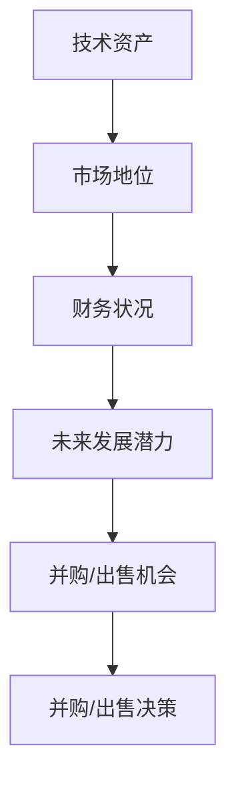

                 

## 1. 背景介绍

### 1.1 问题由来

并购和公司出售是公司成长和扩张的重要手段，也是企业战略调整和资源优化的一种方式。然而，并购和出售决策通常涉及巨大的财务风险和不确定性，需要慎重考虑。作为程序员，如何从技术和商业角度综合评估并购和出售机会，成为当前IT行业的热点话题。

### 1.2 问题核心关键点

评估并购和出售机会的核心在于综合分析公司的技术资产、市场地位、财务状况和未来发展潜力。具体关键点包括：

- 技术资产评估：评估公司核心技术的市场竞争力、技术壁垒、创新性和应用前景。
- 市场地位分析：分析公司在所处行业中的市场份额、品牌影响力和竞争优势。
- 财务状况审查：考察公司的收入、利润、现金流、债务和投资回报率等关键财务指标。
- 未来发展潜力预测：分析公司的增长潜力和市场趋势，评估其长期可持续性。

本文将从技术资产、市场地位、财务状况和未来发展潜力四个方面，介绍如何全面评估并购和出售机会。

## 2. 核心概念与联系

### 2.1 核心概念概述

为更好地理解并购和出售的评估过程，本节将介绍几个关键概念：

- 并购(Merger & Acquisition, M&A)：指一家公司通过收购另一家公司的股权或资产，实现资源整合，以实现公司扩张、市场进入、技术获取等战略目的。
- 公司出售：指公司将其全部或部分业务、资产或股份出售给第三方，实现资本变现或聚焦核心业务。
- 技术资产：指公司拥有或控制的、具有商业价值的技术资源，如专利、商标、软件系统、算法等。
- 市场地位：指公司在所处行业中的市场份额、品牌影响力、用户忠诚度、竞争优势等综合评价指标。
- 财务状况：指公司的资产、负债、现金流、利润等财务指标的综合反映。
- 未来发展潜力：指公司基于其资源、战略和市场环境，预测未来增长的可能性。

这些概念之间的联系可以通过以下Mermaid流程图来展示：



这个流程图展示了并购和出售评估的核心逻辑：

1. 技术资产是公司最核心的资产，决定其市场竞争力。
2. 市场地位和财务状况反映公司的当前状态和竞争优势。
3. 未来发展潜力是公司未来的增长空间和市场前景。
4. 综合以上因素，评估并购和出售机会，做出最终的决策。

## 3. 核心算法原理 & 具体操作步骤
### 3.1 算法原理概述

评估并购和出售机会的算法，主要基于数据挖掘、机器学习和财务分析等技术。通过收集和分析公司相关的数据，构建数学模型，预测并购和出售的效果。核心算法原理包括：

- 数据预处理：清洗和处理原始数据，去除噪音，提取关键特征。
- 特征选择：通过特征选择算法，筛选对并购和出售效果有显著影响的关键指标。
- 模型构建：选择适合的机器学习模型，如回归、分类、聚类等，构建评估模型。
- 模型训练：使用历史数据对模型进行训练，并验证其效果。
- 结果分析：分析模型输出，评估并购和出售机会，并给出最终决策建议。

### 3.2 算法步骤详解

#### 步骤1：数据预处理

数据预处理是评估的第一步，主要任务是对原始数据进行清洗、归一化和特征提取：

- 清洗数据：去除重复、缺失、异常值等噪声数据。
- 归一化：对数据进行标准化处理，使其在0到1之间，便于模型处理。
- 特征提取：根据公司评估的指标，提取关键特征，如市场份额、利润率、技术创新性等。

#### 步骤2：特征选择

特征选择是决定评估结果准确性的关键步骤，主要通过以下方法：

- 相关性分析：计算特征与评估指标之间的相关性，筛选重要特征。
- 主成分分析(PCA)：通过降维技术，提取数据的主成分，减少特征数量。
- Lasso回归：使用Lasso正则化，筛选对结果有显著影响的特征，去除冗余特征。

#### 步骤3：模型构建

选择合适的机器学习模型，构建并购和出售机会评估模型。常用的模型包括：

- 线性回归：适用于连续型目标变量，如评估公司的市场价值。
- 决策树和随机森林：适用于分类和回归任务，能够处理非线性关系。
- 神经网络：适用于复杂非线性关系，能够处理高维数据。
- 支持向量机(SVM)：适用于高维数据分类和回归任务。

#### 步骤4：模型训练

模型训练是评估模型的关键步骤，主要任务是使用历史数据对模型进行训练，并验证其效果：

- 划分数据集：将数据分为训练集、验证集和测试集。
- 交叉验证：使用交叉验证技术，验证模型的泛化能力。
- 模型优化：调整模型参数，如学习率、正则化系数等，优化模型性能。
- 模型评估：使用测试集评估模型效果，如准确率、召回率、F1分数等。

#### 步骤5：结果分析

根据模型输出，评估并购和出售机会，并给出最终决策建议：

- 确定阈值：根据模型输出结果，确定并购和出售机会的阈值，如高风险、中等风险、低风险等。
- 风险分析：分析并购和出售的风险，如市场风险、财务风险、技术风险等。
- 决策建议：根据风险分析和市场趋势，给出并购或出售的决策建议。

### 3.3 算法优缺点

并购和出售机会评估的算法具有以下优点：

- 数据驱动：基于数据挖掘和机器学习技术，能够自动筛选关键指标，减少主观偏差。
- 可解释性强：模型输出具有明确的数学解释，便于理解和决策。
- 动态更新：能够实时更新模型，适应市场变化和公司发展。

同时，该算法也存在一些局限性：

- 数据依赖：评估结果依赖于数据质量，数据噪声或缺失可能影响结果准确性。
- 模型假设：模型构建基于特定假设，可能与实际情况存在偏差。
- 复杂度较高：模型构建和训练过程较为复杂，需要专业知识。

### 3.4 算法应用领域

并购和出售机会评估的算法广泛应用于以下领域：

- 投资银行和私募股权：评估并购和出售机会，提供投资建议。
- 企业战略规划：评估公司扩张和资源优化策略，制定未来发展计划。
- 财务分析和审计：评估公司的财务状况和市场地位，进行风险评估。
- 技术评估：评估公司的技术资产和创新能力，制定技术战略。

## 4. 数学模型和公式 & 详细讲解 & 举例说明

### 4.1 数学模型构建

本节将使用数学语言对并购和出售机会的评估过程进行更加严格的刻画。

假设并购机会的评估指标为 $Y$，包括市场份额、利润率、技术创新性等，通过回归模型预测并购机会的概率 $p(Y)$，使用二分类逻辑回归模型：

$$
p(Y=1|X) = \frac{1}{1+e^{-\beta_0 - \sum_{i=1}^n\beta_iX_i}}
$$

其中 $X=(X_1, X_2, ..., X_n)$ 为特征向量，$\beta_0, \beta_1, ..., \beta_n$ 为模型系数。

### 4.2 公式推导过程

以二分类逻辑回归模型为例，推导其公式：

$$
p(Y=1|X) = \frac{1}{1+e^{-\beta_0 - \sum_{i=1}^n\beta_iX_i}}
$$

给定训练集 $(X_i, Y_i), i=1,2,...,N$，通过最大似然估计法求解模型系数 $\beta$：

$$
\hat{\beta} = \arg\max_{\beta} \sum_{i=1}^N\log[p(Y_i|X_i)] = \arg\min_{\beta} -\sum_{i=1}^N[\log(p(Y_i|X_i))+Y_i\log(p(Y_i|X_i))]
$$

使用梯度下降法求解：

$$
\beta^{(k+1)} = \beta^{(k)} - \alpha\frac{\partial}{\partial\beta}[-\sum_{i=1}^N[\log(p(Y_i|X_i))+Y_i\log(p(Y_i|X_i))]
$$

其中 $\alpha$ 为学习率，$k$ 为迭代次数。

### 4.3 案例分析与讲解

假设某公司计划收购另一家初创公司，使用历史数据评估其并购机会。具体步骤如下：

- 收集历史收购数据，提取关键指标，如收购价格、收购后利润率、市场份额等。
- 对数据进行预处理，清洗和归一化处理。
- 使用PCA降维技术，提取关键特征，减少特征数量。
- 构建逻辑回归模型，使用交叉验证技术优化模型参数。
- 使用测试集评估模型效果，根据输出结果评估并购机会。

## 5. 项目实践：代码实例和详细解释说明

### 5.1 开发环境搭建

在进行并购和出售评估实践前，我们需要准备好开发环境。以下是使用Python进行Scikit-learn开发的环境配置流程：

1. 安装Anaconda：从官网下载并安装Anaconda，用于创建独立的Python环境。

2. 创建并激活虚拟环境：
```bash
conda create -n pyenv python=3.8 
conda activate pyenv
```

3. 安装Scikit-learn：
```bash
conda install scikit-learn
```

4. 安装各类工具包：
```bash
pip install numpy pandas matplotlib scikit-learn scikit-learn
```

完成上述步骤后，即可在`pyenv`环境中开始评估实践。

### 5.2 源代码详细实现

这里我们以并购机会评估为例，给出使用Scikit-learn对数据进行回归分析的PyTorch代码实现。

首先，定义并购机会的数据处理函数：

```python
import pandas as pd
from sklearn.model_selection import train_test_split
from sklearn.preprocessing import StandardScaler
from sklearn.linear_model import LogisticRegression

def preprocess_data(data):
    # 数据清洗和归一化处理
    data = data.dropna().copy()
    data = StandardScaler().fit_transform(data)
    # 特征选择
    features = ['market_share', 'profit_rate', 'innovation']
    data = pd.DataFrame(data, columns=features)
    return data

# 加载历史数据
data = pd.read_csv('acquisition_data.csv')

# 数据预处理
processed_data = preprocess_data(data)

# 划分训练集和测试集
X_train, X_test, y_train, y_test = train_test_split(processed_data.drop('acquisition', axis=1), processed_data['acquisition'], test_size=0.2, random_state=42)

# 建立逻辑回归模型
model = LogisticRegression()
model.fit(X_train, y_train)
```

然后，定义模型评估函数：

```python
from sklearn.metrics import classification_report

def evaluate_model(model, X_test, y_test):
    # 模型评估
    y_pred = model.predict(X_test)
    report = classification_report(y_test, y_pred)
    print(report)
```

最后，启动评估流程：

```python
evaluate_model(model, X_test, y_test)
```

以上就是使用Scikit-learn对并购机会进行评估的完整代码实现。可以看到，得益于Scikit-learn的强大封装，我们能够用相对简洁的代码完成并购机会的回归分析。

### 5.3 代码解读与分析

让我们再详细解读一下关键代码的实现细节：

**preprocess_data函数**：
- 对数据进行清洗和归一化处理。
- 使用特征选择技术，提取关键特征。

**evaluate_model函数**：
- 对模型进行评估，使用分类报告输出模型性能。

**评估流程**：
- 将数据预处理后，划分训练集和测试集。
- 建立逻辑回归模型，并进行训练。
- 使用测试集评估模型性能。

可以看到，Scikit-learn提供了丰富的机器学习工具，使得并购和出售评估的代码实现变得简洁高效。开发者可以将更多精力放在数据处理、模型改进等高层逻辑上，而不必过多关注底层的实现细节。

当然，工业级的系统实现还需考虑更多因素，如模型保存和部署、超参数自动搜索、更灵活的特征提取等。但核心的回归分析流程基本与此类似。

## 6. 实际应用场景

### 6.1 投资银行和私募股权

投资银行和私募股权是并购和出售机会评估的主要应用场景。通过对目标公司的技术资产、市场地位和财务状况进行分析，评估并购机会，提供投资建议。

在技术实现上，可以收集历史并购案例，提取关键指标，构建回归模型进行评估。同时，结合市场趋势和公司战略，给出投资建议。

### 6.2 企业战略规划

企业战略规划也需要评估并购和出售机会。通过对公司内部和外部的数据进行综合分析，评估并购和出售的风险和收益，制定未来发展战略。

在技术实现上，可以收集公司内部运营数据和外部市场数据，构建多维度模型，评估并购和出售机会，制定战略规划。

### 6.3 财务分析和审计

财务分析和审计也需要评估并购和出售机会。通过对公司的财务数据进行综合分析，评估其财务状况和市场地位，进行风险评估。

在技术实现上，可以收集公司财务数据和市场数据，构建回归和分类模型，评估并购和出售机会，进行财务分析和审计。

### 6.4 未来应用展望

随着并购和出售机会评估技术的发展，未来将会有更多应用场景：

- 行业并购报告：通过并购评估技术，为行业内企业提供并购机会的分析和预测。
- 政府战略决策：通过并购和出售评估技术，为政府提供宏观经济调控和战略决策支持。
- 跨国并购：通过并购评估技术，为跨国企业提供市场进入和资源整合的战略支持。
- 企业内部并购：通过并购评估技术，为大型企业提供内部并购和资源优化的决策支持。

总之，并购和出售评估技术将会在更广泛的场景下得到应用，为企业和政府提供战略决策支持，推动经济和社会发展。

## 7. 工具和资源推荐

### 7.1 学习资源推荐

为了帮助开发者系统掌握并购和出售评估的理论基础和实践技巧，这里推荐一些优质的学习资源：

1. 《金融工程与投资分析》课程：哥伦比亚大学开设的金融工程和投资分析课程，详细讲解并购和出售机会的评估方法。

2. 《企业并购和资本重组》书籍：一本系统介绍企业并购和资本重组的理论和实践的书籍，适合初学者和专业人士。

3. 《企业并购战略》课程：哈佛商学院开设的企业并购战略课程，深入讲解并购机会的评估和决策。

4. 《机器学习实战》书籍：TensorFlow等机器学习框架的实战教程，帮助开发者掌握并购和出售评估的算法实现。

5. 《金融风险管理》课程：北京大学开设的金融风险管理课程，讲解并购和出售机会的财务风险评估方法。

通过对这些资源的学习实践，相信你一定能够快速掌握并购和出售评估的精髓，并用于解决实际的并购和出售问题。

### 7.2 开发工具推荐

高效的开发离不开优秀的工具支持。以下是几款用于并购和出售评估开发的常用工具：

1. Python：作为数据科学和机器学习的主要编程语言，具有强大的数据分析和建模能力，适用于并购和出售评估。

2. Scikit-learn：Python的机器学习库，提供了丰富的算法和工具，适合构建并购和出售机会评估模型。

3. Pandas：Python的数据处理库，适合处理大规模数据集，进行数据清洗和特征提取。

4. Jupyter Notebook：Python的交互式笔记本，支持代码实时运行和结果可视化，适合进行模型训练和评估。

5. Matplotlib和Seaborn：Python的数据可视化库，适合生成各种图表，帮助开发者理解数据和模型输出。

6. TensorFlow和PyTorch：Python的深度学习框架，适合构建复杂模型，进行并购和出售机会的评估。

合理利用这些工具，可以显著提升并购和出售评估的开发效率，加快创新迭代的步伐。

### 7.3 相关论文推荐

并购和出售机会评估的研究源于学界的持续研究。以下是几篇奠基性的相关论文，推荐阅读：

1. M&A Theory: A Review and Analysis of Empirical Research 1965-2013：对M&A理论的全面综述，分析了并购和出售机会的评估方法和实证结果。

2. The effect of M&A on the performance of acquired firms：研究并购对被收购公司性能的影响，分析了并购机会的评估和决策。

3. M&A Strategy: The Role of Transaction Power, Integration, and Mangers' Goals：研究并购策略对并购机会评估的影响，分析了并购和出售机会的决策和实施。

4. The Efficiency of M&A: Evidence from the New York Stock Exchange 1950-1984：研究并购效率，分析了并购和出售机会的评估和实施。

5. The Effect of Board Structure and Size on Strategic Corporate M&A Outcomes：研究董事会结构对并购机会评估的影响，分析了并购和出售机会的决策和实施。

这些论文代表了大语言模型微调技术的发展脉络。通过学习这些前沿成果，可以帮助研究者把握学科前进方向，激发更多的创新灵感。

## 8. 总结：未来发展趋势与挑战

### 8.1 总结

本文对并购和出售机会的评估方法进行了全面系统的介绍。首先阐述了并购和出售机会评估的背景和意义，明确了评估在企业战略和投资决策中的重要价值。其次，从技术资产、市场地位、财务状况和未来发展潜力四个方面，详细讲解了并购和出售机会的评估过程。最后，本文还探讨了并购和出售评估在多个行业领域的应用前景，展示了其巨大的潜力。

通过本文的系统梳理，可以看到，并购和出售机会评估方法正在成为企业战略和投资决策的重要范式，极大地拓展了企业的资源整合和市场进入能力，催生了更多的落地场景。未来，伴随并购和出售评估方法的持续演进，相信企业战略决策将更加科学合理，经济和社会发展将得到更高效的推动。

### 8.2 未来发展趋势

展望未来，并购和出售评估技术将呈现以下几个发展趋势：

1. 数据驱动：随着大数据技术的不断进步，并购和出售评估将更加依赖数据驱动，提高评估结果的准确性和可靠性。

2. 自动化程度提高：通过机器学习和自动化技术，简化并购和出售评估流程，提高评估效率和准确性。

3. 跨学科融合：并购和出售评估将与金融、会计、战略等多个学科深度融合，形成更系统的理论框架。

4. 模型多样化：除了传统的回归和分类模型，将涌现更多先进的评估方法，如深度学习、强化学习等，提高评估模型的复杂性和适应性。

5. 风险管理加强：并购和出售评估将更加注重风险管理，通过模型评估和管理并购和出售过程中的财务和市场风险。

6. 决策支持系统：构建更加智能化的决策支持系统，提供更加科学合理的并购和出售决策建议。

以上趋势凸显了并购和出售评估技术的广阔前景。这些方向的探索发展，必将进一步提升并购和出售评估的科学性和实用性，为企业的战略决策提供更加坚实的支持。

### 8.3 面临的挑战

尽管并购和出售评估技术已经取得了瞩目成就，但在迈向更加智能化、普适化应用的过程中，它仍面临诸多挑战：

1. 数据获取难度大：高质量并购和出售数据难以获取，数据样本量不足可能影响评估结果的可靠性。

2. 模型复杂度高：并购和出售评估模型复杂度较高，需要专业知识进行构建和优化。

3. 模型解释性不足：并购和出售评估模型的输出结果难以解释，不利于企业理解和决策。

4. 高风险决策：并购和出售评估涉及高额财务和市场风险，决策失误可能带来重大损失。

5. 合规性要求高：并购和出售评估需要符合法规和标准，确保评估过程和结果的合法性和公正性。

6. 跨文化差异：跨国并购和出售评估面临文化差异和市场环境的变化，评估难度较大。

正视并购和出售评估面临的这些挑战，积极应对并寻求突破，将是大语言模型微调技术走向成熟的必由之路。相信随着学界和产业界的共同努力，这些挑战终将一一被克服，并购和出售评估必将在构建人机协同的智能时代中扮演越来越重要的角色。

### 8.4 研究展望

面向未来，并购和出售评估技术需要在以下几个方面寻求新的突破：

1. 数据获取和预处理：构建大规模并购和出售数据集，提升数据获取和预处理的自动化水平。

2. 模型简化和优化：开发更加简单、高效、易于解释的评估模型，提高模型的实用性和决策支持能力。

3. 风险管理方法：结合量化风险管理技术，构建更加科学的并购和出售风险评估模型。

4. 跨文化评估方法：开发适用于跨国并购和出售的评估方法，应对不同文化和市场环境。

5. 合规性保障：构建合规性保障机制，确保并购和出售评估的合法性和公正性。

6. 模型优化和改进：结合最新研究成果，不断优化并购和出售评估模型，提升其性能和可靠性。

这些研究方向和课题的探索，必将引领并购和出售评估技术迈向更高的台阶，为构建科学合理的并购和出售决策系统铺平道路。总之，并购和出售评估需要开发者从数据、算法、工程、业务等多个维度协同发力，才能真正实现人工智能技术在垂直行业的规模化落地。

## 9. 附录：常见问题与解答

**Q1：并购和出售评估是否适用于所有行业？**

A: 并购和出售评估适用于大多数行业，但不同行业的并购和出售特点有所不同。例如，科技行业的并购往往侧重于技术资源获取，而消费品行业的并购则更关注品牌和市场拓展。因此，评估时需要根据行业特点进行具体分析。

**Q2：如何选择合适的评估模型？**

A: 评估模型的选择主要取决于评估目标和数据类型。例如，对于连续型目标变量，可以使用线性回归模型；对于分类变量，可以使用逻辑回归、决策树等模型。同时，需要考虑模型的复杂度和可解释性，选择最适合的模型。

**Q3：并购和出售评估过程中的数据依赖问题如何解决？**

A: 数据依赖是并购和出售评估的主要挑战之一。为了缓解数据依赖，可以使用历史数据以外的信息，如公司公告、新闻报道等。同时，可以通过数据增强技术，如缺失值填充、异常值检测等，提高数据质量。

**Q4：并购和出售评估如何应对高风险决策？**

A: 并购和出售评估面临高风险决策，需要通过风险管理方法和模型来降低风险。例如，可以构建多维度风险评估模型，综合考虑财务风险、市场风险和技术风险等。同时，需要进行风险压力测试，评估不同情景下的风险承受能力。

**Q5：并购和出售评估如何应对跨文化差异？**

A: 跨国并购和出售评估面临文化差异和市场环境的变化，需要构建跨文化评估方法。例如，可以使用多语言数据进行评估，综合考虑不同市场的文化背景和市场环境。同时，需要进行跨文化培训和沟通，确保并购和出售评估的公正性和合法性。

总之，并购和出售评估需要开发者从数据、算法、工程、业务等多个维度协同发力，才能真正实现人工智能技术在垂直行业的规模化落地。总之，并购和出售评估需要开发者从数据、算法、工程、业务等多个维度协同发力，才能真正实现人工智能技术在垂直行业的规模化落地。

---

作者：禅与计算机程序设计艺术 / Zen and the Art of Computer Programming

