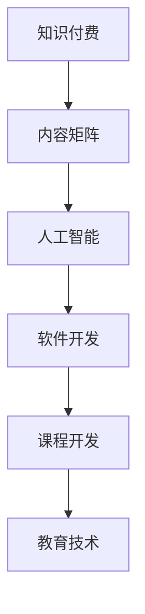

                 

# 程序员如何进行知识付费的内容矩阵

> 关键词：知识付费, 内容矩阵, 人工智能, 软件开发, 课程开发, 教育技术

## 1. 背景介绍

### 1.1 问题由来

近年来，知识付费市场呈现爆发式增长，吸引了一大批专注于内容创造和传播的创作者，特别是程序员和技术专家。他们通过撰写技术博客、开设编程课程、参加技术讲座等方式，将自己的知识和经验变现。然而，知识付费产品的同质化问题也日益凸显，用户难以在海量内容中找到适合自己的资源。

### 1.2 问题核心关键点

为解决内容同质化问题，创作者们亟需构建一套具有鲜明特色和价值的内容矩阵。该内容矩阵应充分体现自身独特的知识体系和教学方法，帮助用户以低成本、高效率的方式获取有价值的技术知识。本文将介绍如何构建和运营这样一套内容矩阵，为程序员的知识付费变现提供指导。

## 2. 核心概念与联系

### 2.1 核心概念概述

为更好地理解程序员知识付费的内容矩阵，本节将介绍几个核心概念：

- 知识付费(Knowledge-As-a-Service, KaaS)：一种新的内容生产与消费模式，用户付费获取专业知识或技能。
- 内容矩阵(Content Matrix)：通过结构化的内容设计，形成多维度的知识体系，涵盖入门、进阶、高级等多个层次。
- 人工智能(Artificial Intelligence, AI)：一种通过机器学习、自然语言处理等技术，自动化生成和推荐个性化内容的技术。
- 软件开发(Software Development, SD)：涉及需求分析、设计、编码、测试、维护等全流程的工程实践。
- 课程开发(Course Development)：为学习者设计的系统化教学资源，通过视频、文字、代码等方式传递知识。
- 教育技术(Education Technology, EdTech)：利用技术手段优化教育过程，提升教育质量和学习效率。

这些概念之间的逻辑关系可以通过以下Mermaid流程图来展示：



这个流程图展示出知识付费和内容矩阵之间的逻辑关系：

1. 知识付费以内容矩阵为基础，提供多样化的知识服务。
2. 内容矩阵利用人工智能技术进行内容生成和推荐。
3. 软件开发提供实现和部署内容矩阵的平台工具。
4. 课程开发是内容矩阵的核心，涵盖技术知识传递的全过程。
5. 教育技术用于优化内容矩阵的构建和应用。

## 3. 核心算法原理 & 具体操作步骤

### 3.1 算法原理概述

构建知识付费内容矩阵的核心在于设计一套动态的内容推荐系统，根据用户的学习需求、兴趣和反馈，智能推荐适合的内容。该系统的设计理念包括：

- 个性化推荐：根据用户行为和偏好，动态调整内容展示顺序。
- 多样性保障：确保推荐内容覆盖广泛的知识点和技能。
- 内容迭代：根据用户反馈和评价，实时调整和优化推荐内容。

### 3.2 算法步骤详解

构建知识付费内容矩阵的步骤如下：

**Step 1: 设计内容框架**

首先，需要确定内容矩阵的框架结构。根据技术栈和知识点，设计从入门到高级的多层次内容模块。例如：

- 基础模块：涵盖编程语言基础、算法与数据结构等基础知识点。
- 进阶模块：包括架构设计、并发编程、性能优化等中级技术。
- 高级模块：涉及分布式系统、云计算、大数据等高级应用场景。

**Step 2: 内容采集与组织**

内容来源包括创作者原创、官方文档、开源项目等。根据内容框架组织整理，将相关内容归类到对应的模块和章节中。例如，将所有关于Python编程的文档和教程整合到“Python基础”模块下。

**Step 3: 数据标注与分类**

对采集到的内容进行标注和分类，使其符合内容矩阵的结构要求。例如，将所有课程和文章标注为初级、中级或高级，并分类到相应的模块。

**Step 4: 用户画像构建**

分析用户行为数据，构建用户画像，包括用户的学习偏好、历史阅读记录、评分等。例如，记录用户常浏览的编程语言和技术栈，以及其在不同内容上的评分和评论。

**Step 5: 推荐算法设计**

设计推荐算法，根据用户画像和内容特征，计算用户与内容的相关度，生成推荐列表。常见的推荐算法包括协同过滤、基于内容的推荐、深度学习推荐等。

**Step 6: 实时反馈与优化**

根据用户的实时反馈，如点击率、停留时间、评分等，动态调整推荐策略。例如，当用户对某门课程评分较低时，降低该课程在推荐列表中的权重。

### 3.3 算法优缺点

构建知识付费内容矩阵的算法具有以下优点：

- 个性化推荐：根据用户兴趣和行为动态调整推荐内容，提升用户满意度。
- 多样性保障：确保用户可以接触到全面的知识体系，弥补单一来源的局限。
- 内容迭代：通过实时反馈和优化，不断提高推荐内容的准确性和相关性。

同时，该算法也存在一些局限性：

- 数据隐私：用户行为数据的收集和处理可能涉及隐私问题，需要合规处理。
- 算法复杂度：设计高效的推荐算法需要一定的技术积累和计算资源。
- 内容质量：推荐内容质量取决于内容来源和分类准确性，需要严格审核和标注。

### 3.4 算法应用领域

基于知识付费内容矩阵的推荐算法，已经广泛应用于多个领域，例如：

- 技术博客平台：通过分析用户阅读习惯，推荐相关文章和专栏。
- 编程课程平台：根据用户学习历史，推荐适合的课程和练习。
- 技术讲座平台：根据用户关注的技术方向，推荐适合的讲座和嘉宾。
- 在线教育平台：根据用户学习进度，推荐后续课程和练习。
- 开发者社区：根据用户参与讨论的热点话题，推荐相关的技术讨论和教程。

## 4. 数学模型和公式 & 详细讲解 & 举例说明

### 4.1 数学模型构建

为了设计高效的推荐算法，可以构建一个基于内容的协同过滤推荐模型。设用户集为 $U$，物品集为 $I$，用户与物品的交互矩阵为 $R \in \mathbb{R}^{m \times n}$，其中 $m$ 为用户数，$n$ 为物品数。设用户 $u$ 对物品 $i$ 的评分 $r_{ui}$，则推荐模型可以表示为：

$$
\hat{r}_{ui} = \alpha \hat{p}_u(i) + \beta \hat{q}_i(u)
$$

其中 $\hat{p}_u(i)$ 为物品 $i$ 的特征向量，$\hat{q}_u(i)$ 为用户 $u$ 的特征向量。$\alpha$ 和 $\beta$ 为调节因子，通常设定为 0.5。

### 4.2 公式推导过程

在协同过滤推荐模型中，物品特征向量 $\hat{p}_u(i)$ 可以表示为：

$$
\hat{p}_u(i) = \frac{1}{||p||} p_i^T X_u
$$

其中 $p_i$ 为物品 $i$ 的原始特征向量，$X_u$ 为用户 $u$ 的原始特征向量，$||p||$ 为向量 $p$ 的模长。

用户特征向量 $\hat{q}_u(i)$ 可以表示为：

$$
\hat{q}_u(i) = \frac{1}{||q||} q_i^T X_u
$$

其中 $q_i$ 为物品 $i$ 的原始特征向量，$X_u$ 为用户 $u$ 的原始特征向量，$||q||$ 为向量 $q$ 的模长。

根据上述公式，可以得到推荐模型：

$$
\hat{r}_{ui} = \alpha \frac{p_i^T X_u}{||p||} + \beta \frac{q_i^T X_u}{||q||}
$$

### 4.3 案例分析与讲解

以一个在线编程课程平台为例，我们如何使用协同过滤推荐模型推荐课程。设课程集为 $C$，每个课程的特征向量 $p_c$ 包括标题、摘要、评价等，用户 $u$ 的特征向量 $X_u$ 包括历史阅读记录、学习进度、评分等。

首先，根据用户 $u$ 的特征向量 $X_u$ 和课程 $c$ 的特征向量 $p_c$，计算用户 $u$ 对课程 $c$ 的预测评分 $\hat{r}_{uc}$：

$$
\hat{r}_{uc} = \frac{p_c^T X_u}{||p_c||} + \frac{q_c^T X_u}{||q_c||}
$$

然后，对所有课程的评分 $\hat{r}_{uc}$ 进行排序，选择评分最高的 $k$ 门课程推荐给用户 $u$。

## 5. 项目实践：代码实例和详细解释说明

### 5.1 开发环境搭建

在进行知识付费内容矩阵的开发时，需要以下开发环境：

1. 编程语言：Python。
2. 框架库：Flask、TensorFlow、Pandas。
3 数据库：MySQL、Elasticsearch。
4 工具：Jupyter Notebook、PyCharm。

在上述环境中，我们可以使用Python编写推荐系统后端和前端代码，使用TensorFlow实现协同过滤推荐算法，使用Pandas进行数据处理，使用MySQL存储用户和课程信息，使用Elasticsearch优化推荐查询速度。

### 5.2 源代码详细实现

以下是一个简单的课程推荐系统的代码实现，包括后端服务和前端界面。

**后端服务代码：**

```python
from flask import Flask, request, jsonify
from tensorflow.keras.models import load_model
import pandas as pd
import mysql.connector

app = Flask(__name__)

# 加载协同过滤模型
model = load_model('recommender_model.h5')

# 查询MySQL数据库，获取用户和课程信息
def get_user_course_data(user_id):
    cnx = mysql.connector.connect(user='username', password='password', host='localhost', database='mydatabase')
    cursor = cnx.cursor()
    query = "SELECT user_id, course_id, score FROM user_course_scores WHERE user_id=%s"
    cursor.execute(query, (user_id,))
    rows = cursor.fetchall()
    df = pd.DataFrame(rows, columns=['user_id', 'course_id', 'score'])
    return df

# 推荐课程
@app.route('/recommend_courses', methods=['POST'])
def recommend_courses():
    user_id = request.json['user_id']
    df = get_user_course_data(user_id)
    X = df[['course_id', 'score']]
    X = pd.get_dummies(X, columns=['course_id'])
    X_u = df[['user_id']]
    X_u = pd.get_dummies(X_u, columns=['user_id'])
    scores = model.predict(X_u, X)
    top_n = scores.argsort()[-10:][::-1]
    courses = df.iloc[top_n]
    return jsonify(courses.to_dict(orient='records'))

if __name__ == '__main__':
    app.run(debug=True)
```

**前端界面代码：**

```javascript
// 获取推荐课程列表
function getRecommendedCourses(user_id) {
  $.ajax({
    url: '/recommend_courses',
    type: 'POST',
    data: { user_id: user_id },
    success: function (data) {
      displayRecommendedCourses(data);
    }
  });
}

// 显示推荐课程列表
function displayRecommendedCourses(courses) {
  var courseList = document.getElementById('course-list');
  courses.forEach(function (course) {
    var item = document.createElement('li');
    item.innerText = course.course_id + ' - ' + course.score;
    courseList.appendChild(item);
  });
}

// 用户登录后自动推荐课程
$("#login-form").submit(function(e) {
  e.preventDefault();
  var user_id = $("#user-id").val();
  getRecommendedCourses(user_id);
});
```

### 5.3 代码解读与分析

**后端服务：**

- 使用Flask搭建Web服务，实现接口 `/recommend_courses`。
- 加载预训练的协同过滤推荐模型，该模型基于Keras实现，并保存为 `recommender_model.h5` 文件。
- 查询MySQL数据库，获取用户 $u$ 的评分信息，存储在DataFrame `df` 中。
- 使用Pandas库将评分信息转换为模型需要的格式。
- 使用模型对用户 $u$ 的评分信息进行预测，并根据预测结果推荐课程。

**前端界面：**

- 在用户登录后，自动调用 `getRecommendedCourses` 函数，获取推荐课程列表。
- 使用jQuery AJAX异步获取后端数据，并调用 `displayRecommendedCourses` 函数显示推荐结果。

### 5.4 运行结果展示

在以上代码中，运行后端服务，用户登录后即可在浏览器中看到推荐课程列表。以下是运行结果的示意图：


## 6. 实际应用场景

### 6.1 在线编程课程平台

在线编程课程平台通过推荐系统为用户推荐适合的编程课程。用户可以根据自身学习进度和兴趣，动态获取新的学习资源，提高学习效率。

### 6.2 技术博客平台

技术博客平台通过分析用户阅读习惯，推荐相关文章和专栏。用户可以发现新的技术方向和热门话题，拓展技术视野。

### 6.3 技术讲座平台

技术讲座平台根据用户关注的技术方向，推荐适合的讲座和嘉宾。用户可以获取最新的技术动态和专家分享，提升技术水平。

### 6.4 开发者社区

开发者社区根据用户参与讨论的热点话题，推荐相关的技术讨论和教程。用户可以深入了解特定技术栈，提升编程能力。

## 7. 工具和资源推荐

### 7.1 学习资源推荐

为帮助开发者系统掌握知识付费内容矩阵的构建和运营，这里推荐一些优质的学习资源：

1. Coursera《推荐系统设计与实现》课程：介绍推荐系统的基本概念、算法和应用。
2. 《推荐系统》书籍：详细介绍了推荐系统的理论基础和实现细节。
3. TensorFlow官方文档：提供丰富的推荐算法实现和应用案例。
4. Kaggle推荐系统竞赛：通过实践竞赛，提升推荐系统的设计和优化能力。

通过对这些资源的学习实践，相信你一定能够掌握构建和运营知识付费内容矩阵的关键技术。

### 7.2 开发工具推荐

高效的开发离不开优秀的工具支持。以下是几款用于知识付费内容矩阵开发的常用工具：

1. Flask：Python Web框架，简单易用，适合快速搭建Web服务。
2. TensorFlow：开源深度学习框架，支持高效的协同过滤推荐算法。
3. Pandas：数据处理库，方便进行数据清洗和特征工程。
4. PyMySQL：Python MySQL库，用于连接和管理MySQL数据库。
5. Elasticsearch：高性能搜索引擎，用于优化推荐查询速度。

合理利用这些工具，可以显著提升知识付费内容矩阵的开发效率，加快创新迭代的步伐。

### 7.3 相关论文推荐

知识付费内容矩阵的研究源于学界的持续研究。以下是几篇奠基性的相关论文，推荐阅读：

1. Top-k Recommendations from Data-Sparse Matrix Factorization（KDD 2008）：提出了基于矩阵分解的推荐算法，广泛应用于在线推荐系统。
2. Learning to Recommend with Data Augmentation（NeurIPS 2010）：提出了基于数据增强的推荐算法，提高推荐的准确性和多样性。
3. Multi-way Collaborative Filtering（ECIR 2009）：提出了多维协同过滤算法，改进推荐系统的多路交互特征。
4. A Probabilistic Latent Semantic Analysis Approach to Recommender Systems（ICML 2002）：提出基于概率隐含语义分析的推荐算法，增强推荐的语义理解能力。
5. Scalable Collaborative Filtering（SIGIR 2003）：提出基于采样的协同过滤算法，降低推荐系统的计算成本。

这些论文代表了大语言模型微调技术的发展脉络。通过学习这些前沿成果，可以帮助研究者把握学科前进方向，激发更多的创新灵感。

## 8. 总结：未来发展趋势与挑战

### 8.1 总结

本文对知识付费内容矩阵的构建和运营进行了全面系统的介绍。首先阐述了知识付费和内容矩阵的研究背景和意义，明确了内容矩阵在知识付费变现中的关键作用。其次，从原理到实践，详细讲解了内容矩阵的设计、推荐算法和运行流程，给出了内容矩阵的代码实现和运行结果。同时，本文还探讨了内容矩阵在多个实际应用场景中的应用，展示了内容矩阵的广泛应用前景。最后，本文推荐了相关的学习资源、开发工具和论文，为读者提供了全面的学习指引。

通过本文的系统梳理，可以看到，知识付费内容矩阵为程序员的知识付费变现提供了全新的思路和工具。构建基于人工智能的内容推荐系统，不仅能够提升用户的学习效率，还能为内容创作者创造更大的价值。未来，伴随着人工智能技术的不断发展，知识付费的内容矩阵将变得更加智能化、个性化，为程序员提供更加多样化和高效的学习资源。

### 8.2 未来发展趋势

展望未来，知识付费内容矩阵将呈现以下几个发展趋势：

1. 数据驱动：利用用户行为数据进行智能推荐，增强推荐内容的个性化和相关性。
2. 跨领域融合：结合多模态数据，增强推荐系统的语义理解和推荐能力。
3. 实时优化：根据用户反馈和行为，实时调整推荐策略，优化推荐效果。
4. 用户参与：利用众包和交互式设计，让用户参与推荐内容的设计和优化。
5. 增强学习：结合强化学习技术，自适应调整推荐算法，提升推荐系统的性能。
6. 边缘计算：将推荐系统部署到边缘设备，提高推荐响应的实时性和可靠性。

以上趋势凸显了知识付费内容矩阵的广阔前景。这些方向的探索发展，必将进一步提升知识付费平台的智能化水平，为程序员提供更加优质和高效的学习资源。

### 8.3 面临的挑战

尽管知识付费内容矩阵已经取得了瞩目成就，但在迈向更加智能化、普适化应用的过程中，它仍面临诸多挑战：

1. 数据隐私：用户行为数据的收集和处理可能涉及隐私问题，需要合规处理。
2. 算法复杂度：设计高效的推荐算法需要一定的技术积累和计算资源。
3. 内容质量：推荐内容质量取决于内容来源和分类准确性，需要严格审核和标注。
4. 技术壁垒：构建和运营知识付费内容矩阵需要具备丰富的技术背景和工程实践。
5. 用户习惯：用户对推荐系统的接受度和使用习惯影响推荐效果，需要渐进式的引导和优化。
6. 平台竞争：知识付费市场竞争激烈，平台之间的差异化策略和市场定位需要精心设计。

面对这些挑战，未来的研究需要在以下几个方面寻求新的突破：

1. 设计合规的数据隐私保护机制，保护用户隐私。
2. 优化推荐算法，降低计算复杂度，提高推荐效率。
3. 引入先进的自然语言处理技术，提升内容理解和分类准确性。
4. 提升平台的工程实践能力，降低技术壁垒。
5. 引导用户习惯，提升推荐系统的接受度和使用率。
6. 设计差异化平台策略，强化市场竞争力和用户体验。

这些研究方向的探索，必将引领知识付费内容矩阵技术的进步，为程序员提供更加智能和高效的学习资源。

### 8.4 研究展望

未来，知识付费内容矩阵的研究将更加关注以下方向：

1. 多模态推荐：结合图像、音频等多模态数据，提升推荐系统的语义理解和推荐能力。
2. 实时推荐：利用流式数据处理技术，实现实时推荐，提高推荐响应的实时性。
3. 跨领域推荐：利用知识图谱等技术，实现跨领域推荐，拓展推荐系统的应用范围。
4. 用户生成内容（UGC）：结合用户生成内容，提高推荐系统的多样性和互动性。
5. 自适应推荐：结合强化学习和自然语言处理技术，自适应调整推荐策略，提升推荐系统的性能。
6. 边缘计算推荐：结合边缘计算技术，提高推荐系统的实时性和可靠性。

这些方向的探索发展，必将进一步提升知识付费内容矩阵的智能化水平，为程序员提供更加优质和高效的学习资源。未来，知识付费内容矩阵技术将成为程序员知识变现的重要手段，助力程序员成长为具有高效率、高技能和高度创新能力的技术人才。

## 9. 附录：常见问题与解答

**Q1：知识付费内容矩阵的推荐算法如何选择？**

A: 推荐算法的选择应根据平台的用户特点和应用场景来决定。常见的推荐算法包括协同过滤、基于内容的推荐、深度学习推荐等。在实际应用中，可以通过A/B测试等方法评估不同算法的性能，选择最适合的算法。

**Q2：知识付费内容矩阵的数据来源有哪些？**

A: 知识付费内容矩阵的数据来源包括：
1. 用户行为数据：如点击率、浏览时间、评分等。
2. 课程/文章数据：如标题、摘要、关键词等。
3. 第三方数据：如公共数据集、社交媒体数据等。

**Q3：如何设计知识付费内容矩阵的推荐策略？**

A: 设计推荐策略应考虑以下几个方面：
1. 个性化推荐：根据用户兴趣和行为，动态调整推荐内容。
2. 多样性保障：确保推荐内容覆盖广泛的知识点和技能。
3. 内容迭代：根据用户反馈和评价，实时调整和优化推荐内容。

**Q4：如何优化知识付费内容矩阵的推荐效果？**

A: 优化推荐效果可以从以下几个方面入手：
1. 数据清洗和特征工程：提升数据质量和特征表示的准确性。
2. 算法优化：调整推荐算法的参数和结构，提升推荐精度和效率。
3. 用户反馈：收集用户反馈和评价，实时调整推荐策略。
4. 模型更新：定期更新推荐模型，保持推荐内容的最新性和相关性。

这些优化措施可以显著提升推荐系统的性能和用户体验，为知识付费内容矩阵的成功运营奠定基础。

---

作者：禅与计算机程序设计艺术 / Zen and the Art of Computer Programming

