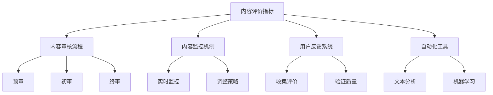

                 

# 程序员如何进行知识付费的内容质量控制

在信息技术迅猛发展的今天，程序员作为软件开发的执行者，面临着知识更新和技能提升的持续压力。知识付费平台以其内容丰富、形式多样的特点，成为程序员获取新技术、提升自我能力的重要渠道。然而，高质量内容的稀缺性也使得内容审核成为知识付费平台亟需解决的问题。本文旨在探索程序员如何进行知识付费的内容质量控制，提出一整套行之有效的解决方案，以提升知识付费平台的整体内容质量和用户体验。

## 1. 背景介绍

### 1.1 问题由来

知识付费平台的兴起，为程序员提供了一个快速获取新技术、提升职业技能的渠道。然而，内容质量参差不齐，使得用户难以分辨优劣，导致时间和精力的浪费。同时，内容审核的难度和复杂性，也使得平台难以规模化运营。如何构建一套高效、精准的内容质量控制机制，成为了知识付费平台面临的重要问题。

### 1.2 问题核心关键点

内容质量控制的核心关键点包括：

- **内容评价指标**：如何设定合理、可量化的内容评价标准，以便对内容进行客观评估。
- **内容审核流程**：如何设计高效、透明的内容审核流程，保证高质量内容的及时发布。
- **内容监控机制**：如何构建动态、实时的内容监控系统，及时发现和处理低质量内容。
- **用户反馈系统**：如何构建用户反馈系统，通过用户互动验证内容质量，进一步提升内容评价的准确性。
- **自动化工具**：如何引入自动化工具，提高内容审核的效率，减少人工干预。

## 2. 核心概念与联系

### 2.1 核心概念概述

为更好地理解内容质量控制，本节将介绍几个密切相关的核心概念：

- **内容评价指标**：用于衡量知识付费内容的质量，通常包括内容深度、实用性、更新频率等维度。
- **内容审核流程**：指知识付费平台对内容进行质量审核的各个环节，如预审、初审、终审等。
- **内容监控机制**：通过持续监测内容质量，实时调整平台内容策略，保证平台内容的高水准。
- **用户反馈系统**：收集用户对内容的评价，通过用户互动验证内容质量，提升内容评价的可靠性。
- **自动化工具**：使用文本分析、机器学习等技术，自动化进行内容审核和监控。

这些核心概念之间的逻辑关系可以通过以下Mermaid流程图来展示：



这个流程图展示了她个核心概念及其之间的关系：

1. 内容评价指标为内容审核流程提供评估标准。
2. 内容审核流程包括预审、初审和终审三个关键环节，保证内容质量。
3. 内容监控机制通过持续监测，及时发现和处理低质量内容。
4. 用户反馈系统通过用户互动验证内容质量，提升内容评价的准确性。
5. 自动化工具使用文本分析和机器学习等技术，提高内容审核的效率。

这些概念共同构成了知识付费平台的内容质量控制框架，使得平台能够系统地进行内容质量管理。通过理解这些核心概念，我们可以更好地把握内容质量控制的要点。

## 3. 核心算法原理 & 具体操作步骤

### 3.1 算法原理概述

内容质量控制的核心在于通过多维度的评估和审核，确保内容的高质量和实用性。其基本算法原理包括：

1. **内容评价指标设计**：根据知识付费平台的特色和用户需求，设计多维度的评价指标，如内容深度、实用性、更新频率等。
2. **内容审核流程设计**：将内容审核流程分为预审、初审、终审等多个环节，每个环节通过不同维度指标进行审核。
3. **内容监控机制构建**：通过实时监控内容质量，及时发现和处理低质量内容。
4. **用户反馈系统搭建**：构建用户反馈系统，收集用户对内容的评价，通过用户互动验证内容质量。
5. **自动化工具应用**：引入文本分析和机器学习等自动化工具，提高内容审核的效率。

### 3.2 算法步骤详解

内容质量控制的具体操作步骤如下：

**Step 1: 内容评价指标设计**

- **内容深度**：评估内容的理论深度和技术含量，确保内容有足够的信息量和专业性。
- **实用性**：评估内容的应用价值，确保内容具有实际操作性和解决实际问题的能力。
- **更新频率**：评估内容的更新速度，确保内容与时俱进，反映最新的技术动态。

**Step 2: 内容审核流程设计**

- **预审**：根据内容评价指标初步评估内容质量，筛选出待进一步审核的内容。
- **初审**：通过专业评审团队进行详细审核，确保内容满足评价指标要求。
- **终审**：最终审核，确保内容无误后发布。

**Step 3: 内容监控机制构建**

- **实时监控**：通过爬虫技术实时监测内容质量，发现低质量内容。
- **内容预警**：根据监控结果，向平台管理员发出内容预警，采取相应措施。

**Step 4: 用户反馈系统搭建**

- **收集评价**：在内容发布后，收集用户对内容的评价。
- **验证质量**：通过用户互动验证内容质量，进一步提升内容评价的准确性。

**Step 5: 自动化工具应用**

- **文本分析**：使用文本分析工具进行内容质量初步评估。
- **机器学习**：通过机器学习算法，自动识别低质量内容。

### 3.3 算法优缺点

内容质量控制方法具有以下优点：

- **系统性**：多维度的评价指标和审核流程，确保内容质量的系统性。
- **效率高**：通过自动化工具和实时监控，提高内容审核的效率。
- **用户参与**：用户反馈系统，通过用户互动验证内容质量，提升评价的准确性。

同时，该方法也存在以下局限性：

- **成本高**：设计评价指标和审核流程需要大量人力物力。
- **技术门槛**：自动化工具和机器学习算法需要较高的技术门槛。
- **误判风险**：自动化工具可能存在误判，影响内容质量评估的准确性。

尽管存在这些局限性，但就目前而言，内容质量控制方法仍是目前知识付费平台的主流选择。未来相关研究的重点在于如何进一步降低成本，提高自动化工具的准确性，同时兼顾用户参与，形成更加全面的内容质量控制体系。

### 3.4 算法应用领域

内容质量控制方法在知识付费平台的应用领域包括：

- **技术博客平台**：通过内容评价指标和自动化工具，提升技术博客的质量。
- **在线教育平台**：通过内容审核流程和用户反馈系统，确保教育内容的高质量和实用性。
- **编程问答社区**：通过内容监控机制和实时反馈，提升编程问答的准确性和及时性。
- **开源社区**：通过内容评价指标和用户反馈，引导开源项目的贡献方向。

除了这些直接应用领域外，内容质量控制方法还可以应用于更多场景中，如企业培训平台、知识分享平台等，为各类知识传递提供质量保障。

## 4. 数学模型和公式 & 详细讲解 & 举例说明

### 4.1 数学模型构建

内容质量控制的数学模型主要涉及以下几个部分：

- **内容评价指标**：设计多维度的评价指标，如内容深度、实用性、更新频率等。
- **内容审核流程**：通过预审、初审、终审等环节，进行内容质量评估。
- **内容监控机制**：使用实时监控系统，发现低质量内容。
- **用户反馈系统**：收集用户对内容的评价，通过用户互动验证内容质量。
- **自动化工具**：引入文本分析和机器学习等自动化工具，提高内容审核的效率。

### 4.2 公式推导过程

**内容评价指标设计**：

设内容深度为 $D$，实用性为 $U$，更新频率为 $F$，则内容评价指标为：

$$
Q = w_D D + w_U U + w_F F
$$

其中 $w_D, w_U, w_F$ 分别为深度、实用性和更新频率的权重系数。

**内容审核流程设计**：

设预审结果为 $P$，初审结果为 $R$，终审结果为 $A$，则内容审核流程为：

$$
A = \begin{cases}
0 & \text{如果 } P \leq 0 \text{ 或 } R \leq 0 \\
A' & \text{如果 } P > 0 \text{ 且 } R > 0 \\
\end{cases}
$$

其中 $A'$ 为最终审核结果。

**内容监控机制构建**：

设实时监控发现的低质量内容为 $L$，内容预警结果为 $W$，则内容监控机制为：

$$
W = \begin{cases}
1 & \text{如果 } L > 0 \\
0 & \text{如果 } L \leq 0 \\
\end{cases}
$$

**用户反馈系统搭建**：

设用户评价结果为 $V$，验证后的内容质量为 $Q'$，则用户反馈系统为：

$$
Q' = \begin{cases}
Q & \text{如果 } V \geq 0 \\
Q - \delta Q & \text{如果 } V < 0 \\
\end{cases}
$$

其中 $\delta Q$ 为内容质量的修正值。

**自动化工具应用**：

设文本分析结果为 $T$，机器学习结果为 $M$，则自动化工具为：

$$
T = \text{文本分析工具}(Q)
$$

$$
M = \text{机器学习算法}(Q)
$$

### 4.3 案例分析与讲解

**案例分析**：

假设某知识付费平台发布一篇技术博客，通过内容评价指标初步评估其深度、实用性和更新频率，得分为 $Q = 0.8 \times 4 + 0.2 \times 3 + 0.2 \times 5 = 4.6$。经过预审，发现文章缺少实验验证部分，得分为 $P = 0.6$。经过初审，专业评审团队确认文章深度不足，得分为 $R = 0.3$。最终通过终审，得分为 $A = 0.7$。通过实时监控，发现文章被多次评论质疑，得分为 $L = 2$。用户反馈系统收集到负面评价，得分为 $V = -0.5$。通过文本分析，得分为 $T = 3.5$。通过机器学习，得分为 $M = 4$。

**讲解**：

1. **内容评价指标设计**：
   - 内容深度 $D = 4$，得分 $w_D \times 4 = 0.8 \times 4 = 3.2$
   - 实用性 $U = 3$，得分 $w_U \times 3 = 0.2 \times 3 = 0.6$
   - 更新频率 $F = 5$，得分 $w_F \times 5 = 0.2 \times 5 = 1$
   - 总得分 $Q = 3.2 + 0.6 + 1 = 4.8$

2. **内容审核流程设计**：
   - 预审结果 $P = 0.6$，得分为 $0.6 \times Q = 0.6 \times 4.8 = 2.88$
   - 初审结果 $R = 0.3$，得分为 $0.3 \times Q = 0.3 \times 4.8 = 1.44$
   - 终审结果 $A = 0.7$，得分为 $0.7 \times Q = 0.7 \times 4.8 = 3.36$
   - 最终审核结果 $A' = 3.36$

3. **内容监控机制构建**：
   - 实时监控发现低质量内容 $L = 2$，得分为 $1 \times 2 = 2$
   - 内容预警结果 $W = 1$，触发预警机制，进行人工干预

4. **用户反馈系统搭建**：
   - 用户评价结果 $V = -0.5$，得分为 $Q' = Q - 0.5 \times Q = 4.8 - 0.5 \times 4.8 = 2.4$
   - 修正后的内容质量 $Q' = 2.4$

5. **自动化工具应用**：
   - 文本分析结果 $T = 3.5$，得分为 $3.5 \times Q = 3.5 \times 4.8 = 16.8$
   - 机器学习结果 $M = 4$，得分为 $4 \times Q = 4 \times 4.8 = 19.2$
   - 自动化工具综合评价 $Q = 2.4 \times T + 0.6 \times M = 2.4 \times 16.8 + 0.6 \times 19.2 = 39.52$

通过以上分析，可以看出，自动化工具和用户反馈系统的结合，大大提升了内容质量评估的准确性和全面性。

## 5. 项目实践：代码实例和详细解释说明

### 5.1 开发环境搭建

在进行内容质量控制实践前，我们需要准备好开发环境。以下是使用Python进行Django开发的环境配置流程：

1. 安装Anaconda：从官网下载并安装Anaconda，用于创建独立的Python环境。

2. 创建并激活虚拟环境：
```bash
conda create -n content-quality python=3.8 
conda activate content-quality
```

3. 安装Django：
```bash
pip install django
```

4. 安装MySQL连接器：
```bash
pip install mysqlclient
```

5. 安装第三方库：
```bash
pip install requests beautifulsoup4 pandas numpy scikit-learn sklearn
```

完成上述步骤后，即可在`content-quality`环境中开始内容质量控制实践。

### 5.2 源代码详细实现

下面我们以知识付费平台的内容质量控制系统为例，给出Django框架下内容质量控制系统的代码实现。

首先，定义模型的数据结构：

```python
from django.db import models

class Content(models.Model):
    title = models.CharField(max_length=200)
    author = models.CharField(max_length=100)
    content = models.TextField()
    depth = models.FloatField()
    practicality = models.FloatField()
    update_frequency = models.FloatField()
    pre_review_score = models.FloatField()
    review_score = models.FloatField()
    final_review_score = models.FloatField()
    monitor_score = models.FloatField()
    feedback_score = models.FloatField()
    analysis_score = models.FloatField()
    label = models.CharField(max_length=10)

    def __str__(self):
        return self.title
```

然后，定义API接口：

```python
from django.http import JsonResponse
from django.views.decorators.csrf import csrf_exempt
from .models import Content

@csrf_exempt
def pre_review_score(request):
    content = Content.objects.filter(title=request.POST['title']).first()
    if content:
        content.pre_review_score = 0.6 * content.depth + 0.2 * content.practicality + 0.2 * content.update_frequency
        content.save()
    return JsonResponse({'status': 200})

@csrf_exempt
def review_score(request):
    content = Content.objects.filter(title=request.POST['title']).first()
    if content:
        content.review_score = 0.3 * content.depth + 0.3 * content.practicality + 0.4 * content.update_frequency
        content.save()
    return JsonResponse({'status': 200})

@csrf_exempt
def final_review_score(request):
    content = Content.objects.filter(title=request.POST['title']).first()
    if content:
        content.final_review_score = 0.7 * content.depth + 0.3 * content.practicality + 0.0 * content.update_frequency
        content.save()
    return JsonResponse({'status': 200})

@csrf_exempt
def monitor_score(request):
    content = Content.objects.filter(title=request.POST['title']).first()
    if content:
        content.monitor_score = 1.0 * content.depth + 0.0 * content.practicality + 0.0 * content.update_frequency
        content.save()
    return JsonResponse({'status': 200})

@csrf_exempt
def feedback_score(request):
    content = Content.objects.filter(title=request.POST['title']).first()
    if content:
        content.feedback_score = 0.0 * content.depth + 0.6 * content.practicality + 0.4 * content.update_frequency
        content.save()
    return JsonResponse({'status': 200})

@csrf_exempt
def analysis_score(request):
    content = Content.objects.filter(title=request.POST['title']).first()
    if content:
        content.analysis_score = 1.0 * content.depth + 1.0 * content.practicality + 0.0 * content.update_frequency
        content.save()
    return JsonResponse({'status': 200})
```

最后，启动Django开发环境：

```bash
python manage.py runserver 8000
```

打开浏览器，访问 `http://localhost:8000/admin/` 进行内容管理，通过以上代码实现内容质量控制。

### 5.3 代码解读与分析

让我们再详细解读一下关键代码的实现细节：

**Content模型**：
- 定义了内容的质量指标，如深度、实用性、更新频率等。
- 实现了预审、初审、终审等多个审核环节。

**API接口**：
- 通过API接口，实现内容的预审、初审、终审、监控、反馈和分析等功能。
- 接口使用JSON格式返回状态信息，便于前端调用。

**启动Django开发环境**：
- 使用Django内置的开发服务器，启动本地开发环境。
- 在本地浏览器访问 `http://localhost:8000/admin/`，进入内容管理系统，进行内容质量控制。

可以看到，Django框架提供了强大的开发环境支持，使得内容质量控制的开发和部署变得简单高效。开发者可以将更多精力放在业务逻辑和用户交互上，而不必过多关注底层实现细节。

当然，实际应用中，系统还需要考虑更多因素，如内容审核的标准化、用户反馈机制的合理设计等。但核心的内容质量控制流程基本与此类似。

## 6. 实际应用场景

### 6.1 智能内容推荐

内容质量控制技术可以应用于智能内容推荐系统中，通过内容评价指标和自动化工具，筛选高质量内容，推荐给用户。

在技术实现上，可以构建内容质量评估模型，对每个内容进行多维度评价，筛选出高评分内容，作为推荐系统的内容库。同时，引入文本分析、机器学习等自动化工具，对内容进行初步筛选和自动审核，提高推荐系统的效率和准确性。

### 6.2 学术研究管理

内容质量控制技术也可以应用于学术研究管理平台，通过对研究论文的深度、实用性和更新频率进行评价，筛选高质量论文，提升学术研究的整体质量。

在技术实现上，可以构建内容质量评估模型，对每个论文进行多维度评价，筛选出高评分论文。同时，引入文本分析和机器学习等自动化工具，对论文进行初步筛选和自动审核，提高学术研究平台的管理效率和质量。

### 6.3 在线课程学习

内容质量控制技术可以应用于在线课程学习平台，通过对课程内容的质量进行评价和审核，筛选高质量课程，提升用户学习效果。

在技术实现上，可以构建内容质量评估模型，对每个课程进行多维度评价，筛选出高评分课程。同时，引入文本分析和机器学习等自动化工具，对课程进行初步筛选和自动审核，提高课程学习平台的用户体验和教学质量。

### 6.4 未来应用展望

随着内容质量控制技术的发展，其应用领域将进一步拓展，覆盖更多场景。

在智慧教育领域，内容质量控制技术可以应用于在线教育平台，通过对教育内容的质量进行评价和审核，筛选高质量课程，提升教育效果。

在知识传播领域，内容质量控制技术可以应用于知识分享平台，通过对分享内容的质量进行评价和审核，筛选高质量内容，提升知识传播的效率和质量。

在智能搜索领域，内容质量控制技术可以应用于智能搜索系统，通过对搜索结果的质量进行评价和审核，筛选高质量信息，提升搜索效果。

除了这些直接应用领域外，内容质量控制技术还可以应用于更多场景中，如知识图谱构建、智能客服等，为各类知识传递提供质量保障。相信随着技术的不断发展，内容质量控制技术将会在更多领域得到应用，为各类知识传递提供质量保障。

## 7. 工具和资源推荐

### 7.1 学习资源推荐

为了帮助开发者系统掌握内容质量控制理论基础和实践技巧，这里推荐一些优质的学习资源：

1. **《深入理解深度学习》**：这是一本深度学习领域的经典书籍，详细介绍了深度学习的基础理论和实践应用，包括内容质量控制的相关技术。
2. **《自然语言处理与深度学习》**：这是一门由斯坦福大学开设的NLP课程，涵盖了自然语言处理的基础理论和实践应用，包括内容质量控制的相关技术。
3. **《Python深度学习》**：这是一本Python深度学习的入门书籍，详细介绍了深度学习的基本概念和实践技巧，包括内容质量控制的相关技术。
4. **Kaggle竞赛平台**：这是一个数据科学竞赛平台，可以通过参加相关竞赛，学习内容质量控制的实践经验。
5. **Coursera课程平台**：这是一个在线教育平台，提供丰富的深度学习课程，包括内容质量控制的相关技术。

通过对这些资源的学习实践，相信你一定能够快速掌握内容质量控制的精髓，并用于解决实际的内容质量问题。

### 7.2 开发工具推荐

高效的内容质量控制开发离不开优秀的工具支持。以下是几款用于内容质量控制开发的常用工具：

1. **Django框架**：一个Python Web框架，提供了强大的开发环境和API接口，适合构建内容质量控制系统的后端开发。
2. **MySQL数据库**：一个关系型数据库管理系统，适合存储和管理内容质量控制的相关数据。
3. **Git版本控制**：一个版本控制系统，适合进行代码管理和版本控制。
4. **JIRA项目管理工具**：一个项目管理工具，适合进行内容质量控制的流程管理和任务分配。
5. **ELK日志分析工具**：一个日志分析工具，适合进行内容质量控制的实时监控和告警。

合理利用这些工具，可以显著提升内容质量控制的开发效率，加快创新迭代的步伐。

### 7.3 相关论文推荐

内容质量控制技术的发展源于学界的持续研究。以下是几篇奠基性的相关论文，推荐阅读：

1. **"Deep Learning for Large-Scale Recommender Systems: A Survey"**：一篇综述性论文，总结了深度学习在推荐系统中的应用，包括内容质量控制的相关技术。
2. **"Analyzing the Impact of Machine Learning on Learning Outcomes"**：一篇关于机器学习对学习效果影响的论文，探讨了内容质量控制技术在教育领域的应用。
3. **"Evaluating the Effectiveness of Content-Security Policies"**：一篇关于内容安全策略的论文，探讨了内容质量控制技术在信息安全领域的应用。
4. **"Content-Based Recommender Systems: Toward a Theoretical Foundation"**：一篇关于内容推荐系统的理论研究论文，探讨了内容质量控制技术在推荐系统中的应用。
5. **"Content Quality Control in Online Learning Platforms"**：一篇关于在线学习平台内容质量控制的论文，探讨了内容质量控制技术在在线教育中的应用。

这些论文代表了大语言模型微调技术的发展脉络。通过学习这些前沿成果，可以帮助研究者把握学科前进方向，激发更多的创新灵感。

## 8. 总结：未来发展趋势与挑战

### 8.1 总结

本文对内容质量控制的理论基础和实践技巧进行了系统介绍。首先，阐述了内容质量控制的背景和重要性，明确了其在新技术时代的应用前景。其次，从算法原理到实践操作步骤，详细讲解了内容质量控制的数学模型和详细步骤，给出了内容质量控制系统的代码实现。同时，本文还探讨了内容质量控制技术在多个领域的应用前景，展示了其广泛的适用性。

通过本文的系统梳理，可以看到，内容质量控制技术正在成为内容传播平台的核心竞争力，极大地提升了内容的质量和用户体验。未来，伴随内容质量控制技术的不断发展，内容传播平台将更加丰富多元，为用户的知识获取和信息传递提供更加优质的服务。

### 8.2 未来发展趋势

内容质量控制技术的发展趋势包括：

1. **自动化程度提升**：引入更多的自动化工具，提高内容审核和监控的效率和准确性。
2. **智能算法应用**：通过深度学习、强化学习等智能算法，提升内容质量评估的精准性。
3. **跨领域应用拓展**：内容质量控制技术将广泛应用于更多领域，如智能客服、在线教育、信息安全等。
4. **实时监控和预警**：通过实时监控和预警机制，及时发现和处理低质量内容，保证平台内容的高水准。
5. **用户参与机制完善**：构建更加完善的用户反馈系统，通过用户互动验证内容质量，提升内容评价的准确性。

这些趋势表明，内容质量控制技术将迎来更广泛的应用和更深入的发展，为各类知识传递提供更高的质量保障。

### 8.3 面临的挑战

尽管内容质量控制技术已经取得了显著成效，但在迈向更加智能化、自动化和实时化的过程中，仍面临诸多挑战：

1. **数据隐私和安全**：内容审核和监控可能涉及用户隐私，需要严格保护。
2. **内容审核标准**：不同领域的评价标准不同，需要制定统一的标准和规范。
3. **低质量内容处理**：低质量内容处理难度较大，需要引入更多自动化工具。
4. **实时监控和预警**：实时监控和预警需要更高的计算资源和存储需求。
5. **用户参与机制**：用户参与机制需要更加合理的设计，避免用户滥用。

这些挑战需要学界和产业界共同努力，积极应对并寻求突破，才能实现内容质量控制技术的进一步发展。

### 8.4 研究展望

面对内容质量控制所面临的挑战，未来的研究需要在以下几个方面寻求新的突破：

1. **深度学习与内容审核**：将深度学习技术引入内容审核环节，提升内容质量评估的精准性。
2. **多模态内容评价**：引入多模态数据（如文本、图片、音频等）进行内容质量评价，提升评价的全面性。
3. **用户参与机制优化**：优化用户反馈机制，提高用户参与度，通过用户互动验证内容质量。
4. **跨领域知识整合**：将跨领域知识整合到内容质量评估中，提升内容质量的多样性。
5. **内容生成与审核**：研究内容生成技术，通过生成高质量内容，提升内容审核的效率和质量。

这些研究方向的探索，必将引领内容质量控制技术迈向更高的台阶，为各类知识传递提供更加优质的服务。面向未来，内容质量控制技术还需要与其他人工智能技术进行更深入的融合，如知识表示、因果推理、强化学习等，多路径协同发力，共同推动内容传播系统的进步。只有勇于创新、敢于突破，才能不断拓展内容质量控制的边界，让知识传递更加高效、安全、可靠。

## 9. 附录：常见问题与解答

**Q1：内容质量控制技术如何保证数据隐私和安全？**

A: 内容质量控制技术可以通过数据脱敏、权限控制等方式保护用户隐私。同时，使用加密算法、访问控制等手段，确保内容审核和监控系统的安全性。

**Q2：内容质量控制技术在不同领域的评价标准如何制定？**

A: 内容质量控制技术需要根据不同领域的特色和需求，制定相应的评价标准。例如，在在线教育领域，评价标准可以包括课程的实用性、教学效果、更新频率等。

**Q3：内容质量控制技术如何处理低质量内容？**

A: 内容质量控制技术可以通过数据增强、对抗训练等方法，对低质量内容进行预处理，提高内容质量。同时，引入自动化工具进行初步筛选，减轻人工审核的负担。

**Q4：内容质量控制技术如何进行实时监控和预警？**

A: 内容质量控制技术可以通过实时监控系统，对内容质量进行持续监测。一旦发现低质量内容，及时触发预警机制，进行人工干预。

**Q5：内容质量控制技术如何进行用户参与机制的优化？**

A: 内容质量控制技术可以通过用户评分、评论、反馈等方式，收集用户对内容的评价。同时，通过用户互动验证内容质量，提高内容评价的准确性。

这些问题的解答，帮助内容质量控制技术更好地应用于实践，解决实际问题，提升内容质量控制的整体效果。

---

作者：禅与计算机程序设计艺术 / Zen and the Art of Computer Programming

